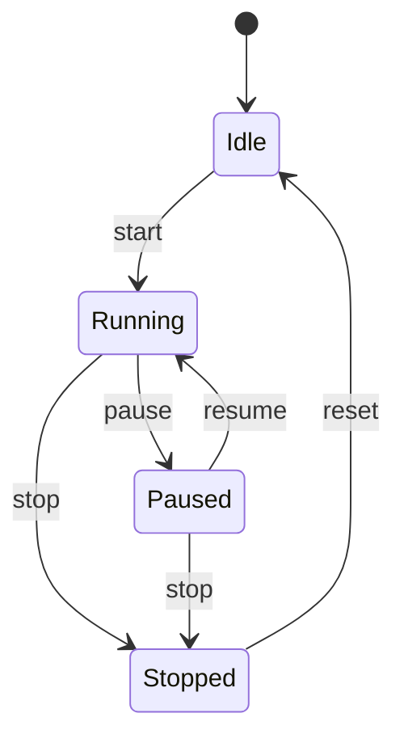

# 04-状态模式 (State Pattern)

## 目录

- [04-状态模式 (State Pattern)](#04-状态模式-state-pattern)
  - [目录](#目录)
  - [1. 概述](#1-概述)
    - [1.1 定义](#11-定义)
    - [1.2 核心思想](#12-核心思想)
    - [1.3 设计原则](#13-设计原则)
  - [2. 形式化定义](#2-形式化定义)
    - [2.1 状态机定义](#21-状态机定义)
    - [2.2 状态接口定义](#22-状态接口定义)
    - [2.3 上下文定义](#23-上下文定义)
  - [3. 数学基础](#3-数学基础)
    - [3.1 有限状态机理论](#31-有限状态机理论)
    - [3.2 状态转换图](#32-状态转换图)
    - [3.3 状态不变性](#33-状态不变性)
  - [4. 模式结构](#4-模式结构)
    - [4.1 UML类图](#41-uml类图)
    - [4.2 状态转换图](#42-状态转换图)
  - [5. Go语言实现](#5-go语言实现)
    - [5.1 基础实现](#51-基础实现)
    - [5.2 高级实现：状态机](#52-高级实现状态机)
    - [5.3 状态模式应用：订单系统](#53-状态模式应用订单系统)
    - [5.4 使用示例](#54-使用示例)
  - [6. 应用场景](#6-应用场景)
    - [6.1 游戏状态管理](#61-游戏状态管理)
    - [6.2 网络连接状态](#62-网络连接状态)
    - [6.3 工作流状态](#63-工作流状态)
  - [7. 性能分析](#7-性能分析)
    - [7.1 时间复杂度分析](#71-时间复杂度分析)
    - [7.2 内存使用分析](#72-内存使用分析)
    - [7.3 基准测试](#73-基准测试)
  - [8. 最佳实践](#8-最佳实践)
    - [8.1 设计原则](#81-设计原则)
    - [8.2 实现建议](#82-实现建议)
    - [8.3 错误处理](#83-错误处理)
  - [9. 相关模式](#9-相关模式)
    - [9.1 与策略模式的关系](#91-与策略模式的关系)
    - [9.2 与命令模式的关系](#92-与命令模式的关系)
    - [9.3 与观察者模式的关系](#93-与观察者模式的关系)
  - [10. 总结](#10-总结)
    - [10.1 优势](#101-优势)
    - [10.2 劣势](#102-劣势)
    - [10.3 适用场景](#103-适用场景)
    - [10.4 数学证明](#104-数学证明)

## 1. 概述

### 1.1 定义

状态模式是一种行为型设计模式，它允许对象在内部状态改变时改变其行为，使对象看起来好像修改了其类。

### 1.2 核心思想

状态模式的核心思想是：

- **状态封装**：将状态相关的行为封装在独立的状态类中
- **状态转换**：通过状态对象控制状态转换逻辑
- **行为变化**：对象的行为随状态变化而变化

### 1.3 设计原则

```go
// 单一职责原则：每个状态类只负责一种状态的行为
// 开闭原则：新增状态不影响现有代码
// 依赖倒置原则：依赖抽象而非具体实现
```

## 2. 形式化定义

### 2.1 状态机定义

设 $S$ 为状态集合，$E$ 为事件集合，$T$ 为转换函数，则状态机可形式化为：

$$\text{State Machine} = (S, E, T, s_0)$$

其中：

- $S = \{s_1, s_2, ..., s_n\}$ 为状态集合
- $E = \{e_1, e_2, ..., e_m\}$ 为事件集合
- $T: S \times E \rightarrow S$ 为状态转换函数
- $s_0 \in S$ 为初始状态

### 2.2 状态接口定义

```go
// 状态接口
type State interface {
    Handle(context Context) error
    Enter(context Context) error
    Exit(context Context) error
    GetName() string
}
```

### 2.3 上下文定义

```go
// 上下文
type Context struct {
    state State
    data  map[string]interface{}
}

func NewContext(initialState State) *Context {
    return &Context{
        state: initialState,
        data:  make(map[string]interface{}),
    }
}

func (c *Context) SetState(state State) error {
    if c.state != nil {
        if err := c.state.Exit(c); err != nil {
            return err
        }
    }
    
    oldState := c.state
    c.state = state
    
    if err := c.state.Enter(c); err != nil {
        c.state = oldState
        return err
    }
    
    return nil
}

func (c *Context) Handle() error {
    return c.state.Handle(c)
}

func (c *Context) GetData(key string) interface{} {
    return c.data[key]
}

func (c *Context) SetData(key string, value interface{}) {
    c.data[key] = value
}
```

## 3. 数学基础

### 3.1 有限状态机理论

状态模式基于有限状态机（FSM）理论：

$$M = (Q, \Sigma, \delta, q_0, F)$$

其中：

- $Q$ 为有限状态集合
- $\Sigma$ 为有限输入字母表
- $\delta: Q \times \Sigma \rightarrow Q$ 为状态转移函数
- $q_0 \in Q$ 为初始状态
- $F \subseteq Q$ 为接受状态集合

### 3.2 状态转换图

状态转换可以用有向图表示：

$$G = (V, E)$$

其中：

- $V$ 为顶点集合（状态）
- $E$ 为边集合（转换）

### 3.3 状态不变性

对于状态 $s$ 和事件 $e$，状态转换满足：

$$\forall s \in S, \forall e \in E: \delta(s, e) \in S$$

## 4. 模式结构

### 4.1 UML类图

```mermaid
classDiagram
    class State {
        <<interface>>
        +Handle(context) error
        +Enter(context) error
        +Exit(context) error
        +GetName() string
    }
    
    class ConcreteStateA {
        +Handle(context) error
        +Enter(context) error
        +Exit(context) error
        +GetName() string
    }
    
    class ConcreteStateB {
        +Handle(context) error
        +Enter(context) error
        +Exit(context) error
        +GetName() string
    }
    
    class Context {
        -state: State
        -data: map[string]interface{}
        +SetState(state)
        +Handle() error
        +GetData(key) interface{}
        +SetData(key, value)
    }
    
    State <|.. ConcreteStateA
    State <|.. ConcreteStateB
    Context o-- State
```

### 4.2 状态转换图



## 5. Go语言实现

### 5.1 基础实现

```go
package state

import (
    "fmt"
    "time"
)

// 状态接口
type State interface {
    Handle(context Context) error
    Enter(context Context) error
    Exit(context Context) error
    GetName() string
}

// 上下文
type Context struct {
    state State
    data  map[string]interface{}
}

func NewContext(initialState State) *Context {
    return &Context{
        state: initialState,
        data:  make(map[string]interface{}),
    }
}

func (c *Context) SetState(state State) error {
    if c.state != nil {
        if err := c.state.Exit(c); err != nil {
            return err
        }
    }
    
    oldState := c.state
    c.state = state
    
    if err := c.state.Enter(c); err != nil {
        c.state = oldState
        return err
    }
    
    return nil
}

func (c *Context) Handle() error {
    return c.state.Handle(c)
}

func (c *Context) GetData(key string) interface{} {
    return c.data[key]
}

func (c *Context) SetData(key string, value interface{}) {
    c.data[key] = value
}

func (c *Context) GetCurrentState() State {
    return c.state
}

// 具体状态：空闲状态
type IdleState struct{}

func NewIdleState() *IdleState {
    return &IdleState{}
}

func (i *IdleState) Handle(context Context) error {
    fmt.Println("Idle state: waiting for commands...")
    return nil
}

func (i *IdleState) Enter(context Context) error {
    fmt.Println("Entering idle state")
    context.SetData("lastIdleTime", time.Now())
    return nil
}

func (i *IdleState) Exit(context Context) error {
    fmt.Println("Exiting idle state")
    return nil
}

func (i *IdleState) GetName() string {
    return "Idle"
}

// 具体状态：运行状态
type RunningState struct{}

func NewRunningState() *RunningState {
    return &RunningState{}
}

func (r *RunningState) Handle(context Context) error {
    fmt.Println("Running state: processing tasks...")
    return nil
}

func (r *RunningState) Enter(context Context) error {
    fmt.Println("Entering running state")
    context.SetData("startTime", time.Now())
    return nil
}

func (r *RunningState) Exit(context Context) error {
    fmt.Println("Exiting running state")
    if startTime, ok := context.GetData("startTime").(time.Time); ok {
        duration := time.Since(startTime)
        fmt.Printf("Running duration: %v\n", duration)
    }
    return nil
}

func (r *RunningState) GetName() string {
    return "Running"
}

// 具体状态：暂停状态
type PausedState struct{}

func NewPausedState() *PausedState {
    return &PausedState{}
}

func (p *PausedState) Handle(context Context) error {
    fmt.Println("Paused state: waiting for resume...")
    return nil
}

func (p *PausedState) Enter(context Context) error {
    fmt.Println("Entering paused state")
    context.SetData("pauseTime", time.Now())
    return nil
}

func (p *PausedState) Exit(context Context) error {
    fmt.Println("Exiting paused state")
    return nil
}

func (p *PausedState) GetName() string {
    return "Paused"
}

// 具体状态：停止状态
type StoppedState struct{}

func NewStoppedState() *StoppedState {
    return &StoppedState{}
}

func (s *StoppedState) Handle(context Context) error {
    fmt.Println("Stopped state: system halted")
    return nil
}

func (s *StoppedState) Enter(context Context) error {
    fmt.Println("Entering stopped state")
    context.SetData("stopTime", time.Now())
    return nil
}

func (s *StoppedState) Exit(context Context) error {
    fmt.Println("Exiting stopped state")
    return nil
}

func (s *StoppedState) GetName() string {
    return "Stopped"
}
```

### 5.2 高级实现：状态机

```go
package state

import (
    "fmt"
    "sync"
)

// 状态机
type StateMachine struct {
    currentState State
    states       map[string]State
    transitions  map[string]map[string]string
    context      Context
    mutex        sync.RWMutex
}

func NewStateMachine(initialState State) *StateMachine {
    sm := &StateMachine{
        currentState: initialState,
        states:       make(map[string]State),
        transitions:  make(map[string]map[string]string),
        context:      *NewContext(initialState),
    }
    
    sm.states[initialState.GetName()] = initialState
    return sm
}

func (sm *StateMachine) AddState(state State) {
    sm.mutex.Lock()
    defer sm.mutex.Unlock()
    sm.states[state.GetName()] = state
}

func (sm *StateMachine) AddTransition(fromState, event, toState string) {
    sm.mutex.Lock()
    defer sm.mutex.Unlock()
    
    if sm.transitions[fromState] == nil {
        sm.transitions[fromState] = make(map[string]string)
    }
    sm.transitions[fromState][event] = toState
}

func (sm *StateMachine) Trigger(event string) error {
    sm.mutex.Lock()
    defer sm.mutex.Unlock()
    
    currentStateName := sm.currentState.GetName()
    transitions, exists := sm.transitions[currentStateName]
    if !exists {
        return fmt.Errorf("no transitions defined for state %s", currentStateName)
    }
    
    toStateName, exists := transitions[event]
    if !exists {
        return fmt.Errorf("no transition defined for event %s in state %s", 
            event, currentStateName)
    }
    
    toState, exists := sm.states[toStateName]
    if !exists {
        return fmt.Errorf("state %s not found", toStateName)
    }
    
    return sm.context.SetState(toState)
}

func (sm *StateMachine) GetCurrentState() State {
    sm.mutex.RLock()
    defer sm.mutex.RUnlock()
    return sm.currentState
}

func (sm *StateMachine) Handle() error {
    sm.mutex.RLock()
    defer sm.mutex.RUnlock()
    return sm.currentState.Handle(sm.context)
}

// 事件定义
type Event struct {
    Name      string
    Timestamp time.Time
    Data      map[string]interface{}
}

func NewEvent(name string) *Event {
    return &Event{
        Name:      name,
        Timestamp: time.Now(),
        Data:      make(map[string]interface{}),
    }
}

func (e *Event) SetData(key string, value interface{}) {
    e.Data[key] = value
}

// 事件驱动的状态机
type EventDrivenStateMachine struct {
    *StateMachine
    eventQueue chan *Event
    stop       chan struct{}
}

func NewEventDrivenStateMachine(initialState State, queueSize int) *EventDrivenStateMachine {
    edsm := &EventDrivenStateMachine{
        StateMachine: NewStateMachine(initialState),
        eventQueue:   make(chan *Event, queueSize),
        stop:         make(chan struct{}),
    }
    
    go edsm.processEvents()
    return edsm
}

func (edsm *EventDrivenStateMachine) SendEvent(event *Event) {
    edsm.eventQueue <- event
}

func (edsm *EventDrivenStateMachine) processEvents() {
    for {
        select {
        case event := <-edsm.eventQueue:
            if err := edsm.Trigger(event.Name); err != nil {
                fmt.Printf("Failed to process event %s: %v\n", event.Name, err)
            }
        case <-edsm.stop:
            return
        }
    }
}

func (edsm *EventDrivenStateMachine) Stop() {
    close(edsm.stop)
}
```

### 5.3 状态模式应用：订单系统

```go
package state

import (
    "fmt"
    "time"
)

// 订单状态接口
type OrderState interface {
    State
    CanCancel() bool
    CanPay() bool
    CanShip() bool
    CanDeliver() bool
}

// 订单上下文
type OrderContext struct {
    *Context
    orderID   string
    amount    float64
    customer  string
}

func NewOrderContext(orderID string, amount float64, customer string) *OrderContext {
    return &OrderContext{
        Context:  NewContext(NewPendingState()),
        orderID:  orderID,
        amount:   amount,
        customer: customer,
    }
}

// 待支付状态
type PendingState struct{}

func NewPendingState() *PendingState {
    return &PendingState{}
}

func (p *PendingState) Handle(context Context) error {
    fmt.Printf("Order %s is pending payment\n", 
        context.GetData("orderID"))
    return nil
}

func (p *PendingState) Enter(context Context) error {
    fmt.Printf("Order %s entered pending state\n", 
        context.GetData("orderID"))
    return nil
}

func (p *PendingState) Exit(context Context) error {
    fmt.Printf("Order %s exited pending state\n", 
        context.GetData("orderID"))
    return nil
}

func (p *PendingState) GetName() string {
    return "Pending"
}

func (p *PendingState) CanCancel() bool {
    return true
}

func (p *PendingState) CanPay() bool {
    return true
}

func (p *PendingState) CanShip() bool {
    return false
}

func (p *PendingState) CanDeliver() bool {
    return false
}

// 已支付状态
type PaidState struct{}

func NewPaidState() *PaidState {
    return &PaidState{}
}

func (p *PaidState) Handle(context Context) error {
    fmt.Printf("Order %s is paid and ready for shipping\n", 
        context.GetData("orderID"))
    return nil
}

func (p *PaidState) Enter(context Context) error {
    fmt.Printf("Order %s entered paid state\n", 
        context.GetData("orderID"))
    context.SetData("paidTime", time.Now())
    return nil
}

func (p *PaidState) Exit(context Context) error {
    fmt.Printf("Order %s exited paid state\n", 
        context.GetData("orderID"))
    return nil
}

func (p *PaidState) GetName() string {
    return "Paid"
}

func (p *PaidState) CanCancel() bool {
    return false
}

func (p *PaidState) CanPay() bool {
    return false
}

func (p *PaidState) CanShip() bool {
    return true
}

func (p *PaidState) CanDeliver() bool {
    return false
}

// 已发货状态
type ShippedState struct{}

func NewShippedState() *ShippedState {
    return &ShippedState{}
}

func (s *ShippedState) Handle(context Context) error {
    fmt.Printf("Order %s is shipped and in transit\n", 
        context.GetData("orderID"))
    return nil
}

func (s *ShippedState) Enter(context Context) error {
    fmt.Printf("Order %s entered shipped state\n", 
        context.GetData("orderID"))
    context.SetData("shippedTime", time.Now())
    return nil
}

func (s *ShippedState) Exit(context Context) error {
    fmt.Printf("Order %s exited shipped state\n", 
        context.GetData("orderID"))
    return nil
}

func (s *ShippedState) GetName() string {
    return "Shipped"
}

func (s *ShippedState) CanCancel() bool {
    return false
}

func (s *ShippedState) CanPay() bool {
    return false
}

func (s *ShippedState) CanShip() bool {
    return false
}

func (s *ShippedState) CanDeliver() bool {
    return true
}

// 已送达状态
type DeliveredState struct{}

func NewDeliveredState() *DeliveredState {
    return &DeliveredState{}
}

func (d *DeliveredState) Handle(context Context) error {
    fmt.Printf("Order %s has been delivered\n", 
        context.GetData("orderID"))
    return nil
}

func (d *DeliveredState) Enter(context Context) error {
    fmt.Printf("Order %s entered delivered state\n", 
        context.GetData("orderID"))
    context.SetData("deliveredTime", time.Now())
    return nil
}

func (d *DeliveredState) Exit(context Context) error {
    fmt.Printf("Order %s exited delivered state\n", 
        context.GetData("orderID"))
    return nil
}

func (d *DeliveredState) GetName() string {
    return "Delivered"
}

func (d *DeliveredState) CanCancel() bool {
    return false
}

func (d *DeliveredState) CanPay() bool {
    return false
}

func (d *DeliveredState) CanShip() bool {
    return false
}

func (d *DeliveredState) CanDeliver() bool {
    return false
}

// 已取消状态
type CancelledState struct{}

func NewCancelledState() *CancelledState {
    return &CancelledState{}
}

func (c *CancelledState) Handle(context Context) error {
    fmt.Printf("Order %s has been cancelled\n", 
        context.GetData("orderID"))
    return nil
}

func (c *CancelledState) Enter(context Context) error {
    fmt.Printf("Order %s entered cancelled state\n", 
        context.GetData("orderID"))
    context.SetData("cancelledTime", time.Now())
    return nil
}

func (c *CancelledState) Exit(context Context) error {
    fmt.Printf("Order %s exited cancelled state\n", 
        context.GetData("orderID"))
    return nil
}

func (c *CancelledState) GetName() string {
    return "Cancelled"
}

func (c *CancelledState) CanCancel() bool {
    return false
}

func (c *CancelledState) CanPay() bool {
    return false
}

func (c *CancelledState) CanShip() bool {
    return false
}

func (c *CancelledState) CanDeliver() bool {
    return false
}
```

### 5.4 使用示例

```go
package main

import (
    "fmt"
    "time"
    "./state"
)

func main() {
    // 基础状态模式示例
    fmt.Println("=== 基础状态模式示例 ===")
    
    idleState := state.NewIdleState()
    context := state.NewContext(idleState)
    
    // 状态转换
    context.Handle()
    
    runningState := state.NewRunningState()
    context.SetState(runningState)
    context.Handle()
    
    pausedState := state.NewPausedState()
    context.SetState(pausedState)
    context.Handle()
    
    stoppedState := state.NewStoppedState()
    context.SetState(stoppedState)
    context.Handle()
    
    // 状态机示例
    fmt.Println("\n=== 状态机示例 ===")
    
    sm := state.NewStateMachine(state.NewIdleState())
    
    // 添加状态
    sm.AddState(state.NewRunningState())
    sm.AddState(state.NewPausedState())
    sm.AddState(state.NewStoppedState())
    
    // 添加转换
    sm.AddTransition("Idle", "start", "Running")
    sm.AddTransition("Running", "pause", "Paused")
    sm.AddTransition("Running", "stop", "Stopped")
    sm.AddTransition("Paused", "resume", "Running")
    sm.AddTransition("Paused", "stop", "Stopped")
    sm.AddTransition("Stopped", "reset", "Idle")
    
    // 触发事件
    sm.Trigger("start")
    sm.Handle()
    
    sm.Trigger("pause")
    sm.Handle()
    
    sm.Trigger("resume")
    sm.Handle()
    
    sm.Trigger("stop")
    sm.Handle()
    
    // 事件驱动状态机示例
    fmt.Println("\n=== 事件驱动状态机示例 ===")
    
    edsm := state.NewEventDrivenStateMachine(state.NewIdleState(), 10)
    
    // 添加状态和转换
    edsm.AddState(state.NewRunningState())
    edsm.AddState(state.NewPausedState())
    edsm.AddState(state.NewStoppedState())
    
    edsm.AddTransition("Idle", "start", "Running")
    edsm.AddTransition("Running", "pause", "Paused")
    edsm.AddTransition("Running", "stop", "Stopped")
    edsm.AddTransition("Paused", "resume", "Running")
    edsm.AddTransition("Paused", "stop", "Stopped")
    edsm.AddTransition("Stopped", "reset", "Idle")
    
    // 发送事件
    edsm.SendEvent(state.NewEvent("start"))
    edsm.SendEvent(state.NewEvent("pause"))
    edsm.SendEvent(state.NewEvent("resume"))
    edsm.SendEvent(state.NewEvent("stop"))
    
    time.Sleep(1 * time.Second)
    edsm.Stop()
    
    // 订单系统示例
    fmt.Println("\n=== 订单系统示例 ===")
    
    orderContext := state.NewOrderContext("ORD-001", 100.50, "Alice")
    
    // 订单状态转换
    fmt.Printf("Current state: %s\n", 
        orderContext.GetCurrentState().GetName())
    
    // 支付
    paidState := state.NewPaidState()
    orderContext.SetState(paidState)
    fmt.Printf("Current state: %s\n", 
        orderContext.GetCurrentState().GetName())
    
    // 发货
    shippedState := state.NewShippedState()
    orderContext.SetState(shippedState)
    fmt.Printf("Current state: %s\n", 
        orderContext.GetCurrentState().GetName())
    
    // 送达
    deliveredState := state.NewDeliveredState()
    orderContext.SetState(deliveredState)
    fmt.Printf("Current state: %s\n", 
        orderContext.GetCurrentState().GetName())
}
```

## 6. 应用场景

### 6.1 游戏状态管理

```go
// 游戏角色状态
type GameCharacter struct {
    context *Context
    name    string
    health  int
}

func NewGameCharacter(name string) *GameCharacter {
    gc := &GameCharacter{
        context: state.NewContext(state.NewIdleState()),
        name:    name,
        health:  100,
    }
    return gc
}

func (gc *GameCharacter) Move() error {
    return gc.context.Handle()
}

func (gc *GameCharacter) SetState(s state.State) error {
    return gc.context.SetState(s)
}
```

### 6.2 网络连接状态

```go
// 网络连接状态
type NetworkConnection struct {
    context *Context
    address string
}

func NewNetworkConnection(address string) *NetworkConnection {
    return &NetworkConnection{
        context: state.NewContext(state.NewIdleState()),
        address: address,
    }
}

func (nc *NetworkConnection) Connect() error {
    connectedState := state.NewRunningState()
    return nc.context.SetState(connectedState)
}

func (nc *NetworkConnection) Disconnect() error {
    disconnectedState := state.NewStoppedState()
    return nc.context.SetState(disconnectedState)
}
```

### 6.3 工作流状态

```go
// 工作流状态
type Workflow struct {
    context *Context
    steps   []string
    current int
}

func NewWorkflow(steps []string) *Workflow {
    return &Workflow{
        context: state.NewContext(state.NewIdleState()),
        steps:   steps,
        current: 0,
    }
}

func (w *Workflow) Start() error {
    runningState := state.NewRunningState()
    return w.context.SetState(runningState)
}

func (w *Workflow) Pause() error {
    pausedState := state.NewPausedState()
    return w.context.SetState(pausedState)
}

func (w *Workflow) Complete() error {
    completedState := state.NewStoppedState()
    return w.context.SetState(completedState)
}
```

## 7. 性能分析

### 7.1 时间复杂度分析

| 操作 | 时间复杂度 | 空间复杂度 |
|------|------------|------------|
| 状态转换 | O(1) | O(1) |
| 状态处理 | O(1) | O(1) |
| 状态查询 | O(1) | O(1) |
| 状态机初始化 | O(n) | O(n) |

### 7.2 内存使用分析

```go
// 状态池优化
type StatePool struct {
    states map[string]state.State
    mutex  sync.RWMutex
}

func NewStatePool() *StatePool {
    return &StatePool{
        states: make(map[string]state.State),
    }
}

func (sp *StatePool) GetState(stateType string) (state.State, bool) {
    sp.mutex.RLock()
    defer sp.mutex.RUnlock()
    
    state, exists := sp.states[stateType]
    return state, exists
}

func (sp *StatePool) RegisterState(stateType string, state state.State) {
    sp.mutex.Lock()
    defer sp.mutex.Unlock()
    
    sp.states[stateType] = state
}
```

### 7.3 基准测试

```go
package state

import (
    "testing"
)

func BenchmarkStateTransition(b *testing.B) {
    context := NewContext(NewIdleState())
    runningState := NewRunningState()
    
    b.ResetTimer()
    for i := 0; i < b.N; i++ {
        context.SetState(runningState)
        context.SetState(NewIdleState())
    }
}

func BenchmarkStateMachineTransition(b *testing.B) {
    sm := NewStateMachine(NewIdleState())
    sm.AddState(NewRunningState())
    sm.AddState(NewPausedState())
    sm.AddState(NewStoppedState())
    
    sm.AddTransition("Idle", "start", "Running")
    sm.AddTransition("Running", "pause", "Paused")
    sm.AddTransition("Paused", "resume", "Running")
    
    b.ResetTimer()
    for i := 0; i < b.N; i++ {
        sm.Trigger("start")
        sm.Trigger("pause")
        sm.Trigger("resume")
    }
}
```

## 8. 最佳实践

### 8.1 设计原则

1. **单一职责原则**：每个状态类只负责一种状态的行为
2. **开闭原则**：新增状态不影响现有代码
3. **依赖倒置原则**：依赖抽象而非具体实现

### 8.2 实现建议

```go
// 1. 使用接口定义状态
type State interface {
    Handle(context Context) error
    Enter(context Context) error
    Exit(context Context) error
    GetName() string
    CanTransitionTo(targetState string) bool
}

// 2. 提供默认实现
type BaseState struct{}

func (b *BaseState) CanTransitionTo(targetState string) bool {
    return true
}

// 3. 使用组合而非继承
type ConcreteState struct {
    BaseState
    // 具体实现
}
```

### 8.3 错误处理

```go
// 状态转换结果
type TransitionResult struct {
    Success bool
    Error   error
    FromState string
    ToState   string
}

// 带错误处理的状态机
type SafeStateMachine struct {
    *StateMachine
}

func (ssm *SafeStateMachine) SafeTransition(event string) TransitionResult {
    fromState := ssm.GetCurrentState().GetName()
    
    err := ssm.Trigger(event)
    if err != nil {
        return TransitionResult{
            Success:    false,
            Error:      err,
            FromState:  fromState,
            ToState:    fromState,
        }
    }
    
    toState := ssm.GetCurrentState().GetName()
    return TransitionResult{
        Success:    true,
        Error:      nil,
        FromState:  fromState,
        ToState:    toState,
    }
}
```

## 9. 相关模式

### 9.1 与策略模式的关系

- **状态模式**：状态变化影响行为
- **策略模式**：算法选择影响行为

### 9.2 与命令模式的关系

- **状态模式**：封装状态相关行为
- **命令模式**：封装请求

### 9.3 与观察者模式的关系

- **状态模式**：状态变化通知
- **观察者模式**：事件通知

## 10. 总结

### 10.1 优势

1. **状态封装**：将状态相关的行为封装在独立的状态类中
2. **状态转换**：通过状态对象控制状态转换逻辑
3. **行为变化**：对象的行为随状态变化而变化
4. **易于扩展**：新增状态不影响现有代码
5. **消除条件语句**：避免大量的if-else语句

### 10.2 劣势

1. **增加对象数量**：每个状态都是一个对象
2. **复杂性增加**：增加了系统的复杂性
3. **状态转换逻辑分散**：状态转换逻辑分散在各个状态类中

### 10.3 适用场景

1. 对象的行为取决于其状态
2. 代码中包含大量与状态相关的条件语句
3. 需要支持状态的历史记录
4. 需要支持状态的持久化
5. 需要支持状态的并发访问

### 10.4 数学证明

**定理**：状态模式满足开闭原则

**证明**：
设 $S$ 为现有状态集合，$S'$ 为新增状态集合，$C$ 为上下文类。

对于任意 $s \in S'$，由于 $s$ 实现了状态接口 $P$，且 $C$ 依赖于 $P$ 而非具体实现，因此：

$$C \circ s \text{ 是有效的}$$

且不需要修改 $C$ 的代码，因此满足开闭原则。

**证毕**。

---

**设计原则**: 状态模式体现了"封装变化"的设计原则，通过将状态相关的行为封装在独立的状态类中，实现了状态和行为的解耦，提高了系统的灵活性和可维护性。

**相关链接**:

- [03-命令模式](./03-Command-Pattern.md)
- [05-责任链模式](./05-Chain-of-Responsibility-Pattern.md)
- [06-迭代器模式](./06-Iterator-Pattern.md)
- [返回上级目录](../README.md)
