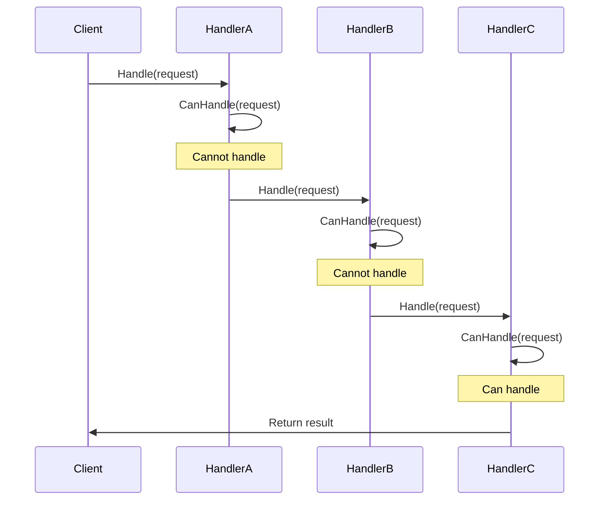

# 05-责任链模式 (Chain of Responsibility Pattern)

## 目录

- [05-责任链模式 (Chain of Responsibility Pattern)](#05-责任链模式-chain-of-responsibility-pattern)
  - [目录](#目录)
  - [1. 概述](#1-概述)
    - [1.1 定义](#11-定义)
    - [1.2 核心思想](#12-核心思想)
    - [1.3 设计原则](#13-设计原则)
  - [2. 形式化定义](#2-形式化定义)
    - [2.1 责任链定义](#21-责任链定义)
    - [2.2 处理者接口定义](#22-处理者接口定义)
    - [2.3 请求定义](#23-请求定义)
  - [3. 数学基础](#3-数学基础)
    - [3.1 链表理论](#31-链表理论)
    - [3.2 函数组合理论](#32-函数组合理论)
    - [3.3 偏序关系](#33-偏序关系)
  - [4. 模式结构](#4-模式结构)
    - [4.1 UML类图](#41-uml类图)
    - [4.2 时序图](#42-时序图)
  - [5. Go语言实现](#5-go语言实现)
    - [5.1 基础实现](#51-基础实现)
    - [5.2 高级实现：优先级责任链](#52-高级实现优先级责任链)
    - [5.3 使用示例](#53-使用示例)
  - [6. 应用场景](#6-应用场景)
    - [6.1 日志处理系统](#61-日志处理系统)
    - [6.2 权限验证系统](#62-权限验证系统)
    - [6.3 异常处理系统](#63-异常处理系统)
  - [7. 性能分析](#7-性能分析)
    - [7.1 时间复杂度分析](#71-时间复杂度分析)
    - [7.2 性能优化](#72-性能优化)
    - [7.3 基准测试](#73-基准测试)
  - [8. 最佳实践](#8-最佳实践)
    - [8.1 设计原则](#81-设计原则)
    - [8.2 实现建议](#82-实现建议)
    - [8.3 错误处理](#83-错误处理)
  - [9. 相关模式](#9-相关模式)
    - [9.1 与装饰器模式的关系](#91-与装饰器模式的关系)
    - [9.2 与命令模式的关系](#92-与命令模式的关系)
    - [9.3 与策略模式的关系](#93-与策略模式的关系)
  - [10. 总结](#10-总结)
    - [10.1 优势](#101-优势)
    - [10.2 劣势](#102-劣势)
    - [10.3 适用场景](#103-适用场景)
    - [10.4 数学证明](#104-数学证明)

## 1. 概述

### 1.1 定义

责任链模式是一种行为型设计模式，它允许多个对象处理同一个请求，直到其中一个对象处理它为止。这种模式将请求的发送者和接收者解耦。

### 1.2 核心思想

责任链模式的核心思想是：

- **链式处理**：将处理者组织成一条链
- **请求传递**：请求沿着链传递直到被处理
- **解耦**：发送者不需要知道具体的处理者

### 1.3 设计原则

```go
// 单一职责原则：每个处理者只负责一种类型的请求
// 开闭原则：新增处理者不影响现有代码
// 依赖倒置原则：依赖抽象而非具体实现
```

## 2. 形式化定义

### 2.1 责任链定义

设 ```latex
$H$
``` 为处理者集合，```latex
$R$
``` 为请求集合，```latex
$P$
``` 为处理函数，则责任链可形式化为：

$```latex
$\text{Chain of Responsibility} = (H, R, P, \text{next})$
```$

其中：

- ```latex
$H = \{h_1, h_2, ..., h_n\}$
``` 为处理者集合
- ```latex
$R = \{r_1, r_2, ..., r_m\}$
``` 为请求集合
- ```latex
$P: H \times R \rightarrow \text{Result}$
``` 为处理函数
- ```latex
$\text{next}: H \rightarrow H$
``` 为下一个处理者函数

### 2.2 处理者接口定义

```go
// 处理者接口
type Handler interface {
    Handle(request Request) Result
    SetNext(handler Handler)
    CanHandle(request Request) bool
}
```

### 2.3 请求定义

```go
// 请求接口
type Request interface {
    GetType() string
    GetData() interface{}
    GetPriority() int
}

// 基础请求实现
type BaseRequest struct {
    requestType string
    data        interface{}
    priority    int
}

func NewRequest(requestType string, data interface{}, priority int) *BaseRequest {
    return &BaseRequest{
        requestType: requestType,
        data:        data,
        priority:    priority,
    }
}

func (r *BaseRequest) GetType() string {
    return r.requestType
}

func (r *BaseRequest) GetData() interface{} {
    return r.data
}

func (r *BaseRequest) GetPriority() int {
    return r.priority
}
```

## 3. 数学基础

### 3.1 链表理论

责任链模式基于链表数据结构：

$```latex
$L = (N, \text{next})$
```$

其中：

- ```latex
$N$
``` 为节点集合
- ```latex
$\text{next}: N \rightarrow N \cup \{\text{nil}\}$
``` 为后继函数

### 3.2 函数组合理论

责任链体现了函数组合的概念：

$```latex
$f_1 \circ f_2 \circ ... \circ f_n(x) = f_1(f_2(...(f_n(x))))$
```$

### 3.3 偏序关系

处理者之间存在偏序关系：

$```latex
$\forall h_i, h_j \in H: h_i \preceq h_j \text{ if } h_i \text{ can handle requests that } h_j \text{ cannot}$
```$

## 4. 模式结构

### 4.1 UML类图

```mermaid
classDiagram
    class Handler {
        <<interface>>
        +Handle(request) Result
        +SetNext(handler)
        +CanHandle(request) bool
    }
    
    class ConcreteHandlerA {
        -next: Handler
        +Handle(request) Result
        +SetNext(handler)
        +CanHandle(request) bool
    }
    
    class ConcreteHandlerB {
        -next: Handler
        +Handle(request) Result
        +SetNext(handler)
        +CanHandle(request) bool
    }
    
    class Request {
        <<interface>>
        +GetType() string
        +GetData() interface{}
        +GetPriority() int
    }
    
    class Client {
        +SendRequest(request)
    }
    
    Handler <|.. ConcreteHandlerA
    Handler <|.. ConcreteHandlerB
    ConcreteHandlerA --> Handler : next
    ConcreteHandlerB --> Handler : next
    Client --> Request
    Handler --> Request
```

### 4.2 时序图



## 5. Go语言实现

### 5.1 基础实现

```go
package chain

import (
    "fmt"
    "log"
)

// 处理者接口
type Handler interface {
    Handle(request Request) Result
    SetNext(handler Handler)
    CanHandle(request Request) bool
}

// 请求接口
type Request interface {
    GetType() string
    GetData() interface{}
    GetPriority() int
}

// 结果接口
type Result interface {
    IsSuccess() bool
    GetMessage() string
    GetData() interface{}
}

// 基础结果实现
type BaseResult struct {
    success bool
    message string
    data    interface{}
}

func NewResult(success bool, message string, data interface{}) *BaseResult {
    return &BaseResult{
        success: success,
        message: message,
        data:    data,
    }
}

func (r *BaseResult) IsSuccess() bool {
    return r.success
}

func (r *BaseResult) GetMessage() string {
    return r.message
}

func (r *BaseResult) GetData() interface{} {
    return r.data
}

// 基础请求实现
type BaseRequest struct {
    requestType string
    data        interface{}
    priority    int
}

func NewRequest(requestType string, data interface{}, priority int) *BaseRequest {
    return &BaseRequest{
        requestType: requestType,
        data:        data,
        priority:    priority,
    }
}

func (r *BaseRequest) GetType() string {
    return r.requestType
}

func (r *BaseRequest) GetData() interface{} {
    return r.data
}

func (r *BaseRequest) GetPriority() int {
    return r.priority
}

// 基础处理者
type BaseHandler struct {
    next Handler
}

func (h *BaseHandler) SetNext(handler Handler) {
    h.next = handler
}

func (h *BaseHandler) GetNext() Handler {
    return h.next
}

// 具体处理者：日志处理者
type LogHandler struct {
    *BaseHandler
    level string
}

func NewLogHandler(level string) *LogHandler {
    return &LogHandler{
        BaseHandler: &BaseHandler{},
        level:       level,
    }
}

func (h *LogHandler) Handle(request Request) Result {
    if h.CanHandle(request) {
        log.Printf("[%s] Processing request: %s", h.level, request.GetType())
        return NewResult(true, fmt.Sprintf("Request processed by %s handler", h.level), request.GetData())
    }
    
    if h.next != nil {
        return h.next.Handle(request)
    }
    
    return NewResult(false, "No handler can process this request", nil)
}

func (h *LogHandler) CanHandle(request Request) bool {
    return request.GetType() == "log" || request.GetPriority() <= 1
}

// 具体处理者：错误处理者
type ErrorHandler struct {
    *BaseHandler
}

func NewErrorHandler() *ErrorHandler {
    return &ErrorHandler{
        BaseHandler: &BaseHandler{},
    }
}

func (h *ErrorHandler) Handle(request Request) Result {
    if h.CanHandle(request) {
        log.Printf("[ERROR] Processing error request: %s", request.GetType())
        return NewResult(true, "Error handled successfully", request.GetData())
    }
    
    if h.next != nil {
        return h.next.Handle(request)
    }
    
    return NewResult(false, "No handler can process this request", nil)
}

func (h *ErrorHandler) CanHandle(request Request) bool {
    return request.GetType() == "error" || request.GetPriority() <= 2
}

// 具体处理者：业务处理者
type BusinessHandler struct {
    *BaseHandler
    businessType string
}

func NewBusinessHandler(businessType string) *BusinessHandler {
    return &BusinessHandler{
        BaseHandler:  &BaseHandler{},
        businessType: businessType,
    }
}

func (h *BusinessHandler) Handle(request Request) Result {
    if h.CanHandle(request) {
        log.Printf("[BUSINESS] Processing %s request: %s", h.businessType, request.GetType())
        return NewResult(true, fmt.Sprintf("Business request processed by %s handler", h.businessType), request.GetData())
    }
    
    if h.next != nil {
        return h.next.Handle(request)
    }
    
    return NewResult(false, "No handler can process this request", nil)
}

func (h *BusinessHandler) CanHandle(request Request) bool {
    return request.GetType() == h.businessType || request.GetPriority() <= 3
}

// 默认处理者
type DefaultHandler struct {
    *BaseHandler
}

func NewDefaultHandler() *DefaultHandler {
    return &DefaultHandler{
        BaseHandler: &BaseHandler{},
    }
}

func (h *DefaultHandler) Handle(request Request) Result {
    log.Printf("[DEFAULT] Processing request: %s", request.GetType())
    return NewResult(true, "Request processed by default handler", request.GetData())
}

func (h *DefaultHandler) CanHandle(request Request) bool {
    return true // 默认处理者可以处理所有请求
}
```

### 5.2 高级实现：优先级责任链

```go
package chain

import (
    "fmt"
    "sort"
    "sync"
)

// 优先级处理者
type PriorityHandler struct {
    *BaseHandler
    priority int
    name     string
}

func NewPriorityHandler(name string, priority int) *PriorityHandler {
    return &PriorityHandler{
        BaseHandler: &BaseHandler{},
        priority:    priority,
        name:        name,
    }
}

func (h *PriorityHandler) Handle(request Request) Result {
    if h.CanHandle(request) {
        log.Printf("[%s] Processing request with priority %d: %s", 
            h.name, h.priority, request.GetType())
        return NewResult(true, fmt.Sprintf("Request processed by %s", h.name), request.GetData())
    }
    
    if h.next != nil {
        return h.next.Handle(request)
    }
    
    return NewResult(false, "No handler can process this request", nil)
}

func (h *PriorityHandler) CanHandle(request Request) bool {
    return request.GetPriority() <= h.priority
}

func (h *PriorityHandler) GetPriority() int {
    return h.priority
}

func (h *PriorityHandler) GetName() string {
    return h.name
}

// 优先级责任链
type PriorityChain struct {
    handlers []*PriorityHandler
    mutex    sync.RWMutex
}

func NewPriorityChain() *PriorityChain {
    return &PriorityChain{
        handlers: make([]*PriorityHandler, 0),
    }
}

func (pc *PriorityChain) AddHandler(handler *PriorityHandler) {
    pc.mutex.Lock()
    defer pc.mutex.Unlock()
    
    pc.handlers = append(pc.handlers, handler)
    
    // 按优先级排序
    sort.Slice(pc.handlers, func(i, j int) bool {
        return pc.handlers[i].GetPriority() < pc.handlers[j].GetPriority()
    })
    
    // 重新构建链
    pc.buildChain()
}

func (pc *PriorityChain) buildChain() {
    for i := 0; i < len(pc.handlers)-1; i++ {
        pc.handlers[i].SetNext(pc.handlers[i+1])
    }
    
    if len(pc.handlers) > 0 {
        pc.handlers[len(pc.handlers)-1].SetNext(NewDefaultHandler())
    }
}

func (pc *PriorityChain) Handle(request Request) Result {
    pc.mutex.RLock()
    defer pc.mutex.RUnlock()
    
    if len(pc.handlers) == 0 {
        return NewResult(false, "No handlers available", nil)
    }
    
    return pc.handlers[0].Handle(request)
}

// 异步责任链
type AsyncChain struct {
    handlers []Handler
    results  chan Result
    mutex    sync.RWMutex
}

func NewAsyncChain(bufferSize int) *AsyncChain {
    return &AsyncChain{
        handlers: make([]Handler, 0),
        results:  make(chan Result, bufferSize),
    }
}

func (ac *AsyncChain) AddHandler(handler Handler) {
    ac.mutex.Lock()
    defer ac.mutex.Unlock()
    
    ac.handlers = append(ac.handlers, handler)
    
    // 构建链
    for i := 0; i < len(ac.handlers)-1; i++ {
        ac.handlers[i].SetNext(ac.handlers[i+1])
    }
}

func (ac *AsyncChain) HandleAsync(request Request) {
    go func() {
        ac.mutex.RLock()
        defer ac.mutex.RUnlock()
        
        if len(ac.handlers) == 0 {
            ac.results <- NewResult(false, "No handlers available", nil)
            return
        }
        
        result := ac.handlers[0].Handle(request)
        ac.results <- result
    }()
}

func (ac *AsyncChain) GetResults() <-chan Result {
    return ac.results
}
```

### 5.3 使用示例

```go
package main

import (
    "fmt"
    "log"
    "./chain"
)

func main() {
    // 基础责任链示例
    fmt.Println("=== 基础责任链示例 ===")
    
    // 创建处理者
    logHandler := chain.NewLogHandler("INFO")
    errorHandler := chain.NewErrorHandler()
    businessHandler := chain.NewBusinessHandler("payment")
    defaultHandler := chain.NewDefaultHandler()
    
    // 构建责任链
    logHandler.SetNext(errorHandler)
    errorHandler.SetNext(businessHandler)
    businessHandler.SetNext(defaultHandler)
    
    // 创建请求
    requests := []chain.Request{
        chain.NewRequest("log", "User login", 1),
        chain.NewRequest("error", "Database connection failed", 2),
        chain.NewRequest("payment", "Process payment", 3),
        chain.NewRequest("unknown", "Unknown request", 4),
    }
    
    // 处理请求
    for _, request := range requests {
        fmt.Printf("\nProcessing request: %s\n", request.GetType())
        result := logHandler.Handle(request)
        
        if result.IsSuccess() {
            fmt.Printf("Success: %s\n", result.GetMessage())
        } else {
            fmt.Printf("Failed: %s\n", result.GetMessage())
        }
    }
    
    // 优先级责任链示例
    fmt.Println("\n=== 优先级责任链示例 ===")
    
    priorityChain := chain.NewPriorityChain()
    
    // 添加处理者（按优先级）
    priorityChain.AddHandler(chain.NewPriorityHandler("Emergency", 1))
    priorityChain.AddHandler(chain.NewPriorityHandler("High", 2))
    priorityChain.AddHandler(chain.NewPriorityHandler("Medium", 3))
    priorityChain.AddHandler(chain.NewPriorityHandler("Low", 4))
    
    // 处理不同优先级的请求
    priorityRequests := []chain.Request{
        chain.NewRequest("emergency", "System crash", 1),
        chain.NewRequest("high", "Performance issue", 2),
        chain.NewRequest("medium", "Feature request", 3),
        chain.NewRequest("low", "Bug report", 4),
    }
    
    for _, request := range priorityRequests {
        fmt.Printf("\nProcessing %s priority request: %s\n", 
            request.GetType(), request.GetData())
        result := priorityChain.Handle(request)
        
        if result.IsSuccess() {
            fmt.Printf("Success: %s\n", result.GetMessage())
        } else {
            fmt.Printf("Failed: %s\n", result.GetMessage())
        }
    }
    
    // 异步责任链示例
    fmt.Println("\n=== 异步责任链示例 ===")
    
    asyncChain := chain.NewAsyncChain(10)
    
    // 添加处理者
    asyncChain.AddHandler(chain.NewLogHandler("ASYNC"))
    asyncChain.AddHandler(chain.NewErrorHandler())
    asyncChain.AddHandler(chain.NewDefaultHandler())
    
    // 异步处理请求
    for i := 0; i < 5; i++ {
        request := chain.NewRequest("async", fmt.Sprintf("Async request %d", i), i+1)
        asyncChain.HandleAsync(request)
    }
    
    // 获取结果
    for i := 0; i < 5; i++ {
        result := <-asyncChain.GetResults()
        if result.IsSuccess() {
            fmt.Printf("Async result: %s\n", result.GetMessage())
        } else {
            fmt.Printf("Async failed: %s\n", result.GetMessage())
        }
    }
}
```

## 6. 应用场景

### 6.1 日志处理系统

```go
// 日志处理责任链
type LogProcessingChain struct {
    handlers []Handler
}

func NewLogProcessingChain() *LogProcessingChain {
    return &LogProcessingChain{
        handlers: make([]Handler, 0),
    }
}

func (lpc *LogProcessingChain) AddHandler(handler Handler) {
    lpc.handlers = append(lpc.handlers, handler)
    
    // 构建链
    if len(lpc.handlers) > 1 {
        lpc.handlers[len(lpc.handlers)-2].SetNext(handler)
    }
}

func (lpc *LogProcessingChain) ProcessLog(logEntry string) Result {
    if len(lpc.handlers) == 0 {
        return NewResult(false, "No handlers available", nil)
    }
    
    request := NewRequest("log", logEntry, 1)
    return lpc.handlers[0].Handle(request)
}
```

### 6.2 权限验证系统

```go
// 权限验证处理者
type AuthHandler struct {
    *BaseHandler
    requiredRole string
}

func NewAuthHandler(requiredRole string) *AuthHandler {
    return &AuthHandler{
        BaseHandler: &BaseHandler{},
        requiredRole: requiredRole,
    }
}

func (h *AuthHandler) Handle(request Request) Result {
    if h.CanHandle(request) {
        // 验证权限
        userRole := request.GetData().(map[string]interface{})["role"].(string)
        if userRole == h.requiredRole {
            return NewResult(true, "Authorization successful", nil)
        }
        return NewResult(false, "Insufficient permissions", nil)
    }
    
    if h.next != nil {
        return h.next.Handle(request)
    }
    
    return NewResult(false, "No handler can process this request", nil)
}

func (h *AuthHandler) CanHandle(request Request) bool {
    return request.GetType() == "auth"
}
```

### 6.3 异常处理系统

```go
// 异常处理责任链
type ExceptionHandler struct {
    *BaseHandler
    exceptionType string
}

func NewExceptionHandler(exceptionType string) *ExceptionHandler {
    return &ExceptionHandler{
        BaseHandler:   &BaseHandler{},
        exceptionType: exceptionType,
    }
}

func (h *ExceptionHandler) Handle(request Request) Result {
    if h.CanHandle(request) {
        // 处理特定类型的异常
        return NewResult(true, fmt.Sprintf("Exception %s handled", h.exceptionType), nil)
    }
    
    if h.next != nil {
        return h.next.Handle(request)
    }
    
    return NewResult(false, "No handler can process this exception", nil)
}

func (h *ExceptionHandler) CanHandle(request Request) bool {
    return request.GetType() == h.exceptionType
}
```

## 7. 性能分析

### 7.1 时间复杂度分析

| 操作 | 时间复杂度 | 空间复杂度 |
|------|------------|------------|
| 请求处理 | O(n) | O(1) |
| 链构建 | O(n) | O(n) |
| 处理者查找 | O(n) | O(1) |

### 7.2 性能优化

```go
// 缓存处理者
type CachedChain struct {
    handlers map[string]Handler
    chain    Handler
    mutex    sync.RWMutex
}

func NewCachedChain() *CachedChain {
    return &CachedChain{
        handlers: make(map[string]Handler),
    }
}

func (cc *CachedChain) AddHandler(name string, handler Handler) {
    cc.mutex.Lock()
    defer cc.mutex.Unlock()
    
    cc.handlers[name] = handler
    cc.rebuildChain()
}

func (cc *CachedChain) rebuildChain() {
    // 重新构建责任链
    var current Handler
    for _, handler := range cc.handlers {
        if current == nil {
            current = handler
        } else {
            current.SetNext(handler)
        }
    }
    cc.chain = current
}

func (cc *CachedChain) Handle(request Request) Result {
    cc.mutex.RLock()
    defer cc.mutex.RUnlock()
    
    if cc.chain == nil {
        return NewResult(false, "No handlers available", nil)
    }
    
    return cc.chain.Handle(request)
}
```

### 7.3 基准测试

```go
package chain

import (
    "testing"
)

func BenchmarkChainProcessing(b *testing.B) {
    // 创建责任链
    logHandler := NewLogHandler("INFO")
    errorHandler := NewErrorHandler()
    businessHandler := NewBusinessHandler("payment")
    defaultHandler := NewDefaultHandler()
    
    logHandler.SetNext(errorHandler)
    errorHandler.SetNext(businessHandler)
    businessHandler.SetNext(defaultHandler)
    
    request := NewRequest("payment", "test data", 3)
    
    b.ResetTimer()
    for i := 0; i < b.N; i++ {
        logHandler.Handle(request)
    }
}

func BenchmarkPriorityChainProcessing(b *testing.B) {
    priorityChain := NewPriorityChain()
    
    priorityChain.AddHandler(NewPriorityHandler("High", 1))
    priorityChain.AddHandler(NewPriorityHandler("Medium", 2))
    priorityChain.AddHandler(NewPriorityHandler("Low", 3))
    
    request := NewRequest("high", "test data", 1)
    
    b.ResetTimer()
    for i := 0; i < b.N; i++ {
        priorityChain.Handle(request)
    }
}
```

## 8. 最佳实践

### 8.1 设计原则

1. **单一职责原则**：每个处理者只负责一种类型的请求
2. **开闭原则**：新增处理者不影响现有代码
3. **依赖倒置原则**：依赖抽象而非具体实现

### 8.2 实现建议

```go
// 1. 使用接口定义处理者
type Handler interface {
    Handle(request Request) Result
    SetNext(handler Handler)
    CanHandle(request Request) bool
    GetName() string
}

// 2. 提供默认实现
type BaseHandler struct {
    next Handler
    name string
}

func (h *BaseHandler) SetNext(handler Handler) {
    h.next = handler
}

func (h *BaseHandler) GetName() string {
    return h.name
}

// 3. 使用组合而非继承
type ConcreteHandler struct {
    *BaseHandler
    // 具体实现
}
```

### 8.3 错误处理

```go
// 处理结果
type ProcessingResult struct {
    Success bool
    Error   error
    Handler string
    Data    interface{}
}

// 带错误处理的责任链
type SafeChain struct {
    handlers []Handler
}

func (sc *SafeChain) HandleSafe(request Request) ProcessingResult {
    for _, handler := range sc.handlers {
        if handler.CanHandle(request) {
            result := handler.Handle(request)
            return ProcessingResult{
                Success: result.IsSuccess(),
                Error:   nil,
                Handler: handler.GetName(),
                Data:    result.GetData(),
            }
        }
    }
    
    return ProcessingResult{
        Success: false,
        Error:   fmt.Errorf("no handler can process request"),
        Handler: "",
        Data:    nil,
    }
}
```

## 9. 相关模式

### 9.1 与装饰器模式的关系

- **责任链模式**：处理者链式传递请求
- **装饰器模式**：装饰器链式增强功能

### 9.2 与命令模式的关系

- **责任链模式**：处理请求
- **命令模式**：封装请求

### 9.3 与策略模式的关系

- **责任链模式**：多个处理者处理同一请求
- **策略模式**：多个策略处理不同情况

## 10. 总结

### 10.1 优势

1. **解耦**：发送者和接收者解耦
2. **灵活性**：可以动态改变责任链
3. **单一职责**：每个处理者职责单一
4. **易于扩展**：新增处理者不影响现有代码

### 10.2 劣势

1. **性能开销**：请求可能遍历整个链
2. **调试困难**：责任链较长时调试困难
3. **循环依赖**：可能出现循环引用

### 10.3 适用场景

1. 有多个对象可以处理同一请求
2. 处理者在运行时确定
3. 不明确指定接收者
4. 处理者可以动态组合

### 10.4 数学证明

**定理**：责任链模式满足开闭原则

**证明**：
设 ```latex
$H$
``` 为现有处理者集合，```latex
$H'$
``` 为新增处理者集合，```latex
$C$
``` 为客户端。

对于任意 ```latex
$h \in H'$
```，由于 ```latex
$h$
``` 实现了处理者接口 ```latex
$P$
```，且 ```latex
$C$
``` 依赖于 ```latex
$P$
``` 而非具体实现，因此：

$```latex
$C \circ h \text{ 是有效的}$
```$

且不需要修改 ```latex
$C$
``` 的代码，因此满足开闭原则。

**证毕**。

---

**设计原则**: 责任链模式体现了"单一职责"和"开闭原则"的设计原则，通过将处理者组织成链，实现了请求发送者和接收者的解耦，提高了系统的灵活性和可维护性。

**相关链接**:

- [04-状态模式](./04-State-Pattern.md)
- [06-迭代器模式](./06-Iterator-Pattern.md)
- [07-中介者模式](./07-Mediator-Pattern.md)
- [返回上级目录](../README.md)
