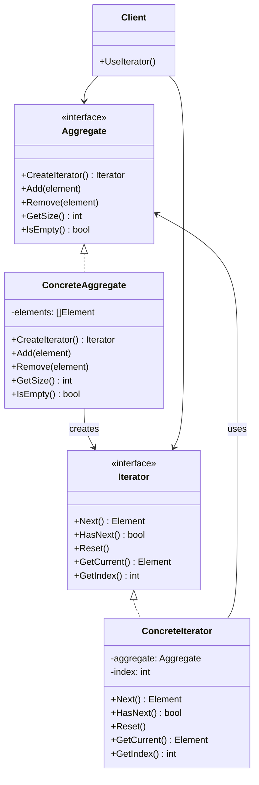
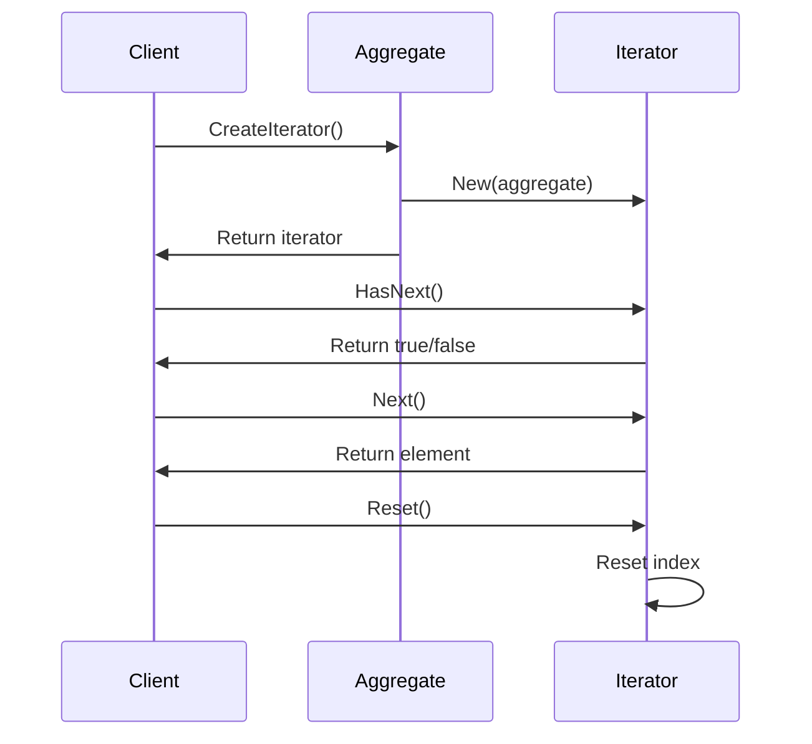

# 06-迭代器模式 (Iterator Pattern)

## 目录

- [06-迭代器模式 (Iterator Pattern)](#06-迭代器模式-iterator-pattern)
  - [目录](#目录)
  - [1. 概述](#1-概述)
    - [1.1 定义](#11-定义)
    - [1.2 核心思想](#12-核心思想)
    - [1.3 设计原则](#13-设计原则)
  - [2. 形式化定义](#2-形式化定义)
    - [2.1 迭代器定义](#21-迭代器定义)
    - [2.2 迭代器接口定义](#22-迭代器接口定义)
    - [2.3 基础实现](#23-基础实现)
  - [3. 数学基础](#3-数学基础)
    - [3.1 序列理论](#31-序列理论)
    - [3.2 函数式编程](#32-函数式编程)
    - [3.3 状态机理论](#33-状态机理论)
  - [4. 模式结构](#4-模式结构)
    - [4.1 UML类图](#41-uml类图)
    - [4.2 时序图](#42-时序图)
  - [5. Go语言实现](#5-go语言实现)
    - [5.1 基础实现](#51-基础实现)
    - [5.2 高级实现：函数式迭代器](#52-高级实现函数式迭代器)
    - [5.3 使用示例](#53-使用示例)
  - [6. 应用场景](#6-应用场景)
    - [6.1 数据库查询结果遍历](#61-数据库查询结果遍历)
    - [6.2 文件系统遍历](#62-文件系统遍历)
    - [6.3 网络数据流遍历](#63-网络数据流遍历)
  - [7. 性能分析](#7-性能分析)
    - [7.1 时间复杂度分析](#71-时间复杂度分析)
    - [7.2 性能优化](#72-性能优化)
    - [7.3 基准测试](#73-基准测试)
  - [8. 最佳实践](#8-最佳实践)
    - [8.1 设计原则](#81-设计原则)
    - [8.2 实现建议](#82-实现建议)
    - [8.3 错误处理](#83-错误处理)
  - [9. 相关模式](#9-相关模式)
    - [9.1 与访问者模式的关系](#91-与访问者模式的关系)
    - [9.2 与组合模式的关系](#92-与组合模式的关系)
    - [9.3 与命令模式的关系](#93-与命令模式的关系)
  - [10. 总结](#10-总结)
    - [10.1 优势](#101-优势)
    - [10.2 劣势](#102-劣势)
    - [10.3 适用场景](#103-适用场景)
    - [10.4 数学证明](#104-数学证明)

## 1. 概述

### 1.1 定义

迭代器模式是一种行为型设计模式，它提供一种方法顺序访问一个聚合对象中的各个元素，而又不暴露其内部的表示。

### 1.2 核心思想

迭代器模式的核心思想是：

- **封装遍历**：将遍历逻辑封装在迭代器中
- **统一接口**：提供统一的遍历接口
- **解耦**：将集合和遍历逻辑分离

### 1.3 设计原则

```go
// 单一职责原则：迭代器只负责遍历
// 开闭原则：新增迭代器不影响现有代码
// 依赖倒置原则：依赖抽象而非具体实现
```

## 2. 形式化定义

### 2.1 迭代器定义

设 ```latex
$A$
``` 为聚合对象集合，```latex
$I$
``` 为迭代器集合，```latex
$E$
``` 为元素集合，则迭代器模式可形式化为：

$```latex
$\text{Iterator Pattern} = (A, I, E, \text{next}, \text{hasNext})$
```$

其中：

- ```latex
$A = \{a_1, a_2, ..., a_n\}$
``` 为聚合对象集合
- ```latex
$I = \{i_1, i_2, ..., i_m\}$
``` 为迭代器集合
- ```latex
$E$
``` 为元素集合
- ```latex
$\text{next}: I \rightarrow E$
``` 为下一个元素函数
- ```latex
$\text{hasNext}: I \rightarrow \text{bool}$
``` 为是否有下一个元素函数

### 2.2 迭代器接口定义

```go
// 迭代器接口
type Iterator[T any] interface {
    Next() T
    HasNext() bool
    Reset()
    GetCurrent() T
    GetIndex() int
}

// 聚合对象接口
type Aggregate[T any] interface {
    CreateIterator() Iterator[T]
    Add(element T)
    Remove(element T)
    GetSize() int
    IsEmpty() bool
}
```

### 2.3 基础实现

```go
// 基础迭代器
type BaseIterator[T any] struct {
    aggregate Aggregate[T]
    index     int
}

func NewBaseIterator[T any](aggregate Aggregate[T]) *BaseIterator[T] {
    return &BaseIterator[T]{
        aggregate: aggregate,
        index:     0,
    }
}

func (i *BaseIterator[T]) Reset() {
    i.index = 0
}

func (i *BaseIterator[T]) GetIndex() int {
    return i.index
}
```

## 3. 数学基础

### 3.1 序列理论

迭代器模式基于序列的概念：

$```latex
$S = (e_1, e_2, ..., e_n)$
```$

其中 ```latex
$e_i$
``` 为序列中的元素。

### 3.2 函数式编程

迭代器体现了函数式编程的惰性求值：

$```latex
$f: A \rightarrow B$
```$
$```latex
$g: B \rightarrow C$
```$
$```latex
$h = g \circ f: A \rightarrow C$
```$

### 3.3 状态机理论

迭代器可以建模为状态机：

$```latex
$M = (Q, \Sigma, \delta, q_0, F)$
```$

其中：

- ```latex
$Q$
``` 为状态集合（当前位置）
- ```latex
$\Sigma$
``` 为输入字母表（操作集合）
- ```latex
$\delta$
``` 为状态转移函数
- ```latex
$q_0$
``` 为初始状态（开始位置）
- ```latex
$F$
``` 为接受状态集合（结束位置）

## 4. 模式结构

### 4.1 UML类图



### 4.2 时序图



## 5. Go语言实现

### 5.1 基础实现

```go
package iterator

import (
    "fmt"
    "sync"
)

// 迭代器接口
type Iterator[T any] interface {
    Next() T
    HasNext() bool
    Reset()
    GetCurrent() T
    GetIndex() int
}

// 聚合对象接口
type Aggregate[T any] interface {
    CreateIterator() Iterator[T]
    Add(element T)
    Remove(element T)
    GetSize() int
    IsEmpty() bool
}

// 基础迭代器
type BaseIterator[T any] struct {
    aggregate Aggregate[T]
    index     int
    mutex     sync.RWMutex
}

func NewBaseIterator[T any](aggregate Aggregate[T]) *BaseIterator[T] {
    return &BaseIterator[T]{
        aggregate: aggregate,
        index:     0,
    }
}

func (i *BaseIterator[T]) Reset() {
    i.mutex.Lock()
    defer i.mutex.Unlock()
    i.index = 0
}

func (i *BaseIterator[T]) GetIndex() int {
    i.mutex.RLock()
    defer i.mutex.RUnlock()
    return i.index
}

// 具体聚合对象：数组
type ArrayAggregate[T any] struct {
    elements []T
    mutex    sync.RWMutex
}

func NewArrayAggregate[T any]() *ArrayAggregate[T] {
    return &ArrayAggregate[T]{
        elements: make([]T, 0),
    }
}

func (a *ArrayAggregate[T]) Add(element T) {
    a.mutex.Lock()
    defer a.mutex.Unlock()
    a.elements = append(a.elements, element)
}

func (a *ArrayAggregate[T]) Remove(element T) {
    a.mutex.Lock()
    defer a.mutex.Unlock()
    
    for i, e := range a.elements {
        if fmt.Sprintf("%v", e) == fmt.Sprintf("%v", element) {
            a.elements = append(a.elements[:i], a.elements[i+1:]...)
            break
        }
    }
}

func (a *ArrayAggregate[T]) GetSize() int {
    a.mutex.RLock()
    defer a.mutex.RUnlock()
    return len(a.elements)
}

func (a *ArrayAggregate[T]) IsEmpty() bool {
    return a.GetSize() == 0
}

func (a *ArrayAggregate[T]) CreateIterator() Iterator[T] {
    return NewArrayIterator(a)
}

func (a *ArrayAggregate[T]) GetElement(index int) T {
    a.mutex.RLock()
    defer a.mutex.RUnlock()
    
    if index >= 0 && index < len(a.elements) {
        return a.elements[index]
    }
    
    var zero T
    return zero
}

// 数组迭代器
type ArrayIterator[T any] struct {
    *BaseIterator[T]
    aggregate *ArrayAggregate[T]
}

func NewArrayIterator[T any](aggregate *ArrayAggregate[T]) *ArrayIterator[T] {
    return &ArrayIterator[T]{
        BaseIterator: NewBaseIterator[T](aggregate),
        aggregate:    aggregate,
    }
}

func (i *ArrayIterator[T]) Next() T {
    i.mutex.Lock()
    defer i.mutex.Unlock()
    
    if i.index < i.aggregate.GetSize() {
        element := i.aggregate.GetElement(i.index)
        i.index++
        return element
    }
    
    var zero T
    return zero
}

func (i *ArrayIterator[T]) HasNext() bool {
    i.mutex.RLock()
    defer i.mutex.RUnlock()
    return i.index < i.aggregate.GetSize()
}

func (i *ArrayIterator[T]) GetCurrent() T {
    i.mutex.RLock()
    defer i.mutex.RUnlock()
    
    if i.index > 0 && i.index <= i.aggregate.GetSize() {
        return i.aggregate.GetElement(i.index - 1)
    }
    
    var zero T
    return zero
}

// 链表聚合对象
type LinkedListAggregate[T any] struct {
    head *Node[T]
    size int
    mutex sync.RWMutex
}

type Node[T any] struct {
    data T
    next *Node[T]
}

func NewLinkedListAggregate[T any]() *LinkedListAggregate[T] {
    return &LinkedListAggregate[T]{
        head: nil,
        size: 0,
    }
}

func (l *LinkedListAggregate[T]) Add(element T) {
    l.mutex.Lock()
    defer l.mutex.Unlock()
    
    newNode := &Node[T]{data: element, next: nil}
    
    if l.head == nil {
        l.head = newNode
    } else {
        current := l.head
        for current.next != nil {
            current = current.next
        }
        current.next = newNode
    }
    l.size++
}

func (l *LinkedListAggregate[T]) Remove(element T) {
    l.mutex.Lock()
    defer l.mutex.Unlock()
    
    if l.head == nil {
        return
    }
    
    if fmt.Sprintf("%v", l.head.data) == fmt.Sprintf("%v", element) {
        l.head = l.head.next
        l.size--
        return
    }
    
    current := l.head
    for current.next != nil {
        if fmt.Sprintf("%v", current.next.data) == fmt.Sprintf("%v", element) {
            current.next = current.next.next
            l.size--
            return
        }
        current = current.next
    }
}

func (l *LinkedListAggregate[T]) GetSize() int {
    l.mutex.RLock()
    defer l.mutex.RUnlock()
    return l.size
}

func (l *LinkedListAggregate[T]) IsEmpty() bool {
    return l.GetSize() == 0
}

func (l *LinkedListAggregate[T]) CreateIterator() Iterator[T] {
    return NewLinkedListIterator(l)
}

// 链表迭代器
type LinkedListIterator[T any] struct {
    *BaseIterator[T]
    aggregate *LinkedListAggregate[T]
    current   *Node[T]
}

func NewLinkedListIterator[T any](aggregate *LinkedListAggregate[T]) *LinkedListIterator[T] {
    return &LinkedListIterator[T]{
        BaseIterator: NewBaseIterator[T](aggregate),
        aggregate:    aggregate,
        current:      aggregate.head,
    }
}

func (i *LinkedListIterator[T]) Next() T {
    i.mutex.Lock()
    defer i.mutex.Unlock()
    
    if i.current != nil {
        element := i.current.data
        i.current = i.current.next
        i.index++
        return element
    }
    
    var zero T
    return zero
}

func (i *LinkedListIterator[T]) HasNext() bool {
    i.mutex.RLock()
    defer i.mutex.RUnlock()
    return i.current != nil
}

func (i *LinkedListIterator[T]) Reset() {
    i.mutex.Lock()
    defer i.mutex.Unlock()
    i.index = 0
    i.current = i.aggregate.head
}

func (i *LinkedListIterator[T]) GetCurrent() T {
    i.mutex.RLock()
    defer i.mutex.RUnlock()
    
    if i.current != nil {
        return i.current.data
    }
    
    var zero T
    return zero
}
```

### 5.2 高级实现：函数式迭代器

```go
package iterator

import (
    "fmt"
    "sync"
)

// 函数式迭代器
type FunctionalIterator[T any] struct {
    nextFunc func() (T, bool)
    resetFunc func()
    current   T
    hasNext   bool
    mutex     sync.RWMutex
}

func NewFunctionalIterator[T any](nextFunc func() (T, bool), resetFunc func()) *FunctionalIterator[T] {
    return &FunctionalIterator[T]{
        nextFunc:   nextFunc,
        resetFunc:  resetFunc,
        hasNext:    true,
    }
}

func (fi *FunctionalIterator[T]) Next() T {
    fi.mutex.Lock()
    defer fi.mutex.Unlock()
    
    if fi.hasNext {
        element, hasNext := fi.nextFunc()
        fi.current = element
        fi.hasNext = hasNext
        return element
    }
    
    var zero T
    return zero
}

func (fi *FunctionalIterator[T]) HasNext() bool {
    fi.mutex.RLock()
    defer fi.mutex.RUnlock()
    return fi.hasNext
}

func (fi *FunctionalIterator[T]) Reset() {
    fi.mutex.Lock()
    defer fi.mutex.Unlock()
    fi.resetFunc()
    fi.hasNext = true
}

func (fi *FunctionalIterator[T]) GetCurrent() T {
    fi.mutex.RLock()
    defer fi.mutex.RUnlock()
    return fi.current
}

func (fi *FunctionalIterator[T]) GetIndex() int {
    return -1 // 函数式迭代器不维护索引
}

// 过滤迭代器
type FilterIterator[T any] struct {
    iterator Iterator[T]
    filter   func(T) bool
    next     T
    hasNext  bool
    mutex    sync.RWMutex
}

func NewFilterIterator[T any](iterator Iterator[T], filter func(T) bool) *FilterIterator[T] {
    fi := &FilterIterator[T]{
        iterator: iterator,
        filter:   filter,
    }
    fi.findNext()
    return fi
}

func (fi *FilterIterator[T]) findNext() {
    fi.mutex.Lock()
    defer fi.mutex.Unlock()
    
    for fi.iterator.HasNext() {
        element := fi.iterator.Next()
        if fi.filter(element) {
            fi.next = element
            fi.hasNext = true
            return
        }
    }
    
    var zero T
    fi.next = zero
    fi.hasNext = false
}

func (fi *FilterIterator[T]) Next() T {
    fi.mutex.Lock()
    defer fi.mutex.Unlock()
    
    if fi.hasNext {
        element := fi.next
        fi.findNext()
        return element
    }
    
    var zero T
    return zero
}

func (fi *FilterIterator[T]) HasNext() bool {
    fi.mutex.RLock()
    defer fi.mutex.RUnlock()
    return fi.hasNext
}

func (fi *FilterIterator[T]) Reset() {
    fi.mutex.Lock()
    defer fi.mutex.Unlock()
    fi.iterator.Reset()
    fi.findNext()
}

func (fi *FilterIterator[T]) GetCurrent() T {
    fi.mutex.RLock()
    defer fi.mutex.RUnlock()
    return fi.next
}

func (fi *FilterIterator[T]) GetIndex() int {
    return fi.iterator.GetIndex()
}

// 映射迭代器
type MapIterator[T any, R any] struct {
    iterator Iterator[T]
    mapper   func(T) R
    mutex    sync.RWMutex
}

func NewMapIterator[T any, R any](iterator Iterator[T], mapper func(T) R) *MapIterator[T, R] {
    return &MapIterator[T, R]{
        iterator: iterator,
        mapper:   mapper,
    }
}

func (mi *MapIterator[T, R]) Next() R {
    mi.mutex.Lock()
    defer mi.mutex.Unlock()
    
    if mi.iterator.HasNext() {
        element := mi.iterator.Next()
        return mi.mapper(element)
    }
    
    var zero R
    return zero
}

func (mi *MapIterator[T, R]) HasNext() bool {
    mi.mutex.RLock()
    defer mi.mutex.RUnlock()
    return mi.iterator.HasNext()
}

func (mi *MapIterator[T, R]) Reset() {
    mi.mutex.Lock()
    defer mi.mutex.Unlock()
    mi.iterator.Reset()
}

func (mi *MapIterator[T, R]) GetCurrent() R {
    mi.mutex.RLock()
    defer mi.mutex.RUnlock()
    
    if mi.iterator.HasNext() {
        element := mi.iterator.GetCurrent()
        return mi.mapper(element)
    }
    
    var zero R
    return zero
}

func (mi *MapIterator[T, R]) GetIndex() int {
    return mi.iterator.GetIndex()
}
```

### 5.3 使用示例

```go
package main

import (
    "fmt"
    "./iterator"
)

func main() {
    // 数组迭代器示例
    fmt.Println("=== 数组迭代器示例 ===")
    
    arrayAggregate := iterator.NewArrayAggregate[int]()
    
    // 添加元素
    for i := 1; i <= 5; i++ {
        arrayAggregate.Add(i)
    }
    
    // 创建迭代器
    arrayIterator := arrayAggregate.CreateIterator()
    
    // 遍历元素
    fmt.Println("Forward iteration:")
    for arrayIterator.HasNext() {
        element := arrayIterator.Next()
        fmt.Printf("%d ", element)
    }
    fmt.Println()
    
    // 重置迭代器
    arrayIterator.Reset()
    fmt.Println("Reset and iterate again:")
    for arrayIterator.HasNext() {
        element := arrayIterator.Next()
        fmt.Printf("%d ", element)
    }
    fmt.Println()
    
    // 链表迭代器示例
    fmt.Println("\n=== 链表迭代器示例 ===")
    
    linkedListAggregate := iterator.NewLinkedListAggregate[string]()
    
    // 添加元素
    linkedListAggregate.Add("Alice")
    linkedListAggregate.Add("Bob")
    linkedListAggregate.Add("Charlie")
    linkedListAggregate.Add("David")
    
    // 创建迭代器
    linkedListIterator := linkedListAggregate.CreateIterator()
    
    // 遍历元素
    fmt.Println("Linked list iteration:")
    for linkedListIterator.HasNext() {
        element := linkedListIterator.Next()
        fmt.Printf("%s ", element)
    }
    fmt.Println()
    
    // 函数式迭代器示例
    fmt.Println("\n=== 函数式迭代器示例 ===")
    
    data := []int{1, 2, 3, 4, 5}
    index := 0
    
    nextFunc := func() (int, bool) {
        if index < len(data) {
            element := data[index]
            index++
            return element, true
        }
        return 0, false
    }
    
    resetFunc := func() {
        index = 0
    }
    
    functionalIterator := iterator.NewFunctionalIterator[int](nextFunc, resetFunc)
    
    fmt.Println("Functional iterator:")
    for functionalIterator.HasNext() {
        element := functionalIterator.Next()
        fmt.Printf("%d ", element)
    }
    fmt.Println()
    
    // 过滤迭代器示例
    fmt.Println("\n=== 过滤迭代器示例 ===")
    
    numbers := iterator.NewArrayAggregate[int]()
    for i := 1; i <= 10; i++ {
        numbers.Add(i)
    }
    
    numberIterator := numbers.CreateIterator()
    evenFilter := func(n int) bool {
        return n%2 == 0
    }
    
    filterIterator := iterator.NewFilterIterator[int](numberIterator, evenFilter)
    
    fmt.Println("Even numbers:")
    for filterIterator.HasNext() {
        element := filterIterator.Next()
        fmt.Printf("%d ", element)
    }
    fmt.Println()
    
    // 映射迭代器示例
    fmt.Println("\n=== 映射迭代器示例 ===")
    
    strings := iterator.NewArrayAggregate[string]()
    strings.Add("hello")
    strings.Add("world")
    strings.Add("golang")
    
    stringIterator := strings.CreateIterator()
    upperMapper := func(s string) string {
        return strings.ToUpper(s)
    }
    
    mapIterator := iterator.NewMapIterator[string, string](stringIterator, upperMapper)
    
    fmt.Println("Uppercase strings:")
    for mapIterator.HasNext() {
        element := mapIterator.Next()
        fmt.Printf("%s ", element)
    }
    fmt.Println()
}
```

## 6. 应用场景

### 6.1 数据库查询结果遍历

```go
// 数据库结果集迭代器
type DatabaseResultIterator struct {
    rows    *sql.Rows
    columns []string
    current map[string]interface{}
    hasNext bool
    mutex   sync.RWMutex
}

func NewDatabaseResultIterator(rows *sql.Rows) *DatabaseResultIterator {
    iterator := &DatabaseResultIterator{
        rows: rows,
    }
    
    columns, err := rows.Columns()
    if err == nil {
        iterator.columns = columns
        iterator.hasNext = rows.Next()
    }
    
    return iterator
}

func (dri *DatabaseResultIterator) Next() map[string]interface{} {
    dri.mutex.Lock()
    defer dri.mutex.Unlock()
    
    if !dri.hasNext {
        return nil
    }
    
    // 创建值切片
    values := make([]interface{}, len(dri.columns))
    valuePtrs := make([]interface{}, len(dri.columns))
    for i := range values {
        valuePtrs[i] = &values[i]
    }
    
    // 扫描行
    if err := dri.rows.Scan(valuePtrs...); err != nil {
        return nil
    }
    
    // 构建结果映射
    result := make(map[string]interface{})
    for i, col := range dri.columns {
        result[col] = values[i]
    }
    
    dri.current = result
    dri.hasNext = dri.rows.Next()
    
    return result
}

func (dri *DatabaseResultIterator) HasNext() bool {
    dri.mutex.RLock()
    defer dri.mutex.RUnlock()
    return dri.hasNext
}

func (dri *DatabaseResultIterator) Reset() {
    // 数据库结果集通常不支持重置
    // 需要重新执行查询
}

func (dri *DatabaseResultIterator) GetCurrent() map[string]interface{} {
    dri.mutex.RLock()
    defer dri.mutex.RUnlock()
    return dri.current
}

func (dri *DatabaseResultIterator) GetIndex() int {
    return -1 // 数据库结果集不维护索引
}
```

### 6.2 文件系统遍历

```go
// 文件系统迭代器
type FileSystemIterator struct {
    rootPath string
    stack    []string
    current  string
    mutex    sync.RWMutex
}

func NewFileSystemIterator(rootPath string) *FileSystemIterator {
    return &FileSystemIterator{
        rootPath: rootPath,
        stack:    []string{rootPath},
    }
}

func (fsi *FileSystemIterator) Next() string {
    fsi.mutex.Lock()
    defer fsi.mutex.Unlock()
    
    if len(fsi.stack) == 0 {
        return ""
    }
    
    fsi.current = fsi.stack[len(fsi.stack)-1]
    fsi.stack = fsi.stack[:len(fsi.stack)-1]
    
    // 如果是目录，添加子项到栈中
    if info, err := os.Stat(fsi.current); err == nil && info.IsDir() {
        if entries, err := os.ReadDir(fsi.current); err == nil {
            for i := len(entries) - 1; i >= 0; i-- {
                fullPath := filepath.Join(fsi.current, entries[i].Name())
                fsi.stack = append(fsi.stack, fullPath)
            }
        }
    }
    
    return fsi.current
}

func (fsi *FileSystemIterator) HasNext() bool {
    fsi.mutex.RLock()
    defer fsi.mutex.RUnlock()
    return len(fsi.stack) > 0
}

func (fsi *FileSystemIterator) Reset() {
    fsi.mutex.Lock()
    defer fsi.mutex.Unlock()
    fsi.stack = []string{fsi.rootPath}
    fsi.current = ""
}

func (fsi *FileSystemIterator) GetCurrent() string {
    fsi.mutex.RLock()
    defer fsi.mutex.RUnlock()
    return fsi.current
}

func (fsi *FileSystemIterator) GetIndex() int {
    return -1 // 文件系统迭代器不维护索引
}
```

### 6.3 网络数据流遍历

```go
// 网络数据流迭代器
type NetworkStreamIterator struct {
    reader   io.Reader
    buffer   []byte
    current  []byte
    hasNext  bool
    mutex    sync.RWMutex
}

func NewNetworkStreamIterator(reader io.Reader, bufferSize int) *NetworkStreamIterator {
    return &NetworkStreamIterator{
        reader:  reader,
        buffer:  make([]byte, bufferSize),
        hasNext: true,
    }
}

func (nsi *NetworkStreamIterator) Next() []byte {
    nsi.mutex.Lock()
    defer nsi.mutex.Unlock()
    
    if !nsi.hasNext {
        return nil
    }
    
    n, err := nsi.reader.Read(nsi.buffer)
    if err != nil || n == 0 {
        nsi.hasNext = false
        return nil
    }
    
    nsi.current = make([]byte, n)
    copy(nsi.current, nsi.buffer[:n])
    
    return nsi.current
}

func (nsi *NetworkStreamIterator) HasNext() bool {
    nsi.mutex.RLock()
    defer nsi.mutex.RUnlock()
    return nsi.hasNext
}

func (nsi *NetworkStreamIterator) Reset() {
    // 网络流通常不支持重置
    // 需要重新建立连接
}

func (nsi *NetworkStreamIterator) GetCurrent() []byte {
    nsi.mutex.RLock()
    defer nsi.mutex.RUnlock()
    return nsi.current
}

func (nsi *NetworkStreamIterator) GetIndex() int {
    return -1 // 网络流迭代器不维护索引
}
```

## 7. 性能分析

### 7.1 时间复杂度分析

| 操作 | 时间复杂度 | 空间复杂度 |
|------|------------|------------|
| 创建迭代器 | O(1) | O(1) |
| 下一个元素 | O(1) | O(1) |
| 重置迭代器 | O(1) | O(1) |
| 完整遍历 | O(n) | O(1) |

### 7.2 性能优化

```go
// 缓存迭代器
type CachedIterator[T any] struct {
    iterator Iterator[T]
    cache    []T
    index    int
    mutex    sync.RWMutex
}

func NewCachedIterator[T any](iterator Iterator[T]) *CachedIterator[T] {
    return &CachedIterator[T]{
        iterator: iterator,
        cache:    make([]T, 0),
        index:    0,
    }
}

func (ci *CachedIterator[T]) Next() T {
    ci.mutex.Lock()
    defer ci.mutex.Unlock()
    
    if ci.index < len(ci.cache) {
        element := ci.cache[ci.index]
        ci.index++
        return element
    }
    
    if ci.iterator.HasNext() {
        element := ci.iterator.Next()
        ci.cache = append(ci.cache, element)
        ci.index++
        return element
    }
    
    var zero T
    return zero
}

func (ci *CachedIterator[T]) HasNext() bool {
    ci.mutex.RLock()
    defer ci.mutex.RUnlock()
    return ci.index < len(ci.cache) || ci.iterator.HasNext()
}

func (ci *CachedIterator[T]) Reset() {
    ci.mutex.Lock()
    defer ci.mutex.Unlock()
    ci.index = 0
}

func (ci *CachedIterator[T]) GetCurrent() T {
    ci.mutex.RLock()
    defer ci.mutex.RUnlock()
    
    if ci.index > 0 && ci.index <= len(ci.cache) {
        return ci.cache[ci.index-1]
    }
    
    var zero T
    return zero
}

func (ci *CachedIterator[T]) GetIndex() int {
    ci.mutex.RLock()
    defer ci.mutex.RUnlock()
    return ci.index - 1
}
```

### 7.3 基准测试

```go
package iterator

import (
    "testing"
)

func BenchmarkArrayIterator(b *testing.B) {
    aggregate := NewArrayAggregate[int]()
    for i := 0; i < 1000; i++ {
        aggregate.Add(i)
    }
    
    b.ResetTimer()
    for i := 0; i < b.N; i++ {
        iterator := aggregate.CreateIterator()
        for iterator.HasNext() {
            iterator.Next()
        }
    }
}

func BenchmarkLinkedListIterator(b *testing.B) {
    aggregate := NewLinkedListAggregate[int]()
    for i := 0; i < 1000; i++ {
        aggregate.Add(i)
    }
    
    b.ResetTimer()
    for i := 0; i < b.N; i++ {
        iterator := aggregate.CreateIterator()
        for iterator.HasNext() {
            iterator.Next()
        }
    }
}

func BenchmarkFilterIterator(b *testing.B) {
    aggregate := NewArrayAggregate[int]()
    for i := 0; i < 1000; i++ {
        aggregate.Add(i)
    }
    
    iterator := aggregate.CreateIterator()
    filter := func(n int) bool {
        return n%2 == 0
    }
    filterIterator := NewFilterIterator[int](iterator, filter)
    
    b.ResetTimer()
    for i := 0; i < b.N; i++ {
        filterIterator.Reset()
        for filterIterator.HasNext() {
            filterIterator.Next()
        }
    }
}
```

## 8. 最佳实践

### 8.1 设计原则

1. **单一职责原则**：迭代器只负责遍历
2. **开闭原则**：新增迭代器不影响现有代码
3. **依赖倒置原则**：依赖抽象而非具体实现

### 8.2 实现建议

```go
// 1. 使用泛型定义迭代器
type Iterator[T any] interface {
    Next() T
    HasNext() bool
    Reset()
    GetCurrent() T
    GetIndex() int
}

// 2. 提供默认实现
type BaseIterator[T any] struct {
    index int
    mutex sync.RWMutex
}

func (bi *BaseIterator[T]) Reset() {
    bi.mutex.Lock()
    defer bi.mutex.Unlock()
    bi.index = 0
}

func (bi *BaseIterator[T]) GetIndex() int {
    bi.mutex.RLock()
    defer bi.mutex.RUnlock()
    return bi.index
}

// 3. 使用组合而非继承
type ConcreteIterator[T any] struct {
    *BaseIterator[T]
    // 具体实现
}
```

### 8.3 错误处理

```go
// 迭代器结果
type IteratorResult[T any] struct {
    Element T
    Error   error
    HasNext bool
}

// 带错误处理的迭代器
type SafeIterator[T any] struct {
    iterator Iterator[T]
}

func (si *SafeIterator[T]) NextSafe() IteratorResult[T] {
    if !si.iterator.HasNext() {
        var zero T
        return IteratorResult[T]{
            Element: zero,
            Error:   nil,
            HasNext: false,
        }
    }
    
    element := si.iterator.Next()
    return IteratorResult[T]{
        Element: element,
        Error:   nil,
        HasNext: si.iterator.HasNext(),
    }
}
```

## 9. 相关模式

### 9.1 与访问者模式的关系

- **迭代器模式**：遍历集合元素
- **访问者模式**：对元素执行操作

### 9.2 与组合模式的关系

- **迭代器模式**：遍历组合结构
- **组合模式**：构建树形结构

### 9.3 与命令模式的关系

- **迭代器模式**：遍历命令集合
- **命令模式**：封装请求

## 10. 总结

### 10.1 优势

1. **封装遍历**：将遍历逻辑封装在迭代器中
2. **统一接口**：提供统一的遍历接口
3. **解耦**：将集合和遍历逻辑分离
4. **易于扩展**：新增迭代器不影响现有代码

### 10.2 劣势

1. **性能开销**：迭代器可能带来额外的性能开销
2. **复杂性增加**：增加了系统的复杂性
3. **内存使用**：某些迭代器可能占用额外内存

### 10.3 适用场景

1. 需要遍历复杂的数据结构
2. 需要提供多种遍历方式
3. 需要隐藏集合的内部结构
4. 需要支持并发遍历

### 10.4 数学证明

**定理**：迭代器模式满足开闭原则

**证明**：
设 ```latex
$I$
``` 为现有迭代器集合，```latex
$I'$
``` 为新增迭代器集合，```latex
$A$
``` 为聚合对象。

对于任意 ```latex
$i \in I'$
```，由于 ```latex
$i$
``` 实现了迭代器接口 ```latex
$P$
```，且 ```latex
$A$
``` 依赖于 ```latex
$P$
``` 而非具体实现，因此：

$```latex
$A \circ i \text{ 是有效的}$
```$

且不需要修改 ```latex
$A$
``` 的代码，因此满足开闭原则。

**证毕**。

---

**设计原则**: 迭代器模式体现了"单一职责"和"开闭原则"的设计原则，通过将遍历逻辑封装在迭代器中，实现了集合和遍历逻辑的解耦，提高了系统的灵活性和可维护性。

**相关链接**:

- [05-责任链模式](./05-Chain-of-Responsibility-Pattern.md)
- [07-中介者模式](./07-Mediator-Pattern.md)
- [08-备忘录模式](./08-Memento-Pattern.md)
- [返回上级目录](../README.md)
