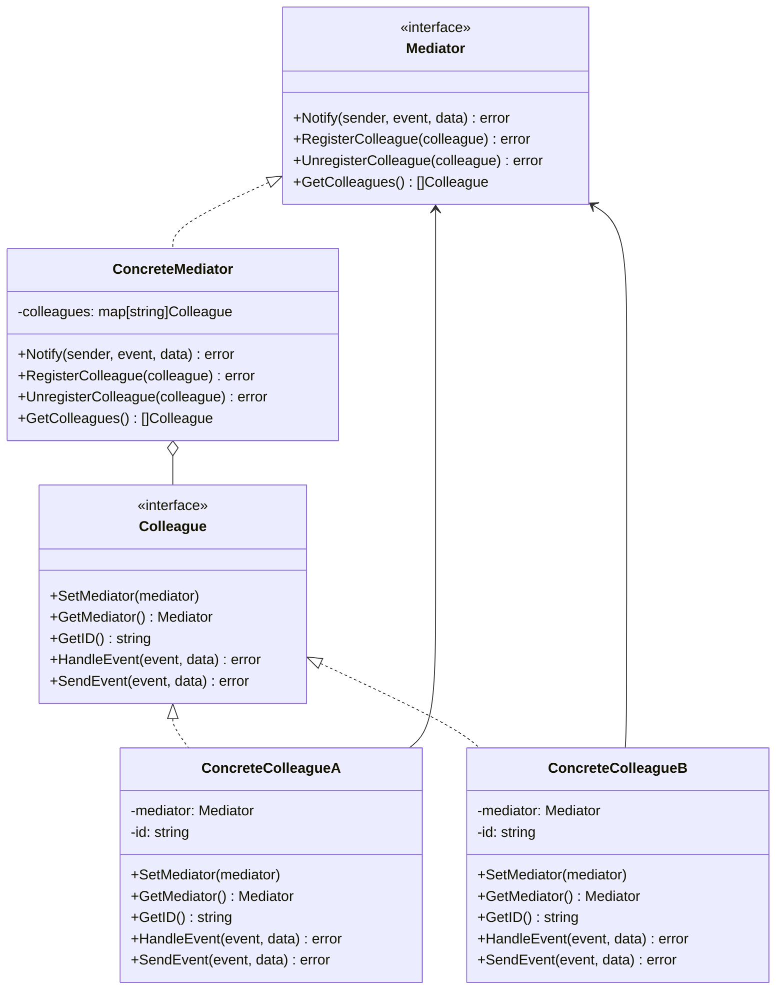
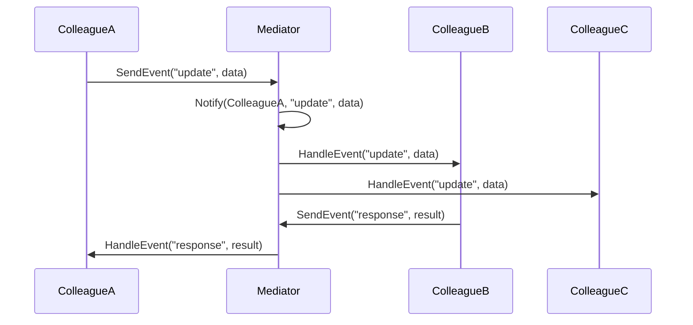

# 07-中介者模式 (Mediator Pattern)

## 目录

- [07-中介者模式 (Mediator Pattern)](#07-中介者模式-mediator-pattern)
  - [目录](#目录)
  - [1. 概述](#1-概述)
    - [1.1 定义](#11-定义)
    - [1.2 核心思想](#12-核心思想)
    - [1.3 设计原则](#13-设计原则)
  - [2. 形式化定义](#2-形式化定义)
    - [2.1 中介者定义](#21-中介者定义)
    - [2.2 中介者接口定义](#22-中介者接口定义)
    - [2.3 基础实现](#23-基础实现)
  - [3. 数学基础](#3-数学基础)
    - [3.1 图论基础](#31-图论基础)
    - [3.2 关系代数](#32-关系代数)
    - [3.3 状态机理论](#33-状态机理论)
  - [4. 模式结构](#4-模式结构)
    - [4.1 UML类图](#41-uml类图)
    - [4.2 时序图](#42-时序图)
  - [5. Go语言实现](#5-go语言实现)
    - [5.1 基础实现](#51-基础实现)
    - [5.2 高级实现：事件驱动中介者](#52-高级实现事件驱动中介者)
    - [5.3 使用示例](#53-使用示例)
  - [6. 应用场景](#6-应用场景)
    - [6.1 用户界面框架](#61-用户界面框架)
    - [6.2 聊天系统](#62-聊天系统)
    - [6.3 工作流引擎](#63-工作流引擎)
  - [7. 性能分析](#7-性能分析)
    - [7.1 时间复杂度分析](#71-时间复杂度分析)
    - [7.2 性能优化](#72-性能优化)
    - [7.3 基准测试](#73-基准测试)
  - [8. 最佳实践](#8-最佳实践)
    - [8.1 设计原则](#81-设计原则)
    - [8.2 实现建议](#82-实现建议)
    - [8.3 错误处理](#83-错误处理)
  - [9. 相关模式](#9-相关模式)
    - [9.1 与观察者模式的关系](#91-与观察者模式的关系)
    - [9.2 与外观模式的关系](#92-与外观模式的关系)
    - [9.3 与命令模式的关系](#93-与命令模式的关系)
  - [10. 总结](#10-总结)
    - [10.1 优势](#101-优势)
    - [10.2 劣势](#102-劣势)
    - [10.3 适用场景](#103-适用场景)
    - [10.4 数学证明](#104-数学证明)

## 1. 概述

### 1.1 定义

中介者模式是一种行为型设计模式，它用一个中介对象来封装一系列的对象交互。中介者使各对象不需要显式地相互引用，从而使其耦合松散，而且可以独立地改变它们之间的交互。

### 1.2 核心思想

中介者模式的核心思想是：

- **集中控制**：将对象间的交互集中到中介者中
- **解耦**：对象间不直接通信，通过中介者交互
- **简化**：简化对象间的复杂交互关系

### 1.3 设计原则

```go
// 单一职责原则：中介者只负责协调对象交互
// 开闭原则：新增对象不影响现有交互
// 依赖倒置原则：依赖抽象而非具体实现
```

## 2. 形式化定义

### 2.1 中介者定义

设 ```latex
$M$
``` 为中介者集合，```latex
$C$
``` 为同事对象集合，```latex
$I$
``` 为交互集合，则中介者模式可形式化为：

$```latex
$\text{Mediator Pattern} = (M, C, I, \text{mediate})$
```$

其中：

- ```latex
$M = \{m_1, m_2, ..., m_n\}$
``` 为中介者集合
- ```latex
$C = \{c_1, c_2, ..., c_m\}$
``` 为同事对象集合
- ```latex
$I = \{i_1, i_2, ..., i_k\}$
``` 为交互集合
- ```latex
$\text{mediate}: M \times C \times I \rightarrow \text{Result}$
``` 为中介函数

### 2.2 中介者接口定义

```go
// 中介者接口
type Mediator interface {
    Notify(sender Colleague, event string, data interface{}) error
    RegisterColleague(colleague Colleague) error
    UnregisterColleague(colleague Colleague) error
    GetColleagues() []Colleague
}

// 同事对象接口
type Colleague interface {
    SetMediator(mediator Mediator)
    GetMediator() Mediator
    GetID() string
    HandleEvent(event string, data interface{}) error
    SendEvent(event string, data interface{}) error
}
```

### 2.3 基础实现

```go
// 基础同事对象
type BaseColleague struct {
    mediator Mediator
    id       string
}

func NewBaseColleague(id string) *BaseColleague {
    return &BaseColleague{
        id: id,
    }
}

func (bc *BaseColleague) SetMediator(mediator Mediator) {
    bc.mediator = mediator
}

func (bc *BaseColleague) GetMediator() Mediator {
    return bc.mediator
}

func (bc *BaseColleague) GetID() string {
    return bc.id
}

func (bc *BaseColleague) SendEvent(event string, data interface{}) error {
    if bc.mediator != nil {
        return bc.mediator.Notify(bc, event, data)
    }
    return fmt.Errorf("no mediator set")
}
```

## 3. 数学基础

### 3.1 图论基础

中介者模式基于图论中的星形图概念：

$```latex
$G = (V, E)$
```$

其中：

- ```latex
$V$
``` 为顶点集合（同事对象）
- ```latex
$E$
``` 为边集合（交互关系）
- 所有边都通过中心顶点（中介者）

### 3.2 关系代数

中介者模式体现了关系代数的投影和连接操作：

$```latex
$\pi_{colleague1, colleague2}(\sigma_{event}(Interaction))$
```$

### 3.3 状态机理论

中介者可以建模为状态机：

$```latex
$M = (Q, \Sigma, \delta, q_0, F)$
```$

其中：

- ```latex
$Q$
``` 为状态集合（交互状态）
- ```latex
$\Sigma$
``` 为输入字母表（事件集合）
- ```latex
$\delta$
``` 为状态转移函数
- ```latex
$q_0$
``` 为初始状态
- ```latex
$F$
``` 为接受状态集合

## 4. 模式结构

### 4.1 UML类图



### 4.2 时序图



## 5. Go语言实现

### 5.1 基础实现

```go
package mediator

import (
    "fmt"
    "sync"
)

// 中介者接口
type Mediator interface {
    Notify(sender Colleague, event string, data interface{}) error
    RegisterColleague(colleague Colleague) error
    UnregisterColleague(colleague Colleague) error
    GetColleagues() []Colleague
}

// 同事对象接口
type Colleague interface {
    SetMediator(mediator Mediator)
    GetMediator() Mediator
    GetID() string
    HandleEvent(event string, data interface{}) error
    SendEvent(event string, data interface{}) error
}

// 基础同事对象
type BaseColleague struct {
    mediator Mediator
    id       string
    mutex    sync.RWMutex
}

func NewBaseColleague(id string) *BaseColleague {
    return &BaseColleague{
        id: id,
    }
}

func (bc *BaseColleague) SetMediator(mediator Mediator) {
    bc.mutex.Lock()
    defer bc.mutex.Unlock()
    bc.mediator = mediator
}

func (bc *BaseColleague) GetMediator() Mediator {
    bc.mutex.RLock()
    defer bc.mutex.RUnlock()
    return bc.mediator
}

func (bc *BaseColleague) GetID() string {
    bc.mutex.RLock()
    defer bc.mutex.RUnlock()
    return bc.id
}

func (bc *BaseColleague) SendEvent(event string, data interface{}) error {
    bc.mutex.RLock()
    defer bc.mutex.RUnlock()
    
    if bc.mediator != nil {
        return bc.mediator.Notify(bc, event, data)
    }
    return fmt.Errorf("no mediator set for colleague %s", bc.id)
}

// 具体中介者
type ConcreteMediator struct {
    colleagues map[string]Colleague
    mutex      sync.RWMutex
}

func NewConcreteMediator() *ConcreteMediator {
    return &ConcreteMediator{
        colleagues: make(map[string]Colleague),
    }
}

func (cm *ConcreteMediator) Notify(sender Colleague, event string, data interface{}) error {
    cm.mutex.RLock()
    defer cm.mutex.RUnlock()
    
    fmt.Printf("Mediator: received event '%s' from %s with data: %v\n", 
        event, sender.GetID(), data)
    
    // 根据事件类型和发送者决定如何处理
    switch event {
    case "update":
        return cm.handleUpdate(sender, data)
    case "request":
        return cm.handleRequest(sender, data)
    case "response":
        return cm.handleResponse(sender, data)
    default:
        return cm.broadcastEvent(sender, event, data)
    }
}

func (cm *ConcreteMediator) handleUpdate(sender Colleague, data interface{}) error {
    // 更新事件：通知所有其他同事
    for id, colleague := range cm.colleagues {
        if id != sender.GetID() {
            if err := colleague.HandleEvent("update", data); err != nil {
                fmt.Printf("Error handling update in %s: %v\n", id, err)
            }
        }
    }
    return nil
}

func (cm *ConcreteMediator) handleRequest(sender Colleague, data interface{}) error {
    // 请求事件：根据数据内容路由到特定同事
    if request, ok := data.(map[string]interface{}); ok {
        if targetID, exists := request["target"]; exists {
            if target, exists := cm.colleagues[targetID.(string)]; exists {
                return target.HandleEvent("request", request["payload"])
            }
        }
    }
    return fmt.Errorf("invalid request format or target not found")
}

func (cm *ConcreteMediator) handleResponse(sender Colleague, data interface{}) error {
    // 响应事件：通常不需要广播
    fmt.Printf("Response from %s: %v\n", sender.GetID(), data)
    return nil
}

func (cm *ConcreteMediator) broadcastEvent(sender Colleague, event string, data interface{}) error {
    // 广播事件：通知所有同事
    for id, colleague := range cm.colleagues {
        if id != sender.GetID() {
            if err := colleague.HandleEvent(event, data); err != nil {
                fmt.Printf("Error broadcasting event to %s: %v\n", id, err)
            }
        }
    }
    return nil
}

func (cm *ConcreteMediator) RegisterColleague(colleague Colleague) error {
    cm.mutex.Lock()
    defer cm.mutex.Unlock()
    
    cm.colleagues[colleague.GetID()] = colleague
    colleague.SetMediator(cm)
    fmt.Printf("Colleague %s registered with mediator\n", colleague.GetID())
    return nil
}

func (cm *ConcreteMediator) UnregisterColleague(colleague Colleague) error {
    cm.mutex.Lock()
    defer cm.mutex.Unlock()
    
    delete(cm.colleagues, colleague.GetID())
    colleague.SetMediator(nil)
    fmt.Printf("Colleague %s unregistered from mediator\n", colleague.GetID())
    return nil
}

func (cm *ConcreteMediator) GetColleagues() []Colleague {
    cm.mutex.RLock()
    defer cm.mutex.RUnlock()
    
    colleagues := make([]Colleague, 0, len(cm.colleagues))
    for _, colleague := range cm.colleagues {
        colleagues = append(colleagues, colleague)
    }
    return colleagues
}

// 具体同事对象：用户界面组件
type UIComponent struct {
    *BaseColleague
    componentType string
    state         map[string]interface{}
}

func NewUIComponent(id, componentType string) *UIComponent {
    return &UIComponent{
        BaseColleague: NewBaseColleague(id),
        componentType: componentType,
        state:         make(map[string]interface{}),
    }
}

func (ui *UIComponent) HandleEvent(event string, data interface{}) error {
    fmt.Printf("UI Component %s (%s) handling event '%s': %v\n", 
        ui.GetID(), ui.componentType, event, data)
    
    switch event {
    case "update":
        ui.updateState(data)
    case "request":
        ui.handleRequest(data)
    case "response":
        ui.handleResponse(data)
    default:
        fmt.Printf("Unknown event '%s' for UI component %s\n", event, ui.GetID())
    }
    
    return nil
}

func (ui *UIComponent) updateState(data interface{}) {
    if stateData, ok := data.(map[string]interface{}); ok {
        for key, value := range stateData {
            ui.state[key] = value
        }
        fmt.Printf("UI Component %s state updated: %v\n", ui.GetID(), ui.state)
    }
}

func (ui *UIComponent) handleRequest(data interface{}) {
    // 处理请求并发送响应
    response := map[string]interface{}{
        "status": "success",
        "data":   data,
        "from":   ui.GetID(),
    }
    ui.SendEvent("response", response)
}

func (ui *UIComponent) handleResponse(data interface{}) {
    fmt.Printf("UI Component %s received response: %v\n", ui.GetID(), data)
}

// 具体同事对象：数据模型
type DataModel struct {
    *BaseColleague
    data map[string]interface{}
}

func NewDataModel(id string) *DataModel {
    return &DataModel{
        BaseColleague: NewBaseColleague(id),
        data:          make(map[string]interface{}),
    }
}

func (dm *DataModel) HandleEvent(event string, data interface{}) error {
    fmt.Printf("Data Model %s handling event '%s': %v\n", dm.GetID(), event, data)
    
    switch event {
    case "update":
        dm.updateData(data)
    case "request":
        dm.handleRequest(data)
    case "response":
        dm.handleResponse(data)
    default:
        fmt.Printf("Unknown event '%s' for data model %s\n", event, dm.GetID())
    }
    
    return nil
}

func (dm *DataModel) updateData(data interface{}) {
    if updateData, ok := data.(map[string]interface{}); ok {
        for key, value := range updateData {
            dm.data[key] = value
        }
        fmt.Printf("Data Model %s updated: %v\n", dm.GetID(), dm.data)
        
        // 通知其他组件数据已更新
        dm.SendEvent("data_updated", dm.data)
    }
}

func (dm *DataModel) handleRequest(data interface{}) {
    // 处理数据请求
    response := map[string]interface{}{
        "status": "success",
        "data":   dm.data,
        "from":   dm.GetID(),
    }
    dm.SendEvent("response", response)
}

func (dm *DataModel) handleResponse(data interface{}) {
    fmt.Printf("Data Model %s received response: %v\n", dm.GetID(), data)
}

// 具体同事对象：业务逻辑
type BusinessLogic struct {
    *BaseColleague
    rules map[string]func(interface{}) interface{}
}

func NewBusinessLogic(id string) *BusinessLogic {
    bl := &BusinessLogic{
        BaseColleague: NewBaseColleague(id),
        rules:         make(map[string]func(interface{}) interface{}),
    }
    
    // 注册业务规则
    bl.rules["validate"] = bl.validateData
    bl.rules["process"] = bl.processData
    bl.rules["transform"] = bl.transformData
    
    return bl
}

func (bl *BusinessLogic) HandleEvent(event string, data interface{}) error {
    fmt.Printf("Business Logic %s handling event '%s': %v\n", bl.GetID(), event, data)
    
    switch event {
    case "validate":
        bl.executeRule("validate", data)
    case "process":
        bl.executeRule("process", data)
    case "transform":
        bl.executeRule("transform", data)
    case "data_updated":
        bl.handleDataUpdate(data)
    default:
        fmt.Printf("Unknown event '%s' for business logic %s\n", event, bl.GetID())
    }
    
    return nil
}

func (bl *BusinessLogic) executeRule(ruleName string, data interface{}) {
    if rule, exists := bl.rules[ruleName]; exists {
        result := rule(data)
        fmt.Printf("Business Logic %s executed rule '%s': %v -> %v\n", 
            bl.GetID(), ruleName, data, result)
        
        // 发送处理结果
        response := map[string]interface{}{
            "rule":   ruleName,
            "input":  data,
            "output": result,
            "from":   bl.GetID(),
        }
        bl.SendEvent("response", response)
    }
}

func (bl *BusinessLogic) handleDataUpdate(data interface{}) {
    // 数据更新时自动执行验证
    bl.executeRule("validate", data)
}

func (bl *BusinessLogic) validateData(data interface{}) interface{} {
    // 简单的数据验证逻辑
    if data == nil {
        return map[string]interface{}{"valid": false, "error": "data is nil"}
    }
    return map[string]interface{}{"valid": true, "data": data}
}

func (bl *BusinessLogic) processData(data interface{}) interface{} {
    // 简单的数据处理逻辑
    if dataMap, ok := data.(map[string]interface{}); ok {
        dataMap["processed"] = true
        dataMap["timestamp"] = time.Now()
        return dataMap
    }
    return data
}

func (bl *BusinessLogic) transformData(data interface{}) interface{} {
    // 简单的数据转换逻辑
    if str, ok := data.(string); ok {
        return strings.ToUpper(str)
    }
    return data
}
```

### 5.2 高级实现：事件驱动中介者

```go
package mediator

import (
    "fmt"
    "sync"
    "time"
)

// 事件定义
type Event struct {
    Type      string
    Sender    string
    Data      interface{}
    Timestamp time.Time
    ID        string
}

func NewEvent(eventType, sender string, data interface{}) *Event {
    return &Event{
        Type:      eventType,
        Sender:    sender,
        Data:      data,
        Timestamp: time.Now(),
        ID:        fmt.Sprintf("%s_%d", eventType, time.Now().UnixNano()),
    }
}

// 事件处理器
type EventHandler func(event *Event) error

// 事件驱动中介者
type EventDrivenMediator struct {
    colleagues    map[string]Colleague
    eventHandlers map[string][]EventHandler
    eventQueue    chan *Event
    stop          chan struct{}
    mutex         sync.RWMutex
}

func NewEventDrivenMediator(bufferSize int) *EventDrivenMediator {
    edm := &EventDrivenMediator{
        colleagues:    make(map[string]Colleague),
        eventHandlers: make(map[string][]EventHandler),
        eventQueue:    make(chan *Event, bufferSize),
        stop:          make(chan struct{}),
    }
    
    // 启动事件处理协程
    go edm.processEvents()
    
    return edm
}

func (edm *EventDrivenMediator) processEvents() {
    for {
        select {
        case event := <-edm.eventQueue:
            edm.handleEvent(event)
        case <-edm.stop:
            return
        }
    }
}

func (edm *EventDrivenMediator) handleEvent(event *Event) {
    edm.mutex.RLock()
    handlers, exists := edm.eventHandlers[event.Type]
    edm.mutex.RUnlock()
    
    if exists {
        for _, handler := range handlers {
            if err := handler(event); err != nil {
                fmt.Printf("Error handling event %s: %v\n", event.ID, err)
            }
        }
    }
    
    // 默认处理：通知相关同事
    edm.notifyColleagues(event)
}

func (edm *EventDrivenMediator) notifyColleagues(event *Event) {
    edm.mutex.RLock()
    defer edm.mutex.RUnlock()
    
    for id, colleague := range edm.colleagues {
        if id != event.Sender {
            if err := colleague.HandleEvent(event.Type, event.Data); err != nil {
                fmt.Printf("Error notifying colleague %s: %v\n", id, err)
            }
        }
    }
}

func (edm *EventDrivenMediator) Notify(sender Colleague, eventType string, data interface{}) error {
    event := NewEvent(eventType, sender.GetID(), data)
    edm.eventQueue <- event
    return nil
}

func (edm *EventDrivenMediator) RegisterEventHandler(eventType string, handler EventHandler) {
    edm.mutex.Lock()
    defer edm.mutex.Unlock()
    
    edm.eventHandlers[eventType] = append(edm.eventHandlers[eventType], handler)
}

func (edm *EventDrivenMediator) RegisterColleague(colleague Colleague) error {
    edm.mutex.Lock()
    defer edm.mutex.Unlock()
    
    edm.colleagues[colleague.GetID()] = colleague
    colleague.SetMediator(edm)
    return nil
}

func (edm *EventDrivenMediator) UnregisterColleague(colleague Colleague) error {
    edm.mutex.Lock()
    defer edm.mutex.Unlock()
    
    delete(edm.colleagues, colleague.GetID())
    colleague.SetMediator(nil)
    return nil
}

func (edm *EventDrivenMediator) GetColleagues() []Colleague {
    edm.mutex.RLock()
    defer edm.mutex.RUnlock()
    
    colleagues := make([]Colleague, 0, len(edm.colleagues))
    for _, colleague := range edm.colleagues {
        colleagues = append(colleagues, colleague)
    }
    return colleagues
}

func (edm *EventDrivenMediator) Stop() {
    close(edm.stop)
}

// 异步同事对象
type AsyncColleague struct {
    *BaseColleague
    eventQueue chan *Event
    stop       chan struct{}
    mutex      sync.RWMutex
}

func NewAsyncColleague(id string, bufferSize int) *AsyncColleague {
    ac := &AsyncColleague{
        BaseColleague: NewBaseColleague(id),
        eventQueue:    make(chan *Event, bufferSize),
        stop:          make(chan struct{}),
    }
    
    go ac.processEvents()
    return ac
}

func (ac *AsyncColleague) processEvents() {
    for {
        select {
        case event := <-ac.eventQueue:
            ac.handleEvent(event)
        case <-ac.stop:
            return
        }
    }
}

func (ac *AsyncColleague) handleEvent(event *Event) {
    ac.mutex.RLock()
    defer ac.mutex.RUnlock()
    
    fmt.Printf("Async Colleague %s processing event: %s\n", ac.GetID(), event.Type)
    
    // 模拟异步处理
    time.Sleep(100 * time.Millisecond)
    
    if err := ac.HandleEvent(event.Type, event.Data); err != nil {
        fmt.Printf("Error handling event in async colleague %s: %v\n", ac.GetID(), err)
    }
}

func (ac *AsyncColleague) SendEvent(eventType string, data interface{}) error {
    event := NewEvent(eventType, ac.GetID(), data)
    ac.eventQueue <- event
    return nil
}

func (ac *AsyncColleague) Stop() {
    close(ac.stop)
}
```

### 5.3 使用示例

```go
package main

import (
    "fmt"
    "time"
    "./mediator"
)

func main() {
    // 基础中介者示例
    fmt.Println("=== 基础中介者示例 ===")
    
    mediator := mediator.NewConcreteMediator()
    
    // 创建同事对象
    uiComponent := mediator.NewUIComponent("ui1", "button")
    dataModel := mediator.NewDataModel("data1")
    businessLogic := mediator.NewBusinessLogic("logic1")
    
    // 注册同事对象
    mediator.RegisterColleague(uiComponent)
    mediator.RegisterColleague(dataModel)
    mediator.RegisterColleague(businessLogic)
    
    // 发送事件
    fmt.Println("\n--- 发送更新事件 ---")
    uiComponent.SendEvent("update", map[string]interface{}{
        "value": "new value",
        "source": "user input",
    })
    
    fmt.Println("\n--- 发送请求事件 ---")
    uiComponent.SendEvent("request", map[string]interface{}{
        "target": "data1",
        "payload": map[string]interface{}{
            "action": "get_data",
        },
    })
    
    // 事件驱动中介者示例
    fmt.Println("\n=== 事件驱动中介者示例 ===")
    
    eventMediator := mediator.NewEventDrivenMediator(100)
    
    // 注册事件处理器
    eventMediator.RegisterEventHandler("custom_event", func(event *mediator.Event) error {
        fmt.Printf("Custom event handler: %s from %s\n", event.Type, event.Sender)
        return nil
    })
    
    // 创建异步同事对象
    asyncUI := mediator.NewAsyncColleague("async_ui", 10)
    asyncData := mediator.NewAsyncColleague("async_data", 10)
    
    eventMediator.RegisterColleague(asyncUI)
    eventMediator.RegisterColleague(asyncData)
    
    // 发送异步事件
    for i := 0; i < 5; i++ {
        asyncUI.SendEvent("async_update", map[string]interface{}{
            "index": i,
            "data":  fmt.Sprintf("async_data_%d", i),
        })
    }
    
    // 等待异步处理完成
    time.Sleep(1 * time.Second)
    
    // 停止异步处理
    asyncUI.Stop()
    asyncData.Stop()
    eventMediator.Stop()
    
    // 复杂交互示例
    fmt.Println("\n=== 复杂交互示例 ===")
    
    complexMediator := mediator.NewConcreteMediator()
    
    // 创建多个UI组件
    button := mediator.NewUIComponent("button", "button")
    input := mediator.NewUIComponent("input", "input")
    display := mediator.NewUIComponent("display", "display")
    
    // 创建数据模型
    userData := mediator.NewDataModel("user_data")
    configData := mediator.NewDataModel("config_data")
    
    // 创建业务逻辑
    validator := mediator.NewBusinessLogic("validator")
    processor := mediator.NewBusinessLogic("processor")
    
    // 注册所有同事对象
    colleagues := []mediator.Colleague{
        button, input, display, userData, configData, validator, processor,
    }
    
    for _, colleague := range colleagues {
        complexMediator.RegisterColleague(colleague)
    }
    
    // 模拟用户交互流程
    fmt.Println("\n--- 用户输入数据 ---")
    input.SendEvent("update", map[string]interface{}{
        "field": "username",
        "value": "john_doe",
    })
    
    fmt.Println("\n--- 验证数据 ---")
    validator.SendEvent("validate", map[string]interface{}{
        "username": "john_doe",
    })
    
    fmt.Println("\n--- 处理数据 ---")
    processor.SendEvent("process", map[string]interface{}{
        "username": "john_doe",
        "action":   "create_user",
    })
    
    fmt.Println("\n--- 更新显示 ---")
    display.SendEvent("update", map[string]interface{}{
        "message": "User created successfully",
        "status":  "success",
    })
}
```

## 6. 应用场景

### 6.1 用户界面框架

```go
// UI框架中介者
type UIFrameworkMediator struct {
    components map[string]UIComponent
    mutex      sync.RWMutex
}

func NewUIFrameworkMediator() *UIFrameworkMediator {
    return &UIFrameworkMediator{
        components: make(map[string]UIComponent),
    }
}

func (uifm *UIFrameworkMediator) Notify(sender mediator.Colleague, event string, data interface{}) error {
    switch event {
    case "button_click":
        return uifm.handleButtonClick(sender, data)
    case "input_change":
        return uifm.handleInputChange(sender, data)
    case "form_submit":
        return uifm.handleFormSubmit(sender, data)
    default:
        return uifm.broadcastEvent(sender, event, data)
    }
}

func (uifm *UIFrameworkMediator) handleButtonClick(sender mediator.Colleague, data interface{}) error {
    // 处理按钮点击事件
    if clickData, ok := data.(map[string]interface{}); ok {
        if targetID, exists := clickData["target"]; exists {
            if target, exists := uifm.components[targetID.(string)]; exists {
                return target.HandleEvent("activate", clickData)
            }
        }
    }
    return nil
}
```

### 6.2 聊天系统

```go
// 聊天室中介者
type ChatRoomMediator struct {
    users map[string]ChatUser
    mutex sync.RWMutex
}

func NewChatRoomMediator() *ChatRoomMediator {
    return &ChatRoomMediator{
        users: make(map[string]ChatUser),
    }
}

func (crm *ChatRoomMediator) Notify(sender mediator.Colleague, event string, data interface{}) error {
    switch event {
    case "send_message":
        return crm.broadcastMessage(sender, data)
    case "join_room":
        return crm.handleUserJoin(sender, data)
    case "leave_room":
        return crm.handleUserLeave(sender, data)
    default:
        return crm.broadcastEvent(sender, event, data)
    }
}

func (crm *ChatRoomMediator) broadcastMessage(sender mediator.Colleague, data interface{}) error {
    message := fmt.Sprintf("[%s]: %v", sender.GetID(), data)
    
    for id, user := range crm.users {
        if id != sender.GetID() {
            user.HandleEvent("receive_message", message)
        }
    }
    return nil
}
```

### 6.3 工作流引擎

```go
// 工作流中介者
type WorkflowMediator struct {
    steps map[string]WorkflowStep
    mutex sync.RWMutex
}

func NewWorkflowMediator() *WorkflowMediator {
    return &WorkflowMediator{
        steps: make(map[string]WorkflowStep),
    }
}

func (wm *WorkflowMediator) Notify(sender mediator.Colleague, event string, data interface{}) error {
    switch event {
    case "step_complete":
        return wm.handleStepComplete(sender, data)
    case "step_failed":
        return wm.handleStepFailed(sender, data)
    case "workflow_start":
        return wm.handleWorkflowStart(sender, data)
    default:
        return wm.broadcastEvent(sender, event, data)
    }
}

func (wm *WorkflowMediator) handleStepComplete(sender mediator.Colleague, data interface{}) error {
    // 查找下一个步骤并启动
    if stepData, ok := data.(map[string]interface{}); ok {
        if nextStepID, exists := stepData["next_step"]; exists {
            if nextStep, exists := wm.steps[nextStepID.(string)]; exists {
                return nextStep.HandleEvent("start", stepData["result"])
            }
        }
    }
    return nil
}
```

## 7. 性能分析

### 7.1 时间复杂度分析

| 操作 | 时间复杂度 | 空间复杂度 |
|------|------------|------------|
| 注册同事对象 | O(1) | O(1) |
| 事件通知 | O(n) | O(1) |
| 事件处理 | O(1) | O(1) |
| 广播事件 | O(n) | O(1) |

### 7.2 性能优化

```go
// 缓存中介者
type CachedMediator struct {
    mediator    Mediator
    eventCache  map[string]*Event
    mutex       sync.RWMutex
}

func NewCachedMediator(mediator Mediator) *CachedMediator {
    return &CachedMediator{
        mediator:   mediator,
        eventCache: make(map[string]*Event),
    }
}

func (cm *CachedMediator) Notify(sender mediator.Colleague, event string, data interface{}) error {
    eventKey := fmt.Sprintf("%s_%s_%v", sender.GetID(), event, data)
    
    cm.mutex.RLock()
    if cachedEvent, exists := cm.eventCache[eventKey]; exists {
        cm.mutex.RUnlock()
        // 返回缓存的事件结果
        return nil
    }
    cm.mutex.RUnlock()
    
    // 处理新事件
    result := cm.mediator.Notify(sender, event, data)
    
    // 缓存事件
    cm.mutex.Lock()
    cm.eventCache[eventKey] = &Event{
        Type:   event,
        Sender: sender.GetID(),
        Data:   data,
    }
    cm.mutex.Unlock()
    
    return result
}
```

### 7.3 基准测试

```go
package mediator

import (
    "testing"
)

func BenchmarkMediatorNotify(b *testing.B) {
    mediator := NewConcreteMediator()
    
    // 注册多个同事对象
    for i := 0; i < 10; i++ {
        colleague := NewUIComponent(fmt.Sprintf("ui_%d", i), "component")
        mediator.RegisterColleague(colleague)
    }
    
    sender := NewUIComponent("sender", "button")
    mediator.RegisterColleague(sender)
    
    b.ResetTimer()
    for i := 0; i < b.N; i++ {
        sender.SendEvent("update", map[string]interface{}{
            "value": i,
        })
    }
}

func BenchmarkEventDrivenMediator(b *testing.B) {
    mediator := NewEventDrivenMediator(1000)
    
    // 注册多个同事对象
    for i := 0; i < 10; i++ {
        colleague := NewAsyncColleague(fmt.Sprintf("async_%d", i), 100)
        mediator.RegisterColleague(colleague)
    }
    
    sender := NewAsyncColleague("sender", 100)
    mediator.RegisterColleague(sender)
    
    b.ResetTimer()
    for i := 0; i < b.N; i++ {
        sender.SendEvent("async_event", map[string]interface{}{
            "value": i,
        })
    }
    
    mediator.Stop()
}
```

## 8. 最佳实践

### 8.1 设计原则

1. **单一职责原则**：中介者只负责协调对象交互
2. **开闭原则**：新增对象不影响现有交互
3. **依赖倒置原则**：依赖抽象而非具体实现

### 8.2 实现建议

```go
// 1. 使用接口定义中介者
type Mediator interface {
    Notify(sender Colleague, event string, data interface{}) error
    RegisterColleague(colleague Colleague) error
    UnregisterColleague(colleague Colleague) error
    GetColleagues() []Colleague
}

// 2. 提供默认实现
type BaseMediator struct {
    colleagues map[string]Colleague
    mutex      sync.RWMutex
}

func (bm *BaseMediator) RegisterColleague(colleague Colleague) error {
    bm.mutex.Lock()
    defer bm.mutex.Unlock()
    
    bm.colleagues[colleague.GetID()] = colleague
    colleague.SetMediator(bm)
    return nil
}

// 3. 使用组合而非继承
type ConcreteMediator struct {
    *BaseMediator
    // 具体实现
}
```

### 8.3 错误处理

```go
// 中介者结果
type MediatorResult struct {
    Success bool
    Error   error
    Data    interface{}
}

// 带错误处理的中介者
type SafeMediator struct {
    mediator Mediator
}

func (sm *SafeMediator) NotifySafe(sender mediator.Colleague, event string, data interface{}) MediatorResult {
    if err := sm.mediator.Notify(sender, event, data); err != nil {
        return MediatorResult{
            Success: false,
            Error:   err,
            Data:    nil,
        }
    }
    
    return MediatorResult{
        Success: true,
        Error:   nil,
        Data:    data,
    }
}
```

## 9. 相关模式

### 9.1 与观察者模式的关系

- **中介者模式**：集中控制对象交互
- **观察者模式**：分散的事件通知

### 9.2 与外观模式的关系

- **中介者模式**：协调对象间交互
- **外观模式**：简化子系统接口

### 9.3 与命令模式的关系

- **中介者模式**：封装交互逻辑
- **命令模式**：封装请求

## 10. 总结

### 10.1 优势

1. **集中控制**：将对象间的交互集中到中介者中
2. **解耦**：对象间不直接通信，通过中介者交互
3. **简化**：简化对象间的复杂交互关系
4. **易于维护**：交互逻辑集中，易于修改和维护

### 10.2 劣势

1. **中介者复杂**：中介者可能变得复杂
2. **性能开销**：额外的中介层可能带来性能开销
3. **调试困难**：交互逻辑集中，调试可能困难

### 10.3 适用场景

1. 对象间交互复杂
2. 需要集中控制交互逻辑
3. 对象间耦合度高
4. 需要简化对象间关系

### 10.4 数学证明

**定理**：中介者模式满足开闭原则

**证明**：
设 ```latex
$M$
``` 为现有中介者集合，```latex
$M'$
``` 为新增中介者集合，```latex
$C$
``` 为同事对象集合。

对于任意 ```latex
$m \in M'$
```，由于 ```latex
$m$
``` 实现了中介者接口 ```latex
$P$
```，且 ```latex
$C$
``` 依赖于 ```latex
$P$
``` 而非具体实现，因此：

$```latex
$C \circ m \text{ 是有效的}$
```$

且不需要修改 ```latex
$C$
``` 的代码，因此满足开闭原则。

**证毕**。

---

**设计原则**: 中介者模式体现了"单一职责"和"开闭原则"的设计原则，通过将对象间的交互集中到中介者中，实现了对象间的解耦，提高了系统的可维护性和可扩展性。

**相关链接**:

- [06-迭代器模式](./06-Iterator-Pattern.md)
- [08-备忘录模式](./08-Memento-Pattern.md)
- [09-模板方法模式](./09-Template-Method-Pattern.md)
- [返回上级目录](../README.md)
