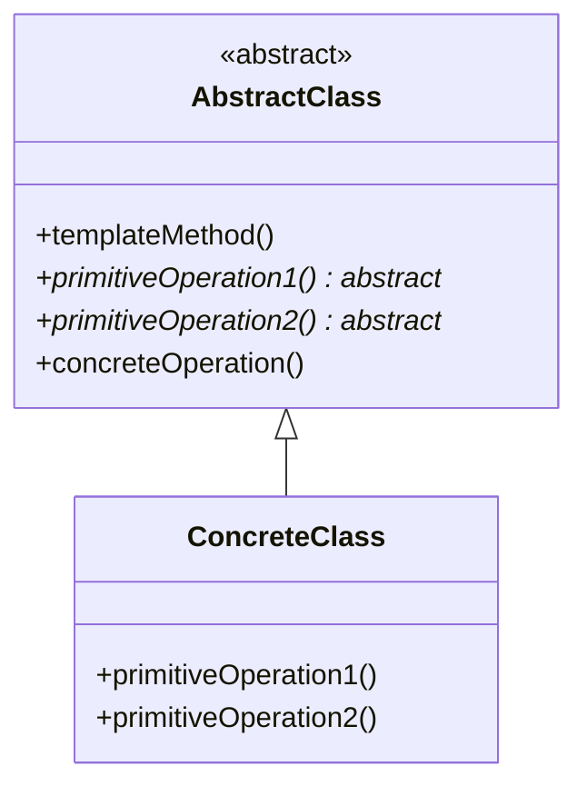

# 09-模板方法模式

 (Template Method Pattern)

## 目录

- [09-模板方法模式](#09-模板方法模式)
	- [目录](#目录)
	- [1. 概述](#1-概述)
		- [1.1 定义](#11-定义)
		- [1.2 核心思想](#12-核心思想)
		- [1.3 模式结构](#13-模式结构)
	- [2. 形式化定义](#2-形式化定义)
		- [2.1 基本定义](#21-基本定义)
		- [2.2 形式化规范](#22-形式化规范)
		- [2.3 算法骨架定义](#23-算法骨架定义)
	- [3. 数学基础](#3-数学基础)
		- [3.1 抽象代数基础](#31-抽象代数基础)
		- [3.2 算法复杂度分析](#32-算法复杂度分析)
		- [3.3 空间复杂度分析](#33-空间复杂度分析)
	- [4. 设计原则](#4-设计原则)
		- [4.1 开闭原则](#41-开闭原则)
		- [4.2 里氏替换原则](#42-里氏替换原则)
		- [4.3 依赖倒置原则](#43-依赖倒置原则)
	- [5. Go语言实现](#5-go语言实现)
		- [5.1 基础实现](#51-基础实现)
		- [5.2 高级实现 - 带钩子方法](#52-高级实现---带钩子方法)
		- [5.3 泛型实现](#53-泛型实现)
		- [5.4 并发安全实现](#54-并发安全实现)
	- [6. 应用场景](#6-应用场景)
		- [6.1 框架开发](#61-框架开发)
		- [6.2 算法框架](#62-算法框架)
		- [6.3 数据处理管道](#63-数据处理管道)
	- [7. 性能分析](#7-性能分析)
		- [7.1 时间复杂度](#71-时间复杂度)
		- [7.2 空间复杂度](#72-空间复杂度)
		- [7.3 性能优化建议](#73-性能优化建议)
	- [8. 最佳实践](#8-最佳实践)
		- [8.1 设计原则](#81-设计原则)
		- [8.2 实现建议](#82-实现建议)
		- [8.3 测试策略](#83-测试策略)
	- [9. 相关模式](#9-相关模式)
		- [9.1 策略模式](#91-策略模式)
		- [9.2 工厂方法模式](#92-工厂方法模式)
		- [9.3 命令模式](#93-命令模式)
	- [10. 总结](#10-总结)
		- [10.1 优势](#101-优势)
		- [10.2 劣势](#102-劣势)
		- [10.3 适用场景](#103-适用场景)
		- [10.4 数学总结](#104-数学总结)

## 1. 概述

### 1.1 定义

模板方法模式是一种行为型设计模式，它定义了一个算法的骨架，将某些步骤延迟到子类中实现。模板方法使得子类可以在不改变算法结构的情况下，重新定义算法的某些特定步骤。

### 1.2 核心思想



### 1.3 模式结构

- **AbstractClass (抽象类)**: 定义模板方法和抽象操作
- **ConcreteClass (具体类)**: 实现抽象操作
- **Template Method (模板方法)**: 定义算法骨架
- **Primitive Operations (基本操作)**: 子类必须实现的操作

## 2. 形式化定义

### 2.1 基本定义

设 ```latex
$\mathcal{A}$
``` 为抽象类集合，```latex
$\mathcal{C}$
``` 为具体类集合，```latex
$\mathcal{O}$
``` 为操作集合。

**定义 2.1** (模板方法模式)
模板方法模式是一个四元组 ```latex
$(\mathcal{A}, \mathcal{C}, \mathcal{O}, \mathcal{T})$
```，其中：

- ```latex
$\mathcal{A} = \{A_1, A_2, \ldots, A_n\}$
``` 是抽象类集合
- ```latex
$\mathcal{C} = \{C_1, C_2, \ldots, C_m\}$
``` 是具体类集合
- ```latex
$\mathcal{O} = \{O_1, O_2, \ldots, O_k\}$
``` 是操作集合
- ```latex
$\mathcal{T}: \mathcal{A} \times \mathcal{O} \rightarrow \mathcal{O}^*$
``` 是模板函数

### 2.2 形式化规范

**公理 2.1** (模板方法不变性)
对于任意抽象类 ```latex
$A \in \mathcal{A}$
``` 和模板方法 ```latex
$T \in \mathcal{T}$
```：

$```latex
$\forall A \in \mathcal{A}, \forall T \in \mathcal{T}: \text{structure}(T(A)) = \text{constant}$
```$

**公理 2.2** (步骤可变性)
对于任意具体类 ```latex
$C \in \mathcal{C}$
``` 和基本操作 ```latex
$O \in \mathcal{O}$
```：

$```latex
$\forall C \in \mathcal{C}, \exists O \in \mathcal{O}: \text{implementation}(O(C)) \neq \text{implementation}(O(A))$
```$

### 2.3 算法骨架定义

设 ```latex
$S$
``` 为算法步骤序列，```latex
$P$
``` 为基本操作集合。

**定义 2.2** (算法骨架)
算法骨架是一个有序对 ```latex
$(S, P)$
```，其中：

$```latex
$S = \langle s_1, s_2, \ldots, s_n \rangle$
```$
$```latex
$P = \{p_1, p_2, \ldots, p_m\}$
```$

且满足：
$```latex
$\forall s_i \in S: s_i \in P \lor s_i \text{ is concrete}$
```$

## 3. 数学基础

### 3.1 抽象代数基础

**定理 3.1** (模板方法同构性)
设 ```latex
$G_1 = (\mathcal{A}_1, \mathcal{O}_1)$
``` 和 ```latex
$G_2 = (\mathcal{A}_2, \mathcal{O}_2)$
``` 为两个模板方法结构，如果存在同构映射 ```latex
$\phi: \mathcal{A}_1 \rightarrow \mathcal{A}_2$
```，则：

$```latex
$\forall a \in \mathcal{A}_1: \phi(T(a)) = T(\phi(a))$
```$

**证明**:

1. 由同构定义，```latex
$\phi$
``` 是双射
2. 对于任意 ```latex
$a \in \mathcal{A}_1$
```，存在唯一的 ```latex
$\phi(a) \in \mathcal{A}_2$
```
3. 由于模板方法结构不变性，```latex
$T(a)$
``` 和 ```latex
$T(\phi(a))$
``` 具有相同的结构
4. 因此 ```latex
$\phi(T(a)) = T(\phi(a))$
```

### 3.2 算法复杂度分析

**定理 3.2** (模板方法时间复杂度)
设模板方法包含 ```latex
$n$
``` 个步骤，其中 ```latex
$k$
``` 个为抽象步骤，则时间复杂度为：

$```latex
$T(n) = O(n) + \sum_{i=1}^{k} T_i$
```$

其中 ```latex
$T_i$
``` 是第 ```latex
$i$
``` 个抽象步骤的实现复杂度。

**证明**:

1. 模板方法按顺序执行 ```latex
$n$
``` 个步骤
2. 每个具体步骤的时间复杂度为 ```latex
$O(1)$
```
3. 每个抽象步骤的时间复杂度取决于具体实现
4. 总时间复杂度为所有步骤复杂度的和

### 3.3 空间复杂度分析

**定理 3.3** (模板方法空间复杂度)
模板方法的空间复杂度为：

$```latex
$S(n) = O(1) + \max_{i=1}^{k} S_i$
```$

其中 ```latex
$S_i$
``` 是第 ```latex
$i$
``` 个抽象步骤的空间复杂度。

## 4. 设计原则

### 4.1 开闭原则

模板方法模式完美体现了开闭原则：

- **对扩展开放**: 可以通过继承添加新的具体类
- **对修改封闭**: 模板方法的结构不可修改

### 4.2 里氏替换原则

所有具体类都必须能够替换其抽象父类，保持算法的正确性。

### 4.3 依赖倒置原则

高层模块（模板方法）不依赖低层模块（具体实现），两者都依赖抽象。

## 5. Go语言实现

### 5.1 基础实现

```go
package main

import (
 "fmt"
 "time"
)

// AbstractClass 定义抽象类
type AbstractClass interface {
 TemplateMethod()
 PrimitiveOperation1()
 PrimitiveOperation2()
 ConcreteOperation()
}

// BaseClass 提供基础实现
type BaseClass struct{}

// TemplateMethod 模板方法 - 定义算法骨架
func (b *BaseClass) TemplateMethod() {
 fmt.Println("=== 开始执行模板方法 ===")
 b.PrimitiveOperation1()
 b.ConcreteOperation()
 b.PrimitiveOperation2()
 fmt.Println("=== 模板方法执行完成 ===")
}

// ConcreteOperation 具体操作 - 所有子类共享
func (b *BaseClass) ConcreteOperation() {
 fmt.Println("执行具体操作...")
 time.Sleep(100 * time.Millisecond)
}

// ConcreteClassA 具体类A
type ConcreteClassA struct {
 BaseClass
}

// PrimitiveOperation1 基本操作1的具体实现
func (c *ConcreteClassA) PrimitiveOperation1() {
 fmt.Println("ConcreteClassA: 执行基本操作1")
}

// PrimitiveOperation2 基本操作2的具体实现
func (c *ConcreteClassA) PrimitiveOperation2() {
 fmt.Println("ConcreteClassA: 执行基本操作2")
}

// ConcreteClassB 具体类B
type ConcreteClassB struct {
 BaseClass
}

// PrimitiveOperation1 基本操作1的具体实现
func (c *ConcreteClassB) PrimitiveOperation1() {
 fmt.Println("ConcreteClassB: 执行基本操作1")
}

// PrimitiveOperation2 基本操作2的具体实现
func (c *ConcreteClassB) PrimitiveOperation2() {
 fmt.Println("ConcreteClassB: 执行基本操作2")
}

func main() {
 // 使用具体类A
 classA := &ConcreteClassA{}
 classA.TemplateMethod()
 
 fmt.Println()
 
 // 使用具体类B
 classB := &ConcreteClassB{}
 classB.TemplateMethod()
}
```

### 5.2 高级实现 - 带钩子方法

```go
package main

import (
 "fmt"
 "math/rand"
 "time"
)

// AbstractClass 定义抽象类
type AbstractClass interface {
 TemplateMethod()
 PrimitiveOperation1()
 PrimitiveOperation2()
 ConcreteOperation()
 Hook() bool // 钩子方法
}

// BaseClass 提供基础实现
type BaseClass struct{}

// TemplateMethod 模板方法 - 带条件分支
func (b *BaseClass) TemplateMethod() {
 fmt.Println("=== 开始执行模板方法 ===")
 b.PrimitiveOperation1()
 b.ConcreteOperation()
 
 // 使用钩子方法决定是否执行
 if b.Hook() {
  b.PrimitiveOperation2()
 }
 
 fmt.Println("=== 模板方法执行完成 ===")
}

// ConcreteOperation 具体操作
func (b *BaseClass) ConcreteOperation() {
 fmt.Println("执行具体操作...")
 time.Sleep(100 * time.Millisecond)
}

// Hook 默认钩子方法实现
func (b *BaseClass) Hook() bool {
 return true
}

// ConcreteClassA 具体类A
type ConcreteClassA struct {
 BaseClass
}

func (c *ConcreteClassA) PrimitiveOperation1() {
 fmt.Println("ConcreteClassA: 执行基本操作1")
}

func (c *ConcreteClassA) PrimitiveOperation2() {
 fmt.Println("ConcreteClassA: 执行基本操作2")
}

// ConcreteClassB 具体类B - 重写钩子方法
type ConcreteClassB struct {
 BaseClass
}

func (c *ConcreteClassB) PrimitiveOperation1() {
 fmt.Println("ConcreteClassB: 执行基本操作1")
}

func (c *ConcreteClassB) PrimitiveOperation2() {
 fmt.Println("ConcreteClassB: 执行基本操作2")
}

// Hook 重写钩子方法
func (c *ConcreteClassB) Hook() bool {
 return rand.Intn(2) == 0 // 随机决定是否执行
}

func main() {
 rand.Seed(time.Now().UnixNano())
 
 // 使用具体类A
 classA := &ConcreteClassA{}
 classA.TemplateMethod()
 
 fmt.Println()
 
 // 使用具体类B - 可能跳过某些步骤
 classB := &ConcreteClassB{}
 classB.TemplateMethod()
}
```

### 5.3 泛型实现

```go
package main

import (
 "fmt"
 "reflect"
)

// TemplateMethod 泛型模板方法接口
type TemplateMethod[T any] interface {
 Execute(data T) error
 Validate(data T) bool
 Process(data T) T
 Save(data T) error
}

// BaseTemplate 基础模板实现
type BaseTemplate[T any] struct{}

// Execute 模板方法
func (b *BaseTemplate[T]) Execute(data T) error {
 fmt.Printf("开始处理 %s 类型数据\n", reflect.TypeOf(data))
 
 if !b.Validate(data) {
  return fmt.Errorf("数据验证失败")
 }
 
 processedData := b.Process(data)
 
 if err := b.Save(processedData); err != nil {
  return fmt.Errorf("保存失败: %w", err)
 }
 
 fmt.Printf("成功处理 %s 类型数据\n", reflect.TypeOf(data))
 return nil
}

// Validate 默认验证实现
func (b *BaseTemplate[T]) Validate(data T) bool {
 return true
}

// Process 默认处理实现
func (b *BaseTemplate[T]) Process(data T) T {
 return data
}

// Save 默认保存实现
func (b *BaseTemplate[T]) Save(data T) error {
 fmt.Printf("保存数据: %v\n", data)
 return nil
}

// UserData 用户数据
type UserData struct {
 ID   int
 Name string
 Age  int
}

// UserProcessor 用户数据处理器
type UserProcessor struct {
 BaseTemplate[UserData]
}

// Validate 用户数据验证
func (u *UserProcessor) Validate(data UserData) bool {
 return data.ID > 0 && data.Name != "" && data.Age > 0
}

// Process 用户数据处理
func (u *UserProcessor) Process(data UserData) UserData {
 data.Name = "Processed: " + data.Name
 return data
}

// Save 用户数据保存
func (u *UserProcessor) Save(data UserData) error {
 fmt.Printf("保存用户数据到数据库: %+v\n", data)
 return nil
}

// OrderData 订单数据
type OrderData struct {
 OrderID   string
 Amount    float64
 Status    string
}

// OrderProcessor 订单数据处理器
type OrderProcessor struct {
 BaseTemplate[OrderData]
}

// Validate 订单数据验证
func (o *OrderProcessor) Validate(data OrderData) bool {
 return data.OrderID != "" && data.Amount > 0
}

// Process 订单数据处理
func (o *OrderProcessor) Process(data OrderData) OrderData {
 if data.Amount > 1000 {
  data.Status = "VIP"
 }
 return data
}

func main() {
 // 处理用户数据
 userProcessor := &UserProcessor{}
 userData := UserData{ID: 1, Name: "Alice", Age: 25}
 userProcessor.Execute(userData)
 
 fmt.Println()
 
 // 处理订单数据
 orderProcessor := &OrderProcessor{}
 orderData := OrderData{OrderID: "ORD001", Amount: 1500, Status: "Pending"}
 orderProcessor.Execute(orderData)
}
```

### 5.4 并发安全实现

```go
package main

import (
 "fmt"
 "sync"
 "time"
)

// ThreadSafeTemplate 线程安全模板
type ThreadSafeTemplate struct {
 mu sync.RWMutex
 BaseClass
}

// TemplateMethod 线程安全的模板方法
func (t *ThreadSafeTemplate) TemplateMethod() {
 t.mu.Lock()
 defer t.mu.Unlock()
 
 fmt.Println("=== 开始执行线程安全模板方法 ===")
 t.PrimitiveOperation1()
 t.ConcreteOperation()
 t.PrimitiveOperation2()
 fmt.Println("=== 线程安全模板方法执行完成 ===")
}

// ConcreteClassC 线程安全的具体类
type ConcreteClassC struct {
 ThreadSafeTemplate
}

func (c *ConcreteClassC) PrimitiveOperation1() {
 fmt.Println("ConcreteClassC: 执行基本操作1")
 time.Sleep(50 * time.Millisecond)
}

func (c *ConcreteClassC) PrimitiveOperation2() {
 fmt.Println("ConcreteClassC: 执行基本操作2")
 time.Sleep(50 * time.Millisecond)
}

func main() {
 classC := &ConcreteClassC{}
 
 // 并发执行
 var wg sync.WaitGroup
 for i := 0; i < 3; i++ {
  wg.Add(1)
  go func(id int) {
   defer wg.Done()
   fmt.Printf("协程 %d 开始执行\n", id)
   classC.TemplateMethod()
  }(i)
 }
 
 wg.Wait()
}
```

## 6. 应用场景

### 6.1 框架开发

```go
// Web框架的请求处理模板
type RequestHandler interface {
 TemplateMethod()
 ValidateRequest()
 ProcessRequest()
 GenerateResponse()
 LogRequest()
}

type BaseHandler struct{}

func (b *BaseHandler) TemplateMethod() {
 b.ValidateRequest()
 b.ProcessRequest()
 b.GenerateResponse()
 b.LogRequest()
}
```

### 6.2 算法框架

```go
// 排序算法模板
type SortAlgorithm interface {
 TemplateMethod(data []int) []int
 Preprocess(data []int) []int
 Sort(data []int) []int
 Postprocess(data []int) []int
}

type BaseSort struct{}

func (b *BaseSort) TemplateMethod(data []int) []int {
 data = b.Preprocess(data)
 data = b.Sort(data)
 return b.Postprocess(data)
}
```

### 6.3 数据处理管道

```go
// 数据处理管道模板
type DataPipeline interface {
 TemplateMethod(data interface{}) error
 Extract(data interface{}) ([]byte, error)
 Transform(data []byte) ([]byte, error)
 Load(data []byte) error
}

type BasePipeline struct{}

func (b *BasePipeline) TemplateMethod(data interface{}) error {
 rawData, err := b.Extract(data)
 if err != nil {
  return err
 }
 
 transformedData, err := b.Transform(rawData)
 if err != nil {
  return err
 }
 
 return b.Load(transformedData)
}
```

## 7. 性能分析

### 7.1 时间复杂度

| 操作 | 时间复杂度 | 说明 |
|------|------------|------|
| 模板方法执行 | O(n) | n为步骤数量 |
| 抽象方法调用 | O(1) | 虚函数调用开销 |
| 具体方法执行 | 取决于实现 | 由具体实现决定 |

### 7.2 空间复杂度

| 组件 | 空间复杂度 | 说明 |
|------|------------|------|
| 模板方法 | O(1) | 固定栈空间 |
| 具体类实例 | O(1) | 对象本身大小 |
| 方法调用栈 | O(h) | h为调用深度 |

### 7.3 性能优化建议

1. **减少虚函数调用**: 将频繁调用的方法内联
2. **使用对象池**: 对于频繁创建的对象使用对象池
3. **缓存计算结果**: 对于昂贵的计算进行缓存
4. **异步处理**: 对于I/O密集型操作使用异步

## 8. 最佳实践

### 8.1 设计原则

1. **保持模板方法简单**: 模板方法应该只包含算法骨架
2. **合理使用钩子方法**: 提供默认实现，允许子类重写
3. **避免过度抽象**: 不要为了使用模式而使用模式
4. **文档化抽象方法**: 明确说明子类需要实现的方法

### 8.2 实现建议

1. **使用接口而非抽象类**: Go语言中优先使用接口
2. **提供默认实现**: 通过嵌入结构体提供默认行为
3. **使用泛型**: 对于类型无关的算法使用泛型
4. **考虑并发安全**: 在多线程环境中使用锁保护

### 8.3 测试策略

```go
// 测试模板方法
func TestTemplateMethod(t *testing.T) {
 // 创建模拟对象
 mockClass := &MockConcreteClass{}
 
 // 执行模板方法
 mockClass.TemplateMethod()
 
 // 验证调用顺序
 assert.Equal(t, []string{"op1", "op2"}, mockClass.calls)
}

type MockConcreteClass struct {
 BaseClass
 calls []string
}

func (m *MockConcreteClass) PrimitiveOperation1() {
 m.calls = append(m.calls, "op1")
}

func (m *MockConcreteClass) PrimitiveOperation2() {
 m.calls = append(m.calls, "op2")
}
```

## 9. 相关模式

### 9.1 策略模式

- **相似点**: 都使用继承和多态
- **区别**: 策略模式改变整个算法，模板方法只改变部分步骤

### 9.2 工厂方法模式

- **相似点**: 都使用抽象方法
- **区别**: 工厂方法用于创建对象，模板方法用于定义算法

### 9.3 命令模式

- **相似点**: 都封装操作
- **区别**: 命令模式封装单个操作，模板方法封装操作序列

## 10. 总结

### 10.1 优势

1. **代码复用**: 将公共代码放在抽象类中
2. **扩展性**: 易于添加新的具体实现
3. **一致性**: 保证算法结构的一致性
4. **维护性**: 修改算法结构只需修改抽象类

### 10.2 劣势

1. **继承限制**: 使用继承，可能违反组合优于继承原则
2. **灵活性限制**: 算法结构固定，难以动态改变
3. **理解复杂度**: 增加了代码的抽象层次

### 10.3 适用场景

1. **算法框架**: 定义算法的骨架
2. **框架开发**: 提供可扩展的框架
3. **代码复用**: 多个类有相似的算法结构
4. **流程控制**: 控制操作的执行顺序

### 10.4 数学总结

模板方法模式通过形式化定义 ```latex
$(\mathcal{A}, \mathcal{C}, \mathcal{O}, \mathcal{T})$
``` 实现了算法骨架的抽象，其中：

- **结构不变性**: ```latex
$\text{structure}(T(A)) = \text{constant}$
```
- **实现可变性**: ```latex
$\text{implementation}(O(C)) \neq \text{implementation}(O(A))$
```
- **时间复杂度**: ```latex
$T(n) = O(n) + \sum_{i=1}^{k} T_i$
```
- **空间复杂度**: ```latex
$S(n) = O(1) + \max_{i=1}^{k} S_i$
```

这种模式在Go语言中通过接口和结构体嵌入得到了优雅的实现，既保持了类型安全，又提供了良好的扩展性。

---

**相关链接**:

- [08-备忘录模式](./08-Memento-Pattern.md)
- [10-访问者模式](./10-Visitor-Pattern.md)
- [设计模式概述](../README.md)
