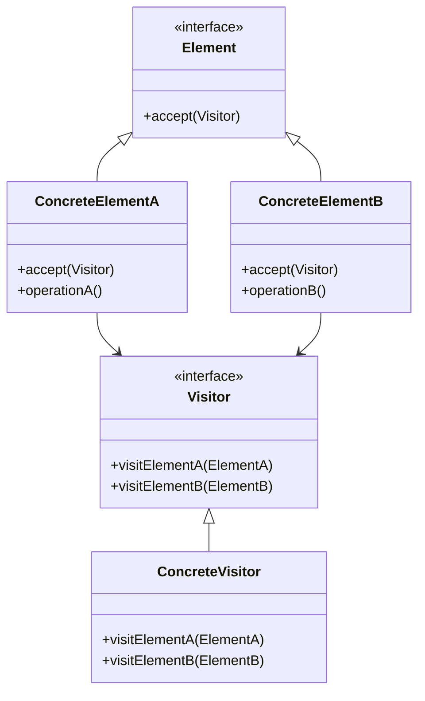

# 10-访问者模式 (Visitor Pattern)

## 目录

- [10-访问者模式 (Visitor Pattern)](#10-访问者模式-visitor-pattern)
  - [目录](#目录)
  - [1. 概述](#1-概述)
    - [1.1 定义](#11-定义)
    - [1.2 核心思想](#12-核心思想)
    - [1.3 模式结构](#13-模式结构)
  - [2. 形式化定义](#2-形式化定义)
    - [2.1 基本定义](#21-基本定义)
    - [2.2 形式化规范](#22-形式化规范)
    - [2.3 双重分派定义](#23-双重分派定义)
  - [3. 数学基础](#3-数学基础)
    - [3.1 函数式编程基础](#31-函数式编程基础)
    - [3.2 算法复杂度分析](#32-算法复杂度分析)
    - [3.3 空间复杂度分析](#33-空间复杂度分析)
  - [4. 设计原则](#4-设计原则)
    - [4.1 开闭原则](#41-开闭原则)
    - [4.2 单一职责原则](#42-单一职责原则)
    - [4.3 依赖倒置原则](#43-依赖倒置原则)
  - [5. Go语言实现](#5-go语言实现)
    - [5.1 基础实现](#51-基础实现)
    - [5.2 泛型实现](#52-泛型实现)
    - [5.3 函数式实现](#53-函数式实现)
    - [5.4 并发安全实现](#54-并发安全实现)
  - [6. 应用场景](#6-应用场景)
    - [6.1 编译器实现](#61-编译器实现)
    - [6.2 图形渲染系统](#62-图形渲染系统)
    - [6.3 数据导出系统](#63-数据导出系统)
  - [7. 性能分析](#7-性能分析)
    - [7.1 时间复杂度](#71-时间复杂度)
    - [7.2 空间复杂度](#72-空间复杂度)
    - [7.3 性能优化建议](#73-性能优化建议)
  - [8. 最佳实践](#8-最佳实践)
    - [8.1 设计原则](#81-设计原则)
    - [8.2 实现建议](#82-实现建议)
    - [8.3 测试策略](#83-测试策略)
  - [9. 相关模式](#9-相关模式)
    - [9.1 策略模式](#91-策略模式)
    - [9.2 命令模式](#92-命令模式)
    - [9.3 组合模式](#93-组合模式)
  - [10. 总结](#10-总结)
    - [10.1 优势](#101-优势)
    - [10.2 劣势](#102-劣势)
    - [10.3 适用场景](#103-适用场景)
    - [10.4 数学总结](#104-数学总结)

## 1. 概述

### 1.1 定义

访问者模式是一种行为型设计模式，它允许在不改变现有类层次结构的情况下，定义新的操作。访问者模式将操作与对象结构分离，使得操作可以独立变化。

### 1.2 核心思想



### 1.3 模式结构

- **Visitor (访问者)**: 定义访问操作的接口
- **ConcreteVisitor (具体访问者)**: 实现具体的访问操作
- **Element (元素)**: 定义接受访问者的接口
- **ConcreteElement (具体元素)**: 实现接受访问者的方法
- **ObjectStructure (对象结构)**: 能够枚举它的元素

## 2. 形式化定义

### 2.1 基本定义

设 ```latex
$\mathcal{V}$
``` 为访问者集合，```latex
$\mathcal{E}$
``` 为元素集合，```latex
$\mathcal{O}$
``` 为操作集合。

**定义 2.1** (访问者模式)
访问者模式是一个五元组 ```latex
$(\mathcal{V}, \mathcal{E}, \mathcal{O}, \mathcal{A}, \mathcal{S})$
```，其中：

- ```latex
$\mathcal{V} = \{V_1, V_2, \ldots, V_n\}$
``` 是访问者集合
- ```latex
$\mathcal{E} = \{E_1, E_2, \ldots, E_m\}$
``` 是元素集合
- ```latex
$\mathcal{O} = \{O_1, O_2, \ldots, O_k\}$
``` 是操作集合
- ```latex
$\mathcal{A}: \mathcal{E} \times \mathcal{V} \rightarrow \mathcal{O}$
``` 是接受函数
- ```latex
$\mathcal{S}: \mathcal{E}^* \rightarrow \mathcal{V} \rightarrow \mathcal{O}^*$
``` 是访问序列函数

### 2.2 形式化规范

**公理 2.1** (访问者分离性)
对于任意元素 ```latex
$E \in \mathcal{E}$
``` 和访问者 ```latex
$V \in \mathcal{V}$
```：

$```latex
$\mathcal{A}(E, V) = V.\text{visit}(E)$
```$

**公理 2.2** (操作独立性)
对于任意操作 ```latex
$O \in \mathcal{O}$
``` 和元素 ```latex
$E \in \mathcal{E}$
```：

$```latex
$\exists V \in \mathcal{V}: O = \mathcal{A}(E, V)$
```$

### 2.3 双重分派定义

**定义 2.2** (双重分派)
双重分派是一个函数 ```latex
$\mathcal{D}: \mathcal{E} \times \mathcal{V} \rightarrow \mathcal{O}$
```，满足：

$```latex
$\mathcal{D}(E, V) = V.\text{visit}(E) = E.\text{accept}(V)$
```$

## 3. 数学基础

### 3.1 函数式编程基础

**定理 3.1** (访问者模式同构性)
设 ```latex
$G_1 = (\mathcal{E}_1, \mathcal{V}_1)$
``` 和 ```latex
$G_2 = (\mathcal{E}_2, \mathcal{V}_2)$
``` 为两个访问者结构，如果存在同构映射 ```latex
$\phi: \mathcal{E}_1 \rightarrow \mathcal{E}_2$
``` 和 ```latex
$\psi: \mathcal{V}_1 \rightarrow \mathcal{V}_2$
```，则：

$```latex
$\forall e \in \mathcal{E}_1, \forall v \in \mathcal{V}_1: \psi(v).\text{visit}(\phi(e)) = \phi(v.\text{visit}(e))$
```$

**证明**:

1. 由同构定义，```latex
$\phi$
``` 和 ```latex
$\psi$
``` 都是双射
2. 对于任意 ```latex
$e \in \mathcal{E}_1$
``` 和 ```latex
$v \in \mathcal{V}_1$
```，存在唯一的 ```latex
$\phi(e) \in \mathcal{E}_2$
``` 和 ```latex
$\psi(v) \in \mathcal{V}_2$
```
3. 由于访问者模式的结构不变性，访问操作的结果应该保持一致
4. 因此 ```latex
$\psi(v).\text{visit}(\phi(e)) = \phi(v.\text{visit}(e))$
```

### 3.2 算法复杂度分析

**定理 3.2** (访问者模式时间复杂度)
设对象结构包含 ```latex
$n$
``` 个元素，每个访问者需要访问所有元素，则时间复杂度为：

$```latex
$T(n) = O(n \cdot m)$
```$

其中 ```latex
$m$
``` 是访问者数量。

**证明**:

1. 每个访问者需要访问所有 ```latex
$n$
``` 个元素
2. 每个访问操作的时间复杂度为 ```latex
$O(1)$
```
3. 总共有 ```latex
$m$
``` 个访问者
4. 总时间复杂度为 ```latex
$O(n \cdot m)$
```

### 3.3 空间复杂度分析

**定理 3.3** (访问者模式空间复杂度)
访问者模式的空间复杂度为：

$```latex
$S(n) = O(n + m)$
```$

其中 ```latex
$n$
``` 是元素数量，```latex
$m$
``` 是访问者数量。

**证明**:

1. 需要存储 ```latex
$n$
``` 个元素
2. 需要存储 ```latex
$m$
``` 个访问者
3. 访问过程中的临时空间为 ```latex
$O(1)$
```
4. 总空间复杂度为 ```latex
$O(n + m)$
```

## 4. 设计原则

### 4.1 开闭原则

访问者模式完美体现了开闭原则：

- **对扩展开放**: 可以通过添加新的访问者来扩展操作
- **对修改封闭**: 元素类不需要修改

### 4.2 单一职责原则

每个访问者只负责一种类型的操作，元素只负责数据结构。

### 4.3 依赖倒置原则

元素依赖访问者接口，而不是具体实现。

## 5. Go语言实现

### 5.1 基础实现

```go
package main

import (
 "fmt"
 "math"
)

// Visitor 访问者接口
type Visitor interface {
 VisitCircle(*Circle)
 VisitRectangle(*Rectangle)
 VisitTriangle(*Triangle)
}

// Element 元素接口
type Element interface {
 Accept(Visitor)
}

// Shape 形状基类
type Shape struct {
 Name string
}

// Circle 圆形
type Circle struct {
 Shape
 Radius float64
}

func (c *Circle) Accept(v Visitor) {
 v.VisitCircle(c)
}

// Rectangle 矩形
type Rectangle struct {
 Shape
 Width  float64
 Height float64
}

func (r *Rectangle) Accept(v Visitor) {
 v.VisitRectangle(r)
}

// Triangle 三角形
type Triangle struct {
 Shape
 A, B, C float64 // 三边长度
}

func (t *Triangle) Accept(v Visitor) {
 v.VisitTriangle(t)
}

// AreaVisitor 面积计算访问者
type AreaVisitor struct{}

func (a *AreaVisitor) VisitCircle(c *Circle) {
 area := math.Pi * c.Radius * c.Radius
 fmt.Printf("圆形 %s 的面积: %.2f\n", c.Name, area)
}

func (a *AreaVisitor) VisitRectangle(r *Rectangle) {
 area := r.Width * r.Height
 fmt.Printf("矩形 %s 的面积: %.2f\n", r.Name, area)
}

func (a *AreaVisitor) VisitTriangle(t *Triangle) {
 // 使用海伦公式计算面积
 s := (t.A + t.B + t.C) / 2
 area := math.Sqrt(s * (s - t.A) * (s - t.B) * (s - t.C))
 fmt.Printf("三角形 %s 的面积: %.2f\n", t.Name, area)
}

// PerimeterVisitor 周长计算访问者
type PerimeterVisitor struct{}

func (p *PerimeterVisitor) VisitCircle(c *Circle) {
 perimeter := 2 * math.Pi * c.Radius
 fmt.Printf("圆形 %s 的周长: %.2f\n", c.Name, perimeter)
}

func (p *PerimeterVisitor) VisitRectangle(r *Rectangle) {
 perimeter := 2 * (r.Width + r.Height)
 fmt.Printf("矩形 %s 的周长: %.2f\n", r.Name, perimeter)
}

func (p *PerimeterVisitor) VisitTriangle(t *Triangle) {
 perimeter := t.A + t.B + t.C
 fmt.Printf("三角形 %s 的周长: %.2f\n", t.Name, perimeter)
}

// ObjectStructure 对象结构
type ObjectStructure struct {
 elements []Element
}

func (o *ObjectStructure) Add(element Element) {
 o.elements = append(o.elements, element)
}

func (o *ObjectStructure) Accept(visitor Visitor) {
 for _, element := range o.elements {
  element.Accept(visitor)
 }
}

func main() {
 // 创建对象结构
 structure := &ObjectStructure{}
 
 // 添加元素
 structure.Add(&Circle{Shape: Shape{Name: "圆1"}, Radius: 5})
 structure.Add(&Rectangle{Shape: Shape{Name: "矩形1"}, Width: 4, Height: 6})
 structure.Add(&Triangle{Shape: Shape{Name: "三角形1"}, A: 3, B: 4, C: 5})
 
 // 创建访问者
 areaVisitor := &AreaVisitor{}
 perimeterVisitor := &PerimeterVisitor{}
 
 // 执行访问
 fmt.Println("=== 计算面积 ===")
 structure.Accept(areaVisitor)
 
 fmt.Println("\n=== 计算周长 ===")
 structure.Accept(perimeterVisitor)
}
```

### 5.2 泛型实现

```go
package main

import (
 "fmt"
 "reflect"
)

// GenericVisitor 泛型访问者接口
type GenericVisitor[T any] interface {
 Visit(data T) error
}

// GenericElement 泛型元素接口
type GenericElement[T any] interface {
 Accept(visitor GenericVisitor[T]) error
}

// Document 文档类型
type Document struct {
 ID      string
 Content string
 Type    string
}

func (d *Document) Accept(visitor GenericVisitor[*Document]) error {
 return visitor.Visit(d)
}

// Image 图片类型
type Image struct {
 ID       string
 Path     string
 Format   string
 Size     int64
}

func (i *Image) Accept(visitor GenericVisitor[*Image]) error {
 return visitor.Visit(i)
}

// Video 视频类型
type Video struct {
 ID       string
 Path     string
 Duration int
 Quality  string
}

func (v *Video) Accept(visitor GenericVisitor[*Video]) error {
 return visitor.Visit(v)
}

// ExportVisitor 导出访问者
type ExportVisitor struct{}

func (e *ExportVisitor) Visit(doc *Document) error {
 fmt.Printf("导出文档: %s (%s)\n", doc.ID, doc.Type)
 return nil
}

func (e *ExportVisitor) Visit(img *Image) error {
 fmt.Printf("导出图片: %s (%s, %d bytes)\n", img.ID, img.Format, img.Size)
 return nil
}

func (e *ExportVisitor) Visit(video *Video) error {
 fmt.Printf("导出视频: %s (%s, %d seconds)\n", video.ID, video.Quality, video.Duration)
 return nil
}

// CompressVisitor 压缩访问者
type CompressVisitor struct{}

func (c *CompressVisitor) Visit(doc *Document) error {
 fmt.Printf("压缩文档: %s\n", doc.ID)
 return nil
}

func (c *CompressVisitor) Visit(img *Image) error {
 fmt.Printf("压缩图片: %s (从 %d bytes)\n", img.ID, img.Size)
 return nil
}

func (c *CompressVisitor) Visit(video *Video) error {
 fmt.Printf("压缩视频: %s (从 %s 质量)\n", video.ID, video.Quality)
 return nil
}

// GenericObjectStructure 泛型对象结构
type GenericObjectStructure[T any] struct {
 elements []GenericElement[T]
}

func (g *GenericObjectStructure[T]) Add(element GenericElement[T]) {
 g.elements = append(g.elements, element)
}

func (g *GenericObjectStructure[T]) Accept(visitor GenericVisitor[T]) error {
 for _, element := range g.elements {
  if err := element.Accept(visitor); err != nil {
   return err
  }
 }
 return nil
}

func main() {
 // 创建文档结构
 docStructure := &GenericObjectStructure[*Document]{}
 docStructure.Add(&Document{ID: "doc1", Content: "Hello", Type: "txt"})
 docStructure.Add(&Document{ID: "doc2", Content: "World", Type: "pdf"})
 
 // 创建图片结构
 imgStructure := &GenericObjectStructure[*Image]{}
 imgStructure.Add(&Image{ID: "img1", Path: "/path1", Format: "jpg", Size: 1024})
 imgStructure.Add(&Image{ID: "img2", Path: "/path2", Format: "png", Size: 2048})
 
 // 创建视频结构
 videoStructure := &GenericObjectStructure[*Video]{}
 videoStructure.Add(&Video{ID: "vid1", Path: "/path3", Duration: 120, Quality: "HD"})
 videoStructure.Add(&Video{ID: "vid2", Path: "/path4", Duration: 300, Quality: "4K"})
 
 // 创建访问者
 exportVisitor := &ExportVisitor{}
 compressVisitor := &CompressVisitor{}
 
 // 执行访问
 fmt.Println("=== 导出操作 ===")
 docStructure.Accept(exportVisitor)
 imgStructure.Accept(exportVisitor)
 videoStructure.Accept(exportVisitor)
 
 fmt.Println("\n=== 压缩操作 ===")
 docStructure.Accept(compressVisitor)
 imgStructure.Accept(compressVisitor)
 videoStructure.Accept(compressVisitor)
}
```

### 5.3 函数式实现

```go
package main

import (
 "fmt"
 "strings"
)

// FunctionalVisitor 函数式访问者
type FunctionalVisitor[T any] func(T) error

// FunctionalElement 函数式元素
type FunctionalElement[T any] struct {
 data T
}

func (f *FunctionalElement[T]) Accept(visitor FunctionalVisitor[T]) error {
 return visitor(f.data)
}

// AST节点类型
type ASTNode interface {
 GetType() string
 GetValue() string
}

type NumberNode struct {
 value float64
}

func (n *NumberNode) GetType() string { return "Number" }
func (n *NumberNode) GetValue() string { return fmt.Sprintf("%f", n.value) }

type StringNode struct {
 value string
}

func (n *StringNode) GetType() string { return "String" }
func (n *StringNode) GetValue() string { return n.value }

type BinaryOpNode struct {
 operator string
 left     *FunctionalElement[ASTNode]
 right    *FunctionalElement[ASTNode]
}

func (n *BinaryOpNode) GetType() string { return "BinaryOp" }
func (n *BinaryOpNode) GetValue() string { return n.operator }

// 访问者函数
func PrintVisitor(node ASTNode) error {
 fmt.Printf("节点类型: %s, 值: %s\n", node.GetType(), node.GetValue())
 return nil
}

func EvaluateVisitor(node ASTNode) error {
 switch n := node.(type) {
 case *NumberNode:
  fmt.Printf("数值: %f\n", n.value)
 case *StringNode:
  fmt.Printf("字符串: %s\n", n.value)
 case *BinaryOpNode:
  fmt.Printf("二元操作: %s\n", n.operator)
 }
 return nil
}

func SerializeVisitor(node ASTNode) error {
 switch n := node.(type) {
 case *NumberNode:
  fmt.Printf("{\"type\":\"number\",\"value\":%f}\n", n.value)
 case *StringNode:
  fmt.Printf("{\"type\":\"string\",\"value\":\"%s\"}\n", n.value)
 case *BinaryOpNode:
  fmt.Printf("{\"type\":\"binary_op\",\"operator\":\"%s\"}\n", n.operator)
 }
 return nil
}

func main() {
 // 创建AST节点
 numberNode := &FunctionalElement[ASTNode]{
  data: &NumberNode{value: 42.5},
 }
 
 stringNode := &FunctionalElement[ASTNode]{
  data: &StringNode{value: "Hello, World!"},
 }
 
 binaryOpNode := &FunctionalElement[ASTNode]{
  data: &BinaryOpNode{operator: "+"},
 }
 
 // 执行不同的访问者
 fmt.Println("=== 打印访问者 ===")
 numberNode.Accept(PrintVisitor)
 stringNode.Accept(PrintVisitor)
 binaryOpNode.Accept(PrintVisitor)
 
 fmt.Println("\n=== 求值访问者 ===")
 numberNode.Accept(EvaluateVisitor)
 stringNode.Accept(EvaluateVisitor)
 binaryOpNode.Accept(EvaluateVisitor)
 
 fmt.Println("\n=== 序列化访问者 ===")
 numberNode.Accept(SerializeVisitor)
 stringNode.Accept(SerializeVisitor)
 binaryOpNode.Accept(SerializeVisitor)
}
```

### 5.4 并发安全实现

```go
package main

import (
 "fmt"
 "sync"
 "time"
)

// ThreadSafeVisitor 线程安全访问者
type ThreadSafeVisitor struct {
 mu sync.RWMutex
 results map[string]interface{}
}

func NewThreadSafeVisitor() *ThreadSafeVisitor {
 return &ThreadSafeVisitor{
  results: make(map[string]interface{}),
 }
}

func (t *ThreadSafeVisitor) VisitCircle(c *Circle) {
 t.mu.Lock()
 defer t.mu.Unlock()
 
 area := 3.14159 * c.Radius * c.Radius
 t.results[c.Name] = area
 fmt.Printf("访问圆形 %s: 面积 = %.2f\n", c.Name, area)
}

func (t *ThreadSafeVisitor) VisitRectangle(r *Rectangle) {
 t.mu.Lock()
 defer t.mu.Unlock()
 
 area := r.Width * r.Height
 t.results[r.Name] = area
 fmt.Printf("访问矩形 %s: 面积 = %.2f\n", r.Name, area)
}

func (t *ThreadSafeVisitor) VisitTriangle(tri *Triangle) {
 t.mu.Lock()
 defer t.mu.Unlock()
 
 // 简化的面积计算
 area := 0.5 * tri.A * tri.B
 t.results[tri.Name] = area
 fmt.Printf("访问三角形 %s: 面积 = %.2f\n", tri.Name, area)
}

func (t *ThreadSafeVisitor) GetResults() map[string]interface{} {
 t.mu.RLock()
 defer t.mu.RUnlock()
 
 result := make(map[string]interface{})
 for k, v := range t.results {
  result[k] = v
 }
 return result
}

// ThreadSafeObjectStructure 线程安全对象结构
type ThreadSafeObjectStructure struct {
 mu       sync.RWMutex
 elements []Element
}

func NewThreadSafeObjectStructure() *ThreadSafeObjectStructure {
 return &ThreadSafeObjectStructure{
  elements: make([]Element, 0),
 }
}

func (t *ThreadSafeObjectStructure) Add(element Element) {
 t.mu.Lock()
 defer t.mu.Unlock()
 t.elements = append(t.elements, element)
}

func (t *ThreadSafeObjectStructure) Accept(visitor Visitor) {
 t.mu.RLock()
 defer t.mu.RUnlock()
 
 for _, element := range t.elements {
  element.Accept(visitor)
  time.Sleep(10 * time.Millisecond) // 模拟处理时间
 }
}

func main() {
 // 创建线程安全对象结构
 structure := NewThreadSafeObjectStructure()
 
 // 添加元素
 structure.Add(&Circle{Shape: Shape{Name: "圆1"}, Radius: 5})
 structure.Add(&Rectangle{Shape: Shape{Name: "矩形1"}, Width: 4, Height: 6})
 structure.Add(&Triangle{Shape: Shape{Name: "三角形1"}, A: 3, B: 4, C: 5})
 
 // 创建线程安全访问者
 visitor := NewThreadSafeVisitor()
 
 // 并发访问
 var wg sync.WaitGroup
 for i := 0; i < 3; i++ {
  wg.Add(1)
  go func(id int) {
   defer wg.Done()
   fmt.Printf("协程 %d 开始访问\n", id)
   structure.Accept(visitor)
  }(i)
 }
 
 wg.Wait()
 
 // 获取结果
 results := visitor.GetResults()
 fmt.Printf("\n最终结果: %+v\n", results)
}
```

## 6. 应用场景

### 6.1 编译器实现

```go
// AST访问者模式在编译器中的应用
type ASTVisitor interface {
 VisitLiteral(*LiteralNode)
 VisitBinary(*BinaryNode)
 VisitUnary(*UnaryNode)
 VisitVariable(*VariableNode)
}

type CodeGenerator struct{}

func (c *CodeGenerator) VisitLiteral(node *LiteralNode) {
 fmt.Printf("生成字面量代码: %v\n", node.Value)
}

func (c *CodeGenerator) VisitBinary(node *BinaryNode) {
 fmt.Printf("生成二元操作代码: %s\n", node.Operator)
}

func (c *CodeGenerator) VisitUnary(node *UnaryNode) {
 fmt.Printf("生成一元操作代码: %s\n", node.Operator)
}

func (c *CodeGenerator) VisitVariable(node *VariableNode) {
 fmt.Printf("生成变量代码: %s\n", node.Name)
}
```

### 6.2 图形渲染系统

```go
// 图形渲染访问者
type RenderVisitor interface {
 VisitCircle(*Circle)
 VisitRectangle(*Rectangle)
 VisitTriangle(*Triangle)
}

type SVGRenderer struct{}

func (s *SVGRenderer) VisitCircle(c *Circle) {
 fmt.Printf("<circle cx=\"%f\" cy=\"%f\" r=\"%f\"/>\n", c.X, c.Y, c.Radius)
}

func (s *SVGRenderer) VisitRectangle(r *Rectangle) {
 fmt.Printf("<rect x=\"%f\" y=\"%f\" width=\"%f\" height=\"%f\"/>\n", 
  r.X, r.Y, r.Width, r.Height)
}

func (s *SVGRenderer) VisitTriangle(t *Triangle) {
 fmt.Printf("<polygon points=\"%f,%f %f,%f %f,%f\"/>\n", 
  t.X1, t.Y1, t.X2, t.Y2, t.X3, t.Y3)
}
```

### 6.3 数据导出系统

```go
// 数据导出访问者
type ExportVisitor interface {
 VisitUser(*User)
 VisitOrder(*Order)
 VisitProduct(*Product)
}

type JSONExporter struct{}

func (j *JSONExporter) VisitUser(u *User) {
 fmt.Printf("{\"type\":\"user\",\"id\":\"%s\",\"name\":\"%s\"}\n", u.ID, u.Name)
}

func (j *JSONExporter) VisitOrder(o *Order) {
 fmt.Printf("{\"type\":\"order\",\"id\":\"%s\",\"amount\":%.2f}\n", o.ID, o.Amount)
}

func (j *JSONExporter) VisitProduct(p *Product) {
 fmt.Printf("{\"type\":\"product\",\"id\":\"%s\",\"price\":%.2f}\n", p.ID, p.Price)
}
```

## 7. 性能分析

### 7.1 时间复杂度

| 操作 | 时间复杂度 | 说明 |
|------|------------|------|
| 访问单个元素 | O(1) | 直接方法调用 |
| 访问所有元素 | O(n) | n为元素数量 |
| 添加新访问者 | O(1) | 不需要修改元素类 |
| 添加新元素 | O(1) | 需要修改所有访问者 |

### 7.2 空间复杂度

| 组件 | 空间复杂度 | 说明 |
|------|------------|------|
| 访问者 | O(1) | 每个访问者固定大小 |
| 元素 | O(1) | 每个元素固定大小 |
| 对象结构 | O(n) | n为元素数量 |
| 访问结果 | O(n) | 存储所有访问结果 |

### 7.3 性能优化建议

1. **减少虚函数调用**: 使用内联函数
2. **缓存访问结果**: 避免重复计算
3. **批量处理**: 一次处理多个元素
4. **并行访问**: 使用goroutine并发访问

## 8. 最佳实践

### 8.1 设计原则

1. **保持访问者简单**: 每个访问者只负责一种操作
2. **避免访问者状态**: 访问者应该是无状态的
3. **合理使用双重分派**: 充分利用Go的接口特性
4. **文档化访问方法**: 明确说明每个访问方法的用途

### 8.2 实现建议

1. **使用接口**: 充分利用Go的接口特性
2. **提供默认实现**: 通过嵌入结构体提供默认行为
3. **使用泛型**: 对于类型无关的操作使用泛型
4. **考虑并发安全**: 在多线程环境中使用锁保护

### 8.3 测试策略

```go
// 测试访问者模式
func TestVisitorPattern(t *testing.T) {
 // 创建测试元素
 circle := &Circle{Shape: Shape{Name: "test"}, Radius: 5}
 
 // 创建模拟访问者
 mockVisitor := &MockVisitor{}
 
 // 执行访问
 circle.Accept(mockVisitor)
 
 // 验证调用
 assert.True(t, mockVisitor.visitedCircle)
}

type MockVisitor struct {
 visitedCircle bool
}

func (m *MockVisitor) VisitCircle(c *Circle) {
 m.visitedCircle = true
}

func (m *MockVisitor) VisitRectangle(r *Rectangle) {}
func (m *MockVisitor) VisitTriangle(t *Triangle) {}
```

## 9. 相关模式

### 9.1 策略模式

- **相似点**: 都使用多态
- **区别**: 策略模式改变算法，访问者模式改变操作

### 9.2 命令模式

- **相似点**: 都封装操作
- **区别**: 命令模式封装单个操作，访问者模式封装操作集合

### 9.3 组合模式

- **相似点**: 都处理对象结构
- **区别**: 组合模式处理层次结构，访问者模式处理操作分离

## 10. 总结

### 10.1 优势

1. **操作分离**: 将操作与数据结构分离
2. **易于扩展**: 添加新操作不需要修改元素类
3. **类型安全**: 利用Go的接口提供类型安全
4. **代码复用**: 操作可以在不同元素间复用

### 10.2 劣势

1. **违反封装**: 访问者需要访问元素的内部状态
2. **增加复杂性**: 增加了代码的抽象层次
3. **难以维护**: 添加新元素需要修改所有访问者
4. **性能开销**: 虚函数调用和双重分派的开销

### 10.3 适用场景

1. **复杂对象结构**: 需要多种操作的对象结构
2. **操作与数据分离**: 操作经常变化但数据结构稳定
3. **类型安全操作**: 需要类型安全的操作
4. **编译器实现**: AST遍历和代码生成

### 10.4 数学总结

访问者模式通过形式化定义 ```latex
$(\mathcal{V}, \mathcal{E}, \mathcal{O}, \mathcal{A}, \mathcal{S})$
``` 实现了操作与数据结构的分离，其中：

- **双重分派**: ```latex
$\mathcal{D}(E, V) = V.\text{visit}(E) = E.\text{accept}(V)$
```
- **时间复杂度**: ```latex
$T(n) = O(n \cdot m)$
```
- **空间复杂度**: ```latex
$S(n) = O(n + m)$
```
- **操作独立性**: ```latex
$\exists V \in \mathcal{V}: O = \mathcal{A}(E, V)$
```

这种模式在Go语言中通过接口和泛型得到了优雅的实现，既保持了类型安全，又提供了良好的扩展性。

---

**相关链接**:

- [09-模板方法模式](./09-Template-Method-Pattern.md)
- [11-解释器模式](./11-Interpreter-Pattern.md)
- [设计模式概述](../README.md)
