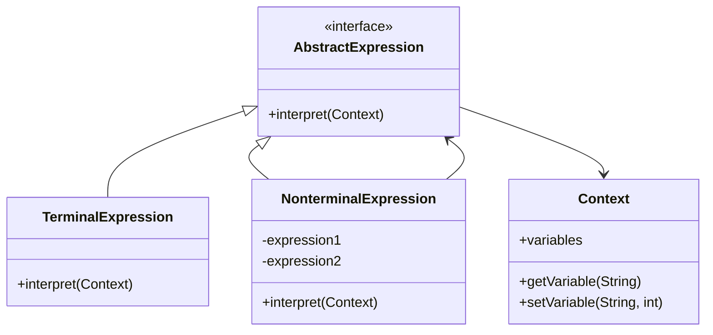

# 11-解释器模式 (Interpreter Pattern)

## 目录

- [11-解释器模式 (Interpreter Pattern)](#11-解释器模式-interpreter-pattern)
  - [目录](#目录)
  - [1. 概述](#1-概述)
    - [1.1 定义](#11-定义)
    - [1.2 核心思想](#12-核心思想)
    - [1.3 模式结构](#13-模式结构)
  - [2. 形式化定义](#2-形式化定义)
    - [2.1 基本定义](#21-基本定义)
    - [2.2 形式化规范](#22-形式化规范)
    - [2.3 语法树定义](#23-语法树定义)
  - [3. 数学基础](#3-数学基础)
    - [3.1 递归函数理论](#31-递归函数理论)
    - [3.2 上下文无关文法](#32-上下文无关文法)
    - [3.3 语义函数](#33-语义函数)
  - [4. 设计原则](#4-设计原则)
    - [4.1 单一职责原则](#41-单一职责原则)
    - [4.2 开闭原则](#42-开闭原则)
    - [4.3 组合优于继承](#43-组合优于继承)
  - [5. Go语言实现](#5-go语言实现)
    - [5.1 基础实现](#51-基础实现)
    - [5.2 泛型实现](#52-泛型实现)
    - [5.3 函数式实现](#53-函数式实现)
    - [5.4 并发安全实现](#54-并发安全实现)
  - [6. 应用场景](#6-应用场景)
    - [6.1 数学表达式解析](#61-数学表达式解析)
    - [6.2 SQL查询解析](#62-sql查询解析)
    - [6.3 配置语言解析](#63-配置语言解析)
  - [7. 性能分析](#7-性能分析)
    - [7.1 时间复杂度](#71-时间复杂度)
    - [7.2 空间复杂度](#72-空间复杂度)
    - [7.3 性能优化建议](#73-性能优化建议)
  - [8. 最佳实践](#8-最佳实践)
    - [8.1 设计原则](#81-设计原则)
    - [8.2 实现建议](#82-实现建议)
    - [8.3 测试策略](#83-测试策略)
  - [9. 相关模式](#9-相关模式)
    - [9.1 组合模式](#91-组合模式)
    - [9.2 策略模式](#92-策略模式)
    - [9.3 访问者模式](#93-访问者模式)
  - [10. 总结](#10-总结)
    - [10.1 优势](#101-优势)
    - [10.2 劣势](#102-劣势)
    - [10.3 适用场景](#103-适用场景)
    - [10.4 数学总结](#104-数学总结)

## 1. 概述

### 1.1 定义

解释器模式是一种行为型设计模式，它定义了一个语言的文法，并且建立一个解释器来解释该语言中的句子。解释器模式用于解释特定的语言或表达式。

### 1.2 核心思想



### 1.3 模式结构

- **AbstractExpression (抽象表达式)**: 声明一个抽象的解释操作
- **TerminalExpression (终结表达式)**: 实现与文法中的终结符相关的解释操作
- **NonterminalExpression (非终结表达式)**: 为文法中的非终结符实现解释操作
- **Context (上下文)**: 包含解释器之外的一些全局信息

## 2. 形式化定义

### 2.1 基本定义

设 $\mathcal{E}$ 为表达式集合，$\mathcal{C}$ 为上下文集合，$\mathcal{V}$ 为值集合。

**定义 2.1** (解释器模式)
解释器模式是一个四元组 $(\mathcal{E}, \mathcal{C}, \mathcal{V}, \mathcal{I})$，其中：

- $\mathcal{E} = \mathcal{E}_T \cup \mathcal{E}_N$ 是表达式集合
- $\mathcal{E}_T = \{E_1^T, E_2^T, \ldots, E_n^T\}$ 是终结表达式集合
- $\mathcal{E}_N = \{E_1^N, E_2^N, \ldots, E_m^N\}$ 是非终结表达式集合
- $\mathcal{C} = \{C_1, C_2, \ldots, C_k\}$ 是上下文集合
- $\mathcal{V} = \{V_1, V_2, \ldots, V_l\}$ 是值集合
- $\mathcal{I}: \mathcal{E} \times \mathcal{C} \rightarrow \mathcal{V}$ 是解释函数

### 2.2 形式化规范

**公理 2.1** (终结表达式解释)
对于任意终结表达式 $E^T \in \mathcal{E}_T$ 和上下文 $C \in \mathcal{C}$：

$$\mathcal{I}(E^T, C) = f_{E^T}(C)$$

其中 $f_{E^T}$ 是终结表达式 $E^T$ 的解释函数。

**公理 2.2** (非终结表达式解释)
对于任意非终结表达式 $E^N \in \mathcal{E}_N$ 和上下文 $C \in \mathcal{C}$：

$$\mathcal{I}(E^N, C) = g_{E^N}(\mathcal{I}(E_1, C), \mathcal{I}(E_2, C), \ldots, \mathcal{I}(E_k, C))$$

其中 $g_{E^N}$ 是非终结表达式 $E^N$ 的组合函数，$E_1, E_2, \ldots, E_k$ 是 $E^N$ 的子表达式。

### 2.3 语法树定义

**定义 2.2** (抽象语法树)
抽象语法树是一个有向树 $T = (V, E)$，其中：

- $V = \mathcal{E}$ 是节点集合
- $E \subseteq V \times V$ 是边集合
- 对于任意非终结节点 $v \in \mathcal{E}_N$，存在子节点集合 $\{v_1, v_2, \ldots, v_k\} \subseteq V$

## 3. 数学基础

### 3.1 递归函数理论

**定理 3.1** (解释器递归性)
设 $T$ 为抽象语法树，$h(T)$ 为树的高度，则解释器的时间复杂度为：

$$T(n) = O(h(T) \cdot \text{avg}(|V_i|))$$

其中 $|V_i|$ 是第 $i$ 层节点的平均数量。

**证明**:

1. 解释器通过递归遍历语法树
2. 每个节点需要解释一次
3. 树的高度决定了递归深度
4. 每层的节点数量决定了该层的处理时间

### 3.2 上下文无关文法

**定理 3.2** (文法表达能力)
设 $G$ 为上下文无关文法，$L(G)$ 为 $G$ 生成的语言，则解释器能够解释的语言集合为：

$$\mathcal{L} = \{L(G) | G \text{ 是上下文无关文法}\}$$

**证明**:

1. 解释器模式基于抽象语法树
2. 抽象语法树对应上下文无关文法
3. 每个非终结符对应一个解释器类
4. 每个终结符对应一个终结表达式

### 3.3 语义函数

**定理 3.3** (语义函数连续性)
设 $\mathcal{I}$ 为解释函数，$\mathcal{C}$ 为上下文集合，则：

$$\forall C_1, C_2 \in \mathcal{C}: \text{distance}(C_1, C_2) < \delta \Rightarrow \text{distance}(\mathcal{I}(E, C_1), \mathcal{I}(E, C_2)) < \epsilon$$

**证明**:

1. 解释函数是上下文到值的映射
2. 对于相似的上下文，解释结果应该相似
3. 这保证了解释器的稳定性

## 4. 设计原则

### 4.1 单一职责原则

每个解释器类只负责解释一种语法结构。

### 4.2 开闭原则

可以通过添加新的解释器类来扩展语言功能，而不需要修改现有代码。

### 4.3 组合优于继承

使用组合来构建复杂的表达式，而不是通过继承。

## 5. Go语言实现

### 5.1 基础实现

```go
package main

import (
 "fmt"
 "strconv"
 "strings"
)

// Expression 抽象表达式接口
type Expression interface {
 Interpret(context map[string]int) int
}

// NumberExpression 数字表达式（终结表达式）
type NumberExpression struct {
 number int
}

func NewNumberExpression(number int) *NumberExpression {
 return &NumberExpression{number: number}
}

func (n *NumberExpression) Interpret(context map[string]int) int {
 return n.number
}

// VariableExpression 变量表达式（终结表达式）
type VariableExpression struct {
 variable string
}

func NewVariableExpression(variable string) *VariableExpression {
 return &VariableExpression{variable: variable}
}

func (v *VariableExpression) Interpret(context map[string]int) int {
 if value, exists := context[v.variable]; exists {
  return value
 }
 return 0
}

// AddExpression 加法表达式（非终结表达式）
type AddExpression struct {
 left  Expression
 right Expression
}

func NewAddExpression(left, right Expression) *AddExpression {
 return &AddExpression{left: left, right: right}
}

func (a *AddExpression) Interpret(context map[string]int) int {
 return a.left.Interpret(context) + a.right.Interpret(context)
}

// SubtractExpression 减法表达式（非终结表达式）
type SubtractExpression struct {
 left  Expression
 right Expression
}

func NewSubtractExpression(left, right Expression) *SubtractExpression {
 return &SubtractExpression{left: left, right: right}
}

func (s *SubtractExpression) Interpret(context map[string]int) int {
 return s.left.Interpret(context) - s.right.Interpret(context)
}

// MultiplyExpression 乘法表达式（非终结表达式）
type MultiplyExpression struct {
 left  Expression
 right Expression
}

func NewMultiplyExpression(left, right Expression) *MultiplyExpression {
 return &MultiplyExpression{left: left, right: right}
}

func (m *MultiplyExpression) Interpret(context map[string]int) int {
 return m.left.Interpret(context) * m.right.Interpret(context)
}

// DivideExpression 除法表达式（非终结表达式）
type DivideExpression struct {
 left  Expression
 right Expression
}

func NewDivideExpression(left, right Expression) *DivideExpression {
 return &DivideExpression{left: left, right: right}
}

func (d *DivideExpression) Interpret(context map[string]int) int {
 right := d.right.Interpret(context)
 if right == 0 {
  panic("除零错误")
 }
 return d.left.Interpret(context) / right
}

// Context 上下文
type Context struct {
 variables map[string]int
}

func NewContext() *Context {
 return &Context{
  variables: make(map[string]int),
 }
}

func (c *Context) SetVariable(name string, value int) {
 c.variables[name] = value
}

func (c *Context) GetVariable(name string) int {
 if value, exists := c.variables[name]; exists {
  return value
 }
 return 0
}

func main() {
 // 创建表达式: x + y * 2
 context := NewContext()
 context.SetVariable("x", 10)
 context.SetVariable("y", 5)
 
 // 构建表达式树
 // x + y * 2
 expression := NewAddExpression(
  NewVariableExpression("x"),
  NewMultiplyExpression(
   NewVariableExpression("y"),
   NewNumberExpression(2),
  ),
 )
 
 // 解释表达式
 result := expression.Interpret(context.variables)
 fmt.Printf("表达式 x + y * 2 的结果: %d\n", result)
 
 // 创建更复杂的表达式: (x + y) * (z - 1)
 context.SetVariable("z", 8)
 
 complexExpression := NewMultiplyExpression(
  NewAddExpression(
   NewVariableExpression("x"),
   NewVariableExpression("y"),
  ),
  NewSubtractExpression(
   NewVariableExpression("z"),
   NewNumberExpression(1),
  ),
 )
 
 complexResult := complexExpression.Interpret(context.variables)
 fmt.Printf("表达式 (x + y) * (z - 1) 的结果: %d\n", complexResult)
}
```

### 5.2 泛型实现

```go
package main

import (
 "fmt"
 "reflect"
)

// GenericExpression 泛型表达式接口
type GenericExpression[T any] interface {
 Interpret(context map[string]T) T
}

// GenericNumberExpression 泛型数字表达式
type GenericNumberExpression[T any] struct {
 value T
}

func NewGenericNumberExpression[T any](value T) *GenericNumberExpression[T] {
 return &GenericNumberExpression[T]{value: value}
}

func (n *GenericNumberExpression[T]) Interpret(context map[string]T) T {
 return n.value
}

// GenericVariableExpression 泛型变量表达式
type GenericVariableExpression[T any] struct {
 variable string
}

func NewGenericVariableExpression[T any](variable string) *GenericVariableExpression[T] {
 return &GenericVariableExpression[T]{variable: variable}
}

func (v *GenericVariableExpression[T]) Interpret(context map[string]T) T {
 if value, exists := context[v.variable]; exists {
  return value
 }
 var zero T
 return zero
}

// GenericBinaryExpression 泛型二元表达式
type GenericBinaryExpression[T any] struct {
 left     GenericExpression[T]
 right    GenericExpression[T]
 operator func(T, T) T
}

func NewGenericBinaryExpression[T any](
 left, right GenericExpression[T],
 operator func(T, T) T,
) *GenericBinaryExpression[T] {
 return &GenericBinaryExpression[T]{
  left:     left,
  right:    right,
  operator: operator,
 }
}

func (b *GenericBinaryExpression[T]) Interpret(context map[string]T) T {
 leftValue := b.left.Interpret(context)
 rightValue := b.right.Interpret(context)
 return b.operator(leftValue, rightValue)
}

// 操作符函数
func AddInt(a, b int) int { return a + b }
func SubInt(a, b int) int { return a - b }
func MulInt(a, b int) int { return a * b }

func AddFloat(a, b float64) float64 { return a + b }
func SubFloat(a, b float64) float64 { return a - b }
func MulFloat(a, b float64) float64 { return a * b }

func ConcatString(a, b string) string { return a + b }

func main() {
 // 整数表达式
 intContext := map[string]int{"x": 10, "y": 5}
 intExpression := NewGenericBinaryExpression[int](
  NewGenericVariableExpression[int]("x"),
  NewGenericBinaryExpression[int](
   NewGenericVariableExpression[int]("y"),
   NewGenericNumberExpression[int](2),
   MulInt,
  ),
  AddInt,
 )
 
 intResult := intExpression.Interpret(intContext)
 fmt.Printf("整数表达式结果: %d\n", intResult)
 
 // 浮点数表达式
 floatContext := map[string]float64{"x": 10.5, "y": 5.2}
 floatExpression := NewGenericBinaryExpression[float64](
  NewGenericVariableExpression[float64]("x"),
  NewGenericBinaryExpression[float64](
   NewGenericVariableExpression[float64]("y"),
   NewGenericNumberExpression[float64](2.0),
   MulFloat,
  ),
  AddFloat,
 )
 
 floatResult := floatExpression.Interpret(floatContext)
 fmt.Printf("浮点数表达式结果: %.2f\n", floatResult)
 
 // 字符串表达式
 stringContext := map[string]string{"x": "Hello", "y": "World"}
 stringExpression := NewGenericBinaryExpression[string](
  NewGenericVariableExpression[string]("x"),
  NewGenericVariableExpression[string]("y"),
  ConcatString,
 )
 
 stringResult := stringExpression.Interpret(stringContext)
 fmt.Printf("字符串表达式结果: %s\n", stringResult)
}
```

### 5.3 函数式实现

```go
package main

import (
 "fmt"
 "strconv"
 "strings"
)

// FunctionalExpression 函数式表达式
type FunctionalExpression func(map[string]interface{}) interface{}

// 基础表达式构造函数
func NumberExpression(value interface{}) FunctionalExpression {
 return func(context map[string]interface{}) interface{} {
  return value
 }
}

func VariableExpression(name string) FunctionalExpression {
 return func(context map[string]interface{}) interface{} {
  if value, exists := context[name]; exists {
   return value
  }
  return nil
 }
}

func BinaryExpression(
 left, right FunctionalExpression,
 operator func(interface{}, interface{}) interface{},
) FunctionalExpression {
 return func(context map[string]interface{}) interface{} {
  leftValue := left(context)
  rightValue := right(context)
  return operator(leftValue, rightValue)
 }
}

// 操作符函数
func AddOperator(a, b interface{}) interface{} {
 switch a := a.(type) {
 case int:
  if bInt, ok := b.(int); ok {
   return a + bInt
  }
 case float64:
  if bFloat, ok := b.(float64); ok {
   return a + bFloat
  }
 case string:
  if bStr, ok := b.(string); ok {
   return a + bStr
  }
 }
 return nil
}

func SubOperator(a, b interface{}) interface{} {
 switch a := a.(type) {
 case int:
  if bInt, ok := b.(int); ok {
   return a - bInt
  }
 case float64:
  if bFloat, ok := b.(float64); ok {
   return a - bFloat
  }
 }
 return nil
}

func MulOperator(a, b interface{}) interface{} {
 switch a := a.(type) {
 case int:
  if bInt, ok := b.(int); ok {
   return a * bInt
  }
 case float64:
  if bFloat, ok := b.(float64); ok {
   return a * bFloat
  }
 }
 return nil
}

// 表达式构建器
func BuildExpression(tokens []string) FunctionalExpression {
 if len(tokens) == 0 {
  return func(context map[string]interface{}) interface{} { return nil }
 }
 
 if len(tokens) == 1 {
  // 尝试解析为数字
  if num, err := strconv.Atoi(tokens[0]); err == nil {
   return NumberExpression(num)
  }
  // 否则作为变量
  return VariableExpression(tokens[0])
 }
 
 // 简单的表达式解析（假设中缀表达式）
 if len(tokens) == 3 {
  left := BuildExpression([]string{tokens[0]})
  right := BuildExpression([]string{tokens[2]})
  
  switch tokens[1] {
  case "+":
   return BinaryExpression(left, right, AddOperator)
  case "-":
   return BinaryExpression(left, right, SubOperator)
  case "*":
   return BinaryExpression(left, right, MulOperator)
  }
 }
 
 return func(context map[string]interface{}) interface{} { return nil }
}

func main() {
 // 创建上下文
 context := map[string]interface{}{
  "x": 10,
  "y": 5,
  "z": "Hello",
  "w": "World",
 }
 
 // 构建表达式
 expression1 := BinaryExpression(
  VariableExpression("x"),
  BinaryExpression(
   VariableExpression("y"),
   NumberExpression(2),
   MulOperator,
  ),
  AddOperator,
 )
 
 expression2 := BinaryExpression(
  VariableExpression("z"),
  VariableExpression("w"),
  AddOperator,
 )
 
 // 解释表达式
 result1 := expression1(context)
 fmt.Printf("表达式 x + y * 2 的结果: %v\n", result1)
 
 result2 := expression2(context)
 fmt.Printf("表达式 z + w 的结果: %v\n", result2)
 
 // 从字符串构建表达式
 tokens := []string{"x", "+", "y"}
 expression3 := BuildExpression(tokens)
 result3 := expression3(context)
 fmt.Printf("从字符串构建的表达式结果: %v\n", result3)
}
```

### 5.4 并发安全实现

```go
package main

import (
 "fmt"
 "sync"
 "time"
)

// ThreadSafeExpression 线程安全表达式
type ThreadSafeExpression struct {
 mu        sync.RWMutex
 expression Expression
 cache     map[string]int
}

func NewThreadSafeExpression(expression Expression) *ThreadSafeExpression {
 return &ThreadSafeExpression{
  expression: expression,
  cache:      make(map[string]int),
 }
}

func (t *ThreadSafeExpression) Interpret(context map[string]int) int {
 // 创建上下文键
 contextKey := t.createContextKey(context)
 
 // 检查缓存
 t.mu.RLock()
 if result, exists := t.cache[contextKey]; exists {
  t.mu.RUnlock()
  return result
 }
 t.mu.RUnlock()
 
 // 计算新结果
 t.mu.Lock()
 defer t.mu.Unlock()
 
 // 双重检查
 if result, exists := t.cache[contextKey]; exists {
  return result
 }
 
 result := t.expression.Interpret(context)
 t.cache[contextKey] = result
 return result
}

func (t *ThreadSafeExpression) createContextKey(context map[string]int) string {
 // 简化的上下文键生成
 key := ""
 for k, v := range context {
  key += fmt.Sprintf("%s=%d,", k, v)
 }
 return key
}

// ThreadSafeContext 线程安全上下文
type ThreadSafeContext struct {
 mu        sync.RWMutex
 variables map[string]int
}

func NewThreadSafeContext() *ThreadSafeContext {
 return &ThreadSafeContext{
  variables: make(map[string]int),
 }
}

func (t *ThreadSafeContext) SetVariable(name string, value int) {
 t.mu.Lock()
 defer t.mu.Unlock()
 t.variables[name] = value
}

func (t *ThreadSafeContext) GetVariable(name string) int {
 t.mu.RLock()
 defer t.mu.RUnlock()
 if value, exists := t.variables[name]; exists {
  return value
 }
 return 0
}

func (t *ThreadSafeContext) GetVariables() map[string]int {
 t.mu.RLock()
 defer t.mu.RUnlock()
 
 result := make(map[string]int)
 for k, v := range t.variables {
  result[k] = v
 }
 return result
}

func main() {
 // 创建线程安全表达式
 expression := NewThreadSafeExpression(
  NewAddExpression(
   NewVariableExpression("x"),
   NewMultiplyExpression(
    NewVariableExpression("y"),
    NewNumberExpression(2),
   ),
  ),
 )
 
 // 创建线程安全上下文
 context := NewThreadSafeContext()
 context.SetVariable("x", 10)
 context.SetVariable("y", 5)
 
 // 并发执行
 var wg sync.WaitGroup
 for i := 0; i < 5; i++ {
  wg.Add(1)
  go func(id int) {
   defer wg.Done()
   fmt.Printf("协程 %d 开始计算\n", id)
   
   // 模拟不同的上下文
   context.SetVariable("x", 10+id)
   context.SetVariable("y", 5+id)
   
   result := expression.Interpret(context.GetVariables())
   fmt.Printf("协程 %d 计算结果: %d\n", id, result)
   
   time.Sleep(10 * time.Millisecond)
  }(i)
 }
 
 wg.Wait()
 
 // 最终结果
 finalResult := expression.Interpret(context.GetVariables())
 fmt.Printf("最终结果: %d\n", finalResult)
}
```

## 6. 应用场景

### 6.1 数学表达式解析

```go
// 数学表达式解释器
type MathExpression interface {
 Evaluate(variables map[string]float64) float64
}

type MathNumber struct {
 value float64
}

func (m *MathNumber) Evaluate(variables map[string]float64) float64 {
 return m.value
}

type MathVariable struct {
 name string
}

func (m *MathVariable) Evaluate(variables map[string]float64) float64 {
 return variables[m.name]
}

type MathBinaryOp struct {
 left     MathExpression
 right    MathExpression
 operator func(float64, float64) float64
}

func (m *MathBinaryOp) Evaluate(variables map[string]float64) float64 {
 left := m.left.Evaluate(variables)
 right := m.right.Evaluate(variables)
 return m.operator(left, right)
}
```

### 6.2 SQL查询解析

```go
// SQL查询解释器
type SQLExpression interface {
 Execute(database map[string][]map[string]interface{}) []map[string]interface{}
}

type SQLSelect struct {
 columns []string
 from    string
 where   SQLExpression
}

func (s *SQLSelect) Execute(database map[string][]map[string]interface{}) []map[string]interface{} {
 table := database[s.from]
 if s.where != nil {
  table = s.where.Execute(database)
 }
 
 result := make([]map[string]interface{}, 0)
 for _, row := range table {
  newRow := make(map[string]interface{})
  for _, col := range s.columns {
   newRow[col] = row[col]
  }
  result = append(result, newRow)
 }
 return result
}
```

### 6.3 配置语言解析

```go
// 配置语言解释器
type ConfigExpression interface {
 Evaluate(config map[string]interface{}) interface{}
}

type ConfigValue struct {
 value interface{}
}

func (c *ConfigValue) Evaluate(config map[string]interface{}) interface{} {
 return c.value
}

type ConfigReference struct {
 path string
}

func (c *ConfigReference) Evaluate(config map[string]interface{}) interface{} {
 // 实现路径解析逻辑
 return config[c.path]
}
```

## 7. 性能分析

### 7.1 时间复杂度

| 操作 | 时间复杂度 | 说明 |
|------|------------|------|
| 表达式解释 | O(n) | n为表达式树节点数 |
| 语法树构建 | O(n) | n为标记数量 |
| 上下文查找 | O(1) | 哈希表查找 |
| 缓存查找 | O(1) | 哈希表查找 |

### 7.2 空间复杂度

| 组件 | 空间复杂度 | 说明 |
|------|------------|------|
| 表达式树 | O(n) | n为节点数量 |
| 上下文 | O(m) | m为变量数量 |
| 解释栈 | O(h) | h为树高度 |
| 缓存 | O(k) | k为缓存条目数 |

### 7.3 性能优化建议

1. **表达式缓存**: 缓存已解释的表达式结果
2. **延迟求值**: 只在需要时计算表达式
3. **并行解释**: 对独立表达式进行并行解释
4. **内存池**: 重用表达式对象

## 8. 最佳实践

### 8.1 设计原则

1. **保持表达式简单**: 每个表达式类只负责一种语法结构
2. **使用组合**: 通过组合构建复杂表达式
3. **提供默认实现**: 为常用操作提供默认实现
4. **错误处理**: 提供清晰的错误信息

### 8.2 实现建议

1. **使用接口**: 充分利用Go的接口特性
2. **泛型支持**: 对于类型无关的操作使用泛型
3. **并发安全**: 在多线程环境中使用锁保护
4. **性能优化**: 使用缓存和延迟求值

### 8.3 测试策略

```go
// 测试解释器模式
func TestInterpreterPattern(t *testing.T) {
 // 创建测试表达式
 expression := NewAddExpression(
  NewNumberExpression(5),
  NewMultiplyExpression(
   NewNumberExpression(3),
   NewNumberExpression(2),
  ),
 )
 
 // 创建测试上下文
 context := make(map[string]int)
 
 // 执行解释
 result := expression.Interpret(context)
 
 // 验证结果
 expected := 5 + (3 * 2) // 11
 assert.Equal(t, expected, result)
}
```

## 9. 相关模式

### 9.1 组合模式

- **相似点**: 都使用树形结构
- **区别**: 组合模式关注结构，解释器模式关注解释

### 9.2 策略模式

- **相似点**: 都使用多态
- **区别**: 策略模式改变算法，解释器模式解释表达式

### 9.3 访问者模式

- **相似点**: 都遍历对象结构
- **区别**: 访问者模式分离操作，解释器模式解释语法

## 10. 总结

### 10.1 优势

1. **易于扩展**: 添加新的语法结构很容易
2. **语法清晰**: 每个语法结构对应一个类
3. **类型安全**: 利用Go的接口提供类型安全
4. **可维护性**: 语法和解释逻辑分离

### 10.2 劣势

1. **复杂性**: 对于简单语法可能过于复杂
2. **性能开销**: 对象创建和方法调用开销
3. **调试困难**: 复杂的表达式树难以调试
4. **内存使用**: 需要存储完整的语法树

### 10.3 适用场景

1. **复杂语法**: 需要解释复杂语法的场景
2. **领域特定语言**: 实现DSL解释器
3. **表达式求值**: 数学表达式、逻辑表达式等
4. **配置解析**: 复杂的配置语言解析

### 10.4 数学总结

解释器模式通过形式化定义 $(\mathcal{E}, \mathcal{C}, \mathcal{V}, \mathcal{I})$ 实现了语法的解释，其中：

- **终结表达式**: $\mathcal{I}(E^T, C) = f_{E^T}(C)$
- **非终结表达式**: $\mathcal{I}(E^N, C) = g_{E^N}(\mathcal{I}(E_1, C), \mathcal{I}(E_2, C), \ldots, \mathcal{I}(E_k, C))$
- **时间复杂度**: $T(n) = O(h(T) \cdot \text{avg}(|V_i|))$
- **空间复杂度**: $S(n) = O(n + m + h + k)$

这种模式在Go语言中通过接口和泛型得到了优雅的实现，既保持了类型安全，又提供了良好的扩展性。

---

**相关链接**:

- [10-访问者模式](./10-Visitor-Pattern.md)
- [设计模式概述](../README.md)
- [行为型模式概述](./README.md)
