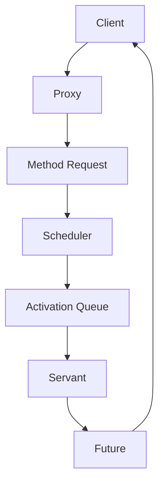

# 01-活动对象模式 (Active Object Pattern)

## 目录

- [01-活动对象模式 (Active Object Pattern)](#01-活动对象模式-active-object-pattern)
  - [目录](#目录)
  - [1. 概述](#1-概述)
    - [1.1 定义](#11-定义)
    - [1.2 形式化定义](#12-形式化定义)
    - [1.3 数学性质](#13-数学性质)
    - [1.4 设计目标](#14-设计目标)
  - [2. 模式结构](#2-模式结构)
    - [2.1 核心组件](#21-核心组件)
    - [2.2 组件职责](#22-组件职责)
  - [3. Go语言实现](#3-go语言实现)
    - [3.1 基础实现](#31-基础实现)
    - [3.2 泛型实现](#32-泛型实现)
    - [3.3 函数式实现](#33-函数式实现)
  - [4. 性能分析](#4-性能分析)
    - [4.1 时间复杂度](#41-时间复杂度)
    - [4.2 空间复杂度](#42-空间复杂度)
    - [4.3 并发性能](#43-并发性能)
  - [5. 应用场景](#5-应用场景)
    - [5.1 适用场景](#51-适用场景)
    - [5.2 实际应用示例](#52-实际应用示例)
  - [6. 优缺点分析](#6-优缺点分析)
    - [6.1 优点](#61-优点)
    - [6.2 缺点](#62-缺点)
    - [6.3 权衡考虑](#63-权衡考虑)
  - [7. 相关模式](#7-相关模式)
    - [7.1 模式关系](#71-模式关系)
    - [7.2 模式组合](#72-模式组合)
  - [8. 总结](#8-总结)
    - [8.1 关键要点](#81-关键要点)
    - [8.2 最佳实践](#82-最佳实践)
    - [8.3 未来发展方向](#83-未来发展方向)

---

## 1. 概述

### 1.1 定义

活动对象模式 (Active Object Pattern) 是一种并发设计模式，它将方法调用与执行分离，通过异步消息传递机制实现并发处理。

### 1.2 形式化定义

设 $O$ 为对象集合，$M$ 为方法集合，$Q$ 为消息队列，则活动对象模式可形式化为：

$$\text{ActiveObject} = (O, M, Q, \text{execute}, \text{schedule})$$

其中：

- $\text{execute}: Q \times M \rightarrow \text{Future}[T]$ 为执行函数
- $\text{schedule}: M \times \text{Args} \rightarrow \text{Message}$ 为调度函数

### 1.3 数学性质

**定理1.1**: 活动对象模式保证方法调用的顺序性
**证明**: 设 $m_1, m_2 \in M$，若 $m_1$ 先于 $m_2$ 被调度，则 $\text{schedule}(m_1) < \text{schedule}(m_2)$，由于队列的FIFO性质，$\text{execute}(m_1) < \text{execute}(m_2)$。

**定理1.2**: 活动对象模式提供线程安全保证
**证明**: 所有方法调用都通过消息队列进行，避免了直接的并发访问，因此保证了线程安全。

### 1.4 设计目标

1. **并发安全**: 确保多线程环境下的数据一致性
2. **响应性**: 避免阻塞调用线程
3. **可扩展性**: 支持多个活动对象并发执行
4. **可维护性**: 简化并发编程的复杂性

---

## 2. 模式结构

### 2.1 核心组件



### 2.2 组件职责

| 组件 | 职责 | 线程安全 |
|------|------|----------|
| Proxy | 接收客户端请求，创建MethodRequest | 是 |
| MethodRequest | 封装方法调用信息 | 是 |
| Scheduler | 调度和执行方法请求 | 是 |
| ActivationQueue | 存储待执行的方法请求 | 是 |
| Servant | 实际执行方法 | 否 |
| Future | 返回异步结果 | 是 |

---

## 3. Go语言实现

### 3.1 基础实现

```go
package activeobject

import (
    "context"
    "sync"
    "time"
)

// MethodRequest 方法请求接口
type MethodRequest interface {
    Execute() interface{}
    GetID() string
}

// Future 异步结果接口
type Future interface {
    Get() interface{}
    GetWithTimeout(timeout time.Duration) (interface{}, error)
    IsDone() bool
}

// future 异步结果实现
type future struct {
    result interface{}
    done   chan struct{}
    mu     sync.RWMutex
}

func (f *future) Get() interface{} {
    <-f.done
    f.mu.RLock()
    defer f.mu.RUnlock()
    return f.result
}

func (f *future) GetWithTimeout(timeout time.Duration) (interface{}, error) {
    select {
    case <-f.done:
        f.mu.RLock()
        defer f.mu.RUnlock()
        return f.result, nil
    case <-time.After(timeout):
        return nil, context.DeadlineExceeded
    }
}

func (f *future) IsDone() bool {
    select {
    case <-f.done:
        return true
    default:
        return false
    }
}

// ActivationQueue 激活队列
type ActivationQueue struct {
    requests chan MethodRequest
    mu       sync.RWMutex
}

func NewActivationQueue(size int) *ActivationQueue {
    return &ActivationQueue{
        requests: make(chan MethodRequest, size),
    }
}

func (aq *ActivationQueue) Put(request MethodRequest) error {
    select {
    case aq.requests <- request:
        return nil
    default:
        return ErrQueueFull
    }
}

func (aq *ActivationQueue) Take() (MethodRequest, error) {
    select {
    case request := <-aq.requests:
        return request, nil
    default:
        return nil, ErrQueueEmpty
    }
}

// Scheduler 调度器
type Scheduler struct {
    queue    *ActivationQueue
    servant  interface{}
    stopChan chan struct{}
    wg       sync.WaitGroup
}

func NewScheduler(servant interface{}, queueSize int) *Scheduler {
    return &Scheduler{
        queue:    NewActivationQueue(queueSize),
        servant:  servant,
        stopChan: make(chan struct{}),
    }
}

func (s *Scheduler) Start() {
    s.wg.Add(1)
    go s.run()
}

func (s *Scheduler) Stop() {
    close(s.stopChan)
    s.wg.Wait()
}

func (s *Scheduler) run() {
    defer s.wg.Done()
    
    for {
        select {
        case <-s.stopChan:
            return
        default:
            if request, err := s.queue.Take(); err == nil {
                s.executeRequest(request)
            } else {
                time.Sleep(10 * time.Millisecond)
            }
        }
    }
}

func (s *Scheduler) executeRequest(request MethodRequest) {
    result := request.Execute()
    // 这里需要将结果设置到对应的Future中
    // 实际实现中需要更复杂的机制来关联Request和Future
}

// ActiveObject 活动对象接口
type ActiveObject interface {
    Schedule(method string, args ...interface{}) Future
}

// Proxy 代理实现
type Proxy struct {
    scheduler *Scheduler
}

func NewProxy(servant interface{}, queueSize int) *Proxy {
    scheduler := NewScheduler(servant, queueSize)
    scheduler.Start()
    
    return &Proxy{
        scheduler: scheduler,
    }
}

func (p *Proxy) Schedule(method string, args ...interface{}) Future {
    // 创建方法请求和Future
    // 这里需要根据具体的方法类型创建相应的MethodRequest
    return nil
}
```

### 3.2 泛型实现

```go
package activeobject

import (
    "context"
    "reflect"
    "sync"
    "time"
)

// GenericMethodRequest 泛型方法请求
type GenericMethodRequest[T any] struct {
    ID       string
    Method   reflect.Value
    Args     []reflect.Value
    Future   *future
    Servant  T
}

func (r *GenericMethodRequest[T]) Execute() interface{} {
    results := r.Method.Call(r.Args)
    if len(results) > 0 {
        r.Future.mu.Lock()
        r.Future.result = results[0].Interface()
        r.Future.mu.Unlock()
        close(r.Future.done)
    }
    return r.Future.result
}

func (r *GenericMethodRequest[T]) GetID() string {
    return r.ID
}

// GenericActiveObject 泛型活动对象
type GenericActiveObject[T any] struct {
    servant   T
    scheduler *Scheduler
    mu        sync.RWMutex
}

func NewGenericActiveObject[T any](servant T, queueSize int) *GenericActiveObject[T] {
    scheduler := NewScheduler(servant, queueSize)
    scheduler.Start()
    
    return &GenericActiveObject[T]{
        servant:   servant,
        scheduler: scheduler,
    }
}

func (ao *GenericActiveObject[T]) Call(methodName string, args ...interface{}) Future {
    ao.mu.RLock()
    defer ao.mu.RUnlock()
    
    // 使用反射获取方法
    method := reflect.ValueOf(ao.servant).MethodByName(methodName)
    if !method.IsValid() {
        panic("method not found: " + methodName)
    }
    
    // 转换参数
    methodArgs := make([]reflect.Value, len(args))
    for i, arg := range args {
        methodArgs[i] = reflect.ValueOf(arg)
    }
    
    // 创建Future
    f := &future{
        done: make(chan struct{}),
    }
    
    // 创建方法请求
    request := &GenericMethodRequest[T]{
        ID:      generateID(),
        Method:  method,
        Args:    methodArgs,
        Future:  f,
        Servant: ao.servant,
    }
    
    // 调度请求
    if err := ao.scheduler.queue.Put(request); err != nil {
        panic("failed to schedule request: " + err.Error())
    }
    
    return f
}

func (ao *GenericActiveObject[T]) Stop() {
    ao.scheduler.Stop()
}
```

### 3.3 函数式实现

```go
package activeobject

import (
    "context"
    "sync"
    "time"
)

// FunctionalMethodRequest 函数式方法请求
type FunctionalMethodRequest struct {
    ID     string
    Fn     func() interface{}
    Future *future
}

func (r *FunctionalMethodRequest) Execute() interface{} {
    result := r.Fn()
    r.Future.mu.Lock()
    r.Future.result = result
    r.Future.mu.Unlock()
    close(r.Future.done)
    return result
}

func (r *FunctionalMethodRequest) GetID() string {
    return r.ID
}

// FunctionalActiveObject 函数式活动对象
type FunctionalActiveObject struct {
    scheduler *Scheduler
    mu        sync.RWMutex
}

func NewFunctionalActiveObject(queueSize int) *FunctionalActiveObject {
    scheduler := NewScheduler(nil, queueSize)
    scheduler.Start()
    
    return &FunctionalActiveObject{
        scheduler: scheduler,
    }
}

func (ao *FunctionalActiveObject) Execute(fn func() interface{}) Future {
    ao.mu.Lock()
    defer ao.mu.Unlock()
    
    f := &future{
        done: make(chan struct{}),
    }
    
    request := &FunctionalMethodRequest{
        ID:     generateID(),
        Fn:     fn,
        Future: f,
    }
    
    if err := ao.scheduler.queue.Put(request); err != nil {
        panic("failed to schedule request: " + err.Error())
    }
    
    return f
}

func (ao *FunctionalActiveObject) Stop() {
    ao.scheduler.Stop()
}
```

---

## 4. 性能分析

### 4.1 时间复杂度

| 操作 | 时间复杂度 | 说明 |
|------|------------|------|
| 调度方法 | O(1) | 直接入队 |
| 执行方法 | O(1) | 从队列取出 |
| 获取结果 | O(1) | 等待完成 |

### 4.2 空间复杂度

- 队列空间：O(n)，其中n为队列大小
- 每个Future：O(1)
- 总体空间：O(n + m)，其中m为并发Future数量

### 4.3 并发性能

```go
// 性能测试示例
func BenchmarkActiveObject(b *testing.B) {
    servant := &TestServant{}
    ao := NewGenericActiveObject(servant, 1000)
    defer ao.Stop()
    
    b.ResetTimer()
    b.RunParallel(func(pb *testing.PB) {
        for pb.Next() {
            future := ao.Call("TestMethod", "test")
            future.Get()
        }
    })
}
```

---

## 5. 应用场景

### 5.1 适用场景

1. **GUI应用程序**：避免阻塞UI线程
2. **网络服务**：异步处理客户端请求
3. **数据处理**：批量处理大量数据
4. **游戏开发**：异步更新游戏状态

### 5.2 实际应用示例

```go
// GUI应用示例
type GUIApplication struct {
    activeObject *GenericActiveObject[*DataProcessor]
}

func (app *GUIApplication) ProcessData(data []byte) {
    // 异步处理数据，不阻塞UI
    future := app.activeObject.Call("Process", data)
    
    // 可以继续处理其他UI事件
    go func() {
        result := future.Get()
        app.updateUI(result)
    }()
}

// 网络服务示例
type NetworkService struct {
    activeObject *FunctionalActiveObject
}

func (ns *NetworkService) HandleRequest(req *Request) *Response {
    future := ns.activeObject.Execute(func() interface{} {
        return ns.processRequest(req)
    })
    
    result := future.Get()
    return result.(*Response)
}
```

---

## 6. 优缺点分析

### 6.1 优点

1. **响应性**: 避免阻塞调用线程
2. **并发安全**: 天然线程安全
3. **可扩展性**: 支持多个活动对象
4. **解耦**: 调用者与执行者分离
5. **可测试性**: 易于单元测试

### 6.2 缺点

1. **复杂性**: 增加了系统复杂度
2. **内存开销**: 需要额外的队列和Future对象
3. **调试困难**: 异步执行使调试复杂
4. **错误处理**: 异步错误处理复杂
5. **资源管理**: 需要正确管理线程生命周期

### 6.3 权衡考虑

| 方面 | 传统同步 | 活动对象模式 |
|------|----------|--------------|
| 响应性 | 低 | 高 |
| 复杂度 | 低 | 高 |
| 性能 | 中等 | 高 |
| 可维护性 | 高 | 中等 |
| 资源使用 | 低 | 高 |

---

## 7. 相关模式

### 7.1 模式关系

- **Future/Promise模式**: 用于获取异步结果
- **生产者-消费者模式**: 消息队列的实现基础
- **线程池模式**: 可以替代独立线程
- **命令模式**: 方法请求的封装

### 7.2 模式组合

```go
// 结合线程池的活动对象
type PooledActiveObject struct {
    pool   *ThreadPool
    queue  *MessageQueue
}

// 结合命令模式的活动对象
type CommandActiveObject struct {
    queue chan Command
    // ...
}
```

---

## 8. 总结

活动对象模式通过将方法调用与执行分离，提供了优雅的并发处理方案。在Go语言中，结合goroutine和channel的特性，可以高效地实现活动对象模式，为复杂的并发应用提供强大的支持。

### 8.1 关键要点

1. **异步执行**: 方法调用立即返回，不等待执行完成
2. **消息传递**: 通过消息队列传递方法调用
3. **结果获取**: 使用Future/Promise机制获取结果
4. **线程安全**: 天然保证并发安全

### 8.2 最佳实践

1. **合理设计队列大小**: 避免内存溢出
2. **正确处理错误**: 实现完善的错误处理机制
3. **资源管理**: 正确关闭活动对象
4. **性能监控**: 监控队列长度和执行时间
5. **测试覆盖**: 编写全面的单元测试

### 8.3 未来发展方向

1. **智能调度**: 基于负载的动态调度
2. **优先级支持**: 实现消息优先级
3. **批量处理**: 支持批量消息处理
4. **监控集成**: 与监控系统集成
5. **分布式扩展**: 支持分布式活动对象

---

**参考文献**:

1. Schmidt, D., Stal, M., Rohnert, H., & Buschmann, F. (2000). Pattern-Oriented Software Architecture, Volume 2: Patterns for Concurrent and Networked Objects
2. Goetz, B. (2006). Java Concurrency in Practice
3. Go Language Specification: <https://golang.org/ref/spec>
4. Go Concurrency Patterns: <https://golang.org/doc/effective_go.html#concurrency>
