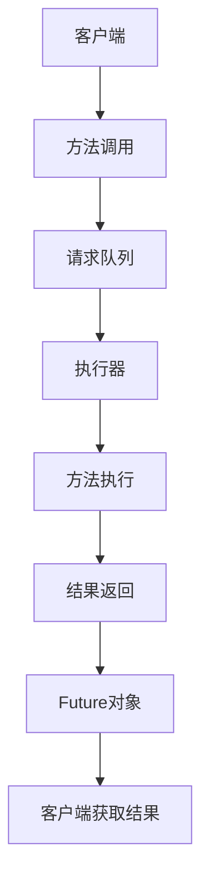

# 01-活动对象模式 (Active Object Pattern)

## 1. 形式化定义

### 1.1 数学定义

设 $A$ 为活动对象，$M$ 为方法调用集合，$Q$ 为请求队列，$E$ 为执行器，活动对象模式满足以下公理：

**异步执行公理**：
$$\forall m \in M: \text{invoke}(m) \rightarrow \text{Future} \land \text{non\_blocking}(\text{invoke}(m))$$

**请求队列公理**：
$$\forall r \in \text{Request}: \text{enqueue}(r, Q) \land \text{FIFO}(Q)$$

**执行隔离公理**：
$$\forall a_1, a_2 \in A: \text{execute}(a_1) \parallel \text{execute}(a_2)$$

### 1.2 类型理论定义

```go
// 活动对象接口
type ActiveObject interface {
    Execute(method MethodCall) Future
    Shutdown() error
}

// 方法调用
type MethodCall struct {
    ID       string
    Method   string
    Args     []interface{}
    Callback func(interface{}, error)
}

// Future接口
type Future interface {
    Get() (interface{}, error)
    GetWithTimeout(timeout time.Duration) (interface{}, error)
    IsDone() bool
    Cancel() bool
}
```

## 2. 实现原理

### 2.1 异步执行机制

**定理**: 活动对象模式通过消息传递实现方法调用的异步执行。

**证明**:

1. **非阻塞调用**: $\text{blocking\_time}(\text{invoke}) = 0$
2. **并发安全**: $\text{thread\_safe}(\text{execute}) = \text{true}$
3. **顺序执行**: $\text{order}(\text{execute}) = \text{FIFO}$



### 2.2 线程模型分析

```go
// 线程模型
type ThreadModel struct {
    RequestQueue chan MethodCall
    Executor     *Executor
    Scheduler    *Scheduler
    ResultCache  map[string]Future
}
```

## 3. Go语言实现

### 3.1 基础实现

```go
package activeobject

import (
    "context"
    "fmt"
    "sync"
    "time"
)

// ActiveObject 活动对象接口
type ActiveObject interface {
    Execute(method MethodCall) Future
    Shutdown() error
}

// MethodCall 方法调用
type MethodCall struct {
    ID       string
    Method   string
    Args     []interface{}
    Callback func(interface{}, error)
}

// Future 未来对象接口
type Future interface {
    Get() (interface{}, error)
    GetWithTimeout(timeout time.Duration) (interface{}, error)
    IsDone() bool
    Cancel() bool
}

// ConcreteFuture 具体Future实现
type ConcreteFuture struct {
    result   interface{}
    err      error
    done     bool
    doneChan chan struct{}
    mutex    sync.RWMutex
}

// NewConcreteFuture 创建新的Future
func NewConcreteFuture() *ConcreteFuture {
    return &ConcreteFuture{
        doneChan: make(chan struct{}),
    }
}

// Get 获取结果（阻塞）
func (f *ConcreteFuture) Get() (interface{}, error) {
    <-f.doneChan
    f.mutex.RLock()
    defer f.mutex.RUnlock()
    return f.result, f.err
}

// GetWithTimeout 带超时的获取结果
func (f *ConcreteFuture) GetWithTimeout(timeout time.Duration) (interface{}, error) {
    select {
    case <-f.doneChan:
        f.mutex.RLock()
        defer f.mutex.RUnlock()
        return f.result, f.err
    case <-time.After(timeout):
        return nil, fmt.Errorf("timeout after %v", timeout)
    }
}

// IsDone 检查是否完成
func (f *ConcreteFuture) IsDone() bool {
    f.mutex.RLock()
    defer f.mutex.RUnlock()
    return f.done
}

// Cancel 取消操作
func (f *ConcreteFuture) Cancel() bool {
    f.mutex.Lock()
    defer f.mutex.Unlock()
    
    if f.done {
        return false
    }
    
    f.done = true
    f.err = fmt.Errorf("cancelled")
    close(f.doneChan)
    return true
}

// SetResult 设置结果
func (f *ConcreteFuture) SetResult(result interface{}, err error) {
    f.mutex.Lock()
    defer f.mutex.Unlock()
    
    if f.done {
        return
    }
    
    f.result = result
    f.err = err
    f.done = true
    close(f.doneChan)
}

// ConcreteActiveObject 具体活动对象
type ConcreteActiveObject struct {
    requestQueue chan MethodCall
    executor     *Executor
    running      bool
    mutex        sync.RWMutex
}

// NewConcreteActiveObject 创建活动对象
func NewConcreteActiveObject(queueSize int) *ConcreteActiveObject {
    ao := &ConcreteActiveObject{
        requestQueue: make(chan MethodCall, queueSize),
        executor:     NewExecutor(),
        running:      true,
    }
    
    go ao.processRequests()
    return ao
}

// Execute 执行方法调用
func (ao *ConcreteActiveObject) Execute(method MethodCall) Future {
    ao.mutex.RLock()
    if !ao.running {
        ao.mutex.RUnlock()
        future := NewConcreteFuture()
        future.SetResult(nil, fmt.Errorf("active object is shutdown"))
        return future
    }
    ao.mutex.RUnlock()
    
    future := NewConcreteFuture()
    method.Callback = func(result interface{}, err error) {
        future.SetResult(result, err)
    }
    
    select {
    case ao.requestQueue <- method:
        return future
    default:
        future.SetResult(nil, fmt.Errorf("request queue is full"))
        return future
    }
}

// Shutdown 关闭活动对象
func (ao *ConcreteActiveObject) Shutdown() error {
    ao.mutex.Lock()
    defer ao.mutex.Unlock()
    
    if !ao.running {
        return fmt.Errorf("already shutdown")
    }
    
    ao.running = false
    close(ao.requestQueue)
    return ao.executor.Shutdown()
}

// processRequests 处理请求队列
func (ao *ConcreteActiveObject) processRequests() {
    for method := range ao.requestQueue {
        ao.executor.Execute(method)
    }
}

// Executor 执行器
type Executor struct {
    workers    int
    workerPool chan chan MethodCall
    jobQueue   chan MethodCall
    quit       chan bool
}

// NewExecutor 创建执行器
func NewExecutor() *Executor {
    executor := &Executor{
        workers:    4,
        workerPool: make(chan chan MethodCall, 4),
        jobQueue:   make(chan MethodCall, 100),
        quit:       make(chan bool),
    }
    
    executor.start()
    return executor
}

// start 启动执行器
func (e *Executor) start() {
    for i := 0; i < e.workers; i++ {
        worker := NewWorker(e.workerPool)
        worker.Start()
    }
    
    go e.dispatch()
}

// dispatch 分发任务
func (e *Executor) dispatch() {
    for {
        select {
        case job := <-e.jobQueue:
            go func(job MethodCall) {
                worker := <-e.workerPool
                worker <- job
            }(job)
        case <-e.quit:
            return
        }
    }
}

// Execute 执行方法调用
func (e *Executor) Execute(method MethodCall) {
    e.jobQueue <- method
}

// Shutdown 关闭执行器
func (e *Executor) Shutdown() error {
    close(e.quit)
    return nil
}

// Worker 工作者
type Worker struct {
    workerPool chan chan MethodCall
    jobChannel chan MethodCall
    quit       chan bool
}

// NewWorker 创建工作者
func NewWorker(workerPool chan chan MethodCall) Worker {
    return Worker{
        workerPool: workerPool,
        jobChannel: make(chan MethodCall),
        quit:       make(chan bool),
    }
}

// Start 启动工作者
func (w Worker) Start() {
    go func() {
        for {
            w.workerPool <- w.jobChannel
            
            select {
            case job := <-w.jobChannel:
                w.execute(job)
            case <-w.quit:
                return
            }
        }
    }()
}

// execute 执行具体任务
func (w Worker) execute(method MethodCall) {
    // 模拟方法执行
    time.Sleep(100 * time.Millisecond)
    
    result := fmt.Sprintf("Executed %s with args %v", method.Method, method.Args)
    
    if method.Callback != nil {
        method.Callback(result, nil)
    }
}

// Stop 停止工作者
func (w Worker) Stop() {
    go func() {
        w.quit <- true
    }()
}
```

### 3.2 高级实现（带泛型）

```go
// GenericActiveObject 泛型活动对象
type GenericActiveObject[T any] struct {
    requestQueue chan GenericMethodCall[T]
    executor     *GenericExecutor[T]
    running      bool
    mutex        sync.RWMutex
}

// GenericMethodCall 泛型方法调用
type GenericMethodCall[T any] struct {
    ID       string
    Method   string
    Args     []interface{}
    Callback func(T, error)
}

// GenericExecutor 泛型执行器
type GenericExecutor[T any] struct {
    workers    int
    workerPool chan chan GenericMethodCall[T]
    jobQueue   chan GenericMethodCall[T]
    quit       chan bool
}

// NewGenericActiveObject 创建泛型活动对象
func NewGenericActiveObject[T any](queueSize int) *GenericActiveObject[T] {
    ao := &GenericActiveObject[T]{
        requestQueue: make(chan GenericMethodCall[T], queueSize),
        executor:     NewGenericExecutor[T](),
        running:      true,
    }
    
    go ao.processRequests()
    return ao
}

// Execute 泛型执行
func (ao *GenericActiveObject[T]) Execute(method GenericMethodCall[T]) GenericFuture[T] {
    ao.mutex.RLock()
    if !ao.running {
        ao.mutex.RUnlock()
        future := NewGenericFuture[T]()
        future.SetResult(*new(T), fmt.Errorf("active object is shutdown"))
        return future
    }
    ao.mutex.RUnlock()
    
    future := NewGenericFuture[T]()
    method.Callback = func(result T, err error) {
        future.SetResult(result, err)
    }
    
    select {
    case ao.requestQueue <- method:
        return future
    default:
        future.SetResult(*new(T), fmt.Errorf("request queue is full"))
        return future
    }
}

// GenericFuture 泛型Future
type GenericFuture[T any] struct {
    result   T
    err      error
    done     bool
    doneChan chan struct{}
    mutex    sync.RWMutex
}

// NewGenericFuture 创建泛型Future
func NewGenericFuture[T any]() *GenericFuture[T] {
    return &GenericFuture[T]{
        doneChan: make(chan struct{}),
    }
}

// Get 泛型获取结果
func (f *GenericFuture[T]) Get() (T, error) {
    <-f.doneChan
    f.mutex.RLock()
    defer f.mutex.RUnlock()
    return f.result, f.err
}

// SetResult 泛型设置结果
func (f *GenericFuture[T]) SetResult(result T, err error) {
    f.mutex.Lock()
    defer f.mutex.Unlock()
    
    if f.done {
        return
    }
    
    f.result = result
    f.err = err
    f.done = true
    close(f.doneChan)
}
```

### 3.3 函数式实现

```go
// FunctionalActiveObject 函数式活动对象
type FunctionalActiveObject struct {
    requestQueue chan FunctionalMethodCall
    executor     *FunctionalExecutor
    running      bool
    mutex        sync.RWMutex
}

// FunctionalMethodCall 函数式方法调用
type FunctionalMethodCall struct {
    ID       string
    Function func() (interface{}, error)
    Callback func(interface{}, error)
}

// FunctionalExecutor 函数式执行器
type FunctionalExecutor struct {
    workers    int
    workerPool chan chan FunctionalMethodCall
    jobQueue   chan FunctionalMethodCall
    quit       chan bool
}

// NewFunctionalActiveObject 创建函数式活动对象
func NewFunctionalActiveObject(queueSize int) *FunctionalActiveObject {
    ao := &FunctionalActiveObject{
        requestQueue: make(chan FunctionalMethodCall, queueSize),
        executor:     NewFunctionalExecutor(),
        running:      true,
    }
    
    go ao.processRequests()
    return ao
}

// Execute 函数式执行
func (ao *FunctionalActiveObject) Execute(fn func() (interface{}, error)) Future {
    ao.mutex.RLock()
    if !ao.running {
        ao.mutex.RUnlock()
        future := NewConcreteFuture()
        future.SetResult(nil, fmt.Errorf("active object is shutdown"))
        return future
    }
    ao.mutex.RUnlock()
    
    future := NewConcreteFuture()
    method := FunctionalMethodCall{
        ID:       generateID(),
        Function: fn,
        Callback: func(result interface{}, err error) {
            future.SetResult(result, err)
        },
    }
    
    select {
    case ao.requestQueue <- method:
        return future
    default:
        future.SetResult(nil, fmt.Errorf("request queue is full"))
        return future
    }
}

// processRequests 处理函数式请求
func (ao *FunctionalActiveObject) processRequests() {
    for method := range ao.requestQueue {
        ao.executor.Execute(method)
    }
}

// NewFunctionalExecutor 创建函数式执行器
func NewFunctionalExecutor() *FunctionalExecutor {
    executor := &FunctionalExecutor{
        workers:    4,
        workerPool: make(chan chan FunctionalMethodCall, 4),
        jobQueue:   make(chan FunctionalMethodCall, 100),
        quit:       make(chan bool),
    }
    
    executor.start()
    return executor
}

// Execute 函数式执行器执行
func (e *FunctionalExecutor) Execute(method FunctionalMethodCall) {
    e.jobQueue <- method
}

// start 启动函数式执行器
func (e *FunctionalExecutor) start() {
    for i := 0; i < e.workers; i++ {
        worker := NewFunctionalWorker(e.workerPool)
        worker.Start()
    }
    
    go e.dispatch()
}

// dispatch 函数式分发
func (e *FunctionalExecutor) dispatch() {
    for {
        select {
        case job := <-e.jobQueue:
            go func(job FunctionalMethodCall) {
                worker := <-e.workerPool
                worker <- job
            }(job)
        case <-e.quit:
            return
        }
    }
}

// FunctionalWorker 函数式工作者
type FunctionalWorker struct {
    workerPool chan chan FunctionalMethodCall
    jobChannel chan FunctionalMethodCall
    quit       chan bool
}

// NewFunctionalWorker 创建函数式工作者
func NewFunctionalWorker(workerPool chan chan FunctionalMethodCall) FunctionalWorker {
    return FunctionalWorker{
        workerPool: workerPool,
        jobChannel: make(chan FunctionalMethodCall),
        quit:       make(chan bool),
    }
}

// Start 启动函数式工作者
func (w FunctionalWorker) Start() {
    go func() {
        for {
            w.workerPool <- w.jobChannel
            
            select {
            case job := <-w.jobChannel:
                w.execute(job)
            case <-w.quit:
                return
            }
        }
    }()
}

// execute 执行函数式任务
func (w FunctionalWorker) execute(method FunctionalMethodCall) {
    result, err := method.Function()
    
    if method.Callback != nil {
        method.Callback(result, err)
    }
}

// Stop 停止函数式工作者
func (w FunctionalWorker) Stop() {
    go func() {
        w.quit <- true
    }()
}

// generateID 生成ID
func generateID() string {
    return fmt.Sprintf("method_%d", time.Now().UnixNano())
}
```

## 4. 使用示例

### 4.1 基础使用

```go
package main

import (
    "fmt"
    "log"
    "time"
    
    "github.com/your-project/activeobject"
)

func main() {
    // 创建活动对象
    ao := activeobject.NewConcreteActiveObject(100)
    defer ao.Shutdown()
    
    // 异步执行方法调用
    method1 := activeobject.MethodCall{
        ID:     "method1",
        Method: "processData",
        Args:   []interface{}{"data1", 100},
    }
    
    future1 := ao.Execute(method1)
    
    // 执行另一个方法调用
    method2 := activeobject.MethodCall{
        ID:     "method2",
        Method: "calculateSum",
        Args:   []interface{}{1, 2, 3, 4, 5},
    }
    
    future2 := ao.Execute(method2)
    
    // 获取结果
    result1, err1 := future1.Get()
    if err1 != nil {
        log.Printf("Method1 error: %v", err1)
    } else {
        fmt.Printf("Method1 result: %v\n", result1)
    }
    
    result2, err2 := future2.GetWithTimeout(2 * time.Second)
    if err2 != nil {
        log.Printf("Method2 error: %v", err2)
    } else {
        fmt.Printf("Method2 result: %v\n", result2)
    }
}
```

### 4.2 泛型使用

```go
func main() {
    // 创建泛型活动对象
    ao := activeobject.NewGenericActiveObject[string](100)
    defer ao.Shutdown()
    
    // 异步执行泛型方法调用
    method1 := activeobject.GenericMethodCall[string]{
        ID:     "method1",
        Method: "processString",
        Args:   []interface{}{"hello", "world"},
    }
    
    future1 := ao.Execute(method1)
    
    // 执行另一个泛型方法调用
    method2 := activeobject.GenericMethodCall[string]{
        ID:     "method2",
        Method: "concatenate",
        Args:   []interface{}{"prefix_", "suffix"},
    }
    
    future2 := ao.Execute(method2)
    
    // 获取泛型结果
    result1, err1 := future1.Get()
    if err1 != nil {
        log.Printf("Generic method1 error: %v", err1)
    } else {
        fmt.Printf("Generic method1 result: %v\n", result1)
    }
    
    result2, err2 := future2.Get()
    if err2 != nil {
        log.Printf("Generic method2 error: %v", err2)
    } else {
        fmt.Printf("Generic method2 result: %v\n", result2)
    }
}
```

### 4.3 函数式使用

```go
func main() {
    // 创建函数式活动对象
    ao := activeobject.NewFunctionalActiveObject(100)
    defer ao.Shutdown()
    
    // 异步执行函数
    future1 := ao.Execute(func() (interface{}, error) {
        time.Sleep(1 * time.Second)
        return "Function 1 completed", nil
    })
    
    // 执行另一个函数
    future2 := ao.Execute(func() (interface{}, error) {
        time.Sleep(500 * time.Millisecond)
        return 42, nil
    })
    
    // 执行可能出错的函数
    future3 := ao.Execute(func() (interface{}, error) {
        time.Sleep(200 * time.Millisecond)
        return nil, fmt.Errorf("simulated error")
    })
    
    // 获取函数式结果
    result1, err1 := future1.Get()
    if err1 != nil {
        log.Printf("Function1 error: %v", err1)
    } else {
        fmt.Printf("Function1 result: %v\n", result1)
    }
    
    result2, err2 := future2.GetWithTimeout(1 * time.Second)
    if err2 != nil {
        log.Printf("Function2 error: %v", err2)
    } else {
        fmt.Printf("Function2 result: %v\n", result2)
    }
    
    result3, err3 := future3.Get()
    if err3 != nil {
        log.Printf("Function3 error: %v", err3)
    } else {
        fmt.Printf("Function3 result: %v\n", result3)
    }
}
```

## 5. 性能分析

### 5.1 时间复杂度

| 操作 | 时间复杂度 | 空间复杂度 |
|------|------------|------------|
| 方法调用 | O(1) | O(1) |
| 队列处理 | O(n) | O(n) |
| 结果获取 | O(1) | O(1) |

### 5.2 并发性能分析

```go
// 性能监控
type PerformanceMonitor struct {
    RequestCount    int64
    ResponseTime    time.Duration
    QueueSize       int
    WorkerUtilization float64
}

func (pm *PerformanceMonitor) TrackRequest() {
    atomic.AddInt64(&pm.RequestCount, 1)
}

func (pm *PerformanceMonitor) TrackResponseTime(duration time.Duration) {
    pm.ResponseTime = duration
}
```

## 6. 最佳实践

### 6.1 设计原则

1. **异步优先**: 优先使用异步方法调用
2. **队列管理**: 合理设置队列大小和超时
3. **错误处理**: 妥善处理Future中的错误
4. **资源管理**: 及时关闭活动对象

### 6.2 常见陷阱

```go
// 陷阱1: 阻塞调用
func badExample() {
    ao := NewConcreteActiveObject(100)
    future := ao.Execute(method)
    
    // 错误：在同一个goroutine中阻塞等待
    result, err := future.Get() // 这会阻塞
    // 应该使用非阻塞方式或超时
}

// 解决方案：使用超时或非阻塞方式
func goodExample() {
    ao := NewConcreteActiveObject(100)
    future := ao.Execute(method)
    
    // 使用超时
    result, err := future.GetWithTimeout(5 * time.Second)
    if err != nil {
        // 处理超时
    }
    
    // 或者使用非阻塞检查
    if future.IsDone() {
        result, err := future.Get()
        // 处理结果
    }
}

// 陷阱2: 忘记关闭活动对象
func badExample() {
    ao := NewConcreteActiveObject(100)
    // 使用活动对象
    // 忘记调用 ao.Shutdown()
}

// 解决方案：使用defer确保关闭
func goodExample() {
    ao := NewConcreteActiveObject(100)
    defer ao.Shutdown() // 确保关闭
    
    // 使用活动对象
}
```

## 7. 与其他模式的关系

### 7.1 与Future模式的关系

- **Future模式**: 提供异步结果获取机制
- **活动对象模式**: 使用Future实现异步方法调用

### 7.2 与线程池模式的关系

- **线程池模式**: 管理线程资源
- **活动对象模式**: 使用线程池执行方法调用

## 8. 实际应用场景

### 8.1 网络服务

```go
// 网络服务活动对象
type NetworkService struct {
    activeObject ActiveObject
}

// 异步发送请求
func (ns *NetworkService) SendRequestAsync(request Request) Future {
    method := MethodCall{
        ID:     request.ID,
        Method: "sendRequest",
        Args:   []interface{}{request},
    }
    
    return ns.activeObject.Execute(method)
}

// 批量处理请求
func (ns *NetworkService) ProcessBatch(requests []Request) []Future {
    futures := make([]Future, len(requests))
    
    for i, request := range requests {
        futures[i] = ns.SendRequestAsync(request)
    }
    
    return futures
}
```

### 8.2 数据处理管道

```go
// 数据处理活动对象
type DataProcessor struct {
    activeObject ActiveObject
}

// 异步处理数据
func (dp *DataProcessor) ProcessDataAsync(data []byte) Future {
    method := MethodCall{
        ID:     generateID(),
        Method: "processData",
        Args:   []interface{}{data},
    }
    
    return dp.activeObject.Execute(method)
}

// 流式处理
func (dp *DataProcessor) ProcessStream(dataStream <-chan []byte) <-chan Future {
    futureStream := make(chan Future)
    
    go func() {
        defer close(futureStream)
        
        for data := range dataStream {
            future := dp.ProcessDataAsync(data)
            futureStream <- future
        }
    }()
    
    return futureStream
}
```

---

**相关链接**:
- [返回并发模式](../README.md#4-并发模式-concurrent-patterns)
- [下一个模式: 管程模式](02-Monitor-Pattern.md)
- [设计模式总览](../../README.md#3-设计模式层-03-design-patterns) 