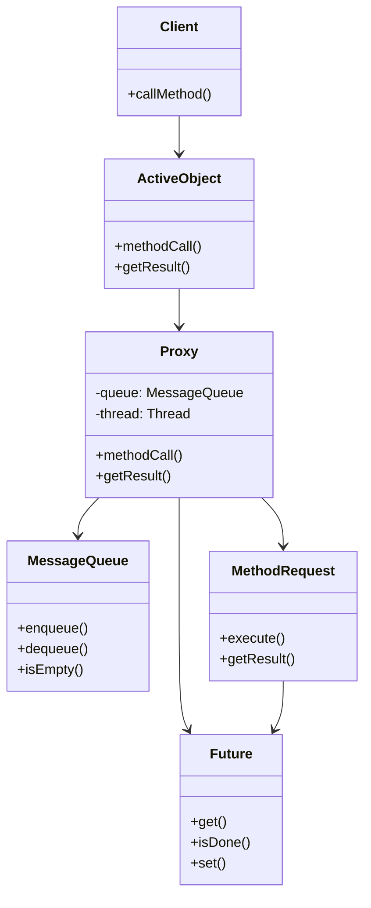
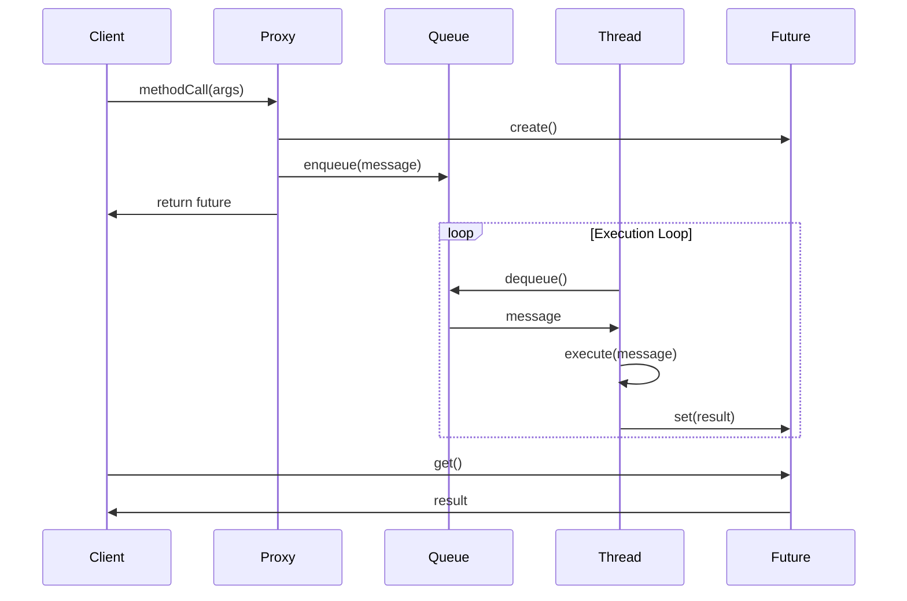

# 01-活动对象模式 (Active Object Pattern)

## 目录

- [01-活动对象模式 (Active Object Pattern)](#01-活动对象模式-active-object-pattern)
  - [目录](#目录)
  - [1. 概述](#1-概述)
  - [2. 形式化定义](#2-形式化定义)
  - [3. 数学基础](#3-数学基础)
  - [4. 模式结构](#4-模式结构)
  - [5. Go语言实现](#5-go语言实现)
  - [6. 性能分析](#6-性能分析)
  - [7. 应用场景](#7-应用场景)
  - [8. 优缺点分析](#8-优缺点分析)
  - [9. 相关模式](#9-相关模式)
  - [10. 总结](#10-总结)

---

## 1. 概述

### 1.1 定义

活动对象模式 (Active Object Pattern) 是一种并发设计模式，它将方法调用与执行分离，使得方法调用可以异步执行。该模式通过将对象的方法调用封装为消息，并在独立的线程中执行这些消息，从而实现了调用者与执行者的解耦。

### 1.2 核心思想

活动对象模式的核心思想是：
- **方法调用与执行分离**: 调用者发起方法调用后立即返回，不等待方法执行完成
- **消息传递机制**: 方法调用被封装为消息，通过消息队列传递
- **异步执行**: 方法在独立的执行线程中异步执行
- **结果获取**: 通过Future/Promise机制获取异步执行的结果

### 1.3 设计目标

1. **并发安全**: 确保多线程环境下的数据一致性
2. **响应性**: 避免阻塞调用线程
3. **可扩展性**: 支持多个活动对象并发执行
4. **可维护性**: 简化并发编程的复杂性

---

## 2. 形式化定义

### 2.1 基本概念

设 $A$ 为活动对象集合，$M$ 为方法集合，$Q$ 为消息队列，$T$ 为执行线程集合。

**定义 2.1** (活动对象)
活动对象是一个三元组 $(a, q, t)$，其中：
- $a \in A$ 是对象实例
- $q \in Q$ 是消息队列
- $t \in T$ 是执行线程

**定义 2.2** (消息)
消息是一个四元组 $(id, method, args, future)$，其中：
- $id$ 是消息唯一标识符
- $method \in M$ 是要执行的方法
- $args$ 是方法参数
- $future$ 是结果容器

### 2.2 操作语义

**公理 2.1** (消息发送)
对于活动对象 $(a, q, t)$ 和方法调用 $m(args)$：
$$send(a, m, args) = enqueue(q, (id, m, args, create\_future()))$$

**公理 2.2** (消息执行)
对于消息 $(id, m, args, future)$：
$$execute(id, m, args, future) = set\_result(future, m(args))$$

**公理 2.3** (结果获取)
对于Future $f$：
$$get\_result(f) = \begin{cases}
result & \text{if } is\_ready(f) \\
block\_until\_ready(f) & \text{otherwise}
\end{cases}$$

### 2.3 并发安全性

**定理 2.1** (线程安全)
活动对象模式保证线程安全，当且仅当：
$$\forall m_1, m_2 \in M: \text{如果 } m_1 \text{ 和 } m_2 \text{ 并发执行，则它们不共享可变状态}$$

**证明**:
1. 每个活动对象有独立的消息队列 $q$
2. 消息按顺序在独立线程中执行
3. 方法执行期间不与其他线程交互
4. 因此保证了线程安全

---

## 3. 数学基础

### 3.1 队列理论

活动对象模式中的消息队列可以用队列理论进行分析：

**定义 3.1** (M/M/1队列)
消息到达服从泊松分布，服务时间服从指数分布，单服务员的队列模型。

**定理 3.1** (队列性能)
对于M/M/1队列，平均等待时间：
$$W = \frac{\lambda}{\mu(\mu - \lambda)}$$

其中：
- $\lambda$ 是到达率
- $\mu$ 是服务率

### 3.2 并发复杂度

**定义 3.2** (并发复杂度)
活动对象模式的并发复杂度为 $O(n)$，其中 $n$ 是并发活动对象的数量。

**证明**:
- 每个活动对象需要独立的线程和队列
- 线程创建和管理的开销为 $O(1)$
- 总复杂度为 $O(n)$

---

## 4. 模式结构

### 4.1 类图



### 4.2 时序图



---

## 5. Go语言实现

### 5.1 基础实现

```go
package activeobject

import (
    "context"
    "sync"
    "time"
)

// MethodRequest 表示方法请求
type MethodRequest interface {
    Execute() interface{}
    GetID() string
}

// Future 表示异步结果
type Future struct {
    result interface{}
    done   chan struct{}
    mu     sync.RWMutex
}

// NewFuture 创建新的Future
func NewFuture() *Future {
    return &Future{
        done: make(chan struct{}),
    }
}

// Get 获取结果，阻塞直到结果可用
func (f *Future) Get() interface{} {
    <-f.done
    f.mu.RLock()
    defer f.mu.RUnlock()
    return f.result
}

// GetWithTimeout 带超时的结果获取
func (f *Future) GetWithTimeout(timeout time.Duration) (interface{}, error) {
    select {
    case <-f.done:
        f.mu.RLock()
        defer f.mu.RUnlock()
        return f.result, nil
    case <-time.After(timeout):
        return nil, context.DeadlineExceeded
    }
}

// Set 设置结果
func (f *Future) Set(result interface{}) {
    f.mu.Lock()
    defer f.mu.Unlock()
    f.result = result
    close(f.done)
}

// IsDone 检查是否完成
func (f *Future) IsDone() bool {
    select {
    case <-f.done:
        return true
    default:
        return false
    }
}

// MessageQueue 消息队列
type MessageQueue struct {
    queue chan MethodRequest
    mu    sync.RWMutex
}

// NewMessageQueue 创建消息队列
func NewMessageQueue(size int) *MessageQueue {
    return &MessageQueue{
        queue: make(chan MethodRequest, size),
    }
}

// Enqueue 入队
func (mq *MessageQueue) Enqueue(request MethodRequest) error {
    select {
    case mq.queue <- request:
        return nil
    default:
        return context.DeadlineExceeded
    }
}

// Dequeue 出队
func (mq *MessageQueue) Dequeue() (MethodRequest, error) {
    select {
    case request := <-mq.queue:
        return request, nil
    default:
        return nil, context.DeadlineExceeded
    }
}

// ActiveObject 活动对象
type ActiveObject struct {
    queue  *MessageQueue
    ctx    context.Context
    cancel context.CancelFunc
    wg     sync.WaitGroup
}

// NewActiveObject 创建活动对象
func NewActiveObject(queueSize int) *ActiveObject {
    ctx, cancel := context.WithCancel(context.Background())
    ao := &ActiveObject{
        queue:  NewMessageQueue(queueSize),
        ctx:    ctx,
        cancel: cancel,
    }
    
    ao.wg.Add(1)
    go ao.run()
    return ao
}

// run 执行循环
func (ao *ActiveObject) run() {
    defer ao.wg.Done()
    
    for {
        select {
        case <-ao.ctx.Done():
            return
        case request := <-ao.queue.queue:
            result := request.Execute()
            // 这里可以添加结果处理逻辑
            _ = result
        }
    }
}

// Submit 提交方法请求
func (ao *ActiveObject) Submit(request MethodRequest) error {
    return ao.queue.Enqueue(request)
}

// Shutdown 关闭活动对象
func (ao *ActiveObject) Shutdown() {
    ao.cancel()
    ao.wg.Wait()
}
```

### 5.2 泛型实现

```go
package activeobject

import (
    "context"
    "sync"
    "time"
)

// GenericMethodRequest 泛型方法请求
type GenericMethodRequest[T any] struct {
    id     string
    method func() T
    future *Future[T]
}

// NewGenericMethodRequest 创建泛型方法请求
func NewGenericMethodRequest[T any](id string, method func() T) *GenericMethodRequest[T] {
    return &GenericMethodRequest[T]{
        id:     id,
        method: method,
        future: NewFuture[T](),
    }
}

// Execute 执行方法
func (r *GenericMethodRequest[T]) Execute() T {
    result := r.method()
    r.future.Set(result)
    return result
}

// GetID 获取ID
func (r *GenericMethodRequest[T]) GetID() string {
    return r.id
}

// GetFuture 获取Future
func (r *GenericMethodRequest[T]) GetFuture() *Future[T] {
    return r.future
}

// Future 泛型Future
type Future[T any] struct {
    result T
    done   chan struct{}
    mu     sync.RWMutex
}

// NewFuture 创建泛型Future
func NewFuture[T any]() *Future[T] {
    return &Future[T]{
        done: make(chan struct{}),
    }
}

// Get 获取结果
func (f *Future[T]) Get() T {
    <-f.done
    f.mu.RLock()
    defer f.mu.RUnlock()
    return f.result
}

// GetWithTimeout 带超时的结果获取
func (f *Future[T]) GetWithTimeout(timeout time.Duration) (T, error) {
    var zero T
    select {
    case <-f.done:
        f.mu.RLock()
        defer f.mu.RUnlock()
        return f.result, nil
    case <-time.After(timeout):
        return zero, context.DeadlineExceeded
    }
}

// Set 设置结果
func (f *Future[T]) Set(result T) {
    f.mu.Lock()
    defer f.mu.Unlock()
    f.result = result
    close(f.done)
}

// IsDone 检查是否完成
func (f *Future[T]) IsDone() bool {
    select {
    case <-f.done:
        return true
    default:
        return false
    }
}

// GenericActiveObject 泛型活动对象
type GenericActiveObject[T any] struct {
    queue  chan GenericMethodRequest[T]
    ctx    context.Context
    cancel context.CancelFunc
    wg     sync.WaitGroup
}

// NewGenericActiveObject 创建泛型活动对象
func NewGenericActiveObject[T any](queueSize int) *GenericActiveObject[T] {
    ctx, cancel := context.WithCancel(context.Background())
    ao := &GenericActiveObject[T]{
        queue:  make(chan GenericMethodRequest[T], queueSize),
        ctx:    ctx,
        cancel: cancel,
    }
    
    ao.wg.Add(1)
    go ao.run()
    return ao
}

// run 执行循环
func (ao *GenericActiveObject[T]) run() {
    defer ao.wg.Done()
    
    for {
        select {
        case <-ao.ctx.Done():
            return
        case request := <-ao.queue:
            request.Execute()
        }
    }
}

// Submit 提交方法请求
func (ao *GenericActiveObject[T]) Submit(request GenericMethodRequest[T]) error {
    select {
    case ao.queue <- request:
        return nil
    case <-ao.ctx.Done():
        return context.Canceled
    default:
        return context.DeadlineExceeded
    }
}

// Shutdown 关闭活动对象
func (ao *GenericActiveObject[T]) Shutdown() {
    ao.cancel()
    ao.wg.Wait()
}
```

### 5.3 实际应用示例

```go
package main

import (
    "fmt"
    "log"
    "math/rand"
    "time"
)

// Calculator 计算器接口
type Calculator interface {
    Add(a, b int) int
    Multiply(a, b int) int
    ComplexCalculation(data []int) int
}

// CalculatorImpl 计算器实现
type CalculatorImpl struct{}

// Add 加法
func (c *CalculatorImpl) Add(a, b int) int {
    time.Sleep(100 * time.Millisecond) // 模拟耗时操作
    return a + b
}

// Multiply 乘法
func (c *CalculatorImpl) Multiply(a, b int) int {
    time.Sleep(150 * time.Millisecond) // 模拟耗时操作
    return a * b
}

// ComplexCalculation 复杂计算
func (c *CalculatorImpl) ComplexCalculation(data []int) int {
    time.Sleep(500 * time.Millisecond) // 模拟耗时操作
    result := 0
    for _, v := range data {
        result += v * v
    }
    return result
}

// CalculatorRequest 计算器请求
type CalculatorRequest struct {
    id     string
    method string
    args   []interface{}
    future *Future
}

// NewCalculatorRequest 创建计算器请求
func NewCalculatorRequest(method string, args ...interface{}) *CalculatorRequest {
    return &CalculatorRequest{
        id:     fmt.Sprintf("calc_%d", rand.Int63()),
        method: method,
        args:   args,
        future: NewFuture(),
    }
}

// Execute 执行请求
func (r *CalculatorRequest) Execute() interface{} {
    calc := &CalculatorImpl{}
    
    switch r.method {
    case "Add":
        a := r.args[0].(int)
        b := r.args[1].(int)
        result := calc.Add(a, b)
        r.future.Set(result)
        return result
    case "Multiply":
        a := r.args[0].(int)
        b := r.args[1].(int)
        result := calc.Multiply(a, b)
        r.future.Set(result)
        return result
    case "ComplexCalculation":
        data := r.args[0].([]int)
        result := calc.ComplexCalculation(data)
        r.future.Set(result)
        return result
    default:
        return nil
    }
}

// GetID 获取ID
func (r *CalculatorRequest) GetID() string {
    return r.id
}

// GetFuture 获取Future
func (r *CalculatorRequest) GetFuture() *Future {
    return r.future
}

// ActiveCalculator 活动计算器
type ActiveCalculator struct {
    activeObject *ActiveObject
}

// NewActiveCalculator 创建活动计算器
func NewActiveCalculator() *ActiveCalculator {
    return &ActiveCalculator{
        activeObject: NewActiveObject(100),
    }
}

// Add 异步加法
func (ac *ActiveCalculator) Add(a, b int) *Future {
    request := NewCalculatorRequest("Add", a, b)
    err := ac.activeObject.Submit(request)
    if err != nil {
        log.Printf("Failed to submit Add request: %v", err)
        return nil
    }
    return request.GetFuture()
}

// Multiply 异步乘法
func (ac *ActiveCalculator) Multiply(a, b int) *Future {
    request := NewCalculatorRequest("Multiply", a, b)
    err := ac.activeObject.Submit(request)
    if err != nil {
        log.Printf("Failed to submit Multiply request: %v", err)
        return nil
    }
    return request.GetFuture()
}

// ComplexCalculation 异步复杂计算
func (ac *ActiveCalculator) ComplexCalculation(data []int) *Future {
    request := NewCalculatorRequest("ComplexCalculation", data)
    err := ac.activeObject.Submit(request)
    if err != nil {
        log.Printf("Failed to submit ComplexCalculation request: %v", err)
        return nil
    }
    return request.GetFuture()
}

// Shutdown 关闭计算器
func (ac *ActiveCalculator) Shutdown() {
    ac.activeObject.Shutdown()
}

func main() {
    // 创建活动计算器
    calc := NewActiveCalculator()
    defer calc.Shutdown()
    
    // 提交多个异步计算任务
    fmt.Println("提交计算任务...")
    
    future1 := calc.Add(10, 20)
    future2 := calc.Multiply(5, 6)
    future3 := calc.ComplexCalculation([]int{1, 2, 3, 4, 5})
    
    // 继续执行其他工作
    fmt.Println("继续执行其他工作...")
    time.Sleep(200 * time.Millisecond)
    
    // 获取结果
    fmt.Println("获取计算结果...")
    
    if result1 := future1.Get(); result1 != nil {
        fmt.Printf("10 + 20 = %d\n", result1)
    }
    
    if result2 := future2.Get(); result2 != nil {
        fmt.Printf("5 * 6 = %d\n", result2)
    }
    
    if result3 := future3.Get(); result3 != nil {
        fmt.Printf("Complex calculation result: %d\n", result3)
    }
    
    fmt.Println("所有计算完成！")
}
```

---

## 6. 性能分析

### 6.1 时间复杂度

- **消息入队**: $O(1)$
- **消息出队**: $O(1)$
- **方法执行**: 取决于具体方法复杂度
- **结果获取**: $O(1)$ (如果已完成)

### 6.2 空间复杂度

- **消息队列**: $O(n)$，其中 $n$ 是队列大小
- **Future对象**: $O(1)$ 每个请求
- **线程开销**: $O(1)$ 每个活动对象

### 6.3 性能优化建议

1. **队列大小调优**: 根据负载调整队列容量
2. **线程池复用**: 多个活动对象共享线程池
3. **批量处理**: 支持批量消息处理
4. **优先级队列**: 实现消息优先级

---

## 7. 应用场景

### 7.1 适用场景

1. **GUI应用程序**: 避免阻塞UI线程
2. **网络服务**: 异步处理客户端请求
3. **数据处理**: 异步执行复杂计算
4. **游戏开发**: 异步处理游戏逻辑
5. **实时系统**: 保证系统响应性

### 7.2 使用示例

```go
// GUI应用示例
type GUIApplication struct {
    calculator *ActiveCalculator
}

func (app *GUIApplication) OnCalculateButtonClick() {
    // 异步执行计算，不阻塞UI
    future := app.calculator.ComplexCalculation([]int{1, 2, 3, 4, 5})
    
    // 启动goroutine等待结果
    go func() {
        result := future.Get()
        // 更新UI显示结果
        app.updateUI(result)
    }()
}

// 网络服务示例
type NetworkService struct {
    processor *ActiveObject
}

func (ns *NetworkService) HandleRequest(req *Request) *Response {
    future := ns.processor.Submit(&ProcessRequest{req: req})
    result := future.Get()
    return result.(*Response)
}
```

---

## 8. 优缺点分析

### 8.1 优点

1. **响应性**: 避免阻塞调用线程
2. **并发安全**: 天然线程安全
3. **可扩展性**: 支持多个活动对象
4. **解耦**: 调用者与执行者分离
5. **可测试性**: 易于单元测试

### 8.2 缺点

1. **复杂性**: 增加了系统复杂度
2. **内存开销**: 需要额外的队列和Future对象
3. **调试困难**: 异步执行使调试复杂
4. **错误处理**: 异步错误处理复杂
5. **资源管理**: 需要正确管理线程生命周期

### 8.3 权衡考虑

| 方面 | 传统同步 | 活动对象模式 |
|------|----------|--------------|
| 响应性 | 低 | 高 |
| 复杂度 | 低 | 高 |
| 性能 | 中等 | 高 |
| 可维护性 | 高 | 中等 |
| 资源使用 | 低 | 高 |

---

## 9. 相关模式

### 9.1 模式关系

- **Future/Promise模式**: 用于获取异步结果
- **生产者-消费者模式**: 消息队列的实现基础
- **线程池模式**: 可以替代独立线程
- **命令模式**: 方法请求的封装

### 9.2 模式组合

```go
// 结合线程池的活动对象
type PooledActiveObject struct {
    pool   *ThreadPool
    queue  *MessageQueue
}

// 结合命令模式的活动对象
type CommandActiveObject struct {
    queue chan Command
    // ...
}
```

---

## 10. 总结

活动对象模式是一种强大的并发设计模式，通过将方法调用与执行分离，实现了高响应性和并发安全性。在Go语言中，该模式可以很好地利用goroutine和channel的特性，提供简洁而高效的实现。

### 10.1 关键要点

1. **异步执行**: 方法调用立即返回，不等待执行完成
2. **消息传递**: 通过消息队列传递方法调用
3. **结果获取**: 使用Future/Promise机制获取结果
4. **线程安全**: 天然保证并发安全

### 10.2 最佳实践

1. **合理设计队列大小**: 避免内存溢出
2. **正确处理错误**: 实现完善的错误处理机制
3. **资源管理**: 正确关闭活动对象
4. **性能监控**: 监控队列长度和执行时间
5. **测试覆盖**: 编写全面的单元测试

### 10.3 未来发展方向

1. **智能调度**: 基于负载的动态调度
2. **优先级支持**: 实现消息优先级
3. **批量处理**: 支持批量消息处理
4. **监控集成**: 与监控系统集成
5. **分布式扩展**: 支持分布式活动对象

---

**参考文献**:
1. Schmidt, D., Stal, M., Rohnert, H., & Buschmann, F. (2000). Pattern-Oriented Software Architecture, Volume 2: Patterns for Concurrent and Networked Objects
2. Goetz, B. (2006). Java Concurrency in Practice
3. Go Language Specification: https://golang.org/ref/spec
4. Go Concurrency Patterns: https://golang.org/doc/effective_go.html#concurrency 