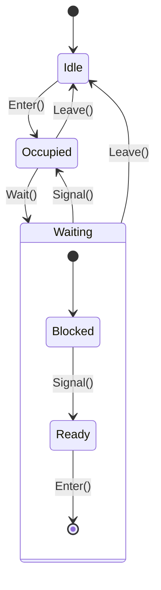

# 02-管程模式 (Monitor Pattern)

## 1. 形式化定义

### 1.1 数学定义

设 $M$ 为管程，$C$ 为条件变量集合，$P$ 为进程集合，管程模式满足以下公理：

**管程公理**：
- **互斥性**: $\forall p_1, p_2 \in P: \text{enter}(p_1, M) \land \text{enter}(p_2, M) \Rightarrow p_1 = p_2$
- **条件等待**: $\forall c \in C: \text{wait}(c) \Rightarrow \text{release}(M) \land \text{block}(p)$
- **条件通知**: $\forall c \in C: \text{signal}(c) \Rightarrow \text{wakeup}(p)$

**形式化约束**：
- **临界区保护**: $\text{critical\_section}(M) \subseteq \text{mutex\_protected}$
- **条件同步**: $\text{condition\_sync}(C) \subseteq \text{monitor\_controlled}$

### 1.2 类型理论定义

```go
// 管程接口定义
type Monitor interface {
    Enter() error
    Leave() error
    Wait(condition *sync.Cond) error
    Signal(condition *sync.Cond) error
    Broadcast(condition *sync.Cond) error
}

// 条件变量定义
type Condition struct {
    cond *sync.Cond
    count int
}
```

## 2. 实现原理

### 2.1 管程状态机



### 2.2 同步原语分析

**定理**: 管程模式保证互斥访问和条件同步。

**证明**:

1. **互斥性证明**:
   - 使用 `sync.Mutex` 保证临界区互斥
   - 进入管程时获取锁，离开时释放锁

2. **条件同步证明**:
   - 使用 `sync.Cond` 实现条件等待和通知
   - `Wait()` 释放锁并阻塞，`Signal()` 唤醒等待的进程

## 3. Go语言实现

### 3.1 基础管程实现

```go
package monitor

import (
    "fmt"
    "sync"
    "time"
)

// Monitor 管程实现
type Monitor struct {
    mutex      sync.Mutex
    conditions map[string]*sync.Cond
    occupied   bool
    owner      string
}

// NewMonitor 创建新的管程
func NewMonitor() *Monitor {
    m := &Monitor{
        conditions: make(map[string]*sync.Cond),
    }
    return m
}

// Enter 进入管程
func (m *Monitor) Enter(processID string) error {
    m.mutex.Lock()
    defer m.mutex.Unlock()
    
    if m.occupied {
        return fmt.Errorf("monitor is occupied by %s", m.owner)
    }
    
    m.occupied = true
    m.owner = processID
    fmt.Printf("Process %s entered monitor\n", processID)
    return nil
}

// Leave 离开管程
func (m *Monitor) Leave(processID string) error {
    m.mutex.Lock()
    defer m.mutex.Unlock()
    
    if !m.occupied || m.owner != processID {
        return fmt.Errorf("process %s is not the owner", processID)
    }
    
    m.occupied = false
    m.owner = ""
    fmt.Printf("Process %s left monitor\n", processID)
    return nil
}

// Wait 在条件变量上等待
func (m *Monitor) Wait(conditionName string, processID string) error {
    m.mutex.Lock()
    defer m.mutex.Unlock()
    
    if !m.occupied || m.owner != processID {
        return fmt.Errorf("process %s is not the owner", processID)
    }
    
    // 获取或创建条件变量
    cond, exists := m.conditions[conditionName]
    if !exists {
        cond = sync.NewCond(&m.mutex)
        m.conditions[conditionName] = cond
    }
    
    fmt.Printf("Process %s waiting on condition %s\n", processID, conditionName)
    m.occupied = false
    m.owner = ""
    
    cond.Wait()
    
    // 重新获取管程
    m.occupied = true
    m.owner = processID
    fmt.Printf("Process %s resumed from condition %s\n", processID, conditionName)
    return nil
}

// Signal 通知条件变量
func (m *Monitor) Signal(conditionName string, processID string) error {
    m.mutex.Lock()
    defer m.mutex.Unlock()
    
    if !m.occupied || m.owner != processID {
        return fmt.Errorf("process %s is not the owner", processID)
    }
    
    cond, exists := m.conditions[conditionName]
    if !exists {
        return fmt.Errorf("condition %s does not exist", conditionName)
    }
    
    fmt.Printf("Process %s signaling condition %s\n", processID, conditionName)
    cond.Signal()
    return nil
}

// Broadcast 广播条件变量
func (m *Monitor) Broadcast(conditionName string, processID string) error {
    m.mutex.Lock()
    defer m.mutex.Unlock()
    
    if !m.occupied || m.owner != processID {
        return fmt.Errorf("process %s is not the owner", processID)
    }
    
    cond, exists := m.conditions[conditionName]
    if !exists {
        return fmt.Errorf("condition %s does not exist", conditionName)
    }
    
    fmt.Printf("Process %s broadcasting condition %s\n", processID, conditionName)
    cond.Broadcast()
    return nil
}
```

### 3.2 高级管程实现（带资源管理）

```go
// ResourceMonitor 资源管理管程
type ResourceMonitor struct {
    monitor    *Monitor
    resources  map[string]int
    maxResources int
}

// NewResourceMonitor 创建资源管理管程
func NewResourceMonitor(maxResources int) *ResourceMonitor {
    return &ResourceMonitor{
        monitor:       NewMonitor(),
        resources:     make(map[string]int),
        maxResources:  maxResources,
    }
}

// RequestResource 请求资源
func (rm *ResourceMonitor) RequestResource(processID string, resourceType string, amount int) error {
    // 进入管程
    if err := rm.monitor.Enter(processID); err != nil {
        return err
    }
    defer rm.monitor.Leave(processID)
    
    // 检查资源是否足够
    current := rm.resources[resourceType]
    if current+amount > rm.maxResources {
        // 等待资源释放
        for current+amount > rm.maxResources {
            rm.monitor.Wait("resource_available", processID)
            current = rm.resources[resourceType]
        }
    }
    
    // 分配资源
    rm.resources[resourceType] += amount
    fmt.Printf("Process %s allocated %d units of %s\n", processID, amount, resourceType)
    return nil
}

// ReleaseResource 释放资源
func (rm *ResourceMonitor) ReleaseResource(processID string, resourceType string, amount int) error {
    // 进入管程
    if err := rm.monitor.Enter(processID); err != nil {
        return err
    }
    defer rm.monitor.Leave(processID)
    
    // 释放资源
    rm.resources[resourceType] -= amount
    if rm.resources[resourceType] < 0 {
        rm.resources[resourceType] = 0
    }
    
    fmt.Printf("Process %s released %d units of %s\n", processID, amount, resourceType)
    
    // 通知等待的进程
    rm.monitor.Signal("resource_available", processID)
    return nil
}
```

## 4. 使用示例

### 4.1 生产者-消费者问题

```go
package main

import (
    "fmt"
    "sync"
    "time"
    
    "github.com/your-project/monitor"
)

// BufferMonitor 缓冲区管程
type BufferMonitor struct {
    monitor *monitor.Monitor
    buffer  []int
    size    int
    count   int
    in      int
    out     int
}

// NewBufferMonitor 创建缓冲区管程
func NewBufferMonitor(size int) *BufferMonitor {
    return &BufferMonitor{
        monitor: monitor.NewMonitor(),
        buffer:  make([]int, size),
        size:    size,
    }
}

// Produce 生产数据
func (bm *BufferMonitor) Produce(processID string, item int) error {
    // 进入管程
    if err := bm.monitor.Enter(processID); err != nil {
        return err
    }
    defer bm.monitor.Leave(processID)
    
    // 等待缓冲区有空间
    for bm.count >= bm.size {
        bm.monitor.Wait("not_full", processID)
    }
    
    // 生产数据
    bm.buffer[bm.in] = item
    bm.in = (bm.in + 1) % bm.size
    bm.count++
    
    fmt.Printf("Producer %s produced: %d\n", processID, item)
    
    // 通知消费者
    bm.monitor.Signal("not_empty", processID)
    return nil
}

// Consume 消费数据
func (bm *BufferMonitor) Consume(processID string) (int, error) {
    // 进入管程
    if err := bm.monitor.Enter(processID); err != nil {
        return 0, err
    }
    defer bm.monitor.Leave(processID)
    
    // 等待缓冲区有数据
    for bm.count <= 0 {
        bm.monitor.Wait("not_empty", processID)
    }
    
    // 消费数据
    item := bm.buffer[bm.out]
    bm.out = (bm.out + 1) % bm.size
    bm.count--
    
    fmt.Printf("Consumer %s consumed: %d\n", processID, item)
    
    // 通知生产者
    bm.monitor.Signal("not_full", processID)
    return item, nil
}

func main() {
    buffer := NewBufferMonitor(5)
    var wg sync.WaitGroup
    
    // 启动生产者
    for i := 0; i < 3; i++ {
        wg.Add(1)
        go func(id int) {
            defer wg.Done()
            for j := 0; j < 5; j++ {
                buffer.Produce(fmt.Sprintf("P%d", id), id*100+j)
                time.Sleep(100 * time.Millisecond)
            }
        }(i)
    }
    
    // 启动消费者
    for i := 0; i < 2; i++ {
        wg.Add(1)
        go func(id int) {
            defer wg.Done()
            for j := 0; j < 7; j++ {
                buffer.Consume(fmt.Sprintf("C%d", id))
                time.Sleep(150 * time.Millisecond)
            }
        }(i)
    }
    
    wg.Wait()
}
```

### 4.2 读者-写者问题

```go
// ReaderWriterMonitor 读者-写者管程
type ReaderWriterMonitor struct {
    monitor     *monitor.Monitor
    readers     int
    writing     bool
    waitingWriters int
}

// NewReaderWriterMonitor 创建读者-写者管程
func NewReaderWriterMonitor() *ReaderWriterMonitor {
    return &ReaderWriterMonitor{
        monitor: monitor.NewMonitor(),
    }
}

// StartRead 开始读操作
func (rwm *ReaderWriterMonitor) StartRead(processID string) error {
    if err := rwm.monitor.Enter(processID); err != nil {
        return err
    }
    
    // 等待写者完成
    for rwm.writing || rwm.waitingWriters > 0 {
        rwm.monitor.Wait("no_writer", processID)
    }
    
    rwm.readers++
    fmt.Printf("Reader %s started reading (total readers: %d)\n", processID, rwm.readers)
    return nil
}

// EndRead 结束读操作
func (rwm *ReaderWriterMonitor) EndRead(processID string) error {
    rwm.readers--
    fmt.Printf("Reader %s finished reading (total readers: %d)\n", processID, rwm.readers)
    
    if rwm.readers == 0 {
        rwm.monitor.Signal("no_reader", processID)
    }
    
    return rwm.monitor.Leave(processID)
}

// StartWrite 开始写操作
func (rwm *ReaderWriterMonitor) StartWrite(processID string) error {
    if err := rwm.monitor.Enter(processID); err != nil {
        return err
    }
    
    rwm.waitingWriters++
    
    // 等待所有读者和写者完成
    for rwm.readers > 0 || rwm.writing {
        rwm.monitor.Wait("no_reader", processID)
    }
    
    rwm.waitingWriters--
    rwm.writing = true
    fmt.Printf("Writer %s started writing\n", processID)
    return nil
}

// EndWrite 结束写操作
func (rwm *ReaderWriterMonitor) EndWrite(processID string) error {
    rwm.writing = false
    fmt.Printf("Writer %s finished writing\n", processID)
    
    if rwm.waitingWriters > 0 {
        rwm.monitor.Signal("no_reader", processID)
    } else {
        rwm.monitor.Broadcast("no_writer", processID)
    }
    
    return rwm.monitor.Leave(processID)
}
```

## 5. 性能分析

### 5.1 时间复杂度

| 操作 | 时间复杂度 | 说明 |
|------|------------|------|
| Enter | O(1) | 获取互斥锁 |
| Leave | O(1) | 释放互斥锁 |
| Wait | O(1) | 条件等待 |
| Signal | O(1) | 条件通知 |
| Broadcast | O(n) | 广播所有等待进程 |

### 5.2 空间复杂度

- **基础管程**: O(k)，其中 k 为条件变量数量
- **资源管程**: O(r)，其中 r 为资源类型数量

### 5.3 并发性能


## 6. 最佳实践

### 6.1 设计原则

1. **最小化临界区**: 只在必要时进入管程
2. **避免嵌套调用**: 防止死锁
3. **合理使用条件变量**: 避免虚假唤醒
4. **资源管理**: 确保资源正确释放

### 6.2 错误处理

```go
// 安全的管程操作
func SafeMonitorOperation(mon *Monitor, processID string, operation func() error) error {
    if err := mon.Enter(processID); err != nil {
        return fmt.Errorf("failed to enter monitor: %w", err)
    }
    
    defer func() {
        if err := mon.Leave(processID); err != nil {
            log.Printf("failed to leave monitor: %v", err)
        }
    }()
    
    return operation()
}
```

### 6.3 测试策略

```go
// 管程测试
func TestMonitor(t *testing.T) {
    mon := NewMonitor()
    
    // 测试基本操作
    t.Run("Basic Operations", func(t *testing.T) {
        err := mon.Enter("test")
        assert.NoError(t, err)
        
        err = mon.Leave("test")
        assert.NoError(t, err)
    })
    
    // 测试并发访问
    t.Run("Concurrent Access", func(t *testing.T) {
        var wg sync.WaitGroup
        for i := 0; i < 10; i++ {
            wg.Add(1)
            go func(id int) {
                defer wg.Done()
                processID := fmt.Sprintf("process-%d", id)
                
                err := mon.Enter(processID)
                assert.NoError(t, err)
                
                time.Sleep(10 * time.Millisecond)
                
                err = mon.Leave(processID)
                assert.NoError(t, err)
            }(i)
        }
        wg.Wait()
    })
}
```

## 7. 与其他模式的比较

| 模式 | 适用场景 | 复杂度 | 性能 |
|------|----------|--------|------|
| 管程 | 复杂同步 | 中等 | 高 |
| 信号量 | 简单同步 | 低 | 高 |
| 消息传递 | 分布式 | 高 | 中等 |
| Actor | 并发编程 | 高 | 高 |

## 8. 总结

管程模式是并发编程中的重要同步机制，通过互斥锁和条件变量提供了强大的同步能力。在Go语言中，我们可以使用 `sync.Mutex` 和 `sync.Cond` 来实现管程模式，确保线程安全和正确的同步行为。

**关键优势**:
- 提供高级同步抽象
- 保证互斥访问
- 支持条件同步
- 易于理解和维护

**适用场景**:
- 复杂的同步需求
- 资源管理
- 生产者-消费者问题
- 读者-写者问题 