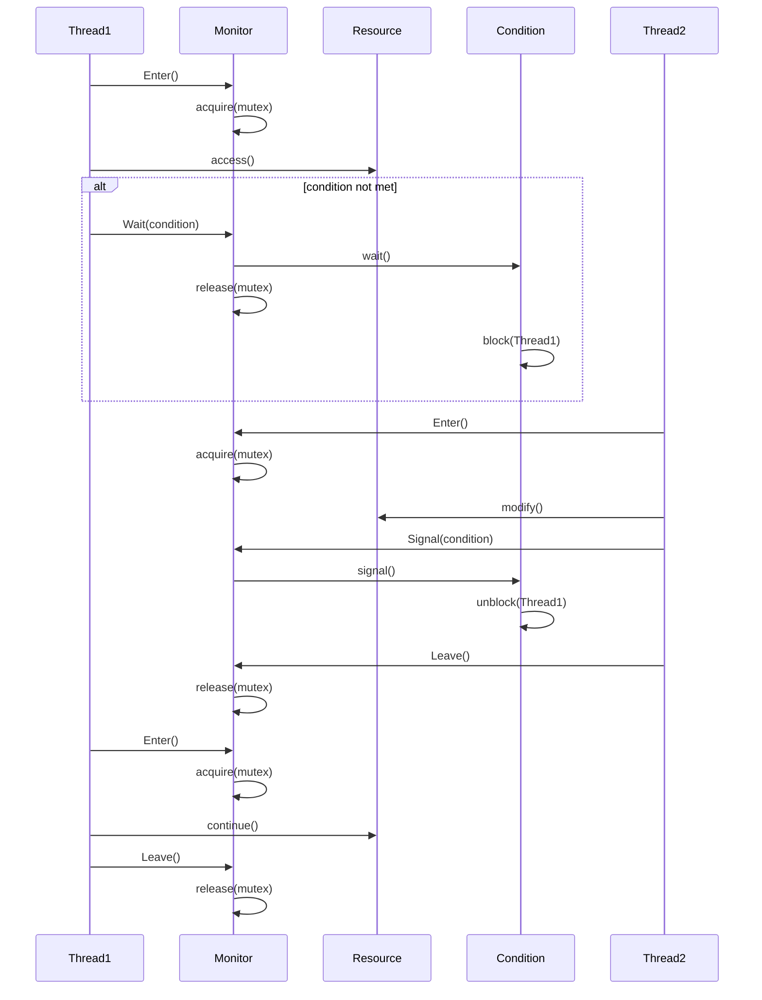

# 02-管程模式 (Monitor Pattern)

## 目录

- [02-管程模式 (Monitor Pattern)](#02-管程模式-monitor-pattern)
  - [目录](#目录)
  - [1. 概述](#1-概述)
  - [2. 形式化定义](#2-形式化定义)
  - [3. 数学基础](#3-数学基础)
  - [4. 模式结构](#4-模式结构)
  - [5. Go语言实现](#5-go语言实现)
  - [6. 性能分析](#6-性能分析)
  - [7. 应用场景](#7-应用场景)
  - [8. 优缺点分析](#8-优缺点分析)
  - [9. 相关模式](#9-相关模式)
  - [10. 总结](#10-总结)

---

## 1. 概述

### 1.1 定义

管程模式 (Monitor Pattern) 是一种并发控制模式，它封装了共享资源和对这些资源的访问方法，确保在任意时刻只有一个线程能够访问共享资源。管程通过互斥锁和条件变量来实现线程同步。

### 1.2 核心思想

管程模式的核心思想是：
- **封装共享资源**: 将共享资源及其访问方法封装在一个对象中
- **互斥访问**: 确保同一时刻只有一个线程能够访问共享资源
- **条件同步**: 使用条件变量实现线程间的协调
- **自动管理**: 自动管理锁的获取和释放

### 1.3 设计目标

1. **线程安全**: 保证共享资源在多线程环境下的安全性
2. **简化编程**: 简化并发编程的复杂性
3. **避免死锁**: 通过结构化编程避免死锁
4. **提高可维护性**: 提高代码的可读性和可维护性

---

## 2. 形式化定义

### 2.1 基本概念

设 $M$ 为管程集合，$R$ 为共享资源集合，$T$ 为线程集合，$C$ 为条件变量集合。

**定义 2.1** (管程)
管程是一个五元组 $(m, r, mutex, cv, methods)$，其中：
- $m \in M$ 是管程实例
- $r \in R$ 是共享资源
- $mutex$ 是互斥锁
- $cv \subseteq C$ 是条件变量集合
- $methods$ 是访问方法集合

**定义 2.2** (条件变量)
条件变量是一个三元组 $(cv, wait\_queue, signal\_queue)$，其中：
- $cv \in C$ 是条件变量实例
- $wait\_queue$ 是等待队列
- $signal\_queue$ 是信号队列

### 2.2 操作语义

**公理 2.1** (进入管程)
对于管程 $m$ 和线程 $t$：
$$enter(m, t) = acquire(mutex)$$

**公理 2.2** (离开管程)
对于管程 $m$ 和线程 $t$：
$$leave(m, t) = release(mutex)$$

**公理 2.3** (等待条件)
对于条件变量 $cv$ 和线程 $t$：
$$wait(cv, t) = release(mutex) \land block(t) \land enqueue(wait\_queue, t)$$

**公理 2.4** (信号条件)
对于条件变量 $cv$ 和线程 $t$：
$$signal(cv, t) = dequeue(wait\_queue) \land unblock(t) \land acquire(mutex)$$

### 2.3 安全性保证

**定理 2.1** (互斥性)
管程模式保证互斥性，当且仅当：
$$\forall t_1, t_2 \in T: \text{如果 } t_1 \text{ 和 } t_2 \text{ 同时访问管程，则 } t_1 = t_2$$

**证明**:
1. 每个管程有一个互斥锁 $mutex$
2. 进入管程必须获取锁：$enter(m, t) = acquire(mutex)$
3. 离开管程必须释放锁：$leave(m, t) = release(mutex)$
4. 因此保证了互斥性

**定理 2.2** (条件同步)
管程模式保证条件同步，当且仅当：
$$\forall cv \in C: \text{wait和signal操作配对使用}$$

---

## 3. 数学基础

### 3.1 互斥理论

**定义 3.1** (临界区)
临界区是访问共享资源的代码段，必须满足互斥性。

**定理 3.1** (互斥算法复杂度)
管程模式的互斥算法复杂度为 $O(1)$。

**证明**:
- 锁的获取和释放都是常数时间操作
- 条件变量的等待和信号也是常数时间操作
- 因此总复杂度为 $O(1)$

### 3.2 死锁避免

**定义 3.2** (死锁)
死锁是多个线程互相等待对方释放资源的状态。

**定理 3.2** (死锁避免)
管程模式天然避免死锁，当且仅当：
$$\text{不存在循环等待条件}$$

**证明**:
1. 管程使用单一互斥锁
2. 条件变量操作遵循严格的协议
3. 不存在嵌套锁获取
4. 因此避免了死锁

---

## 4. 模式结构

### 4.1 类图

```mermaid
classDiagram
    class Monitor {
        -resource: SharedResource
        -mutex: sync.Mutex
        -conditions: map[string]*Condition
        +Enter()
        +Leave()
        +Wait(condition)
        +Signal(condition)
        +Broadcast(condition)
    }
    
    class SharedResource {
        +data: interface{}
        +methods: []Method
    }
    
    class Condition {
        -waitQueue: []Thread
        -signalQueue: []Thread
        +Wait()
        +Signal()
        +Broadcast()
    }
    
    class Thread {
        +id: string
        +state: ThreadState
    }
    
    Monitor --> SharedResource
    Monitor --> Condition
    Condition --> Thread
```

### 4.2 时序图



---

## 5. Go语言实现

### 5.1 基础实现

```go
package monitor

import (
    "context"
    "fmt"
    "sync"
    "time"
)

// Condition 条件变量
type Condition struct {
    name      string
    waitQueue chan struct{}
    mu        sync.Mutex
}

// NewCondition 创建条件变量
func NewCondition(name string) *Condition {
    return &Condition{
        name:      name,
        waitQueue: make(chan struct{}, 1),
    }
}

// Wait 等待条件
func (c *Condition) Wait() {
    c.mu.Lock()
    defer c.mu.Unlock()
    
    // 释放管程锁并等待信号
    select {
    case <-c.waitQueue:
        // 收到信号，继续执行
    }
}

// Signal 发送信号
func (c *Condition) Signal() {
    c.mu.Lock()
    defer c.mu.Unlock()
    
    select {
    case c.waitQueue <- struct{}{}:
        // 发送信号成功
    default:
        // 没有等待的线程
    }
}

// Broadcast 广播信号
func (c *Condition) Broadcast() {
    c.mu.Lock()
    defer c.mu.Unlock()
    
    // 发送多个信号
    for {
        select {
        case c.waitQueue <- struct{}{}:
            // 继续发送
        default:
            // 没有更多等待的线程
            return
        }
    }
}

// Monitor 管程
type Monitor struct {
    name       string
    mutex      sync.Mutex
    conditions map[string]*Condition
}

// NewMonitor 创建管程
func NewMonitor(name string) *Monitor {
    return &Monitor{
        name:       name,
        conditions: make(map[string]*Condition),
    }
}

// Enter 进入管程
func (m *Monitor) Enter() {
    m.mutex.Lock()
}

// Leave 离开管程
func (m *Monitor) Leave() {
    m.mutex.Unlock()
}

// Wait 等待条件
func (m *Monitor) Wait(conditionName string) {
    condition := m.getOrCreateCondition(conditionName)
    m.Leave() // 释放管程锁
    condition.Wait()
    m.Enter() // 重新获取管程锁
}

// Signal 发送信号
func (m *Monitor) Signal(conditionName string) {
    condition := m.getOrCreateCondition(conditionName)
    condition.Signal()
}

// Broadcast 广播信号
func (m *Monitor) Broadcast(conditionName string) {
    condition := m.getOrCreateCondition(conditionName)
    condition.Broadcast()
}

// getOrCreateCondition 获取或创建条件变量
func (m *Monitor) getOrCreateCondition(name string) *Condition {
    if condition, exists := m.conditions[name]; exists {
        return condition
    }
    
    condition := NewCondition(name)
    m.conditions[name] = condition
    return condition
}

// Do 执行操作
func (m *Monitor) Do(operation func()) {
    m.Enter()
    defer m.Leave()
    operation()
}
```

### 5.2 泛型实现

```go
package monitor

import (
    "context"
    "sync"
    "time"
)

// GenericCondition 泛型条件变量
type GenericCondition[T any] struct {
    name      string
    waitQueue chan T
    mu        sync.Mutex
}

// NewGenericCondition 创建泛型条件变量
func NewGenericCondition[T any](name string, bufferSize int) *GenericCondition[T] {
    return &GenericCondition[T]{
        name:      name,
        waitQueue: make(chan T, bufferSize),
    }
}

// Wait 等待条件
func (c *GenericCondition[T]) Wait() T {
    c.mu.Lock()
    defer c.mu.Unlock()
    
    select {
    case value := <-c.waitQueue:
        return value
    }
}

// WaitWithTimeout 带超时的等待
func (c *GenericCondition[T]) WaitWithTimeout(timeout time.Duration) (T, error) {
    var zero T
    c.mu.Lock()
    defer c.mu.Unlock()
    
    select {
    case value := <-c.waitQueue:
        return value, nil
    case <-time.After(timeout):
        return zero, context.DeadlineExceeded
    }
}

// Signal 发送信号
func (c *GenericCondition[T]) Signal(value T) {
    c.mu.Lock()
    defer c.mu.Unlock()
    
    select {
    case c.waitQueue <- value:
        // 发送信号成功
    default:
        // 没有等待的线程
    }
}

// Broadcast 广播信号
func (c *GenericCondition[T]) Broadcast(value T) {
    c.mu.Lock()
    defer c.mu.Unlock()
    
    // 发送多个信号
    for {
        select {
        case c.waitQueue <- value:
            // 继续发送
        default:
            // 没有更多等待的线程
            return
        }
    }
}

// GenericMonitor 泛型管程
type GenericMonitor[T any] struct {
    name       string
    mutex      sync.RWMutex
    conditions map[string]*GenericCondition[T]
}

// NewGenericMonitor 创建泛型管程
func NewGenericMonitor[T any](name string) *GenericMonitor[T] {
    return &GenericMonitor[T]{
        name:       name,
        conditions: make(map[string]*GenericCondition[T]),
    }
}

// Enter 进入管程
func (m *GenericMonitor[T]) Enter() {
    m.mutex.Lock()
}

// EnterRead 进入读模式
func (m *GenericMonitor[T]) EnterRead() {
    m.mutex.RLock()
}

// Leave 离开管程
func (m *GenericMonitor[T]) Leave() {
    m.mutex.Unlock()
}

// LeaveRead 离开读模式
func (m *GenericMonitor[T]) LeaveRead() {
    m.mutex.RUnlock()
}

// Wait 等待条件
func (m *GenericMonitor[T]) Wait(conditionName string) T {
    condition := m.getOrCreateCondition(conditionName)
    m.Leave() // 释放管程锁
    value := condition.Wait()
    m.Enter() // 重新获取管程锁
    return value
}

// WaitWithTimeout 带超时的等待
func (m *GenericMonitor[T]) WaitWithTimeout(conditionName string, timeout time.Duration) (T, error) {
    condition := m.getOrCreateCondition(conditionName)
    m.Leave() // 释放管程锁
    value, err := condition.WaitWithTimeout(timeout)
    m.Enter() // 重新获取管程锁
    return value, err
}

// Signal 发送信号
func (m *GenericMonitor[T]) Signal(conditionName string, value T) {
    condition := m.getOrCreateCondition(conditionName)
    condition.Signal(value)
}

// Broadcast 广播信号
func (m *GenericMonitor[T]) Broadcast(conditionName string, value T) {
    condition := m.getOrCreateCondition(conditionName)
    condition.Broadcast(value)
}

// getOrCreateCondition 获取或创建条件变量
func (m *GenericMonitor[T]) getOrCreateCondition(name string) *GenericCondition[T] {
    if condition, exists := m.conditions[name]; exists {
        return condition
    }
    
    condition := NewGenericCondition[T](name, 10)
    m.conditions[name] = condition
    return condition
}

// Do 执行操作
func (m *GenericMonitor[T]) Do(operation func()) {
    m.Enter()
    defer m.Leave()
    operation()
}

// DoRead 执行读操作
func (m *GenericMonitor[T]) DoRead(operation func()) {
    m.EnterRead()
    defer m.LeaveRead()
    operation()
}
```

### 5.3 实际应用示例

```go
package main

import (
    "fmt"
    "log"
    "sync"
    "time"
)

// BoundedBuffer 有界缓冲区
type BoundedBuffer struct {
    monitor    *Monitor
    buffer     []interface{}
    capacity   int
    size       int
    head       int
    tail       int
}

// NewBoundedBuffer 创建有界缓冲区
func NewBoundedBuffer(capacity int) *BoundedBuffer {
    return &BoundedBuffer{
        monitor:  NewMonitor("BoundedBuffer"),
        buffer:   make([]interface{}, capacity),
        capacity: capacity,
        size:     0,
        head:     0,
        tail:     0,
    }
}

// Put 放入元素
func (bb *BoundedBuffer) Put(item interface{}) {
    bb.monitor.Do(func() {
        // 等待缓冲区有空间
        for bb.size >= bb.capacity {
            bb.monitor.Wait("notFull")
        }
        
        // 放入元素
        bb.buffer[bb.tail] = item
        bb.tail = (bb.tail + 1) % bb.capacity
        bb.size++
        
        // 通知消费者
        bb.monitor.Signal("notEmpty")
        
        fmt.Printf("Put: %v, size: %d\n", item, bb.size)
    })
}

// Get 获取元素
func (bb *BoundedBuffer) Get() interface{} {
    var result interface{}
    bb.monitor.Do(func() {
        // 等待缓冲区有元素
        for bb.size <= 0 {
            bb.monitor.Wait("notEmpty")
        }
        
        // 获取元素
        result = bb.buffer[bb.head]
        bb.head = (bb.head + 1) % bb.capacity
        bb.size--
        
        // 通知生产者
        bb.monitor.Signal("notFull")
        
        fmt.Printf("Get: %v, size: %d\n", result, bb.size)
    })
    return result
}

// Size 获取当前大小
func (bb *BoundedBuffer) Size() int {
    var size int
    bb.monitor.Do(func() {
        size = bb.size
    })
    return size
}

// IsEmpty 检查是否为空
func (bb *BoundedBuffer) IsEmpty() bool {
    var empty bool
    bb.monitor.Do(func() {
        empty = bb.size == 0
    })
    return empty
}

// IsFull 检查是否已满
func (bb *BoundedBuffer) IsFull() bool {
    var full bool
    bb.monitor.Do(func() {
        full = bb.size == bb.capacity
    })
    return full
}

// Producer 生产者
type Producer struct {
    id       int
    buffer   *BoundedBuffer
    items    []interface{}
    wg       *sync.WaitGroup
}

// NewProducer 创建生产者
func NewProducer(id int, buffer *BoundedBuffer, items []interface{}, wg *sync.WaitGroup) *Producer {
    return &Producer{
        id:     id,
        buffer: buffer,
        items:  items,
        wg:     wg,
    }
}

// Run 运行生产者
func (p *Producer) Run() {
    defer p.wg.Done()
    
    for _, item := range p.items {
        p.buffer.Put(item)
        time.Sleep(100 * time.Millisecond) // 模拟生产时间
    }
    
    fmt.Printf("Producer %d finished\n", p.id)
}

// Consumer 消费者
type Consumer struct {
    id     int
    buffer *BoundedBuffer
    count  int
    wg     *sync.WaitGroup
}

// NewConsumer 创建消费者
func NewConsumer(id int, buffer *BoundedBuffer, count int, wg *sync.WaitGroup) *Consumer {
    return &Consumer{
        id:    id,
        buffer: buffer,
        count: count,
        wg:    wg,
    }
}

// Run 运行消费者
func (c *Consumer) Run() {
    defer c.wg.Done()
    
    for i := 0; i < c.count; i++ {
        item := c.buffer.Get()
        fmt.Printf("Consumer %d consumed: %v\n", c.id, item)
        time.Sleep(150 * time.Millisecond) // 模拟消费时间
    }
    
    fmt.Printf("Consumer %d finished\n", c.id)
}

// BankAccount 银行账户示例
type BankAccount struct {
    monitor *Monitor
    balance int
    name    string
}

// NewBankAccount 创建银行账户
func NewBankAccount(name string, initialBalance int) *BankAccount {
    return &BankAccount{
        monitor: NewMonitor("BankAccount"),
        balance: initialBalance,
        name:    name,
    }
}

// Deposit 存款
func (ba *BankAccount) Deposit(amount int) {
    ba.monitor.Do(func() {
        ba.balance += amount
        fmt.Printf("Deposited %d to %s, new balance: %d\n", amount, ba.name, ba.balance)
        ba.monitor.Signal("balanceChanged")
    })
}

// Withdraw 取款
func (ba *BankAccount) Withdraw(amount int) bool {
    var success bool
    ba.monitor.Do(func() {
        // 等待余额足够
        for ba.balance < amount {
            ba.monitor.Wait("balanceChanged")
        }
        
        ba.balance -= amount
        success = true
        fmt.Printf("Withdrew %d from %s, new balance: %d\n", amount, ba.name, ba.balance)
    })
    return success
}

// GetBalance 获取余额
func (ba *BankAccount) GetBalance() int {
    var balance int
    ba.monitor.Do(func() {
        balance = ba.balance
    })
    return balance
}

// Transfer 转账
func (ba *BankAccount) Transfer(target *BankAccount, amount int) bool {
    var success bool
    ba.monitor.Do(func() {
        // 等待余额足够
        for ba.balance < amount {
            ba.monitor.Wait("balanceChanged")
        }
        
        ba.balance -= amount
        target.Deposit(amount)
        success = true
        fmt.Printf("Transferred %d from %s to %s\n", amount, ba.name, target.name)
    })
    return success
}

func main() {
    // 示例1: 有界缓冲区
    fmt.Println("=== 有界缓冲区示例 ===")
    buffer := NewBoundedBuffer(5)
    
    var wg sync.WaitGroup
    
    // 创建生产者
    producerItems := []interface{}{"A", "B", "C", "D", "E", "F", "G", "H"}
    producer := NewProducer(1, buffer, producerItems, &wg)
    
    // 创建消费者
    consumer := NewConsumer(1, buffer, 8, &wg)
    
    wg.Add(2)
    go producer.Run()
    go consumer.Run()
    
    wg.Wait()
    fmt.Println("缓冲区示例完成")
    
    // 示例2: 银行账户
    fmt.Println("\n=== 银行账户示例 ===")
    account1 := NewBankAccount("Alice", 1000)
    account2 := NewBankAccount("Bob", 500)
    
    var wg2 sync.WaitGroup
    wg2.Add(4)
    
    // 并发操作
    go func() {
        defer wg2.Done()
        account1.Deposit(200)
    }()
    
    go func() {
        defer wg2.Done()
        account1.Withdraw(300)
    }()
    
    go func() {
        defer wg2.Done()
        account2.Deposit(100)
    }()
    
    go func() {
        defer wg2.Done()
        account1.Transfer(account2, 150)
    }()
    
    wg2.Wait()
    
    fmt.Printf("Alice's balance: %d\n", account1.GetBalance())
    fmt.Printf("Bob's balance: %d\n", account2.GetBalance())
    fmt.Println("银行账户示例完成")
}
```

---

## 6. 性能分析

### 6.1 时间复杂度

- **进入管程**: $O(1)$
- **离开管程**: $O(1)$
- **等待条件**: $O(1)$
- **发送信号**: $O(1)$
- **广播信号**: $O(n)$，其中 $n$ 是等待线程数

### 6.2 空间复杂度

- **管程对象**: $O(1)$
- **条件变量**: $O(1)$ 每个条件
- **等待队列**: $O(n)$，其中 $n$ 是等待线程数

### 6.3 性能优化建议

1. **减少锁竞争**: 使用读写锁分离读写操作
2. **条件变量优化**: 合理使用Signal和Broadcast
3. **避免嵌套锁**: 防止死锁
4. **批量操作**: 支持批量条件通知

---

## 7. 应用场景

### 7.1 适用场景

1. **生产者-消费者问题**: 有界缓冲区实现
2. **读者-写者问题**: 共享资源访问控制
3. **哲学家就餐问题**: 资源分配和死锁避免
4. **银行账户管理**: 并发金融操作
5. **线程池管理**: 工作线程协调

### 7.2 使用示例

```go
// 读者-写者问题示例
type ReadWriteMonitor struct {
    monitor     *Monitor
    readers     int
    writers     int
    waitingWriters int
}

func (rwm *ReadWriteMonitor) StartRead() {
    rwm.monitor.Do(func() {
        // 等待写者完成
        for rwm.writers > 0 || rwm.waitingWriters > 0 {
            rwm.monitor.Wait("noWriters")
        }
        rwm.readers++
    })
}

func (rwm *ReadWriteMonitor) EndRead() {
    rwm.monitor.Do(func() {
        rwm.readers--
        if rwm.readers == 0 {
            rwm.monitor.Signal("noReaders")
        }
    })
}

func (rwm *ReadWriteMonitor) StartWrite() {
    rwm.monitor.Do(func() {
        rwm.waitingWriters++
        // 等待读者和写者完成
        for rwm.readers > 0 || rwm.writers > 0 {
            rwm.monitor.Wait("noReaders")
        }
        rwm.waitingWriters--
        rwm.writers++
    })
}

func (rwm *ReadWriteMonitor) EndWrite() {
    rwm.monitor.Do(func() {
        rwm.writers--
        if rwm.waitingWriters > 0 {
            rwm.monitor.Signal("noReaders")
        } else {
            rwm.monitor.Signal("noWriters")
        }
    })
}
```

---

## 8. 优缺点分析

### 8.1 优点

1. **线程安全**: 天然保证线程安全
2. **简化编程**: 简化并发编程复杂性
3. **避免死锁**: 结构化编程避免死锁
4. **可读性强**: 代码结构清晰
5. **自动管理**: 自动管理锁的获取和释放

### 8.2 缺点

1. **性能开销**: 锁操作有性能开销
2. **扩展性限制**: 单一锁可能成为瓶颈
3. **调试困难**: 条件变量调试复杂
4. **错误处理**: 异常情况处理复杂
5. **资源竞争**: 可能产生锁竞争

### 8.3 权衡考虑

| 方面 | 传统锁 | 管程模式 |
|------|--------|----------|
| 安全性 | 低 | 高 |
| 性能 | 高 | 中等 |
| 复杂度 | 高 | 低 |
| 可维护性 | 低 | 高 |
| 扩展性 | 高 | 中等 |

---

## 9. 相关模式

### 9.1 模式关系

- **互斥锁模式**: 管程的基础实现
- **条件变量模式**: 管程的同步机制
- **读写锁模式**: 可以替代单一互斥锁
- **信号量模式**: 可以用于条件同步

### 9.2 模式组合

```go
// 结合读写锁的管程
type ReadWriteMonitor struct {
    rwMutex sync.RWMutex
    conditions map[string]*Condition
}

// 结合信号量的管程
type SemaphoreMonitor struct {
    mutex sync.Mutex
    semaphore chan struct{}
}
```

---

## 10. 总结

管程模式是一种经典的并发控制模式，通过封装共享资源和访问方法，提供了简洁而安全的并发编程方案。在Go语言中，该模式可以很好地利用sync包的特性，提供高效的实现。

### 10.1 关键要点

1. **封装性**: 将共享资源及其访问方法封装在一起
2. **互斥性**: 确保同一时刻只有一个线程访问资源
3. **条件同步**: 使用条件变量实现线程协调
4. **自动管理**: 自动管理锁的获取和释放

### 10.2 最佳实践

1. **合理设计条件变量**: 避免条件变量过多
2. **正确使用Signal和Broadcast**: 根据场景选择合适的通知方式
3. **避免嵌套锁**: 防止死锁发生
4. **异常处理**: 正确处理异常情况
5. **性能优化**: 根据负载选择合适的锁策略

### 10.3 未来发展方向

1. **智能锁**: 基于负载的动态锁策略
2. **分布式管程**: 支持分布式环境
3. **性能监控**: 集成性能监控功能
4. **自动优化**: 自动优化锁策略
5. **机器学习**: 使用ML优化并发性能

---

**参考文献**:
1. Hoare, C. A. R. (1974). Monitors: An operating system structuring concept
2. Hansen, P. B. (1975). The programming language Concurrent Pascal
3. Go Concurrency Patterns: https://golang.org/doc/effective_go.html#concurrency
4. Go sync package: https://golang.org/pkg/sync/ 