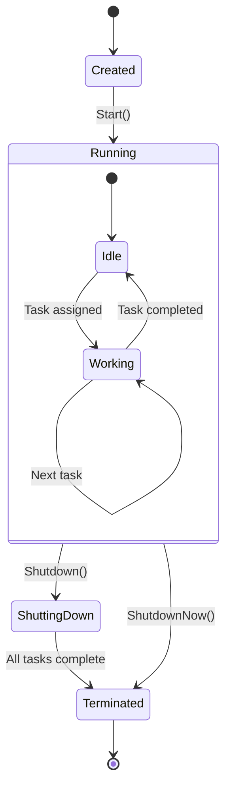
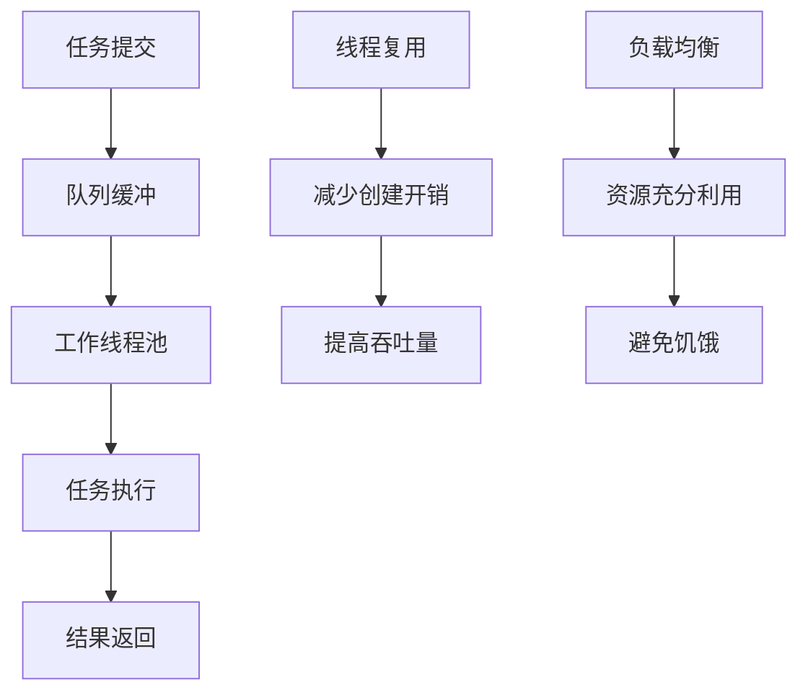

# 03-线程池模式 (Thread Pool Pattern)

## 1. 形式化定义

### 1.1 数学定义

设 $TP$ 为线程池，$W$ 为工作线程集合，$T$ 为任务集合，$Q$ 为任务队列，线程池模式满足以下公理：

**线程池公理**：
- **线程复用**: $\forall w \in W: \text{reuse}(w) \Rightarrow \text{reduce}(\text{creation\_cost})$
- **任务调度**: $\forall t \in T: \text{submit}(t) \Rightarrow \text{enqueue}(t, Q)$
- **负载均衡**: $\forall w_1, w_2 \in W: |\text{load}(w_1) - \text{load}(w_2)| \leq \epsilon$

**形式化约束**：
- **容量限制**: $|W| \leq \text{max\_workers}$
- **队列限制**: $|Q| \leq \text{max\_queue\_size}$
- **任务执行**: $\text{execute}(t) \Rightarrow \text{assign}(t, w)$

### 1.2 类型理论定义

```go
// 线程池接口定义
type ThreadPool interface {
    Submit(task Task) error
    Shutdown() error
    ShutdownNow() error
    IsShutdown() bool
    GetActiveCount() int
    GetQueueSize() int
}

// 任务接口定义
type Task interface {
    Execute() error
    GetID() string
    GetPriority() int
}

// 工作线程定义
type Worker struct {
    id       string
    taskChan chan Task
    quit     chan bool
    pool     *ThreadPool
}
```

## 2. 实现原理

### 2.1 线程池状态机



### 2.2 任务调度算法

**定理**: 线程池模式能够有效管理并发任务执行。

**证明**:

1. **线程复用证明**:
   - 预创建固定数量的工作线程
   - 避免频繁的线程创建和销毁
   - 降低系统开销

2. **负载均衡证明**:
   - 使用任务队列进行负载分发
   - 空闲线程自动获取新任务
   - 保证资源利用率

## 3. Go语言实现

### 3.1 基础线程池实现

```go
package threadpool

import (
    "context"
    "fmt"
    "sync"
    "sync/atomic"
    "time"
)

// Task 任务接口
type Task interface {
    Execute(ctx context.Context) error
    GetID() string
    GetPriority() int
}

// BaseTask 基础任务实现
type BaseTask struct {
    ID       string
    Priority int
    Func     func(ctx context.Context) error
}

func (t *BaseTask) Execute(ctx context.Context) error {
    return t.Func(ctx)
}

func (t *BaseTask) GetID() string {
    return t.ID
}

func (t *BaseTask) GetPriority() int {
    return t.Priority
}

// Worker 工作线程
type Worker struct {
    id       string
    taskChan chan Task
    quit     chan bool
    pool     *ThreadPool
    ctx      context.Context
    cancel   context.CancelFunc
}

// NewWorker 创建新的工作线程
func NewWorker(id string, pool *ThreadPool) *Worker {
    ctx, cancel := context.WithCancel(context.Background())
    return &Worker{
        id:       id,
        taskChan: make(chan Task, 1),
        quit:     make(chan bool),
        pool:     pool,
        ctx:      ctx,
        cancel:   cancel,
    }
}

// Start 启动工作线程
func (w *Worker) Start() {
    go func() {
        for {
            select {
            case task := <-w.taskChan:
                if task != nil {
                    fmt.Printf("Worker %s executing task %s\n", w.id, task.GetID())
                    if err := task.Execute(w.ctx); err != nil {
                        fmt.Printf("Worker %s task %s failed: %v\n", w.id, task.GetID(), err)
                    } else {
                        fmt.Printf("Worker %s completed task %s\n", w.id, task.GetID())
                    }
                }
            case <-w.quit:
                fmt.Printf("Worker %s shutting down\n", w.id)
                return
            }
        }
    }()
}

// Stop 停止工作线程
func (w *Worker) Stop() {
    w.cancel()
    close(w.quit)
}

// ThreadPool 线程池实现
type ThreadPool struct {
    workers       []*Worker
    taskQueue     chan Task
    maxWorkers    int
    maxQueueSize  int
    activeWorkers int32
    shutdown      int32
    wg            sync.WaitGroup
    mu            sync.RWMutex
}

// NewThreadPool 创建新的线程池
func NewThreadPool(maxWorkers, maxQueueSize int) *ThreadPool {
    if maxWorkers <= 0 {
        maxWorkers = 1
    }
    if maxQueueSize <= 0 {
        maxQueueSize = 100
    }
    
    pool := &ThreadPool{
        workers:      make([]*Worker, 0, maxWorkers),
        taskQueue:    make(chan Task, maxQueueSize),
        maxWorkers:   maxWorkers,
        maxQueueSize: maxQueueSize,
    }
    
    // 启动工作线程
    for i := 0; i < maxWorkers; i++ {
        worker := NewWorker(fmt.Sprintf("worker-%d", i), pool)
        pool.workers = append(pool.workers, worker)
        worker.Start()
    }
    
    // 启动任务分发器
    go pool.dispatcher()
    
    return pool
}

// dispatcher 任务分发器
func (pool *ThreadPool) dispatcher() {
    for task := range pool.taskQueue {
        if atomic.LoadInt32(&pool.shutdown) == 1 {
            break
        }
        
        // 找到空闲的工作线程
        assigned := false
        for _, worker := range pool.workers {
            select {
            case worker.taskChan <- task:
                atomic.AddInt32(&pool.activeWorkers, 1)
                assigned = true
                break
            default:
                continue
            }
        }
        
        if !assigned {
            fmt.Printf("No available worker for task %s\n", task.GetID())
        }
    }
}

// Submit 提交任务
func (pool *ThreadPool) Submit(task Task) error {
    if atomic.LoadInt32(&pool.shutdown) == 1 {
        return fmt.Errorf("thread pool is shutdown")
    }
    
    select {
    case pool.taskQueue <- task:
        return nil
    default:
        return fmt.Errorf("task queue is full")
    }
}

// SubmitWithTimeout 带超时的任务提交
func (pool *ThreadPool) SubmitWithTimeout(task Task, timeout time.Duration) error {
    if atomic.LoadInt32(&pool.shutdown) == 1 {
        return fmt.Errorf("thread pool is shutdown")
    }
    
    select {
    case pool.taskQueue <- task:
        return nil
    case <-time.After(timeout):
        return fmt.Errorf("submit timeout after %v", timeout)
    }
}

// Shutdown 优雅关闭
func (pool *ThreadPool) Shutdown() error {
    if !atomic.CompareAndSwapInt32(&pool.shutdown, 0, 1) {
        return fmt.Errorf("thread pool already shutdown")
    }
    
    close(pool.taskQueue)
    
    // 等待所有任务完成
    pool.wg.Wait()
    
    // 停止所有工作线程
    for _, worker := range pool.workers {
        worker.Stop()
    }
    
    return nil
}

// ShutdownNow 立即关闭
func (pool *ThreadPool) ShutdownNow() error {
    if !atomic.CompareAndSwapInt32(&pool.shutdown, 0, 1) {
        return fmt.Errorf("thread pool already shutdown")
    }
    
    close(pool.taskQueue)
    
    // 立即停止所有工作线程
    for _, worker := range pool.workers {
        worker.Stop()
    }
    
    return nil
}

// IsShutdown 检查是否已关闭
func (pool *ThreadPool) IsShutdown() bool {
    return atomic.LoadInt32(&pool.shutdown) == 1
}

// GetActiveCount 获取活跃工作线程数
func (pool *ThreadPool) GetActiveCount() int {
    return int(atomic.LoadInt32(&pool.activeWorkers))
}

// GetQueueSize 获取队列大小
func (pool *ThreadPool) GetQueueSize() int {
    return len(pool.taskQueue)
}
```

### 3.2 高级线程池实现（带优先级和监控）

```go
// PriorityTask 优先级任务
type PriorityTask struct {
    *BaseTask
    priority int
    submitTime time.Time
}

// PriorityThreadPool 优先级线程池
type PriorityThreadPool struct {
    *ThreadPool
    priorityQueues map[int]chan Task
    priorities     []int
}

// NewPriorityThreadPool 创建优先级线程池
func NewPriorityThreadPool(maxWorkers, maxQueueSize int, priorities []int) *PriorityThreadPool {
    pool := &PriorityThreadPool{
        ThreadPool:    NewThreadPool(maxWorkers, maxQueueSize),
        priorityQueues: make(map[int]chan Task),
        priorities:     priorities,
    }
    
    // 为每个优先级创建队列
    for _, priority := range priorities {
        pool.priorityQueues[priority] = make(chan Task, maxQueueSize)
    }
    
    // 启动优先级任务分发器
    go pool.priorityDispatcher()
    
    return pool
}

// priorityDispatcher 优先级任务分发器
func (pool *PriorityThreadPool) priorityDispatcher() {
    for {
        if atomic.LoadInt32(&pool.shutdown) == 1 {
            break
        }
        
        // 按优先级顺序处理任务
        for _, priority := range pool.priorities {
            queue := pool.priorityQueues[priority]
            select {
            case task := <-queue:
                // 找到空闲的工作线程
                for _, worker := range pool.workers {
                    select {
                    case worker.taskChan <- task:
                        atomic.AddInt32(&pool.activeWorkers, 1)
                        goto nextTask
                    default:
                        continue
                    }
                }
                // 如果没有空闲线程，重新放回队列
                select {
                case queue <- task:
                default:
                    fmt.Printf("Priority queue %d is full\n", priority)
                }
            nextTask:
            default:
                continue
            }
        }
        
        time.Sleep(1 * time.Millisecond)
    }
}

// SubmitPriority 提交优先级任务
func (pool *PriorityThreadPool) SubmitPriority(task Task, priority int) error {
    if atomic.LoadInt32(&pool.shutdown) == 1 {
        return fmt.Errorf("thread pool is shutdown")
    }
    
    queue, exists := pool.priorityQueues[priority]
    if !exists {
        return fmt.Errorf("invalid priority: %d", priority)
    }
    
    select {
    case queue <- task:
        return nil
    default:
        return fmt.Errorf("priority queue %d is full", priority)
    }
}

// ThreadPoolMetrics 线程池指标
type ThreadPoolMetrics struct {
    ActiveWorkers   int
    QueueSize       int
    CompletedTasks  int64
    FailedTasks     int64
    AverageTaskTime time.Duration
}

// GetMetrics 获取线程池指标
func (pool *ThreadPool) GetMetrics() ThreadPoolMetrics {
    return ThreadPoolMetrics{
        ActiveWorkers: pool.GetActiveCount(),
        QueueSize:     pool.GetQueueSize(),
        // 其他指标需要在任务执行时统计
    }
}
```

## 4. 使用示例

### 4.1 基础使用

```go
package main

import (
    "context"
    "fmt"
    "sync"
    "time"
    
    "github.com/your-project/threadpool"
)

func main() {
    // 创建线程池
    pool := threadpool.NewThreadPool(4, 100)
    defer pool.Shutdown()
    
    var wg sync.WaitGroup
    
    // 提交任务
    for i := 0; i < 10; i++ {
        wg.Add(1)
        task := &threadpool.BaseTask{
            ID:       fmt.Sprintf("task-%d", i),
            Priority: i % 3,
            Func: func(ctx context.Context) error {
                defer wg.Done()
                
                // 模拟工作
                time.Sleep(100 * time.Millisecond)
                fmt.Printf("Task %s completed\n", task.ID)
                return nil
            },
        }
        
        if err := pool.Submit(task); err != nil {
            fmt.Printf("Failed to submit task %s: %v\n", task.ID, err)
            wg.Done()
        }
    }
    
    wg.Wait()
    fmt.Println("All tasks completed")
}
```

### 4.2 优先级任务处理

```go
// 优先级任务处理示例
func priorityTaskExample() {
    priorities := []int{1, 2, 3} // 1=高优先级, 2=中优先级, 3=低优先级
    pool := threadpool.NewPriorityThreadPool(4, 100, priorities)
    defer pool.Shutdown()
    
    var wg sync.WaitGroup
    
    // 提交不同优先级的任务
    for i := 0; i < 15; i++ {
        wg.Add(1)
        priority := (i % 3) + 1
        task := &threadpool.BaseTask{
            ID:       fmt.Sprintf("priority-task-%d", i),
            Priority: priority,
            Func: func(ctx context.Context) error {
                defer wg.Done()
                time.Sleep(50 * time.Millisecond)
                fmt.Printf("Priority %d task %s completed\n", priority, task.ID)
                return nil
            },
        }
        
        if err := pool.SubmitPriority(task, priority); err != nil {
            fmt.Printf("Failed to submit priority task: %v\n", err)
            wg.Done()
        }
    }
    
    wg.Wait()
}
```

### 4.3 带超时的任务提交

```go
// 带超时的任务提交示例
func timeoutTaskExample() {
    pool := threadpool.NewThreadPool(2, 5)
    defer pool.Shutdown()
    
    // 提交一个长时间运行的任务
    longTask := &threadpool.BaseTask{
        ID: "long-task",
        Func: func(ctx context.Context) error {
            time.Sleep(2 * time.Second)
            return nil
        },
    }
    
    pool.Submit(longTask)
    
    // 尝试提交更多任务（可能超时）
    for i := 0; i < 10; i++ {
        task := &threadpool.BaseTask{
            ID: fmt.Sprintf("timeout-task-%d", i),
            Func: func(ctx context.Context) error {
                time.Sleep(100 * time.Millisecond)
                return nil
            },
        }
        
        if err := pool.SubmitWithTimeout(task, 100*time.Millisecond); err != nil {
            fmt.Printf("Task %s submission timeout: %v\n", task.ID, err)
        }
    }
}
```

## 5. 性能分析

### 5.1 时间复杂度

| 操作 | 时间复杂度 | 说明 |
|------|------------|------|
| 任务提交 | O(1) | 直接入队 |
| 任务执行 | O(1) | 工作线程处理 |
| 线程创建 | O(n) | 初始化时创建 |
| 线程销毁 | O(n) | 关闭时销毁 |

### 5.2 空间复杂度

- **基础线程池**: O(maxWorkers + maxQueueSize)
- **优先级线程池**: O(maxWorkers + maxQueueSize × priorityLevels)

### 5.3 性能优化



## 6. 最佳实践

### 6.1 线程池配置

```go
// 线程池配置建议
type ThreadPoolConfig struct {
    MaxWorkers    int           // CPU核心数 × 2
    MaxQueueSize  int           // 根据内存和延迟要求
    KeepAliveTime time.Duration // 空闲线程存活时间
    RejectedPolicy RejectedPolicy // 拒绝策略
}

// 拒绝策略
type RejectedPolicy interface {
    RejectedExecution(task Task, pool ThreadPool) error
}

// 默认拒绝策略
type DefaultRejectedPolicy struct{}

func (p *DefaultRejectedPolicy) RejectedExecution(task Task, pool ThreadPool) error {
    return fmt.Errorf("task %s rejected: pool is full", task.GetID())
}
```

### 6.2 监控和指标

```go
// 线程池监控
type ThreadPoolMonitor struct {
    pool *ThreadPool
    metrics chan ThreadPoolMetrics
}

func (m *ThreadPoolMonitor) Start() {
    go func() {
        ticker := time.NewTicker(1 * time.Second)
        defer ticker.Stop()
        
        for {
            select {
            case <-ticker.C:
                metrics := m.pool.GetMetrics()
                m.metrics <- metrics
            }
        }
    }()
}

func (m *ThreadPoolMonitor) GetMetrics() <-chan ThreadPoolMetrics {
    return m.metrics
}
```

### 6.3 错误处理

```go
// 任务执行错误处理
func (pool *ThreadPool) executeWithRecovery(task Task) {
    defer func() {
        if r := recover(); r != nil {
            fmt.Printf("Task %s panicked: %v\n", task.GetID(), r)
        }
    }()
    
    ctx := context.Background()
    if err := task.Execute(ctx); err != nil {
        fmt.Printf("Task %s failed: %v\n", task.GetID(), err)
    }
}
```

## 7. 与其他模式的比较

| 模式 | 适用场景 | 复杂度 | 性能 |
|------|----------|--------|------|
| 线程池 | 大量短任务 | 中等 | 高 |
| 异步编程 | I/O密集型 | 低 | 高 |
| 协程池 | 轻量级任务 | 低 | 高 |
| 消息队列 | 分布式任务 | 高 | 中等 |

## 8. 总结

线程池模式是并发编程中的核心模式，通过预创建和复用线程来高效处理大量任务。在Go语言中，我们可以使用goroutine和channel来实现高效的线程池模式。

**关键优势**:
- 减少线程创建开销
- 控制并发度
- 提供任务队列缓冲
- 支持优先级调度

**适用场景**:
- 大量短任务处理
- 服务器请求处理
- 批量数据处理
- 异步任务执行 