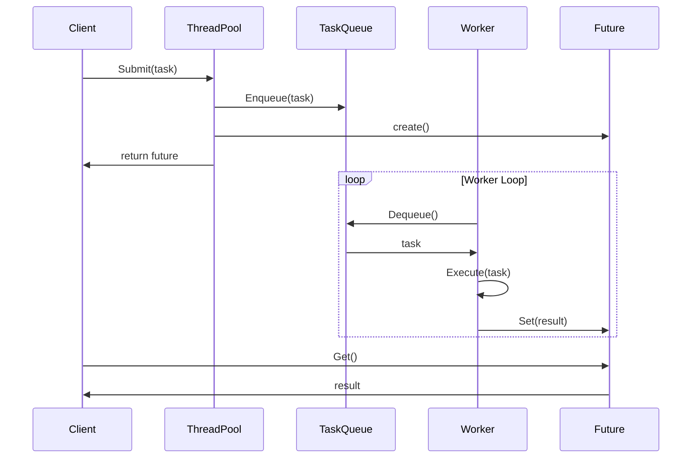

# 03-线程池模式 (Thread Pool Pattern)

## 目录

- [03-线程池模式 (Thread Pool Pattern)](#03-线程池模式-thread-pool-pattern)
  - [目录](#目录)
  - [1. 概述](#1-概述)
    - [1.1 定义](#11-定义)
    - [1.2 核心思想](#12-核心思想)
    - [1.3 设计目标](#13-设计目标)
  - [2. 形式化定义](#2-形式化定义)
    - [2.1 基本概念](#21-基本概念)
    - [2.2 操作语义](#22-操作语义)
    - [2.3 线程池策略](#23-线程池策略)
  - [3. 数学基础](#3-数学基础)
    - [3.1 队列理论](#31-队列理论)
    - [3.2 性能分析](#32-性能分析)
  - [4. 模式结构](#4-模式结构)
    - [4.1 类图](#41-类图)
    - [4.2 时序图](#42-时序图)
  - [5. Go语言实现](#5-go语言实现)
    - [5.1 基础实现](#51-基础实现)
    - [5.2 泛型实现](#52-泛型实现)
    - [5.3 实际应用示例](#53-实际应用示例)
  - [6. 性能分析](#6-性能分析)
    - [6.1 时间复杂度](#61-时间复杂度)
    - [6.2 空间复杂度](#62-空间复杂度)
    - [6.3 性能优化建议](#63-性能优化建议)
  - [7. 应用场景](#7-应用场景)
    - [7.1 适用场景](#71-适用场景)
    - [7.2 使用示例](#72-使用示例)
  - [8. 优缺点分析](#8-优缺点分析)
    - [8.1 优点](#81-优点)
    - [8.2 缺点](#82-缺点)
    - [8.3 权衡考虑](#83-权衡考虑)
  - [9. 相关模式](#9-相关模式)
    - [9.1 模式关系](#91-模式关系)
    - [9.2 模式组合](#92-模式组合)
  - [10. 总结](#10-总结)
    - [10.1 关键要点](#101-关键要点)
    - [10.2 最佳实践](#102-最佳实践)
    - [10.3 未来发展方向](#103-未来发展方向)

---

## 1. 概述

### 1.1 定义

线程池模式 (Thread Pool Pattern) 是一种并发设计模式，它预先创建一组工作线程，并将任务提交到任务队列中，由这些线程异步执行。该模式通过复用线程来避免频繁创建和销毁线程的开销，提高系统性能。

### 1.2 核心思想

线程池模式的核心思想是：

- **线程复用**: 预先创建线程，避免重复创建和销毁
- **任务队列**: 使用队列管理待执行的任务
- **负载均衡**: 自动分配任务给空闲线程
- **资源控制**: 限制并发线程数量，避免资源耗尽

### 1.3 设计目标

1. **性能优化**: 减少线程创建和销毁的开销
2. **资源管理**: 控制并发线程数量
3. **响应性**: 快速响应任务提交
4. **可扩展性**: 支持动态调整线程池大小
5. **稳定性**: 避免系统资源耗尽

---

## 2. 形式化定义

### 2.1 基本概念

设 $P$ 为线程池集合，$T$ 为线程集合，$Q$ 为任务队列集合，$J$ 为任务集合。

**定义 2.1** (线程池)
线程池是一个五元组 $(p, workers, queue, min\_size, max\_size)$，其中：

- $p \in P$ 是线程池实例
- $workers \subseteq T$ 是工作线程集合
- $queue \in Q$ 是任务队列
- $min\_size$ 是最小线程数
- $max\_size$ 是最大线程数

**定义 2.2** (任务)
任务是一个三元组 $(id, function, args)$，其中：

- $id$ 是任务唯一标识符
- $function$ 是要执行的函数
- $args$ 是函数参数

**定义 2.3** (工作线程)

```latex
工作线程是一个三元组 $(t, pool, state)$，其中：

- $t \in T$ 是线程实例
- $pool \in P$ 是所属线程池
- $state \in \{idle, busy, terminated\}$ 是线程状态
```

### 2.2 操作语义

**公理 2.1** (任务提交)

```latex
对于线程池 $p$ 和任务 $j$：
$$submit(p, j) = enqueue(queue, j)$$
```

**公理 2.2** (任务执行)

```latex
对于工作线程 $t$ 和任务 $j$：
$$execute(t, j) = \begin{cases}
function(args) & \text{if } state(t) = idle \\
block(t) & \text{otherwise}
\end{cases}$$
```

**公理 2.3** (线程创建)

```latex
对于线程池 $p$：
$$create\_worker(p) = \begin{cases}
new\_thread() & \text{if } |workers| < max\_size \\
null & \text{otherwise}
\end{cases}$$
```

**公理 2.4** (线程销毁)

```latex
对于工作线程 $t$：
$$destroy\_worker(t) = \begin{cases}
terminate(t) & \text{if } |workers| > min\_size \\
null & \text{otherwise}
\end{cases}$$
```

### 2.3 线程池策略

**定义 2.4** (核心线程数)
核心线程数是线程池中始终保持活跃的线程数量：
$$core\_size = min\_size$$

**定义 2.5** (最大线程数)
最大线程数是线程池允许的最大线程数量：
$$max\_workers = max\_size$$

**定义 2.6** (队列容量)
队列容量是任务队列的最大长度：
$$queue\_capacity = |queue|$$

---

## 3. 数学基础

### 3.1 队列理论

线程池可以建模为M/M/c队列系统：

**定义 3.1** (M/M/c队列)

- 任务到达服从泊松分布，到达率为 $\lambda$
- 服务时间服从指数分布，服务率为 $\mu$
- 有 $c$ 个服务窗口（线程）

**定理 3.1** (系统利用率)

系统利用率定义为：
$$\rho = \frac{\lambda}{c\mu}$$

**定理 3.2** (平均等待时间)

对于M/M/c队列，平均等待时间：
$$W_q = \frac{P_0(\lambda/\mu)^c\rho}{c!(1-\rho)^2\lambda}$$

其中 $P_0$ 是系统空闲概率。

### 3.2 性能分析

**定义 3.2** (吞吐量)

吞吐量是单位时间内处理的任务数：
$$Throughput = \frac{completed\_tasks}{time}$$

**定义 3.3** (响应时间)

响应时间是任务从提交到完成的时间：
$$Response\_Time = Queue\_Time + Service\_Time$$

**定理 3.3** (最优线程数)

在CPU密集型任务下，最优线程数近似等于CPU核心数：
$$optimal\_threads \approx CPU\_cores$$

**定理 3.4** (I/O密集型任务)

在I/O密集型任务下，最优线程数可以大于CPU核心数：
$$optimal\_threads > CPU\_cores$$

---

## 4. 模式结构

### 4.1 类图

```mermaid
classDiagram
    class ThreadPool {
        -workers: []Worker
        -taskQueue: TaskQueue
        -minSize: int
        -maxSize: int
        -coreSize: int
        -currentSize: int
        -activeCount: int
        +Submit(task)
        +Shutdown()
        +ShutdownNow()
        +GetPoolSize()
        +GetActiveCount()
        +GetQueueSize()
    }

    class Worker {
        -id: string
        -pool: ThreadPool
        -task: Task
        -state: WorkerState
        +Run()
        +Stop()
        +IsIdle()
    }

    class TaskQueue {
        -queue: []Task
        -capacity: int
        +Enqueue(task)
        +Dequeue()
        +Size()
        +IsEmpty()
        +IsFull()
    }

    class Task {
        -id: string
        -function: func()
        -args: []interface{}
        -future: Future
        +Execute()
        +GetID()
        +GetFuture()
    }

    class Future {
        -result: interface{}
        -done: chan struct{}
        +Get()
        +GetWithTimeout()
        +IsDone()
        +Set()
    }

    ThreadPool --> Worker
    ThreadPool --> TaskQueue
    Worker --> Task
    Task --> Future
```

### 4.2 时序图



---

## 5. Go语言实现

### 5.1 基础实现

```go
package threadpool

import (
    "context"
    "fmt"
    "log"
    "sync"
    "sync/atomic"
    "time"
)

// Task 任务接口
type Task interface {
    Execute() interface{}
    GetID() string
}

// SimpleTask 简单任务
type SimpleTask struct {
    id       string
    function func() interface{}
    future   *Future
}

// NewSimpleTask 创建简单任务
func NewSimpleTask(id string, function func() interface{}) *SimpleTask {
    return &SimpleTask{
        id:       id,
        function: function,
        future:   NewFuture(),
    }
}

// Execute 执行任务
func (t *SimpleTask) Execute() interface{} {
    result := t.function()
    t.future.Set(result)
    return result
}

// GetID 获取任务ID
func (t *SimpleTask) GetID() string {
    return t.id
}

// GetFuture 获取Future
func (t *SimpleTask) GetFuture() *Future {
    return t.future
}

// Future 异步结果
type Future struct {
    result interface{}
    done   chan struct{}
    mu     sync.RWMutex
}

// NewFuture 创建Future
func NewFuture() *Future {
    return &Future{
        done: make(chan struct{}),
    }
}

// Get 获取结果
func (f *Future) Get() interface{} {
    <-f.done
    f.mu.RLock()
    defer f.mu.RUnlock()
    return f.result
}

// GetWithTimeout 带超时的结果获取
func (f *Future) GetWithTimeout(timeout time.Duration) (interface{}, error) {
    select {
    case <-f.done:
        f.mu.RLock()
        defer f.mu.RUnlock()
        return f.result, nil
    case <-time.After(timeout):
        return nil, context.DeadlineExceeded
    }
}

// Set 设置结果
func (f *Future) Set(result interface{}) {
    f.mu.Lock()
    defer f.mu.Unlock()
    f.result = result
    close(f.done)
}

// IsDone 检查是否完成
func (f *Future) IsDone() bool {
    select {
    case <-f.done:
        return true
    default:
        return false
    }
}

// TaskQueue 任务队列
type TaskQueue struct {
    queue    chan Task
    capacity int
    mu       sync.RWMutex
}

// NewTaskQueue 创建任务队列
func NewTaskQueue(capacity int) *TaskQueue {
    return &TaskQueue{
        queue:    make(chan Task, capacity),
        capacity: capacity,
    }
}

// Enqueue 入队
func (tq *TaskQueue) Enqueue(task Task) error {
    select {
    case tq.queue <- task:
        return nil
    default:
        return fmt.Errorf("queue is full")
    }
}

// Dequeue 出队
func (tq *TaskQueue) Dequeue() (Task, error) {
    select {
    case task := <-tq.queue:
        return task, nil
    default:
        return nil, fmt.Errorf("queue is empty")
    }
}

// Size 获取队列大小
func (tq *TaskQueue) Size() int {
    return len(tq.queue)
}

// IsEmpty 检查是否为空
func (tq *TaskQueue) IsEmpty() bool {
    return len(tq.queue) == 0
}

// IsFull 检查是否已满
func (tq *TaskQueue) IsFull() bool {
    return len(tq.queue) == tq.capacity
}

// Worker 工作线程
type Worker struct {
    id       string
    pool     *ThreadPool
    taskChan chan Task
    stopChan chan struct{}
    wg       sync.WaitGroup
}

// NewWorker 创建工作线程
func NewWorker(id string, pool *ThreadPool) *Worker {
    return &Worker{
        id:       id,
        pool:     pool,
        taskChan: make(chan Task, 1),
        stopChan: make(chan struct{}),
    }
}

// Start 启动工作线程
func (w *Worker) Start() {
    w.wg.Add(1)
    go w.run()
}

// Stop 停止工作线程
func (w *Worker) Stop() {
    close(w.stopChan)
    w.wg.Wait()
}

// run 运行循环
func (w *Worker) run() {
    defer w.wg.Done()

    for {
        select {
        case <-w.stopChan:
            return
        case task := <-w.taskChan:
            w.executeTask(task)
        }
    }
}

// executeTask 执行任务
func (w *Worker) executeTask(task Task) {
    defer func() {
        if r := recover(); r != nil {
            log.Printf("Worker %s panic: %v", w.id, r)
        }
        w.pool.workerFinished(w)
    }()

    w.pool.workerStarted(w)
    task.Execute()
}

// AssignTask 分配任务
func (w *Worker) AssignTask(task Task) {
    w.taskChan <- task
}

// ThreadPool 线程池
type ThreadPool struct {
    workers      []*Worker
    taskQueue    *TaskQueue
    minSize      int
    maxSize      int
    coreSize     int
    currentSize  int32
    activeCount  int32
    shutdown     int32
    mu           sync.RWMutex
    wg           sync.WaitGroup
}

// NewThreadPool 创建线程池
func NewThreadPool(coreSize, maxSize, queueCapacity int) *ThreadPool {
    if coreSize > maxSize {
        coreSize = maxSize
    }

    pool := &ThreadPool{
        workers:     make([]*Worker, 0, maxSize),
        taskQueue:   NewTaskQueue(queueCapacity),
        minSize:     coreSize,
        maxSize:     maxSize,
        coreSize:    coreSize,
        currentSize: 0,
        activeCount: 0,
        shutdown:    0,
    }

    // 创建核心线程
    for i := 0; i < coreSize; i++ {
        pool.addWorker()
    }

    return pool
}

// addWorker 添加工作线程
func (tp *ThreadPool) addWorker() {
    tp.mu.Lock()
    defer tp.mu.Unlock()

    if int(tp.currentSize) >= tp.maxSize {
        return
    }

    worker := NewWorker(fmt.Sprintf("worker-%d", len(tp.workers)), tp)
    tp.workers = append(tp.workers, worker)
    atomic.AddInt32(&tp.currentSize, 1)
    worker.Start()
}

// removeWorker 移除工作线程
func (tp *ThreadPool) removeWorker() {
    tp.mu.Lock()
    defer tp.mu.Unlock()

    if len(tp.workers) <= tp.minSize {
        return
    }

    if len(tp.workers) > 0 {
        worker := tp.workers[len(tp.workers)-1]
        tp.workers = tp.workers[:len(tp.workers)-1]
        atomic.AddInt32(&tp.currentSize, -1)
        worker.Stop()
    }
}

// Submit 提交任务
func (tp *ThreadPool) Submit(task Task) error {
    if atomic.LoadInt32(&tp.shutdown) == 1 {
        return fmt.Errorf("thread pool is shutdown")
    }

    // 尝试直接分配给空闲线程
    if tp.tryAssignToIdleWorker(task) {
        return nil
    }

    // 如果队列未满，加入队列
    if !tp.taskQueue.IsFull() {
        return tp.taskQueue.Enqueue(task)
    }

    // 如果线程数未达上限，创建新线程
    if int(tp.currentSize) < tp.maxSize {
        tp.addWorker()
        return tp.taskQueue.Enqueue(task)
    }

    return fmt.Errorf("thread pool is full")
}

// tryAssignToIdleWorker 尝试分配给空闲线程
func (tp *ThreadPool) tryAssignToIdleWorker(task Task) bool {
    tp.mu.RLock()
    defer tp.mu.RUnlock()

    for _, worker := range tp.workers {
        select {
        case worker.taskChan <- task:
            return true
        default:
            continue
        }
    }
    return false
}

// workerStarted 工作线程开始
func (tp *ThreadPool) workerStarted(worker *Worker) {
    atomic.AddInt32(&tp.activeCount, 1)
}

// workerFinished 工作线程完成
func (tp *ThreadPool) workerFinished(worker *Worker) {
    atomic.AddInt32(&tp.activeCount, -1)

    // 处理队列中的任务
    if task, err := tp.taskQueue.Dequeue(); err == nil {
        worker.AssignTask(task)
    }
}

// Shutdown 关闭线程池
func (tp *ThreadPool) Shutdown() {
    atomic.StoreInt32(&tp.shutdown, 1)

    tp.mu.Lock()
    defer tp.mu.Unlock()

    for _, worker := range tp.workers {
        worker.Stop()
    }
    tp.workers = nil
}

// ShutdownNow 立即关闭线程池
func (tp *ThreadPool) ShutdownNow() {
    tp.Shutdown()
}

// GetPoolSize 获取线程池大小
func (tp *ThreadPool) GetPoolSize() int {
    return int(tp.currentSize)
}

// GetActiveCount 获取活跃线程数
func (tp *ThreadPool) GetActiveCount() int {
    return int(tp.activeCount)
}

// GetQueueSize 获取队列大小
func (tp *ThreadPool) GetQueueSize() int {
    return tp.taskQueue.Size()
}

// IsShutdown 检查是否已关闭
func (tp *ThreadPool) IsShutdown() bool {
    return atomic.LoadInt32(&tp.shutdown) == 1
}
```

### 5.2 泛型实现

```go
package threadpool

import (
    "context"
    "fmt"
    "sync"
    "sync/atomic"
    "time"
)

// GenericTask 泛型任务
type GenericTask[T any] struct {
    id       string
    function func() T
    future   *Future[T]
}

// NewGenericTask 创建泛型任务
func NewGenericTask[T any](id string, function func() T) *GenericTask[T] {
    return &GenericTask[T]{
        id:       id,
        function: function,
        future:   NewFuture[T](),
    }
}

// Execute 执行任务
func (t *GenericTask[T]) Execute() T {
    result := t.function()
    t.future.Set(result)
    return result
}

// GetID 获取任务ID
func (t *GenericTask[T]) GetID() string {
    return t.id
}

// GetFuture 获取Future
func (t *GenericTask[T]) GetFuture() *Future[T] {
    return t.future
}

// Future 泛型Future
type Future[T any] struct {
    result T
    done   chan struct{}
    mu     sync.RWMutex
}

// NewFuture 创建泛型Future
func NewFuture[T any]() *Future[T] {
    return &Future[T]{
        done: make(chan struct{}),
    }
}

// Get 获取结果
func (f *Future[T]) Get() T {
    <-f.done
    f.mu.RLock()
    defer f.mu.RUnlock()
    return f.result
}

// GetWithTimeout 带超时的结果获取
func (f *Future[T]) GetWithTimeout(timeout time.Duration) (T, error) {
    var zero T
    select {
    case <-f.done:
        f.mu.RLock()
        defer f.mu.RUnlock()
        return f.result, nil
    case <-time.After(timeout):
        return zero, context.DeadlineExceeded
    }
}

// Set 设置结果
func (f *Future[T]) Set(result T) {
    f.mu.Lock()
    defer f.mu.Unlock()
    f.result = result
    close(f.done)
}

// IsDone 检查是否完成
func (f *Future[T]) IsDone() bool {
    select {
    case <-f.done:
        return true
    default:
        return false
    }
}

// GenericTaskQueue 泛型任务队列
type GenericTaskQueue[T any] struct {
    queue    chan GenericTask[T]
    capacity int
}

// NewGenericTaskQueue 创建泛型任务队列
func NewGenericTaskQueue[T any](capacity int) *GenericTaskQueue[T] {
    return &GenericTaskQueue[T]{
        queue:    make(chan GenericTask[T], capacity),
        capacity: capacity,
    }
}

// Enqueue 入队
func (tq *GenericTaskQueue[T]) Enqueue(task GenericTask[T]) error {
    select {
    case tq.queue <- task:
        return nil
    default:
        return fmt.Errorf("queue is full")
    }
}

// Dequeue 出队
func (tq *GenericTaskQueue[T]) Dequeue() (GenericTask[T], error) {
    select {
    case task := <-tq.queue:
        return task, nil
    default:
        var zero GenericTask[T]
        return zero, fmt.Errorf("queue is empty")
    }
}

// Size 获取队列大小
func (tq *GenericTaskQueue[T]) Size() int {
    return len(tq.queue)
}

// IsEmpty 检查是否为空
func (tq *GenericTaskQueue[T]) IsEmpty() bool {
    return len(tq.queue) == 0
}

// IsFull 检查是否已满
func (tq *GenericTaskQueue[T]) IsFull() bool {
    return len(tq.queue) == tq.capacity
}

// GenericWorker 泛型工作线程
type GenericWorker[T any] struct {
    id       string
    pool     *GenericThreadPool[T]
    taskChan chan GenericTask[T]
    stopChan chan struct{}
    wg       sync.WaitGroup
}

// NewGenericWorker 创建泛型工作线程
func NewGenericWorker[T any](id string, pool *GenericThreadPool[T]) *GenericWorker[T] {
    return &GenericWorker[T]{
        id:       id,
        pool:     pool,
        taskChan: make(chan GenericTask[T], 1),
        stopChan: make(chan struct{}),
    }
}

// Start 启动工作线程
func (w *GenericWorker[T]) Start() {
    w.wg.Add(1)
    go w.run()
}

// Stop 停止工作线程
func (w *GenericWorker[T]) Stop() {
    close(w.stopChan)
    w.wg.Wait()
}

// run 运行循环
func (w *GenericWorker[T]) run() {
    defer w.wg.Done()

    for {
        select {
        case <-w.stopChan:
            return
        case task := <-w.taskChan:
            w.executeTask(task)
        }
    }
}

// executeTask 执行任务
func (w *GenericWorker[T]) executeTask(task GenericTask[T]) {
    defer func() {
        if r := recover(); r != nil {
            fmt.Printf("Worker %s panic: %v\n", w.id, r)
        }
        w.pool.workerFinished(w)
    }()

    w.pool.workerStarted(w)
    task.Execute()
}

// AssignTask 分配任务
func (w *GenericWorker[T]) AssignTask(task GenericTask[T]) {
    w.taskChan <- task
}

// GenericThreadPool 泛型线程池
type GenericThreadPool[T any] struct {
    workers      []*GenericWorker[T]
    taskQueue    *GenericTaskQueue[T]
    minSize      int
    maxSize      int
    coreSize     int
    currentSize  int32
    activeCount  int32
    shutdown     int32
    mu           sync.RWMutex
}

// NewGenericThreadPool 创建泛型线程池
func NewGenericThreadPool[T any](coreSize, maxSize, queueCapacity int) *GenericThreadPool[T] {
    if coreSize > maxSize {
        coreSize = maxSize
    }

    pool := &GenericThreadPool[T]{
        workers:     make([]*GenericWorker[T], 0, maxSize),
        taskQueue:   NewGenericTaskQueue[T](queueCapacity),
        minSize:     coreSize,
        maxSize:     maxSize,
        coreSize:    coreSize,
        currentSize: 0,
        activeCount: 0,
        shutdown:    0,
    }

    // 创建核心线程
    for i := 0; i < coreSize; i++ {
        pool.addWorker()
    }

    return pool
}

// addWorker 添加工作线程
func (tp *GenericThreadPool[T]) addWorker() {
    tp.mu.Lock()
    defer tp.mu.Unlock()

    if int(tp.currentSize) >= tp.maxSize {
        return
    }

    worker := NewGenericWorker[T](fmt.Sprintf("worker-%d", len(tp.workers)), tp)
    tp.workers = append(tp.workers, worker)
    atomic.AddInt32(&tp.currentSize, 1)
    worker.Start()
}

// Submit 提交任务
func (tp *GenericThreadPool[T]) Submit(task GenericTask[T]) error {
    if atomic.LoadInt32(&tp.shutdown) == 1 {
        return fmt.Errorf("thread pool is shutdown")
    }

    // 尝试直接分配给空闲线程
    if tp.tryAssignToIdleWorker(task) {
        return nil
    }

    // 如果队列未满，加入队列
    if !tp.taskQueue.IsFull() {
        return tp.taskQueue.Enqueue(task)
    }

    // 如果线程数未达上限，创建新线程
    if int(tp.currentSize) < tp.maxSize {
        tp.addWorker()
        return tp.taskQueue.Enqueue(task)
    }

    return fmt.Errorf("thread pool is full")
}

// tryAssignToIdleWorker 尝试分配给空闲线程
func (tp *GenericThreadPool[T]) tryAssignToIdleWorker(task GenericTask[T]) bool {
    tp.mu.RLock()
    defer tp.mu.RUnlock()

    for _, worker := range tp.workers {
        select {
        case worker.taskChan <- task:
            return true
        default:
            continue
        }
    }
    return false
}

// workerStarted 工作线程开始
func (tp *GenericThreadPool[T]) workerStarted(worker *GenericWorker[T]) {
    atomic.AddInt32(&tp.activeCount, 1)
}

// workerFinished 工作线程完成
func (tp *GenericThreadPool[T]) workerFinished(worker *GenericWorker[T]) {
    atomic.AddInt32(&tp.activeCount, -1)

    // 处理队列中的任务
    if task, err := tp.taskQueue.Dequeue(); err == nil {
        worker.AssignTask(task)
    }
}

// Shutdown 关闭线程池
func (tp *GenericThreadPool[T]) Shutdown() {
    atomic.StoreInt32(&tp.shutdown, 1)

    tp.mu.Lock()
    defer tp.mu.Unlock()

    for _, worker := range tp.workers {
        worker.Stop()
    }
    tp.workers = nil
}

// GetPoolSize 获取线程池大小
func (tp *GenericThreadPool[T]) GetPoolSize() int {
    return int(tp.currentSize)
}

// GetActiveCount 获取活跃线程数
func (tp *GenericThreadPool[T]) GetActiveCount() int {
    return int(tp.activeCount)
}

// GetQueueSize 获取队列大小
func (tp *GenericThreadPool[T]) GetQueueSize() int {
    return tp.taskQueue.Size()
}
```

### 5.3 实际应用示例

```go
package main

import (
    "fmt"
    "log"
    "math/rand"
    "sync"
    "time"
)

// ImageProcessor 图像处理器
type ImageProcessor struct {
    pool *ThreadPool
}

// NewImageProcessor 创建图像处理器
func NewImageProcessor() *ImageProcessor {
    return &ImageProcessor{
        pool: NewThreadPool(4, 8, 100), // 4个核心线程，最多8个线程，队列容量100
    }
}

// ProcessImage 处理图像
func (ip *ImageProcessor) ProcessImage(imageID string) *Future {
    task := NewSimpleTask(fmt.Sprintf("process-%s", imageID), func() interface{} {
        // 模拟图像处理
        time.Sleep(time.Duration(rand.Intn(1000)) * time.Millisecond)
        return fmt.Sprintf("Processed image: %s", imageID)
    })

    err := ip.pool.Submit(task)
    if err != nil {
        log.Printf("Failed to submit task: %v", err)
        return nil
    }

    return task.GetFuture()
}

// Shutdown 关闭处理器
func (ip *ImageProcessor) Shutdown() {
    ip.pool.Shutdown()
}

// WebServer 网络服务器
type WebServer struct {
    pool *ThreadPool
}

// NewWebServer 创建网络服务器
func NewWebServer() *WebServer {
    return &WebServer{
        pool: NewThreadPool(10, 50, 200), // 10个核心线程，最多50个线程，队列容量200
    }
}

// HandleRequest 处理请求
func (ws *WebServer) HandleRequest(requestID string) *Future {
    task := NewSimpleTask(fmt.Sprintf("request-%s", requestID), func() interface{} {
        // 模拟请求处理
        time.Sleep(time.Duration(rand.Intn(500)) * time.Millisecond)
        return fmt.Sprintf("Handled request: %s", requestID)
    })

    err := ws.pool.Submit(task)
    if err != nil {
        log.Printf("Failed to submit request: %v", err)
        return nil
    }

    return task.GetFuture()
}

// Shutdown 关闭服务器
func (ws *WebServer) Shutdown() {
    ws.pool.Shutdown()
}

// DataProcessor 数据处理器
type DataProcessor struct {
    pool *GenericThreadPool[string]
}

// NewDataProcessor 创建数据处理器
func NewDataProcessor() *DataProcessor {
    return &DataProcessor{
        pool: NewGenericThreadPool[string](2, 4, 50),
    }
}

// ProcessData 处理数据
func (dp *DataProcessor) ProcessData(dataID string) *Future[string] {
    task := NewGenericTask[string](fmt.Sprintf("data-%s", dataID), func() string {
        // 模拟数据处理
        time.Sleep(time.Duration(rand.Intn(300)) * time.Millisecond)
        return fmt.Sprintf("Processed data: %s", dataID)
    })

    err := dp.pool.Submit(task)
    if err != nil {
        log.Printf("Failed to submit data task: %v", err)
        return nil
    }

    return task.GetFuture()
}

// Shutdown 关闭数据处理器
func (dp *DataProcessor) Shutdown() {
    dp.pool.Shutdown()
}

func main() {
    // 示例1: 图像处理
    fmt.Println("=== 图像处理示例 ===")
    processor := NewImageProcessor()
    defer processor.Shutdown()

    var wg sync.WaitGroup
    wg.Add(10)

    // 提交多个图像处理任务
    for i := 0; i < 10; i++ {
        go func(id int) {
            defer wg.Done()
            future := processor.ProcessImage(fmt.Sprintf("image-%d", id))
            if future != nil {
                result := future.Get()
                fmt.Printf("Result: %v\n", result)
            }
        }(i)
    }

    wg.Wait()
    fmt.Println("图像处理完成")

    // 示例2: 网络服务器
    fmt.Println("\n=== 网络服务器示例 ===")
    server := NewWebServer()
    defer server.Shutdown()

    var wg2 sync.WaitGroup
    wg2.Add(20)

    // 处理多个请求
    for i := 0; i < 20; i++ {
        go func(id int) {
            defer wg2.Done()
            future := server.HandleRequest(fmt.Sprintf("req-%d", id))
            if future != nil {
                result := future.Get()
                fmt.Printf("Response: %v\n", result)
            }
        }(i)
    }

    wg2.Wait()
    fmt.Println("请求处理完成")

    // 示例3: 泛型数据处理器
    fmt.Println("\n=== 泛型数据处理器示例 ===")
    dataProcessor := NewDataProcessor()
    defer dataProcessor.Shutdown()

    var wg3 sync.WaitGroup
    wg3.Add(5)

    // 处理多个数据任务
    for i := 0; i < 5; i++ {
        go func(id int) {
            defer wg3.Done()
            future := dataProcessor.ProcessData(fmt.Sprintf("data-%d", id))
            if future != nil {
                result := future.Get()
                fmt.Printf("Data result: %s\n", result)
            }
        }(i)
    }

    wg3.Wait()
    fmt.Println("数据处理完成")

    // 监控线程池状态
    fmt.Printf("\n=== 线程池状态 ===\n")
    fmt.Printf("图像处理器 - 池大小: %d, 活跃线程: %d, 队列大小: %d\n",
        processor.pool.GetPoolSize(),
        processor.pool.GetActiveCount(),
        processor.pool.GetQueueSize())

    fmt.Printf("网络服务器 - 池大小: %d, 活跃线程: %d, 队列大小: %d\n",
        server.pool.GetPoolSize(),
        server.pool.GetActiveCount(),
        server.pool.GetQueueSize())

    fmt.Printf("数据处理器 - 池大小: %d, 活跃线程: %d, 队列大小: %d\n",
        dataProcessor.pool.GetPoolSize(),
        dataProcessor.pool.GetActiveCount(),
        dataProcessor.pool.GetQueueSize())
}
```

---

## 6. 性能分析

### 6.1 时间复杂度

- **任务提交**: $O(1)$
- **任务执行**: 取决于具体任务复杂度
- **线程创建**: $O(1)$
- **线程销毁**: $O(1)$

### 6.2 空间复杂度

- **线程池**: $O(max\_size)$
- **任务队列**: $O(queue\_capacity)$
- **每个线程**: $O(1)$

### 6.3 性能优化建议

1. **线程数调优**: 根据任务类型调整线程数
2. **队列大小优化**: 根据负载调整队列容量
3. **任务分片**: 将大任务分解为小任务
4. **负载均衡**: 实现智能任务分配
5. **监控指标**: 监控线程池性能指标

---

## 7. 应用场景

### 7.1 适用场景

1. **Web服务器**: 处理HTTP请求
2. **图像处理**: 批量图像处理
3. **数据处理**: 大数据处理任务
4. **游戏服务器**: 处理游戏逻辑
5. **文件系统**: 异步文件操作

### 7.2 使用示例

```go
// 文件上传处理
type FileUploadHandler struct {
    pool *ThreadPool
}

func (h *FileUploadHandler) HandleUpload(file *File) *Future {
    task := NewSimpleTask(fmt.Sprintf("upload-%s", file.Name), func() interface{} {
        return h.processFile(file)
    })

    h.pool.Submit(task)
    return task.GetFuture()
}

// 数据库连接池
type DatabasePool struct {
    pool *ThreadPool
}

func (dp *DatabasePool) ExecuteQuery(query string) *Future {
    task := NewSimpleTask(fmt.Sprintf("query-%s", query), func() interface{} {
        return dp.executeQuery(query)
    })

    dp.pool.Submit(task)
    return task.GetFuture()
}
```

---

## 8. 优缺点分析

### 8.1 优点

1. **性能优化**: 减少线程创建和销毁开销
2. **资源控制**: 控制并发线程数量
3. **响应性**: 快速响应任务提交
4. **可扩展性**: 支持动态调整线程池大小
5. **稳定性**: 避免系统资源耗尽

### 8.2 缺点

1. **复杂性**: 增加了系统复杂度
2. **调试困难**: 异步执行使调试复杂
3. **内存开销**: 需要额外的队列和线程管理
4. **配置复杂**: 需要调优多个参数
5. **死锁风险**: 任务间可能存在依赖关系

### 8.3 权衡考虑

| 方面 | 传统线程 | 线程池模式 |
|------|----------|------------|
| 性能 | 低 | 高 |
| 资源使用 | 高 | 低 |
| 复杂度 | 低 | 高 |
| 可维护性 | 低 | 高 |
| 扩展性 | 低 | 高 |

---

## 9. 相关模式

### 9.1 模式关系

- **生产者-消费者模式**: 线程池的基础实现
- **工作窃取模式**: 可以优化任务分配
- **Future/Promise模式**: 用于获取异步结果
- **活动对象模式**: 可以结合使用

### 9.2 模式组合

```go
// 结合工作窃取的线程池
type WorkStealingThreadPool struct {
    pools []*ThreadPool
    // ...
}

// 结合Future的线程池
type FutureThreadPool struct {
    pool *ThreadPool
    futures map[string]*Future
    // ...
}
```

---

## 10. 总结

线程池模式是一种重要的并发设计模式，通过复用线程来优化系统性能。在Go语言中，该模式可以很好地利用goroutine的特性，提供高效的并发处理能力。

### 10.1 关键要点

1. **线程复用**: 避免频繁创建和销毁线程
2. **任务队列**: 使用队列管理待执行任务
3. **负载均衡**: 自动分配任务给空闲线程
4. **资源控制**: 限制并发线程数量

### 10.2 最佳实践

1. **合理配置线程数**: 根据任务类型调整
2. **监控性能指标**: 定期监控线程池状态
3. **优雅关闭**: 正确关闭线程池
4. **异常处理**: 处理任务执行异常
5. **负载测试**: 进行充分的负载测试

### 10.3 未来发展方向

1. **智能调度**: 基于负载的动态调度
2. **自适应调整**: 自动调整线程池大小
3. **优先级支持**: 实现任务优先级
4. **分布式扩展**: 支持分布式线程池
5. **机器学习**: 使用ML优化调度策略

---

**参考文献**:

1. Goetz, B. (2006). Java Concurrency in Practice
2. Go Concurrency Patterns: <https://golang.org/doc/effective_go.html#concurrency>
3. Go sync package: <https://golang.org/pkg/sync/>
4. Thread Pool Design Pattern: <https://en.wikipedia.org/wiki/Thread_pool>
