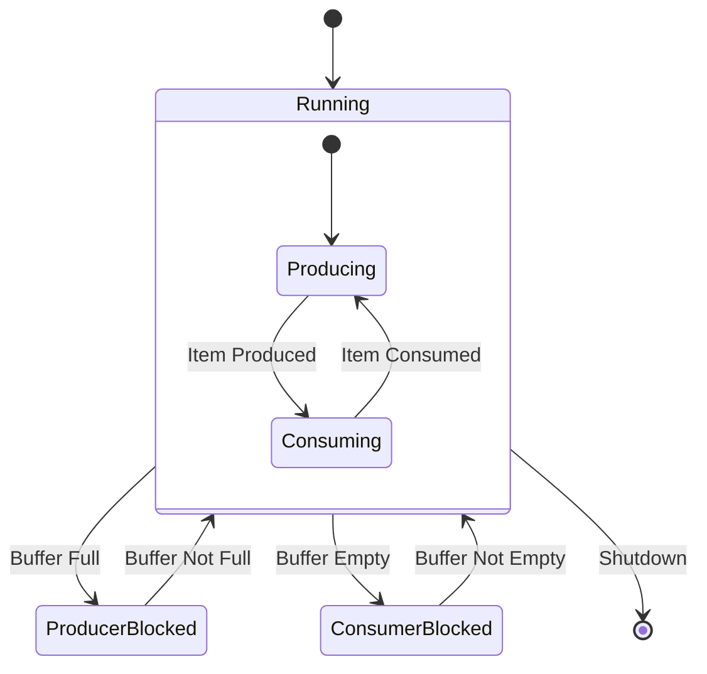
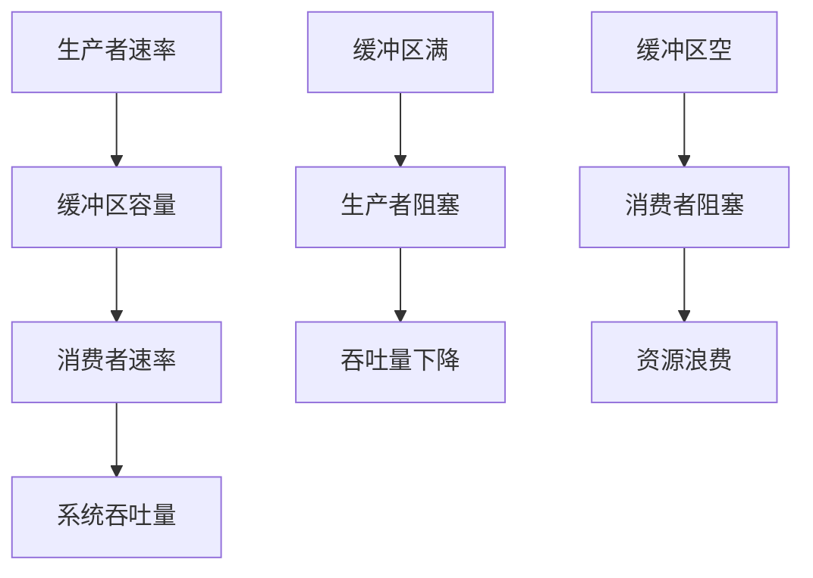

# 04-生产者-消费者模式 (Producer-Consumer Pattern)

## 1. 形式化定义

### 1.1 数学定义

设 $P$ 为生产者集合，$C$ 为消费者集合，$B$ 为缓冲区，$Q$ 为队列，生产者-消费者模式满足以下公理：

**生产者-消费者公理**：
- **生产者约束**: $\forall p \in P: \text{produce}(p, item) \Rightarrow \text{enqueue}(item, Q)$
- **消费者约束**: $\forall c \in C: \text{consume}(c) \Rightarrow \text{dequeue}(item, Q)$
- **缓冲区约束**: $0 \leq |Q| \leq \text{capacity}(B)$
- **同步约束**: $\text{empty}(Q) \Rightarrow \text{block}(C) \land \text{full}(Q) \Rightarrow \text{block}(P)$

**形式化约束**：
- **互斥访问**: $\text{access}(Q) \Rightarrow \text{mutex\_protected}$
- **条件同步**: $\text{not\_empty}(Q) \Rightarrow \text{wakeup}(C) \land \text{not\_full}(Q) \Rightarrow \text{wakeup}(P)$
- **数据完整性**: $\text{produce}(item) \land \text{consume}(item) \Rightarrow \text{data\_preserved}(item)$

### 1.2 类型理论定义

```go
// 生产者接口定义
type Producer interface {
    Produce(ctx context.Context) (interface{}, error)
    GetID() string
    GetRate() int // 生产速率
}

// 消费者接口定义
type Consumer interface {
    Consume(ctx context.Context, item interface{}) error
    GetID() string
    GetRate() int // 消费速率
}

// 缓冲区接口定义
type Buffer interface {
    Put(item interface{}) error
    Get() (interface{}, error)
    Size() int
    Capacity() int
    IsEmpty() bool
    IsFull() bool
}

// 数据项定义
type DataItem struct {
    ID        string
    Data      interface{}
    Timestamp time.Time
    Priority  int
}
```

## 2. 实现原理

### 2.1 生产者-消费者状态机



### 2.2 同步机制分析

**定理**: 生产者-消费者模式保证数据完整性和系统稳定性。

**证明**:

1. **数据完整性证明**:
   - 使用互斥锁保护缓冲区访问
   - 条件变量确保正确的同步
   - 原子操作保证数据一致性

2. **死锁避免证明**:
   - 生产者等待缓冲区非满
   - 消费者等待缓冲区非空
   - 条件变量避免虚假唤醒

## 3. Go语言实现

### 3.1 基础生产者-消费者实现

```go
package producerconsumer

import (
    "context"
    "fmt"
    "sync"
    "time"
)

// DataItem 数据项
type DataItem struct {
    ID        string
    Data      interface{}
    Timestamp time.Time
    Priority  int
}

// Buffer 缓冲区实现
type Buffer struct {
    items    []interface{}
    capacity int
    size     int
    in       int
    out      int
    mutex    sync.Mutex
    notEmpty *sync.Cond
    notFull  *sync.Cond
}

// NewBuffer 创建新的缓冲区
func NewBuffer(capacity int) *Buffer {
    if capacity <= 0 {
        capacity = 10
    }
    
    buffer := &Buffer{
        items:    make([]interface{}, capacity),
        capacity: capacity,
    }
    
    buffer.notEmpty = sync.NewCond(&buffer.mutex)
    buffer.notFull = sync.NewCond(&buffer.mutex)
    
    return buffer
}

// Put 放入数据项
func (b *Buffer) Put(item interface{}) error {
    b.mutex.Lock()
    defer b.mutex.Unlock()
    
    // 等待缓冲区非满
    for b.size >= b.capacity {
        b.notFull.Wait()
    }
    
    // 放入数据项
    b.items[b.in] = item
    b.in = (b.in + 1) % b.capacity
    b.size++
    
    // 通知消费者
    b.notEmpty.Signal()
    
    return nil
}

// Get 获取数据项
func (b *Buffer) Get() (interface{}, error) {
    b.mutex.Lock()
    defer b.mutex.Unlock()
    
    // 等待缓冲区非空
    for b.size <= 0 {
        b.notEmpty.Wait()
    }
    
    // 获取数据项
    item := b.items[b.out]
    b.out = (b.out + 1) % b.capacity
    b.size--
    
    // 通知生产者
    b.notFull.Signal()
    
    return item, nil
}

// Size 获取当前大小
func (b *Buffer) Size() int {
    b.mutex.Lock()
    defer b.mutex.Unlock()
    return b.size
}

// Capacity 获取容量
func (b *Buffer) Capacity() int {
    return b.capacity
}

// IsEmpty 检查是否为空
func (b *Buffer) IsEmpty() bool {
    b.mutex.Lock()
    defer b.mutex.Unlock()
    return b.size == 0
}

// IsFull 检查是否已满
func (b *Buffer) IsFull() bool {
    b.mutex.Lock()
    defer b.mutex.Unlock()
    return b.size >= b.capacity
}

// Producer 生产者实现
type Producer struct {
    ID       string
    Rate     int // 每秒生产数量
    Buffer   *Buffer
    ctx      context.Context
    cancel   context.CancelFunc
    wg       *sync.WaitGroup
}

// NewProducer 创建新的生产者
func NewProducer(id string, rate int, buffer *Buffer) *Producer {
    ctx, cancel := context.WithCancel(context.Background())
    return &Producer{
        ID:     id,
        Rate:   rate,
        Buffer: buffer,
        ctx:    ctx,
        cancel: cancel,
    }
}

// Start 启动生产者
func (p *Producer) Start(wg *sync.WaitGroup) {
    p.wg = wg
    p.wg.Add(1)
    
    go func() {
        defer p.wg.Done()
        
        interval := time.Duration(1000/p.Rate) * time.Millisecond
        ticker := time.NewTicker(interval)
        defer ticker.Stop()
        
        for {
            select {
            case <-p.ctx.Done():
                fmt.Printf("Producer %s stopped\n", p.ID)
                return
            case <-ticker.C:
                if err := p.produce(); err != nil {
                    fmt.Printf("Producer %s error: %v\n", p.ID, err)
                }
            }
        }
    }()
}

// produce 生产数据项
func (p *Producer) produce() error {
    item := &DataItem{
        ID:        fmt.Sprintf("%s-%d", p.ID, time.Now().UnixNano()),
        Data:      fmt.Sprintf("Data from %s", p.ID),
        Timestamp: time.Now(),
        Priority:  int(time.Now().UnixNano() % 10),
    }
    
    if err := p.Buffer.Put(item); err != nil {
        return fmt.Errorf("failed to put item: %w", err)
    }
    
    fmt.Printf("Producer %s produced: %s\n", p.ID, item.ID)
    return nil
}

// Stop 停止生产者
func (p *Producer) Stop() {
    p.cancel()
}

// Consumer 消费者实现
type Consumer struct {
    ID       string
    Rate     int // 每秒消费数量
    Buffer   *Buffer
    ctx      context.Context
    cancel   context.CancelFunc
    wg       *sync.WaitGroup
}

// NewConsumer 创建新的消费者
func NewConsumer(id string, rate int, buffer *Buffer) *Consumer {
    ctx, cancel := context.WithCancel(context.Background())
    return &Consumer{
        ID:     id,
        Rate:   rate,
        Buffer: buffer,
        ctx:    ctx,
        cancel: cancel,
    }
}

// Start 启动消费者
func (c *Consumer) Start(wg *sync.WaitGroup) {
    c.wg = wg
    c.wg.Add(1)
    
    go func() {
        defer c.wg.Done()
        
        interval := time.Duration(1000/c.Rate) * time.Millisecond
        ticker := time.NewTicker(interval)
        defer ticker.Stop()
        
        for {
            select {
            case <-c.ctx.Done():
                fmt.Printf("Consumer %s stopped\n", c.ID)
                return
            case <-ticker.C:
                if err := c.consume(); err != nil {
                    fmt.Printf("Consumer %s error: %v\n", c.ID, err)
                }
            }
        }
    }()
}

// consume 消费数据项
func (c *Consumer) consume() error {
    item, err := c.Buffer.Get()
    if err != nil {
        return fmt.Errorf("failed to get item: %w", err)
    }
    
    dataItem := item.(*DataItem)
    fmt.Printf("Consumer %s consumed: %s\n", c.ID, dataItem.ID)
    
    // 模拟处理时间
    time.Sleep(50 * time.Millisecond)
    
    return nil
}

// Stop 停止消费者
func (c *Consumer) Stop() {
    c.cancel()
}
```

### 3.2 高级生产者-消费者实现（带优先级和监控）

```go
// PriorityBuffer 优先级缓冲区
type PriorityBuffer struct {
    buffers map[int]*Buffer
    priorities []int
    mutex sync.RWMutex
}

// NewPriorityBuffer 创建优先级缓冲区
func NewPriorityBuffer(capacity int, priorities []int) *PriorityBuffer {
    pb := &PriorityBuffer{
        buffers: make(map[int]*Buffer),
        priorities: priorities,
    }
    
    for _, priority := range priorities {
        pb.buffers[priority] = NewBuffer(capacity)
    }
    
    return pb
}

// Put 放入优先级数据项
func (pb *PriorityBuffer) Put(item *DataItem) error {
    pb.mutex.RLock()
    buffer, exists := pb.buffers[item.Priority]
    pb.mutex.RUnlock()
    
    if !exists {
        return fmt.Errorf("invalid priority: %d", item.Priority)
    }
    
    return buffer.Put(item)
}

// Get 获取最高优先级数据项
func (pb *PriorityBuffer) Get() (interface{}, error) {
    pb.mutex.RLock()
    defer pb.mutex.RUnlock()
    
    // 按优先级顺序查找
    for _, priority := range pb.priorities {
        buffer := pb.buffers[priority]
        if !buffer.IsEmpty() {
            return buffer.Get()
        }
    }
    
    // 所有缓冲区都为空，等待
    return pb.buffers[pb.priorities[0]].Get()
}

// ProducerConsumerSystem 生产者-消费者系统
type ProducerConsumerSystem struct {
    Buffer     Buffer
    Producers  []*Producer
    Consumers  []*Consumer
    ctx        context.Context
    cancel     context.CancelFunc
    wg         sync.WaitGroup
    metrics    *SystemMetrics
}

// SystemMetrics 系统指标
type SystemMetrics struct {
    ProducedItems int64
    ConsumedItems int64
    BufferSize    int
    ActiveProducers int
    ActiveConsumers int
    mutex         sync.RWMutex
}

// NewProducerConsumerSystem 创建生产者-消费者系统
func NewProducerConsumerSystem(bufferSize, producerCount, consumerCount int) *ProducerConsumerSystem {
    ctx, cancel := context.WithCancel(context.Background())
    
    return &ProducerConsumerSystem{
        Buffer:  *NewBuffer(bufferSize),
        ctx:     ctx,
        cancel:  cancel,
        metrics: &SystemMetrics{},
    }
}

// AddProducer 添加生产者
func (pcs *ProducerConsumerSystem) AddProducer(id string, rate int) {
    producer := NewProducer(id, rate, &pcs.Buffer)
    pcs.Producers = append(pcs.Producers, producer)
    producer.Start(&pcs.wg)
}

// AddConsumer 添加消费者
func (pcs *ProducerConsumerSystem) AddConsumer(id string, rate int) {
    consumer := NewConsumer(id, rate, &pcs.Buffer)
    pcs.Consumers = append(pcs.Consumers, consumer)
    consumer.Start(&pcs.wg)
}

// Start 启动系统
func (pcs *ProducerConsumerSystem) Start() {
    fmt.Printf("Starting Producer-Consumer System\n")
    fmt.Printf("Buffer capacity: %d\n", pcs.Buffer.Capacity())
    fmt.Printf("Producers: %d\n", len(pcs.Producers))
    fmt.Printf("Consumers: %d\n", len(pcs.Consumers))
}

// Stop 停止系统
func (pcs *ProducerConsumerSystem) Stop() {
    fmt.Printf("Stopping Producer-Consumer System\n")
    
    pcs.cancel()
    
    // 停止所有生产者
    for _, producer := range pcs.Producers {
        producer.Stop()
    }
    
    // 停止所有消费者
    for _, consumer := range pcs.Consumers {
        consumer.Stop()
    }
    
    // 等待所有goroutine完成
    pcs.wg.Wait()
    
    fmt.Printf("Producer-Consumer System stopped\n")
}

// GetMetrics 获取系统指标
func (pcs *ProducerConsumerSystem) GetMetrics() SystemMetrics {
    pcs.metrics.mutex.RLock()
    defer pcs.metrics.mutex.RUnlock()
    
    metrics := *pcs.metrics
    metrics.BufferSize = pcs.Buffer.Size()
    metrics.ActiveProducers = len(pcs.Producers)
    metrics.ActiveConsumers = len(pcs.Consumers)
    
    return metrics
}
```

## 4. 使用示例

### 4.1 基础使用

```go
package main

import (
    "fmt"
    "sync"
    "time"
    
    "github.com/your-project/producerconsumer"
)

func main() {
    // 创建生产者-消费者系统
    system := producerconsumer.NewProducerConsumerSystem(10, 3, 2)
    
    // 添加生产者
    system.AddProducer("producer-1", 5)  // 每秒5个
    system.AddProducer("producer-2", 3)  // 每秒3个
    system.AddProducer("producer-3", 2)  // 每秒2个
    
    // 添加消费者
    system.AddConsumer("consumer-1", 4)  // 每秒4个
    system.AddConsumer("consumer-2", 6)  // 每秒6个
    
    // 启动系统
    system.Start()
    
    // 运行一段时间
    time.Sleep(10 * time.Second)
    
    // 停止系统
    system.Stop()
    
    // 打印最终指标
    metrics := system.GetMetrics()
    fmt.Printf("Final metrics: %+v\n", metrics)
}
```

### 4.2 优先级处理

```go
// 优先级生产者-消费者示例
func priorityExample() {
    // 创建优先级缓冲区
    priorities := []int{1, 2, 3} // 1=高优先级, 2=中优先级, 3=低优先级
    buffer := producerconsumer.NewPriorityBuffer(20, priorities)
    
    var wg sync.WaitGroup
    
    // 启动生产者
    for i := 0; i < 3; i++ {
        wg.Add(1)
        go func(id int) {
            defer wg.Done()
            
            for j := 0; j < 10; j++ {
                priority := (j % 3) + 1
                item := &producerconsumer.DataItem{
                    ID:        fmt.Sprintf("item-%d-%d", id, j),
                    Data:      fmt.Sprintf("Data from producer %d", id),
                    Timestamp: time.Now(),
                    Priority:  priority,
                }
                
                if err := buffer.Put(item); err != nil {
                    fmt.Printf("Failed to put item: %v\n", err)
                }
                
                time.Sleep(100 * time.Millisecond)
            }
        }(i)
    }
    
    // 启动消费者
    for i := 0; i < 2; i++ {
        wg.Add(1)
        go func(id int) {
            defer wg.Done()
            
            for j := 0; j < 15; j++ {
                item, err := buffer.Get()
                if err != nil {
                    fmt.Printf("Failed to get item: %v\n", err)
                    continue
                }
                
                dataItem := item.(*producerconsumer.DataItem)
                fmt.Printf("Consumer %d consumed priority %d item: %s\n", 
                    id, dataItem.Priority, dataItem.ID)
                
                time.Sleep(50 * time.Millisecond)
            }
        }(i)
    }
    
    wg.Wait()
}
```

### 4.3 带监控的系统

```go
// 带监控的生产者-消费者系统
func monitoredExample() {
    system := producerconsumer.NewProducerConsumerSystem(15, 2, 3)
    
    // 添加生产者和消费者
    system.AddProducer("fast-producer", 10)
    system.AddProducer("slow-producer", 2)
    system.AddConsumer("fast-consumer", 8)
    system.AddConsumer("medium-consumer", 3)
    system.AddConsumer("slow-consumer", 1)
    
    system.Start()
    
    // 监控系统
    go func() {
        ticker := time.NewTicker(1 * time.Second)
        defer ticker.Stop()
        
        for {
            select {
            case <-ticker.C:
                metrics := system.GetMetrics()
                fmt.Printf("Metrics: Buffer=%d/%d, Produced=%d, Consumed=%d\n",
                    metrics.BufferSize, system.Buffer.Capacity(),
                    metrics.ProducedItems, metrics.ConsumedItems)
            }
        }
    }()
    
    time.Sleep(15 * time.Second)
    system.Stop()
}
```

## 5. 性能分析

### 5.1 时间复杂度

| 操作 | 时间复杂度 | 说明 |
|------|------------|------|
| 生产 | O(1) | 直接入队 |
| 消费 | O(1) | 直接出队 |
| 优先级查找 | O(p) | p为优先级数量 |
| 系统启动 | O(n+m) | n个生产者，m个消费者 |

### 5.2 空间复杂度

- **基础缓冲区**: O(capacity)
- **优先级缓冲区**: O(capacity × priorityLevels)
- **系统开销**: O(producers + consumers)

### 5.3 吞吐量分析



## 6. 最佳实践

### 6.1 缓冲区大小配置

```go
// 缓冲区大小计算
func calculateBufferSize(producerRate, consumerRate, targetLatency int) int {
    // 基于Little's Law: L = λW
    // L = 缓冲区大小, λ = 到达率, W = 等待时间
    arrivalRate := producerRate
    serviceRate := consumerRate
    
    if arrivalRate >= serviceRate {
        // 系统不稳定，需要更大的缓冲区
        return arrivalRate * targetLatency / 1000
    }
    
    // 系统稳定，缓冲区可以较小
    return max(10, arrivalRate/10)
}
```

### 6.2 背压处理

```go
// 背压处理策略
type BackpressureStrategy interface {
    HandleBackpressure(producer *Producer) error
}

// 丢弃策略
type DropStrategy struct{}

func (d *DropStrategy) HandleBackpressure(producer *Producer) error {
    // 丢弃新数据项
    return fmt.Errorf("buffer full, dropping item")
}

// 阻塞策略
type BlockStrategy struct{}

func (b *BlockStrategy) HandleBackpressure(producer *Producer) error {
    // 阻塞生产者
    return producer.Buffer.Put(nil) // 会阻塞直到有空间
}
```

### 6.3 错误恢复

```go
// 错误恢复机制
func (p *Producer) produceWithRecovery() error {
    defer func() {
        if r := recover(); r != nil {
            fmt.Printf("Producer %s recovered from panic: %v\n", p.ID, r)
        }
    }()
    
    return p.produce()
}

func (c *Consumer) consumeWithRecovery() error {
    defer func() {
        if r := recover(); r != nil {
            fmt.Printf("Consumer %s recovered from panic: %v\n", c.ID, r)
        }
    }()
    
    return c.consume()
}
```

## 7. 与其他模式的比较

| 模式 | 适用场景 | 复杂度 | 性能 |
|------|----------|--------|------|
| 生产者-消费者 | 异步处理 | 中等 | 高 |
| 发布-订阅 | 一对多通信 | 高 | 中等 |
| 消息队列 | 分布式系统 | 高 | 中等 |
| 管道 | 流式处理 | 低 | 高 |

## 8. 总结

生产者-消费者模式是并发编程中的基础模式，通过缓冲区和同步机制实现了高效的数据处理流水线。在Go语言中，我们可以使用channel和goroutine来优雅地实现这个模式。

**关键优势**:
- 解耦生产者和消费者
- 控制并发度
- 提供缓冲能力
- 支持优先级处理

**适用场景**:
- 数据处理流水线
- 日志处理系统
- 图像/视频处理
- 实时数据流处理 