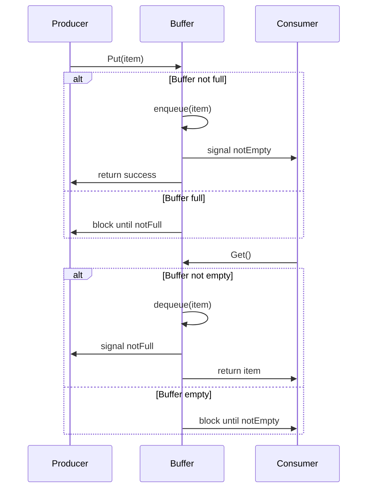

# 04-生产者-消费者模式 (Producer-Consumer Pattern)

## 目录

- [04-生产者-消费者模式 (Producer-Consumer Pattern)](#04-生产者-消费者模式-producer-consumer-pattern)
  - [目录](#目录)
  - [1. 概述](#1-概述)
    - [1.1 定义](#11-定义)
    - [1.2 核心思想](#12-核心思想)
    - [1.3 设计目标](#13-设计目标)
  - [2. 形式化定义](#2-形式化定义)
    - [2.1 基本概念](#21-基本概念)
    - [2.2 操作语义](#22-操作语义)
    - [2.3 同步约束](#23-同步约束)
  - [3. 数学基础](#3-数学基础)
    - [3.1 队列理论](#31-队列理论)
    - [3.2 性能分析](#32-性能分析)
  - [4. 模式结构](#4-模式结构)
    - [4.1 类图](#41-类图)
    - [4.2 时序图](#42-时序图)
  - [5. Go语言实现](#5-go语言实现)
    - [5.1 基础实现](#51-基础实现)
    - [5.2 泛型实现](#52-泛型实现)
    - [5.3 实际应用示例](#53-实际应用示例)
  - [6. 性能分析](#6-性能分析)
    - [6.1 时间复杂度](#61-时间复杂度)
    - [6.2 空间复杂度](#62-空间复杂度)
    - [6.3 性能优化建议](#63-性能优化建议)
  - [7. 应用场景](#7-应用场景)
    - [7.1 适用场景](#71-适用场景)
    - [7.2 使用示例](#72-使用示例)
  - [8. 优缺点分析](#8-优缺点分析)
    - [8.1 优点](#81-优点)
    - [8.2 缺点](#82-缺点)
    - [8.3 权衡考虑](#83-权衡考虑)
  - [9. 相关模式](#9-相关模式)
    - [9.1 模式关系](#91-模式关系)
    - [9.2 模式组合](#92-模式组合)
  - [10. 总结](#10-总结)
    - [10.1 关键要点](#101-关键要点)
    - [10.2 最佳实践](#102-最佳实践)
    - [10.3 未来发展方向](#103-未来发展方向)

---

## 1. 概述

### 1.1 定义

生产者-消费者模式 (Producer-Consumer Pattern) 是一种并发设计模式，它通过共享的缓冲区来协调生产者和消费者之间的数据交换。生产者负责生成数据并放入缓冲区，消费者从缓冲区中取出数据进行处理。

### 1.2 核心思想

生产者-消费者模式的核心思想是：

- **解耦**: 生产者和消费者通过缓冲区解耦，互不直接依赖
- **缓冲**: 使用缓冲区平衡生产和消费速度的差异
- **同步**: 通过同步机制确保线程安全
- **流控**: 控制生产速度避免缓冲区溢出

### 1.3 设计目标

1. **解耦**: 分离生产和消费逻辑
2. **缓冲**: 平衡生产和消费速度差异
3. **并发**: 支持多个生产者和消费者
4. **安全**: 保证线程安全和数据一致性
5. **效率**: 最大化系统吞吐量

---

## 2. 形式化定义

### 2.1 基本概念

设 $P$ 为生产者集合，$C$ 为消费者集合，$B$ 为缓冲区集合，$D$ 为数据集合。

**定义 2.1** (生产者)
生产者是一个三元组 $(p, buffer, rate)$，其中：

- $p \in P$ 是生产者实例
- $buffer \in B$ 是目标缓冲区
- $rate$ 是生产速率

**定义 2.2** (消费者)
消费者是一个三元组 $(c, buffer, rate)$，其中：

- $c \in C$ 是消费者实例
- $buffer \in B$ 是源缓冲区
- $rate$ 是消费速率

**定义 2.3** (缓冲区)
缓冲区是一个四元组 $(b, capacity, items, mutex)$，其中：

- $b \in B$ 是缓冲区实例
- $capacity$ 是缓冲区容量
- $items \subseteq D$ 是缓冲区中的数据项
- $mutex$ 是互斥锁

### 2.2 操作语义

**公理 2.1** (生产操作)
对于生产者 $p$ 和数据项 $d$：
$$produce(p, d) = \begin{cases}
enqueue(buffer, d) & \text{if } |items| < capacity \\
block(p) & \text{otherwise}
\end{cases}$$

**公理 2.2** (消费操作)
对于消费者 $c$：
$$consume(c) = \begin{cases}
dequeue(buffer) & \text{if } |items| > 0 \\
block(c) & \text{otherwise}
\end{cases}$$

**公理 2.3** (缓冲区操作)
对于缓冲区 $b$ 和数据项 $d$：
$$enqueue(b, d) = acquire(mutex) \land add(items, d) \land release(mutex)$$
$$dequeue(b) = acquire(mutex) \land remove(items) \land release(mutex)$$

### 2.3 同步约束

**定义 2.4** (满缓冲区)
缓冲区满的条件：
$$full(buffer) \Leftrightarrow |items| = capacity$$

**定义 2.5** (空缓冲区)
缓冲区空的条件：
$$empty(buffer) \Leftrightarrow |items| = 0$$

**定理 2.1** (线程安全)
生产者-消费者模式保证线程安全，当且仅当：
$$\forall p_1, p_2 \in P, \forall c_1, c_2 \in C: \text{所有操作都通过互斥锁保护}$$

---

## 3. 数学基础

### 3.1 队列理论

生产者-消费者模式可以建模为M/M/1/K队列系统：

**定义 3.1** (M/M/1/K队列)
- 到达服从泊松分布，到达率为 $\lambda$ (生产速率)
- 服务时间服从指数分布，服务率为 $\mu$ (消费速率)
- 系统容量为 $K$ (缓冲区大小)
- 单服务窗口

**定理 3.1** (系统利用率)
系统利用率：
$$\rho = \frac{\lambda}{\mu}$$

**定理 3.2** (阻塞概率)
当 $\rho \neq 1$ 时，阻塞概率：
$$P_B = \frac{(1-\rho)\rho^K}{1-\rho^{K+1}}$$

**定理 3.3** (平均队列长度)
平均队列长度：
$$L = \frac{\rho}{1-\rho} - \frac{(K+1)\rho^{K+1}}{1-\rho^{K+1}}$$

### 3.2 性能分析

**定义 3.2** (吞吐量)
系统吞吐量：
$$Throughput = \lambda(1-P_B)$$

**定义 3.3** (平均等待时间)
平均等待时间：
$$W = \frac{L}{\lambda(1-P_B)}$$

**定理 3.4** (最优缓冲区大小)
对于给定的 $\lambda$ 和 $\mu$，最优缓冲区大小：
$$K_{opt} = \log_{\rho}(\frac{1}{P_{target}})$$

---

## 4. 模式结构

### 4.1 类图

```mermaid
classDiagram
    class Producer {
        -id: string
        -buffer: Buffer
        -rate: int
        +Produce(data)
        +Run()
        +Stop()
    }

    class Consumer {
        -id: string
        -buffer: Buffer
        -rate: int
        +Consume()
        +Run()
        +Stop()
    }

    class Buffer {
        -capacity: int
        -items: []interface{}
        -mutex: sync.Mutex
        -notEmpty: *sync.Cond
        -notFull: *sync.Cond
        +Put(item)
        +Get()
        +Size()
        +IsEmpty()
        +IsFull()
    }

    class DataItem {
        -id: string
        -value: interface{}
        -timestamp: time.Time
        +GetID()
        +GetValue()
        +GetTimestamp()
    }

    Producer --> Buffer
    Consumer --> Buffer
    Buffer --> DataItem
```

### 4.2 时序图



---

## 5. Go语言实现

### 5.1 基础实现

```go
package producerconsumer

import (
    "context"
    "fmt"
    "log"
    "sync"
    "time"
)

// DataItem 数据项
type DataItem struct {
    ID        string
    Value     interface{}
    Timestamp time.Time
}

// NewDataItem 创建数据项
func NewDataItem(id string, value interface{}) *DataItem {
    return &DataItem{
        ID:        id,
        Value:     value,
        Timestamp: time.Now(),
    }
}

// GetID 获取ID
func (d *DataItem) GetID() string {
    return d.ID
}

// GetValue 获取值
func (d *DataItem) GetValue() interface{} {
    return d.Value
}

// GetTimestamp 获取时间戳
func (d *DataItem) GetTimestamp() time.Time {
    return d.Timestamp
}

// Buffer 缓冲区
type Buffer struct {
    capacity int
    items    []*DataItem
    mutex    sync.Mutex
    notEmpty *sync.Cond
    notFull  *sync.Cond
}

// NewBuffer 创建缓冲区
func NewBuffer(capacity int) *Buffer {
    buffer := &Buffer{
        capacity: capacity,
        items:    make([]*DataItem, 0, capacity),
    }
    buffer.notEmpty = sync.NewCond(&buffer.mutex)
    buffer.notFull = sync.NewCond(&buffer.mutex)
    return buffer
}

// Put 放入数据项
func (b *Buffer) Put(item *DataItem) {
    b.mutex.Lock()
    defer b.mutex.Unlock()

    // 等待缓冲区有空间
    for len(b.items) >= b.capacity {
        b.notFull.Wait()
    }

    b.items = append(b.items, item)
    b.notEmpty.Signal()
}

// PutWithTimeout 带超时的放入
func (b *Buffer) PutWithTimeout(item *DataItem, timeout time.Duration) error {
    b.mutex.Lock()
    defer b.mutex.Unlock()

    // 等待缓冲区有空间，带超时
    done := make(chan struct{})
    go func() {
        for len(b.items) >= b.capacity {
            b.notFull.Wait()
        }
        close(done)
    }()

    select {
    case <-done:
        b.items = append(b.items, item)
        b.notEmpty.Signal()
        return nil
    case <-time.After(timeout):
        return context.DeadlineExceeded
    }
}

// Get 获取数据项
func (b *Buffer) Get() *DataItem {
    b.mutex.Lock()
    defer b.mutex.Unlock()

    // 等待缓冲区有数据
    for len(b.items) == 0 {
        b.notEmpty.Wait()
    }

    item := b.items[0]
    b.items = b.items[1:]
    b.notFull.Signal()
    return item
}

// GetWithTimeout 带超时的获取
func (b *Buffer) GetWithTimeout(timeout time.Duration) (*DataItem, error) {
    b.mutex.Lock()
    defer b.mutex.Unlock()

    // 等待缓冲区有数据，带超时
    done := make(chan struct{})
    go func() {
        for len(b.items) == 0 {
            b.notEmpty.Wait()
        }
        close(done)
    }()

    select {
    case <-done:
        item := b.items[0]
        b.items = b.items[1:]
        b.notFull.Signal()
        return item, nil
    case <-time.After(timeout):
        var zero *DataItem
        return zero, context.DeadlineExceeded
    }
}

// Size 获取缓冲区大小
func (b *Buffer) Size() int {
    b.mutex.Lock()
    defer b.mutex.Unlock()
    return len(b.items)
}

// IsEmpty 检查是否为空
func (b *Buffer) IsEmpty() bool {
    b.mutex.Lock()
    defer b.mutex.Unlock()
    return len(b.items) == 0
}

// IsFull 检查是否已满
func (b *Buffer) IsFull() bool {
    b.mutex.Lock()
    defer b.mutex.Unlock()
    return len(b.items) >= b.capacity
}

// Producer 生产者
type Producer struct {
    id       string
    buffer   *Buffer
    rate     time.Duration
    stopChan chan struct{}
    wg       sync.WaitGroup
}

// NewProducer 创建生产者
func NewProducer(id string, buffer *Buffer, rate time.Duration) *Producer {
    return &Producer{
        id:       id,
        buffer:   buffer,
        rate:     rate,
        stopChan: make(chan struct{}),
    }
}

// Start 启动生产者
func (p *Producer) Start() {
    p.wg.Add(1)
    go p.run()
}

// Stop 停止生产者
func (p *Producer) Stop() {
    close(p.stopChan)
    p.wg.Wait()
}

// run 运行循环
func (p *Producer) run() {
    defer p.wg.Done()

    counter := 0
    ticker := time.NewTicker(p.rate)
    defer ticker.Stop()

    for {
        select {
        case <-p.stopChan:
            return
        case <-ticker.C:
            item := NewDataItem(fmt.Sprintf("%s-%d", p.id, counter), counter)
            p.buffer.Put(item)
            log.Printf("Producer %s produced: %s", p.id, item.GetID())
            counter++
        }
    }
}

// Produce 生产单个数据项
func (p *Producer) Produce(item *DataItem) {
    p.buffer.Put(item)
    log.Printf("Producer %s produced: %s", p.id, item.GetID())
}

// Consumer 消费者
type Consumer struct {
    id       string
    buffer   *Buffer
    rate     time.Duration
    stopChan chan struct{}
    wg       sync.WaitGroup
}

// NewConsumer 创建消费者
func NewConsumer(id string, buffer *Buffer, rate time.Duration) *Consumer {
    return &Consumer{
        id:       id,
        buffer:   buffer,
        rate:     rate,
        stopChan: make(chan struct{}),
    }
}

// Start 启动消费者
func (c *Consumer) Start() {
    c.wg.Add(1)
    go c.run()
}

// Stop 停止消费者
func (c *Consumer) Stop() {
    close(c.stopChan)
    c.wg.Wait()
}

// run 运行循环
func (c *Consumer) run() {
    defer c.wg.Done()

    ticker := time.NewTicker(c.rate)
    defer ticker.Stop()

    for {
        select {
        case <-c.stopChan:
            return
        case <-ticker.C:
            item := c.buffer.Get()
            c.processItem(item)
        }
    }
}

// processItem 处理数据项
func (c *Consumer) processItem(item *DataItem) {
    log.Printf("Consumer %s consumed: %s, value: %v", c.id, item.GetID(), item.GetValue())
    // 模拟处理时间
    time.Sleep(50 * time.Millisecond)
}

// Consume 消费单个数据项
func (c *Consumer) Consume() *DataItem {
    return c.buffer.Get()
}
```

### 5.2 泛型实现

```go
package producerconsumer

import (
    "context"
    "fmt"
    "log"
    "sync"
    "time"
)

// GenericDataItem 泛型数据项
type GenericDataItem[T any] struct {
    ID        string
    Value     T
    Timestamp time.Time
}

// NewGenericDataItem 创建泛型数据项
func NewGenericDataItem[T any](id string, value T) *GenericDataItem[T] {
    return &GenericDataItem[T]{
        ID:        id,
        Value:     value,
        Timestamp: time.Now(),
    }
}

// GetID 获取ID
func (d *GenericDataItem[T]) GetID() string {
    return d.ID
}

// GetValue 获取值
func (d *GenericDataItem[T]) GetValue() T {
    return d.Value
}

// GetTimestamp 获取时间戳
func (d *GenericDataItem[T]) GetTimestamp() time.Time {
    return d.Timestamp
}

// GenericBuffer 泛型缓冲区
type GenericBuffer[T any] struct {
    capacity int
    items    []*GenericDataItem[T]
    mutex    sync.Mutex
    notEmpty *sync.Cond
    notFull  *sync.Cond
}

// NewGenericBuffer 创建泛型缓冲区
func NewGenericBuffer[T any](capacity int) *GenericBuffer[T] {
    buffer := &GenericBuffer[T]{
        capacity: capacity,
        items:    make([]*GenericDataItem[T], 0, capacity),
    }
    buffer.notEmpty = sync.NewCond(&buffer.mutex)
    buffer.notFull = sync.NewCond(&buffer.mutex)
    return buffer
}

// Put 放入数据项
func (b *GenericBuffer[T]) Put(item *GenericDataItem[T]) {
    b.mutex.Lock()
    defer b.mutex.Unlock()

    // 等待缓冲区有空间
    for len(b.items) >= b.capacity {
        b.notFull.Wait()
    }

    b.items = append(b.items, item)
    b.notEmpty.Signal()
}

// PutWithTimeout 带超时的放入
func (b *GenericBuffer[T]) PutWithTimeout(item *GenericDataItem[T], timeout time.Duration) error {
    b.mutex.Lock()
    defer b.mutex.Unlock()

    // 等待缓冲区有空间，带超时
    done := make(chan struct{})
    go func() {
        for len(b.items) >= b.capacity {
            b.notFull.Wait()
        }
        close(done)
    }()

    select {
    case <-done:
        b.items = append(b.items, item)
        b.notEmpty.Signal()
        return nil
    case <-time.After(timeout):
        return context.DeadlineExceeded
    }
}

// Get 获取数据项
func (b *GenericBuffer[T]) Get() *GenericDataItem[T] {
    b.mutex.Lock()
    defer b.mutex.Unlock()

    // 等待缓冲区有数据
    for len(b.items) == 0 {
        b.notEmpty.Wait()
    }

    item := b.items[0]
    b.items = b.items[1:]
    b.notFull.Signal()
    return item
}

// GetWithTimeout 带超时的获取
func (b *GenericBuffer[T]) GetWithTimeout(timeout time.Duration) (*GenericDataItem[T], error) {
    b.mutex.Lock()
    defer b.mutex.Unlock()

    // 等待缓冲区有数据，带超时
    done := make(chan struct{})
    go func() {
        for len(b.items) == 0 {
            b.notEmpty.Wait()
        }
        close(done)
    }()

    select {
    case <-done:
        item := b.items[0]
        b.items = b.items[1:]
        b.notFull.Signal()
        return item, nil
    case <-time.After(timeout):
        var zero *GenericDataItem[T]
        return zero, context.DeadlineExceeded
    }
}

// Size 获取缓冲区大小
func (b *GenericBuffer[T]) Size() int {
    b.mutex.Lock()
    defer b.mutex.Unlock()
    return len(b.items)
}

// IsEmpty 检查是否为空
func (b *GenericBuffer[T]) IsEmpty() bool {
    b.mutex.Lock()
    defer b.mutex.Unlock()
    return len(b.items) == 0
}

// IsFull 检查是否已满
func (b *GenericBuffer[T]) IsFull() bool {
    b.mutex.Lock()
    defer b.mutex.Unlock()
    return len(b.items) >= b.capacity
}

// GenericProducer 泛型生产者
type GenericProducer[T any] struct {
    id       string
    buffer   *GenericBuffer[T]
    rate     time.Duration
    generator func(int) T
    stopChan chan struct{}
    wg       sync.WaitGroup
}

// NewGenericProducer 创建泛型生产者
func NewGenericProducer[T any](id string, buffer *GenericBuffer[T], rate time.Duration, generator func(int) T) *GenericProducer[T] {
    return &GenericProducer[T]{
        id:        id,
        buffer:    buffer,
        rate:      rate,
        generator: generator,
        stopChan:  make(chan struct{}),
    }
}

// Start 启动生产者
func (p *GenericProducer[T]) Start() {
    p.wg.Add(1)
    go p.run()
}

// Stop 停止生产者
func (p *GenericProducer[T]) Stop() {
    close(p.stopChan)
    p.wg.Wait()
}

// run 运行循环
func (p *GenericProducer[T]) run() {
    defer p.wg.Done()

    counter := 0
    ticker := time.NewTicker(p.rate)
    defer ticker.Stop()

    for {
        select {
        case <-p.stopChan:
            return
        case <-ticker.C:
            value := p.generator(counter)
            item := NewGenericDataItem[T](fmt.Sprintf("%s-%d", p.id, counter), value)
            p.buffer.Put(item)
            log.Printf("Producer %s produced: %s", p.id, item.GetID())
            counter++
        }
    }
}

// Produce 生产单个数据项
func (p *GenericProducer[T]) Produce(item *GenericDataItem[T]) {
    p.buffer.Put(item)
    log.Printf("Producer %s produced: %s", p.id, item.GetID())
}

// GenericConsumer 泛型消费者
type GenericConsumer[T any] struct {
    id       string
    buffer   *GenericBuffer[T]
    rate     time.Duration
    processor func(*GenericDataItem[T])
    stopChan chan struct{}
    wg       sync.WaitGroup
}

// NewGenericConsumer 创建泛型消费者
func NewGenericConsumer[T any](id string, buffer *GenericBuffer[T], rate time.Duration, processor func(*GenericDataItem[T])) *GenericConsumer[T] {
    return &GenericConsumer[T]{
        id:        id,
        buffer:    buffer,
        rate:      rate,
        processor: processor,
        stopChan:  make(chan struct{}),
    }
}

// Start 启动消费者
func (c *GenericConsumer[T]) Start() {
    c.wg.Add(1)
    go c.run()
}

// Stop 停止消费者
func (c *GenericConsumer[T]) Stop() {
    close(c.stopChan)
    c.wg.Wait()
}

// run 运行循环
func (c *GenericConsumer[T]) run() {
    defer c.wg.Done()

    ticker := time.NewTicker(c.rate)
    defer ticker.Stop()

    for {
        select {
        case <-c.stopChan:
            return
        case <-ticker.C:
            item := c.buffer.Get()
            c.processor(item)
        }
    }
}

// Consume 消费单个数据项
func (c *GenericConsumer[T]) Consume() *GenericDataItem[T] {
    return c.buffer.Get()
}
```

### 5.3 实际应用示例

```go
package main

import (
    "fmt"
    "log"
    "math/rand"
    "sync"
    "time"

    "github.com/your-project/producerconsumer"
)

// LogProcessor 日志处理器
type LogProcessor struct {
    buffer   *producerconsumer.Buffer
    producer *producerconsumer.Producer
    consumer *producerconsumer.Consumer
}

// NewLogProcessor 创建日志处理器
func NewLogProcessor() *LogProcessor {
    buffer := producerconsumer.NewBuffer(100)
    producer := producerconsumer.NewProducer("log-producer", buffer, 100*time.Millisecond)
    consumer := producerconsumer.NewConsumer("log-consumer", buffer, 200*time.Millisecond)

    return &LogProcessor{
        buffer:   buffer,
        producer: producer,
        consumer: consumer,
    }
}

// Start 启动日志处理器
func (lp *LogProcessor) Start() {
    lp.producer.Start()
    lp.consumer.Start()
}

// Stop 停止日志处理器
func (lp *LogProcessor) Stop() {
    lp.producer.Stop()
    lp.consumer.Stop()
}

// AddLog 添加日志
func (lp *LogProcessor) AddLog(message string) {
    item := producerconsumer.NewDataItem(fmt.Sprintf("log-%d", rand.Int63()), message)
    lp.producer.Produce(item)
}

// ImageProcessor 图像处理器
type ImageProcessor struct {
    buffer   *producerconsumer.GenericBuffer[string]
    producer *producerconsumer.GenericProducer[string]
    consumer *producerconsumer.GenericConsumer[string]
}

// NewImageProcessor 创建图像处理器
func NewImageProcessor() *ImageProcessor {
    buffer := producerconsumer.NewGenericBuffer[string](50)

    // 生产者生成图像文件名
    producer := producerconsumer.NewGenericProducer[string](
        "image-producer",
        buffer,
        150*time.Millisecond,
        func(id int) string {
            return fmt.Sprintf("image_%d.jpg", id)
        },
    )

    // 消费者处理图像
    consumer := producerconsumer.NewGenericConsumer[string](
        "image-consumer",
        buffer,
        300*time.Millisecond,
        func(item *producerconsumer.GenericDataItem[string]) {
            log.Printf("Processing image: %s", item.GetValue())
            // 模拟图像处理
            time.Sleep(100 * time.Millisecond)
        },
    )

    return &ImageProcessor{
        buffer:   buffer,
        producer: producer,
        consumer: consumer,
    }
}

// Start 启动图像处理器
func (ip *ImageProcessor) Start() {
    ip.producer.Start()
    ip.consumer.Start()
}

// Stop 停止图像处理器
func (ip *ImageProcessor) Stop() {
    ip.producer.Stop()
    ip.consumer.Stop()
}

// AddImage 添加图像
func (ip *ImageProcessor) AddImage(filename string) {
    item := producerconsumer.NewGenericDataItem[string](fmt.Sprintf("img-%d", rand.Int63()), filename)
    ip.producer.Produce(item)
}

// DataStreamProcessor 数据流处理器
type DataStreamProcessor struct {
    buffer   *producerconsumer.GenericBuffer[int]
    producer *producerconsumer.GenericProducer[int]
    consumer *producerconsumer.GenericConsumer[int]
}

// NewDataStreamProcessor 创建数据流处理器
func NewDataStreamProcessor() *DataStreamProcessor {
    buffer := producerconsumer.NewGenericBuffer[int](200)

    // 生产者生成数据
    producer := producerconsumer.NewGenericProducer[int](
        "data-producer",
        buffer,
        50*time.Millisecond,
        func(id int) int {
            return rand.Intn(1000)
        },
    )

    // 消费者处理数据
    consumer := producerconsumer.NewGenericConsumer[int](
        "data-consumer",
        buffer,
        100*time.Millisecond,
        func(item *producerconsumer.GenericDataItem[int]) {
            value := item.GetValue()
            result := value * value // 模拟数据处理
            log.Printf("Processed data: %d -> %d", value, result)
        },
    )

    return &DataStreamProcessor{
        buffer:   buffer,
        producer: producer,
        consumer: consumer,
    }
}

// Start 启动数据流处理器
func (dsp *DataStreamProcessor) Start() {
    dsp.producer.Start()
    dsp.consumer.Start()
}

// Stop 停止数据流处理器
func (dsp *DataStreamProcessor) Stop() {
    dsp.producer.Stop()
    dsp.consumer.Stop()
}

// AddData 添加数据
func (dsp *DataStreamProcessor) AddData(value int) {
    item := producerconsumer.NewGenericDataItem[int](fmt.Sprintf("data-%d", rand.Int63()), value)
    dsp.producer.Produce(item)
}

func main() {
    // 示例1: 日志处理
    fmt.Println("=== 日志处理示例 ===")
    logProcessor := NewLogProcessor()
    logProcessor.Start()

    // 添加一些日志
    for i := 0; i < 10; i++ {
        logProcessor.AddLog(fmt.Sprintf("Log message %d", i))
        time.Sleep(50 * time.Millisecond)
    }

    time.Sleep(2 * time.Second)
    logProcessor.Stop()
    fmt.Println("日志处理完成")

    // 示例2: 图像处理
    fmt.Println("\n=== 图像处理示例 ===")
    imageProcessor := NewImageProcessor()
    imageProcessor.Start()

    // 添加一些图像
    for i := 0; i < 5; i++ {
        imageProcessor.AddImage(fmt.Sprintf("user_upload_%d.jpg", i))
        time.Sleep(100 * time.Millisecond)
    }

    time.Sleep(3 * time.Second)
    imageProcessor.Stop()
    fmt.Println("图像处理完成")

    // 示例3: 数据流处理
    fmt.Println("\n=== 数据流处理示例 ===")
    dataProcessor := NewDataStreamProcessor()
    dataProcessor.Start()

    // 添加一些数据
    for i := 0; i < 20; i++ {
        dataProcessor.AddData(rand.Intn(100))
        time.Sleep(30 * time.Millisecond)
    }

    time.Sleep(4 * time.Second)
    dataProcessor.Stop()
    fmt.Println("数据流处理完成")

    // 监控缓冲区状态
    fmt.Printf("\n=== 缓冲区状态 ===\n")
    fmt.Printf("日志处理器缓冲区大小: %d\n", logProcessor.buffer.Size())
    fmt.Printf("图像处理器缓冲区大小: %d\n", imageProcessor.buffer.Size())
    fmt.Printf("数据流处理器缓冲区大小: %d\n", dataProcessor.buffer.Size())
}
```

---

## 6. 性能分析

### 6.1 时间复杂度

- **生产操作**: $O(1)$
- **消费操作**: $O(1)$
- **缓冲区操作**: $O(1)$
- **同步操作**: $O(1)$

### 6.2 空间复杂度

- **缓冲区**: $O(capacity)$
- **生产者**: $O(1)$ 每个生产者
- **消费者**: $O(1)$ 每个消费者

### 6.3 性能优化建议

1. **缓冲区大小调优**: 根据生产和消费速率调整
2. **多生产者/消费者**: 提高并发处理能力
3. **批量处理**: 支持批量生产和消费
4. **优先级队列**: 实现优先级处理
5. **背压控制**: 实现流控机制

---

## 7. 应用场景

### 7.1 适用场景

1. **日志处理**: 异步日志收集和处理
2. **图像处理**: 批量图像处理管道
3. **数据流处理**: 实时数据处理
4. **消息队列**: 分布式消息传递
5. **事件处理**: 异步事件处理系统

### 7.2 使用示例

```go
// 文件上传处理
type FileUploadProcessor struct {
    buffer   *producerconsumer.Buffer
    producer *producerconsumer.Producer
    consumer *producerconsumer.Consumer
}

func (fup *FileUploadProcessor) HandleUpload(file *File) {
    item := producerconsumer.NewDataItem(file.Name, file)
    fup.producer.Produce(item)
}

// 数据库写入
type DatabaseWriter struct {
    buffer   *producerconsumer.GenericBuffer[*Record]
    producer *producerconsumer.GenericProducer[*Record]
    consumer *producerconsumer.GenericConsumer[*Record]
}

func (dw *DatabaseWriter) WriteRecord(record *Record) {
    item := producerconsumer.NewGenericDataItem[*Record](record.ID, record)
    dw.producer.Produce(item)
}
```

---

## 8. 优缺点分析

### 8.1 优点

1. **解耦**: 生产和消费逻辑分离
2. **缓冲**: 平衡速度差异
3. **并发**: 支持多生产者/消费者
4. **安全**: 线程安全保证
5. **可扩展**: 易于扩展和修改

### 8.2 缺点

1. **内存开销**: 需要缓冲区存储
2. **延迟**: 可能增加处理延迟
3. **复杂性**: 增加系统复杂度
4. **死锁风险**: 不当使用可能导致死锁
5. **资源竞争**: 可能产生竞争条件

### 8.3 权衡考虑

| 方面 | 直接调用 | 生产者-消费者模式 |
|------|----------|-------------------|
| 解耦 | 低 | 高 |
| 性能 | 高 | 中等 |
| 内存 | 低 | 高 |
| 复杂度 | 低 | 高 |
| 可扩展性 | 低 | 高 |

---

## 9. 相关模式

### 9.1 模式关系

- **线程池模式**: 可以用于生产者或消费者
- **管道模式**: 多个生产者-消费者串联
- **发布-订阅模式**: 一对多的生产者-消费者
- **工作窃取模式**: 可以优化任务分配

### 9.2 模式组合

```go
// 管道模式
type Pipeline struct {
    stages []*producerconsumer.Buffer
    // ...
}

// 发布-订阅模式
type PubSub struct {
    publishers  []*producerconsumer.Producer
    subscribers []*producerconsumer.Consumer
    // ...
}
```

---

## 10. 总结

生产者-消费者模式是一种重要的并发设计模式，通过缓冲区解耦生产和消费逻辑，提供高效的异步处理能力。在Go语言中，该模式可以很好地利用goroutine和channel的特性。

### 10.1 关键要点

1. **解耦**: 分离生产和消费逻辑
2. **缓冲**: 使用缓冲区平衡速度差异
3. **同步**: 通过条件变量实现同步
4. **并发**: 支持多生产者/消费者

### 10.2 最佳实践

1. **合理设置缓冲区大小**: 根据负载调整
2. **监控性能指标**: 定期监控缓冲区状态
3. **错误处理**: 正确处理超时和异常
4. **资源管理**: 正确关闭生产者和消费者
5. **负载测试**: 进行充分的负载测试

### 10.3 未来发展方向

1. **智能缓冲**: 动态调整缓冲区大小
2. **优先级支持**: 实现优先级处理
3. **分布式扩展**: 支持分布式生产者-消费者
4. **流控机制**: 实现背压控制
5. **监控集成**: 与监控系统集成

---

**参考文献**:
1. Goetz, B. (2006). Java Concurrency in Practice
2. Go Concurrency Patterns: https://golang.org/doc/effective_go.html#concurrency
3. Producer-Consumer Pattern: https://en.wikipedia.org/wiki/Producer%E2%80%93consumer_problem
4. Go sync package: https://golang.org/pkg/sync/
- 实时数据流处理
