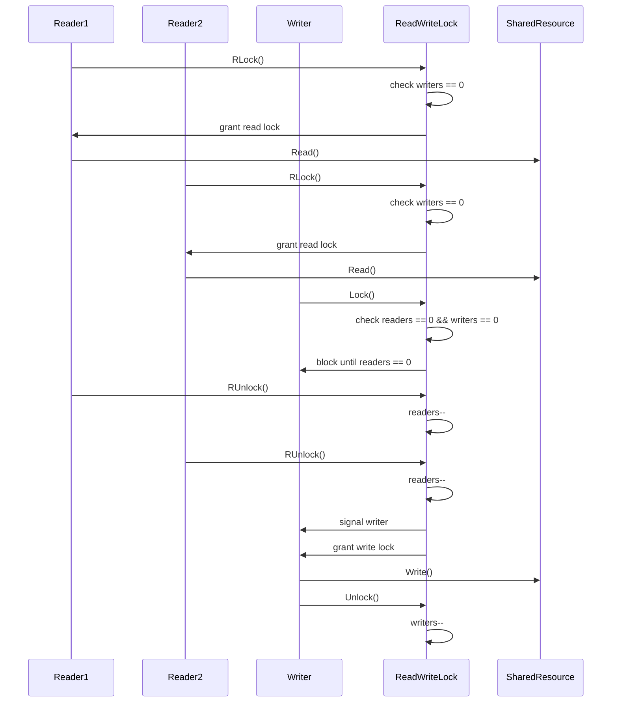

# 05-读写锁模式 (Readers-Writer Lock Pattern)

## 目录

- [05-读写锁模式 (Readers-Writer Lock Pattern)](#05-读写锁模式-readers-writer-lock-pattern)
  - [目录](#目录)
  - [1. 概述](#1-概述)
    - [1.1 定义](#11-定义)
    - [1.2 核心思想](#12-核心思想)
    - [1.3 设计目标](#13-设计目标)
  - [2. 形式化定义](#2-形式化定义)
    - [2.1 基本概念](#21-基本概念)
    - [2.2 操作语义](#22-操作语义)
    - [2.3 一致性约束](#23-一致性约束)
  - [3. 数学基础](#3-数学基础)
    - [3.1 并发理论](#31-并发理论)
    - [3.2 饥饿分析](#32-饥饿分析)
  - [4. 模式结构](#4-模式结构)
    - [4.1 类图](#41-类图)
    - [4.2 时序图](#42-时序图)
  - [5. Go语言实现](#5-go语言实现)
    - [5.1 基础实现](#51-基础实现)
    - [5.2 泛型实现](#52-泛型实现)
    - [5.3 实际应用示例](#53-实际应用示例)
  - [6. 性能分析](#6-性能分析)
    - [6.1 时间复杂度](#61-时间复杂度)
    - [6.2 空间复杂度](#62-空间复杂度)
    - [6.3 性能优化建议](#63-性能优化建议)
  - [7. 应用场景](#7-应用场景)
    - [7.1 适用场景](#71-适用场景)
    - [7.2 使用示例](#72-使用示例)
  - [8. 优缺点分析](#8-优缺点分析)
    - [8.1 优点](#81-优点)
    - [8.2 缺点](#82-缺点)
    - [8.3 权衡考虑](#83-权衡考虑)
  - [9. 相关模式](#9-相关模式)
    - [9.1 模式关系](#91-模式关系)
    - [9.2 模式组合](#92-模式组合)
  - [10. 总结](#10-总结)
    - [10.1 关键要点](#101-关键要点)
    - [10.2 最佳实践](#102-最佳实践)
    - [10.3 未来发展方向](#103-未来发展方向)

---

## 1. 概述

### 1.1 定义

读写锁模式 (Readers-Writer Lock Pattern) 是一种并发控制模式，它允许多个读者同时访问共享资源，但只允许一个写者独占访问。该模式通过区分读操作和写操作来提高并发性能，特别适用于读多写少的场景。

### 1.2 核心思想

读写锁模式的核心思想是：

- **读共享**: 多个读者可以同时访问共享资源
- **写独占**: 写者独占访问，排斥所有其他操作
- **优先级控制**: 支持读者优先或写者优先策略
- **公平性**: 避免读者或写者饥饿

### 1.3 设计目标

1. **并发性**: 允许多个读者并发访问
2. **一致性**: 保证数据读写的一致性
3. **性能**: 提高读多写少场景的性能
4. **公平性**: 避免读者或写者饥饿
5. **安全性**: 保证线程安全

---

## 2. 形式化定义

### 2.1 基本概念

设 $R$ 为读者集合，$W$ 为写者集合，$S$ 为共享资源集合，$L$ 为读写锁集合。

**定义 2.1** (读写锁)
读写锁是一个五元组 $(l, readers, writers, mutex, condition)$，其中：

- $l \in L$ 是读写锁实例
- $readers \subseteq R$ 是当前读者集合
- $writers \subseteq W$ 是当前写者集合
- $mutex$ 是互斥锁
- $condition$ 是条件变量

**定义 2.2** (读者)
读者是一个三元组 $(r, lock, state)$，其中：

- $r \in R$ 是读者实例
- $lock \in L$ 是关联的读写锁
- $state \in \{waiting, reading, finished\}$ 是读者状态

**定义 2.3** (写者)
写者是一个三元组 $(w, lock, state)$，其中：

- $w \in W$ 是写者实例
- $lock \in L$ 是关联的读写锁
- $state \in \{waiting, writing, finished\}$ 是写者状态

### 2.2 操作语义

**公理 2.1** (读锁获取)

```latex
对于读者 $r$ 和读写锁 $l$：
$$read\_lock(l, r) = \begin{cases}
acquire(mutex) \land add(readers, r) \land release(mutex) & \text{if } |writers| = 0 \\
block(r) & \text{otherwise}
\end{cases}$$
```

**公理 2.2** (读锁释放)

```latex
对于读者 $r$ 和读写锁 $l$：
$$read\_unlock(l, r) = acquire(mutex) \land remove(readers, r) \land signal(writers) \land release(mutex)$$
```

**公理 2.3** (写锁获取)

```latex
对于写者 $w$ 和读写锁 $l$：
$$write\_lock(l, w) = \begin{cases}
acquire(mutex) \land add(writers, w) \land release(mutex) & \text{if } |readers| = 0 \land |writers| = 0 \\
block(w) & \text{otherwise}
\end{cases}$$
```

**公理 2.4** (写锁释放)

```latex
对于写者 $w$ 和读写锁 $l$：
$$write\_unlock(l, w) = acquire(mutex) \land remove(writers, w) \land broadcast(readers) \land release(mutex)$$
```

### 2.3 一致性约束

**定义 2.4** (读一致性)
读一致性要求：
$$\forall r_1, r_2 \in readers: \text{可以并发执行}$$

**定义 2.5** (写一致性)
写一致性要求：
$$\forall w \in writers: \text{独占访问，排斥所有其他操作}$$

**定理 2.1** (安全性)
读写锁模式保证安全性，当且仅当：
$$\text{写者执行时，没有读者或其他写者同时执行}$$

**证明**:

1. 写锁获取时检查 $|readers| = 0 \land |writers| = 0$
2. 读锁获取时检查 $|writers| = 0$
3. 因此保证了安全性

---

## 3. 数学基础

### 3.1 并发理论

**定义 3.1** (并发度)
并发度是同时执行的读者数量：
$$concurrency = |readers|$$

**定义 3.2** (吞吐量)
系统吞吐量：
$$throughput = \frac{read\_operations + write\_operations}{time}$$

**定理 3.1** (最优并发度)
在读者优先策略下，最优并发度：
$$optimal\_concurrency = \min(|R|, \text{system\_capacity})$$

### 3.2 饥饿分析

**定义 3.3** (读者饥饿)
读者饥饿是指写者长时间无法获得锁：
$$reader\_starvation = \text{写者等待时间超过阈值}$$

**定义 3.4** (写者饥饿)
写者饥饿是指读者长时间无法获得锁：
$$writer\_starvation = \text{读者等待时间超过阈值}$$

**定理 3.2** (公平性)
读写锁模式保证公平性，当且仅当：
$$\text{不存在无限等待的读者或写者}$$

---

## 4. 模式结构

### 4.1 类图

```mermaid
classDiagram
    class ReadWriteLock {
        -readers: int
        -writers: int
        -waitingWriters: int
        -mutex: sync.Mutex
        -readCondition: *sync.Cond
        -writeCondition: *sync.Cond
        +RLock()
        +RUnlock()
        +Lock()
        +Unlock()
        +TryRLock()
        +TryLock()
    }

    class Reader {
        -id: string
        -lock: ReadWriteLock
        -state: ReaderState
        +Read()
        +AcquireReadLock()
        +ReleaseReadLock()
    }

    class Writer {
        -id: string
        -lock: ReadWriteLock
        -state: WriterState
        +Write()
        +AcquireWriteLock()
        +ReleaseWriteLock()
    }

    class SharedResource {
        -data: interface{}
        -lock: ReadWriteLock
        +Read()
        +Write()
        +GetData()
        +SetData()
    }

    ReadWriteLock --> Reader
    ReadWriteLock --> Writer
    Reader --> SharedResource
    Writer --> SharedResource
    SharedResource --> ReadWriteLock
```

### 4.2 时序图



---

## 5. Go语言实现

### 5.1 基础实现

```go
package readwritelock

import (
    "context"
    "fmt"
    "sync"
    "time"
)

// ReadWriteLock 读写锁
type ReadWriteLock struct {
    readers       int
    writers       int
    waitingWriters int
    mutex         sync.Mutex
    readCondition *sync.Cond
    writeCondition *sync.Cond
}

// NewReadWriteLock 创建读写锁
func NewReadWriteLock() *ReadWriteLock {
    lock := &ReadWriteLock{}
    lock.readCondition = sync.NewCond(&lock.mutex)
    lock.writeCondition = sync.NewCond(&lock.mutex)
    return lock
}

// RLock 获取读锁
func (rw *ReadWriteLock) RLock() {
    rw.mutex.Lock()
    defer rw.mutex.Unlock()

    // 等待写者完成
    for rw.writers > 0 || rw.waitingWriters > 0 {
        rw.readCondition.Wait()
    }

    rw.readers++
}

// RUnlock 释放读锁
func (rw *ReadWriteLock) RUnlock() {
    rw.mutex.Lock()
    defer rw.mutex.Unlock()

    rw.readers--

    // 如果没有读者了，唤醒等待的写者
    if rw.readers == 0 {
        rw.writeCondition.Signal()
    }
}

// Lock 获取写锁
func (rw *ReadWriteLock) Lock() {
    rw.mutex.Lock()
    defer rw.mutex.Unlock()

    rw.waitingWriters++

    // 等待所有读者和写者完成
    for rw.readers > 0 || rw.writers > 0 {
        rw.writeCondition.Wait()
    }

    rw.waitingWriters--
    rw.writers++
}

// Unlock 释放写锁
func (rw *ReadWriteLock) Unlock() {
    rw.mutex.Lock()
    defer rw.mutex.Unlock()

    rw.writers--

    // 优先唤醒等待的写者，否则唤醒所有读者
    if rw.waitingWriters > 0 {
        rw.writeCondition.Signal()
    } else {
        rw.readCondition.Broadcast()
    }
}

// TryRLock 尝试获取读锁
func (rw *ReadWriteLock) TryRLock() bool {
    rw.mutex.Lock()
    defer rw.mutex.Unlock()

    if rw.writers > 0 || rw.waitingWriters > 0 {
        return false
    }

    rw.readers++
    return true
}

// TryLock 尝试获取写锁
func (rw *ReadWriteLock) TryLock() bool {
    rw.mutex.Lock()
    defer rw.mutex.Unlock()

    if rw.readers > 0 || rw.writers > 0 {
        return false
    }

    rw.writers++
    return true
}

// RLockWithTimeout 带超时的读锁获取
func (rw *ReadWriteLock) RLockWithTimeout(timeout time.Duration) error {
    rw.mutex.Lock()
    defer rw.mutex.Unlock()

    // 等待写者完成，带超时
    done := make(chan struct{})
    go func() {
        for rw.writers > 0 || rw.waitingWriters > 0 {
            rw.readCondition.Wait()
        }
        close(done)
    }()

    select {
    case <-done:
        rw.readers++
        return nil
    case <-time.After(timeout):
        return context.DeadlineExceeded
    }
}

// LockWithTimeout 带超时的写锁获取
func (rw *ReadWriteLock) LockWithTimeout(timeout time.Duration) error {
    rw.mutex.Lock()
    defer rw.mutex.Unlock()

    rw.waitingWriters++

    // 等待所有读者和写者完成，带超时
    done := make(chan struct{})
    go func() {
        for rw.readers > 0 || rw.writers > 0 {
            rw.writeCondition.Wait()
        }
        close(done)
    }()

    select {
    case <-done:
        rw.waitingWriters--
        rw.writers++
        return nil
    case <-time.After(timeout):
        rw.waitingWriters--
        return context.DeadlineExceeded
    }
}

// GetStats 获取锁统计信息
func (rw *ReadWriteLock) GetStats() (readers, writers, waitingWriters int) {
    rw.mutex.Lock()
    defer rw.mutex.Unlock()
    return rw.readers, rw.writers, rw.waitingWriters
}
```

### 5.2 泛型实现

```go
package readwritelock

import (
    "context"
    "sync"
    "time"
)

// GenericReadWriteLock 泛型读写锁
type GenericReadWriteLock[T any] struct {
    readers       int
    writers       int
    waitingWriters int
    mutex         sync.RWMutex
    readCondition *sync.Cond
    writeCondition *sync.Cond
    data          T
}

// NewGenericReadWriteLock 创建泛型读写锁
func NewGenericReadWriteLock[T any](initial T) *GenericReadWriteLock[T] {
    lock := &GenericReadWriteLock[T]{
        data: initial,
    }
    lock.readCondition = sync.NewCond(&lock.mutex)
    lock.writeCondition = sync.NewCond(&lock.mutex)
    return lock
}

// RLock 获取读锁
func (rw *GenericReadWriteLock[T]) RLock() {
    rw.mutex.Lock()
    defer rw.mutex.Unlock()

    // 等待写者完成
    for rw.writers > 0 || rw.waitingWriters > 0 {
        rw.readCondition.Wait()
    }

    rw.readers++
}

// RUnlock 释放读锁
func (rw *GenericReadWriteLock[T]) RUnlock() {
    rw.mutex.Lock()
    defer rw.mutex.Unlock()

    rw.readers--

    // 如果没有读者了，唤醒等待的写者
    if rw.readers == 0 {
        rw.writeCondition.Signal()
    }
}

// Lock 获取写锁
func (rw *GenericReadWriteLock[T]) Lock() {
    rw.mutex.Lock()
    defer rw.mutex.Unlock()

    rw.waitingWriters++

    // 等待所有读者和写者完成
    for rw.readers > 0 || rw.writers > 0 {
        rw.writeCondition.Wait()
    }

    rw.waitingWriters--
    rw.writers++
}

// Unlock 释放写锁
func (rw *GenericReadWriteLock[T]) Unlock() {
    rw.mutex.Lock()
    defer rw.mutex.Unlock()

    rw.writers--

    // 优先唤醒等待的写者，否则唤醒所有读者
    if rw.waitingWriters > 0 {
        rw.writeCondition.Signal()
    } else {
        rw.readCondition.Broadcast()
    }
}

// Read 读取数据
func (rw *GenericReadWriteLock[T]) Read() T {
    rw.RLock()
    defer rw.RUnlock()
    return rw.data
}

// Write 写入数据
func (rw *GenericReadWriteLock[T]) Write(value T) {
    rw.Lock()
    defer rw.Unlock()
    rw.data = value
}

// ReadWithFunc 使用函数读取数据
func (rw *GenericReadWriteLock[T]) ReadWithFunc(fn func(T) interface{}) interface{} {
    rw.RLock()
    defer rw.RUnlock()
    return fn(rw.data)
}

// WriteWithFunc 使用函数写入数据
func (rw *GenericReadWriteLock[T]) WriteWithFunc(fn func(T) T) {
    rw.Lock()
    defer rw.Unlock()
    rw.data = fn(rw.data)
}

// TryRead 尝试读取数据
func (rw *GenericReadWriteLock[T]) TryRead() (T, bool) {
    var zero T
    if !rw.TryRLock() {
        return zero, false
    }
    defer rw.RUnlock()
    return rw.data, true
}

// TryWrite 尝试写入数据
func (rw *GenericReadWriteLock[T]) TryWrite(value T) bool {
    if !rw.TryLock() {
        return false
    }
    defer rw.Unlock()
    rw.data = value
    return true
}

// TryRLock 尝试获取读锁
func (rw *GenericReadWriteLock[T]) TryRLock() bool {
    rw.mutex.Lock()
    defer rw.mutex.Unlock()

    if rw.writers > 0 || rw.waitingWriters > 0 {
        return false
    }

    rw.readers++
    return true
}

// TryLock 尝试获取写锁
func (rw *GenericReadWriteLock[T]) TryLock() bool {
    rw.mutex.Lock()
    defer rw.mutex.Unlock()

    if rw.readers > 0 || rw.writers > 0 {
        return false
    }

    rw.writers++
    return true
}

// GetStats 获取锁统计信息
func (rw *GenericReadWriteLock[T]) GetStats() (readers, writers, waitingWriters int) {
    rw.mutex.Lock()
    defer rw.mutex.Unlock()
    return rw.readers, rw.writers, rw.waitingWriters
}
```

### 5.3 实际应用示例

```go
package main

import (
    "fmt"
    "log"
    "math/rand"
    "sync"
    "time"
)

// Cache 缓存实现
type Cache struct {
    lock *ReadWriteLock
    data map[string]interface{}
}

// NewCache 创建缓存
func NewCache() *Cache {
    return &Cache{
        lock: NewReadWriteLock(),
        data: make(map[string]interface{}),
    }
}

// Get 获取值
func (c *Cache) Get(key string) (interface{}, bool) {
    c.lock.RLock()
    defer c.lock.RUnlock()

    value, exists := c.data[key]
    return value, exists
}

// Set 设置值
func (c *Cache) Set(key string, value interface{}) {
    c.lock.Lock()
    defer c.lock.Unlock()

    c.data[key] = value
}

// Delete 删除值
func (c *Cache) Delete(key string) {
    c.lock.Lock()
    defer c.lock.Unlock()

    delete(c.data, key)
}

// Size 获取大小
func (c *Cache) Size() int {
    c.lock.RLock()
    defer c.lock.RUnlock()

    return len(c.data)
}

// ConfigManager 配置管理器
type ConfigManager struct {
    lock *GenericReadWriteLock[map[string]string]
}

// NewConfigManager 创建配置管理器
func NewConfigManager() *ConfigManager {
    return &ConfigManager{
        lock: NewGenericReadWriteLock[map[string]string](make(map[string]string)),
    }
}

// GetConfig 获取配置
func (cm *ConfigManager) GetConfig(key string) (string, bool) {
    config := cm.lock.Read()
    value, exists := config[key]
    return value, exists
}

// SetConfig 设置配置
func (cm *ConfigManager) SetConfig(key, value string) {
    cm.lock.WriteWithFunc(func(config map[string]string) map[string]string {
        newConfig := make(map[string]string)
        for k, v := range config {
            newConfig[k] = v
        }
        newConfig[key] = value
        return newConfig
    })
}

// GetAllConfig 获取所有配置
func (cm *ConfigManager) GetAllConfig() map[string]string {
    return cm.lock.Read()
}

// Database 数据库模拟
type Database struct {
    lock *ReadWriteLock
    data map[int]string
}

// NewDatabase 创建数据库
func NewDatabase() *Database {
    return &Database{
        lock: NewReadWriteLock(),
        data: make(map[int]string),
    }
}

// Read 读取数据
func (db *Database) Read(id int) (string, bool) {
    db.lock.RLock()
    defer db.lock.RUnlock()

    value, exists := db.data[id]
    return value, exists
}

// Write 写入数据
func (db *Database) Write(id int, value string) {
    db.lock.Lock()
    defer db.lock.Unlock()

    db.data[id] = value
}

// BatchRead 批量读取
func (db *Database) BatchRead(ids []int) map[int]string {
    db.lock.RLock()
    defer db.lock.RUnlock()

    result := make(map[int]string)
    for _, id := range ids {
        if value, exists := db.data[id]; exists {
            result[id] = value
        }
    }
    return result
}

// Reader 读者
type Reader struct {
    id   string
    cache *Cache
    db   *Database
    wg   *sync.WaitGroup
}

// NewReader 创建读者
func NewReader(id string, cache *Cache, db *Database, wg *sync.WaitGroup) *Reader {
    return &Reader{
        id:    id,
        cache: cache,
        db:    db,
        wg:    wg,
    }
}

// Run 运行读者
func (r *Reader) Run() {
    defer r.wg.Done()

    for i := 0; i < 10; i++ {
        key := fmt.Sprintf("key-%d", rand.Intn(100))

        // 先尝试从缓存读取
        if value, exists := r.cache.Get(key); exists {
            log.Printf("Reader %s read from cache: %s = %v", r.id, key, value)
        } else {
            // 从数据库读取
            if value, exists := r.db.Read(rand.Intn(1000)); exists {
                log.Printf("Reader %s read from DB: %d = %s", r.id, rand.Intn(1000), value)
            }
        }

        time.Sleep(time.Duration(rand.Intn(100)) * time.Millisecond)
    }
}

// Writer 写者
type Writer struct {
    id   string
    cache *Cache
    db   *Database
    wg   *sync.WaitGroup
}

// NewWriter 创建写者
func NewWriter(id string, cache *Cache, db *Database, wg *sync.WaitGroup) *Writer {
    return &Writer{
        id:    id,
        cache: cache,
        db:    db,
        wg:    wg,
    }
}

// Run 运行写者
func (w *Writer) Run() {
    defer w.wg.Done()

    for i := 0; i < 5; i++ {
        key := fmt.Sprintf("key-%d", i)
        value := fmt.Sprintf("value-%d", rand.Int63())

        // 写入缓存
        w.cache.Set(key, value)
        log.Printf("Writer %s wrote to cache: %s = %s", w.id, key, value)

        // 写入数据库
        w.db.Write(i, value)
        log.Printf("Writer %s wrote to DB: %d = %s", w.id, i, value)

        time.Sleep(time.Duration(rand.Intn(200)) * time.Millisecond)
    }
}

func main() {
    // 示例1: 缓存系统
    fmt.Println("=== 缓存系统示例 ===")
    cache := NewCache()

    // 初始化一些数据
    for i := 0; i < 10; i++ {
        cache.Set(fmt.Sprintf("key-%d", i), fmt.Sprintf("value-%d", i))
    }

    var wg sync.WaitGroup

    // 启动多个读者
    for i := 0; i < 5; i++ {
        wg.Add(1)
        reader := NewReader(fmt.Sprintf("reader-%d", i), cache, nil, &wg)
        go reader.Run()
    }

    // 启动写者
    wg.Add(1)
    writer := NewWriter("writer-1", cache, nil, &wg)
    go writer.Run()

    wg.Wait()
    fmt.Printf("缓存大小: %d\n", cache.Size())

    // 示例2: 配置管理器
    fmt.Println("\n=== 配置管理器示例 ===")
    configManager := NewConfigManager()

    // 设置一些配置
    configManager.SetConfig("database.url", "localhost:5432")
    configManager.SetConfig("redis.host", "localhost:6379")
    configManager.SetConfig("api.port", "8080")

    // 并发读取配置
    var wg2 sync.WaitGroup
    for i := 0; i < 10; i++ {
        wg2.Add(1)
        go func(id int) {
            defer wg2.Done()
            if value, exists := configManager.GetConfig("database.url"); exists {
                log.Printf("Reader %d got config: database.url = %s", id, value)
            }
            time.Sleep(time.Duration(rand.Intn(50)) * time.Millisecond)
        }(i)
    }

    // 并发更新配置
    wg2.Add(1)
    go func() {
        defer wg2.Done()
        configManager.SetConfig("database.url", "new-host:5432")
        log.Printf("Writer updated database.url")
        time.Sleep(100 * time.Millisecond)
    }()

    wg2.Wait()

    // 显示所有配置
    allConfig := configManager.GetAllConfig()
    fmt.Printf("所有配置: %v\n", allConfig)

    // 示例3: 数据库系统
    fmt.Println("\n=== 数据库系统示例 ===")
    db := NewDatabase()

    // 初始化一些数据
    for i := 0; i < 100; i++ {
        db.Write(i, fmt.Sprintf("data-%d", i))
    }

    var wg3 sync.WaitGroup

    // 启动多个读者
    for i := 0; i < 8; i++ {
        wg3.Add(1)
        reader := NewReader(fmt.Sprintf("db-reader-%d", i), nil, db, &wg3)
        go reader.Run()
    }

    // 启动写者
    wg3.Add(1)
    writer := NewWriter("db-writer-1", nil, db, &wg3)
    go writer.Run()

    wg3.Wait()

    // 监控锁统计
    fmt.Printf("\n=== 锁统计 ===\n")
    readers, writers, waitingWriters := cache.lock.GetStats()
    fmt.Printf("缓存锁 - 读者: %d, 写者: %d, 等待写者: %d\n", readers, writers, waitingWriters)

    readers, writers, waitingWriters = configManager.lock.GetStats()
    fmt.Printf("配置锁 - 读者: %d, 写者: %d, 等待写者: %d\n", readers, writers, waitingWriters)

    readers, writers, waitingWriters = db.lock.GetStats()
    fmt.Printf("数据库锁 - 读者: %d, 写者: %d, 等待写者: %d\n", readers, writers, waitingWriters)
}
```

---

## 6. 性能分析

### 6.1 时间复杂度

- **读锁获取**: $O(1)$
- **读锁释放**: $O(1)$
- **写锁获取**: $O(1)$
- **写锁释放**: $O(1)$

### 6.2 空间复杂度

- **读写锁**: $O(1)$
- **条件变量**: $O(1)$
- **等待队列**: $O(n)$，其中 $n$ 是等待的线程数

### 6.3 性能优化建议

1. **读者优先策略**: 适合读多写少的场景
2. **写者优先策略**: 适合写多读少的场景
3. **公平策略**: 避免饥饿问题
4. **批量操作**: 减少锁竞争
5. **锁分离**: 使用多个锁减少竞争

---

## 7. 应用场景

### 7.1 适用场景

1. **缓存系统**: 读多写少的缓存
2. **配置管理**: 配置的读取和更新
3. **数据库**: 数据库的读写操作
4. **文件系统**: 文件的读写访问
5. **内存数据库**: 内存中的数据结构

### 7.2 使用示例

```go
// 文档管理系统
type DocumentManager struct {
    lock *ReadWriteLock
    documents map[string]*Document
}

func (dm *DocumentManager) ReadDocument(id string) (*Document, error) {
    dm.lock.RLock()
    defer dm.lock.RUnlock()

    doc, exists := dm.documents[id]
    if !exists {
        return nil, fmt.Errorf("document not found")
    }
    return doc, nil
}

func (dm *DocumentManager) UpdateDocument(id string, content string) error {
    dm.lock.Lock()
    defer dm.lock.Unlock()

    doc, exists := dm.documents[id]
    if !exists {
        return fmt.Errorf("document not found")
    }
    doc.Content = content
    return nil
}

// 股票价格系统
type StockPriceSystem struct {
    lock *GenericReadWriteLock[map[string]float64]
}

func (sps *StockPriceSystem) GetPrice(symbol string) (float64, bool) {
    prices := sps.lock.Read()
    price, exists := prices[symbol]
    return price, exists
}

func (sps *StockPriceSystem) UpdatePrice(symbol string, price float64) {
    sps.lock.WriteWithFunc(func(prices map[string]float64) map[string]float64 {
        newPrices := make(map[string]float64)
        for k, v := range prices {
            newPrices[k] = v
        }
        newPrices[symbol] = price
        return newPrices
    })
}
```

---

## 8. 优缺点分析

### 8.1 优点

1. **高并发**: 允许多个读者并发访问
2. **性能优化**: 提高读多写少场景的性能
3. **灵活性**: 支持不同的优先级策略
4. **安全性**: 保证数据一致性
5. **可扩展性**: 易于扩展到复杂场景

### 8.2 缺点

1. **复杂性**: 比普通锁更复杂
2. **饥饿问题**: 可能出现读者或写者饥饿
3. **开销**: 比普通锁有更多开销
4. **调试困难**: 并发问题调试复杂
5. **死锁风险**: 不当使用可能导致死锁

### 8.3 权衡考虑

| 方面 | 普通锁 | 读写锁 |
|------|--------|--------|
| 并发性 | 低 | 高 |
| 复杂度 | 低 | 高 |
| 性能 | 低 | 高 |
| 安全性 | 高 | 高 |
| 调试难度 | 低 | 高 |

---

## 9. 相关模式

### 9.1 模式关系

- **互斥锁模式**: 读写锁的基础实现
- **条件变量模式**: 用于线程同步
- **管程模式**: 可以结合使用
- **信号量模式**: 可以用于控制并发度

### 9.2 模式组合

```go
// 结合信号量的读写锁
type SemaphoreReadWriteLock struct {
    readSemaphore  chan struct{}
    writeSemaphore chan struct{}
    // ...
}

// 结合管程的读写锁
type MonitorReadWriteLock struct {
    monitor *Monitor
    // ...
}
```

---

## 10. 总结

读写锁模式是一种重要的并发控制模式，通过区分读操作和写操作来提高系统性能。在Go语言中，该模式可以很好地利用sync包的特性，提供高效的并发访问控制。

### 10.1 关键要点

1. **读共享**: 多个读者可以并发访问
2. **写独占**: 写者独占访问资源
3. **优先级控制**: 支持不同的优先级策略
4. **公平性**: 避免饥饿问题

### 10.2 最佳实践

1. **选择合适的策略**: 根据场景选择读者优先或写者优先
2. **避免长时间持有锁**: 尽快释放锁
3. **监控性能指标**: 定期监控锁的使用情况
4. **错误处理**: 正确处理超时和异常
5. **测试覆盖**: 编写全面的并发测试

### 10.3 未来发展方向

1. **智能调度**: 基于负载的动态调度
2. **自适应策略**: 自动调整优先级策略
3. **分布式扩展**: 支持分布式读写锁
4. **性能优化**: 进一步优化性能
5. **监控集成**: 与监控系统集成

---

**参考文献**:

1. Goetz, B. (2006). Java Concurrency in Practice
2. Go Concurrency Patterns: <https://golang.org/doc/effective_go.html#concurrency>
3. Go sync package: <https://golang.org/pkg/sync/>
4. Readers-Writer Lock: <https://en.wikipedia.org/wiki/Readers%E2%80%93writer_lock>
