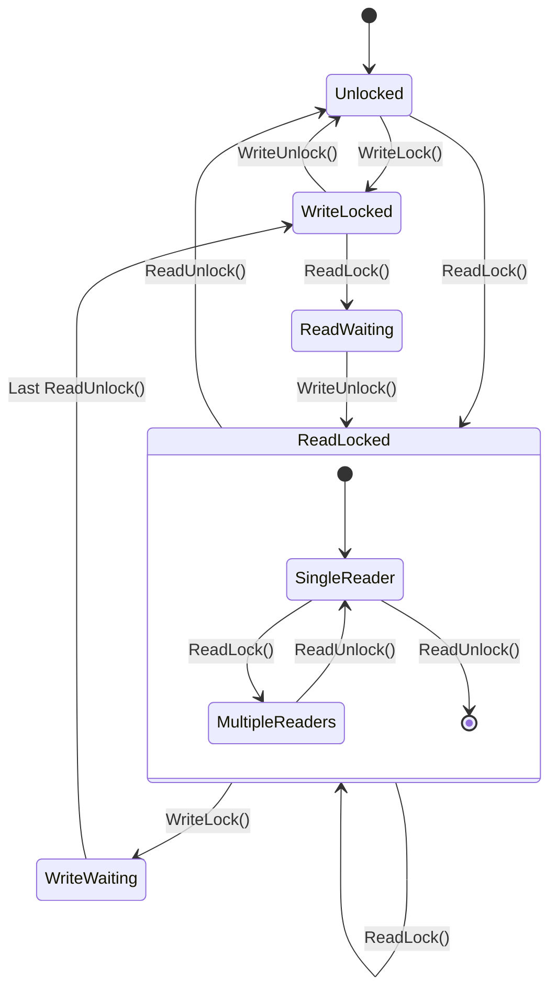
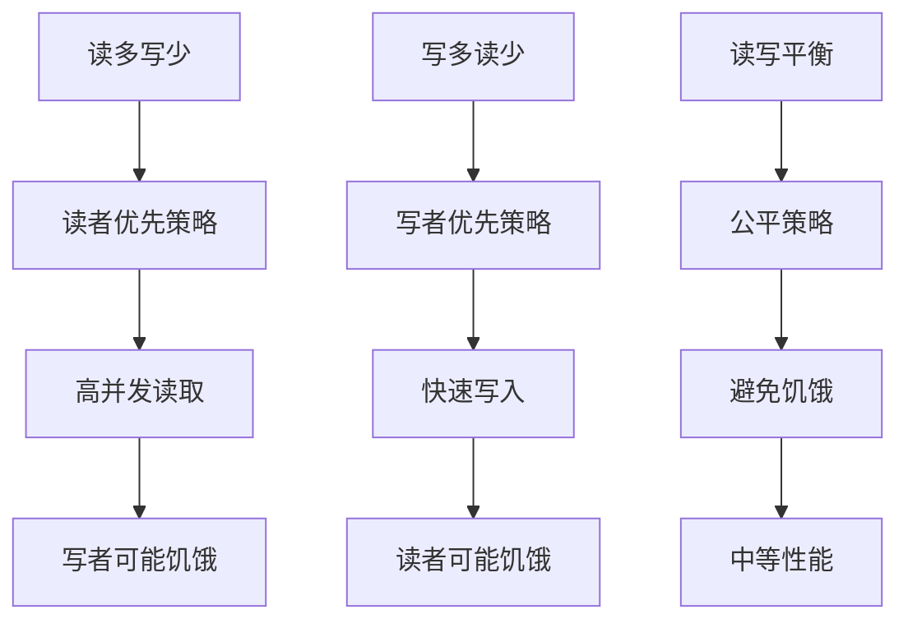

# 05-读写锁模式 (Readers-Writer Lock Pattern)

## 1. 形式化定义

### 1.1 数学定义

设 $R$ 为读者集合，$W$ 为写者集合，$L$ 为读写锁，$S$ 为共享资源，读写锁模式满足以下公理：

**读写锁公理**：
- **读者并发**: $\forall r_1, r_2 \in R: \text{read}(r_1, S) \land \text{read}(r_2, S) \Rightarrow \text{concurrent}(r_1, r_2)$
- **写者互斥**: $\forall w_1, w_2 \in W: \text{write}(w_1, S) \land \text{write}(w_2, S) \Rightarrow w_1 = w_2$
- **读写互斥**: $\forall r \in R, w \in W: \text{read}(r, S) \land \text{write}(w, S) \Rightarrow \text{false}$
- **公平性**: $\text{waiting}(w) \Rightarrow \text{prevent\_new\_readers}$

**形式化约束**：
- **读者计数**: $\text{reader\_count} \geq 0$
- **写者状态**: $\text{writer\_active} \in \{0, 1\}$
- **等待队列**: $\text{waiting\_writers} \geq 0$
- **优先级策略**: $\text{writer\_priority} \lor \text{reader\_priority}$

### 1.2 类型理论定义

```go
// 读写锁接口定义
type ReadWriteLock interface {
    ReadLock() error
    ReadUnlock() error
    WriteLock() error
    WriteUnlock() error
    TryReadLock() bool
    TryWriteLock() bool
}

// 读写锁状态定义
type LockState struct {
    ReaderCount    int
    WriterActive   bool
    WaitingWriters int
    CurrentWriter  string
}

// 锁策略定义
type LockStrategy int

const (
    ReaderPriority LockStrategy = iota
    WriterPriority
    FairStrategy
)
```

## 2. 实现原理

### 2.1 读写锁状态机



### 2.2 同步机制分析

**定理**: 读写锁模式保证数据一致性和并发性能。

**证明**:

1. **数据一致性证明**:
   - 写者互斥保证数据完整性
   - 读写互斥防止脏读
   - 原子操作保证状态一致性

2. **并发性能证明**:
   - 多个读者可以并发访问
   - 写者优先策略减少写等待时间
   - 公平策略防止饥饿

## 3. Go语言实现

### 3.1 基础读写锁实现

```go
package readwritelock

import (
    "fmt"
    "sync"
    "sync/atomic"
    "time"
)

// ReadWriteLock 读写锁实现
type ReadWriteLock struct {
    readerCount    int32
    writerActive   int32
    waitingWriters int32
    mutex          sync.Mutex
    readerCond     *sync.Cond
    writerCond     *sync.Cond
    strategy       LockStrategy
    currentWriter  string
}

// NewReadWriteLock 创建新的读写锁
func NewReadWriteLock(strategy LockStrategy) *ReadWriteLock {
    rw := &ReadWriteLock{
        strategy: strategy,
    }
    rw.readerCond = sync.NewCond(&rw.mutex)
    rw.writerCond = sync.NewCond(&rw.mutex)
    return rw
}

// ReadLock 获取读锁
func (rw *ReadWriteLock) ReadLock() error {
    rw.mutex.Lock()
    defer rw.mutex.Unlock()
    
    // 等待写者完成
    for rw.writerActive > 0 || (rw.strategy == WriterPriority && rw.waitingWriters > 0) {
        rw.readerCond.Wait()
    }
    
    atomic.AddInt32(&rw.readerCount, 1)
    return nil
}

// ReadUnlock 释放读锁
func (rw *ReadWriteLock) ReadUnlock() error {
    rw.mutex.Lock()
    defer rw.mutex.Unlock()
    
    if rw.readerCount <= 0 {
        return fmt.Errorf("no read lock to unlock")
    }
    
    atomic.AddInt32(&rw.readerCount, -1)
    
    // 如果没有读者了，唤醒等待的写者
    if rw.readerCount == 0 && rw.waitingWriters > 0 {
        rw.writerCond.Signal()
    }
    
    return nil
}

// WriteLock 获取写锁
func (rw *ReadWriteLock) WriteLock() error {
    rw.mutex.Lock()
    defer rw.mutex.Unlock()
    
    // 增加等待写者计数
    atomic.AddInt32(&rw.waitingWriters, 1)
    
    // 等待所有读者和写者完成
    for rw.readerCount > 0 || rw.writerActive > 0 {
        rw.writerCond.Wait()
    }
    
    // 减少等待写者计数
    atomic.AddInt32(&rw.waitingWriters, -1)
    
    // 设置写者活跃状态
    atomic.StoreInt32(&rw.writerActive, 1)
    rw.currentWriter = fmt.Sprintf("writer-%d", time.Now().UnixNano())
    
    return nil
}

// WriteUnlock 释放写锁
func (rw *ReadWriteLock) WriteUnlock() error {
    rw.mutex.Lock()
    defer rw.mutex.Unlock()
    
    if rw.writerActive == 0 {
        return fmt.Errorf("no write lock to unlock")
    }
    
    atomic.StoreInt32(&rw.writerActive, 0)
    rw.currentWriter = ""
    
    // 根据策略唤醒等待的进程
    if rw.strategy == ReaderPriority {
        // 读者优先：唤醒所有等待的读者
        rw.readerCond.Broadcast()
    } else {
        // 写者优先或公平策略：优先唤醒写者，否则唤醒读者
        if rw.waitingWriters > 0 {
            rw.writerCond.Signal()
        } else {
            rw.readerCond.Broadcast()
        }
    }
    
    return nil
}

// TryReadLock 尝试获取读锁
func (rw *ReadWriteLock) TryReadLock() bool {
    rw.mutex.Lock()
    defer rw.mutex.Unlock()
    
    if rw.writerActive > 0 || (rw.strategy == WriterPriority && rw.waitingWriters > 0) {
        return false
    }
    
    atomic.AddInt32(&rw.readerCount, 1)
    return true
}

// TryWriteLock 尝试获取写锁
func (rw *ReadWriteLock) TryWriteLock() bool {
    rw.mutex.Lock()
    defer rw.mutex.Unlock()
    
    if rw.readerCount > 0 || rw.writerActive > 0 {
        return false
    }
    
    atomic.StoreInt32(&rw.writerActive, 1)
    rw.currentWriter = fmt.Sprintf("writer-%d", time.Now().UnixNano())
    return true
}

// GetState 获取锁状态
func (rw *ReadWriteLock) GetState() LockState {
    rw.mutex.Lock()
    defer rw.mutex.Unlock()
    
    return LockState{
        ReaderCount:    int(rw.readerCount),
        WriterActive:   rw.writerActive > 0,
        WaitingWriters: int(rw.waitingWriters),
        CurrentWriter:  rw.currentWriter,
    }
}
```

### 3.2 高级读写锁实现（带超时和统计）

```go
// TimedReadWriteLock 带超时的读写锁
type TimedReadWriteLock struct {
    *ReadWriteLock
    readTimeout  time.Duration
    writeTimeout time.Duration
}

// NewTimedReadWriteLock 创建带超时的读写锁
func NewTimedReadWriteLock(strategy LockStrategy, readTimeout, writeTimeout time.Duration) *TimedReadWriteLock {
    return &TimedReadWriteLock{
        ReadWriteLock: NewReadWriteLock(strategy),
        readTimeout:   readTimeout,
        writeTimeout:  writeTimeout,
    }
}

// ReadLockWithTimeout 带超时的读锁获取
func (trw *TimedReadWriteLock) ReadLockWithTimeout() error {
    done := make(chan error, 1)
    
    go func() {
        done <- trw.ReadLock()
    }()
    
    select {
    case err := <-done:
        return err
    case <-time.After(trw.readTimeout):
        return fmt.Errorf("read lock timeout after %v", trw.readTimeout)
    }
}

// WriteLockWithTimeout 带超时的写锁获取
func (trw *TimedReadWriteLock) WriteLockWithTimeout() error {
    done := make(chan error, 1)
    
    go func() {
        done <- trw.WriteLock()
    }()
    
    select {
    case err := <-done:
        return err
    case <-time.After(trw.writeTimeout):
        return fmt.Errorf("write lock timeout after %v", trw.writeTimeout)
    }
}

// ReadWriteLockStats 读写锁统计
type ReadWriteLockStats struct {
    TotalReadLocks   int64
    TotalWriteLocks  int64
    ReadWaitTime     time.Duration
    WriteWaitTime    time.Duration
    ReadContention   int64
    WriteContention  int64
    mutex            sync.RWMutex
}

// StatsReadWriteLock 带统计的读写锁
type StatsReadWriteLock struct {
    *ReadWriteLock
    stats *ReadWriteLockStats
}

// NewStatsReadWriteLock 创建带统计的读写锁
func NewStatsReadWriteLock(strategy LockStrategy) *StatsReadWriteLock {
    return &StatsReadWriteLock{
        ReadWriteLock: NewReadWriteLock(strategy),
        stats:         &ReadWriteLockStats{},
    }
}

// ReadLock 带统计的读锁获取
func (srw *StatsReadWriteLock) ReadLock() error {
    start := time.Now()
    
    // 检查是否有竞争
    if srw.GetState().WriterActive || srw.GetState().WaitingWriters > 0 {
        atomic.AddInt64(&srw.stats.ReadContention, 1)
    }
    
    err := srw.ReadWriteLock.ReadLock()
    
    if err == nil {
        atomic.AddInt64(&srw.stats.TotalReadLocks, 1)
        srw.stats.mutex.Lock()
        srw.stats.ReadWaitTime += time.Since(start)
        srw.stats.mutex.Unlock()
    }
    
    return err
}

// WriteLock 带统计的写锁获取
func (srw *StatsReadWriteLock) WriteLock() error {
    start := time.Now()
    
    // 检查是否有竞争
    if srw.GetState().ReaderCount > 0 || srw.GetState().WriterActive {
        atomic.AddInt64(&srw.stats.WriteContention, 1)
    }
    
    err := srw.ReadWriteLock.WriteLock()
    
    if err == nil {
        atomic.AddInt64(&srw.stats.TotalWriteLocks, 1)
        srw.stats.mutex.Lock()
        srw.stats.WriteWaitTime += time.Since(start)
        srw.stats.mutex.Unlock()
    }
    
    return err
}

// GetStats 获取统计信息
func (srw *StatsReadWriteLock) GetStats() ReadWriteLockStats {
    srw.stats.mutex.RLock()
    defer srw.stats.mutex.RUnlock()
    
    return *srw.stats
}
```

## 4. 使用示例

### 4.1 基础使用

```go
package main

import (
    "fmt"
    "sync"
    "time"
    
    "github.com/your-project/readwritelock"
)

// SharedResource 共享资源
type SharedResource struct {
    data map[string]interface{}
    lock *readwritelock.ReadWriteLock
}

// NewSharedResource 创建共享资源
func NewSharedResource() *SharedResource {
    return &SharedResource{
        data: make(map[string]interface{}),
        lock: readwritelock.NewReadWriteLock(readwritelock.ReaderPriority),
    }
}

// Read 读取数据
func (sr *SharedResource) Read(key string) (interface{}, error) {
    if err := sr.lock.ReadLock(); err != nil {
        return nil, err
    }
    defer sr.lock.ReadUnlock()
    
    value, exists := sr.data[key]
    if !exists {
        return nil, fmt.Errorf("key not found: %s", key)
    }
    
    return value, nil
}

// Write 写入数据
func (sr *SharedResource) Write(key string, value interface{}) error {
    if err := sr.lock.WriteLock(); err != nil {
        return err
    }
    defer sr.lock.WriteUnlock()
    
    sr.data[key] = value
    return nil
}

// Delete 删除数据
func (sr *SharedResource) Delete(key string) error {
    if err := sr.lock.WriteLock(); err != nil {
        return err
    }
    defer sr.lock.WriteUnlock()
    
    delete(sr.data, key)
    return nil
}

// GetAll 获取所有数据
func (sr *SharedResource) GetAll() map[string]interface{} {
    if err := sr.lock.ReadLock(); err != nil {
        return nil
    }
    defer sr.lock.ReadUnlock()
    
    // 创建副本以避免外部修改
    result := make(map[string]interface{})
    for k, v := range sr.data {
        result[k] = v
    }
    
    return result
}

func main() {
    resource := NewSharedResource()
    var wg sync.WaitGroup
    
    // 启动多个读者
    for i := 0; i < 5; i++ {
        wg.Add(1)
        go func(id int) {
            defer wg.Done()
            
            for j := 0; j < 10; j++ {
                key := fmt.Sprintf("key-%d", j%3)
                value, err := resource.Read(key)
                if err != nil {
                    fmt.Printf("Reader %d: %v\n", id, err)
                } else {
                    fmt.Printf("Reader %d read %s = %v\n", id, key, value)
                }
                time.Sleep(50 * time.Millisecond)
            }
        }(i)
    }
    
    // 启动写者
    for i := 0; i < 2; i++ {
        wg.Add(1)
        go func(id int) {
            defer wg.Done()
            
            for j := 0; j < 5; j++ {
                key := fmt.Sprintf("key-%d", j)
                value := fmt.Sprintf("value-%d-%d", id, j)
                
                if err := resource.Write(key, value); err != nil {
                    fmt.Printf("Writer %d error: %v\n", id, err)
                } else {
                    fmt.Printf("Writer %d wrote %s = %s\n", id, key, value)
                }
                
                time.Sleep(200 * time.Millisecond)
            }
        }(i)
    }
    
    wg.Wait()
    
    // 打印最终状态
    fmt.Printf("Final data: %+v\n", resource.GetAll())
}
```

### 4.2 不同策略比较

```go
// 比较不同策略的性能
func compareStrategies() {
    strategies := []readwritelock.LockStrategy{
        readwritelock.ReaderPriority,
        readwritelock.WriterPriority,
        readwritelock.FairStrategy,
    }
    
    for _, strategy := range strategies {
        fmt.Printf("Testing strategy: %v\n", strategy)
        
        lock := readwritelock.NewStatsReadWriteLock(strategy)
        var wg sync.WaitGroup
        
        start := time.Now()
        
        // 启动读者
        for i := 0; i < 10; i++ {
            wg.Add(1)
            go func(id int) {
                defer wg.Done()
                
                for j := 0; j < 100; j++ {
                    lock.ReadLock()
                    time.Sleep(1 * time.Millisecond) // 模拟读取
                    lock.ReadUnlock()
                }
            }(i)
        }
        
        // 启动写者
        for i := 0; i < 2; i++ {
            wg.Add(1)
            go func(id int) {
                defer wg.Done()
                
                for j := 0; j < 20; j++ {
                    lock.WriteLock()
                    time.Sleep(5 * time.Millisecond) // 模拟写入
                    lock.WriteUnlock()
                }
            }(i)
        }
        
        wg.Wait()
        
        duration := time.Since(start)
        stats := lock.GetStats()
        
        fmt.Printf("Strategy %v completed in %v\n", strategy, duration)
        fmt.Printf("Stats: Reads=%d, Writes=%d, ReadContention=%d, WriteContention=%d\n",
            stats.TotalReadLocks, stats.TotalWriteLocks,
            stats.ReadContention, stats.WriteContention)
        fmt.Println()
    }
}
```

### 4.3 带超时的使用

```go
// 带超时的读写锁使用
func timeoutExample() {
    lock := readwritelock.NewTimedReadWriteLock(
        readwritelock.WriterPriority,
        100*time.Millisecond,  // 读锁超时
        500*time.Millisecond,  // 写锁超时
    )
    
    var wg sync.WaitGroup
    
    // 启动长时间持有写锁的进程
    wg.Add(1)
    go func() {
        defer wg.Done()
        
        fmt.Println("Writer acquiring lock...")
        if err := lock.WriteLock(); err != nil {
            fmt.Printf("Writer failed to acquire lock: %v\n", err)
            return
        }
        
        fmt.Println("Writer holding lock for 1 second...")
        time.Sleep(1 * time.Second)
        
        lock.WriteUnlock()
        fmt.Println("Writer released lock")
    }()
    
    // 启动尝试获取读锁的进程
    wg.Add(1)
    go func() {
        defer wg.Done()
        
        time.Sleep(100 * time.Millisecond) // 等待写者获取锁
        
        fmt.Println("Reader attempting to acquire lock...")
        if err := lock.ReadLockWithTimeout(); err != nil {
            fmt.Printf("Reader timeout: %v\n", err)
        } else {
            fmt.Println("Reader acquired lock")
            lock.ReadUnlock()
        }
    }()
    
    wg.Wait()
}
```

## 5. 性能分析

### 5.1 时间复杂度

| 操作 | 时间复杂度 | 说明 |
|------|------------|------|
| 读锁获取 | O(1) | 直接获取 |
| 读锁释放 | O(1) | 直接释放 |
| 写锁获取 | O(n) | n为当前读者数 |
| 写锁释放 | O(1) | 直接释放 |

### 5.2 空间复杂度

- **基础读写锁**: O(1)
- **带统计的读写锁**: O(1)
- **带超时的读写锁**: O(1)

### 5.3 性能特征



## 6. 最佳实践

### 6.1 策略选择

```go
// 策略选择指南
func chooseStrategy(readRatio, writeRatio float64) readwritelock.LockStrategy {
    if readRatio > 0.8 {
        return readwritelock.ReaderPriority
    } else if writeRatio > 0.8 {
        return readwritelock.WriterPriority
    } else {
        return readwritelock.FairStrategy
    }
}

// 动态策略调整
type AdaptiveReadWriteLock struct {
    *readwritelock.ReadWriteLock
    readCount  int64
    writeCount int64
    mutex      sync.RWMutex
}

func (arl *AdaptiveReadWriteLock) adjustStrategy() {
    arl.mutex.Lock()
    defer arl.mutex.Unlock()
    
    total := arl.readCount + arl.writeCount
    if total == 0 {
        return
    }
    
    readRatio := float64(arl.readCount) / float64(total)
    // 根据比例调整策略
    // 这里需要重新创建锁，实际实现会更复杂
}
```

### 6.2 死锁避免

```go
// 避免死锁的最佳实践
func safeReadWriteLockUsage() {
    lock := readwritelock.NewReadWriteLock(readwritelock.FairStrategy)
    
    // 1. 总是成对使用
    if err := lock.ReadLock(); err != nil {
        return
    }
    defer lock.ReadUnlock() // 确保释放
    
    // 2. 避免嵌套锁
    // 错误示例：
    // lock.ReadLock()
    // lock.WriteLock() // 这会导致死锁
    
    // 3. 使用超时机制
    timedLock := readwritelock.NewTimedReadWriteLock(
        readwritelock.FairStrategy,
        1*time.Second,
        1*time.Second,
    )
    
    if err := timedLock.ReadLockWithTimeout(); err != nil {
        // 处理超时
        return
    }
    defer timedLock.ReadUnlock()
}
```

### 6.3 性能监控

```go
// 性能监控
type ReadWriteLockMonitor struct {
    lock  *readwritelock.StatsReadWriteLock
    stats chan readwritelock.ReadWriteLockStats
}

func (m *ReadWriteLockMonitor) Start() {
    go func() {
        ticker := time.NewTicker(1 * time.Second)
        defer ticker.Stop()
        
        for {
            select {
            case <-ticker.C:
                stats := m.lock.GetStats()
                m.stats <- stats
                
                // 分析性能
                if stats.ReadContention > 1000 {
                    fmt.Printf("High read contention detected: %d\n", stats.ReadContention)
                }
                if stats.WriteContention > 100 {
                    fmt.Printf("High write contention detected: %d\n", stats.WriteContention)
                }
            }
        }
    }()
}
```

## 7. 与其他模式的比较

| 模式 | 适用场景 | 复杂度 | 性能 |
|------|----------|--------|------|
| 读写锁 | 读多写少 | 中等 | 高 |
| 互斥锁 | 简单同步 | 低 | 中等 |
| 自旋锁 | 短临界区 | 低 | 高 |
| 条件变量 | 复杂同步 | 高 | 中等 |

## 8. 总结

读写锁模式是并发编程中的重要同步机制，通过区分读操作和写操作来提供更好的并发性能。在Go语言中，我们可以使用 `sync.RWMutex` 或自定义实现来支持不同的策略需求。

**关键优势**:
- 允许多个读者并发访问
- 保证写操作的互斥性
- 支持不同的优先级策略
- 提供超时和统计功能

**适用场景**:
- 读多写少的数据结构
- 缓存系统
- 配置管理
- 数据库连接池 