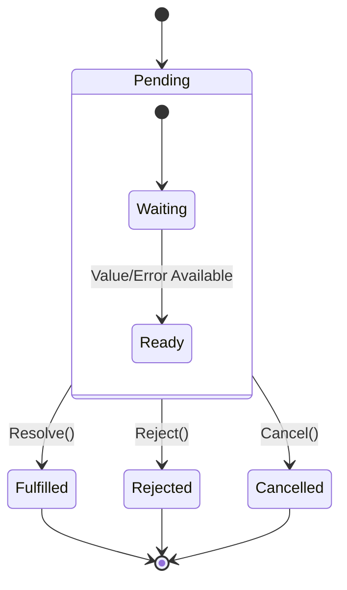
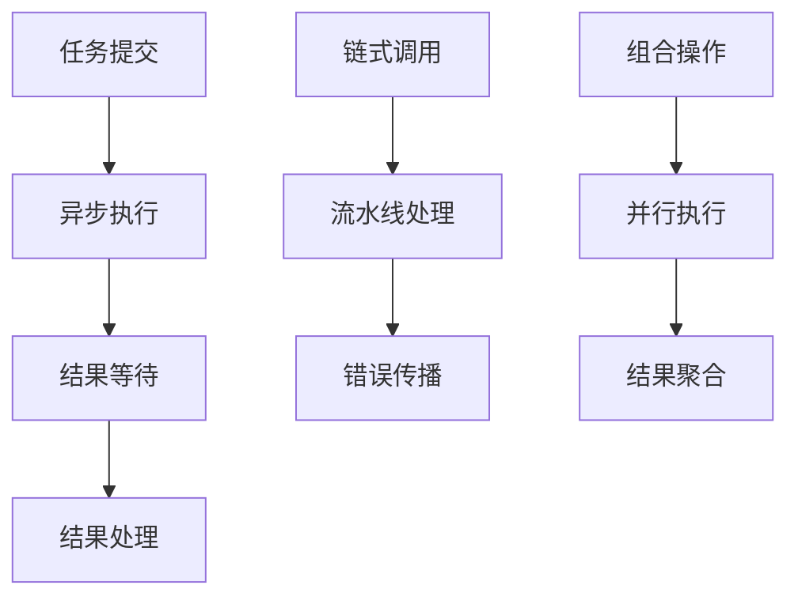

# 06-Future/Promise模式 (Future/Promise Pattern)

## 1. 形式化定义

### 1.1 数学定义

设 $F$ 为Future集合，$P$ 为Promise集合，$V$ 为值集合，$E$ 为错误集合，Future/Promise模式满足以下公理：

**Future/Promise公理**：
- **值绑定**: $\forall f \in F: \text{resolve}(f, v) \Rightarrow \text{value}(f) = v$
- **错误绑定**: $\forall f \in F: \text{reject}(f, e) \Rightarrow \text{error}(f) = e$
- **状态转换**: $\text{state}(f) \in \{\text{pending}, \text{fulfilled}, \text{rejected}\}$
- **不可变性**: $\text{fulfilled}(f) \lor \text{rejected}(f) \Rightarrow \text{immutable}(f)$

**形式化约束**：
- **状态互斥**: $\text{fulfilled}(f) \land \text{rejected}(f) \Rightarrow \text{false}$
- **链式调用**: $\text{then}(f, g) \Rightarrow \text{new\_future}(f')$
- **错误传播**: $\text{rejected}(f) \Rightarrow \text{catch}(f, h) \Rightarrow \text{handle}(e)$
- **组合性**: $\text{all}([f_1, f_2, ..., f_n]) \Rightarrow \text{combined\_future}$

### 1.2 类型理论定义

```go
// Future接口定义
type Future[T any] interface {
    Get() (T, error)
    GetWithTimeout(timeout time.Duration) (T, error)
    Then(handler func(T) (interface{}, error)) Future[interface{}]
    Catch(handler func(error) error) Future[T]
    IsDone() bool
    IsCancelled() bool
    Cancel() bool
}

// Promise接口定义
type Promise[T any] interface {
    Resolve(value T) error
    Reject(err error) error
    Future() Future[T]
    IsResolved() bool
    IsRejected() bool
}

// Future状态定义
type FutureState int

const (
    Pending FutureState = iota
    Fulfilled
    Rejected
    Cancelled
)

// Future结果定义
type FutureResult[T any] struct {
    Value T
    Error error
    State FutureState
}
```

## 2. 实现原理

### 2.1 Future状态机



### 2.2 异步执行模型

**定理**: Future/Promise模式提供非阻塞的异步执行能力。

**证明**:

1. **非阻塞证明**:
   - 使用goroutine执行异步任务
   - 通过channel进行结果传递
   - 调用者可以继续执行其他操作

2. **状态一致性证明**:
   - 使用原子操作保证状态一致性
   - 互斥锁保护状态转换
   - 条件变量实现等待机制

## 3. Go语言实现

### 3.1 基础Future/Promise实现

```go
package futurepromise

import (
    "context"
    "fmt"
    "sync"
    "sync/atomic"
    "time"
)

// Future 基础Future实现
type Future[T any] struct {
    result    *FutureResult[T]
    done      chan struct{}
    state     int32
    mutex     sync.RWMutex
    callbacks []func(FutureResult[T])
}

// NewFuture 创建新的Future
func NewFuture[T any]() *Future[T] {
    return &Future[T]{
        done:      make(chan struct{}),
        callbacks: make([]func(FutureResult[T]), 0),
    }
}

// Get 获取结果（阻塞）
func (f *Future[T]) Get() (T, error) {
    <-f.done
    f.mutex.RLock()
    defer f.mutex.RUnlock()
    
    if f.result.State == Fulfilled {
        return f.result.Value, nil
    } else if f.result.State == Rejected {
        var zero T
        return zero, f.result.Error
    } else {
        var zero T
        return zero, fmt.Errorf("future was cancelled")
    }
}

// GetWithTimeout 带超时的结果获取
func (f *Future[T]) GetWithTimeout(timeout time.Duration) (T, error) {
    select {
    case <-f.done:
        return f.Get()
    case <-time.After(timeout):
        var zero T
        return zero, fmt.Errorf("future timeout after %v", timeout)
    }
}

// Then 链式调用
func (f *Future[T]) Then(handler func(T) (interface{}, error)) Future[interface{}] {
    newFuture := NewFuture[interface{}]()
    
    go func() {
        result, err := f.Get()
        if err != nil {
            newFuture.Reject(err)
            return
        }
        
        newValue, newErr := handler(result)
        if newErr != nil {
            newFuture.Reject(newErr)
            return
        }
        
        newFuture.Resolve(newValue)
    }()
    
    return newFuture
}

// Catch 错误处理
func (f *Future[T]) Catch(handler func(error) error) Future[T] {
    newFuture := NewFuture[T]()
    
    go func() {
        result, err := f.Get()
        if err != nil {
            if handledErr := handler(err); handledErr != nil {
                newFuture.Reject(handledErr)
                return
            }
            // 错误被处理，返回零值
            var zero T
            newFuture.Resolve(zero)
            return
        }
        
        newFuture.Resolve(result)
    }()
    
    return newFuture
}

// IsDone 检查是否完成
func (f *Future[T]) IsDone() bool {
    select {
    case <-f.done:
        return true
    default:
        return false
    }
}

// IsCancelled 检查是否被取消
func (f *Future[T]) IsCancelled() bool {
    return atomic.LoadInt32(&f.state) == int32(Cancelled)
}

// Cancel 取消Future
func (f *Future[T]) Cancel() bool {
    if !atomic.CompareAndSwapInt32(&f.state, int32(Pending), int32(Cancelled)) {
        return false
    }
    
    f.mutex.Lock()
    f.result = &FutureResult[T]{
        State: Cancelled,
        Error: fmt.Errorf("future was cancelled"),
    }
    f.mutex.Unlock()
    
    close(f.done)
    return true
}

// Resolve 解析Future
func (f *Future[T]) Resolve(value T) error {
    if !atomic.CompareAndSwapInt32(&f.state, int32(Pending), int32(Fulfilled)) {
        return fmt.Errorf("future already resolved or rejected")
    }
    
    f.mutex.Lock()
    f.result = &FutureResult[T]{
        Value: value,
        State: Fulfilled,
    }
    f.mutex.Unlock()
    
    close(f.done)
    
    // 执行回调
    for _, callback := range f.callbacks {
        callback(*f.result)
    }
    
    return nil
}

// Reject 拒绝Future
func (f *Future[T]) Reject(err error) error {
    if !atomic.CompareAndSwapInt32(&f.state, int32(Pending), int32(Rejected)) {
        return fmt.Errorf("future already resolved or rejected")
    }
    
    f.mutex.Lock()
    f.result = &FutureResult[T]{
        Error: err,
        State: Rejected,
    }
    f.mutex.Unlock()
    
    close(f.done)
    
    // 执行回调
    for _, callback := range f.callbacks {
        callback(*f.result)
    }
    
    return nil
}

// AddCallback 添加回调函数
func (f *Future[T]) AddCallback(callback func(FutureResult[T])) {
    f.mutex.Lock()
    defer f.mutex.Unlock()
    
    if f.IsDone() {
        // 立即执行回调
        callback(*f.result)
    } else {
        // 添加到回调列表
        f.callbacks = append(f.callbacks, callback)
    }
}

// Promise Promise实现
type Promise[T any] struct {
    future *Future[T]
}

// NewPromise 创建新的Promise
func NewPromise[T any]() *Promise[T] {
    return &Promise[T]{
        future: NewFuture[T](),
    }
}

// Resolve 解析Promise
func (p *Promise[T]) Resolve(value T) error {
    return p.future.Resolve(value)
}

// Reject 拒绝Promise
func (p *Promise[T]) Reject(err error) error {
    return p.future.Reject(err)
}

// Future 获取Future
func (p *Promise[T]) Future() Future[T] {
    return p.future
}

// IsResolved 检查是否已解析
func (p *Promise[T]) IsResolved() bool {
    return p.future.IsDone() && !p.future.IsCancelled()
}

// IsRejected 检查是否已拒绝
func (p *Promise[T]) IsRejected() bool {
    return p.future.IsDone() && p.future.IsCancelled()
}
```

### 3.2 高级Future/Promise实现（带组合和超时）

```go
// FutureCombinator Future组合器
type FutureCombinator struct{}

// All 等待所有Future完成
func (fc *FutureCombinator) All[T any](futures []Future[T]) Future[[]T] {
    resultFuture := NewFuture[[]T]()
    
    go func() {
        results := make([]T, len(futures))
        var wg sync.WaitGroup
        var firstError error
        var errorMutex sync.Mutex
        
        for i, future := range futures {
            wg.Add(1)
            go func(index int, f Future[T]) {
                defer wg.Done()
                
                result, err := f.Get()
                if err != nil {
                    errorMutex.Lock()
                    if firstError == nil {
                        firstError = err
                    }
                    errorMutex.Unlock()
                    return
                }
                
                results[index] = result
            }(i, future)
        }
        
        wg.Wait()
        
        if firstError != nil {
            resultFuture.Reject(firstError)
        } else {
            resultFuture.Resolve(results)
        }
    }()
    
    return resultFuture
}

// Any 等待任意一个Future完成
func (fc *FutureCombinator) Any[T any](futures []Future[T]) Future[T] {
    resultFuture := NewFuture[T]()
    
    go func() {
        for _, future := range futures {
            go func(f Future[T]) {
                result, err := f.Get()
                if err == nil {
                    resultFuture.Resolve(result)
                }
            }(future)
        }
    }()
    
    return resultFuture
}

// Race 竞争模式
func (fc *FutureCombinator) Race[T any](futures []Future[T]) Future[T] {
    resultFuture := NewFuture[T]()
    
    go func() {
        for _, future := range futures {
            go func(f Future[T]) {
                result, err := f.Get()
                if err == nil {
                    resultFuture.Resolve(result)
                } else {
                    resultFuture.Reject(err)
                }
            }(future)
        }
    }()
    
    return resultFuture
}

// TimeoutFuture 带超时的Future
type TimeoutFuture[T any] struct {
    *Future[T]
    timeout time.Duration
}

// NewTimeoutFuture 创建带超时的Future
func NewTimeoutFuture[T any](timeout time.Duration) *TimeoutFuture[T] {
    tf := &TimeoutFuture[T]{
        Future:  NewFuture[T](),
        timeout: timeout,
    }
    
    // 启动超时检查
    go func() {
        select {
        case <-tf.done:
            return
        case <-time.After(timeout):
            tf.Reject(fmt.Errorf("future timeout after %v", timeout))
        }
    }()
    
    return tf
}

// RetryFuture 重试Future
type RetryFuture[T any] struct {
    *Future[T]
    maxRetries int
    retryDelay time.Duration
}

// NewRetryFuture 创建重试Future
func NewRetryFuture[T any](maxRetries int, retryDelay time.Duration) *RetryFuture[T] {
    return &RetryFuture[T]{
        Future:     NewFuture[T](),
        maxRetries: maxRetries,
        retryDelay: retryDelay,
    }
}

// ExecuteWithRetry 带重试的执行
func (rf *RetryFuture[T]) ExecuteWithRetry(operation func() (T, error)) {
    go func() {
        var lastErr error
        
        for attempt := 0; attempt <= rf.maxRetries; attempt++ {
            result, err := operation()
            if err == nil {
                rf.Resolve(result)
                return
            }
            
            lastErr = err
            if attempt < rf.maxRetries {
                time.Sleep(rf.retryDelay)
            }
        }
        
        rf.Reject(fmt.Errorf("operation failed after %d retries: %v", rf.maxRetries, lastErr))
    }()
}
```

## 4. 使用示例

### 4.1 基础使用

```go
package main

import (
    "fmt"
    "sync"
    "time"
    
    "github.com/your-project/futurepromise"
)

// 异步任务执行
func asyncTask(id int) futurepromise.Future[string] {
    promise := futurepromise.NewPromise[string]()
    
    go func() {
        // 模拟异步工作
        time.Sleep(time.Duration(id*100) * time.Millisecond)
        
        if id%3 == 0 {
            promise.Reject(fmt.Errorf("task %d failed", id))
        } else {
            promise.Resolve(fmt.Sprintf("Task %d completed", id))
        }
    }()
    
    return promise.Future()
}

func main() {
    // 创建多个异步任务
    var futures []futurepromise.Future[string]
    for i := 1; i <= 5; i++ {
        futures = append(futures, asyncTask(i))
    }
    
    // 等待所有任务完成
    combinator := &futurepromise.FutureCombinator{}
    allFuture := combinator.All(futures)
    
    results, err := allFuture.Get()
    if err != nil {
        fmt.Printf("Some tasks failed: %v\n", err)
        return
    }
    
    fmt.Printf("All tasks completed: %v\n", results)
}

// 链式调用示例
func chainExample() {
    promise := futurepromise.NewPromise[int]()
    
    // 启动异步任务
    go func() {
        time.Sleep(100 * time.Millisecond)
        promise.Resolve(42)
    }()
    
    // 链式处理
    future := promise.Future().
        Then(func(value int) (interface{}, error) {
            return value * 2, nil
        }).
        Then(func(value interface{}) (interface{}, error) {
            return fmt.Sprintf("Result: %v", value), nil
        }).
        Catch(func(err error) error {
            fmt.Printf("Error occurred: %v\n", err)
            return nil
        })
    
    result, err := future.Get()
    if err != nil {
        fmt.Printf("Chain failed: %v\n", err)
        return
    }
    
    fmt.Printf("Chain result: %v\n", result)
}
```

### 4.2 超时和重试

```go
// 超时示例
func timeoutExample() {
    // 创建带超时的Future
    timeoutFuture := futurepromise.NewTimeoutFuture[string](500 * time.Millisecond)
    
    go func() {
        // 模拟长时间运行的任务
        time.Sleep(1 * time.Second)
        timeoutFuture.Resolve("Task completed")
    }()
    
    result, err := timeoutFuture.Get()
    if err != nil {
        fmt.Printf("Task timeout: %v\n", err)
        return
    }
    
    fmt.Printf("Task result: %s\n", result)
}

// 重试示例
func retryExample() {
    retryFuture := futurepromise.NewRetryFuture[string](3, 100*time.Millisecond)
    
    attempt := 0
    retryFuture.ExecuteWithRetry(func() (string, error) {
        attempt++
        fmt.Printf("Attempt %d\n", attempt)
        
        if attempt < 3 {
            return "", fmt.Errorf("attempt %d failed", attempt)
        }
        
        return "Success after retries", nil
    })
    
    result, err := retryFuture.Get()
    if err != nil {
        fmt.Printf("All retries failed: %v\n", err)
        return
    }
    
    fmt.Printf("Retry result: %s\n", result)
}
```

### 4.3 组合模式

```go
// 组合模式示例
func combinatorExample() {
    combinator := &futurepromise.FutureCombinator{}
    
    // 创建多个任务
    var futures []futurepromise.Future[string]
    for i := 1; i <= 3; i++ {
        i := i // 捕获变量
        future := futurepromise.NewFuture[string]()
        futures = append(futures, future)
        
        go func() {
            time.Sleep(time.Duration(i*200) * time.Millisecond)
            future.Resolve(fmt.Sprintf("Task %d result", i))
        }()
    }
    
    // 等待所有完成
    allFuture := combinator.All(futures)
    allResults, err := allFuture.Get()
    if err != nil {
        fmt.Printf("All failed: %v\n", err)
    } else {
        fmt.Printf("All results: %v\n", allResults)
    }
    
    // 等待任意一个完成
    anyFuture := combinator.Any(futures)
    anyResult, err := anyFuture.Get()
    if err != nil {
        fmt.Printf("Any failed: %v\n", err)
    } else {
        fmt.Printf("Any result: %s\n", anyResult)
    }
}
```

## 5. 性能分析

### 5.1 时间复杂度

| 操作 | 时间复杂度 | 说明 |
|------|------------|------|
| Future创建 | O(1) | 直接创建 |
| 结果获取 | O(1) | 阻塞等待 |
| 链式调用 | O(1) | 异步执行 |
| 组合操作 | O(n) | n为Future数量 |

### 5.2 空间复杂度

- **基础Future**: O(1)
- **带回调的Future**: O(c)，c为回调数量
- **组合Future**: O(n)，n为组合的Future数量

### 5.3 并发性能



## 6. 最佳实践

### 6.1 错误处理

```go
// 错误处理最佳实践
func errorHandlingExample() {
    future := futurepromise.NewFuture[string]()
    
    // 添加错误处理回调
    future.AddCallback(func(result futurepromise.FutureResult[string]) {
        if result.State == futurepromise.Rejected {
            fmt.Printf("Future failed: %v\n", result.Error)
        }
    })
    
    // 链式错误处理
    future.
        Then(func(value string) (interface{}, error) {
            // 处理成功情况
            return value, nil
        }).
        Catch(func(err error) error {
            // 处理错误
            fmt.Printf("Handled error: %v\n", err)
            return nil // 返回nil表示错误已处理
        })
}
```

### 6.2 资源管理

```go
// 资源管理
func resourceManagementExample() {
    // 使用context进行取消
    ctx, cancel := context.WithTimeout(context.Background(), 5*time.Second)
    defer cancel()
    
    future := futurepromise.NewFuture[string]()
    
    go func() {
        select {
        case <-ctx.Done():
            future.Reject(ctx.Err())
        default:
            // 执行任务
            time.Sleep(1 * time.Second)
            future.Resolve("Task completed")
        }
    }()
    
    result, err := future.Get()
    if err != nil {
        fmt.Printf("Task failed: %v\n", err)
        return
    }
    
    fmt.Printf("Task result: %s\n", result)
}
```

### 6.3 性能优化

```go
// 性能优化
func performanceOptimization() {
    // 使用对象池减少内存分配
    type TaskResult struct {
        ID   int
        Data string
    }
    
    // 批量处理
    var futures []futurepromise.Future[TaskResult]
    for i := 0; i < 1000; i++ {
        future := futurepromise.NewFuture[TaskResult]()
        futures = append(futures, future)
        
        go func(id int) {
            // 模拟工作
            time.Sleep(10 * time.Millisecond)
            future.Resolve(TaskResult{ID: id, Data: fmt.Sprintf("Data %d", id)})
        }(i)
    }
    
    // 使用组合器批量处理
    combinator := &futurepromise.FutureCombinator{}
    allFuture := combinator.All(futures)
    
    results, err := allFuture.Get()
    if err != nil {
        fmt.Printf("Batch processing failed: %v\n", err)
        return
    }
    
    fmt.Printf("Processed %d tasks\n", len(results))
}
```

## 7. 与其他模式的比较

| 模式 | 适用场景 | 复杂度 | 性能 |
|------|----------|--------|------|
| Future/Promise | 异步编程 | 中等 | 高 |
| 回调函数 | 简单异步 | 低 | 高 |
| 消息传递 | 分布式 | 高 | 中等 |
| 协程 | 并发编程 | 低 | 高 |

## 8. 总结

Future/Promise模式是异步编程中的核心模式，提供了优雅的方式来处理异步操作和结果。在Go语言中，我们可以使用goroutine和channel来实现高效的Future/Promise模式。

**关键优势**:
- 非阻塞异步执行
- 链式调用支持
- 错误传播机制
- 组合操作能力

**适用场景**:
- 异步API调用
- 并行任务处理
- 事件驱动编程
- 流式数据处理 