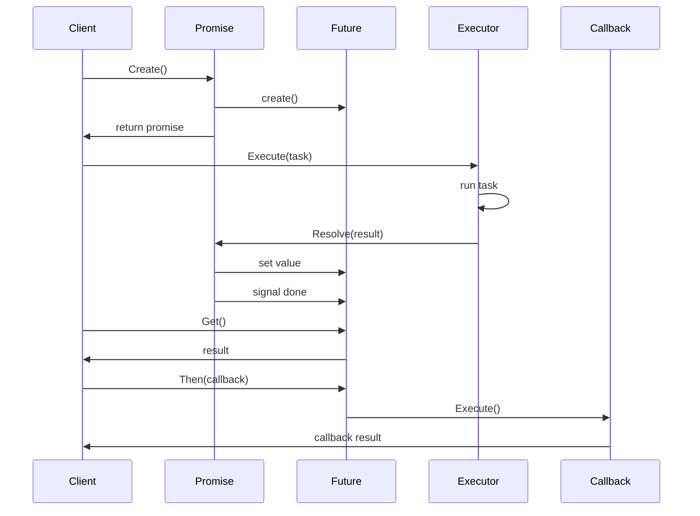

# 06-Future/Promise模式 (Future/Promise Pattern)

## 目录

- [06-Future/Promise模式 (Future/Promise Pattern)](#06-futurepromise模式-futurepromise-pattern)
  - [目录](#目录)
  - [1. 概述](#1-概述)
    - [1.1 定义](#11-定义)
    - [1.2 核心思想](#12-核心思想)
    - [1.3 设计目标](#13-设计目标)
  - [2. 形式化定义](#2-形式化定义)
    - [2.1 基本概念](#21-基本概念)
    - [2.2 操作语义](#22-操作语义)
    - [2.3 组合操作](#23-组合操作)
  - [3. 数学基础](#3-数学基础)
    - [3.1 函子理论](#31-函子理论)
    - [3.2 单子理论](#32-单子理论)
    - [3.3 异步计算理论](#33-异步计算理论)
  - [4. 模式结构](#4-模式结构)
    - [4.1 类图](#41-类图)
    - [4.2 时序图](#42-时序图)
  - [5. Go语言实现](#5-go语言实现)
    - [5.1 基础实现](#51-基础实现)
    - [5.2 泛型实现](#52-泛型实现)
    - [5.3 实际应用示例](#53-实际应用示例)
  - [6. 性能分析](#6-性能分析)
    - [6.1 时间复杂度](#61-时间复杂度)
    - [6.2 空间复杂度](#62-空间复杂度)
    - [6.3 性能优化建议](#63-性能优化建议)
  - [7. 应用场景](#7-应用场景)
    - [7.1 适用场景](#71-适用场景)
    - [7.2 使用示例](#72-使用示例)
  - [8. 优缺点分析](#8-优缺点分析)
    - [8.1 优点](#81-优点)
    - [8.2 缺点](#82-缺点)
    - [8.3 权衡考虑](#83-权衡考虑)
  - [9. 相关模式](#9-相关模式)
    - [9.1 模式关系](#91-模式关系)
    - [9.2 模式组合](#92-模式组合)
  - [10. 总结](#10-总结)
    - [10.1 关键要点](#101-关键要点)
    - [10.2 最佳实践](#102-最佳实践)
    - [10.3 未来发展方向](#103-未来发展方向)

---

## 1. 概述

### 1.1 定义

Future/Promise模式是一种异步编程模式，它表示一个可能还没有完成的计算结果。Future代表一个异步操作的结果，而Promise是设置这个结果的机制。该模式允许程序在等待异步操作完成时继续执行其他任务。

### 1.2 核心思想

Future/Promise模式的核心思想是：

- **异步执行**: 操作在后台异步执行，不阻塞主线程
- **结果封装**: 将异步操作的结果封装在Future对象中
- **回调机制**: 通过回调函数处理完成和错误情况
- **链式操作**: 支持多个异步操作的链式组合

### 1.3 设计目标

1. **非阻塞**: 避免阻塞主线程
2. **响应性**: 提高系统响应性
3. **组合性**: 支持异步操作的组合
4. **错误处理**: 提供统一的错误处理机制
5. **可读性**: 提高异步代码的可读性

---

## 2. 形式化定义

### 2.1 基本概念

设 ```latex
$F$
``` 为Future集合，```latex
$P$
``` 为Promise集合，```latex
$V$
``` 为值集合，```latex
$E$
``` 为错误集合，```latex
$S$
``` 为状态集合。

**定义 2.1** (Future)
Future是一个四元组 ```latex
$(f, value, error, state)$
```，其中：

- ```latex
$f \in F$
``` 是Future实例
- ```latex
$value \in V$
``` 是计算结果
- ```latex
$error \in E$
``` 是错误信息
- ```latex
$state \in \{pending, fulfilled, rejected\}$
``` 是状态

**定义 2.2** (Promise)
Promise是一个三元组 ```latex
$(p, future, setters)$
```，其中：

- ```latex
$p \in P$
``` 是Promise实例
- ```latex
$future \in F$
``` 是关联的Future
- ```latex
$setters$
``` 是设置结果的函数集合

**定义 2.3** (状态转换)

```latex
Future的状态转换遵循以下规则：
$```latex
$pending \rightarrow fulfilled \text{ (当设置值)}$
```$
$```latex
$pending \rightarrow rejected \text{ (当设置错误)}$
```$
```

### 2.2 操作语义

**公理 2.1** (Future创建)
对于值 ```latex
$v$
```：
$```latex
$create\_future() = (f, null, null, pending)$
```$

**公理 2.2** (Promise创建)
对于Future ```latex
$f$
```：
$```latex
$create\_promise(f) = (p, f, \{resolve, reject\})$
```$

**公理 2.3** (结果设置)
对于Promise ```latex
$p$
``` 和值 ```latex
$v$
```：
$```latex
$resolve(p, v) = set\_value(future(p), v) \land set\_state(future(p), fulfilled)$
```$

**公理 2.4** (错误设置)
对于Promise ```latex
$p$
``` 和错误 ```latex
$e$
```：
$```latex
$reject(p, e) = set\_error(future(p), e) \land set\_state(future(p), rejected)$
```$

**公理 2.5** (结果获取)

```latex
对于Future ```latex
$f$
```：
$$get(f) = \begin{cases}
value(f) & \text{if } state(f) = fulfilled \\
error(f) & \text{if } state(f) = rejected \\
block\_until\_complete(f) & \text{if } state(f) = pending
\end{cases}$$
```

### 2.3 组合操作

**定义 2.4** (Then操作)

```latex
对于Future ```latex
$f$
``` 和函数 ```latex
$g$
```：
$$then(f, g) = \begin{cases}
g(value(f)) & \text{if } state(f) = fulfilled \\
reject(error(f)) & \text{if } state(f) = rejected \\
pending & \text{if } state(f) = pending
\end{cases}$$
```

**定义 2.5** (Catch操作)

```latex
对于Future ```latex
$f$
``` 和错误处理函数 ```latex
$h$
```：
$$catch(f, h) = \begin{cases}
value(f) & \text{if } state(f) = fulfilled \\
h(error(f)) & \text{if } state(f) = rejected \\
pending & \text{if } state(f) = pending
\end{cases}$$
```

---

## 3. 数学基础

### 3.1 函子理论

Future可以建模为函子：

**定义 3.1** (Future函子)
Future函子 ```latex
$F: \text{Set} \rightarrow \text{Set}$
``` 定义为：
$```latex
$F(A) = \{pending\} \cup A \cup E$
```$

**定理 3.1** (函子性质)
Future满足函子的性质：

1. **单位律**: ```latex
$F(id_A) = id_{F(A)}$
```
2. **结合律**: ```latex
$F(g \circ f) = F(g) \circ F(f)$
```

### 3.2 单子理论

Future可以建模为单子：

**定义 3.2** (Future单子)
Future单子 ```latex
$(F, \eta, \mu)$
``` 定义为：

- ```latex
$F$
``` 是Future函子
- ```latex
$\eta_A: A \rightarrow F(A)$
``` 是单位映射
- ```latex
$\mu_A: F(F(A)) \rightarrow F(A)$
``` 是乘法映射

**定理 3.2** (单子定律)
Future满足单子定律：

1. **左单位律**: ```latex
$\mu \circ F(\eta) = id$
```
2. **右单位律**: ```latex
$\mu \circ \eta_F = id$
```
3. **结合律**: ```latex
$\mu \circ F(\mu) = \mu \circ \mu$
```

### 3.3 异步计算理论

**定义 3.3** (异步计算)
异步计算是一个三元组 ```latex
$(input, computation, output)$
```，其中：

- ```latex
$input$
``` 是输入数据
- ```latex
$computation$
``` 是计算函数
- ```latex
$output$
``` 是输出Future

**定理 3.3** (异步计算性质)
异步计算满足以下性质：

1. **非阻塞**: 计算不阻塞调用线程
2. **可组合**: 多个计算可以组合
3. **错误传播**: 错误可以正确传播

---

## 4. 模式结构

### 4.1 类图

```mermaid
classDiagram
    class Future {
        -value: interface{}
        -error: error
        -state: FutureState
        -done: chan struct{}
        -callbacks: []Callback
        +Get()
        +GetWithTimeout()
        +Then()
        +Catch()
        +IsDone()
        +IsFulfilled()
        +IsRejected()
    }

    class Promise {
        -future: *Future
        +Resolve()
        +Reject()
        +GetFuture()
    }

    class Callback {
        -onFulfilled: func(interface{})
        -onRejected: func(error)
        +Execute()
    }

    class AsyncExecutor {
        -pool: *ThreadPool
        +Execute()
        +ExecuteWithTimeout()
    }

    Future --> Callback
    Promise --> Future
    AsyncExecutor --> Future
```

### 4.2 时序图



---

## 5. Go语言实现

### 5.1 基础实现

```go
package futurepromise

import (
    "context"
    "fmt"
    "sync"
    "sync/atomic"
    "time"
)

// FutureState Future状态
type FutureState int

const (
    Pending FutureState = iota
    Fulfilled
    Rejected
)

// String 状态字符串表示
func (s FutureState) String() string {
    switch s {
    case Pending:
        return "Pending"
    case Fulfilled:
        return "Fulfilled"
    case Rejected:
        return "Rejected"
    default:
        return "Unknown"
    }
}

// Callback 回调函数
type Callback struct {
    OnFulfilled func(interface{}) interface{}
    OnRejected  func(error) interface{}
}

// Future Future实现
type Future struct {
    value     interface{}
    error     error
    state     FutureState
    done      chan struct{}
    callbacks []*Callback
    mu        sync.RWMutex
}

// NewFuture 创建Future
func NewFuture() *Future {
    return &Future{
        state:     Pending,
        done:      make(chan struct{}),
        callbacks: make([]*Callback, 0),
    }
}

// Get 获取结果
func (f *Future) Get() (interface{}, error) {
    <-f.done
    f.mu.RLock()
    defer f.mu.RUnlock()

    if f.state == Fulfilled {
        return f.value, nil
    }
    return nil, f.error
}

// GetWithTimeout 带超时的结果获取
func (f *Future) GetWithTimeout(timeout time.Duration) (interface{}, error) {
    select {
    case <-f.done:
        f.mu.RLock()
        defer f.mu.RUnlock()

        if f.state == Fulfilled {
            return f.value, nil
        }
        return nil, f.error
    case <-time.After(timeout):
        return nil, context.DeadlineExceeded
    }
}

// Then 链式操作
func (f *Future) Then(onFulfilled func(interface{}) interface{}) *Future {
    return f.ThenWithError(func(value interface{}) (interface{}, error) {
        return onFulfilled(value), nil
    })
}

// ThenWithError 带错误处理的链式操作
func (f *Future) ThenWithError(onFulfilled func(interface{}) (interface{}, error)) *Future {
    newFuture := NewFuture()

    f.mu.Lock()
    if f.state == Pending {
        f.callbacks = append(f.callbacks, &Callback{
            OnFulfilled: func(value interface{}) interface{} {
                result, err := onFulfilled(value)
                if err != nil {
                    newFuture.Reject(err)
                } else {
                    newFuture.Resolve(result)
                }
                return result
            },
        })
        f.mu.Unlock()
    } else {
        f.mu.Unlock()
        if f.state == Fulfilled {
            go func() {
                result, err := onFulfilled(f.value)
                if err != nil {
                    newFuture.Reject(err)
                } else {
                    newFuture.Resolve(result)
                }
            }()
        } else {
            newFuture.Reject(f.error)
        }
    }

    return newFuture
}

// Catch 错误处理
func (f *Future) Catch(onRejected func(error) interface{}) *Future {
    return f.CatchWithError(func(err error) (interface{}, error) {
        return onRejected(err), nil
    })
}

// CatchWithError 带错误处理的Catch
func (f *Future) CatchWithError(onRejected func(error) (interface{}, error)) *Future {
    newFuture := NewFuture()

    f.mu.Lock()
    if f.state == Pending {
        f.callbacks = append(f.callbacks, &Callback{
            OnRejected: func(err error) interface{} {
                result, newErr := onRejected(err)
                if newErr != nil {
                    newFuture.Reject(newErr)
                } else {
                    newFuture.Resolve(result)
                }
                return result
            },
        })
        f.mu.Unlock()
    } else {
        f.mu.Unlock()
        if f.state == Rejected {
            go func() {
                result, newErr := onRejected(f.error)
                if newErr != nil {
                    newFuture.Reject(newErr)
                } else {
                    newFuture.Resolve(result)
                }
            }()
        } else {
            newFuture.Resolve(f.value)
        }
    }

    return newFuture
}

// IsDone 检查是否完成
func (f *Future) IsDone() bool {
    select {
    case <-f.done:
        return true
    default:
        return false
    }
}

// IsFulfilled 检查是否成功完成
func (f *Future) IsFulfilled() bool {
    f.mu.RLock()
    defer f.mu.RUnlock()
    return f.state == Fulfilled
}

// IsRejected 检查是否被拒绝
func (f *Future) IsRejected() bool {
    f.mu.RLock()
    defer f.mu.RUnlock()
    return f.state == Rejected
}

// Resolve 设置成功结果
func (f *Future) Resolve(value interface{}) {
    f.mu.Lock()
    defer f.mu.Unlock()

    if f.state != Pending {
        return
    }

    f.value = value
    f.state = Fulfilled
    close(f.done)

    // 执行回调
    for _, callback := range f.callbacks {
        if callback.OnFulfilled != nil {
            go callback.OnFulfilled(value)
        }
    }
}

// Reject 设置错误结果
func (f *Future) Reject(err error) {
    f.mu.Lock()
    defer f.mu.Unlock()

    if f.state != Pending {
        return
    }

    f.error = err
    f.state = Rejected
    close(f.done)

    // 执行回调
    for _, callback := range f.callbacks {
        if callback.OnRejected != nil {
            go callback.OnRejected(err)
        }
    }
}

// Promise Promise实现
type Promise struct {
    future *Future
}

// NewPromise 创建Promise
func NewPromise() *Promise {
    return &Promise{
        future: NewFuture(),
    }
}

// Resolve 设置成功结果
func (p *Promise) Resolve(value interface{}) {
    p.future.Resolve(value)
}

// Reject 设置错误结果
func (p *Promise) Reject(err error) {
    p.future.Reject(err)
}

// GetFuture 获取Future
func (p *Promise) GetFuture() *Future {
    return p.future
}

// AsyncExecutor 异步执行器
type AsyncExecutor struct {
    pool *ThreadPool
}

// NewAsyncExecutor 创建异步执行器
func NewAsyncExecutor(poolSize int) *AsyncExecutor {
    return &AsyncExecutor{
        pool: NewThreadPool(poolSize, poolSize*2, 100),
    }
}

// Execute 执行异步任务
func (ae *AsyncExecutor) Execute(task func() (interface{}, error)) *Future {
    promise := NewPromise()

    ae.pool.Submit(NewSimpleTask("async-task", func() interface{} {
        result, err := task()
        if err != nil {
            promise.Reject(err)
        } else {
            promise.Resolve(result)
        }
        return nil
    }))

    return promise.GetFuture()
}

// ExecuteWithTimeout 带超时的异步执行
func (ae *AsyncExecutor) ExecuteWithTimeout(task func() (interface{}, error), timeout time.Duration) *Future {
    promise := NewPromise()

    // 创建超时上下文
    ctx, cancel := context.WithTimeout(context.Background(), timeout)
    defer cancel()

    ae.pool.Submit(NewSimpleTask("async-timeout-task", func() interface{} {
        // 执行任务
        done := make(chan struct{})
        var result interface{}
        var err error

        go func() {
            result, err = task()
            close(done)
        }()

        select {
        case <-done:
            if err != nil {
                promise.Reject(err)
            } else {
                promise.Resolve(result)
            }
        case <-ctx.Done():
            promise.Reject(context.DeadlineExceeded)
        }

        return nil
    }))

    return promise.GetFuture()
}
```

### 5.2 泛型实现

```go
package futurepromise

import (
    "context"
    "sync"
    "time"
)

// GenericFuture 泛型Future
type GenericFuture[T any] struct {
    value     T
    error     error
    state     FutureState
    done      chan struct{}
    callbacks []*GenericCallback[T]
    mu        sync.RWMutex
}

// GenericCallback 泛型回调
type GenericCallback[T any] struct {
    OnFulfilled func(T) interface{}
    OnRejected  func(error) interface{}
}

// NewGenericFuture 创建泛型Future
func NewGenericFuture[T any]() *GenericFuture[T] {
    return &GenericFuture[T]{
        state:     Pending,
        done:      make(chan struct{}),
        callbacks: make([]*GenericCallback[T], 0),
    }
}

// Get 获取结果
func (f *GenericFuture[T]) Get() (T, error) {
    var zero T
    <-f.done
    f.mu.RLock()
    defer f.mu.RUnlock()

    if f.state == Fulfilled {
        return f.value, nil
    }
    return zero, f.error
}

// GetWithTimeout 带超时的结果获取
func (f *GenericFuture[T]) GetWithTimeout(timeout time.Duration) (T, error) {
    var zero T
    select {
    case <-f.done:
        f.mu.RLock()
        defer f.mu.RUnlock()

        if f.state == Fulfilled {
            return f.value, nil
        }
        return zero, f.error
    case <-time.After(timeout):
        return zero, context.DeadlineExceeded
    }
}

// Then 链式操作
func (f *GenericFuture[T]) Then(onFulfilled func(T) interface{}) *Future {
    newFuture := NewFuture()

    f.mu.Lock()
    if f.state == Pending {
        f.callbacks = append(f.callbacks, &GenericCallback[T]{
            OnFulfilled: func(value T) interface{} {
                result := onFulfilled(value)
                newFuture.Resolve(result)
                return result
            },
        })
        f.mu.Unlock()
    } else {
        f.mu.Unlock()
        if f.state == Fulfilled {
            go func() {
                result := onFulfilled(f.value)
                newFuture.Resolve(result)
            }()
        } else {
            newFuture.Reject(f.error)
        }
    }

    return newFuture
}

// ThenWithError 带错误处理的链式操作
func (f *GenericFuture[T]) ThenWithError(onFulfilled func(T) (interface{}, error)) *Future {
    newFuture := NewFuture()

    f.mu.Lock()
    if f.state == Pending {
        f.callbacks = append(f.callbacks, &GenericCallback[T]{
            OnFulfilled: func(value T) interface{} {
                result, err := onFulfilled(value)
                if err != nil {
                    newFuture.Reject(err)
                } else {
                    newFuture.Resolve(result)
                }
                return result
            },
        })
        f.mu.Unlock()
    } else {
        f.mu.Unlock()
        if f.state == Fulfilled {
            go func() {
                result, err := onFulfilled(f.value)
                if err != nil {
                    newFuture.Reject(err)
                } else {
                    newFuture.Resolve(result)
                }
            }()
        } else {
            newFuture.Reject(f.error)
        }
    }

    return newFuture
}

// Catch 错误处理
func (f *GenericFuture[T]) Catch(onRejected func(error) T) *GenericFuture[T] {
    newFuture := NewGenericFuture[T]()

    f.mu.Lock()
    if f.state == Pending {
        f.callbacks = append(f.callbacks, &GenericCallback[T]{
            OnRejected: func(err error) interface{} {
                result := onRejected(err)
                newFuture.Resolve(result)
                return result
            },
        })
        f.mu.Unlock()
    } else {
        f.mu.Unlock()
        if f.state == Rejected {
            go func() {
                result := onRejected(f.error)
                newFuture.Resolve(result)
            }()
        } else {
            newFuture.Resolve(f.value)
        }
    }

    return newFuture
}

// IsDone 检查是否完成
func (f *GenericFuture[T]) IsDone() bool {
    select {
    case <-f.done:
        return true
    default:
        return false
    }
}

// IsFulfilled 检查是否成功完成
func (f *GenericFuture[T]) IsFulfilled() bool {
    f.mu.RLock()
    defer f.mu.RUnlock()
    return f.state == Fulfilled
}

// IsRejected 检查是否被拒绝
func (f *GenericFuture[T]) IsRejected() bool {
    f.mu.RLock()
    defer f.mu.RUnlock()
    return f.state == Rejected
}

// Resolve 设置成功结果
func (f *GenericFuture[T]) Resolve(value T) {
    f.mu.Lock()
    defer f.mu.Unlock()

    if f.state != Pending {
        return
    }

    f.value = value
    f.state = Fulfilled
    close(f.done)

    // 执行回调
    for _, callback := range f.callbacks {
        if callback.OnFulfilled != nil {
            go callback.OnFulfilled(value)
        }
    }
}

// Reject 设置错误结果
func (f *GenericFuture[T]) Reject(err error) {
    f.mu.Lock()
    defer f.mu.Unlock()

    if f.state != Pending {
        return
    }

    f.error = err
    f.state = Rejected
    close(f.done)

    // 执行回调
    for _, callback := range f.callbacks {
        if callback.OnRejected != nil {
            go callback.OnRejected(err)
        }
    }
}

// GenericPromise 泛型Promise
type GenericPromise[T any] struct {
    future *GenericFuture[T]
}

// NewGenericPromise 创建泛型Promise
func NewGenericPromise[T any]() *GenericPromise[T] {
    return &GenericPromise[T]{
        future: NewGenericFuture[T](),
    }
}

// Resolve 设置成功结果
func (p *GenericPromise[T]) Resolve(value T) {
    p.future.Resolve(value)
}

// Reject 设置错误结果
func (p *GenericPromise[T]) Reject(err error) {
    p.future.Reject(err)
}

// GetFuture 获取Future
func (p *GenericPromise[T]) GetFuture() *GenericFuture[T] {
    return p.future
}

// GenericAsyncExecutor 泛型异步执行器
type GenericAsyncExecutor[T any] struct {
    pool *ThreadPool
}

// NewGenericAsyncExecutor 创建泛型异步执行器
func NewGenericAsyncExecutor[T any](poolSize int) *GenericAsyncExecutor[T] {
    return &GenericAsyncExecutor[T]{
        pool: NewThreadPool(poolSize, poolSize*2, 100),
    }
}

// Execute 执行异步任务
func (ae *GenericAsyncExecutor[T]) Execute(task func() (T, error)) *GenericFuture[T] {
    promise := NewGenericPromise[T]()

    ae.pool.Submit(NewSimpleTask("generic-async-task", func() interface{} {
        result, err := task()
        if err != nil {
            promise.Reject(err)
        } else {
            promise.Resolve(result)
        }
        return nil
    }))

    return promise.GetFuture()
}

// ExecuteWithTimeout 带超时的异步执行
func (ae *GenericAsyncExecutor[T]) ExecuteWithTimeout(task func() (T, error), timeout time.Duration) *GenericFuture[T] {
    promise := NewGenericPromise[T]()

    // 创建超时上下文
    ctx, cancel := context.WithTimeout(context.Background(), timeout)
    defer cancel()

    ae.pool.Submit(NewSimpleTask("generic-async-timeout-task", func() interface{} {
        // 执行任务
        done := make(chan struct{})
        var result T
        var err error

        go func() {
            result, err = task()
            close(done)
        }()

        select {
        case <-done:
            if err != nil {
                promise.Reject(err)
            } else {
                promise.Resolve(result)
            }
        case <-ctx.Done():
            promise.Reject(context.DeadlineExceeded)
        }

        return nil
    }))

    return promise.GetFuture()
}
```

### 5.3 实际应用示例

```go
package main

import (
    "fmt"
    "log"
    "math/rand"
    "sync"
    "time"
)

// DataProcessor 数据处理器
type DataProcessor struct {
    executor *AsyncExecutor
}

// NewDataProcessor 创建数据处理器
func NewDataProcessor() *DataProcessor {
    return &DataProcessor{
        executor: NewAsyncExecutor(4),
    }
}

// ProcessData 处理数据
func (dp *DataProcessor) ProcessData(data []int) *Future {
    return dp.executor.Execute(func() (interface{}, error) {
        // 模拟数据处理
        time.Sleep(time.Duration(rand.Intn(1000)) * time.Millisecond)

        sum := 0
        for _, v := range data {
            sum += v
        }

        return sum, nil
    })
}

// ProcessDataWithValidation 带验证的数据处理
func (dp *DataProcessor) ProcessDataWithValidation(data []int) *Future {
    return dp.executor.Execute(func() (interface{}, error) {
        // 验证数据
        if len(data) == 0 {
            return nil, fmt.Errorf("empty data")
        }

        // 处理数据
        time.Sleep(time.Duration(rand.Intn(500)) * time.Millisecond)

        sum := 0
        for _, v := range data {
            sum += v
        }

        return sum, nil
    })
}

// WebService 网络服务
type WebService struct {
    executor *AsyncExecutor
}

// NewWebService 创建网络服务
func NewWebService() *WebService {
    return &WebService{
        executor: NewAsyncExecutor(8),
    }
}

// FetchData 获取数据
func (ws *WebService) FetchData(url string) *Future {
    return ws.executor.Execute(func() (interface{}, error) {
        // 模拟网络请求
        time.Sleep(time.Duration(rand.Intn(2000)) * time.Millisecond)

        // 模拟成功响应
        return fmt.Sprintf("Data from %s", url), nil
    })
}

// FetchDataWithTimeout 带超时的数据获取
func (ws *WebService) FetchDataWithTimeout(url string, timeout time.Duration) *Future {
    return ws.executor.ExecuteWithTimeout(func() (interface{}, error) {
        // 模拟网络请求
        time.Sleep(time.Duration(rand.Intn(3000)) * time.Millisecond)

        return fmt.Sprintf("Data from %s", url), nil
    }, timeout)
}

// ImageProcessor 图像处理器
type ImageProcessor struct {
    executor *GenericAsyncExecutor[string]
}

// NewImageProcessor 创建图像处理器
func NewImageProcessor() *ImageProcessor {
    return &ImageProcessor{
        executor: NewGenericAsyncExecutor[string](4),
    }
}

// ProcessImage 处理图像
func (ip *ImageProcessor) ProcessImage(filename string) *GenericFuture[string] {
    return ip.executor.Execute(func() (string, error) {
        // 模拟图像处理
        time.Sleep(time.Duration(rand.Intn(1500)) * time.Millisecond)

        return fmt.Sprintf("processed_%s", filename), nil
    })
}

// BatchProcessor 批量处理器
type BatchProcessor struct {
    executor *AsyncExecutor
}

// NewBatchProcessor 创建批量处理器
func NewBatchProcessor() *BatchProcessor {
    return &BatchProcessor{
        executor: NewAsyncExecutor(6),
    }
}

// ProcessBatch 批量处理
func (bp *BatchProcessor) ProcessBatch(tasks []func() (interface{}, error)) []*Future {
    futures := make([]*Future, len(tasks))

    for i, task := range tasks {
        futures[i] = bp.executor.Execute(task)
    }

    return futures
}

// WaitAll 等待所有Future完成
func WaitAll(futures []*Future) ([]interface{}, []error) {
    results := make([]interface{}, len(futures))
    errors := make([]error, len(futures))

    for i, future := range futures {
        result, err := future.Get()
        results[i] = result
        errors[i] = err
    }

    return results, errors
}

// WaitAny 等待任意一个Future完成
func WaitAny(futures []*Future) (interface{}, error, int) {
    if len(futures) == 0 {
        return nil, fmt.Errorf("no futures provided"), -1
    }

    // 创建通道来接收结果
    resultChan := make(chan struct {
        result interface{}
        err    error
        index  int
    }, len(futures))

    // 为每个Future启动一个goroutine
    for i, future := range futures {
        go func(f *Future, idx int) {
            result, err := f.Get()
            resultChan <- struct {
                result interface{}
                err    error
                index  int
            }{result, err, idx}
        }(future, i)
    }

    // 等待第一个结果
    first := <-resultChan
    return first.result, first.err, first.index
}

func main() {
    // 示例1: 基础Future/Promise使用
    fmt.Println("=== 基础Future/Promise示例 ===")

    promise := NewPromise()

    // 异步执行任务
    go func() {
        time.Sleep(1 * time.Second)
        promise.Resolve("Hello, Future!")
    }()

    // 获取结果
    result, err := promise.GetFuture().Get()
    if err != nil {
        log.Printf("Error: %v", err)
    } else {
        fmt.Printf("Result: %v\n", result)
    }

    // 示例2: 链式操作
    fmt.Println("\n=== 链式操作示例 ===")

    future := promise.GetFuture()
    chainedFuture := future.Then(func(value interface{}) interface{} {
        return fmt.Sprintf("Processed: %v", value)
    }).Then(func(value interface{}) interface{} {
        return fmt.Sprintf("Final: %v", value)
    })

    result, err = chainedFuture.Get()
    if err != nil {
        log.Printf("Error: %v", err)
    } else {
        fmt.Printf("Chained result: %v\n", result)
    }

    // 示例3: 数据处理器
    fmt.Println("\n=== 数据处理器示例 ===")

    processor := NewDataProcessor()

    data := []int{1, 2, 3, 4, 5}
    future1 := processor.ProcessData(data)
    future2 := processor.ProcessDataWithValidation(data)

    // 等待结果
    result1, err1 := future1.Get()
    result2, err2 := future2.Get()

    fmt.Printf("Process result 1: %v, error: %v\n", result1, err1)
    fmt.Printf("Process result 2: %v, error: %v\n", result2, err2)

    // 示例4: 网络服务
    fmt.Println("\n=== 网络服务示例 ===")

    service := NewWebService()

    future3 := service.FetchData("https://api.example.com/data")
    future4 := service.FetchDataWithTimeout("https://api.example.com/slow", 1*time.Second)

    result3, err3 := future3.Get()
    result4, err4 := future4.Get()

    fmt.Printf("Fetch result 1: %v, error: %v\n", result3, err3)
    fmt.Printf("Fetch result 2: %v, error: %v\n", result4, err4)

    // 示例5: 泛型图像处理器
    fmt.Println("\n=== 泛型图像处理器示例 ===")

    imageProcessor := NewImageProcessor()

    future5 := imageProcessor.ProcessImage("image1.jpg")
    future6 := imageProcessor.ProcessImage("image2.jpg")

    result5, err5 := future5.Get()
    result6, err6 := future6.Get()

    fmt.Printf("Image result 1: %v, error: %v\n", result5, err5)
    fmt.Printf("Image result 2: %v, error: %v\n", result6, err6)

    // 示例6: 批量处理
    fmt.Println("\n=== 批量处理示例 ===")

    batchProcessor := NewBatchProcessor()

    tasks := []func() (interface{}, error){
        func() (interface{}, error) {
            time.Sleep(500 * time.Millisecond)
            return "Task 1 completed", nil
        },
        func() (interface{}, error) {
            time.Sleep(300 * time.Millisecond)
            return "Task 2 completed", nil
        },
        func() (interface{}, error) {
            time.Sleep(700 * time.Millisecond)
            return "Task 3 completed", nil
        },
    }

    futures := batchProcessor.ProcessBatch(tasks)
    results, errors := WaitAll(futures)

    for i, result := range results {
        fmt.Printf("Batch result %d: %v, error: %v\n", i+1, result, errors[i])
    }

    // 示例7: 等待任意一个完成
    fmt.Println("\n=== 等待任意一个完成示例 ===")

    result, err, index := WaitAny(futures)
    fmt.Printf("First completed: index=%d, result=%v, error=%v\n", index, result, err)
}
```

---

## 6. 性能分析

### 6.1 时间复杂度

- **Future创建**: ```latex
$O(1)$
```
- **Promise创建**: ```latex
$O(1)$
```
- **结果设置**: ```latex
$O(1)$
```
- **结果获取**: ```latex
$O(1)$
``` (如果已完成)
- **链式操作**: ```latex
$O(1)$
```

### 6.2 空间复杂度

- **Future对象**: ```latex
$O(1)$
```
- **Promise对象**: ```latex
$O(1)$
```
- **回调队列**: ```latex
$O(n)$
```，其中 ```latex
$n$
``` 是回调数量

### 6.3 性能优化建议

1. **减少回调嵌套**: 避免过深的链式调用
2. **批量操作**: 使用批量处理减少开销
3. **超时控制**: 设置合理的超时时间
4. **资源管理**: 及时释放不需要的Future
5. **错误处理**: 避免错误传播开销

---

## 7. 应用场景

### 7.1 适用场景

1. **异步I/O**: 文件读写、网络请求
2. **并发计算**: 并行数据处理
3. **事件处理**: 异步事件响应
4. **资源加载**: 图片、数据加载
5. **API调用**: 微服务间通信

### 7.2 使用示例

```go
// 文件上传服务
type FileUploadService struct {
    executor *AsyncExecutor
}

func (fus *FileUploadService) UploadFile(file *File) *Future {
    return fus.executor.Execute(func() (interface{}, error) {
        // 上传文件
        return uploadToServer(file)
    })
}

// 数据库查询服务
type DatabaseService struct {
    executor *GenericAsyncExecutor[*Record]
}

func (ds *DatabaseService) QueryRecords(query string) *GenericFuture[[]*Record] {
    return ds.executor.Execute(func() ([]*Record, error) {
        // 执行查询
        return executeQuery(query)
    })
}
```

---

## 8. 优缺点分析

### 8.1 优点

1. **非阻塞**: 避免阻塞主线程
2. **响应性**: 提高系统响应性
3. **组合性**: 支持异步操作组合
4. **错误处理**: 统一的错误处理机制
5. **可读性**: 提高异步代码可读性

### 8.2 缺点

1. **复杂性**: 增加代码复杂度
2. **调试困难**: 异步代码调试复杂
3. **内存开销**: 需要额外的对象开销
4. **错误传播**: 错误传播可能复杂
5. **性能开销**: 比同步代码有更多开销

### 8.3 权衡考虑

| 方面 | 同步代码 | Future/Promise |
|------|----------|----------------|
| 性能 | 高 | 中等 |
| 响应性 | 低 | 高 |
| 复杂度 | 低 | 高 |
| 可读性 | 高 | 中等 |
| 可维护性 | 高 | 中等 |

---

## 9. 相关模式

### 9.1 模式关系

- **回调模式**: Future/Promise的基础
- **观察者模式**: 可以用于结果通知
- **命令模式**: 可以封装异步操作
- **线程池模式**: 用于执行异步任务

### 9.2 模式组合

```go
// 结合观察者的Future
type ObservableFuture struct {
    future *Future
    observers []Observer
    // ...
}

// 结合命令模式的Future
type CommandFuture struct {
    command Command
    future *Future
    // ...
}
```

---

## 10. 总结

Future/Promise模式是一种强大的异步编程模式，通过封装异步操作的结果，提供了优雅的异步编程解决方案。在Go语言中，该模式可以很好地利用goroutine和channel的特性。

### 10.1 关键要点

1. **异步执行**: 操作在后台异步执行
2. **结果封装**: 将异步结果封装在Future中
3. **链式操作**: 支持异步操作的组合
4. **错误处理**: 提供统一的错误处理

### 10.2 最佳实践

1. **合理使用链式调用**: 避免过深的嵌套
2. **设置超时**: 避免无限等待
3. **错误处理**: 正确处理所有错误情况
4. **资源管理**: 及时释放资源
5. **性能监控**: 监控异步操作性能

### 10.3 未来发展方向

1. **智能调度**: 基于负载的动态调度
2. **自动优化**: 自动优化异步操作
3. **分布式扩展**: 支持分布式Future
4. **流式处理**: 支持流式异步操作
5. **机器学习**: 使用ML优化异步性能

---

**参考文献**:

1. Goetz, B. (2006). Java Concurrency in Practice
2. Go Concurrency Patterns: <https://golang.org/doc/effective_go.html#concurrency>
3. Future/Promise Pattern: <https://en.wikipedia.org/wiki/Futures_and_promises>
4. Go sync package: <https://golang.org/pkg/sync/>
