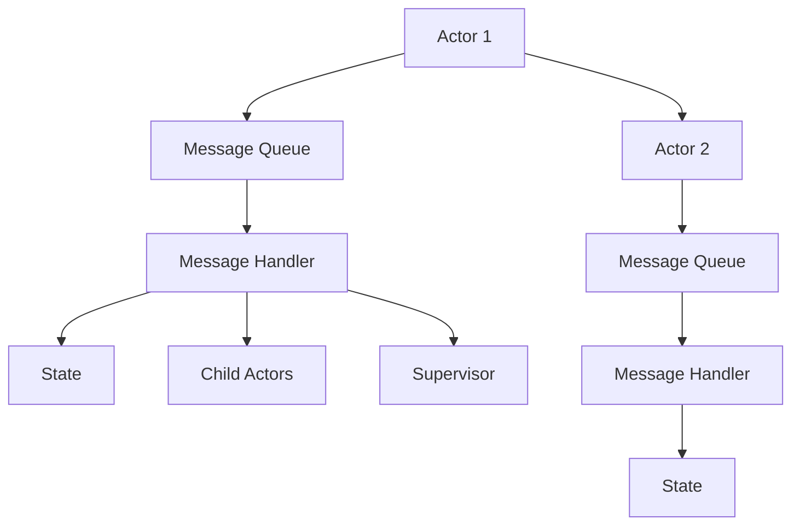

# 07-Actor模型 (Actor Model Pattern)

## 1. 模式概述

### 1.1 定义

**Actor模型**是一种并发计算模型，其中Actor是计算的基本单位。每个Actor维护自己的私有状态，通过消息传递与其他Actor通信，不共享内存。

### 1.2 形式化定义

设 $A$ 为Actor集合，$M$ 为消息集合，$S$ 为状态集合，$B$ 为邮箱集合，则Actor模型可形式化为：

$$\text{Actor} = (A, M, S, B, \text{send}, \text{receive}, \text{process})$$

其中：

- $\text{send}: A \times A \times M \rightarrow \text{void}$ 为发送函数
- $\text{receive}: A \times B \rightarrow M$ 为接收函数
- $\text{process}: A \times M \times S \rightarrow S$ 为处理函数

### 1.3 数学性质

**定理1.1**: Actor模型保证消息传递的可靠性
**证明**: 每个Actor有独立的邮箱，消息按FIFO顺序处理，因此保证了消息传递的可靠性。

**定理1.2**: Actor模型提供天然的并发安全
**证明**: Actor之间不共享状态，所有通信通过消息传递，因此天然避免了竞态条件。

### 1.4 设计目标

1. **并发安全**: 通过消息传递避免共享状态
2. **容错性**: 支持Actor的故障隔离和恢复
3. **可扩展性**: 支持大量Actor的并发执行
4. **响应性**: 避免阻塞，提高系统响应性

## 2. 模式结构

### 2.1 核心组件



### 2.2 组件职责

| 组件 | 职责 | 线程安全 |
|------|------|----------|
| Actor | 处理消息，维护状态 | 是 |
| Message Queue | 存储待处理消息 | 是 |
| Message Handler | 处理接收到的消息 | 是 |
| State | 维护Actor私有状态 | 否 |
| Supervisor | 监控和管理Actor | 是 |

## 3. Go语言实现

### 3.1 基础实现

```go
package actormodel

import (
    "context"
    "fmt"
    "sync"
    "time"
)

// Message 消息接口
type Message interface {
    GetType() string
    GetData() interface{}
    GetSender() *Actor
}

// baseMessage 基础消息实现
type baseMessage struct {
    msgType string
    data    interface{}
    sender  *Actor
}

func (m *baseMessage) GetType() string {
    return m.msgType
}

func (m *baseMessage) GetData() interface{} {
    return m.data
}

func (m *baseMessage) GetSender() *Actor {
    return m.sender
}

// MessageHandler 消息处理函数类型
type MessageHandler func(Actor, Message)

// Actor Actor接口
type Actor interface {
    Send(to Actor, msgType string, data interface{})
    Receive(msg Message)
    Start()
    Stop()
    GetID() string
}

// actor Actor基础实现
type actor struct {
    id          string
    mailbox     chan Message
    handlers    map[string]MessageHandler
    state       interface{}
    supervisor  *Supervisor
    children    map[string]Actor
    mu          sync.RWMutex
    ctx         context.Context
    cancel      context.CancelFunc
    wg          sync.WaitGroup
}

func NewActor(id string, supervisor *Supervisor) *actor {
    ctx, cancel := context.WithCancel(context.Background())
    return &actor{
        id:         id,
        mailbox:    make(chan Message, 1000),
        handlers:   make(map[string]MessageHandler),
        supervisor: supervisor,
        children:   make(map[string]Actor),
        ctx:        ctx,
        cancel:     cancel,
    }
}

func (a *actor) GetID() string {
    return a.id
}

func (a *actor) Send(to Actor, msgType string, data interface{}) {
    msg := &baseMessage{
        msgType: msgType,
        data:    data,
        sender:  a,
    }
    
    select {
    case to.(*actor).mailbox <- msg:
        // 消息发送成功
    case <-a.ctx.Done():
        // Actor已停止
    default:
        // 邮箱已满，可以选择丢弃或阻塞
        fmt.Printf("Warning: Actor %s mailbox is full\n", to.GetID())
    }
}

func (a *actor) Receive(msg Message) {
    a.mu.RLock()
    handler, exists := a.handlers[msg.GetType()]
    a.mu.RUnlock()
    
    if exists {
        handler(a, msg)
    } else {
        fmt.Printf("Warning: Actor %s has no handler for message type %s\n", 
                   a.id, msg.GetType())
    }
}

func (a *actor) Start() {
    a.wg.Add(1)
    go a.run()
}

func (a *actor) Stop() {
    a.cancel()
    a.wg.Wait()
}

func (a *actor) run() {
    defer a.wg.Done()
    
    for {
        select {
        case <-a.ctx.Done():
            return
        case msg := <-a.mailbox:
            a.Receive(msg)
        }
    }
}

func (a *actor) AddHandler(msgType string, handler MessageHandler) {
    a.mu.Lock()
    defer a.mu.Unlock()
    a.handlers[msgType] = handler
}

func (a *actor) SetState(state interface{}) {
    a.mu.Lock()
    defer a.mu.Unlock()
    a.state = state
}

func (a *actor) GetState() interface{} {
    a.mu.RLock()
    defer a.mu.RUnlock()
    return a.state
}

func (a *actor) AddChild(child Actor) {
    a.mu.Lock()
    defer a.mu.Unlock()
    a.children[child.GetID()] = child
}

func (a *actor) RemoveChild(childID string) {
    a.mu.Lock()
    defer a.mu.Unlock()
    delete(a.children, childID)
}

// Supervisor 监督者接口
type Supervisor interface {
    Start()
    Stop()
    AddActor(actor Actor)
    RemoveActor(actorID string)
    GetActor(actorID string) Actor
}

// supervisor 监督者实现
type supervisor struct {
    actors map[string]Actor
    mu     sync.RWMutex
    ctx    context.Context
    cancel context.CancelFunc
}

func NewSupervisor() *supervisor {
    ctx, cancel := context.WithCancel(context.Background())
    return &supervisor{
        actors: make(map[string]Actor),
        ctx:    ctx,
        cancel: cancel,
    }
}

func (s *supervisor) Start() {
    s.mu.RLock()
    defer s.mu.RUnlock()
    
    for _, actor := range s.actors {
        actor.Start()
    }
}

func (s *supervisor) Stop() {
    s.cancel()
    
    s.mu.RLock()
    defer s.mu.RUnlock()
    
    for _, actor := range s.actors {
        actor.Stop()
    }
}

func (s *supervisor) AddActor(actor Actor) {
    s.mu.Lock()
    defer s.mu.Unlock()
    s.actors[actor.GetID()] = actor
}

func (s *supervisor) RemoveActor(actorID string) {
    s.mu.Lock()
    defer s.mu.Unlock()
    
    if actor, exists := s.actors[actorID]; exists {
        actor.Stop()
        delete(s.actors, actorID)
    }
}

func (s *supervisor) GetActor(actorID string) Actor {
    s.mu.RLock()
    defer s.mu.RUnlock()
    return s.actors[actorID]
}
```

### 3.2 泛型实现

```go
package actormodel

import (
    "context"
    "sync"
    "time"
)

// GenericMessage 泛型消息
type GenericMessage[T any] struct {
    msgType string
    data    T
    sender  *GenericActor[T]
}

func (m *GenericMessage[T]) GetType() string {
    return m.msgType
}

func (m *GenericMessage[T]) GetData() interface{} {
    return m.data
}

func (m *GenericMessage[T]) GetSender() Actor {
    return m.sender
}

// GenericMessageHandler 泛型消息处理函数
type GenericMessageHandler[T any] func(*GenericActor[T], *GenericMessage[T])

// GenericActor 泛型Actor
type GenericActor[T any] struct {
    id          string
    mailbox     chan *GenericMessage[T]
    handlers    map[string]GenericMessageHandler[T]
    state       T
    supervisor  *Supervisor
    children    map[string]Actor
    mu          sync.RWMutex
    ctx         context.Context
    cancel      context.CancelFunc
    wg          sync.WaitGroup
}

func NewGenericActor[T any](id string, supervisor *Supervisor, initialState T) *GenericActor[T] {
    ctx, cancel := context.WithCancel(context.Background())
    return &GenericActor[T]{
        id:         id,
        mailbox:    make(chan *GenericMessage[T], 1000),
        handlers:   make(map[string]GenericMessageHandler[T]),
        state:      initialState,
        supervisor: supervisor,
        children:   make(map[string]Actor),
        ctx:        ctx,
        cancel:     cancel,
    }
}

func (a *GenericActor[T]) GetID() string {
    return a.id
}

func (a *GenericActor[T]) Send(to Actor, msgType string, data T) {
    msg := &GenericMessage[T]{
        msgType: msgType,
        data:    data,
        sender:  a,
    }
    
    if genericActor, ok := to.(*GenericActor[T]); ok {
        select {
        case genericActor.mailbox <- msg:
            // 消息发送成功
        case <-a.ctx.Done():
            // Actor已停止
        default:
            // 邮箱已满
        }
    }
}

func (a *GenericActor[T]) Receive(msg Message) {
    if genericMsg, ok := msg.(*GenericMessage[T]); ok {
        a.mu.RLock()
        handler, exists := a.handlers[genericMsg.GetType()]
        a.mu.RUnlock()
        
        if exists {
            handler(a, genericMsg)
        }
    }
}

func (a *GenericActor[T]) Start() {
    a.wg.Add(1)
    go a.run()
}

func (a *GenericActor[T]) Stop() {
    a.cancel()
    a.wg.Wait()
}

func (a *GenericActor[T]) run() {
    defer a.wg.Done()
    
    for {
        select {
        case <-a.ctx.Done():
            return
        case msg := <-a.mailbox:
            a.Receive(msg)
        }
    }
}

func (a *GenericActor[T]) AddHandler(msgType string, handler GenericMessageHandler[T]) {
    a.mu.Lock()
    defer a.mu.Unlock()
    a.handlers[msgType] = handler
}

func (a *GenericActor[T]) SetState(state T) {
    a.mu.Lock()
    defer a.mu.Unlock()
    a.state = state
}

func (a *GenericActor[T]) GetState() T {
    a.mu.RLock()
    defer a.mu.RUnlock()
    return a.state
}

func (a *GenericActor[T]) UpdateState(updateFn func(T) T) {
    a.mu.Lock()
    defer a.mu.Unlock()
    a.state = updateFn(a.state)
}

// GenericSupervisor 泛型监督者
type GenericSupervisor[T any] struct {
    actors map[string]*GenericActor[T]
    mu     sync.RWMutex
    ctx    context.Context
    cancel context.CancelFunc
}

func NewGenericSupervisor[T any]() *GenericSupervisor[T] {
    ctx, cancel := context.WithCancel(context.Background())
    return &GenericSupervisor[T]{
        actors: make(map[string]*GenericActor[T]),
        ctx:    ctx,
        cancel: cancel,
    }
}

func (s *GenericSupervisor[T]) Start() {
    s.mu.RLock()
    defer s.mu.RUnlock()
    
    for _, actor := range s.actors {
        actor.Start()
    }
}

func (s *GenericSupervisor[T]) Stop() {
    s.cancel()
    
    s.mu.RLock()
    defer s.mu.RUnlock()
    
    for _, actor := range s.actors {
        actor.Stop()
    }
}

func (s *GenericSupervisor[T]) AddActor(actor *GenericActor[T]) {
    s.mu.Lock()
    defer s.mu.Unlock()
    s.actors[actor.GetID()] = actor
}

func (s *GenericSupervisor[T]) RemoveActor(actorID string) {
    s.mu.Lock()
    defer s.mu.Unlock()
    
    if actor, exists := s.actors[actorID]; exists {
        actor.Stop()
        delete(s.actors, actorID)
    }
}

func (s *GenericSupervisor[T]) GetActor(actorID string) *GenericActor[T] {
    s.mu.RLock()
    defer s.mu.RUnlock()
    return s.actors[actorID]
}
```

### 3.3 函数式实现

```go
package actormodel

import (
    "context"
    "sync"
    "time"
)

// FunctionalMessage 函数式消息
type FunctionalMessage struct {
    msgType string
    data    interface{}
    sender  *FunctionalActor
    fn      func(interface{}) interface{}
}

func (m *FunctionalMessage) GetType() string {
    return m.msgType
}

func (m *FunctionalMessage) GetData() interface{} {
    return m.data
}

func (m *FunctionalActor) GetSender() Actor {
    return m.sender
}

// FunctionalActor 函数式Actor
type FunctionalActor struct {
    id          string
    mailbox     chan *FunctionalMessage
    state       interface{}
    supervisor  *Supervisor
    children    map[string]Actor
    mu          sync.RWMutex
    ctx         context.Context
    cancel      context.CancelFunc
    wg          sync.WaitGroup
}

func NewFunctionalActor(id string, supervisor *Supervisor, initialState interface{}) *FunctionalActor {
    ctx, cancel := context.WithCancel(context.Background())
    return &FunctionalActor{
        id:         id,
        mailbox:    make(chan *FunctionalMessage, 1000),
        state:      initialState,
        supervisor: supervisor,
        children:   make(map[string]Actor),
        ctx:        ctx,
        cancel:     cancel,
    }
}

func (a *FunctionalActor) GetID() string {
    return a.id
}

func (a *FunctionalActor) Send(to Actor, msgType string, data interface{}, fn func(interface{}) interface{}) {
    msg := &FunctionalMessage{
        msgType: msgType,
        data:    data,
        sender:  a,
        fn:      fn,
    }
    
    if functionalActor, ok := to.(*FunctionalActor); ok {
        select {
        case functionalActor.mailbox <- msg:
            // 消息发送成功
        case <-a.ctx.Done():
            // Actor已停止
        default:
            // 邮箱已满
        }
    }
}

func (a *FunctionalActor) Receive(msg Message) {
    if functionalMsg, ok := msg.(*FunctionalMessage); ok {
        a.mu.Lock()
        defer a.mu.Unlock()
        
        // 应用函数式转换
        if functionalMsg.fn != nil {
            a.state = functionalMsg.fn(a.state)
        }
    }
}

func (a *FunctionalActor) Start() {
    a.wg.Add(1)
    go a.run()
}

func (a *FunctionalActor) Stop() {
    a.cancel()
    a.wg.Wait()
}

func (a *FunctionalActor) run() {
    defer a.wg.Done()
    
    for {
        select {
        case <-a.ctx.Done():
            return
        case msg := <-a.mailbox:
            a.Receive(msg)
        }
    }
}

func (a *FunctionalActor) GetState() interface{} {
    a.mu.RLock()
    defer a.mu.RUnlock()
    return a.state
}

func (a *FunctionalActor) Transform(transformFn func(interface{}) interface{}) {
    a.mu.Lock()
    defer a.mu.Unlock()
    a.state = transformFn(a.state)
}
```

## 4. 性能分析

### 4.1 时间复杂度

| 操作 | 时间复杂度 | 说明 |
|------|------------|------|
| 消息发送 | O(1) | 直接入队 |
| 消息处理 | O(1) | 从队列取出 |
| Actor创建 | O(1) | 初始化操作 |
| Actor销毁 | O(1) | 清理操作 |

### 4.2 空间复杂度

- Actor对象：O(1)
- 消息队列：O(n)，其中n为队列大小
- 状态存储：O(s)，其中s为状态大小
- 总体空间：O(a × (n + s))，其中a为Actor数量

### 4.3 并发性能

```go
// 性能测试示例
func BenchmarkActorModel(b *testing.B) {
    supervisor := NewSupervisor()
    
    // 创建多个Actor
    for i := 0; i < 100; i++ {
        actor := NewActor(fmt.Sprintf("actor_%d", i), supervisor)
        supervisor.AddActor(actor)
    }
    
    supervisor.Start()
    defer supervisor.Stop()
    
    b.ResetTimer()
    b.RunParallel(func(pb *testing.PB) {
        for pb.Next() {
            // 发送消息
            actor := supervisor.GetActor("actor_0")
            actor.Send(actor, "test", "data")
        }
    })
}
```

## 5. 应用场景

### 5.1 适用场景

1. **分布式系统**：微服务架构
2. **游戏开发**：游戏对象管理
3. **实时系统**：事件处理
4. **并发计算**：并行任务处理

### 5.2 实际应用示例

```go
// 银行账户系统示例
type BankAccount struct {
    *GenericActor[AccountState]
}

type AccountState struct {
    Balance int64
    Owner   string
}

func NewBankAccount(id string, owner string, supervisor *Supervisor) *BankAccount {
    actor := NewGenericActor[AccountState](id, supervisor, AccountState{
        Balance: 0,
        Owner:   owner,
    })
    
    account := &BankAccount{GenericActor: actor}
    
    // 添加消息处理器
    account.AddHandler("deposit", account.handleDeposit)
    account.AddHandler("withdraw", account.handleWithdraw)
    account.AddHandler("getBalance", account.handleGetBalance)
    
    return account
}

func (ba *BankAccount) handleDeposit(actor *GenericActor[AccountState], msg *GenericMessage[AccountState]) {
    if amount, ok := msg.data.(int64); ok {
        actor.UpdateState(func(state AccountState) AccountState {
            state.Balance += amount
            return state
        })
        
        // 发送确认消息
        actor.Send(msg.sender, "depositConfirmed", amount)
    }
}

func (ba *BankAccount) handleWithdraw(actor *GenericActor[AccountState], msg *GenericMessage[AccountState]) {
    if amount, ok := msg.data.(int64); ok {
        actor.UpdateState(func(state AccountState) AccountState {
            if state.Balance >= amount {
                state.Balance -= amount
            }
            return state
        })
        
        // 发送确认消息
        actor.Send(msg.sender, "withdrawConfirmed", amount)
    }
}

func (ba *BankAccount) handleGetBalance(actor *GenericActor[AccountState], msg *GenericMessage[AccountState]) {
    balance := actor.GetState().Balance
    actor.Send(msg.sender, "balanceResponse", balance)
}

// 游戏对象示例
type GameObject struct {
    *FunctionalActor
}

func NewGameObject(id string, supervisor *Supervisor) *GameObject {
    actor := NewFunctionalActor(id, supervisor, map[string]interface{}{
        "position": [2]float64{0, 0},
        "health":   100,
        "alive":    true,
    })
    
    return &GameObject{FunctionalActor: actor}
}

func (go *GameObject) Move(dx, dy float64) {
    go.Transform(func(state interface{}) interface{} {
        if stateMap, ok := state.(map[string]interface{}); ok {
            if pos, ok := stateMap["position"].([2]float64); ok {
                pos[0] += dx
                pos[1] += dy
                stateMap["position"] = pos
            }
        }
        return stateMap
    })
}

func (go *GameObject) TakeDamage(damage int) {
    go.Transform(func(state interface{}) interface{} {
        if stateMap, ok := state.(map[string]interface{}); ok {
            if health, ok := stateMap["health"].(int); ok {
                health -= damage
                if health <= 0 {
                    health = 0
                    stateMap["alive"] = false
                }
                stateMap["health"] = health
            }
        }
        return stateMap
    })
}
```

## 6. 最佳实践

### 6.1 设计原则

1. **单一职责**：每个Actor只负责一个领域
2. **消息驱动**：所有交互通过消息传递
3. **状态封装**：Actor状态对外不可见
4. **故障隔离**：Actor故障不影响其他Actor

### 6.2 错误处理

```go
func (a *actor) run() {
    defer a.wg.Done()
    
    for {
        select {
        case <-a.ctx.Done():
            return
        case msg := <-a.mailbox:
            func() {
                defer func() {
                    if r := recover(); r != nil {
                        // 处理panic
                        fmt.Printf("Actor %s panic: %v\n", a.id, r)
                        a.supervisor.HandleActorFailure(a.id, r)
                    }
                }()
                a.Receive(msg)
            }()
        }
    }
}
```

### 6.3 监控和调试

```go
type ActorMetrics struct {
    MessageCount    int64
    ProcessingTime  time.Duration
    ErrorCount      int64
    mu              sync.RWMutex
}

func (a *actor) GetMetrics() *ActorMetrics {
    // 返回监控指标
    return &ActorMetrics{}
}
```

## 7. 与其他模式的关系

### 7.1 模式组合

- **与消息队列模式**：Actor使用消息队列进行通信
- **与观察者模式**：Actor可以观察其他Actor的状态变化
- **与状态机模式**：Actor可以建模为状态机

### 7.2 模式对比

| 模式 | 适用场景 | 复杂度 | 性能 |
|------|----------|--------|------|
| Actor模型 | 分布式系统 | 高 | 高 |
| 线程池 | 任务执行 | 低 | 中等 |
| 消息队列 | 异步通信 | 中等 | 高 |

## 8. 总结

Actor模型通过消息传递和状态封装，提供了强大而灵活的并发编程模型。在Go语言中，结合goroutine和channel的特性，可以高效地实现Actor模型，为复杂的并发应用提供强大的支持。

### 8.1 关键要点

1. **消息传递**：所有通信通过消息传递
2. **状态封装**：Actor状态对外不可见
3. **并发安全**：天然避免竞态条件
4. **故障隔离**：支持容错和恢复

### 8.2 最佳实践

1. **合理设计消息**：消息应该是不可变的
2. **避免阻塞操作**：Actor不应该阻塞
3. **正确使用监督者**：实现故障恢复机制
4. **测试覆盖**：编写全面的单元测试

### 8.3 未来发展方向

1. **分布式Actor**：支持跨网络通信
2. **持久化Actor**：支持状态持久化
3. **流式处理**：支持流式数据处理
4. **可视化工具**：增强调试和监控能力

---

**相关链接**:

- [01-活动对象模式](./01-Active-Object-Pattern.md)
- [02-管程模式](./02-Monitor-Pattern.md)
- [返回并发模式目录](../README.md)
