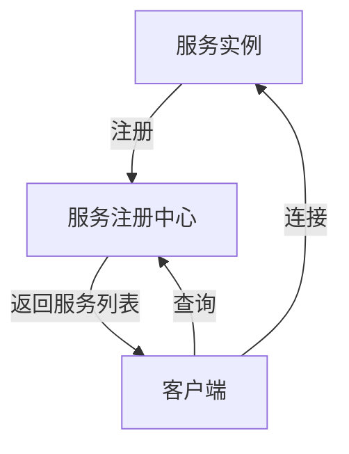
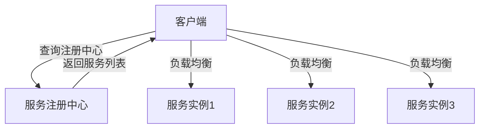
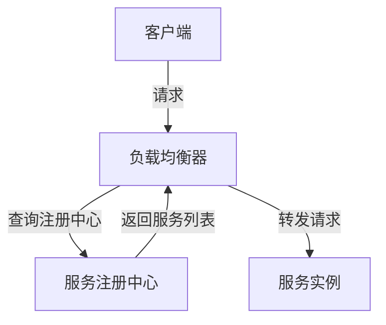

# 01-服务发现模式 (Service Discovery Pattern)

## 1. 概述

### 1.1 定义

服务发现模式是一种分布式系统架构模式，用于在动态环境中自动发现和注册服务实例，使客户端能够找到并连接到可用的服务。

### 1.2 形式化定义

设 $S$ 为服务集合，$I$ 为服务实例集合，$N$ 为网络节点集合，则服务发现模式可形式化为：

$$SD = (S, I, N, R, D)$$

其中：

- $R: S \rightarrow 2^I$ 为注册函数，将服务映射到其实例集合
- $D: S \rightarrow 2^I$ 为发现函数，返回服务的可用实例集合

### 1.3 数学性质

**定理 1.1**: 服务发现的一致性
对于任意服务 $s \in S$，如果实例 $i \in I$ 已注册，则 $i \in D(s)$ 当且仅当 $i$ 健康且可达。

**证明**:
假设 $i \in R(s)$ 且 $i$ 健康可达，根据服务发现算法，$i$ 会被包含在 $D(s)$ 中。
反之，如果 $i \notin D(s)$，则 $i$ 要么未注册，要么不健康或不可达。

## 2. 架构模式

### 2.1 服务注册中心模式



### 2.2 客户端发现模式



### 2.3 服务端发现模式



## 3. Go语言实现

### 3.1 服务注册接口

```go
// ServiceRegistry 服务注册接口
type ServiceRegistry interface {
    // Register 注册服务实例
    Register(service *ServiceInstance) error
    
    // Deregister 注销服务实例
    Deregister(serviceID string) error
    
    // GetService 获取服务实例列表
    GetService(serviceName string) ([]*ServiceInstance, error)
    
    // GetAllServices 获取所有服务
    GetAllServices() (map[string][]*ServiceInstance, error)
    
    // HealthCheck 健康检查
    HealthCheck(serviceID string) error
}

// ServiceInstance 服务实例
type ServiceInstance struct {
    ID          string            `json:"id"`
    Name        string            `json:"name"`
    Host        string            `json:"host"`
    Port        int               `json:"port"`
    Status      ServiceStatus     `json:"status"`
    Metadata    map[string]string `json:"metadata"`
    LastUpdated time.Time         `json:"last_updated"`
}

// ServiceStatus 服务状态
type ServiceStatus string

const (
    ServiceStatusUp   ServiceStatus = "UP"
    ServiceStatusDown ServiceStatus = "DOWN"
    ServiceStatusOut  ServiceStatus = "OUT_OF_SERVICE"
)
```

### 3.2 内存注册中心实现

```go
// MemoryServiceRegistry 内存服务注册中心
type MemoryServiceRegistry struct {
    services map[string][]*ServiceInstance
    mutex    sync.RWMutex
    ttl      time.Duration
}

// NewMemoryServiceRegistry 创建内存注册中心
func NewMemoryServiceRegistry(ttl time.Duration) *MemoryServiceRegistry {
    registry := &MemoryServiceRegistry{
        services: make(map[string][]*ServiceInstance),
        ttl:      ttl,
    }
    
    // 启动清理过期服务的goroutine
    go registry.cleanupExpiredServices()
    
    return registry
}

// Register 注册服务实例
func (r *MemoryServiceRegistry) Register(service *ServiceInstance) error {
    r.mutex.Lock()
    defer r.mutex.Unlock()
    
    // 验证服务实例
    if err := r.validateServiceInstance(service); err != nil {
        return fmt.Errorf("invalid service instance: %w", err)
    }
    
    // 更新最后更新时间
    service.LastUpdated = time.Now()
    service.Status = ServiceStatusUp
    
    // 检查是否已存在
    services := r.services[service.Name]
    for i, existing := range services {
        if existing.ID == service.ID {
            // 更新现有实例
            services[i] = service
            return nil
        }
    }
    
    // 添加新实例
    r.services[service.Name] = append(services, service)
    
    return nil
}

// Deregister 注销服务实例
func (r *MemoryServiceRegistry) Deregister(serviceID string) error {
    r.mutex.Lock()
    defer r.mutex.Unlock()
    
    for serviceName, services := range r.services {
        for i, service := range services {
            if service.ID == serviceID {
                // 移除服务实例
                r.services[serviceName] = append(services[:i], services[i+1:]...)
                return nil
            }
        }
    }
    
    return fmt.Errorf("service instance %s not found", serviceID)
}

// GetService 获取服务实例列表
func (r *MemoryServiceRegistry) GetService(serviceName string) ([]*ServiceInstance, error) {
    r.mutex.RLock()
    defer r.mutex.RUnlock()
    
    services, exists := r.services[serviceName]
    if !exists {
        return nil, fmt.Errorf("service %s not found", serviceName)
    }
    
    // 过滤健康的服务实例
    healthyServices := make([]*ServiceInstance, 0)
    for _, service := range services {
        if service.Status == ServiceStatusUp && !r.isExpired(service) {
            healthyServices = append(healthyServices, service)
        }
    }
    
    return healthyServices, nil
}

// GetAllServices 获取所有服务
func (r *MemoryServiceRegistry) GetAllServices() (map[string][]*ServiceInstance, error) {
    r.mutex.RLock()
    defer r.mutex.RUnlock()
    
    result := make(map[string][]*ServiceInstance)
    for serviceName, services := range r.services {
        healthyServices := make([]*ServiceInstance, 0)
        for _, service := range services {
            if service.Status == ServiceStatusUp && !r.isExpired(service) {
                healthyServices = append(healthyServices, service)
            }
        }
        if len(healthyServices) > 0 {
            result[serviceName] = healthyServices
        }
    }
    
    return result, nil
}

// HealthCheck 健康检查
func (r *MemoryServiceRegistry) HealthCheck(serviceID string) error {
    r.mutex.Lock()
    defer r.mutex.Unlock()
    
    for _, services := range r.services {
        for _, service := range services {
            if service.ID == serviceID {
                service.LastUpdated = time.Now()
                return nil
            }
        }
    }
    
    return fmt.Errorf("service instance %s not found", serviceID)
}

// validateServiceInstance 验证服务实例
func (r *MemoryServiceRegistry) validateServiceInstance(service *ServiceInstance) error {
    if service.ID == "" {
        return errors.New("service ID is required")
    }
    if service.Name == "" {
        return errors.New("service name is required")
    }
    if service.Host == "" {
        return errors.New("service host is required")
    }
    if service.Port <= 0 || service.Port > 65535 {
        return errors.New("invalid service port")
    }
    return nil
}

// isExpired 检查服务是否过期
func (r *MemoryServiceRegistry) isExpired(service *ServiceInstance) bool {
    return time.Since(service.LastUpdated) > r.ttl
}

// cleanupExpiredServices 清理过期服务
func (r *MemoryServiceRegistry) cleanupExpiredServices() {
    ticker := time.NewTicker(r.ttl / 2)
    defer ticker.Stop()
    
    for range ticker.C {
        r.mutex.Lock()
        for serviceName, services := range r.services {
            healthyServices := make([]*ServiceInstance, 0)
            for _, service := range services {
                if !r.isExpired(service) {
                    healthyServices = append(healthyServices, service)
                }
            }
            r.services[serviceName] = healthyServices
        }
        r.mutex.Unlock()
    }
}
```

### 3.3 客户端发现实现

```go
// ServiceDiscoveryClient 服务发现客户端
type ServiceDiscoveryClient struct {
    registry ServiceRegistry
    cache    map[string]*ServiceCache
    mutex    sync.RWMutex
    ttl      time.Duration
}

// ServiceCache 服务缓存
type ServiceCache struct {
    instances []*ServiceInstance
    lastFetch time.Time
}

// NewServiceDiscoveryClient 创建服务发现客户端
func NewServiceDiscoveryClient(registry ServiceRegistry, ttl time.Duration) *ServiceDiscoveryClient {
    return &ServiceDiscoveryClient{
        registry: registry,
        cache:    make(map[string]*ServiceCache),
        ttl:      ttl,
    }
}

// GetService 获取服务实例（带缓存）
func (c *ServiceDiscoveryClient) GetService(serviceName string) ([]*ServiceInstance, error) {
    // 检查缓存
    c.mutex.RLock()
    if cache, exists := c.cache[serviceName]; exists && !c.isCacheExpired(cache) {
        instances := make([]*ServiceInstance, len(cache.instances))
        copy(instances, cache.instances)
        c.mutex.RUnlock()
        return instances, nil
    }
    c.mutex.RUnlock()
    
    // 从注册中心获取
    instances, err := c.registry.GetService(serviceName)
    if err != nil {
        return nil, err
    }
    
    // 更新缓存
    c.mutex.Lock()
    c.cache[serviceName] = &ServiceCache{
        instances: instances,
        lastFetch: time.Now(),
    }
    c.mutex.Unlock()
    
    return instances, nil
}

// GetServiceWithLoadBalancing 获取服务实例（带负载均衡）
func (c *ServiceDiscoveryClient) GetServiceWithLoadBalancing(serviceName string, strategy LoadBalancingStrategy) (*ServiceInstance, error) {
    instances, err := c.GetService(serviceName)
    if err != nil {
        return nil, err
    }
    
    if len(instances) == 0 {
        return nil, fmt.Errorf("no available instances for service %s", serviceName)
    }
    
    return strategy.Select(instances), nil
}

// isCacheExpired 检查缓存是否过期
func (c *ServiceDiscoveryClient) isCacheExpired(cache *ServiceCache) bool {
    return time.Since(cache.lastFetch) > c.ttl
}

// LoadBalancingStrategy 负载均衡策略接口
type LoadBalancingStrategy interface {
    Select(instances []*ServiceInstance) *ServiceInstance
}

// RoundRobinStrategy 轮询策略
type RoundRobinStrategy struct {
    counter int64
}

func (r *RoundRobinStrategy) Select(instances []*ServiceInstance) *ServiceInstance {
    if len(instances) == 0 {
        return nil
    }
    
    index := atomic.AddInt64(&r.counter, 1) % int64(len(instances))
    return instances[index]
}

// RandomStrategy 随机策略
type RandomStrategy struct {
    rng *rand.Rand
}

func NewRandomStrategy() *RandomStrategy {
    return &RandomStrategy{
        rng: rand.New(rand.NewSource(time.Now().UnixNano())),
    }
}

func (r *RandomStrategy) Select(instances []*ServiceInstance) *ServiceInstance {
    if len(instances) == 0 {
        return nil
    }
    
    index := r.rng.Intn(len(instances))
    return instances[index]
}

// WeightedStrategy 权重策略
type WeightedStrategy struct{}

func (w *WeightedStrategy) Select(instances []*ServiceInstance) *ServiceInstance {
    if len(instances) == 0 {
        return nil
    }
    
    // 计算总权重
    totalWeight := 0
    for _, instance := range instances {
        if weight, exists := instance.Metadata["weight"]; exists {
            if w, err := strconv.Atoi(weight); err == nil {
                totalWeight += w
            }
        } else {
            totalWeight += 1 // 默认权重为1
        }
    }
    
    if totalWeight == 0 {
        return instances[0]
    }
    
    // 随机选择
    r := rand.New(rand.NewSource(time.Now().UnixNano()))
    random := r.Intn(totalWeight)
    
    currentWeight := 0
    for _, instance := range instances {
        weight := 1
        if w, exists := instance.Metadata["weight"]; exists {
            if w, err := strconv.Atoi(w); err == nil {
                weight = w
            }
        }
        
        currentWeight += weight
        if random < currentWeight {
            return instance
        }
    }
    
    return instances[0]
}
```

### 3.4 服务端发现实现

```go
// ServiceDiscoveryProxy 服务发现代理
type ServiceDiscoveryProxy struct {
    registry  ServiceRegistry
    strategy  LoadBalancingStrategy
    listener  net.Listener
    services  map[string]*ProxyService
    mutex     sync.RWMutex
}

// ProxyService 代理服务
type ProxyService struct {
    name      string
    instances []*ServiceInstance
    strategy  LoadBalancingStrategy
    lastFetch time.Time
}

// NewServiceDiscoveryProxy 创建服务发现代理
func NewServiceDiscoveryProxy(registry ServiceRegistry, strategy LoadBalancingStrategy) *ServiceDiscoveryProxy {
    return &ServiceDiscoveryProxy{
        registry: registry,
        strategy: strategy,
        services: make(map[string]*ProxyService),
    }
}

// Start 启动代理
func (p *ServiceDiscoveryProxy) Start(address string) error {
    listener, err := net.Listen("tcp", address)
    if err != nil {
        return fmt.Errorf("failed to start proxy: %w", err)
    }
    
    p.listener = listener
    
    go p.acceptConnections()
    
    return nil
}

// acceptConnections 接受连接
func (p *ServiceDiscoveryProxy) acceptConnections() {
    for {
        conn, err := p.listener.Accept()
        if err != nil {
            log.Printf("Failed to accept connection: %v", err)
            continue
        }
        
        go p.handleConnection(conn)
    }
}

// handleConnection 处理连接
func (p *ServiceDiscoveryProxy) handleConnection(conn net.Conn) {
    defer conn.Close()
    
    // 读取请求
    buffer := make([]byte, 1024)
    n, err := conn.Read(buffer)
    if err != nil {
        log.Printf("Failed to read from connection: %v", err)
        return
    }
    
    // 解析服务名称（简化示例）
    serviceName := string(buffer[:n])
    
    // 获取服务实例
    instance, err := p.getServiceInstance(serviceName)
    if err != nil {
        log.Printf("Failed to get service instance: %v", err)
        return
    }
    
    // 转发请求
    p.forwardRequest(conn, instance)
}

// getServiceInstance 获取服务实例
func (p *ServiceDiscoveryProxy) getServiceInstance(serviceName string) (*ServiceInstance, error) {
    p.mutex.Lock()
    defer p.mutex.Unlock()
    
    // 检查缓存
    if proxyService, exists := p.services[serviceName]; exists && !p.isCacheExpired(proxyService) {
        return p.strategy.Select(proxyService.instances), nil
    }
    
    // 从注册中心获取
    instances, err := p.registry.GetService(serviceName)
    if err != nil {
        return nil, err
    }
    
    // 更新缓存
    p.services[serviceName] = &ProxyService{
        name:      serviceName,
        instances: instances,
        strategy:  p.strategy,
        lastFetch: time.Now(),
    }
    
    return p.strategy.Select(instances), nil
}

// isCacheExpired 检查缓存是否过期
func (p *ServiceDiscoveryProxy) isCacheExpired(proxyService *ProxyService) bool {
    return time.Since(proxyService.lastFetch) > 30*time.Second
}

// forwardRequest 转发请求
func (p *ServiceDiscoveryProxy) forwardRequest(clientConn net.Conn, instance *ServiceInstance) {
    // 连接到后端服务
    backendConn, err := net.Dial("tcp", fmt.Sprintf("%s:%d", instance.Host, instance.Port))
    if err != nil {
        log.Printf("Failed to connect to backend: %v", err)
        return
    }
    defer backendConn.Close()
    
    // 双向转发数据
    go p.forwardData(clientConn, backendConn)
    p.forwardData(backendConn, clientConn)
}

// forwardData 转发数据
func (p *ServiceDiscoveryProxy) forwardData(dst net.Conn, src net.Conn) {
    buffer := make([]byte, 4096)
    for {
        n, err := src.Read(buffer)
        if err != nil {
            break
        }
        
        _, err = dst.Write(buffer[:n])
        if err != nil {
            break
        }
    }
}
```

## 4. 性能分析

### 4.1 时间复杂度

- **注册**: $O(1)$
- **注销**: $O(n)$，其中 $n$ 为服务实例数量
- **发现**: $O(1)$（带缓存）
- **健康检查**: $O(n)$

### 4.2 空间复杂度

- **内存注册中心**: $O(s \times i)$，其中 $s$ 为服务数量，$i$ 为平均实例数量
- **客户端缓存**: $O(s \times i)$
- **代理缓存**: $O(s \times i)$

### 4.3 一致性分析

**CAP定理权衡**:

- **一致性 (Consistency)**: 最终一致性
- **可用性 (Availability)**: 高可用性
- **分区容错性 (Partition tolerance)**: 支持网络分区

## 5. 使用示例

### 5.1 基本使用

```go
func main() {
    // 创建注册中心
    registry := NewMemoryServiceRegistry(30 * time.Second)
    
    // 注册服务实例
    service1 := &ServiceInstance{
        ID:       "user-service-1",
        Name:     "user-service",
        Host:     "localhost",
        Port:     8081,
        Status:   ServiceStatusUp,
        Metadata: map[string]string{"version": "1.0.0"},
    }
    
    service2 := &ServiceInstance{
        ID:       "user-service-2",
        Name:     "user-service",
        Host:     "localhost",
        Port:     8082,
        Status:   ServiceStatusUp,
        Metadata: map[string]string{"version": "1.0.0"},
    }
    
    registry.Register(service1)
    registry.Register(service2)
    
    // 创建服务发现客户端
    client := NewServiceDiscoveryClient(registry, 10*time.Second)
    
    // 使用轮询策略获取服务
    roundRobin := &RoundRobinStrategy{}
    instance, err := client.GetServiceWithLoadBalancing("user-service", roundRobin)
    if err != nil {
        log.Fatal(err)
    }
    
    fmt.Printf("Selected instance: %s:%d\n", instance.Host, instance.Port)
}
```

### 5.2 高级使用

```go
func main() {
    // 创建注册中心
    registry := NewMemoryServiceRegistry(30 * time.Second)
    
    // 创建代理
    strategy := NewRandomStrategy()
    proxy := NewServiceDiscoveryProxy(registry, strategy)
    
    // 启动代理
    err := proxy.Start(":8080")
    if err != nil {
        log.Fatal(err)
    }
    
    // 注册服务
    service := &ServiceInstance{
        ID:     "api-service-1",
        Name:   "api-service",
        Host:   "localhost",
        Port:   9090,
        Status: ServiceStatusUp,
    }
    
    registry.Register(service)
    
    fmt.Println("Proxy started on :8080")
    select {} // 保持运行
}
```

## 6. 最佳实践

### 6.1 设计原则

1. **高可用性**: 使用多个注册中心实例
2. **容错性**: 实现重试和熔断机制
3. **性能**: 使用缓存减少注册中心访问
4. **一致性**: 实现最终一致性模型
5. **可观测性**: 添加监控和日志

### 6.2 配置建议

```go
type ServiceDiscoveryConfig struct {
    // 注册中心配置
    RegistryType    string        `json:"registry_type"`
    RegistryAddress string        `json:"registry_address"`
    RegistryTTL     time.Duration `json:"registry_ttl"`
    
    // 客户端配置
    ClientCacheTTL  time.Duration `json:"client_cache_ttl"`
    LoadBalancing   string        `json:"load_balancing"`
    
    // 健康检查配置
    HealthCheckInterval time.Duration `json:"health_check_interval"`
    HealthCheckTimeout  time.Duration `json:"health_check_timeout"`
    
    // 重试配置
    MaxRetries    int           `json:"max_retries"`
    RetryInterval time.Duration `json:"retry_interval"`
}
```

## 7. 总结

服务发现模式是分布式系统的核心组件，通过Go语言的高并发特性和简洁语法，可以构建高性能、可靠的服务发现系统。本实现提供了：

1. **完整的接口定义**: 标准化的服务注册和发现接口
2. **多种实现方式**: 内存注册中心、客户端发现、服务端发现
3. **负载均衡策略**: 轮询、随机、权重等多种策略
4. **性能优化**: 缓存机制、并发控制
5. **容错机制**: 健康检查、过期清理

通过合理使用这些组件，可以构建出适应不同场景的服务发现系统。

### 7.1 关键要点

1. **自动发现**：自动发现可用的服务实例
2. **负载均衡**：在多个实例间分配请求
3. **故障转移**：自动切换到健康实例
4. **可扩展性**：支持大规模服务部署

### 7.2 最佳实践

1. **高可用注册表**：使用集群化的注册表
2. **健康检查**：定期检查服务健康状态
3. **缓存机制**：使用缓存提高性能
4. **监控告警**：监控服务发现状态

### 7.3 未来发展方向

1. **智能路由**：基于负载和延迟的智能路由
2. **服务网格**：集成服务网格技术
3. **多云支持**：支持多云环境
4. **AI优化**：使用AI优化服务选择

---

**相关链接**:

- [02-熔断器模式](./02-Circuit-Breaker-Pattern.md)
- [03-API网关模式](./03-API-Gateway-Pattern.md)
- [返回分布式模式目录](../README.md)
