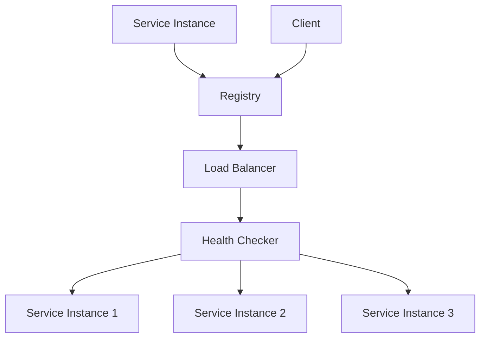

# 01-服务发现模式 (Service Discovery Pattern)

## 1. 模式概述

### 1.1 定义

**服务发现模式**是一种分布式系统设计模式，用于自动发现和注册服务实例，使客户端能够动态找到可用的服务端点。

### 1.2 形式化定义

设 $S$ 为服务集合，$I$ 为实例集合，$R$ 为注册表集合，$C$ 为客户端集合，则服务发现模式可形式化为：

$$\text{ServiceDiscovery} = (S, I, R, C, \text{register}, \text{deregister}, \text{discover})$$

其中：

- $\text{register}: I \times R \rightarrow \text{void}$ 为注册函数
- $\text{deregister}: I \times R \rightarrow \text{void}$ 为注销函数
- $\text{discover}: S \times R \rightarrow 2^I$ 为发现函数

### 1.3 数学性质

**定理1.1**: 服务发现模式保证服务可用性
**证明**: 设 $i \in I$ 为服务实例，$r \in R$ 为注册表，若 $\text{register}(i, r)$ 成功执行，则 $\text{discover}(service(i), r) \ni i$。

**定理1.2**: 服务发现模式提供负载均衡
**证明**: 对于服务 $s \in S$，$\text{discover}(s, r)$ 返回所有可用实例，客户端可以选择最优实例。

### 1.4 设计目标

1. **自动发现**: 自动发现可用的服务实例
2. **负载均衡**: 在多个实例间分配请求
3. **故障转移**: 自动切换到健康实例
4. **可扩展性**: 支持大规模服务部署

## 2. 模式结构

### 2.1 核心组件



### 2.2 组件职责

| 组件 | 职责 | 高可用性 |
|------|------|----------|
| Service Registry | 存储服务实例信息 | 是 |
| Service Instance | 提供具体服务 | 否 |
| Client | 消费服务 | 否 |
| Load Balancer | 负载均衡 | 是 |
| Health Checker | 健康检查 | 是 |

## 3. Go语言实现

### 3.1 基础实现

```go
package servicediscovery

import (
    "context"
    "encoding/json"
    "fmt"
    "sync"
    "time"
)

// ServiceInstance 服务实例
type ServiceInstance struct {
    ID       string            `json:"id"`
    Name     string            `json:"name"`
    Host     string            `json:"host"`
    Port     int               `json:"port"`
    Metadata map[string]string `json:"metadata"`
    Status   InstanceStatus    `json:"status"`
    LastSeen time.Time         `json:"last_seen"`
}

type InstanceStatus string

const (
    StatusHealthy   InstanceStatus = "healthy"
    StatusUnhealthy InstanceStatus = "unhealthy"
    StatusUnknown   InstanceStatus = "unknown"
)

// ServiceRegistry 服务注册表接口
type ServiceRegistry interface {
    Register(instance *ServiceInstance) error
    Deregister(instanceID string) error
    Discover(serviceName string) ([]*ServiceInstance, error)
    GetInstance(instanceID string) (*ServiceInstance, error)
    ListServices() ([]string, error)
}

// InMemoryRegistry 内存注册表实现
type InMemoryRegistry struct {
    instances map[string]*ServiceInstance
    services  map[string][]string // service name -> instance IDs
    mu        sync.RWMutex
}

func NewInMemoryRegistry() *InMemoryRegistry {
    return &InMemoryRegistry{
        instances: make(map[string]*ServiceInstance),
        services:  make(map[string][]string),
    }
}

func (r *InMemoryRegistry) Register(instance *ServiceInstance) error {
    r.mu.Lock()
    defer r.mu.Unlock()
    
    // 更新最后访问时间
    instance.LastSeen = time.Now()
    instance.Status = StatusHealthy
    
    // 注册实例
    r.instances[instance.ID] = instance
    
    // 添加到服务列表
    if _, exists := r.services[instance.Name]; !exists {
        r.services[instance.Name] = make([]string, 0)
    }
    r.services[instance.Name] = append(r.services[instance.Name], instance.ID)
    
    return nil
}

func (r *InMemoryRegistry) Deregister(instanceID string) error {
    r.mu.Lock()
    defer r.mu.Unlock()
    
    instance, exists := r.instances[instanceID]
    if !exists {
        return fmt.Errorf("instance %s not found", instanceID)
    }
    
    // 从服务列表中移除
    if serviceInstances, exists := r.services[instance.Name]; exists {
        for i, id := range serviceInstances {
            if id == instanceID {
                r.services[instance.Name] = append(serviceInstances[:i], serviceInstances[i+1:]...)
                break
            }
        }
    }
    
    // 删除实例
    delete(r.instances, instanceID)
    
    return nil
}

func (r *InMemoryRegistry) Discover(serviceName string) ([]*ServiceInstance, error) {
    r.mu.RLock()
    defer r.mu.RUnlock()
    
    instanceIDs, exists := r.services[serviceName]
    if !exists {
        return nil, fmt.Errorf("service %s not found", serviceName)
    }
    
    instances := make([]*ServiceInstance, 0, len(instanceIDs))
    for _, id := range instanceIDs {
        if instance, exists := r.instances[id]; exists && instance.Status == StatusHealthy {
            instances = append(instances, instance)
        }
    }
    
    return instances, nil
}

func (r *InMemoryRegistry) GetInstance(instanceID string) (*ServiceInstance, error) {
    r.mu.RLock()
    defer r.mu.RUnlock()
    
    instance, exists := r.instances[instanceID]
    if !exists {
        return nil, fmt.Errorf("instance %s not found", instanceID)
    }
    
    return instance, nil
}

func (r *InMemoryRegistry) ListServices() ([]string, error) {
    r.mu.RLock()
    defer r.mu.RUnlock()
    
    services := make([]string, 0, len(r.services))
    for serviceName := range r.services {
        services = append(services, serviceName)
    }
    
    return services, nil
}

// LoadBalancer 负载均衡器接口
type LoadBalancer interface {
    Select(instances []*ServiceInstance) (*ServiceInstance, error)
}

// RoundRobinLoadBalancer 轮询负载均衡器
type RoundRobinLoadBalancer struct {
    current int
    mu      sync.Mutex
}

func NewRoundRobinLoadBalancer() *RoundRobinLoadBalancer {
    return &RoundRobinLoadBalancer{
        current: 0,
    }
}

func (lb *RoundRobinLoadBalancer) Select(instances []*ServiceInstance) (*ServiceInstance, error) {
    if len(instances) == 0 {
        return nil, fmt.Errorf("no available instances")
    }
    
    lb.mu.Lock()
    defer lb.mu.Unlock()
    
    instance := instances[lb.current%len(instances)]
    lb.current++
    
    return instance, nil
}

// RandomLoadBalancer 随机负载均衡器
type RandomLoadBalancer struct{}

func NewRandomLoadBalancer() *RandomLoadBalancer {
    return &RandomLoadBalancer{}
}

func (lb *RandomLoadBalancer) Select(instances []*ServiceInstance) (*ServiceInstance, error) {
    if len(instances) == 0 {
        return nil, fmt.Errorf("no available instances")
    }
    
    // 简单的随机选择，实际应用中可以使用更好的随机算法
    return instances[time.Now().UnixNano()%int64(len(instances))], nil
}

// HealthChecker 健康检查器
type HealthChecker struct {
    registry ServiceRegistry
    interval time.Duration
    timeout  time.Duration
    stopChan chan struct{}
    wg       sync.WaitGroup
}

func NewHealthChecker(registry ServiceRegistry, interval, timeout time.Duration) *HealthChecker {
    return &HealthChecker{
        registry: registry,
        interval: interval,
        timeout:  timeout,
        stopChan: make(chan struct{}),
    }
}

func (hc *HealthChecker) Start() {
    hc.wg.Add(1)
    go hc.run()
}

func (hc *HealthChecker) Stop() {
    close(hc.stopChan)
    hc.wg.Wait()
}

func (hc *HealthChecker) run() {
    defer hc.wg.Done()
    
    ticker := time.NewTicker(hc.interval)
    defer ticker.Stop()
    
    for {
        select {
        case <-hc.stopChan:
            return
        case <-ticker.C:
            hc.checkHealth()
        }
    }
}

func (hc *HealthChecker) checkHealth() {
    // 获取所有服务
    services, err := hc.registry.ListServices()
    if err != nil {
        return
    }
    
    for _, serviceName := range services {
        instances, err := hc.registry.Discover(serviceName)
        if err != nil {
            continue
        }
        
        for _, instance := range instances {
            go hc.checkInstanceHealth(instance)
        }
    }
}

func (hc *HealthChecker) checkInstanceHealth(instance *ServiceInstance) {
    // 创建健康检查请求
    ctx, cancel := context.WithTimeout(context.Background(), hc.timeout)
    defer cancel()
    
    // 这里应该实现实际的健康检查逻辑
    // 例如：HTTP GET /health 或 TCP 连接测试
    healthy := hc.performHealthCheck(ctx, instance)
    
    if !healthy {
        instance.Status = StatusUnhealthy
        // 可以选择从注册表中移除不健康的实例
        // hc.registry.Deregister(instance.ID)
    } else {
        instance.Status = StatusHealthy
        instance.LastSeen = time.Now()
    }
}

func (hc *HealthChecker) performHealthCheck(ctx context.Context, instance *ServiceInstance) bool {
    // 简单的健康检查实现
    // 实际应用中应该检查具体的健康端点
    return true
}

// ServiceDiscoveryClient 服务发现客户端
type ServiceDiscoveryClient struct {
    registry     ServiceRegistry
    loadBalancer LoadBalancer
    cache        map[string][]*ServiceInstance
    cacheTTL     time.Duration
    mu           sync.RWMutex
}

func NewServiceDiscoveryClient(registry ServiceRegistry, loadBalancer LoadBalancer, cacheTTL time.Duration) *ServiceDiscoveryClient {
    return &ServiceDiscoveryClient{
        registry:     registry,
        loadBalancer: loadBalancer,
        cache:        make(map[string][]*ServiceInstance),
        cacheTTL:     cacheTTL,
    }
}

func (c *ServiceDiscoveryClient) GetService(serviceName string) (*ServiceInstance, error) {
    // 先从缓存获取
    c.mu.RLock()
    if instances, exists := c.cache[serviceName]; exists && len(instances) > 0 {
        c.mu.RUnlock()
        return c.loadBalancer.Select(instances)
    }
    c.mu.RUnlock()
    
    // 从注册表发现服务
    instances, err := c.registry.Discover(serviceName)
    if err != nil {
        return nil, err
    }
    
    // 更新缓存
    c.mu.Lock()
    c.cache[serviceName] = instances
    c.mu.Unlock()
    
    // 选择实例
    return c.loadBalancer.Select(instances)
}

func (c *ServiceDiscoveryClient) RefreshCache(serviceName string) error {
    instances, err := c.registry.Discover(serviceName)
    if err != nil {
        return err
    }
    
    c.mu.Lock()
    c.cache[serviceName] = instances
    c.mu.Unlock()
    
    return nil
}
```

### 3.2 泛型实现

```go
package servicediscovery

import (
    "context"
    "sync"
    "time"
)

// GenericServiceInstance 泛型服务实例
type GenericServiceInstance[T any] struct {
    ID       string            `json:"id"`
    Name     string            `json:"name"`
    Host     string            `json:"host"`
    Port     int               `json:"port"`
    Metadata map[string]string `json:"metadata"`
    Data     T                 `json:"data"`
    Status   InstanceStatus    `json:"status"`
    LastSeen time.Time         `json:"last_seen"`
}

// GenericServiceRegistry 泛型服务注册表
type GenericServiceRegistry[T any] struct {
    instances map[string]*GenericServiceInstance[T]
    services  map[string][]string
    mu        sync.RWMutex
}

func NewGenericServiceRegistry[T any]() *GenericServiceRegistry[T] {
    return &GenericServiceRegistry[T]{
        instances: make(map[string]*GenericServiceInstance[T]),
        services:  make(map[string][]string),
    }
}

func (r *GenericServiceRegistry[T]) Register(instance *GenericServiceInstance[T]) error {
    r.mu.Lock()
    defer r.mu.Unlock()
    
    instance.LastSeen = time.Now()
    instance.Status = StatusHealthy
    
    r.instances[instance.ID] = instance
    
    if _, exists := r.services[instance.Name]; !exists {
        r.services[instance.Name] = make([]string, 0)
    }
    r.services[instance.Name] = append(r.services[instance.Name], instance.ID)
    
    return nil
}

func (r *GenericServiceRegistry[T]) Deregister(instanceID string) error {
    r.mu.Lock()
    defer r.mu.Unlock()
    
    instance, exists := r.instances[instanceID]
    if !exists {
        return fmt.Errorf("instance %s not found", instanceID)
    }
    
    if serviceInstances, exists := r.services[instance.Name]; exists {
        for i, id := range serviceInstances {
            if id == instanceID {
                r.services[instance.Name] = append(serviceInstances[:i], serviceInstances[i+1:]...)
                break
            }
        }
    }
    
    delete(r.instances, instanceID)
    return nil
}

func (r *GenericServiceRegistry[T]) Discover(serviceName string) ([]*GenericServiceInstance[T], error) {
    r.mu.RLock()
    defer r.mu.RUnlock()
    
    instanceIDs, exists := r.services[serviceName]
    if !exists {
        return nil, fmt.Errorf("service %s not found", serviceName)
    }
    
    instances := make([]*GenericServiceInstance[T], 0, len(instanceIDs))
    for _, id := range instanceIDs {
        if instance, exists := r.instances[id]; exists && instance.Status == StatusHealthy {
            instances = append(instances, instance)
        }
    }
    
    return instances, nil
}

// GenericLoadBalancer 泛型负载均衡器
type GenericLoadBalancer[T any] interface {
    Select(instances []*GenericServiceInstance[T]) (*GenericServiceInstance[T], error)
}

// WeightedLoadBalancer 加权负载均衡器
type WeightedLoadBalancer[T any] struct {
    instances map[string]int // instance ID -> weight
    mu        sync.RWMutex
}

func NewWeightedLoadBalancer[T any]() *WeightedLoadBalancer[T] {
    return &WeightedLoadBalancer[T]{
        instances: make(map[string]int),
    }
}

func (lb *WeightedLoadBalancer[T]) SetWeight(instanceID string, weight int) {
    lb.mu.Lock()
    defer lb.mu.Unlock()
    lb.instances[instanceID] = weight
}

func (lb *WeightedLoadBalancer[T]) Select(instances []*GenericServiceInstance[T]) (*GenericServiceInstance[T], error) {
    if len(instances) == 0 {
        return nil, fmt.Errorf("no available instances")
    }
    
    lb.mu.RLock()
    defer lb.mu.RUnlock()
    
    // 计算总权重
    totalWeight := 0
    for _, instance := range instances {
        if weight, exists := lb.instances[instance.ID]; exists {
            totalWeight += weight
        } else {
            totalWeight += 1 // 默认权重为1
        }
    }
    
    if totalWeight == 0 {
        return instances[0], nil
    }
    
    // 根据权重选择实例
    random := time.Now().UnixNano() % int64(totalWeight)
    currentWeight := 0
    
    for _, instance := range instances {
        weight := 1
        if w, exists := lb.instances[instance.ID]; exists {
            weight = w
        }
        
        currentWeight += weight
        if int64(currentWeight) > random {
            return instance, nil
        }
    }
    
    return instances[0], nil
}
```

### 3.3 函数式实现

```go
package servicediscovery

import (
    "context"
    "sync"
    "time"
)

// FunctionalServiceRegistry 函数式服务注册表
type FunctionalServiceRegistry struct {
    instances map[string]*ServiceInstance
    services  map[string][]string
    mu        sync.RWMutex
}

func NewFunctionalServiceRegistry() *FunctionalServiceRegistry {
    return &FunctionalServiceRegistry{
        instances: make(map[string]*ServiceInstance),
        services:  make(map[string][]string),
    }
}

func (r *FunctionalServiceRegistry) Register(instance *ServiceInstance) error {
    r.mu.Lock()
    defer r.mu.Unlock()
    
    // 使用函数式更新
    r.updateInstance(instance)
    r.updateServiceList(instance)
    
    return nil
}

func (r *FunctionalServiceRegistry) updateInstance(instance *ServiceInstance) {
    // 创建新的实例副本
    newInstance := *instance
    newInstance.LastSeen = time.Now()
    newInstance.Status = StatusHealthy
    
    r.instances[instance.ID] = &newInstance
}

func (r *FunctionalServiceRegistry) updateServiceList(instance *ServiceInstance) {
    serviceList := r.services[instance.Name]
    if serviceList == nil {
        serviceList = make([]string, 0)
    }
    
    // 检查是否已存在
    exists := false
    for _, id := range serviceList {
        if id == instance.ID {
            exists = true
            break
        }
    }
    
    if !exists {
        r.services[instance.Name] = append(serviceList, instance.ID)
    }
}

func (r *FunctionalServiceRegistry) Deregister(instanceID string) error {
    r.mu.Lock()
    defer r.mu.Unlock()
    
    instance, exists := r.instances[instanceID]
    if !exists {
        return fmt.Errorf("instance %s not found", instanceID)
    }
    
    // 函数式移除
    r.removeFromServiceList(instance.Name, instanceID)
    delete(r.instances, instanceID)
    
    return nil
}

func (r *FunctionalServiceRegistry) removeFromServiceList(serviceName, instanceID string) {
    serviceList := r.services[serviceName]
    if serviceList == nil {
        return
    }
    
    // 创建新的服务列表，排除指定实例
    newServiceList := make([]string, 0, len(serviceList))
    for _, id := range serviceList {
        if id != instanceID {
            newServiceList = append(newServiceList, id)
        }
    }
    
    r.services[serviceName] = newServiceList
}

func (r *FunctionalServiceRegistry) Discover(serviceName string) ([]*ServiceInstance, error) {
    r.mu.RLock()
    defer r.mu.RUnlock()
    
    instanceIDs, exists := r.services[serviceName]
    if !exists {
        return nil, fmt.Errorf("service %s not found", serviceName)
    }
    
    // 函数式过滤健康实例
    return r.filterHealthyInstances(instanceIDs), nil
}

func (r *FunctionalServiceRegistry) filterHealthyInstances(instanceIDs []string) []*ServiceInstance {
    instances := make([]*ServiceInstance, 0, len(instanceIDs))
    
    for _, id := range instanceIDs {
        if instance, exists := r.instances[id]; exists && instance.Status == StatusHealthy {
            instances = append(instances, instance)
        }
    }
    
    return instances
}

// FunctionalLoadBalancer 函数式负载均衡器
type FunctionalLoadBalancer struct {
    selector func([]*ServiceInstance) (*ServiceInstance, error)
}

func NewFunctionalLoadBalancer(selector func([]*ServiceInstance) (*ServiceInstance, error)) *FunctionalLoadBalancer {
    return &FunctionalLoadBalancer{
        selector: selector,
    }
}

func (lb *FunctionalLoadBalancer) Select(instances []*ServiceInstance) (*ServiceInstance, error) {
    return lb.selector(instances)
}

// 预定义的负载均衡策略
func RoundRobinSelector() func([]*ServiceInstance) (*ServiceInstance, error) {
    current := 0
    var mu sync.Mutex
    
    return func(instances []*ServiceInstance) (*ServiceInstance, error) {
        if len(instances) == 0 {
            return nil, fmt.Errorf("no available instances")
        }
        
        mu.Lock()
        defer mu.Unlock()
        
        instance := instances[current%len(instances)]
        current++
        
        return instance, nil
    }
}

func RandomSelector() func([]*ServiceInstance) (*ServiceInstance, error) {
    return func(instances []*ServiceInstance) (*ServiceInstance, error) {
        if len(instances) == 0 {
            return nil, fmt.Errorf("no available instances")
        }
        
        return instances[time.Now().UnixNano()%int64(len(instances))], nil
    }
}

func FirstAvailableSelector() func([]*ServiceInstance) (*ServiceInstance, error) {
    return func(instances []*ServiceInstance) (*ServiceInstance, error) {
        if len(instances) == 0 {
            return nil, fmt.Errorf("no available instances")
        }
        
        return instances[0], nil
    }
}
```

## 4. 性能分析

### 4.1 时间复杂度

| 操作 | 时间复杂度 | 说明 |
|------|------------|------|
| 注册服务 | O(1) | 直接插入 |
| 注销服务 | O(n) | 需要从服务列表中移除 |
| 发现服务 | O(n) | 遍历服务列表 |
| 负载均衡 | O(1) | 直接选择 |

### 4.2 空间复杂度

- 注册表：O(n × m)，其中n为服务数量，m为平均实例数量
- 缓存：O(n × m)
- 总体空间：O(n × m)

### 4.3 并发性能

```go
// 性能测试示例
func BenchmarkServiceDiscovery(b *testing.B) {
    registry := NewInMemoryRegistry()
    loadBalancer := NewRoundRobinLoadBalancer()
    client := NewServiceDiscoveryClient(registry, loadBalancer, time.Minute)
    
    // 注册测试服务
    for i := 0; i < 10; i++ {
        instance := &ServiceInstance{
            ID:   fmt.Sprintf("instance_%d", i),
            Name: "test-service",
            Host: "localhost",
            Port: 8080 + i,
        }
        registry.Register(instance)
    }
    
    b.ResetTimer()
    b.RunParallel(func(pb *testing.PB) {
        for pb.Next() {
            client.GetService("test-service")
        }
    })
}
```

## 5. 应用场景

### 5.1 适用场景

1. **微服务架构**：服务间动态发现
2. **容器编排**：Kubernetes服务发现
3. **云原生应用**：弹性伸缩
4. **分布式系统**：高可用部署

### 5.2 实际应用示例

```go
// 微服务示例
type UserService struct {
    discoveryClient *ServiceDiscoveryClient
}

func NewUserService(registry ServiceRegistry) *UserService {
    loadBalancer := NewRoundRobinLoadBalancer()
    client := NewServiceDiscoveryClient(registry, loadBalancer, time.Minute)
    
    return &UserService{
        discoveryClient: client,
    }
}

func (us *UserService) GetUser(userID string) (*User, error) {
    // 发现用户服务实例
    instance, err := us.discoveryClient.GetService("user-service")
    if err != nil {
        return nil, err
    }
    
    // 调用用户服务
    return us.callUserService(instance, userID)
}

func (us *UserService) callUserService(instance *ServiceInstance, userID string) (*User, error) {
    // 实际的HTTP调用逻辑
    url := fmt.Sprintf("http://%s:%d/users/%s", instance.Host, instance.Port, userID)
    // 执行HTTP请求...
    return &User{}, nil
}

// Kubernetes服务发现示例
type KubernetesServiceDiscovery struct {
    namespace string
    client    *kubernetes.Clientset
}

func NewKubernetesServiceDiscovery(namespace string, client *kubernetes.Clientset) *KubernetesServiceDiscovery {
    return &KubernetesServiceDiscovery{
        namespace: namespace,
        client:    client,
    }
}

func (ksd *KubernetesServiceDiscovery) Discover(serviceName string) ([]*ServiceInstance, error) {
    // 调用Kubernetes API获取服务端点
    endpoints, err := ksd.client.CoreV1().Endpoints(ksd.namespace).Get(context.Background(), serviceName, metav1.GetOptions{})
    if err != nil {
        return nil, err
    }
    
    instances := make([]*ServiceInstance, 0)
    for _, subset := range endpoints.Subsets {
        for _, address := range subset.Addresses {
            for _, port := range subset.Ports {
                instance := &ServiceInstance{
                    ID:   fmt.Sprintf("%s-%s-%d", serviceName, address.IP, port.Port),
                    Name: serviceName,
                    Host: address.IP,
                    Port: int(port.Port),
                }
                instances = append(instances, instance)
            }
        }
    }
    
    return instances, nil
}
```

## 6. 最佳实践

### 6.1 设计原则

1. **高可用性**：注册表应该高可用
2. **一致性**：保证服务信息的一致性
3. **性能**：使用缓存提高性能
4. **监控**：监控服务健康状态

### 6.2 错误处理

```go
func (c *ServiceDiscoveryClient) GetServiceWithRetry(serviceName string, maxRetries int) (*ServiceInstance, error) {
    var lastErr error
    
    for i := 0; i < maxRetries; i++ {
        instance, err := c.GetService(serviceName)
        if err == nil {
            return instance, nil
        }
        
        lastErr = err
        time.Sleep(time.Duration(i+1) * time.Second)
    }
    
    return nil, fmt.Errorf("failed to get service after %d retries: %v", maxRetries, lastErr)
}
```

### 6.3 监控和调试

```go
type ServiceDiscoveryMetrics struct {
    RegisterCount    int64
    DeregisterCount  int64
    DiscoverCount    int64
    CacheHitCount    int64
    CacheMissCount   int64
    mu               sync.RWMutex
}

func (c *ServiceDiscoveryClient) GetMetrics() *ServiceDiscoveryMetrics {
    // 返回监控指标
    return &ServiceDiscoveryMetrics{}
}
```

## 7. 与其他模式的关系

### 7.1 模式组合

- **与负载均衡模式**：服务发现通常与负载均衡结合
- **与熔断器模式**：处理服务故障
- **与API网关模式**：作为网关的服务发现

### 7.2 模式对比

| 模式 | 适用场景 | 复杂度 | 性能 |
|------|----------|--------|------|
| 服务发现 | 动态服务 | 中等 | 高 |
| 静态配置 | 固定服务 | 低 | 高 |
| DNS解析 | 简单发现 | 低 | 中等 |

## 8. 总结

服务发现模式通过自动化的服务注册和发现机制，为分布式系统提供了灵活的服务管理能力。在Go语言中，结合goroutine和channel的特性，可以高效地实现服务发现模式，支持大规模微服务架构。

### 8.1 关键要点

1. **自动发现**：自动发现可用的服务实例
2. **负载均衡**：在多个实例间分配请求
3. **故障转移**：自动切换到健康实例
4. **可扩展性**：支持大规模服务部署

### 8.2 最佳实践

1. **高可用注册表**：使用集群化的注册表
2. **健康检查**：定期检查服务健康状态
3. **缓存机制**：使用缓存提高性能
4. **监控告警**：监控服务发现状态

### 8.3 未来发展方向

1. **智能路由**：基于负载和延迟的智能路由
2. **服务网格**：集成服务网格技术
3. **多云支持**：支持多云环境
4. **AI优化**：使用AI优化服务选择

---

**相关链接**:

- [02-熔断器模式](./02-Circuit-Breaker-Pattern.md)
- [03-API网关模式](./03-API-Gateway-Pattern.md)
- [返回分布式模式目录](../README.md)
