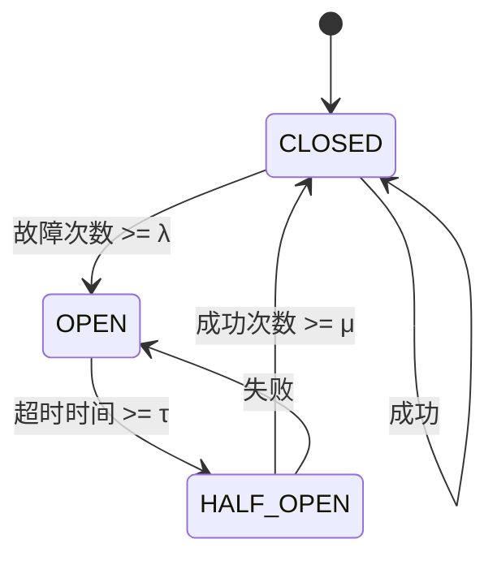
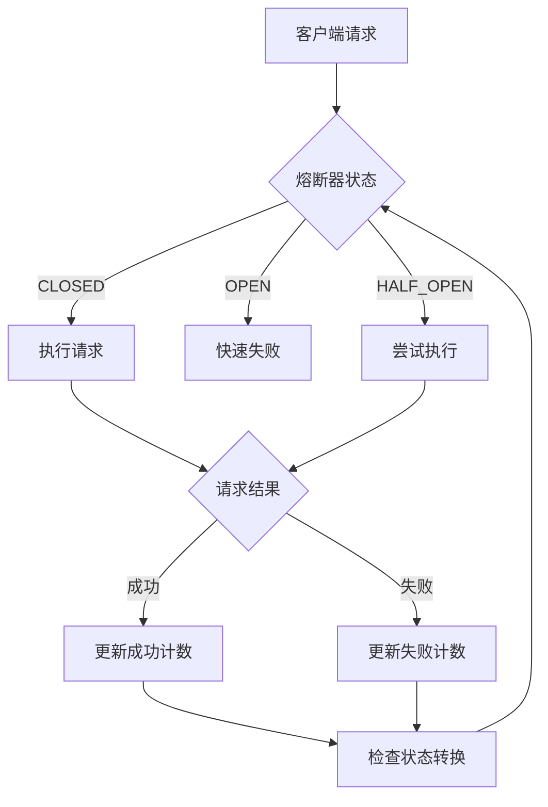
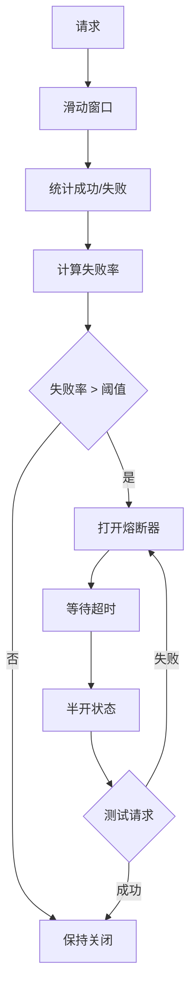

# 02-熔断器模式 (Circuit Breaker Pattern)

## 1. 概述

### 1.1 定义

熔断器模式是一种容错设计模式，用于防止级联故障。当依赖的服务出现故障时，熔断器会快速失败，避免系统资源耗尽，并在故障恢复后自动恢复服务。

### 1.2 形式化定义

设 ```latex
$S$
``` 为服务状态集合，```latex
$T$
``` 为时间集合，```latex
$F$
``` 为故障函数，则熔断器模式可形式化为：

$```latex
$CB = (S, T, F, \tau, \lambda, \mu)$
```$

其中：

- ```latex
$S = \{CLOSED, OPEN, HALF_OPEN\}$
``` 为状态集合
- ```latex
$F: T \rightarrow \{0, 1\}$
``` 为故障函数，```latex
$F(t) = 1$
``` 表示故障
- ```latex
$\tau$
``` 为超时阈值
- ```latex
$\lambda$
``` 为故障阈值
- ```latex
$\mu$
``` 为恢复阈值

### 1.3 状态转换



### 1.4 数学性质

**定理 2.1**: 熔断器的稳定性
对于任意时间 ```latex
$t \in T$
```，熔断器状态 ```latex
$s(t) \in S$
``` 是确定的，且状态转换是单调的。

**证明**:
根据状态转换规则，每个状态都有明确的转换条件，且转换是单向的，因此状态是确定的和单调的。

**定理 2.2**: 故障隔离性
当熔断器处于 OPEN 状态时，所有请求都会快速失败，不会传递到下游服务。

**证明**:
在 OPEN 状态下，熔断器直接返回错误，不执行实际的业务逻辑，因此实现了故障隔离。

## 2. 架构模式

### 2.1 基本熔断器



### 2.2 滑动窗口熔断器



## 3. Go语言实现

### 3.1 熔断器接口

```go
// CircuitBreaker 熔断器接口
type CircuitBreaker interface {
    // Execute 执行受保护的函数
    Execute(command func() (interface{}, error)) (interface{}, error)
    
    // ExecuteAsync 异步执行受保护的函数
    ExecuteAsync(command func() (interface{}, error)) <-chan Result
    
    // GetState 获取当前状态
    GetState() State
    
    // GetMetrics 获取指标
    GetMetrics() Metrics
}

// State 熔断器状态
type State int

const (
    StateClosed State = iota
    StateOpen
    StateHalfOpen
)

func (s State) String() string {
    switch s {
    case StateClosed:
        return "CLOSED"
    case StateOpen:
        return "OPEN"
    case StateHalfOpen:
        return "HALF_OPEN"
    default:
        return "UNKNOWN"
    }
}

// Result 执行结果
type Result struct {
    Value interface{}
    Error error
}

// Metrics 熔断器指标
type Metrics struct {
    TotalRequests    int64
    SuccessfulRequests int64
    FailedRequests   int64
    FailureRate      float64
    LastFailureTime  time.Time
    State            State
}
```

### 3.2 基本熔断器实现

```go
// BasicCircuitBreaker 基本熔断器
type BasicCircuitBreaker struct {
    state           State
    failureCount    int64
    successCount    int64
    failureThreshold int64
    successThreshold int64
    timeout         time.Duration
    lastFailureTime time.Time
    mutex           sync.RWMutex
}

// Config 熔断器配置
type Config struct {
    FailureThreshold int64         `json:"failure_threshold"`
    SuccessThreshold int64         `json:"success_threshold"`
    Timeout          time.Duration `json:"timeout"`
}

// NewBasicCircuitBreaker 创建基本熔断器
func NewBasicCircuitBreaker(config Config) *BasicCircuitBreaker {
    return &BasicCircuitBreaker{
        state:            StateClosed,
        failureThreshold: config.FailureThreshold,
        successThreshold: config.SuccessThreshold,
        timeout:          config.Timeout,
    }
}

// Execute 执行受保护的函数
func (cb *BasicCircuitBreaker) Execute(command func() (interface{}, error)) (interface{}, error) {
    // 检查状态
    if !cb.canExecute() {
        return nil, ErrCircuitBreakerOpen
    }
    
    // 执行命令
    result, err := command()
    
    // 更新状态
    cb.recordResult(err)
    
    return result, err
}

// ExecuteAsync 异步执行受保护的函数
func (cb *BasicCircuitBreaker) ExecuteAsync(command func() (interface{}, error)) <-chan Result {
    resultChan := make(chan Result, 1)
    
    go func() {
        defer close(resultChan)
        
        result, err := cb.Execute(command)
        resultChan <- Result{Value: result, Error: err}
    }()
    
    return resultChan
}

// GetState 获取当前状态
func (cb *BasicCircuitBreaker) GetState() State {
    cb.mutex.RLock()
    defer cb.mutex.RUnlock()
    return cb.state
}

// GetMetrics 获取指标
func (cb *BasicCircuitBreaker) GetMetrics() Metrics {
    cb.mutex.RLock()
    defer cb.mutex.RUnlock()
    
    total := cb.successCount + cb.failureCount
    failureRate := 0.0
    if total > 0 {
        failureRate = float64(cb.failureCount) / float64(total)
    }
    
    return Metrics{
        TotalRequests:      total,
        SuccessfulRequests: cb.successCount,
        FailedRequests:     cb.failureCount,
        FailureRate:        failureRate,
        LastFailureTime:    cb.lastFailureTime,
        State:              cb.state,
    }
}

// canExecute 检查是否可以执行
func (cb *BasicCircuitBreaker) canExecute() bool {
    cb.mutex.Lock()
    defer cb.mutex.Unlock()
    
    switch cb.state {
    case StateClosed:
        return true
    case StateOpen:
        // 检查是否超时
        if time.Since(cb.lastFailureTime) >= cb.timeout {
            cb.state = StateHalfOpen
            return true
        }
        return false
    case StateHalfOpen:
        return true
    default:
        return false
    }
}

// recordResult 记录执行结果
func (cb *BasicCircuitBreaker) recordResult(err error) {
    cb.mutex.Lock()
    defer cb.mutex.Unlock()
    
    if err != nil {
        cb.failureCount++
        cb.lastFailureTime = time.Now()
        
        // 检查是否需要打开熔断器
        if cb.failureCount >= cb.failureThreshold {
            cb.state = StateOpen
        }
    } else {
        cb.successCount++
        
        // 检查是否需要关闭熔断器
        if cb.state == StateHalfOpen && cb.successCount >= cb.successThreshold {
            cb.state = StateClosed
            cb.resetCounters()
        }
    }
}

// resetCounters 重置计数器
func (cb *BasicCircuitBreaker) resetCounters() {
    cb.failureCount = 0
    cb.successCount = 0
}

// 错误定义
var (
    ErrCircuitBreakerOpen = errors.New("circuit breaker is open")
)
```

### 3.3 滑动窗口熔断器实现

```go
// SlidingWindowCircuitBreaker 滑动窗口熔断器
type SlidingWindowCircuitBreaker struct {
    state           State
    windowSize      time.Duration
    failureThreshold float64
    successThreshold int64
    timeout         time.Duration
    lastFailureTime time.Time
    window          *SlidingWindow
    mutex           sync.RWMutex
}

// SlidingWindow 滑动窗口
type SlidingWindow struct {
    buckets    []Bucket
    bucketSize time.Duration
    current    int
    mutex      sync.RWMutex
}

// Bucket 时间桶
type Bucket struct {
    SuccessCount int64
    FailureCount int64
    StartTime    time.Time
}

// NewSlidingWindow 创建滑动窗口
func NewSlidingWindow(windowSize, bucketSize time.Duration) *SlidingWindow {
    bucketCount := int(windowSize / bucketSize)
    buckets := make([]Bucket, bucketCount)
    
    now := time.Now()
    for i := range buckets {
        buckets[i] = Bucket{
            StartTime: now.Add(time.Duration(i) * bucketSize),
        }
    }
    
    return &SlidingWindow{
        buckets:    buckets,
        bucketSize: bucketSize,
        current:    0,
    }
}

// RecordSuccess 记录成功
func (sw *SlidingWindow) RecordSuccess() {
    sw.mutex.Lock()
    defer sw.mutex.Unlock()
    
    sw.getCurrentBucket().SuccessCount++
}

// RecordFailure 记录失败
func (sw *SlidingWindow) RecordFailure() {
    sw.mutex.Lock()
    defer sw.mutex.Unlock()
    
    sw.getCurrentBucket().FailureCount++
}

// GetFailureRate 获取失败率
func (sw *SlidingWindow) GetFailureRate() float64 {
    sw.mutex.RLock()
    defer sw.mutex.RUnlock()
    
    var totalSuccess, totalFailure int64
    
    for _, bucket := range sw.buckets {
        totalSuccess += bucket.SuccessCount
        totalFailure += bucket.FailureCount
    }
    
    total := totalSuccess + totalFailure
    if total == 0 {
        return 0.0
    }
    
    return float64(totalFailure) / float64(total)
}

// GetSuccessCount 获取成功次数
func (sw *SlidingWindow) GetSuccessCount() int64 {
    sw.mutex.RLock()
    defer sw.mutex.RUnlock()
    
    var total int64
    for _, bucket := range sw.buckets {
        total += bucket.SuccessCount
    }
    return total
}

// getCurrentBucket 获取当前桶
func (sw *SlidingWindow) getCurrentBucket() *Bucket {
    now := time.Now()
    currentBucket := &sw.buckets[sw.current]
    
    // 检查是否需要移动到下一个桶
    if now.Sub(currentBucket.StartTime) >= sw.bucketSize {
        sw.current = (sw.current + 1) % len(sw.buckets)
        currentBucket = &sw.buckets[sw.current]
        currentBucket.StartTime = now
        currentBucket.SuccessCount = 0
        currentBucket.FailureCount = 0
    }
    
    return currentBucket
}

// SlidingWindowConfig 滑动窗口配置
type SlidingWindowConfig struct {
    WindowSize       time.Duration `json:"window_size"`
    BucketSize       time.Duration `json:"bucket_size"`
    FailureThreshold float64       `json:"failure_threshold"`
    SuccessThreshold int64         `json:"success_threshold"`
    Timeout          time.Duration `json:"timeout"`
}

// NewSlidingWindowCircuitBreaker 创建滑动窗口熔断器
func NewSlidingWindowCircuitBreaker(config SlidingWindowConfig) *SlidingWindowCircuitBreaker {
    return &SlidingWindowCircuitBreaker{
        state:            StateClosed,
        windowSize:       config.WindowSize,
        failureThreshold: config.FailureThreshold,
        successThreshold: config.SuccessThreshold,
        timeout:          config.Timeout,
        window:           NewSlidingWindow(config.WindowSize, config.BucketSize),
    }
}

// Execute 执行受保护的函数
func (cb *SlidingWindowCircuitBreaker) Execute(command func() (interface{}, error)) (interface{}, error) {
    // 检查状态
    if !cb.canExecute() {
        return nil, ErrCircuitBreakerOpen
    }
    
    // 执行命令
    result, err := command()
    
    // 更新状态
    cb.recordResult(err)
    
    return result, err
}

// ExecuteAsync 异步执行受保护的函数
func (cb *SlidingWindowCircuitBreaker) ExecuteAsync(command func() (interface{}, error)) <-chan Result {
    resultChan := make(chan Result, 1)
    
    go func() {
        defer close(resultChan)
        
        result, err := cb.Execute(command)
        resultChan <- Result{Value: result, Error: err}
    }()
    
    return resultChan
}

// GetState 获取当前状态
func (cb *SlidingWindowCircuitBreaker) GetState() State {
    cb.mutex.RLock()
    defer cb.mutex.RUnlock()
    return cb.state
}

// GetMetrics 获取指标
func (cb *SlidingWindowCircuitBreaker) GetMetrics() Metrics {
    cb.mutex.RLock()
    defer cb.mutex.RUnlock()
    
    failureRate := cb.window.GetFailureRate()
    successCount := cb.window.GetSuccessCount()
    
    return Metrics{
        TotalRequests:      int64(failureRate * 100), // 简化计算
        SuccessfulRequests: successCount,
        FailedRequests:     int64(failureRate * float64(successCount)),
        FailureRate:        failureRate,
        LastFailureTime:    cb.lastFailureTime,
        State:              cb.state,
    }
}

// canExecute 检查是否可以执行
func (cb *SlidingWindowCircuitBreaker) canExecute() bool {
    cb.mutex.Lock()
    defer cb.mutex.Unlock()
    
    switch cb.state {
    case StateClosed:
        return true
    case StateOpen:
        // 检查是否超时
        if time.Since(cb.lastFailureTime) >= cb.timeout {
            cb.state = StateHalfOpen
            return true
        }
        return false
    case StateHalfOpen:
        return true
    default:
        return false
    }
}

// recordResult 记录执行结果
func (cb *SlidingWindowCircuitBreaker) recordResult(err error) {
    cb.mutex.Lock()
    defer cb.mutex.Unlock()
    
    if err != nil {
        cb.window.RecordFailure()
        cb.lastFailureTime = time.Now()
        
        // 检查失败率
        failureRate := cb.window.GetFailureRate()
        if failureRate >= cb.failureThreshold {
            cb.state = StateOpen
        }
    } else {
        cb.window.RecordSuccess()
        
        // 检查是否需要关闭熔断器
        if cb.state == StateHalfOpen {
            successCount := cb.window.GetSuccessCount()
            if successCount >= cb.successThreshold {
                cb.state = StateClosed
            }
        }
    }
}
```

### 3.4 装饰器模式实现

```go
// CircuitBreakerDecorator 熔断器装饰器
type CircuitBreakerDecorator struct {
    circuitBreaker CircuitBreaker
    fallback       func(error) (interface{}, error)
}

// NewCircuitBreakerDecorator 创建熔断器装饰器
func NewCircuitBreakerDecorator(cb CircuitBreaker, fallback func(error) (interface{}, error)) *CircuitBreakerDecorator {
    return &CircuitBreakerDecorator{
        circuitBreaker: cb,
        fallback:       fallback,
    }
}

// Execute 执行带降级的函数
func (d *CircuitBreakerDecorator) Execute(command func() (interface{}, error)) (interface{}, error) {
    result, err := d.circuitBreaker.Execute(command)
    
    if err != nil && d.fallback != nil {
        return d.fallback(err)
    }
    
    return result, err
}

// ExecuteAsync 异步执行带降级的函数
func (d *CircuitBreakerDecorator) ExecuteAsync(command func() (interface{}, error)) <-chan Result {
    resultChan := make(chan Result, 1)
    
    go func() {
        defer close(resultChan)
        
        result, err := d.Execute(command)
        resultChan <- Result{Value: result, Error: err}
    }()
    
    return resultChan
}

// GetState 获取当前状态
func (d *CircuitBreakerDecorator) GetState() State {
    return d.circuitBreaker.GetState()
}

// GetMetrics 获取指标
func (d *CircuitBreakerDecorator) GetMetrics() Metrics {
    return d.circuitBreaker.GetMetrics()
}
```

## 4. 性能分析

### 4.1 时间复杂度

- **状态检查**: ```latex
$O(1)$
```
- **结果记录**: ```latex
$O(1)$
```
- **滑动窗口统计**: ```latex
$O(b)$
```，其中 ```latex
$b$
``` 为桶数量
- **状态转换**: ```latex
$O(1)$
```

### 4.2 空间复杂度

- **基本熔断器**: ```latex
$O(1)$
```
- **滑动窗口熔断器**: ```latex
$O(b)$
```，其中 ```latex
$b$
``` 为桶数量

### 4.3 故障隔离效果

**定理 4.1**: 故障隔离效果
当熔断器处于 OPEN 状态时，系统响应时间从 ```latex
$T_{service}$
``` 降低到 ```latex
$T_{circuit}$
```，其中 ```latex
$T_{circuit} \ll T_{service}$
```。

**证明**:
在 OPEN 状态下，熔断器直接返回错误，不调用下游服务，因此响应时间显著降低。

## 5. 使用示例

### 5.1 基本使用

```go
func main() {
    // 创建熔断器
    config := Config{
        FailureThreshold: 5,
        SuccessThreshold: 3,
        Timeout:          30 * time.Second,
    }
    
    cb := NewBasicCircuitBreaker(config)
    
    // 定义受保护的函数
    protectedFunc := func() (interface{}, error) {
        // 模拟可能失败的操作
        if rand.Float64() < 0.3 {
            return nil, errors.New("service unavailable")
        }
        return "success", nil
    }
    
    // 执行函数
    for i := 0; i < 10; i++ {
        result, err := cb.Execute(protectedFunc)
        if err != nil {
            fmt.Printf("Request %d failed: %v\n", i+1, err)
        } else {
            fmt.Printf("Request %d succeeded: %v\n", i+1, result)
        }
        
        // 打印状态
        fmt.Printf("Circuit breaker state: %s\n", cb.GetState())
        
        time.Sleep(1 * time.Second)
    }
}
```

### 5.2 滑动窗口使用

```go
func main() {
    // 创建滑动窗口熔断器
    config := SlidingWindowConfig{
        WindowSize:       60 * time.Second,
        BucketSize:       10 * time.Second,
        FailureThreshold: 0.5, // 50% 失败率
        SuccessThreshold: 5,
        Timeout:          30 * time.Second,
    }
    
    cb := NewSlidingWindowCircuitBreaker(config)
    
    // 模拟高负载场景
    for i := 0; i < 100; i++ {
        go func(id int) {
            result, err := cb.Execute(func() (interface{}, error) {
                // 模拟网络延迟
                time.Sleep(time.Duration(rand.Intn(100)) * time.Millisecond)
                
                // 模拟失败
                if rand.Float64() < 0.4 {
                    return nil, errors.New("service error")
                }
                return fmt.Sprintf("result-%d", id), nil
            })
            
            if err != nil {
                fmt.Printf("Request %d failed: %v\n", id, err)
            } else {
                fmt.Printf("Request %d succeeded: %v\n", id, result)
            }
        }(i)
    }
    
    // 监控熔断器状态
    go func() {
        ticker := time.NewTicker(5 * time.Second)
        defer ticker.Stop()
        
        for range ticker.C {
            metrics := cb.GetMetrics()
            fmt.Printf("State: %s, Failure Rate: %.2f%%, Total: %d\n",
                metrics.State, metrics.FailureRate*100, metrics.TotalRequests)
        }
    }()
    
    time.Sleep(2 * time.Minute)
}
```

### 5.3 带降级的使用

```go
func main() {
    // 创建熔断器
    cb := NewBasicCircuitBreaker(Config{
        FailureThreshold: 3,
        SuccessThreshold: 2,
        Timeout:          10 * time.Second,
    })
    
    // 定义降级函数
    fallback := func(err error) (interface{}, error) {
        return "fallback response", nil
    }
    
    // 创建装饰器
    decorator := NewCircuitBreakerDecorator(cb, fallback)
    
    // 执行带降级的函数
    result, err := decorator.Execute(func() (interface{}, error) {
        // 模拟服务调用
        if rand.Float64() < 0.5 {
            return nil, errors.New("service unavailable")
        }
        return "primary response", nil
    })
    
    if err != nil {
        fmt.Printf("Error: %v\n", err)
    } else {
        fmt.Printf("Result: %v\n", result)
    }
}
```

## 6. 最佳实践

### 6.1 配置建议

```go
type CircuitBreakerBestPractices struct {
    // 高延迟服务
    HighLatencyService Config = Config{
        FailureThreshold: 10,
        SuccessThreshold: 5,
        Timeout:          60 * time.Second,
    }
    
    // 关键服务
    CriticalService Config = Config{
        FailureThreshold: 3,
        SuccessThreshold: 2,
        Timeout:          30 * time.Second,
    }
    
    // 非关键服务
    NonCriticalService Config = Config{
        FailureThreshold: 20,
        SuccessThreshold: 10,
        Timeout:          120 * time.Second,
    }
}
```

### 6.2 监控指标

```go
type CircuitBreakerMonitor struct {
    // 状态变化
    StateTransitions map[State]int64
    
    // 请求统计
    TotalRequests    int64
    SuccessfulRequests int64
    FailedRequests   int64
    RejectedRequests int64
    
    // 延迟统计
    AverageLatency   time.Duration
    P95Latency       time.Duration
    P99Latency       time.Duration
}

func (m *CircuitBreakerMonitor) RecordRequest(state State, success bool, latency time.Duration) {
    atomic.AddInt64(&m.TotalRequests, 1)
    
    if success {
        atomic.AddInt64(&m.SuccessfulRequests, 1)
    } else {
        atomic.AddInt64(&m.FailedRequests, 1)
    }
    
    if state == StateOpen {
        atomic.AddInt64(&m.RejectedRequests, 1)
    }
    
    // 更新延迟统计（简化实现）
    // 实际应用中应使用更复杂的统计方法
}
```

## 7. 总结

熔断器模式是构建可靠分布式系统的重要工具，通过Go语言的并发特性和简洁语法，可以高效实现：

1. **故障隔离**: 防止级联故障传播
2. **快速失败**: 减少系统资源消耗
3. **自动恢复**: 在故障恢复后自动重试
4. **灵活配置**: 支持多种配置策略
5. **监控友好**: 提供丰富的监控指标

通过合理使用熔断器模式，可以显著提高系统的可用性和稳定性。
