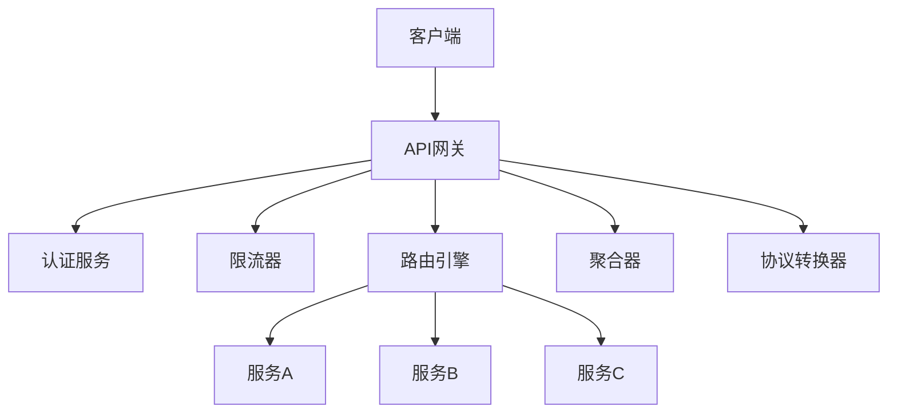

# 03-API网关模式 (API Gateway Pattern)

## 1. 概述

### 1.1 定义

API网关模式是微服务架构中的核心组件，作为所有客户端请求的统一入口点，负责路由、聚合、协议转换、认证授权、限流熔断等功能。

### 1.2 形式化定义

设 ```latex
$C$
``` 为客户端集合，```latex
$S$
``` 为服务集合，```latex
$R$
``` 为请求集合，```latex
$P$
``` 为策略集合，则API网关可形式化为：

$```latex
$AG = (C, S, R, P, \rho, \alpha, \tau)$
```$

其中：

- ```latex
$\rho: R \rightarrow S$
``` 为路由函数
- ```latex
$\alpha: R \rightarrow \{true, false\}$
``` 为认证函数
- ```latex
$\tau: R \rightarrow R'$
``` 为转换函数

### 1.3 架构模式



## 2. 核心功能

### 2.1 路由功能

```go
// Router 路由接口
type Router interface {
    // Route 路由请求到目标服务
    Route(request *Request) (*Response, error)
    
    // AddRoute 添加路由规则
    AddRoute(rule *RouteRule) error
    
    // RemoveRoute 移除路由规则
    RemoveRoute(ruleID string) error
}

// RouteRule 路由规则
type RouteRule struct {
    ID          string            `json:"id"`
    Path        string            `json:"path"`
    Method      string            `json:"method"`
    ServiceName string            `json:"service_name"`
    ServiceURL  string            `json:"service_url"`
    Priority    int               `json:"priority"`
    Headers     map[string]string `json:"headers"`
    Timeout     time.Duration     `json:"timeout"`
}

// Request 请求
type Request struct {
    ID       string            `json:"id"`
    Method   string            `json:"method"`
    Path     string            `json:"path"`
    Headers  map[string]string `json:"headers"`
    Body     []byte            `json:"body"`
    ClientIP string            `json:"client_ip"`
    UserID   string            `json:"user_id"`
}

// Response 响应
type Response struct {
    StatusCode int               `json:"status_code"`
    Headers    map[string]string `json:"headers"`
    Body       []byte            `json:"body"`
    Latency    time.Duration     `json:"latency"`
}
```

### 2.2 路由引擎实现

```go
// RouteEngine 路由引擎
type RouteEngine struct {
    rules    []*RouteRule
    mutex    sync.RWMutex
    matcher  *PathMatcher
}

// NewRouteEngine 创建路由引擎
func NewRouteEngine() *RouteEngine {
    return &RouteEngine{
        rules:   make([]*RouteRule, 0),
        matcher: NewPathMatcher(),
    }
}

// AddRoute 添加路由规则
func (re *RouteEngine) AddRoute(rule *RouteRule) error {
    re.mutex.Lock()
    defer re.mutex.Unlock()
    
    // 验证规则
    if err := re.validateRule(rule); err != nil {
        return err
    }
    
    // 按优先级排序插入
    re.insertRuleByPriority(rule)
    
    return nil
}

// Route 路由请求
func (re *RouteEngine) Route(request *Request) (*Response, error) {
    re.mutex.RLock()
    defer re.mutex.RUnlock()
    
    // 查找匹配的路由规则
    rule := re.findMatchingRule(request)
    if rule == nil {
        return nil, ErrRouteNotFound
    }
    
    // 转发请求到目标服务
    return re.forwardRequest(request, rule)
}

// findMatchingRule 查找匹配的路由规则
func (re *RouteEngine) findMatchingRule(request *Request) *RouteRule {
    for _, rule := range re.rules {
        if re.matcher.Match(request.Path, rule.Path) && 
           strings.EqualFold(request.Method, rule.Method) {
            return rule
        }
    }
    return nil
}

// forwardRequest 转发请求
func (re *RouteEngine) forwardRequest(request *Request, rule *RouteRule) (*Response, error) {
    // 创建HTTP客户端
    client := &http.Client{
        Timeout: rule.Timeout,
    }
    
    // 构建目标URL
    targetURL := rule.ServiceURL + request.Path
    
    // 创建HTTP请求
    httpReq, err := http.NewRequest(request.Method, targetURL, bytes.NewReader(request.Body))
    if err != nil {
        return nil, err
    }
    
    // 复制请求头
    for key, value := range request.Headers {
        httpReq.Header.Set(key, value)
    }
    
    // 添加路由规则指定的头
    for key, value := range rule.Headers {
        httpReq.Header.Set(key, value)
    }
    
    // 发送请求
    start := time.Now()
    resp, err := client.Do(httpReq)
    if err != nil {
        return nil, err
    }
    defer resp.Body.Close()
    
    // 读取响应体
    body, err := io.ReadAll(resp.Body)
    if err != nil {
        return nil, err
    }
    
    // 构建响应
    response := &Response{
        StatusCode: resp.StatusCode,
        Headers:    make(map[string]string),
        Body:       body,
        Latency:    time.Since(start),
    }
    
    // 复制响应头
    for key, values := range resp.Header {
        if len(values) > 0 {
            response.Headers[key] = values[0]
        }
    }
    
    return response, nil
}

// PathMatcher 路径匹配器
type PathMatcher struct {
    patterns map[string]*regexp.Regexp
}

// NewPathMatcher 创建路径匹配器
func NewPathMatcher() *PathMatcher {
    return &PathMatcher{
        patterns: make(map[string]*regexp.Regexp),
    }
}

// Match 匹配路径
func (pm *PathMatcher) Match(path, pattern string) bool {
    // 检查是否已编译
    if regex, exists := pm.patterns[pattern]; exists {
        return regex.MatchString(path)
    }
    
    // 编译模式
    regex := pm.compilePattern(pattern)
    pm.patterns[pattern] = regex
    
    return regex.MatchString(path)
}

// compilePattern 编译路径模式
func (pm *PathMatcher) compilePattern(pattern string) *regexp.Regexp {
    // 将路径模式转换为正则表达式
    // 例如: /users/{id} -> ^/users/([^/]+)$
    regexStr := strings.ReplaceAll(pattern, "{", "([^/]+)")
    regexStr = strings.ReplaceAll(regexStr, "}", "")
    regexStr = "^" + regexStr + "$"
    
    return regexp.MustCompile(regexStr)
}
```

### 2.3 认证授权

```go
// Authenticator 认证器接口
type Authenticator interface {
    // Authenticate 认证请求
    Authenticate(request *Request) (*AuthResult, error)
    
    // Authorize 授权请求
    Authorize(request *Request, resource string, action string) (bool, error)
}

// AuthResult 认证结果
type AuthResult struct {
    UserID    string            `json:"user_id"`
    Username  string            `json:"username"`
    Roles     []string          `json:"roles"`
    Permissions []string        `json:"permissions"`
    Metadata  map[string]string `json:"metadata"`
}

// JWTAuthenticator JWT认证器
type JWTAuthenticator struct {
    secretKey []byte
    parser    *jwt.Parser
}

// NewJWTAuthenticator 创建JWT认证器
func NewJWTAuthenticator(secretKey string) *JWTAuthenticator {
    return &JWTAuthenticator{
        secretKey: []byte(secretKey),
        parser:    jwt.NewParser(jwt.SigningMethodHS256),
    }
}

// Authenticate 认证请求
func (ja *JWTAuthenticator) Authenticate(request *Request) (*AuthResult, error) {
    // 从请求头获取JWT token
    token := request.Headers["Authorization"]
    if token == "" {
        return nil, ErrUnauthorized
    }
    
    // 移除Bearer前缀
    if strings.HasPrefix(token, "Bearer ") {
        token = token[7:]
    }
    
    // 解析JWT
    claims := &JWTClaims{}
    _, err := ja.parser.ParseWithClaims(token, claims, func(token *jwt.Token) (interface{}, error) {
        return ja.secretKey, nil
    })
    
    if err != nil {
        return nil, ErrUnauthorized
    }
    
    return &AuthResult{
        UserID:      claims.UserID,
        Username:    claims.Username,
        Roles:       claims.Roles,
        Permissions: claims.Permissions,
        Metadata:    claims.Metadata,
    }, nil
}

// JWTClaims JWT声明
type JWTClaims struct {
    UserID      string            `json:"user_id"`
    Username    string            `json:"username"`
    Roles       []string          `json:"roles"`
    Permissions []string          `json:"permissions"`
    Metadata    map[string]string `json:"metadata"`
    jwt.StandardClaims
}

// Authorize 授权请求
func (ja *JWTAuthenticator) Authorize(request *Request, resource string, action string) (bool, error) {
    // 先认证
    authResult, err := ja.Authenticate(request)
    if err != nil {
        return false, err
    }
    
    // 检查权限
    requiredPermission := fmt.Sprintf("%s:%s", resource, action)
    for _, permission := range authResult.Permissions {
        if permission == requiredPermission {
            return true, nil
        }
    }
    
    return false, ErrForbidden
}
```

### 2.4 限流器

```go
// RateLimiter 限流器接口
type RateLimiter interface {
    // Allow 检查是否允许请求
    Allow(key string) (bool, error)
    
    // GetLimit 获取限流配置
    GetLimit(key string) (*LimitConfig, error)
    
    // SetLimit 设置限流配置
    SetLimit(key string, config *LimitConfig) error
}

// LimitConfig 限流配置
type LimitConfig struct {
    Requests int           `json:"requests"`
    Window   time.Duration `json:"window"`
    Burst    int           `json:"burst"`
}

// TokenBucketRateLimiter 令牌桶限流器
type TokenBucketRateLimiter struct {
    buckets map[string]*TokenBucket
    mutex   sync.RWMutex
}

// TokenBucket 令牌桶
type TokenBucket struct {
    tokens     float64
    capacity   float64
    rate       float64
    lastRefill time.Time
    mutex      sync.Mutex
}

// NewTokenBucketRateLimiter 创建令牌桶限流器
func NewTokenBucketRateLimiter() *TokenBucketRateLimiter {
    return &TokenBucketRateLimiter{
        buckets: make(map[string]*TokenBucket),
    }
}

// Allow 检查是否允许请求
func (rl *TokenBucketRateLimiter) Allow(key string) (bool, error) {
    rl.mutex.RLock()
    bucket, exists := rl.buckets[key]
    rl.mutex.RUnlock()
    
    if !exists {
        return false, ErrLimitNotFound
    }
    
    bucket.mutex.Lock()
    defer bucket.mutex.Unlock()
    
    // 补充令牌
    rl.refillBucket(bucket)
    
    // 检查是否有可用令牌
    if bucket.tokens >= 1.0 {
        bucket.tokens -= 1.0
        return true, nil
    }
    
    return false, nil
}

// refillBucket 补充令牌桶
func (rl *TokenBucketRateLimiter) refillBucket(bucket *TokenBucket) {
    now := time.Now()
    elapsed := now.Sub(bucket.lastRefill).Seconds()
    
    // 计算需要补充的令牌数
    tokensToAdd := elapsed * bucket.rate
    if tokensToAdd > 0 {
        bucket.tokens = math.Min(bucket.capacity, bucket.tokens+tokensToAdd)
        bucket.lastRefill = now
    }
}

// SetLimit 设置限流配置
func (rl *TokenBucketRateLimiter) SetLimit(key string, config *LimitConfig) error {
    rl.mutex.Lock()
    defer rl.mutex.Unlock()
    
    rate := float64(config.Requests) / config.Window.Seconds()
    
    rl.buckets[key] = &TokenBucket{
        tokens:     float64(config.Burst),
        capacity:   float64(config.Burst),
        rate:       rate,
        lastRefill: time.Now(),
    }
    
    return nil
}
```

### 2.5 API网关核心

```go
// APIGateway API网关
type APIGateway struct {
    router       Router
    authenticator Authenticator
    rateLimiter  RateLimiter
    circuitBreaker CircuitBreaker
    aggregator   *ResponseAggregator
    transformer  *ProtocolTransformer
    middleware   []Middleware
}

// NewAPIGateway 创建API网关
func NewAPIGateway() *APIGateway {
    return &APIGateway{
        router:        NewRouteEngine(),
        authenticator: NewJWTAuthenticator("your-secret-key"),
        rateLimiter:   NewTokenBucketRateLimiter(),
        circuitBreaker: NewBasicCircuitBreaker(Config{
            FailureThreshold: 5,
            SuccessThreshold: 3,
            Timeout:          30 * time.Second,
        }),
        aggregator:    NewResponseAggregator(),
        transformer:   NewProtocolTransformer(),
        middleware:    make([]Middleware, 0),
    }
}

// HandleRequest 处理请求
func (ag *APIGateway) HandleRequest(request *Request) (*Response, error) {
    // 执行中间件链
    for _, middleware := range ag.middleware {
        if err := middleware.Before(request); err != nil {
            return nil, err
        }
    }
    
    // 限流检查
    if allowed, err := ag.rateLimiter.Allow(request.ClientIP); err != nil || !allowed {
        return nil, ErrRateLimitExceeded
    }
    
    // 认证
    authResult, err := ag.authenticator.Authenticate(request)
    if err != nil {
        return nil, err
    }
    request.UserID = authResult.UserID
    
    // 路由请求
    response, err := ag.router.Route(request)
    if err != nil {
        return nil, err
    }
    
    // 执行后置中间件
    for i := len(ag.middleware) - 1; i >= 0; i-- {
        ag.middleware[i].After(request, response)
    }
    
    return response, nil
}

// AddMiddleware 添加中间件
func (ag *APIGateway) AddMiddleware(middleware Middleware) {
    ag.middleware = append(ag.middleware, middleware)
}

// Middleware 中间件接口
type Middleware interface {
    Before(request *Request) error
    After(request *Request, response *Response)
}

// LoggingMiddleware 日志中间件
type LoggingMiddleware struct {
    logger *log.Logger
}

func (lm *LoggingMiddleware) Before(request *Request) error {
    lm.logger.Printf("Request: %s %s from %s", request.Method, request.Path, request.ClientIP)
    return nil
}

func (lm *LoggingMiddleware) After(request *Request, response *Response) {
    lm.logger.Printf("Response: %d in %v", response.StatusCode, response.Latency)
}
```

## 3. 高级功能

### 3.1 响应聚合

```go
// ResponseAggregator 响应聚合器
type ResponseAggregator struct {
    client *http.Client
}

// NewResponseAggregator 创建响应聚合器
func NewResponseAggregator() *ResponseAggregator {
    return &ResponseAggregator{
        client: &http.Client{
            Timeout: 30 * time.Second,
        },
    }
}

// Aggregate 聚合多个服务响应
func (ra *ResponseAggregator) Aggregate(requests []*AggregationRequest) (*Response, error) {
    // 并发执行请求
    results := make(chan *AggregationResult, len(requests))
    errors := make(chan error, len(requests))
    
    for _, req := range requests {
        go func(r *AggregationRequest) {
            result, err := ra.executeRequest(r)
            if err != nil {
                errors <- err
            } else {
                results <- result
            }
        }(req)
    }
    
    // 收集结果
    var aggregatedData []interface{}
    var errs []error
    
    for i := 0; i < len(requests); i++ {
        select {
        case result := <-results:
            aggregatedData = append(aggregatedData, result.Data)
        case err := <-errors:
            errs = append(errs, err)
        }
    }
    
    // 如果有错误，返回部分结果
    if len(errs) > 0 {
        // 可以选择返回部分结果或全部失败
        return nil, fmt.Errorf("aggregation failed: %v", errs)
    }
    
    // 构建聚合响应
    body, err := json.Marshal(aggregatedData)
    if err != nil {
        return nil, err
    }
    
    return &Response{
        StatusCode: http.StatusOK,
        Headers:    map[string]string{"Content-Type": "application/json"},
        Body:       body,
    }, nil
}

// AggregationRequest 聚合请求
type AggregationRequest struct {
    ServiceName string            `json:"service_name"`
    URL         string            `json:"url"`
    Method      string            `json:"method"`
    Headers     map[string]string `json:"headers"`
    Body        []byte            `json:"body"`
}

// AggregationResult 聚合结果
type AggregationResult struct {
    ServiceName string      `json:"service_name"`
    Data        interface{} `json:"data"`
    StatusCode  int         `json:"status_code"`
}
```

### 3.2 协议转换

```go
// ProtocolTransformer 协议转换器
type ProtocolTransformer struct {
    transformers map[string]Transformer
}

// Transformer 转换器接口
type Transformer interface {
    Transform(request *Request) (*Request, error)
    CanTransform(protocol string) bool
}

// NewProtocolTransformer 创建协议转换器
func NewProtocolTransformer() *ProtocolTransformer {
    pt := &ProtocolTransformer{
        transformers: make(map[string]Transformer),
    }
    
    // 注册转换器
    pt.RegisterTransformer("grpc", &GRPCTransformer{})
    pt.RegisterTransformer("graphql", &GraphQLTransformer{})
    
    return pt
}

// RegisterTransformer 注册转换器
func (pt *ProtocolTransformer) RegisterTransformer(protocol string, transformer Transformer) {
    pt.transformers[protocol] = transformer
}

// Transform 转换请求
func (pt *ProtocolTransformer) Transform(request *Request, targetProtocol string) (*Request, error) {
    transformer, exists := pt.transformers[targetProtocol]
    if !exists {
        return nil, fmt.Errorf("unsupported protocol: %s", targetProtocol)
    }
    
    return transformer.Transform(request)
}

// GRPCTransformer gRPC转换器
type GRPCTransformer struct{}

func (gt *GRPCTransformer) CanTransform(protocol string) bool {
    return protocol == "grpc"
}

func (gt *GRPCTransformer) Transform(request *Request) (*Request, error) {
    // 实现HTTP到gRPC的转换
    // 这里简化实现
    return request, nil
}

// GraphQLTransformer GraphQL转换器
type GraphQLTransformer struct{}

func (gqt *GraphQLTransformer) CanTransform(protocol string) bool {
    return protocol == "graphql"
}

func (gqt *GraphQLTransformer) Transform(request *Request) (*Request, error) {
    // 实现REST到GraphQL的转换
    // 这里简化实现
    return request, nil
}
```

## 4. 使用示例

### 4.1 基本使用

```go
func main() {
    // 创建API网关
    gateway := NewAPIGateway()
    
    // 添加路由规则
    gateway.router.AddRoute(&RouteRule{
        ID:          "user-service",
        Path:        "/users/{id}",
        Method:      "GET",
        ServiceName: "user-service",
        ServiceURL:  "http://localhost:8081",
        Timeout:     5 * time.Second,
    })
    
    // 设置限流
    gateway.rateLimiter.SetLimit("default", &LimitConfig{
        Requests: 100,
        Window:   1 * time.Minute,
        Burst:    10,
    })
    
    // 添加中间件
    gateway.AddMiddleware(&LoggingMiddleware{
        logger: log.New(os.Stdout, "[API Gateway] ", log.LstdFlags),
    })
    
    // 启动HTTP服务器
    http.HandleFunc("/", func(w http.ResponseWriter, r *http.Request) {
        // 构建请求
        body, _ := io.ReadAll(r.Body)
        request := &Request{
            ID:       uuid.New().String(),
            Method:   r.Method,
            Path:     r.URL.Path,
            Headers:  make(map[string]string),
            Body:     body,
            ClientIP: r.RemoteAddr,
        }
        
        // 复制请求头
        for key, values := range r.Header {
            if len(values) > 0 {
                request.Headers[key] = values[0]
            }
        }
        
        // 处理请求
        response, err := gateway.HandleRequest(request)
        if err != nil {
            http.Error(w, err.Error(), http.StatusInternalServerError)
            return
        }
        
        // 返回响应
        for key, value := range response.Headers {
            w.Header().Set(key, value)
        }
        w.WriteHeader(response.StatusCode)
        w.Write(response.Body)
    })
    
    log.Fatal(http.ListenAndServe(":8080", nil))
}
```

### 4.2 聚合请求示例

```go
func main() {
    gateway := NewAPIGateway()
    aggregator := gateway.aggregator
    
    // 定义聚合请求
    requests := []*AggregationRequest{
        {
            ServiceName: "user-service",
            URL:         "http://localhost:8081/users/123",
            Method:      "GET",
        },
        {
            ServiceName: "order-service",
            URL:         "http://localhost:8082/users/123/orders",
            Method:      "GET",
        },
        {
            ServiceName: "payment-service",
            URL:         "http://localhost:8083/users/123/payments",
            Method:      "GET",
        },
    }
    
    // 执行聚合
    response, err := aggregator.Aggregate(requests)
    if err != nil {
        log.Fatal(err)
    }
    
    fmt.Printf("Aggregated response: %s\n", string(response.Body))
}
```

## 5. 性能优化

### 5.1 连接池

```go
// ConnectionPool 连接池
type ConnectionPool struct {
    connections map[string]*http.Client
    mutex       sync.RWMutex
    config      *PoolConfig
}

// PoolConfig 连接池配置
type PoolConfig struct {
    MaxIdleConns        int           `json:"max_idle_conns"`
    MaxIdleConnsPerHost int           `json:"max_idle_conns_per_host"`
    IdleConnTimeout     time.Duration `json:"idle_conn_timeout"`
    MaxConnsPerHost     int           `json:"max_conns_per_host"`
}

// GetClient 获取HTTP客户端
func (cp *ConnectionPool) GetClient(serviceName string) *http.Client {
    cp.mutex.RLock()
    if client, exists := cp.connections[serviceName]; exists {
        cp.mutex.RUnlock()
        return client
    }
    cp.mutex.RUnlock()
    
    cp.mutex.Lock()
    defer cp.mutex.Unlock()
    
    // 双重检查
    if client, exists := cp.connections[serviceName]; exists {
        return client
    }
    
    // 创建新的客户端
    transport := &http.Transport{
        MaxIdleConns:        cp.config.MaxIdleConns,
        MaxIdleConnsPerHost: cp.config.MaxIdleConnsPerHost,
        IdleConnTimeout:     cp.config.IdleConnTimeout,
        MaxConnsPerHost:     cp.config.MaxConnsPerHost,
    }
    
    client := &http.Client{
        Transport: transport,
        Timeout:   30 * time.Second,
    }
    
    cp.connections[serviceName] = client
    return client
}
```

### 5.2 缓存

```go
// Cache 缓存接口
type Cache interface {
    Get(key string) (interface{}, bool)
    Set(key string, value interface{}, ttl time.Duration)
    Delete(key string)
}

// MemoryCache 内存缓存
type MemoryCache struct {
    data map[string]*CacheItem
    mutex sync.RWMutex
}

// CacheItem 缓存项
type CacheItem struct {
    Value     interface{}
    ExpiresAt time.Time
}

// Get 获取缓存
func (mc *MemoryCache) Get(key string) (interface{}, bool) {
    mc.mutex.RLock()
    defer mc.mutex.RUnlock()
    
    item, exists := mc.data[key]
    if !exists {
        return nil, false
    }
    
    if time.Now().After(item.ExpiresAt) {
        delete(mc.data, key)
        return nil, false
    }
    
    return item.Value, true
}

// Set 设置缓存
func (mc *MemoryCache) Set(key string, value interface{}, ttl time.Duration) {
    mc.mutex.Lock()
    defer mc.mutex.Unlock()
    
    mc.data[key] = &CacheItem{
        Value:     value,
        ExpiresAt: time.Now().Add(ttl),
    }
}
```

## 6. 监控和指标

```go
// Metrics 指标收集器
type Metrics struct {
    RequestCount    int64
    ResponseTime    time.Duration
    ErrorCount      int64
    ActiveRequests  int64
    mutex           sync.RWMutex
}

// RecordRequest 记录请求
func (m *Metrics) RecordRequest(duration time.Duration, isError bool) {
    m.mutex.Lock()
    defer m.mutex.Unlock()
    
    m.RequestCount++
    m.ResponseTime = duration
    if isError {
        m.ErrorCount++
    }
}

// GetMetrics 获取指标
func (m *Metrics) GetMetrics() map[string]interface{} {
    m.mutex.RLock()
    defer m.mutex.RUnlock()
    
    return map[string]interface{}{
        "request_count":   m.RequestCount,
        "response_time":   m.ResponseTime,
        "error_count":     m.ErrorCount,
        "error_rate":      float64(m.ErrorCount) / float64(m.RequestCount),
        "active_requests": m.ActiveRequests,
    }
}
```

## 7. 总结

API网关模式是微服务架构的重要组成部分，通过Go语言实现可以提供：

1. **统一入口**: 所有客户端请求的统一入口点
2. **路由转发**: 智能路由到后端服务
3. **认证授权**: 统一的身份认证和权限控制
4. **限流熔断**: 保护后端服务免受过载
5. **协议转换**: 支持多种协议间的转换
6. **响应聚合**: 组合多个服务的响应
7. **监控指标**: 全面的监控和指标收集

通过合理使用API网关，可以构建出高性能、可靠、易维护的微服务架构。
