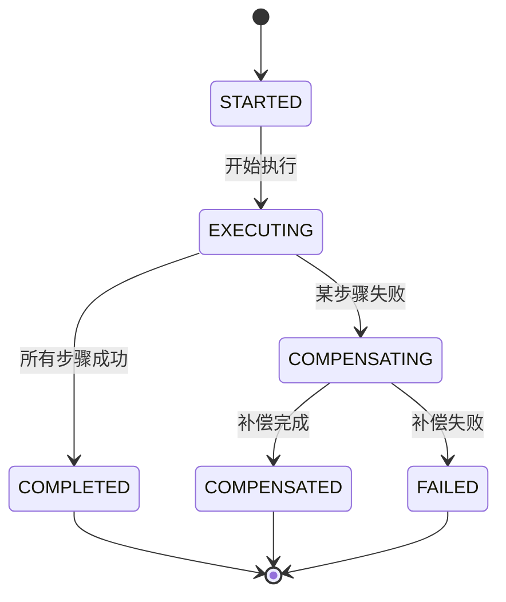
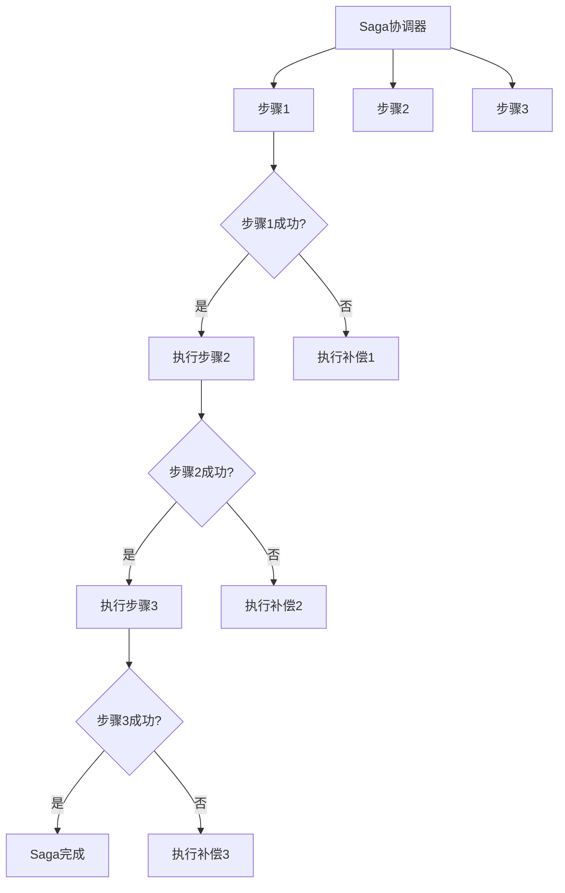
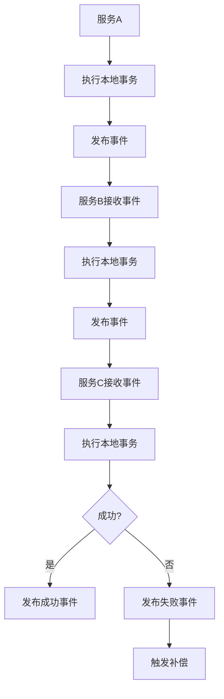

# 04-Saga模式 (Saga Pattern)

## 1. 概述

### 1.1 定义

Saga模式是一种用于管理分布式事务的设计模式，通过将长事务分解为一系列本地事务，每个本地事务都有对应的补偿操作，确保最终一致性。

### 1.2 形式化定义

设 ```latex
T
``` 为事务集合，```latex
S
``` 为步骤集合，```latex
C
``` 为补偿操作集合，则Saga模式可形式化为：

$```latex
Saga = (T, S, C, \sigma, \rho)
```$

其中：

- ```latex
\sigma: T \rightarrow 2^S
``` 为事务到步骤的映射
- ```latex
\rho: S \rightarrow C
``` 为步骤到补偿操作的映射

### 1.3 数学性质

**定理 4.1**: Saga的最终一致性
对于任意Saga事务，如果所有正向步骤都成功执行，或者所有补偿步骤都成功执行，则系统最终达到一致状态。

**证明**:
根据Saga的定义，每个步骤都有对应的补偿操作，且补偿操作是幂等的。因此，无论正向执行还是补偿执行，都能达到一致状态。

### 1.4 状态转换



## 2. 架构模式

### 2.1 编排式Saga



### 2.2 协同式Saga



## 3. Go语言实现

### 3.1 核心接口

```go
// Saga 事务接口
type Saga interface {
    // Execute 执行Saga事务
    Execute(ctx context.Context) error
    
    // Compensate 补偿Saga事务
    Compensate(ctx context.Context) error
    
    // GetStatus 获取状态
    GetStatus() SagaStatus
    
    // GetID 获取ID
    GetID() string
}

// Step 步骤接口
type Step interface {
    // Execute 执行步骤
    Execute(ctx context.Context) error
    
    // Compensate 补偿步骤
    Compensate(ctx context.Context) error
    
    // GetName 获取步骤名称
    GetName() string
    
    // GetStatus 获取步骤状态
    GetStatus() StepStatus
}

// SagaStatus Saga状态
type SagaStatus int

const (
    SagaStatusStarted SagaStatus = iota
    SagaStatusExecuting
    SagaStatusCompleted
    SagaStatusCompensating
    SagaStatusCompensated
    SagaStatusFailed
)

func (s SagaStatus) String() string {
    switch s {
    case SagaStatusStarted:
        return "STARTED"
    case SagaStatusExecuting:
        return "EXECUTING"
    case SagaStatusCompleted:
        return "COMPLETED"
    case SagaStatusCompensating:
        return "COMPENSATING"
    case SagaStatusCompensated:
        return "COMPENSATED"
    case SagaStatusFailed:
        return "FAILED"
    default:
        return "UNKNOWN"
    }
}

// StepStatus 步骤状态
type StepStatus int

const (
    StepStatusPending StepStatus = iota
    StepStatusExecuting
    StepStatusCompleted
    StepStatusFailed
    StepStatusCompensating
    StepStatusCompensated
)
```

### 3.2 编排式Saga实现

```go
// OrchestratedSaga 编排式Saga
type OrchestratedSaga struct {
    id          string
    steps       []Step
    status      SagaStatus
    mutex       sync.RWMutex
    store       SagaStore
    logger      *log.Logger
}

// NewOrchestratedSaga 创建编排式Saga
func NewOrchestratedSaga(id string, store SagaStore) *OrchestratedSaga {
    return &OrchestratedSaga{
        id:     id,
        steps:  make([]Step, 0),
        status: SagaStatusStarted,
        store:  store,
        logger: log.New(os.Stdout, fmt.Sprintf("[Saga-%s] ", id), log.LstdFlags),
    }
}

// AddStep 添加步骤
func (s *OrchestratedSaga) AddStep(step Step) {
    s.mutex.Lock()
    defer s.mutex.Unlock()
    s.steps = append(s.steps, step)
}

// Execute 执行Saga事务
func (s *OrchestratedSaga) Execute(ctx context.Context) error {
    s.mutex.Lock()
    if s.status != SagaStatusStarted {
        s.mutex.Unlock()
        return fmt.Errorf("saga is not in started state: %s", s.status)
    }
    s.status = SagaStatusExecuting
    s.mutex.Unlock()
    
    // 保存状态
    if err := s.store.SaveSagaStatus(s.id, s.status); err != nil {
        return fmt.Errorf("failed to save saga status: %w", err)
    }
    
    s.logger.Printf("Starting saga execution with %d steps", len(s.steps))
    
    // 执行每个步骤
    for i, step := range s.steps {
        s.logger.Printf("Executing step %d: %s", i+1, step.GetName())
        
        // 执行步骤
        if err := step.Execute(ctx); err != nil {
            s.logger.Printf("Step %s failed: %v", step.GetName(), err)
            
            // 开始补偿
            return s.compensate(ctx, i-1)
        }
        
        s.logger.Printf("Step %s completed successfully", step.GetName())
    }
    
    // 所有步骤成功
    s.mutex.Lock()
    s.status = SagaStatusCompleted
    s.mutex.Unlock()
    
    if err := s.store.SaveSagaStatus(s.id, s.status); err != nil {
        return fmt.Errorf("failed to save saga status: %w", err)
    }
    
    s.logger.Printf("Saga completed successfully")
    return nil
}

// Compensate 补偿Saga事务
func (s *OrchestratedSaga) Compensate(ctx context.Context) error {
    s.mutex.Lock()
    if s.status != SagaStatusExecuting && s.status != SagaStatusCompleted {
        s.mutex.Unlock()
        return fmt.Errorf("saga is not in executable state: %s", s.status)
    }
    s.status = SagaStatusCompensating
    s.mutex.Unlock()
    
    if err := s.store.SaveSagaStatus(s.id, s.status); err != nil {
        return fmt.Errorf("failed to save saga status: %w", err)
    }
    
    return s.compensate(ctx, len(s.steps)-1)
}

// compensate 补偿操作
func (s *OrchestratedSaga) compensate(ctx context.Context, fromIndex int) error {
    s.logger.Printf("Starting compensation from step %d", fromIndex+1)
    
    // 从指定步骤开始反向补偿
    for i := fromIndex; i >= 0; i-- {
        step := s.steps[i]
        s.logger.Printf("Compensating step %d: %s", i+1, step.GetName())
        
        if err := step.Compensate(ctx); err != nil {
            s.logger.Printf("Compensation for step %s failed: %v", step.GetName(), err)
            
            s.mutex.Lock()
            s.status = SagaStatusFailed
            s.mutex.Unlock()
            
            if err := s.store.SaveSagaStatus(s.id, s.status); err != nil {
                s.logger.Printf("Failed to save saga status: %v", err)
            }
            
            return fmt.Errorf("compensation failed at step %s: %w", step.GetName(), err)
        }
        
        s.logger.Printf("Step %s compensated successfully", step.GetName())
    }
    
    s.mutex.Lock()
    s.status = SagaStatusCompensated
    s.mutex.Unlock()
    
    if err := s.store.SaveSagaStatus(s.id, s.status); err != nil {
        return fmt.Errorf("failed to save saga status: %w", err)
    }
    
    s.logger.Printf("Saga compensation completed successfully")
    return nil
}

// GetStatus 获取状态
func (s *OrchestratedSaga) GetStatus() SagaStatus {
    s.mutex.RLock()
    defer s.mutex.RUnlock()
    return s.status
}

// GetID 获取ID
func (s *OrchestratedSaga) GetID() string {
    return s.id
}
```

### 3.3 步骤实现

```go
// BaseStep 基础步骤
type BaseStep struct {
    name       string
    status     StepStatus
    executeFn  func(context.Context) error
    compensateFn func(context.Context) error
    mutex      sync.RWMutex
}

// NewBaseStep 创建基础步骤
func NewBaseStep(name string, executeFn, compensateFn func(context.Context) error) *BaseStep {
    return &BaseStep{
        name:        name,
        status:      StepStatusPending,
        executeFn:   executeFn,
        compensateFn: compensateFn,
    }
}

// Execute 执行步骤
func (s *BaseStep) Execute(ctx context.Context) error {
    s.mutex.Lock()
    s.status = StepStatusExecuting
    s.mutex.Unlock()
    
    if s.executeFn == nil {
        return fmt.Errorf("execute function not defined for step %s", s.name)
    }
    
    err := s.executeFn(ctx)
    
    s.mutex.Lock()
    if err != nil {
        s.status = StepStatusFailed
    } else {
        s.status = StepStatusCompleted
    }
    s.mutex.Unlock()
    
    return err
}

// Compensate 补偿步骤
func (s *BaseStep) Compensate(ctx context.Context) error {
    s.mutex.Lock()
    s.status = StepStatusCompensating
    s.mutex.Unlock()
    
    if s.compensateFn == nil {
        return fmt.Errorf("compensate function not defined for step %s", s.name)
    }
    
    err := s.compensateFn(ctx)
    
    s.mutex.Lock()
    if err != nil {
        s.status = StepStatusFailed
    } else {
        s.status = StepStatusCompensated
    }
    s.mutex.Unlock()
    
    return err
}

// GetName 获取步骤名称
func (s *BaseStep) GetName() string {
    return s.name
}

// GetStatus 获取步骤状态
func (s *BaseStep) GetStatus() StepStatus {
    s.mutex.RLock()
    defer s.mutex.RUnlock()
    return s.status
}
```

### 3.4 协同式Saga实现

```go
// ChoreographedSaga 协同式Saga
type ChoreographedSaga struct {
    id       string
    events   []SagaEvent
    handlers map[string]EventHandler
    store    SagaStore
    logger   *log.Logger
}

// SagaEvent Saga事件
type SagaEvent struct {
    ID        string                 `json:"id"`
    SagaID    string                 `json:"saga_id"`
    Type      string                 `json:"type"`
    Data      map[string]interface{} `json:"data"`
    Timestamp time.Time              `json:"timestamp"`
}

// EventHandler 事件处理器
type EventHandler func(context.Context, *SagaEvent) error

// NewChoreographedSaga 创建协同式Saga
func NewChoreographedSaga(id string, store SagaStore) *ChoreographedSaga {
    return &ChoreographedSaga{
        id:       id,
        events:   make([]SagaEvent, 0),
        handlers: make(map[string]EventHandler),
        store:    store,
        logger:   log.New(os.Stdout, fmt.Sprintf("[Saga-%s] ", id), log.LstdFlags),
    }
}

// RegisterHandler 注册事件处理器
func (s *ChoreographedSaga) RegisterHandler(eventType string, handler EventHandler) {
    s.handlers[eventType] = handler
}

// PublishEvent 发布事件
func (s *ChoreographedSaga) PublishEvent(ctx context.Context, eventType string, data map[string]interface{}) error {
    event := SagaEvent{
        ID:        uuid.New().String(),
        SagaID:    s.id,
        Type:      eventType,
        Data:      data,
        Timestamp: time.Now(),
    }
    
    s.events = append(s.events, event)
    
    // 保存事件
    if err := s.store.SaveEvent(&event); err != nil {
        return fmt.Errorf("failed to save event: %w", err)
    }
    
    // 处理事件
    if handler, exists := s.handlers[eventType]; exists {
        if err := handler(ctx, &event); err != nil {
            s.logger.Printf("Event handler failed for type %s: %v", eventType, err)
            return err
        }
    }
    
    s.logger.Printf("Event published: %s", eventType)
    return nil
}

// HandleEvent 处理事件
func (s *ChoreographedSaga) HandleEvent(ctx context.Context, event *SagaEvent) error {
    if handler, exists := s.handlers[event.Type]; exists {
        return handler(ctx, event)
    }
    
    return fmt.Errorf("no handler registered for event type: %s", event.Type)
}
```

### 3.5 存储接口

```go
// SagaStore Saga存储接口
type SagaStore interface {
    // SaveSagaStatus 保存Saga状态
    SaveSagaStatus(sagaID string, status SagaStatus) error
    
    // GetSagaStatus 获取Saga状态
    GetSagaStatus(sagaID string) (SagaStatus, error)
    
    // SaveEvent 保存事件
    SaveEvent(event *SagaEvent) error
    
    // GetEvents 获取事件
    GetEvents(sagaID string) ([]*SagaEvent, error)
}

// MemorySagaStore 内存存储实现
type MemorySagaStore struct {
    sagaStatuses map[string]SagaStatus
    events       map[string][]*SagaEvent
    mutex        sync.RWMutex
}

// NewMemorySagaStore 创建内存存储
func NewMemorySagaStore() *MemorySagaStore {
    return &MemorySagaStore{
        sagaStatuses: make(map[string]SagaStatus),
        events:       make(map[string][]*SagaEvent),
    }
}

// SaveSagaStatus 保存Saga状态
func (s *MemorySagaStore) SaveSagaStatus(sagaID string, status SagaStatus) error {
    s.mutex.Lock()
    defer s.mutex.Unlock()
    s.sagaStatuses[sagaID] = status
    return nil
}

// GetSagaStatus 获取Saga状态
func (s *MemorySagaStore) GetSagaStatus(sagaID string) (SagaStatus, error) {
    s.mutex.RLock()
    defer s.mutex.RUnlock()
    
    status, exists := s.sagaStatuses[sagaID]
    if !exists {
        return SagaStatusStarted, fmt.Errorf("saga %s not found", sagaID)
    }
    
    return status, nil
}

// SaveEvent 保存事件
func (s *MemorySagaStore) SaveEvent(event *SagaEvent) error {
    s.mutex.Lock()
    defer s.mutex.Unlock()
    
    if s.events[event.SagaID] == nil {
        s.events[event.SagaID] = make([]*SagaEvent, 0)
    }
    
    s.events[event.SagaID] = append(s.events[event.SagaID], event)
    return nil
}

// GetEvents 获取事件
func (s *MemorySagaStore) GetEvents(sagaID string) ([]*SagaEvent, error) {
    s.mutex.RLock()
    defer s.mutex.RUnlock()
    
    events, exists := s.events[sagaID]
    if !exists {
        return nil, fmt.Errorf("no events found for saga %s", sagaID)
    }
    
    return events, nil
}
```

## 4. 使用示例

### 4.1 编排式Saga示例

```go
func main() {
    // 创建存储
    store := NewMemorySagaStore()
    
    // 创建Saga
    saga := NewOrchestratedSaga("order-saga-123", store)
    
    // 添加步骤
    saga.AddStep(NewBaseStep("create-order", 
        func(ctx context.Context) error {
            // 创建订单
            fmt.Println("Creating order...")
            return nil
        },
        func(ctx context.Context) error {
            // 取消订单
            fmt.Println("Cancelling order...")
            return nil
        },
    ))
    
    saga.AddStep(NewBaseStep("reserve-inventory",
        func(ctx context.Context) error {
            // 预留库存
            fmt.Println("Reserving inventory...")
            return nil
        },
        func(ctx context.Context) error {
            // 释放库存
            fmt.Println("Releasing inventory...")
            return nil
        },
    ))
    
    saga.AddStep(NewBaseStep("process-payment",
        func(ctx context.Context) error {
            // 处理支付
            fmt.Println("Processing payment...")
            // 模拟失败
            return errors.New("payment failed")
        },
        func(ctx context.Context) error {
            // 退款
            fmt.Println("Refunding payment...")
            return nil
        },
    ))
    
    // 执行Saga
    ctx := context.Background()
    if err := saga.Execute(ctx); err != nil {
        fmt.Printf("Saga failed: %v\n", err)
    }
    
    fmt.Printf("Saga status: %s\n", saga.GetStatus())
}
```

### 4.2 协同式Saga示例

```go
func main() {
    // 创建存储
    store := NewMemorySagaStore()
    
    // 创建Saga
    saga := NewChoreographedSaga("order-saga-456", store)
    
    // 注册事件处理器
    saga.RegisterHandler("order-created", func(ctx context.Context, event *SagaEvent) error {
        fmt.Println("Handling order created event...")
        // 发布库存预留事件
        return saga.PublishEvent(ctx, "inventory-reserved", map[string]interface{}{
            "order_id": event.Data["order_id"],
        })
    })
    
    saga.RegisterHandler("inventory-reserved", func(ctx context.Context, event *SagaEvent) error {
        fmt.Println("Handling inventory reserved event...")
        // 发布支付处理事件
        return saga.PublishEvent(ctx, "payment-processed", map[string]interface{}{
            "order_id": event.Data["order_id"],
        })
    })
    
    saga.RegisterHandler("payment-processed", func(ctx context.Context, event *SagaEvent) error {
        fmt.Println("Handling payment processed event...")
        // 发布订单完成事件
        return saga.PublishEvent(ctx, "order-completed", map[string]interface{}{
            "order_id": event.Data["order_id"],
        })
    })
    
    // 开始Saga
    ctx := context.Background()
    if err := saga.PublishEvent(ctx, "order-created", map[string]interface{}{
        "order_id": "order-123",
    }); err != nil {
        fmt.Printf("Saga failed: %v\n", err)
    }
}
```

## 5. 性能分析

### 5.1 时间复杂度

- **编排式Saga**: ```latex
O(n)
```，其中 ```latex
n
``` 为步骤数量
- **协同式Saga**: ```latex
O(e)
```，其中 ```latex
e
``` 为事件数量

### 5.2 空间复杂度

- **编排式Saga**: ```latex
O(n)
```
- **协同式Saga**: ```latex
O(e)
```

### 5.3 一致性保证

**定理 5.1**: Saga的最终一致性
对于任意Saga事务，如果所有补偿操作都是幂等的，则系统最终达到一致状态。

**证明**:
由于每个步骤都有对应的补偿操作，且补偿操作是幂等的，因此无论执行多少次补偿，都能达到一致状态。

## 6. 最佳实践

### 6.1 设计原则

1. **幂等性**: 所有补偿操作必须是幂等的
2. **可观测性**: 记录所有步骤的执行状态
3. **可恢复性**: 支持从任意状态恢复
4. **隔离性**: 不同Saga之间相互隔离
5. **原子性**: 每个步骤要么完全成功，要么完全失败

### 6.2 错误处理

```go
// RetryPolicy 重试策略
type RetryPolicy struct {
    MaxRetries    int           `json:"max_retries"`
    RetryInterval time.Duration `json:"retry_interval"`
    BackoffFactor float64       `json:"backoff_factor"`
}

// RetryableStep 可重试步骤
type RetryableStep struct {
    step   Step
    policy RetryPolicy
}

func (rs *RetryableStep) Execute(ctx context.Context) error {
    var lastErr error
    
    for attempt := 0; attempt <= rs.policy.MaxRetries; attempt++ {
        if err := rs.step.Execute(ctx); err == nil {
            return nil
        } else {
            lastErr = err
            if attempt < rs.policy.MaxRetries {
                // 指数退避
                delay := time.Duration(float64(rs.policy.RetryInterval) * 
                    math.Pow(rs.policy.BackoffFactor, float64(attempt)))
                time.Sleep(delay)
            }
        }
    }
    
    return fmt.Errorf("step failed after %d retries: %w", rs.policy.MaxRetries, lastErr)
}
```

## 7. 总结

Saga模式是处理分布式事务的重要工具，通过Go语言实现可以提供：

1. **最终一致性**: 通过补偿操作保证最终一致性
2. **可扩展性**: 支持任意数量的步骤
3. **可观测性**: 完整的执行状态跟踪
4. **容错性**: 支持部分失败和恢复
5. **灵活性**: 支持编排式和协同式两种模式

通过合理使用Saga模式，可以构建出可靠、可扩展的分布式事务系统。
