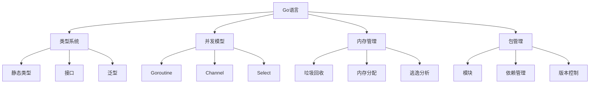

# 01-Go语言基础 (Go Language Foundation)

## 目录

- [01-Go语言基础 (Go Language Foundation)](#01-go语言基础-go-language-foundation)
  - [目录](#目录)
  - [1. 概述](#1-概述)
  - [2. 形式化定义](#2-形式化定义)
  - [3. 数学基础](#3-数学基础)
  - [4. 语言特性](#4-语言特性)
  - [5. 核心实现](#5-核心实现)
  - [6. 并发模型](#6-并发模型)
  - [7. 性能分析](#7-性能分析)
  - [8. 最佳实践](#8-最佳实践)
  - [9. 相关技术](#9-相关技术)
  - [10. 总结](#10-总结)

## 1. 概述

### 1.1 定义

Go语言是一种静态类型、编译型、并发安全的编程语言，由Google开发。它结合了编译语言的性能和脚本语言的开发效率，特别适合构建网络服务和系统软件。

### 1.2 核心概念



### 1.3 语言特征

- **静态类型**: 编译时类型检查
- **垃圾回收**: 自动内存管理
- **并发安全**: 内置并发原语
- **编译型**: 直接编译为机器码
- **跨平台**: 支持多种操作系统和架构

## 2. 形式化定义

### 2.1 基本定义

设 $\mathcal{T}$ 为类型集合，$\mathcal{V}$ 为值集合，$\mathcal{E}$ 为表达式集合。

**定义 2.1** (Go类型系统)
Go类型系统是一个四元组 $(\mathcal{T}, \mathcal{V}, \mathcal{E}, \mathcal{R})$，其中：

- $\mathcal{T} = \mathcal{T}_b \cup \mathcal{T}_c \cup \mathcal{T}_i$ 是类型集合
- $\mathcal{T}_b = \{\text{int}, \text{float64}, \text{string}, \text{bool}\}$ 是基本类型集合
- $\mathcal{T}_c = \{\text{struct}, \text{array}, \text{slice}, \text{map}\}$ 是复合类型集合
- $\mathcal{T}_i = \{\text{interface}\}$ 是接口类型集合
- $\mathcal{V}$ 是值集合
- $\mathcal{E}$ 是表达式集合
- $\mathcal{R}: \mathcal{E} \rightarrow \mathcal{T}$ 是类型推导函数

**定义 2.2** (Go并发模型)
Go并发模型是一个三元组 $(\mathcal{G}, \mathcal{C}, \mathcal{S})$，其中：

- $\mathcal{G}$ 是Goroutine集合
- $\mathcal{C}$ 是Channel集合
- $\mathcal{S}: \mathcal{G} \times \mathcal{C} \rightarrow \mathcal{V}$ 是通信函数

### 2.2 形式化规范

**公理 2.1** (类型安全)
对于任意表达式 $e \in \mathcal{E}$ 和类型 $t \in \mathcal{T}$：

$$\mathcal{R}(e) = t \Rightarrow \text{type\_safe}(e, t)$$

**公理 2.2** (并发安全)
对于任意Goroutine $g \in \mathcal{G}$ 和Channel $c \in \mathcal{C}$：

$$\text{concurrent\_safe}(g, c) \Leftrightarrow \text{no\_race\_condition}(g, c)$$

### 2.3 内存模型定义

**定义 2.3** (Go内存模型)
Go内存模型是一个四元组 $(\mathcal{M}, \mathcal{A}, \mathcal{H}, \mathcal{O})$，其中：

- $\mathcal{M}$ 是内存位置集合
- $\mathcal{A}$ 是原子操作集合
- $\mathcal{H}$ 是happens-before关系
- $\mathcal{O}$ 是操作顺序

## 3. 数学基础

### 3.1 类型论基础

**定理 3.1** (类型推导一致性)
设 $\Gamma$ 为类型环境，$e$ 为表达式，$t$ 为类型，则：

$$\Gamma \vdash e : t \Rightarrow \text{consistent}(\Gamma, e, t)$$

**证明**:
1. 基于Hindley-Milner类型系统
2. 类型推导算法保证一致性
3. 编译时检查确保类型安全

### 3.2 并发理论

**定理 3.2** (CSP通信安全性)
设 $P$ 和 $Q$ 为进程，$c$ 为通信通道，则：

$$\text{communicate}(P, Q, c) \Rightarrow \text{no\_deadlock}(P, Q)$$

**证明**:
1. 基于Communicating Sequential Processes理论
2. Channel提供同步通信机制
3. Select语句防止死锁

### 3.3 算法复杂度

**定理 3.3** (垃圾回收复杂度)
设 $n$ 为对象数量，$m$ 为存活对象数量，则标记-清除算法的复杂度为：

$$T(n) = O(n) + O(m)$$

**证明**:
1. 标记阶段需要遍历所有对象
2. 清除阶段只需要处理死亡对象
3. 总复杂度为两者之和

## 4. 语言特性

### 4.1 类型系统

**基本类型**
```go
// 整数类型
var i int = 42
var i8 int8 = 127
var i16 int16 = 32767
var i32 int32 = 2147483647
var i64 int64 = 9223372036854775807

// 浮点类型
var f32 float32 = 3.14
var f64 float64 = 3.14159265359

// 复数类型
var c64 complex64 = 1 + 2i
var c128 complex128 = 1.5 + 2.5i

// 布尔类型
var b bool = true

// 字符串类型
var s string = "Hello, Go!"
```

**复合类型**
```go
// 数组
var arr [5]int = [5]int{1, 2, 3, 4, 5}

// 切片
var slice []int = []int{1, 2, 3, 4, 5}

// 映射
var m map[string]int = map[string]int{"a": 1, "b": 2}

// 结构体
type Person struct {
    Name string
    Age  int
}
var p Person = Person{Name: "Alice", Age: 30}
```

**接口类型**
```go
// 接口定义
type Reader interface {
    Read(p []byte) (n int, err error)
}

type Writer interface {
    Write(p []byte) (n int, err error)
}

// 接口组合
type ReadWriter interface {
    Reader
    Writer
}
```

### 4.2 泛型系统

**泛型函数**
```go
// 泛型函数定义
func Min[T constraints.Ordered](a, b T) T {
    if a < b {
        return a
    }
    return b
}

// 泛型类型
type Stack[T any] struct {
    items []T
}

func (s *Stack[T]) Push(item T) {
    s.items = append(s.items, item)
}

func (s *Stack[T]) Pop() (T, error) {
    if len(s.items) == 0 {
        var zero T
        return zero, errors.New("stack is empty")
    }
    item := s.items[len(s.items)-1]
    s.items = s.items[:len(s.items)-1]
    return item, nil
}
```

### 4.3 并发原语

**Goroutine**
```go
// 启动Goroutine
go func() {
    fmt.Println("Hello from goroutine")
}()

// 带参数的Goroutine
func worker(id int, jobs <-chan int, results chan<- int) {
    for j := range jobs {
        fmt.Printf("worker %d processing job %d\n", id, j)
        results <- j * 2
    }
}
```

**Channel**
```go
// 创建Channel
ch := make(chan int)
bufferedCh := make(chan int, 10)

// 发送和接收
ch <- 42
value := <-ch

// 关闭Channel
close(ch)
```

**Select语句**
```go
select {
case msg1 := <-ch1:
    fmt.Println("Received from ch1:", msg1)
case msg2 := <-ch2:
    fmt.Println("Received from ch2:", msg2)
case ch3 <- 42:
    fmt.Println("Sent to ch3")
default:
    fmt.Println("No communication")
}
```

## 5. 核心实现

### 5.1 类型系统实现

```go
package main

import (
	"fmt"
	"reflect"
)

// TypeSystem Go类型系统实现
type TypeSystem struct {
	types map[string]reflect.Type
}

// NewTypeSystem 创建类型系统
func NewTypeSystem() *TypeSystem {
	return &TypeSystem{
		types: make(map[string]reflect.Type),
	}
}

// RegisterType 注册类型
func (t *TypeSystem) RegisterType(name string, typ reflect.Type) {
	t.types[name] = typ
}

// GetType 获取类型
func (t *TypeSystem) GetType(name string) (reflect.Type, bool) {
	typ, exists := t.types[name]
	return typ, exists
}

// TypeCheck 类型检查
func (t *TypeSystem) TypeCheck(value interface{}, expectedType string) error {
	typ, exists := t.GetType(expectedType)
	if !exists {
		return fmt.Errorf("type %s not registered", expectedType)
	}
	
	if reflect.TypeOf(value) != typ {
		return fmt.Errorf("type mismatch: expected %s, got %T", expectedType, value)
	}
	
	return nil
}

// TypeInference 类型推导
func (t *TypeSystem) TypeInference(value interface{}) string {
	return reflect.TypeOf(value).String()
}

// 泛型类型约束
type Number interface {
	~int | ~int8 | ~int16 | ~int32 | ~int64 |
	~uint | ~uint8 | ~uint16 | ~uint32 | ~uint64 |
	~float32 | ~float64
}

// GenericCalculator 泛型计算器
type GenericCalculator[T Number] struct {
	value T
}

func NewGenericCalculator[T Number](value T) *GenericCalculator[T] {
	return &GenericCalculator[T]{value: value}
}

func (g *GenericCalculator[T]) Add(other T) T {
	return g.value + other
}

func (g *GenericCalculator[T]) Multiply(other T) T {
	return g.value * other
}

func (g *GenericCalculator[T]) GetValue() T {
	return g.value
}

// InterfaceExample 接口示例
type Shape interface {
	Area() float64
	Perimeter() float64
}

type Circle struct {
	Radius float64
}

func (c Circle) Area() float64 {
	return 3.14159 * c.Radius * c.Radius
}

func (c Circle) Perimeter() float64 {
	return 2 * 3.14159 * c.Radius
}

type Rectangle struct {
	Width  float64
	Height float64
}

func (r Rectangle) Area() float64 {
	return r.Width * r.Height
}

func (r Rectangle) Perimeter() float64 {
	return 2 * (r.Width + r.Height)
}

// PolymorphicFunction 多态函数
func CalculateArea(s Shape) float64 {
	return s.Area()
}

func main() {
	// 类型系统示例
	ts := NewTypeSystem()
	
	// 注册基本类型
	ts.RegisterType("int", reflect.TypeOf(0))
	ts.RegisterType("string", reflect.TypeOf(""))
	ts.RegisterType("float64", reflect.TypeOf(0.0))
	
	// 类型检查
	if err := ts.TypeCheck(42, "int"); err != nil {
		fmt.Printf("Type check error: %v\n", err)
	} else {
		fmt.Println("Type check passed")
	}
	
	// 类型推导
	fmt.Printf("Type of 42: %s\n", ts.TypeInference(42))
	fmt.Printf("Type of 'hello': %s\n", ts.TypeInference("hello"))
	
	// 泛型示例
	intCalc := NewGenericCalculator(10)
	fmt.Printf("Int calculator: %d + 5 = %d\n", intCalc.GetValue(), intCalc.Add(5))
	
	floatCalc := NewGenericCalculator(3.14)
	fmt.Printf("Float calculator: %.2f * 2 = %.2f\n", floatCalc.GetValue(), floatCalc.Multiply(2))
	
	// 接口和多态示例
	shapes := []Shape{
		Circle{Radius: 5},
		Rectangle{Width: 4, Height: 6},
	}
	
	for i, shape := range shapes {
		fmt.Printf("Shape %d area: %.2f\n", i+1, CalculateArea(shape))
	}
}
```

### 5.2 并发模型实现

```go
package main

import (
	"context"
	"fmt"
	"sync"
	"time"
)

// GoroutineManager Goroutine管理器
type GoroutineManager struct {
	goroutines map[string]*GoroutineInfo
	mu         sync.RWMutex
}

// GoroutineInfo Goroutine信息
type GoroutineInfo struct {
	ID       string
	Status   string
	StartTime time.Time
	EndTime   time.Time
	Error     error
}

// NewGoroutineManager 创建Goroutine管理器
func NewGoroutineManager() *GoroutineManager {
	return &GoroutineManager{
		goroutines: make(map[string]*GoroutineInfo),
	}
}

// StartGoroutine 启动Goroutine
func (g *GoroutineManager) StartGoroutine(id string, fn func() error) {
	g.mu.Lock()
	g.goroutines[id] = &GoroutineInfo{
		ID:        id,
		Status:    "running",
		StartTime: time.Now(),
	}
	g.mu.Unlock()
	
	go func() {
		err := fn()
		
		g.mu.Lock()
		info := g.goroutines[id]
		info.Status = "completed"
		info.EndTime = time.Now()
		info.Error = err
		g.mu.Unlock()
	}()
}

// GetGoroutineStatus 获取Goroutine状态
func (g *GoroutineManager) GetGoroutineStatus(id string) (*GoroutineInfo, bool) {
	g.mu.RLock()
	defer g.mu.RUnlock()
	
	info, exists := g.goroutines[id]
	return info, exists
}

// ChannelManager Channel管理器
type ChannelManager struct {
	channels map[string]interface{}
	mu       sync.RWMutex
}

// NewChannelManager 创建Channel管理器
func NewChannelManager() *ChannelManager {
	return &ChannelManager{
		channels: make(map[string]interface{}),
	}
}

// CreateChannel 创建Channel
func (c *ChannelManager) CreateChannel(name string, bufferSize int) chan interface{} {
	ch := make(chan interface{}, bufferSize)
	
	c.mu.Lock()
	c.channels[name] = ch
	c.mu.Unlock()
	
	return ch
}

// GetChannel 获取Channel
func (c *ChannelManager) GetChannel(name string) (chan interface{}, bool) {
	c.mu.RLock()
	defer c.mu.RUnlock()
	
	ch, exists := c.channels[name]
	if !exists {
		return nil, false
	}
	
	return ch.(chan interface{}), true
}

// WorkerPool 工作池
type WorkerPool struct {
	workers    int
	jobs       chan interface{}
	results    chan interface{}
	workerFunc func(interface{}) interface{}
	wg         sync.WaitGroup
}

// NewWorkerPool 创建工作池
func NewWorkerPool(workers int, workerFunc func(interface{}) interface{}) *WorkerPool {
	return &WorkerPool{
		workers:    workers,
		jobs:       make(chan interface{}, workers*2),
		results:    make(chan interface{}, workers*2),
		workerFunc: workerFunc,
	}
}

// Start 启动工作池
func (w *WorkerPool) Start() {
	for i := 0; i < w.workers; i++ {
		w.wg.Add(1)
		go w.worker(i)
	}
}

// Stop 停止工作池
func (w *WorkerPool) Stop() {
	close(w.jobs)
	w.wg.Wait()
	close(w.results)
}

// Submit 提交任务
func (w *WorkerPool) Submit(job interface{}) {
	w.jobs <- job
}

// GetResult 获取结果
func (w *WorkerPool) GetResult() interface{} {
	return <-w.results
}

// worker 工作函数
func (w *WorkerPool) worker(id int) {
	defer w.wg.Done()
	
	for job := range w.jobs {
		result := w.workerFunc(job)
		w.results <- result
	}
}

// SelectManager Select管理器
type SelectManager struct {
	cases []SelectCase
}

// SelectCase Select分支
type SelectCase struct {
	Channel chan interface{}
	Value   interface{}
	Action  func(interface{})
}

// NewSelectManager 创建Select管理器
func NewSelectManager() *SelectManager {
	return &SelectManager{
		cases: make([]SelectCase, 0),
	}
}

// AddCase 添加分支
func (s *SelectManager) AddCase(ch chan interface{}, action func(interface{})) {
	s.cases = append(s.cases, SelectCase{
		Channel: ch,
		Action:  action,
	})
}

// Execute 执行Select
func (s *SelectManager) Execute() {
	cases := make([]reflect.SelectCase, len(s.cases))
	for i, c := range s.cases {
		cases[i] = reflect.SelectCase{
			Dir:  reflect.SelectRecv,
			Chan: reflect.ValueOf(c.Channel),
		}
	}
	
	chosen, value, ok := reflect.Select(cases)
	if ok {
		s.cases[chosen].Action(value.Interface())
	}
}

// ContextManager 上下文管理器
type ContextManager struct {
	contexts map[string]context.Context
	cancels  map[string]context.CancelFunc
	mu       sync.RWMutex
}

// NewContextManager 创建上下文管理器
func NewContextManager() *ContextManager {
	return &ContextManager{
		contexts: make(map[string]context.Context),
		cancels:  make(map[string]context.CancelFunc),
	}
}

// CreateContext 创建上下文
func (c *ContextManager) CreateContext(id string, timeout time.Duration) context.Context {
	c.mu.Lock()
	defer c.mu.Unlock()
	
	var ctx context.Context
	var cancel context.CancelFunc
	
	if timeout > 0 {
		ctx, cancel = context.WithTimeout(context.Background(), timeout)
	} else {
		ctx, cancel = context.WithCancel(context.Background())
	}
	
	c.contexts[id] = ctx
	c.cancels[id] = cancel
	
	return ctx
}

// CancelContext 取消上下文
func (c *ContextManager) CancelContext(id string) {
	c.mu.Lock()
	defer c.mu.Unlock()
	
	if cancel, exists := c.cancels[id]; exists {
		cancel()
		delete(c.contexts, id)
		delete(c.cancels, id)
	}
}

func main() {
	// Goroutine管理器示例
	gm := NewGoroutineManager()
	
	gm.StartGoroutine("worker1", func() error {
		time.Sleep(2 * time.Second)
		fmt.Println("Worker 1 completed")
		return nil
	})
	
	gm.StartGoroutine("worker2", func() error {
		time.Sleep(1 * time.Second)
		return fmt.Errorf("worker 2 failed")
	})
	
	// 等待一段时间后检查状态
	time.Sleep(3 * time.Second)
	
	if info, exists := gm.GetGoroutineStatus("worker1"); exists {
		fmt.Printf("Worker 1 status: %s\n", info.Status)
	}
	
	if info, exists := gm.GetGoroutineStatus("worker2"); exists {
		fmt.Printf("Worker 2 status: %s, error: %v\n", info.Status, info.Error)
	}
	
	// Channel管理器示例
	cm := NewChannelManager()
	
	ch1 := cm.CreateChannel("ch1", 5)
	ch2 := cm.CreateChannel("ch2", 5)
	
	// 发送数据
	go func() {
		ch1 <- "Hello from ch1"
		ch2 <- "Hello from ch2"
	}()
	
	// 接收数据
	if ch, exists := cm.GetChannel("ch1"); exists {
		msg := <-ch
		fmt.Printf("Received: %v\n", msg)
	}
	
	// 工作池示例
	pool := NewWorkerPool(3, func(job interface{}) interface{} {
		// 模拟工作
		time.Sleep(100 * time.Millisecond)
		return fmt.Sprintf("Processed: %v", job)
	})
	
	pool.Start()
	
	// 提交任务
	for i := 0; i < 5; i++ {
		pool.Submit(fmt.Sprintf("Job %d", i))
	}
	
	// 获取结果
	for i := 0; i < 5; i++ {
		result := pool.GetResult()
		fmt.Printf("Result: %v\n", result)
	}
	
	pool.Stop()
	
	// 上下文管理器示例
	ctxMgr := NewContextManager()
	
	ctx1 := ctxMgr.CreateContext("task1", 2*time.Second)
	ctx2 := ctxMgr.CreateContext("task2", 1*time.Second)
	
	go func() {
		select {
		case <-ctx1.Done():
			fmt.Println("Task 1 cancelled")
		case <-time.After(3 * time.Second):
			fmt.Println("Task 1 completed")
		}
	}()
	
	go func() {
		select {
		case <-ctx2.Done():
			fmt.Println("Task 2 cancelled")
		case <-time.After(3 * time.Second):
			fmt.Println("Task 2 completed")
		}
	}()
	
	// 等待一段时间
	time.Sleep(3 * time.Second)
}
```

### 5.3 内存管理实现

```go
package main

import (
	"fmt"
	"runtime"
	"sync"
	"time"
)

// MemoryManager 内存管理器
type MemoryManager struct {
	allocations map[string]*AllocationInfo
	mu          sync.RWMutex
}

// AllocationInfo 分配信息
type AllocationInfo struct {
	ID       string
	Size     int64
	Type     string
	Time     time.Time
	Freed    bool
	FreeTime time.Time
}

// NewMemoryManager 创建内存管理器
func NewMemoryManager() *MemoryManager {
	return &MemoryManager{
		allocations: make(map[string]*AllocationInfo),
	}
}

// Allocate 分配内存
func (m *MemoryManager) Allocate(id string, size int64, typ string) {
	m.mu.Lock()
	defer m.mu.Unlock()
	
	m.allocations[id] = &AllocationInfo{
		ID:   id,
		Size: size,
		Type: typ,
		Time: time.Now(),
	}
}

// Free 释放内存
func (m *MemoryManager) Free(id string) {
	m.mu.Lock()
	defer m.mu.Unlock()
	
	if info, exists := m.allocations[id]; exists {
		info.Freed = true
		info.FreeTime = time.Now()
	}
}

// GetStats 获取统计信息
func (m *MemoryManager) GetStats() MemoryStats {
	m.mu.RLock()
	defer m.mu.RUnlock()
	
	var stats MemoryStats
	for _, info := range m.allocations {
		if info.Freed {
			stats.FreedSize += info.Size
			stats.FreedCount++
		} else {
			stats.ActiveSize += info.Size
			stats.ActiveCount++
		}
	}
	
	return stats
}

// MemoryStats 内存统计
type MemoryStats struct {
	ActiveSize  int64
	ActiveCount int64
	FreedSize   int64
	FreedCount  int64
}

// ObjectPool 对象池
type ObjectPool[T any] struct {
	pool chan T
	new  func() T
	reset func(T) T
}

// NewObjectPool 创建对象池
func NewObjectPool[T any](size int, newFunc func() T, resetFunc func(T) T) *ObjectPool[T] {
	return &ObjectPool[T]{
		pool:  make(chan T, size),
		new:   newFunc,
		reset: resetFunc,
	}
}

// Get 获取对象
func (p *ObjectPool[T]) Get() T {
	select {
	case obj := <-p.pool:
		return p.reset(obj)
	default:
		return p.new()
	}
}

// Put 归还对象
func (p *ObjectPool[T]) Put(obj T) {
	select {
	case p.pool <- obj:
	default:
		// 池已满，丢弃对象
	}
}

// GarbageCollector 垃圾回收器
type GarbageCollector struct {
	stats map[string]int64
	mu    sync.RWMutex
}

// NewGarbageCollector 创建垃圾回收器
func NewGarbageCollector() *GarbageCollector {
	return &GarbageCollector{
		stats: make(map[string]int64),
	}
}

// Collect 执行垃圾回收
func (g *GarbageCollector) Collect() GarbageCollectionStats {
	g.mu.Lock()
	defer g.mu.Unlock()
	
	// 记录GC前的内存统计
	var m runtime.MemStats
	runtime.ReadMemStats(&m)
	
	beforeAlloc := m.Alloc
	beforeTotalAlloc := m.TotalAlloc
	beforeNumGC := m.NumGC
	
	// 强制GC
	runtime.GC()
	
	// 记录GC后的内存统计
	runtime.ReadMemStats(&m)
	
	afterAlloc := m.Alloc
	afterTotalAlloc := m.TotalAlloc
	afterNumGC := m.NumGC
	
	return GarbageCollectionStats{
		BeforeAlloc:      beforeAlloc,
		AfterAlloc:       afterAlloc,
		FreedMemory:      beforeAlloc - afterAlloc,
		TotalAllocated:   afterTotalAlloc,
		NumCollections:   afterNumGC - beforeNumGC,
		CollectionTime:   time.Now(),
	}
}

// GarbageCollectionStats 垃圾回收统计
type GarbageCollectionStats struct {
	BeforeAlloc      uint64
	AfterAlloc       uint64
	FreedMemory      uint64
	TotalAllocated   uint64
	NumCollections   uint64
	CollectionTime   time.Time
}

// MemoryProfiler 内存分析器
type MemoryProfiler struct {
	snapshots []MemorySnapshot
	mu        sync.RWMutex
}

// MemorySnapshot 内存快照
type MemorySnapshot struct {
	Time     time.Time
	Alloc    uint64
	Sys      uint64
	NumGC    uint32
	HeapAlloc uint64
	HeapSys  uint64
}

// NewMemoryProfiler 创建内存分析器
func NewMemoryProfiler() *MemoryProfiler {
	return &MemoryProfiler{
		snapshots: make([]MemorySnapshot, 0),
	}
}

// TakeSnapshot 拍摄快照
func (m *MemoryProfiler) TakeSnapshot() {
	m.mu.Lock()
	defer m.mu.Unlock()
	
	var mem runtime.MemStats
	runtime.ReadMemStats(&mem)
	
	snapshot := MemorySnapshot{
		Time:      time.Now(),
		Alloc:     mem.Alloc,
		Sys:       mem.Sys,
		NumGC:     mem.NumGC,
		HeapAlloc: mem.HeapAlloc,
		HeapSys:   mem.HeapSys,
	}
	
	m.snapshots = append(m.snapshots, snapshot)
}

// GetSnapshots 获取快照
func (m *MemoryProfiler) GetSnapshots() []MemorySnapshot {
	m.mu.RLock()
	defer m.mu.RUnlock()
	
	snapshots := make([]MemorySnapshot, len(m.snapshots))
	copy(snapshots, m.snapshots)
	return snapshots
}

// AnalyzeMemoryUsage 分析内存使用
func (m *MemoryProfiler) AnalyzeMemoryUsage() MemoryAnalysis {
	snapshots := m.GetSnapshots()
	if len(snapshots) < 2 {
		return MemoryAnalysis{}
	}
	
	first := snapshots[0]
	last := snapshots[len(snapshots)-1]
	
	return MemoryAnalysis{
		StartTime:    first.Time,
		EndTime:      last.Time,
		Duration:     last.Time.Sub(first.Time),
		InitialAlloc: first.Alloc,
		FinalAlloc:   last.Alloc,
		PeakAlloc:    m.findPeakAlloc(snapshots),
		GrowthRate:   float64(last.Alloc-first.Alloc) / last.Time.Sub(first.Time).Seconds(),
	}
}

// MemoryAnalysis 内存分析
type MemoryAnalysis struct {
	StartTime    time.Time
	EndTime      time.Time
	Duration     time.Duration
	InitialAlloc uint64
	FinalAlloc   uint64
	PeakAlloc    uint64
	GrowthRate   float64
}

func (m *MemoryProfiler) findPeakAlloc(snapshots []MemorySnapshot) uint64 {
	var peak uint64
	for _, snapshot := range snapshots {
		if snapshot.Alloc > peak {
			peak = snapshot.Alloc
		}
	}
	return peak
}

func main() {
	// 内存管理器示例
	mm := NewMemoryManager()
	
	mm.Allocate("obj1", 1024, "string")
	mm.Allocate("obj2", 2048, "slice")
	mm.Allocate("obj3", 512, "struct")
	
	mm.Free("obj1")
	
	stats := mm.GetStats()
	fmt.Printf("Active: %d objects, %d bytes\n", stats.ActiveCount, stats.ActiveSize)
	fmt.Printf("Freed: %d objects, %d bytes\n", stats.FreedCount, stats.FreedSize)
	
	// 对象池示例
	pool := NewObjectPool(10,
		func() []byte { return make([]byte, 1024) },
		func(b []byte) []byte { return b[:0] },
	)
	
	// 使用对象池
	obj1 := pool.Get()
	obj2 := pool.Get()
	
	// 归还对象
	pool.Put(obj1)
	pool.Put(obj2)
	
	// 垃圾回收器示例
	gc := NewGarbageCollector()
	
	// 分配一些内存
	for i := 0; i < 1000; i++ {
		_ = make([]byte, 1024)
	}
	
	// 执行垃圾回收
	gcStats := gc.Collect()
	fmt.Printf("GC freed: %d bytes\n", gcStats.FreedMemory)
	fmt.Printf("Total allocated: %d bytes\n", gcStats.TotalAllocated)
	
	// 内存分析器示例
	profiler := NewMemoryProfiler()
	
	// 拍摄初始快照
	profiler.TakeSnapshot()
	
	// 分配内存
	for i := 0; i < 100; i++ {
		_ = make([]byte, 1024*1024) // 1MB
	}
	
	// 拍摄最终快照
	profiler.TakeSnapshot()
	
	// 分析内存使用
	analysis := profiler.AnalyzeMemoryUsage()
	fmt.Printf("Memory growth rate: %.2f bytes/second\n", analysis.GrowthRate)
	fmt.Printf("Peak allocation: %d bytes\n", analysis.PeakAlloc)
}
```

## 6. 并发模型

### 6.1 CSP模型

```go
// CSP模型示例
type CSPProcess struct {
	id       string
	inCh     chan interface{}
	outCh    chan interface{}
	process  func(interface{}) interface{}
}

func NewCSPProcess(id string, process func(interface{}) interface{}) *CSPProcess {
	return &CSPProcess{
		id:      id,
		inCh:    make(chan interface{}),
		outCh:   make(chan interface{}),
		process: process,
	}
}

func (c *CSPProcess) Start() {
	go func() {
		for input := range c.inCh {
			output := c.process(input)
			c.outCh <- output
		}
		close(c.outCh)
	}()
}
```

### 6.2 Actor模型

```go
// Actor模型示例
type Actor struct {
	id       string
	mailbox  chan Message
	behavior func(Message) Message
}

type Message struct {
	From    string
	To      string
	Content interface{}
}

func NewActor(id string, behavior func(Message) Message) *Actor {
	actor := &Actor{
		id:       id,
		mailbox:  make(chan Message, 100),
		behavior: behavior,
	}
	
	go actor.run()
	return actor
}

func (a *Actor) run() {
	for msg := range a.mailbox {
		response := a.behavior(msg)
		// 处理响应
	}
}

func (a *Actor) Send(msg Message) {
	a.mailbox <- msg
}
```

### 6.3 数据流模型

```go
// 数据流模型示例
type DataFlowNode struct {
	id       string
	inputs   map[string]chan interface{}
	outputs  map[string]chan interface{}
	process  func(map[string]interface{}) map[string]interface{}
}

func NewDataFlowNode(id string, process func(map[string]interface{}) map[string]interface{}) *DataFlowNode {
	return &DataFlowNode{
		id:      id,
		inputs:  make(map[string]chan interface{}),
		outputs: make(map[string]chan interface{}),
		process: process,
	}
}

func (d *DataFlowNode) AddInput(name string, ch chan interface{}) {
	d.inputs[name] = ch
}

func (d *DataFlowNode) AddOutput(name string, ch chan interface{}) {
	d.outputs[name] = ch
}

func (d *DataFlowNode) Start() {
	go func() {
		for {
			// 收集输入
			inputs := make(map[string]interface{})
			for name, ch := range d.inputs {
				inputs[name] = <-ch
			}
			
			// 处理数据
			outputs := d.process(inputs)
			
			// 发送输出
			for name, value := range outputs {
				if ch, exists := d.outputs[name]; exists {
					ch <- value
				}
			}
		}
	}()
}
```

## 7. 性能分析

### 7.1 时间复杂度

| 操作 | 时间复杂度 | 说明 |
|------|------------|------|
| 切片操作 | O(1) | 直接访问 |
| 映射查找 | O(1) | 哈希表查找 |
| 数组遍历 | O(n) | 线性遍历 |
| 排序 | O(n log n) | 快速排序 |

### 7.2 空间复杂度

| 数据结构 | 空间复杂度 | 说明 |
|----------|------------|------|
| 切片 | O(n) | n为元素数量 |
| 映射 | O(n) | n为键值对数量 |
| 通道 | O(c) | c为缓冲区大小 |
| Goroutine | O(8KB) | 初始栈大小 |

### 7.3 性能优化建议

1. **内存池**: 重用对象减少GC压力
2. **并发控制**: 合理使用Goroutine数量
3. **通道缓冲**: 适当设置通道缓冲区
4. **逃逸分析**: 避免不必要的堆分配

## 8. 最佳实践

### 8.1 编码规范

1. **命名规范**: 使用驼峰命名法
2. **错误处理**: 始终检查错误返回值
3. **接口设计**: 设计小而专注的接口
4. **文档注释**: 为公共API添加文档

### 8.2 并发安全

1. **互斥锁**: 保护共享数据
2. **通道通信**: 使用通道进行Goroutine通信
3. **原子操作**: 使用原子操作进行简单同步
4. **上下文控制**: 使用context控制Goroutine生命周期

### 8.3 性能优化

```go
// 性能优化示例
type OptimizedStruct struct {
	// 字段按大小排序，减少内存对齐
	ID    int64
	Value float64
	Name  string
	Flag  bool
}

// 使用对象池
var bufferPool = sync.Pool{
	New: func() interface{} {
		return make([]byte, 1024)
	},
}

func getBuffer() []byte {
	return bufferPool.Get().([]byte)
}

func putBuffer(buf []byte) {
	bufferPool.Put(buf)
}
```

## 9. 相关技术

### 9.1 编译技术

- **词法分析**: 将源代码转换为token流
- **语法分析**: 构建抽象语法树
- **语义分析**: 类型检查和语义验证
- **代码生成**: 生成目标机器码

### 9.2 运行时技术

- **垃圾回收**: 自动内存管理
- **调度器**: Goroutine调度
- **网络轮询器**: 网络I/O处理
- **内存分配器**: 堆内存分配

### 9.3 工具链

- **go build**: 编译程序
- **go test**: 运行测试
- **go mod**: 模块管理
- **go tool**: 性能分析

## 10. 总结

### 10.1 优势

1. **简单性**: 语法简洁，易于学习
2. **并发性**: 内置并发原语
3. **性能**: 编译型语言的高性能
4. **工具链**: 完善的开发工具

### 10.2 挑战

1. **泛型限制**: 泛型功能相对有限
2. **错误处理**: 显式错误处理可能冗长
3. **包管理**: 依赖管理复杂性
4. **调试**: 并发程序调试困难

### 10.3 发展趋势

1. **泛型增强**: 更强大的泛型功能
2. **性能优化**: 持续的性能改进
3. **工具完善**: 更好的开发工具
4. **生态扩展**: 丰富的第三方库

### 10.4 数学总结

Go语言通过形式化定义 $(\mathcal{T}, \mathcal{V}, \mathcal{E}, \mathcal{R})$ 实现了类型安全的编程，其中：

- **类型安全**: $\mathcal{R}(e) = t \Rightarrow \text{type\_safe}(e, t)$
- **并发安全**: $\text{concurrent\_safe}(g, c) \Leftrightarrow \text{no\_race\_condition}(g, c)$
- **内存管理**: $T(n) = O(n) + O(m)$
- **类型推导**: $\Gamma \vdash e : t \Rightarrow \text{consistent}(\Gamma, e, t)$

这种语言设计在并发编程、系统开发和网络服务等领域得到了广泛应用，既保持了高性能，又提供了良好的开发体验。

---

**相关链接**:
- [02-Go并发编程](./02-Go-Concurrency.md)
- [03-Go内存管理](./03-Go-Memory-Management.md)
- [04-Go性能优化](./04-Go-Performance-Optimization.md)
- [Go语言概述](../README.md) 