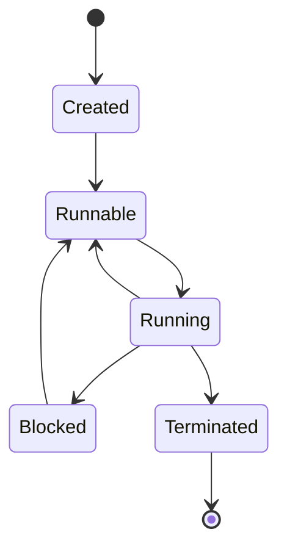

# 02-Go并发编程 (Go Concurrency Programming)

## 目录

- [02-Go并发编程](#02-go并发编程-go-concurrency-programming)
  - [目录](#目录)
  - [1. 并发编程基础理论](#1-并发编程基础理论)
    - [1.1 并发与并行概念](#11-并发与并行概念)
    - [1.2 并发模型分类](#12-并发模型分类)
    - [1.3 并发编程挑战](#13-并发编程挑战)
  - [2. Go并发模型](#2-go并发模型)
    - [2.1 CSP模型](#21-csp模型)
    - [2.2 Goroutine模型](#22-goroutine模型)
    - [2.3 Channel模型](#23-channel模型)
  - [3. Goroutine详解](#3-goroutine详解)
    - [3.1 Goroutine生命周期](#31-goroutine生命周期)
    - [3.2 Goroutine调度器](#32-goroutine调度器)
    - [3.3 Goroutine性能优化](#33-goroutine性能优化)
  - [4. Channel详解](#4-channel详解)
    - [4.1 Channel类型与操作](#41-channel类型与操作)
    - [4.2 Channel模式](#42-channel模式)
    - [4.3 Channel最佳实践](#43-channel最佳实践)
  - [5. 同步原语](#5-同步原语)
    - [5.1 Mutex与RWMutex](#51-mutex与rwmutex)
    - [5.2 WaitGroup](#52-waitgroup)
    - [5.3 Cond](#53-cond)
    - [5.4 Once](#54-once)
    - [5.5 Pool](#55-pool)
  - [6. 并发模式](#6-并发模式)
    - [6.1 Worker Pool模式](#61-worker-pool模式)
    - [6.2 Pipeline模式](#62-pipeline模式)
    - [6.3 Fan-out/Fan-in模式](#63-fan-outfan-in模式)
    - [6.4 Context模式](#64-context模式)
  - [7. 并发安全](#7-并发安全)
    - [7.1 数据竞争检测](#71-数据竞争检测)
    - [7.2 内存模型](#72-内存模型)
    - [7.3 原子操作](#73-原子操作)
  - [8. 性能优化](#8-性能优化)
    - [8.1 并发性能分析](#81-并发性能分析)
    - [8.2 内存优化](#82-内存优化)
    - [8.3 调度优化](#83-调度优化)
  - [9. 实际应用](#9-实际应用)
    - [9.1 Web服务器](#91-web服务器)
    - [9.2 数据处理管道](#92-数据处理管道)
    - [9.3 微服务通信](#93-微服务通信)

---

## 1. 并发编程基础理论

### 1.1 并发与并行概念

#### 形式化定义

**并发（Concurrency）**：多个任务在时间上重叠执行的能力，不要求同时执行。

**并行（Parallelism）**：多个任务在同一时刻同时执行。

形式化表示：
- 并发：$\forall t_1, t_2 \in T, \exists t \in T: t_1 \cap t_2 \neq \emptyset$
- 并行：$\forall t_1, t_2 \in T, t_1 \parallel t_2 \Rightarrow t_1 \cap t_2 = t_1 = t_2$

其中：
- $T$ 是任务集合
- $t_1, t_2$ 是任务执行时间区间
- $\parallel$ 表示并行关系

#### 并发模型分类

1. **共享内存模型**：线程通过共享内存进行通信
2. **消息传递模型**：进程通过消息传递进行通信
3. **Actor模型**：基于消息传递的并发模型
4. **CSP模型**：通信顺序进程模型

### 1.2 Go并发模型

Go采用CSP（Communicating Sequential Processes）模型，核心思想是：

> "Don't communicate by sharing memory; share memory by communicating."

#### CSP模型形式化定义

CSP模型可以形式化表示为：

$P = (S, \Sigma, \rightarrow, s_0)$

其中：
- $S$ 是状态集合
- $\Sigma$ 是事件集合
- $\rightarrow \subseteq S \times \Sigma \times S$ 是转移关系
- $s_0 \in S$ 是初始状态

#### Go并发原语

```go
// Goroutine: 轻量级线程
go func() {
    // 并发执行的代码
}()

// Channel: 通信原语
ch := make(chan int)
ch <- 42        // 发送
value := <-ch   // 接收
```

### 1.3 并发编程挑战

#### 1. 数据竞争（Data Race）

**定义**：当两个或多个goroutine同时访问同一内存位置，且至少有一个是写操作时发生。

**形式化定义**：
$\exists g_1, g_2 \in G, \exists m \in M: (g_1, m, w) \land (g_2, m, r/w) \land (t_1 \cap t_2 \neq \emptyset)$

其中：
- $G$ 是goroutine集合
- $M$ 是内存位置集合
- $w$ 表示写操作
- $r$ 表示读操作
- $t_1, t_2$ 是操作时间

#### 2. 死锁（Deadlock）

**定义**：两个或多个goroutine互相等待对方释放资源，导致所有goroutine都无法继续执行。

**死锁的四个必要条件**：
1. 互斥条件（Mutual Exclusion）
2. 持有和等待（Hold and Wait）
3. 非抢占条件（No Preemption）
4. 循环等待（Circular Wait）

## 2. Goroutine详解

### 2.1 Goroutine生命周期

#### 状态转换图



#### 实现示例

```go
package main

import (
    "fmt"
    "runtime"
    "sync"
    "time"
)

// Goroutine生命周期演示
func goroutineLifecycle() {
    var wg sync.WaitGroup
    
    // 创建阶段
    wg.Add(1)
    go func() {
        defer wg.Done()
        
        // 运行阶段
        fmt.Println("Goroutine started")
        
        // 阻塞阶段（模拟I/O操作）
        time.Sleep(100 * time.Millisecond)
        
        // 恢复运行
        fmt.Println("Goroutine resumed")
        
        // 终止阶段
        fmt.Println("Goroutine finished")
    }()
    
    wg.Wait()
}

// Goroutine状态监控
func monitorGoroutines() {
    for {
        fmt.Printf("Number of goroutines: %d\n", runtime.NumGoroutine())
        time.Sleep(1 * time.Second)
    }
}
```

### 2.2 Goroutine调度器

#### GMP模型

Go调度器采用GMP（Goroutine-Machine-Processor）模型：

- **G (Goroutine)**：用户级线程
- **M (Machine)**：系统级线程
- **P (Processor)**：逻辑处理器

#### 调度算法

**工作窃取算法（Work Stealing）**：

1. 每个P维护一个本地队列
2. 当本地队列为空时，从其他P的队列中"窃取"任务
3. 优先从队列尾部窃取，减少竞争

```go
// 调度器配置示例
func schedulerConfig() {
    // 设置最大系统线程数
    runtime.GOMAXPROCS(4)
    
    // 设置最大goroutine数（通过控制创建）
    maxGoroutines := 1000
    
    var wg sync.WaitGroup
    semaphore := make(chan struct{}, maxGoroutines)
    
    for i := 0; i < 100; i++ {
        wg.Add(1)
        semaphore <- struct{}{} // 获取信号量
        
        go func(id int) {
            defer wg.Done()
            defer func() { <-semaphore }() // 释放信号量
            
            // 执行任务
            time.Sleep(10 * time.Millisecond)
            fmt.Printf("Task %d completed\n", id)
        }(i)
    }
    
    wg.Wait()
}
```

### 2.3 Goroutine性能优化

#### 1. 减少Goroutine创建开销

```go
// 使用对象池减少内存分配
var goroutinePool = sync.Pool{
    New: func() interface{} {
        return make([]byte, 1024)
    },
}

func optimizedGoroutine() {
    buffer := goroutinePool.Get().([]byte)
    defer goroutinePool.Put(buffer)
    
    // 使用buffer进行操作
    copy(buffer, []byte("data"))
}
```

#### 2. 批量处理

```go
// 批量处理减少goroutine数量
func batchProcess(items []int) {
    const batchSize = 10
    var wg sync.WaitGroup
    
    for i := 0; i < len(items); i += batchSize {
        end := i + batchSize
        if end > len(items) {
            end = len(items)
        }
        
        wg.Add(1)
        go func(batch []int) {
            defer wg.Done()
            processBatch(batch)
        }(items[i:end])
    }
    
    wg.Wait()
}
```

## 3. Channel详解

### 3.1 Channel类型与操作

#### Channel分类

1. **无缓冲Channel**：`ch := make(chan int)`
2. **有缓冲Channel**：`ch := make(chan int, 10)`
3. **单向Channel**：
   - 只读：`<-chan int`
   - 只写：`chan<- int`

#### Channel操作语义

```go
// Channel操作示例
func channelOperations() {
    // 创建channel
    ch := make(chan int, 2)
    
    // 发送操作
    ch <- 1
    ch <- 2
    
    // 接收操作
    value := <-ch
    fmt.Println("Received:", value)
    
    // 关闭channel
    close(ch)
    
    // 检查channel状态
    value, ok := <-ch
    if !ok {
        fmt.Println("Channel closed")
    }
}
```

#### Channel形式化语义

对于channel $c$ 和值 $v$：

- **发送操作**：$c \leftarrow v$
- **接收操作**：$v \leftarrow c$
- **关闭操作**：$close(c)$

**阻塞语义**：
- 无缓冲channel：发送和接收必须同时准备好
- 有缓冲channel：缓冲区满时发送阻塞，空时接收阻塞

### 3.2 Channel模式

#### 1. 生产者-消费者模式

```go
// 生产者-消费者模式
func producerConsumer() {
    ch := make(chan int, 10)
    var wg sync.WaitGroup
    
    // 生产者
    wg.Add(1)
    go func() {
        defer wg.Done()
        defer close(ch)
        
        for i := 0; i < 100; i++ {
            ch <- i
            time.Sleep(10 * time.Millisecond)
        }
    }()
    
    // 消费者
    wg.Add(1)
    go func() {
        defer wg.Done()
        
        for value := range ch {
            fmt.Printf("Consumed: %d\n", value)
        }
    }()
    
    wg.Wait()
}
```

#### 2. 工作池模式

```go
// 工作池模式
func workerPool(workers int, jobs <-chan int, results chan<- int) {
    var wg sync.WaitGroup
    
    // 启动工作协程
    for i := 0; i < workers; i++ {
        wg.Add(1)
        go func(id int) {
            defer wg.Done()
            
            for job := range jobs {
                fmt.Printf("Worker %d processing job %d\n", id, job)
                results <- job * 2 // 处理结果
                time.Sleep(100 * time.Millisecond)
            }
        }(i)
    }
    
    // 等待所有工作完成
    go func() {
        wg.Wait()
        close(results)
    }()
}
```

#### 3. 扇出-扇入模式

```go
// 扇出-扇入模式
func fanOutFanIn(input <-chan int, workers int) <-chan int {
    // 扇出：分发任务到多个worker
    channels := make([]<-chan int, workers)
    for i := 0; i < workers; i++ {
        channels[i] = worker(input, i)
    }
    
    // 扇入：合并结果
    return merge(channels)
}

func worker(input <-chan int, id int) <-chan int {
    output := make(chan int)
    
    go func() {
        defer close(output)
        
        for value := range input {
            // 处理任务
            result := process(value)
            output <- result
        }
    }()
    
    return output
}

func merge(channels []<-chan int) <-chan int {
    output := make(chan int)
    var wg sync.WaitGroup
    
    // 为每个输入channel启动一个goroutine
    for _, ch := range channels {
        wg.Add(1)
        go func(c <-chan int) {
            defer wg.Done()
            for value := range c {
                output <- value
            }
        }(ch)
    }
    
    // 等待所有输入channel关闭
    go func() {
        wg.Wait()
        close(output)
    }()
    
    return output
}
```

### 3.3 Channel最佳实践

#### 1. Channel所有权

```go
// Channel所有权原则：只有创建者应该关闭channel
func channelOwnership() {
    // 创建者负责关闭
    ch := make(chan int)
    
    go func() {
        defer close(ch) // 创建者关闭
        for i := 0; i < 10; i++ {
            ch <- i
        }
    }()
    
    // 消费者只读取，不关闭
    for value := range ch {
        fmt.Println(value)
    }
}
```

#### 2. 避免Channel泄漏

```go
// 防止channel泄漏
func preventChannelLeak() {
    done := make(chan struct{})
    
    go func() {
        defer close(done)
        
        // 使用select避免阻塞
        select {
        case <-time.After(5 * time.Second):
            fmt.Println("Timeout")
        case <-done:
            fmt.Println("Completed")
        }
    }()
    
    // 确保done channel被关闭
    <-done
}
```

## 4. 同步原语

### 4.1 Mutex与RWMutex

#### 互斥锁（Mutex）

```go
// 互斥锁示例
type SafeCounter struct {
    mu    sync.Mutex
    count int
}

func (c *SafeCounter) Increment() {
    c.mu.Lock()
    defer c.mu.Unlock()
    c.count++
}

func (c *SafeCounter) Get() int {
    c.mu.Lock()
    defer c.mu.Unlock()
    return c.count
}
```

#### 读写锁（RWMutex）

```go
// 读写锁示例
type SafeMap struct {
    mu    sync.RWMutex
    data  map[string]interface{}
}

func (m *SafeMap) Set(key string, value interface{}) {
    m.mu.Lock()
    defer m.mu.Unlock()
    m.data[key] = value
}

func (m *SafeMap) Get(key string) (interface{}, bool) {
    m.mu.RLock() // 读锁
    defer m.mu.RUnlock()
    value, exists := m.data[key]
    return value, exists
}
```

### 4.2 WaitGroup

```go
// WaitGroup示例
func waitGroupExample() {
    var wg sync.WaitGroup
    
    for i := 0; i < 5; i++ {
        wg.Add(1)
        go func(id int) {
            defer wg.Done()
            fmt.Printf("Worker %d started\n", id)
            time.Sleep(time.Duration(id) * 100 * time.Millisecond)
            fmt.Printf("Worker %d finished\n", id)
        }(i)
    }
    
    wg.Wait()
    fmt.Println("All workers completed")
}
```

### 4.3 Cond

```go
// 条件变量示例
type Queue struct {
    mu    sync.Mutex
    cond  *sync.Cond
    items []int
}

func NewQueue() *Queue {
    q := &Queue{}
    q.cond = sync.NewCond(&q.mu)
    return q
}

func (q *Queue) Enqueue(item int) {
    q.mu.Lock()
    defer q.mu.Unlock()
    
    q.items = append(q.items, item)
    q.cond.Signal() // 通知等待的goroutine
}

func (q *Queue) Dequeue() int {
    q.mu.Lock()
    defer q.mu.Unlock()
    
    // 等待队列非空
    for len(q.items) == 0 {
        q.cond.Wait()
    }
    
    item := q.items[0]
    q.items = q.items[1:]
    return item
}
```

### 4.4 Once

```go
// Once示例：确保函数只执行一次
var (
    instance *Singleton
    once     sync.Once
)

type Singleton struct {
    data string
}

func GetInstance() *Singleton {
    once.Do(func() {
        instance = &Singleton{data: "initialized"}
    })
    return instance
}
```

### 4.5 Pool

```go
// 对象池示例
var bufferPool = sync.Pool{
    New: func() interface{} {
        return make([]byte, 1024)
    },
}

func processData(data []byte) {
    // 从池中获取buffer
    buffer := bufferPool.Get().([]byte)
    defer bufferPool.Put(buffer) // 归还到池中
    
    // 使用buffer处理数据
    copy(buffer, data)
    // 处理逻辑...
}
```

## 5. 并发模式

### 5.1 Worker Pool模式

```go
// Worker Pool模式完整实现
type WorkerPool struct {
    workers    int
    jobQueue   chan Job
    resultChan chan Result
    wg         sync.WaitGroup
}

type Job struct {
    ID   int
    Data interface{}
}

type Result struct {
    JobID  int
    Data   interface{}
    Error  error
}

func NewWorkerPool(workers int) *WorkerPool {
    return &WorkerPool{
        workers:    workers,
        jobQueue:   make(chan Job, workers*2),
        resultChan: make(chan Result, workers*2),
    }
}

func (wp *WorkerPool) Start() {
    for i := 0; i < wp.workers; i++ {
        wp.wg.Add(1)
        go wp.worker(i)
    }
}

func (wp *WorkerPool) worker(id int) {
    defer wp.wg.Done()
    
    for job := range wp.jobQueue {
        result := wp.processJob(job)
        wp.resultChan <- result
    }
}

func (wp *WorkerPool) processJob(job Job) Result {
    // 模拟处理时间
    time.Sleep(100 * time.Millisecond)
    
    return Result{
        JobID: job.ID,
        Data:  fmt.Sprintf("Processed job %d", job.ID),
        Error: nil,
    }
}

func (wp *WorkerPool) Submit(job Job) {
    wp.jobQueue <- job
}

func (wp *WorkerPool) Results() <-chan Result {
    return wp.resultChan
}

func (wp *WorkerPool) Stop() {
    close(wp.jobQueue)
    wp.wg.Wait()
    close(wp.resultChan)
}
```

### 5.2 Pipeline模式

```go
// Pipeline模式
func pipeline() {
    // 第一阶段：生成数据
    numbers := generate(1, 100)
    
    // 第二阶段：平方
    squares := square(numbers)
    
    // 第三阶段：过滤偶数
    evens := filterEven(squares)
    
    // 第四阶段：求和
    sum := sum(evens)
    
    fmt.Printf("Sum of even squares: %d\n", <-sum)
}

func generate(start, end int) <-chan int {
    out := make(chan int)
    
    go func() {
        defer close(out)
        for i := start; i <= end; i++ {
            out <- i
        }
    }()
    
    return out
}

func square(in <-chan int) <-chan int {
    out := make(chan int)
    
    go func() {
        defer close(out)
        for n := range in {
            out <- n * n
        }
    }()
    
    return out
}

func filterEven(in <-chan int) <-chan int {
    out := make(chan int)
    
    go func() {
        defer close(out)
        for n := range in {
            if n%2 == 0 {
                out <- n
            }
        }
    }()
    
    return out
}

func sum(in <-chan int) <-chan int {
    out := make(chan int)
    
    go func() {
        defer close(out)
        total := 0
        for n := range in {
            total += n
        }
        out <- total
    }()
    
    return out
}
```

### 5.3 Context模式

```go
// Context模式示例
func contextExample() {
    // 创建带超时的context
    ctx, cancel := context.WithTimeout(context.Background(), 5*time.Second)
    defer cancel()
    
    // 启动工作goroutine
    resultChan := make(chan string)
    go workerWithContext(ctx, resultChan)
    
    // 等待结果或超时
    select {
    case result := <-resultChan:
        fmt.Printf("Result: %s\n", result)
    case <-ctx.Done():
        fmt.Printf("Timeout: %v\n", ctx.Err())
    }
}

func workerWithContext(ctx context.Context, resultChan chan<- string) {
    // 模拟长时间运行的任务
    select {
    case <-time.After(10 * time.Second):
        resultChan <- "Task completed"
    case <-ctx.Done():
        resultChan <- "Task cancelled"
    }
}

// 带值的Context
func contextWithValue() {
    ctx := context.WithValue(context.Background(), "userID", "12345")
    
    go func(ctx context.Context) {
        userID := ctx.Value("userID").(string)
        fmt.Printf("Processing request for user: %s\n", userID)
    }(ctx)
}
```

## 6. 并发安全

### 6.1 数据竞争检测

```go
// 使用race detector检测数据竞争
// 运行: go run -race main.go

var counter int

func dataRaceExample() {
    var wg sync.WaitGroup
    
    for i := 0; i < 1000; i++ {
        wg.Add(1)
        go func() {
            defer wg.Done()
            counter++ // 数据竞争！
        }()
    }
    
    wg.Wait()
    fmt.Printf("Counter: %d\n", counter)
}

// 修复数据竞争
func fixedDataRaceExample() {
    var wg sync.WaitGroup
    var mu sync.Mutex
    
    for i := 0; i < 1000; i++ {
        wg.Add(1)
        go func() {
            defer wg.Done()
            mu.Lock()
            counter++
            mu.Unlock()
        }()
    }
    
    wg.Wait()
    fmt.Printf("Counter: %d\n", counter)
}
```

### 6.2 内存模型

#### Go内存模型保证

1. **Happens-Before关系**：如果事件A happens-before事件B，那么A对内存的修改对B可见
2. **Channel操作**：channel的发送happens-before对应的接收
3. **Mutex操作**：Unlock happens-before后续的Lock
4. **Once操作**：Once.Do的第一次调用happens-before所有后续调用

```go
// 内存模型示例
func memoryModelExample() {
    var a, b int
    var mu sync.Mutex
    
    // Goroutine 1
    go func() {
        a = 1
        mu.Lock()
        b = 1
        mu.Unlock()
    }()
    
    // Goroutine 2
    go func() {
        mu.Lock()
        if b == 1 {
            fmt.Printf("a = %d\n", a) // 保证看到a = 1
        }
        mu.Unlock()
    }()
}
```

### 6.3 原子操作

```go
// 原子操作示例
import "sync/atomic"

type AtomicCounter struct {
    value int64
}

func (c *AtomicCounter) Increment() {
    atomic.AddInt64(&c.value, 1)
}

func (c *AtomicCounter) Get() int64 {
    return atomic.LoadInt64(&c.value)
}

func (c *AtomicCounter) CompareAndSwap(old, new int64) bool {
    return atomic.CompareAndSwapInt64(&c.value, old, new)
}

// 原子操作实现无锁数据结构
type LockFreeStack struct {
    head unsafe.Pointer
}

type node struct {
    value interface{}
    next  unsafe.Pointer
}

func (s *LockFreeStack) Push(value interface{}) {
    newHead := &node{value: value}
    
    for {
        oldHead := atomic.LoadPointer(&s.head)
        newHead.next = oldHead
        
        if atomic.CompareAndSwapPointer(&s.head, oldHead, unsafe.Pointer(newHead)) {
            break
        }
    }
}

func (s *LockFreeStack) Pop() interface{} {
    for {
        oldHead := atomic.LoadPointer(&s.head)
        if oldHead == nil {
            return nil
        }
        
        newHead := (*node)(oldHead).next
        
        if atomic.CompareAndSwapPointer(&s.head, oldHead, newHead) {
            return (*node)(oldHead).value
        }
    }
}
```

## 7. 性能优化

### 7.1 并发性能分析

```go
// 性能分析工具
import (
    "runtime/pprof"
    "os"
)

func performanceProfiling() {
    // CPU性能分析
    cpuFile, _ := os.Create("cpu.prof")
    defer cpuFile.Close()
    pprof.StartCPUProfile(cpuFile)
    defer pprof.StopCPUProfile()
    
    // 内存性能分析
    memFile, _ := os.Create("mem.prof")
    defer memFile.Close()
    
    // 执行并发任务
    concurrentTask()
    
    // 生成内存分析报告
    pprof.WriteHeapProfile(memFile)
}

// 并发性能基准测试
func benchmarkConcurrent(b *testing.B) {
    b.RunParallel(func(pb *testing.PB) {
        for pb.Next() {
            // 并发任务
            time.Sleep(1 * time.Millisecond)
        }
    })
}
```

### 7.2 内存优化

```go
// 内存池优化
type ObjectPool struct {
    pool sync.Pool
}

func NewObjectPool() *ObjectPool {
    return &ObjectPool{
        pool: sync.Pool{
            New: func() interface{} {
                return &ExpensiveObject{}
            },
        },
    }
}

func (p *ObjectPool) Get() *ExpensiveObject {
    return p.pool.Get().(*ExpensiveObject)
}

func (p *ObjectPool) Put(obj *ExpensiveObject) {
    obj.Reset() // 重置对象状态
    p.pool.Put(obj)
}

// 减少内存分配
func optimizedStringConcatenation() string {
    var builder strings.Builder
    builder.Grow(1000) // 预分配容量
    
    for i := 0; i < 1000; i++ {
        builder.WriteString("x")
    }
    
    return builder.String()
}
```

### 7.3 调度优化

```go
// 调度优化示例
func schedulingOptimization() {
    // 设置GOMAXPROCS
    runtime.GOMAXPROCS(runtime.NumCPU())
    
    // 使用runtime.Gosched()让出CPU
    go func() {
        for i := 0; i < 1000; i++ {
            // 执行计算密集型任务
            heavyComputation()
            runtime.Gosched() // 让出CPU给其他goroutine
        }
    }()
}

// 批量处理减少调度开销
func batchProcessing(items []int) {
    const batchSize = 100
    var wg sync.WaitGroup
    
    for i := 0; i < len(items); i += batchSize {
        end := i + batchSize
        if end > len(items) {
            end = len(items)
        }
        
        wg.Add(1)
        go func(batch []int) {
            defer wg.Done()
            processBatch(batch)
        }(items[i:end])
    }
    
    wg.Wait()
}
```

## 8. 实际应用

### 8.1 Web服务器

```go
// 并发Web服务器
type Server struct {
    listener net.Listener
    handler  http.Handler
    pool     *WorkerPool
}

func NewServer(addr string, handler http.Handler) *Server {
    listener, err := net.Listen("tcp", addr)
    if err != nil {
        log.Fatal(err)
    }
    
    return &Server{
        listener: listener,
        handler:  handler,
        pool:     NewWorkerPool(100),
    }
}

func (s *Server) Start() {
    s.pool.Start()
    
    for {
        conn, err := s.listener.Accept()
        if err != nil {
            log.Printf("Accept error: %v", err)
            continue
        }
        
        // 提交连接处理任务到工作池
        s.pool.Submit(Job{
            ID:   time.Now().UnixNano(),
            Data: conn,
        })
    }
}

func (s *Server) handleConnection(conn net.Conn) {
    defer conn.Close()
    
    // 处理HTTP请求
    req, err := http.ReadRequest(bufio.NewReader(conn))
    if err != nil {
        return
    }
    
    // 创建响应
    resp := &http.Response{
        StatusCode: 200,
        Proto:      "HTTP/1.1",
        ProtoMajor: 1,
        ProtoMinor: 1,
        Header:     make(http.Header),
        Body:       io.NopCloser(strings.NewReader("Hello, World!")),
    }
    
    resp.Write(conn)
}
```

### 8.2 数据处理管道

```go
// 数据处理管道
type DataPipeline struct {
    input  <-chan Data
    output chan<- Result
}

type Data struct {
    ID   int
    Payload []byte
}

type Result struct {
    DataID int
    ProcessedData []byte
    Error error
}

func NewDataPipeline(input <-chan Data, output chan<- Result) *DataPipeline {
    return &DataPipeline{
        input:  input,
        output: output,
    }
}

func (p *DataPipeline) Process(workers int) {
    var wg sync.WaitGroup
    
    // 启动工作协程
    for i := 0; i < workers; i++ {
        wg.Add(1)
        go func(workerID int) {
            defer wg.Done()
            
            for data := range p.input {
                result := p.processData(data)
                p.output <- result
            }
        }(i)
    }
    
    // 等待所有工作完成
    go func() {
        wg.Wait()
        close(p.output)
    }()
}

func (p *DataPipeline) processData(data Data) Result {
    // 模拟数据处理
    time.Sleep(10 * time.Millisecond)
    
    // 处理数据
    processed := make([]byte, len(data.Payload))
    copy(processed, data.Payload)
    
    return Result{
        DataID:       data.ID,
        ProcessedData: processed,
        Error:        nil,
    }
}
```

### 8.3 微服务通信

```go
// 微服务通信示例
type ServiceClient struct {
    client  *http.Client
    baseURL string
}

func NewServiceClient(baseURL string) *ServiceClient {
    return &ServiceClient{
        client: &http.Client{
            Timeout: 30 * time.Second,
        },
        baseURL: baseURL,
    }
}

func (c *ServiceClient) CallService(ctx context.Context, endpoint string, data interface{}) ([]byte, error) {
    jsonData, err := json.Marshal(data)
    if err != nil {
        return nil, err
    }
    
    req, err := http.NewRequestWithContext(ctx, "POST", c.baseURL+endpoint, bytes.NewBuffer(jsonData))
    if err != nil {
        return nil, err
    }
    
    req.Header.Set("Content-Type", "application/json")
    
    resp, err := c.client.Do(req)
    if err != nil {
        return nil, err
    }
    defer resp.Body.Close()
    
    return io.ReadAll(resp.Body)
}

// 并发调用多个服务
func (c *ServiceClient) CallMultipleServices(ctx context.Context, requests []Request) ([]Response, error) {
    var wg sync.WaitGroup
    responses := make([]Response, len(requests))
    errors := make([]error, len(requests))
    
    for i, req := range requests {
        wg.Add(1)
        go func(index int, request Request) {
            defer wg.Done()
            
            data, err := c.CallService(ctx, request.Endpoint, request.Data)
            if err != nil {
                errors[index] = err
                return
            }
            
            var response Response
            if err := json.Unmarshal(data, &response); err != nil {
                errors[index] = err
                return
            }
            
            responses[index] = response
        }(i, req)
    }
    
    wg.Wait()
    
    // 检查是否有错误
    for _, err := range errors {
        if err != nil {
            return nil, err
        }
    }
    
    return responses, nil
}
```

## 总结

Go的并发编程模型基于CSP理论，通过goroutine和channel提供了简洁而强大的并发原语。本章详细介绍了：

1. **理论基础**：CSP模型、并发与并行的区别、并发编程挑战
2. **核心组件**：Goroutine、Channel、同步原语
3. **设计模式**：Worker Pool、Pipeline、Fan-out/Fan-in等
4. **并发安全**：数据竞争检测、内存模型、原子操作
5. **性能优化**：调度优化、内存优化、性能分析
6. **实际应用**：Web服务器、数据处理管道、微服务通信

Go的并发模型强调"通过通信来共享内存"，而不是"通过共享内存来通信"，这使得并发程序更加简洁、安全和高效。通过合理使用goroutine、channel和同步原语，可以构建高性能、高并发的应用程序。 