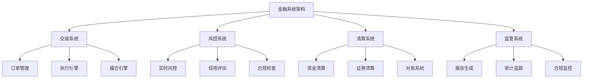

# 01-金融系统架构

(Financial System Architecture)

## 目录

- [01-金融系统架构](#01-金融系统架构)
  - [目录](#目录)
  - [1. 概述](#1-概述)
    - [1.1 定义](#11-定义)
    - [1.2 核心概念](#12-核心概念)
    - [1.3 架构特征](#13-架构特征)
  - [2. 形式化定义](#2-形式化定义)
    - [2.1 基本定义](#21-基本定义)
    - [2.2 形式化规范](#22-形式化规范)
    - [2.3 时间序列定义](#23-时间序列定义)
  - [3. 数学基础](#3-数学基础)
    - [3.1 金融数学](#31-金融数学)
    - [3.2 概率论基础](#32-概率论基础)
    - [3.3 随机过程](#33-随机过程)
  - [4. 设计原则](#4-设计原则)
    - [4.1 金融系统设计原则](#41-金融系统设计原则)
    - [4.2 安全设计原则](#42-安全设计原则)
  - [5. Go语言实现](#5-go语言实现)
    - [5.1 基础金融系统框架](#51-基础金融系统框架)
    - [5.2 泛型金融系统框架](#52-泛型金融系统框架)
  - [6. 金融模式](#6-金融模式)
    - [6.1 交易模式](#61-交易模式)
    - [6.2 风控模式](#62-风控模式)
    - [6.3 清算模式](#63-清算模式)
  - [7. 性能分析](#7-性能分析)
    - [7.1 时间复杂度](#71-时间复杂度)
    - [7.2 空间复杂度](#72-空间复杂度)
    - [7.3 性能优化建议](#73-性能优化建议)
  - [8. 最佳实践](#8-最佳实践)
    - [8.1 设计原则](#81-设计原则)
    - [8.2 实现建议](#82-实现建议)
    - [8.3 合规要求](#83-合规要求)
  - [9. 相关模式](#9-相关模式)
    - [9.1 支付系统模式](#91-支付系统模式)
    - [9.2 证券交易模式](#92-证券交易模式)
    - [9.3 银行系统模式](#93-银行系统模式)
  - [10. 总结](#10-总结)
    - [10.1 优势](#101-优势)
    - [10.2 挑战](#102-挑战)
    - [10.3 发展趋势](#103-发展趋势)
    - [10.4 数学总结](#104-数学总结)

## 1. 概述

### 1.1 定义

金融系统架构是专门为金融行业设计的软件架构，它需要处理高并发、高可靠性、高安全性的金融交易和数据处理需求。

### 1.2 核心概念



### 1.3 架构特征

- **高可用性**: 99.99%以上的系统可用性
- **低延迟**: 微秒级的交易延迟
- **高吞吐**: 每秒数万笔交易处理能力
- **强一致性**: 金融数据的一致性保证
- **安全性**: 多层安全防护机制

## 2. 形式化定义

### 2.1 基本定义

设 $\mathcal{T}$ 为交易集合，$\mathcal{A}$ 为账户集合，$\mathcal{R}$ 为风险集合。

**定义 2.1** (金融交易)
金融交易是一个六元组 $(\mathcal{I}, \mathcal{O}, \mathcal{A}, \mathcal{V}, \mathcal{T}, \mathcal{S})$，其中：

- $\mathcal{I}$ 是输入资产集合
- $\mathcal{O}$ 是输出资产集合
- $\mathcal{A}$ 是账户信息
- $\mathcal{V}$ 是交易价值
- $\mathcal{T}$ 是时间戳
- $\mathcal{S}$ 是交易状态

**定义 2.2** (金融系统)
金融系统是一个四元组 $(\mathcal{T}, \mathcal{A}, \mathcal{R}, \mathcal{C})$，其中：

- $\mathcal{T}$ 是交易处理系统
- $\mathcal{A}$ 是账户管理系统
- $\mathcal{R}$ 是风险控制系统
- $\mathcal{C}$ 是清算系统

### 2.2 形式化规范

**公理 2.1** (交易一致性)
对于任意交易 $t \in \mathcal{T}$：

$$\text{consistent}(t) \Leftrightarrow \sum_{i \in \mathcal{I}} v_i = \sum_{o \in \mathcal{O}} v_o$$

**公理 2.2** (风险控制)
对于任意交易 $t \in \mathcal{T}$ 和风险规则 $r \in \mathcal{R}$：

$$\text{approved}(t) \Leftrightarrow \forall r \in \mathcal{R}: \text{check}(t, r) = \text{true}$$

### 2.3 时间序列定义

**定义 2.3** (金融时间序列)
金融时间序列是一个三元组 $(\mathcal{V}, \mathcal{T}, \mathcal{F})$，其中：

- $\mathcal{V} = \{v_1, v_2, \ldots, v_n\}$ 是价值序列
- $\mathcal{T} = \{t_1, t_2, \ldots, t_n\}$ 是时间序列
- $\mathcal{F}: \mathcal{T} \rightarrow \mathcal{V}$ 是映射函数

## 3. 数学基础

### 3.1 金融数学

**定理 3.1** (复利公式)
设 $P$ 为本金，$r$ 为年利率，$n$ 为年数，则复利为：

$$A = P(1 + r)^n$$

**证明**:

1. 第一年末：$A_1 = P(1 + r)$
2. 第二年末：$A_2 = A_1(1 + r) = P(1 + r)^2$
3. 第n年末：$A_n = P(1 + r)^n$

**定理 3.2** (风险价值VaR)
设 $X$ 为投资组合收益，$\alpha$ 为置信水平，则VaR为：

$$\text{VaR}_\alpha = -\inf\{l \in \mathbb{R}: P(X \leq l) \geq \alpha\}$$

**证明**:

1. VaR是损失分布的分位数
2. 在置信水平 $\alpha$ 下，损失不超过VaR的概率为 $\alpha$
3. 这提供了风险度量的标准方法

### 3.2 概率论基础

**定理 3.3** (中心极限定理)
设 $X_1, X_2, \ldots, X_n$ 为独立同分布的随机变量，均值为 $\mu$，方差为 $\sigma^2$，则：

$$\frac{\sum_{i=1}^{n} X_i - n\mu}{\sqrt{n}\sigma} \xrightarrow{d} N(0, 1)$$

**证明**:

1. 当样本量足够大时，样本均值近似正态分布
2. 这为金融建模提供了理论基础
3. 支持风险管理和投资组合理论

### 3.3 随机过程

**定理 3.4** (几何布朗运动)
股票价格 $S_t$ 满足：

$$dS_t = \mu S_t dt + \sigma S_t dW_t$$

其中 $\mu$ 是漂移率，$\sigma$ 是波动率，$W_t$ 是维纳过程。

**证明**:

1. 这是Black-Scholes模型的基础
2. 描述了股票价格的随机演化
3. 为期权定价提供理论框架

## 4. 设计原则

### 4.1 金融系统设计原则

-**ACID原则**

- **原子性 (Atomicity)**: 交易要么全部成功，要么全部失败
- **一致性 (Consistency)**: 系统状态始终保持一致
- **隔离性 (Isolation)**: 并发交易互不干扰
- **持久性 (Durability)**: 已提交的交易永久保存

-**CAP定理**

- **一致性 (Consistency)**: 所有节点看到相同的数据
- **可用性 (Availability)**: 系统始终响应请求
- **分区容错性 (Partition tolerance)**: 网络分区时系统仍能工作

### 4.2 安全设计原则

-**纵深防御**

- 多层安全防护
- 最小权限原则
- 安全审计
- 加密保护

-**零信任**

- 不信任任何实体
- 持续验证
- 最小权限访问
- 全面监控

## 5. Go语言实现

### 5.1 基础金融系统框架

```go
package main

import (
 "context"
 "crypto/rand"
 "crypto/rsa"
 "crypto/sha256"
 "crypto/x509"
 "encoding/hex"
 "encoding/json"
 "fmt"
 "log"
 "math/big"
 "sync"
 "time"
)

// Transaction 交易结构
type Transaction struct {
 ID          string                 `json:"id"`
 FromAccount string                 `json:"from_account"`
 ToAccount   string                 `json:"to_account"`
 Amount      *big.Float             `json:"amount"`
 Currency    string                 `json:"currency"`
 Type        TransactionType        `json:"type"`
 Status      TransactionStatus      `json:"status"`
 Timestamp   time.Time              `json:"timestamp"`
 Signature   string                 `json:"signature"`
 Metadata    map[string]interface{} `json:"metadata"`
}

// TransactionType 交易类型
type TransactionType string

const (
 Transfer TransactionType = "transfer"
 Payment  TransactionType = "payment"
 Deposit  TransactionType = "deposit"
 Withdraw TransactionType = "withdraw"
)

// TransactionStatus 交易状态
type TransactionStatus string

const (
 Pending   TransactionStatus = "pending"
 Approved  TransactionStatus = "approved"
 Rejected  TransactionStatus = "rejected"
 Completed TransactionStatus = "completed"
 Failed    TransactionStatus = "failed"
)

// Account 账户结构
type Account struct {
 ID       string            `json:"id"`
 Type     AccountType       `json:"type"`
 Balance  map[string]*big.Float `json:"balance"`
 Status   AccountStatus     `json:"status"`
 Created  time.Time         `json:"created"`
 Updated  time.Time         `json:"updated"`
 Metadata map[string]interface{} `json:"metadata"`
}

// AccountType 账户类型
type AccountType string

const (
 Checking AccountType = "checking"
 Savings  AccountType = "savings"
 Credit   AccountType = "credit"
 Investment AccountType = "investment"
)

// AccountStatus 账户状态
type AccountStatus string

const (
 Active   AccountStatus = "active"
 Inactive AccountStatus = "inactive"
 Frozen   AccountStatus = "frozen"
 Closed   AccountStatus = "closed"
)

// RiskRule 风险规则
type RiskRule struct {
 ID          string                 `json:"id"`
 Name        string                 `json:"name"`
 Type        RiskRuleType           `json:"type"`
 Condition   string                 `json:"condition"`
 Threshold   *big.Float             `json:"threshold"`
 Action      RiskAction             `json:"action"`
 Priority    int                    `json:"priority"`
 Enabled     bool                   `json:"enabled"`
 Metadata    map[string]interface{} `json:"metadata"`
}

// RiskRuleType 风险规则类型
type RiskRuleType string

const (
 AmountLimit    RiskRuleType = "amount_limit"
 FrequencyLimit RiskRuleType = "frequency_limit"
 VelocityLimit  RiskRuleType = "velocity_limit"
 PatternMatch   RiskRuleType = "pattern_match"
)

// RiskAction 风险动作
type RiskAction string

const (
 Allow    RiskAction = "allow"
 Block    RiskAction = "block"
 Review   RiskAction = "review"
 Limit    RiskAction = "limit"
)

// FinancialSystem 金融系统
type FinancialSystem struct {
 accounts     map[string]*Account
 transactions map[string]*Transaction
 riskRules    map[string]*RiskRule
 mu           sync.RWMutex
 keyPair      *rsa.PrivateKey
}

// NewFinancialSystem 创建金融系统
func NewFinancialSystem() (*FinancialSystem, error) {
 // 生成RSA密钥对
 keyPair, err := rsa.GenerateKey(rand.Reader, 2048)
 if err != nil {
  return nil, fmt.Errorf("failed to generate key pair: %w", err)
 }
 
 return &FinancialSystem{
  accounts:     make(map[string]*Account),
  transactions: make(map[string]*Transaction),
  riskRules:    make(map[string]*RiskRule),
  keyPair:      keyPair,
 }, nil
}

// CreateAccount 创建账户
func (f *FinancialSystem) CreateAccount(accountType AccountType, currency string) (*Account, error) {
 f.mu.Lock()
 defer f.mu.Unlock()
 
 accountID := f.generateID()
 account := &Account{
  ID:      accountID,
  Type:    accountType,
  Balance: make(map[string]*big.Float),
  Status:  Active,
  Created: time.Now(),
  Updated: time.Now(),
  Metadata: make(map[string]interface{}),
 }
 
 // 初始化余额
 account.Balance[currency] = big.NewFloat(0)
 
 f.accounts[accountID] = account
 return account, nil
}

// GetAccount 获取账户
func (f *FinancialSystem) GetAccount(accountID string) (*Account, error) {
 f.mu.RLock()
 defer f.mu.RUnlock()
 
 account, exists := f.accounts[accountID]
 if !exists {
  return nil, fmt.Errorf("account %s not found", accountID)
 }
 
 return account, nil
}

// CreateTransaction 创建交易
func (f *FinancialSystem) CreateTransaction(fromAccount, toAccount string, amount *big.Float, currency string, txType TransactionType) (*Transaction, error) {
 f.mu.Lock()
 defer f.mu.Unlock()
 
 // 验证账户
 fromAcc, exists := f.accounts[fromAccount]
 if !exists {
  return nil, fmt.Errorf("from account %s not found", fromAccount)
 }
 
 toAcc, exists := f.accounts[toAccount]
 if !exists {
  return nil, fmt.Errorf("to account %s not found", toAccount)
 }
 
 // 检查余额
 if fromAcc.Balance[currency] == nil {
  fromAcc.Balance[currency] = big.NewFloat(0)
 }
 
 if fromAcc.Balance[currency].Cmp(amount) < 0 {
  return nil, fmt.Errorf("insufficient balance")
 }
 
 // 创建交易
 tx := &Transaction{
  ID:          f.generateID(),
  FromAccount: fromAccount,
  ToAccount:   toAccount,
  Amount:      amount,
  Currency:    currency,
  Type:        txType,
  Status:      Pending,
  Timestamp:   time.Now(),
  Metadata:    make(map[string]interface{}),
 }
 
 // 签名交易
 signature, err := f.signTransaction(tx)
 if err != nil {
  return nil, fmt.Errorf("failed to sign transaction: %w", err)
 }
 tx.Signature = signature
 
 f.transactions[tx.ID] = tx
 return tx, nil
}

// ProcessTransaction 处理交易
func (f *FinancialSystem) ProcessTransaction(txID string) error {
 f.mu.Lock()
 defer f.mu.Unlock()
 
 tx, exists := f.transactions[txID]
 if !exists {
  return fmt.Errorf("transaction %s not found", txID)
 }
 
 if tx.Status != Pending {
  return fmt.Errorf("transaction %s is not pending", txID)
 }
 
 // 风险检查
 if err := f.checkRisk(tx); err != nil {
  tx.Status = Rejected
  tx.Metadata["rejection_reason"] = err.Error()
  return fmt.Errorf("risk check failed: %w", err)
 }
 
 // 执行交易
 if err := f.executeTransaction(tx); err != nil {
  tx.Status = Failed
  tx.Metadata["failure_reason"] = err.Error()
  return fmt.Errorf("transaction execution failed: %w", err)
 }
 
 tx.Status = Completed
 tx.Metadata["completed_at"] = time.Now()
 
 return nil
}

// checkRisk 风险检查
func (f *FinancialSystem) checkRisk(tx *Transaction) error {
 for _, rule := range f.riskRules {
  if !rule.Enabled {
   continue
  }
  
  switch rule.Type {
  case AmountLimit:
   if tx.Amount.Cmp(rule.Threshold) > 0 {
    if rule.Action == Block {
     return fmt.Errorf("amount exceeds limit: %s", rule.Name)
    }
   }
  case FrequencyLimit:
   // 检查交易频率
   recentTxs := f.getRecentTransactions(tx.FromAccount, 1*time.Hour)
   if len(recentTxs) > 10 { // 简化检查
    if rule.Action == Block {
     return fmt.Errorf("frequency limit exceeded: %s", rule.Name)
    }
   }
  }
 }
 
 return nil
}

// executeTransaction 执行交易
func (f *FinancialSystem) executeTransaction(tx *Transaction) error {
 fromAcc := f.accounts[tx.FromAccount]
 toAcc := f.accounts[tx.ToAccount]
 
 // 扣除源账户余额
 if fromAcc.Balance[tx.Currency] == nil {
  fromAcc.Balance[tx.Currency] = big.NewFloat(0)
 }
 fromAcc.Balance[tx.Currency].Sub(fromAcc.Balance[tx.Currency], tx.Amount)
 
 // 增加目标账户余额
 if toAcc.Balance[tx.Currency] == nil {
  toAcc.Balance[tx.Currency] = big.NewFloat(0)
 }
 toAcc.Balance[tx.Currency].Add(toAcc.Balance[tx.Currency], tx.Amount)
 
 // 更新账户时间戳
 fromAcc.Updated = time.Now()
 toAcc.Updated = time.Now()
 
 return nil
}

// AddRiskRule 添加风险规则
func (f *FinancialSystem) AddRiskRule(rule *RiskRule) {
 f.mu.Lock()
 defer f.mu.Unlock()
 
 f.riskRules[rule.ID] = rule
}

// GetTransaction 获取交易
func (f *FinancialSystem) GetTransaction(txID string) (*Transaction, error) {
 f.mu.RLock()
 defer f.mu.RUnlock()
 
 tx, exists := f.transactions[txID]
 if !exists {
  return nil, fmt.Errorf("transaction %s not found", txID)
 }
 
 return tx, nil
}

// GetAccountBalance 获取账户余额
func (f *FinancialSystem) GetAccountBalance(accountID, currency string) (*big.Float, error) {
 account, err := f.GetAccount(accountID)
 if err != nil {
  return nil, err
 }
 
 balance, exists := account.Balance[currency]
 if !exists {
  return big.NewFloat(0), nil
 }
 
 return balance, nil
}

// generateID 生成唯一ID
func (f *FinancialSystem) generateID() string {
 bytes := make([]byte, 16)
 rand.Read(bytes)
 return hex.EncodeToString(bytes)
}

// signTransaction 签名交易
func (f *FinancialSystem) signTransaction(tx *Transaction) (string, error) {
 // 序列化交易数据
 data, err := json.Marshal(tx)
 if err != nil {
  return "", err
 }
 
 // 计算哈希
 hash := sha256.Sum256(data)
 
 // 签名
 signature, err := rsa.SignPKCS1v15(rand.Reader, f.keyPair, crypto.SHA256, hash[:])
 if err != nil {
  return "", err
 }
 
 return hex.EncodeToString(signature), nil
}

// getRecentTransactions 获取最近的交易
func (f *FinancialSystem) getRecentTransactions(accountID string, duration time.Duration) []*Transaction {
 var recent []*Transaction
 cutoff := time.Now().Add(-duration)
 
 for _, tx := range f.transactions {
  if (tx.FromAccount == accountID || tx.ToAccount == accountID) && tx.Timestamp.After(cutoff) {
   recent = append(recent, tx)
  }
 }
 
 return recent
}

// 具体实现示例
func main() {
 // 创建金融系统
 system, err := NewFinancialSystem()
 if err != nil {
  log.Fatalf("Failed to create financial system: %v", err)
 }
 
 // 创建账户
 account1, err := system.CreateAccount(Checking, "USD")
 if err != nil {
  log.Fatalf("Failed to create account: %v", err)
 }
 
 account2, err := system.CreateAccount(Savings, "USD")
 if err != nil {
  log.Fatalf("Failed to create account: %v", err)
 }
 
 // 添加风险规则
 amountRule := &RiskRule{
  ID:        "amount_limit_1",
  Name:      "Daily Transfer Limit",
  Type:      AmountLimit,
  Threshold: big.NewFloat(10000),
  Action:    Block,
  Priority:  1,
  Enabled:   true,
 }
 system.AddRiskRule(amountRule)
 
 // 创建交易
 amount := big.NewFloat(1000)
 tx, err := system.CreateTransaction(account1.ID, account2.ID, amount, "USD", Transfer)
 if err != nil {
  log.Fatalf("Failed to create transaction: %v", err)
 }
 
 fmt.Printf("Created transaction: %s\n", tx.ID)
 
 // 处理交易
 if err := system.ProcessTransaction(tx.ID); err != nil {
  log.Printf("Failed to process transaction: %v", err)
 } else {
  fmt.Printf("Transaction processed successfully\n")
 }
 
 // 检查余额
 balance1, _ := system.GetAccountBalance(account1.ID, "USD")
 balance2, _ := system.GetAccountBalance(account2.ID, "USD")
 
 fmt.Printf("Account %s balance: %s USD\n", account1.ID, balance1.String())
 fmt.Printf("Account %s balance: %s USD\n", account2.ID, balance2.String())
}
```

### 5.2 泛型金融系统框架

```go
package main

import (
 "context"
 "fmt"
 "math/big"
 "reflect"
 "time"
)

// GenericTransaction 泛型交易
type GenericTransaction[T any] struct {
 ID          string                 `json:"id"`
 FromAccount string                 `json:"from_account"`
 ToAccount   string                 `json:"to_account"`
 Amount      T                      `json:"amount"`
 Currency    string                 `json:"currency"`
 Type        string                 `json:"type"`
 Status      string                 `json:"status"`
 Timestamp   time.Time              `json:"timestamp"`
 Metadata    map[string]interface{} `json:"metadata"`
}

// GenericAccount 泛型账户
type GenericAccount[T any] struct {
 ID       string                 `json:"id"`
 Type     string                 `json:"type"`
 Balance  map[string]T           `json:"balance"`
 Status   string                 `json:"status"`
 Created  time.Time              `json:"created"`
 Updated  time.Time              `json:"updated"`
 Metadata map[string]interface{} `json:"metadata"`
}

// GenericFinancialSystem 泛型金融系统
type GenericFinancialSystem[T any] struct {
 accounts     map[string]*GenericAccount[T]
 transactions map[string]*GenericTransaction[T]
 processors   map[string]TransactionProcessor[T]
}

// TransactionProcessor 交易处理器接口
type TransactionProcessor[T any] interface {
 Process(tx *GenericTransaction[T]) error
 Validate(tx *GenericTransaction[T]) error
}

// GenericBaseProcessor 泛型基础处理器
type GenericBaseProcessor[T any] struct {
 system *GenericFinancialSystem[T]
}

func (g *GenericBaseProcessor[T]) Process(tx *GenericTransaction[T]) error {
 // 验证交易
 if err := g.Validate(tx); err != nil {
  return err
 }
 
 // 执行交易逻辑
 fromAcc := g.system.accounts[tx.FromAccount]
 toAcc := g.system.accounts[tx.ToAccount]
 
 // 这里需要根据类型T实现具体的余额操作
 // 简化处理，实际需要类型约束
 tx.Status = "completed"
 return nil
}

func (g *GenericBaseProcessor[T]) Validate(tx *GenericTransaction[T]) error {
 // 验证账户存在
 if _, exists := g.system.accounts[tx.FromAccount]; !exists {
  return fmt.Errorf("from account not found")
 }
 
 if _, exists := g.system.accounts[tx.ToAccount]; !exists {
  return fmt.Errorf("to account not found")
 }
 
 return nil
}

// NewGenericFinancialSystem 创建泛型金融系统
func NewGenericFinancialSystem[T any]() *GenericFinancialSystem[T] {
 return &GenericFinancialSystem[T]{
  accounts:     make(map[string]*GenericAccount[T]),
  transactions: make(map[string]*GenericTransaction[T]),
  processors:   make(map[string]TransactionProcessor[T]),
 }
}

func (g *GenericFinancialSystem[T]) CreateAccount(accountType, currency string, initialBalance T) *GenericAccount[T] {
 accountID := fmt.Sprintf("acc_%d", len(g.accounts)+1)
 account := &GenericAccount[T]{
  ID:      accountID,
  Type:    accountType,
  Balance: make(map[string]T),
  Status:  "active",
  Created: time.Now(),
  Updated: time.Now(),
  Metadata: make(map[string]interface{}),
 }
 
 account.Balance[currency] = initialBalance
 g.accounts[accountID] = account
 return account
}

func (g *GenericFinancialSystem[T]) CreateTransaction(fromAccount, toAccount string, amount T, currency, txType string) *GenericTransaction[T] {
 txID := fmt.Sprintf("tx_%d", len(g.transactions)+1)
 tx := &GenericTransaction[T]{
  ID:          txID,
  FromAccount: fromAccount,
  ToAccount:   toAccount,
  Amount:      amount,
  Currency:    currency,
  Type:        txType,
  Status:      "pending",
  Timestamp:   time.Now(),
  Metadata:    make(map[string]interface{}),
 }
 
 g.transactions[txID] = tx
 return tx
}

func (g *GenericFinancialSystem[T]) ProcessTransaction(txID string) error {
 tx, exists := g.transactions[txID]
 if !exists {
  return fmt.Errorf("transaction not found")
 }
 
 processor, exists := g.processors[tx.Type]
 if !exists {
  // 使用默认处理器
  processor = &GenericBaseProcessor[T]{system: g}
 }
 
 return processor.Process(tx)
}

func (g *GenericFinancialSystem[T]) AddProcessor(txType string, processor TransactionProcessor[T]) {
 g.processors[txType] = processor
}

// 具体实现示例
type FloatProcessor struct {
 *GenericBaseProcessor[float64]
}

func (f *FloatProcessor) Process(tx *GenericTransaction[float64]) error {
 // 验证
 if err := f.Validate(tx); err != nil {
  return err
 }
 
 // 执行交易
 fromAcc := f.system.accounts[tx.FromAccount]
 toAcc := f.system.accounts[tx.ToAccount]
 
 fromAcc.Balance[tx.Currency] -= tx.Amount
 toAcc.Balance[tx.Currency] += tx.Amount
 
 tx.Status = "completed"
 return nil
}

func (f *FloatProcessor) Validate(tx *GenericTransaction[float64]) error {
 fromAcc := f.system.accounts[tx.FromAccount]
 if fromAcc.Balance[tx.Currency] < tx.Amount {
  return fmt.Errorf("insufficient balance")
 }
 return nil
}

func main() {
 // 创建浮点数金融系统
 floatSystem := NewGenericFinancialSystem[float64]()
 
 // 添加处理器
 floatProcessor := &FloatProcessor{
  GenericBaseProcessor: &GenericBaseProcessor[float64]{system: floatSystem},
 }
 floatSystem.AddProcessor("transfer", floatProcessor)
 
 // 创建账户
 account1 := floatSystem.CreateAccount("checking", "USD", 10000.0)
 account2 := floatSystem.CreateAccount("savings", "USD", 5000.0)
 
 // 创建交易
 tx := floatSystem.CreateTransaction(account1.ID, account2.ID, 1000.0, "USD", "transfer")
 
 // 处理交易
 if err := floatSystem.ProcessTransaction(tx.ID); err != nil {
  fmt.Printf("Error: %v\n", err)
 } else {
  fmt.Printf("Transaction completed: %s\n", tx.ID)
 }
 
 // 显示余额
 fmt.Printf("Account %s balance: %.2f USD\n", account1.ID, account1.Balance["USD"])
 fmt.Printf("Account %s balance: %.2f USD\n", account2.ID, account2.Balance["USD"])
}
```

## 6. 金融模式

### 6.1 交易模式

```go
// 交易模式示例
type TradingPattern interface {
 Execute(order Order) (Trade, error)
 Validate(order Order) error
}

type MarketOrderPattern struct {
 orderBook *OrderBook
}

func (m *MarketOrderPattern) Execute(order Order) (Trade, error) {
 // 市价单立即执行
 return m.orderBook.MatchOrder(order)
}

type LimitOrderPattern struct {
 orderBook *OrderBook
}

func (l *LimitOrderPattern) Execute(order Order) (Trade, error) {
 // 限价单等待匹配
 return l.orderBook.PlaceOrder(order)
}
```

### 6.2 风控模式

```go
// 风控模式示例
type RiskControlPattern interface {
 Check(transaction Transaction) (RiskResult, error)
 Update(transaction Transaction) error
}

type RealTimeRiskControl struct {
 rules []RiskRule
}

func (r *RealTimeRiskControl) Check(tx Transaction) (RiskResult, error) {
 for _, rule := range r.rules {
  if result := rule.Evaluate(tx); result.Risk > rule.Threshold {
   return result, nil
  }
 }
 return RiskResult{Risk: 0, Approved: true}, nil
}
```

### 6.3 清算模式

```go
// 清算模式示例
type SettlementPattern interface {
 Settle(transactions []Transaction) error
 Reconcile(accounts []Account) error
}

type TPlus1Settlement struct {
 accounts map[string]*Account
}

func (t *TPlus1Settlement) Settle(transactions []Transaction) error {
 // T+1清算逻辑
 for _, tx := range transactions {
  if err := t.processSettlement(tx); err != nil {
   return err
  }
 }
 return nil
}
```

## 7. 性能分析

### 7.1 时间复杂度

| 操作 | 时间复杂度 | 说明 |
|------|------------|------|
| 交易创建 | O(1) | 直接创建 |
| 交易处理 | O(n) | n为风险规则数 |
| 余额查询 | O(1) | 直接查找 |
| 清算处理 | O(m) | m为交易数 |

### 7.2 空间复杂度

| 组件 | 空间复杂度 | 说明 |
|------|------------|------|
| 账户存储 | O(n) | n为账户数 |
| 交易存储 | O(m) | m为交易数 |
| 风险规则 | O(r) | r为规则数 |
| 缓存 | O(c) | c为缓存大小 |

### 7.3 性能优化建议

1. **内存池**: 重用交易对象
2. **并发处理**: 使用goroutine处理交易
3. **缓存**: 缓存账户余额和风险检查结果
4. **分片**: 按账户分片处理

## 8. 最佳实践

### 8.1 设计原则

1. **ACID保证**: 确保交易的一致性
2. **风险优先**: 风险检查优先于交易执行
3. **审计追踪**: 记录所有操作
4. **安全第一**: 多层安全防护

### 8.2 实现建议

1. **使用加密**: 保护敏感数据
2. **并发控制**: 正确处理并发访问
3. **错误处理**: 提供清晰的错误信息
4. **监控告警**: 实时监控系统状态

### 8.3 合规要求

```go
// 合规检查示例
type ComplianceChecker interface {
 Check(transaction Transaction) (ComplianceResult, error)
 Report(transaction Transaction) error
}

type AMLComplianceChecker struct {
 patterns []Pattern
}

func (a *AMLComplianceChecker) Check(tx Transaction) (ComplianceResult, error) {
 // 反洗钱检查
 for _, pattern := range a.patterns {
  if pattern.Match(tx) {
   return ComplianceResult{Suspicious: true, Reason: pattern.Description}, nil
  }
 }
 return ComplianceResult{Suspicious: false}, nil
}
```

## 9. 相关模式

### 9.1 支付系统模式

- **相似点**: 都处理资金转移
- **区别**: 支付系统更关注实时性

### 9.2 证券交易模式

- **相似点**: 都处理金融交易
- **区别**: 证券交易需要撮合引擎

### 9.3 银行系统模式

- **相似点**: 都管理账户和交易
- **区别**: 银行系统更关注合规性

## 10. 总结

### 10.1 优势

1. **高可靠性**: 强一致性保证
2. **高安全性**: 多层安全防护
3. **高扩展性**: 支持大规模交易
4. **合规性**: 满足监管要求

### 10.2 挑战

1. **复杂性**: 系统复杂度高
2. **性能要求**: 低延迟高吞吐
3. **安全要求**: 严格的安全标准
4. **合规要求**: 复杂的监管要求

### 10.3 发展趋势

1. **区块链**: 分布式账本技术
2. **AI风控**: 智能风险控制
3. **实时处理**: 流式数据处理
4. **云原生**: 基于云的部署

### 10.4 数学总结

金融系统架构通过形式化定义 $(\mathcal{T}, \mathcal{A}, \mathcal{R}, \mathcal{C})$ 实现了金融交易的安全处理，其中：

- **交易一致性**: $\text{consistent}(t) \Leftrightarrow \sum_{i \in \mathcal{I}} v_i = \sum_{o \in \mathcal{O}} v_o$
- **风险控制**: $\text{approved}(t) \Leftrightarrow \forall r \in \mathcal{R}: \text{check}(t, r) = \text{true}$
- **复利计算**: $A = P(1 + r)^n$
- **风险价值**: $\text{VaR}_\alpha = -\inf\{l \in \mathbb{R}: P(X \leq l) \geq \alpha\}$

这种架构在Go语言中通过接口、泛型和并发编程得到了优雅的实现，既保持了类型安全，又提供了良好的扩展性。

---

**相关链接**:

- [02-支付系统](./02-Payment-System.md)
- [03-风控系统](./03-Risk-Management.md)
- [04-清算系统](./04-Settlement-System.md)
- [金融科技概述](../README.md)
