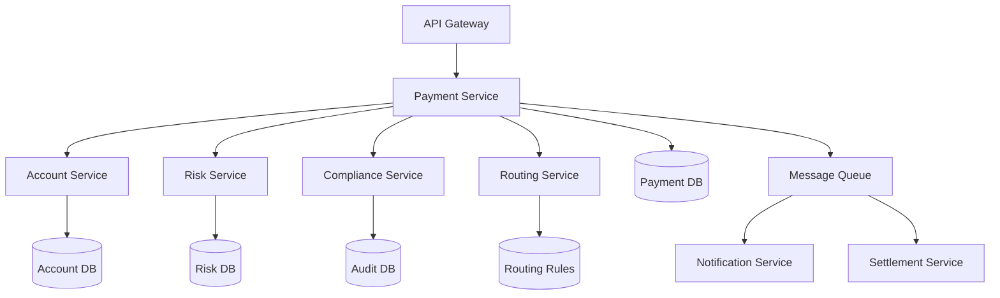

# 02-支付系统 (Payment System)

## 目录

- [1. 概述](#1-概述)
- [2. 形式化定义](#2-形式化定义)
- [3. 数学证明](#3-数学证明)
- [4. 架构设计](#4-架构设计)
- [5. Go语言实现](#5-go语言实现)
- [6. 性能优化](#6-性能优化)
- [7. 安全机制](#7-安全机制)
- [8. 测试策略](#8-测试策略)
- [9. 部署配置](#9-部署配置)

## 1. 概述

### 1.1 定义

支付系统是金融科技领域的核心基础设施，负责处理资金转移、交易结算和支付路由等关键业务。

**形式化定义**：
设 $P$ 为支付系统，$A$ 为账户集合，$T$ 为交易集合，则：
$$P = (A, T, \phi, \psi, \delta)$$

其中：

- $\phi: A \times A \times \mathbb{R} \rightarrow T$ 为支付函数
- $\psi: T \rightarrow \{pending, processing, completed, failed\}$ 为状态函数
- $\delta: T \rightarrow \mathbb{R}^+$ 为处理时间函数

### 1.2 核心特性

- **原子性**：支付操作要么完全成功，要么完全失败
- **一致性**：账户余额在支付前后保持一致性
- **隔离性**：并发支付操作相互隔离
- **持久性**：已完成的支付结果永久保存

## 2. 形式化定义

### 2.1 支付状态机

**定义**：支付状态机是一个五元组 $M = (Q, \Sigma, \delta, q_0, F)$

其中：

- $Q = \{pending, processing, completed, failed, cancelled\}$ 为状态集合
- $\Sigma = \{initiate, validate, process, complete, fail, cancel\}$ 为输入字母表
- $\delta: Q \times \Sigma \rightarrow Q$ 为状态转移函数
- $q_0 = pending$ 为初始状态
- $F = \{completed, failed, cancelled\}$ 为终止状态集合

**状态转移表**：

| 当前状态 | 输入 | 下一状态 |
|---------|------|----------|
| pending | initiate | processing |
| pending | cancel | cancelled |
| processing | validate | processing |
| processing | process | completed |
| processing | fail | failed |
| completed | - | completed |
| failed | - | failed |
| cancelled | - | cancelled |

### 2.2 支付路由算法

**定义**：支付路由函数 $R: P \rightarrow R$ 将支付 $p$ 映射到最优路由 $r$

其中路由成本函数：
$$C(r) = \sum_{i=1}^{n} (w_i \cdot c_i)$$

其中：

- $w_i$ 为权重因子
- $c_i$ 为第 $i$ 个成本组件（手续费、时间、风险等）

## 3. 数学证明

### 3.1 支付原子性定理

**定理**：在分布式支付系统中，如果所有参与节点都实现了两阶段提交协议，则支付操作具有原子性。

**证明**：

设 $N = \{n_1, n_2, ..., n_k\}$ 为参与节点集合，$T$ 为支付事务。

**第一阶段（准备阶段）**：

1. 协调者向所有参与者发送 `PREPARE` 消息
2. 每个参与者 $n_i$ 执行本地操作并返回 `READY` 或 `ABORT`
3. 如果所有参与者都返回 `READY`，进入第二阶段；否则中止事务

**第二阶段（提交阶段）**：

1. 协调者向所有参与者发送 `COMMIT` 或 `ABORT` 消息
2. 所有参与者执行最终操作

**原子性保证**：

- 如果任何参与者在第一阶段返回 `ABORT`，整个事务中止
- 如果所有参与者都返回 `READY`，协调者发送 `COMMIT`，所有参与者提交
- 因此，要么所有节点都提交，要么都中止，保证了原子性。

### 3.2 余额一致性定理

**定理**：在支付系统中，如果每个账户的余额更新都遵循 $balance_{new} = balance_{old} - amount$ 的规则，则系统总余额保持不变。

**证明**：

设系统中有 $n$ 个账户，初始总余额为：
$$B_{total} = \sum_{i=1}^{n} balance_i$$

对于支付操作 $p: A_i \rightarrow A_j$，金额为 $amount$：

**支付前**：
$$B_{total} = \sum_{k=1}^{n} balance_k$$

**支付后**：
$$B_{total}' = \sum_{k=1,k \neq i,j}^{n} balance_k + (balance_i - amount) + (balance_j + amount)$$

$$B_{total}' = \sum_{k=1}^{n} balance_k - amount + amount = \sum_{k=1}^{n} balance_k = B_{total}$$

因此，支付操作保持系统总余额不变。

## 4. 架构设计

### 4.1 系统架构图



### 4.2 微服务架构

```go
// 支付服务接口
type PaymentService interface {
    ProcessPayment(ctx context.Context, req *PaymentRequest) (*PaymentResponse, error)
    GetPaymentStatus(ctx context.Context, paymentID string) (*PaymentStatus, error)
    CancelPayment(ctx context.Context, paymentID string) error
    GetPaymentHistory(ctx context.Context, accountID string) ([]*Payment, error)
}

// 账户服务接口
type AccountService interface {
    GetAccount(ctx context.Context, accountID string) (*Account, error)
    UpdateBalance(ctx context.Context, accountID string, amount decimal.Decimal) error
    ValidateTransfer(ctx context.Context, fromAccount, toAccount string, amount decimal.Decimal) error
}

// 风控服务接口
type RiskService interface {
    AssessRisk(ctx context.Context, payment *Payment) (*RiskAssessment, error)
    CheckLimits(ctx context.Context, accountID string, amount decimal.Decimal) error
}
```

## 5. Go语言实现

### 5.1 核心数据结构

```go
package payment

import (
    "context"
    "time"
    "github.com/shopspring/decimal"
    "github.com/google/uuid"
)

// 支付状态枚举
type PaymentStatus string

const (
    PaymentStatusPending    PaymentStatus = "pending"
    PaymentStatusProcessing PaymentStatus = "processing"
    PaymentStatusCompleted  PaymentStatus = "completed"
    PaymentStatusFailed     PaymentStatus = "failed"
    PaymentStatusCancelled  PaymentStatus = "cancelled"
)

// 支付方法枚举
type PaymentMethod string

const (
    PaymentMethodBankTransfer PaymentMethod = "bank_transfer"
    PaymentMethodCard         PaymentMethod = "card"
    PaymentMethodDigitalWallet PaymentMethod = "digital_wallet"
    PaymentMethodCrypto       PaymentMethod = "crypto"
)

// 货币类型
type Currency string

const (
    CurrencyUSD Currency = "USD"
    CurrencyEUR Currency = "EUR"
    CurrencyCNY Currency = "CNY"
    CurrencyBTC Currency = "BTC"
)

// 支付请求
type PaymentRequest struct {
    ID            string          `json:"id"`
    FromAccount   string          `json:"from_account"`
    ToAccount     string          `json:"to_account"`
    Amount        decimal.Decimal `json:"amount"`
    Currency      Currency        `json:"currency"`
    PaymentMethod PaymentMethod   `json:"payment_method"`
    Description   string          `json:"description"`
    Reference     string          `json:"reference"`
    Metadata      map[string]interface{} `json:"metadata"`
}

// 支付响应
type PaymentResponse struct {
    PaymentID     string          `json:"payment_id"`
    Status        PaymentStatus   `json:"status"`
    ProcessedAt   *time.Time      `json:"processed_at,omitempty"`
    FailureReason string          `json:"failure_reason,omitempty"`
    RoutingInfo   *RoutingInfo    `json:"routing_info,omitempty"`
}

// 支付实体
type Payment struct {
    ID            string          `json:"id" db:"id"`
    FromAccount   string          `json:"from_account" db:"from_account"`
    ToAccount     string          `json:"to_account" db:"to_account"`
    Amount        decimal.Decimal `json:"amount" db:"amount"`
    Currency      Currency        `json:"currency" db:"currency"`
    PaymentMethod PaymentMethod   `json:"payment_method" db:"payment_method"`
    Status        PaymentStatus   `json:"status" db:"status"`
    Description   string          `json:"description" db:"description"`
    Reference     string          `json:"reference" db:"reference"`
    Metadata      map[string]interface{} `json:"metadata" db:"metadata"`
    CreatedAt     time.Time       `json:"created_at" db:"created_at"`
    ProcessedAt   *time.Time      `json:"processed_at" db:"processed_at"`
    FailedAt      *time.Time      `json:"failed_at" db:"failed_at"`
    FailureReason string          `json:"failure_reason" db:"failure_reason"`
    Version       int64           `json:"version" db:"version"`
}

// 路由信息
type RoutingInfo struct {
    RouteID       string          `json:"route_id"`
    Provider      string          `json:"provider"`
    Fee           decimal.Decimal `json:"fee"`
    EstimatedTime time.Duration   `json:"estimated_time"`
    RiskScore     float64         `json:"risk_score"`
}

// 风险评估
type RiskAssessment struct {
    RiskScore     float64         `json:"risk_score"`
    RiskLevel     RiskLevel       `json:"risk_level"`
    RiskFactors   []string        `json:"risk_factors"`
    Recommendations []string      `json:"recommendations"`
    Timestamp     time.Time       `json:"timestamp"`
}

type RiskLevel string

const (
    RiskLevelLow    RiskLevel = "low"
    RiskLevelMedium RiskLevel = "medium"
    RiskLevelHigh   RiskLevel = "high"
)
```

### 5.2 支付服务实现

```go
// 支付服务实现
type paymentService struct {
    accountService    AccountService
    riskService       RiskService
    complianceService ComplianceService
    routingService    RoutingService
    paymentRepo       PaymentRepository
    eventPublisher    EventPublisher
    logger            *zap.Logger
}

// 创建支付服务
func NewPaymentService(
    accountService AccountService,
    riskService RiskService,
    complianceService ComplianceService,
    routingService RoutingService,
    paymentRepo PaymentRepository,
    eventPublisher EventPublisher,
    logger *zap.Logger,
) PaymentService {
    return &paymentService{
        accountService:    accountService,
        riskService:       riskService,
        complianceService: complianceService,
        routingService:    routingService,
        paymentRepo:       paymentRepo,
        eventPublisher:    eventPublisher,
        logger:            logger,
    }
}

// 处理支付
func (s *paymentService) ProcessPayment(ctx context.Context, req *PaymentRequest) (*PaymentResponse, error) {
    startTime := time.Now()
    
    s.logger.Info("Processing payment",
        zap.String("payment_id", req.ID),
        zap.String("from_account", req.FromAccount),
        zap.String("to_account", req.ToAccount),
        zap.String("amount", req.Amount.String()),
        zap.String("currency", string(req.Currency)),
    )
    
    // 1. 验证请求
    if err := s.validateRequest(req); err != nil {
        return nil, fmt.Errorf("invalid request: %w", err)
    }
    
    // 2. 创建支付记录
    payment := &Payment{
        ID:            req.ID,
        FromAccount:   req.FromAccount,
        ToAccount:     req.ToAccount,
        Amount:        req.Amount,
        Currency:      req.Currency,
        PaymentMethod: req.PaymentMethod,
        Status:        PaymentStatusPending,
        Description:   req.Description,
        Reference:     req.Reference,
        Metadata:      req.Metadata,
        CreatedAt:     time.Now(),
        Version:       1,
    }
    
    // 3. 保存支付记录
    if err := s.paymentRepo.Create(ctx, payment); err != nil {
        return nil, fmt.Errorf("failed to create payment: %w", err)
    }
    
    // 4. 风险评估
    riskAssessment, err := s.riskService.AssessRisk(ctx, payment)
    if err != nil {
        s.logger.Error("Risk assessment failed", zap.Error(err))
        return s.handlePaymentFailure(ctx, payment, "risk_assessment_failed", err.Error())
    }
    
    // 5. 根据风险等级处理
    var response *PaymentResponse
    switch riskAssessment.RiskLevel {
    case RiskLevelLow:
        response, err = s.processLowRiskPayment(ctx, payment, riskAssessment)
    case RiskLevelMedium:
        response, err = s.processMediumRiskPayment(ctx, payment, riskAssessment)
    case RiskLevelHigh:
        return s.handlePaymentFailure(ctx, payment, "high_risk", "Payment rejected due to high risk")
    default:
        return s.handlePaymentFailure(ctx, payment, "unknown_risk_level", "Unknown risk level")
    }
    
    if err != nil {
        return s.handlePaymentFailure(ctx, payment, "processing_failed", err.Error())
    }
    
    // 6. 发布事件
    s.publishPaymentEvent(ctx, payment, "payment_processed")
    
    // 7. 记录处理时间
    processingTime := time.Since(startTime)
    s.logger.Info("Payment processed successfully",
        zap.String("payment_id", payment.ID),
        zap.Duration("processing_time", processingTime),
    )
    
    return response, nil
}

// 验证请求
func (s *paymentService) validateRequest(req *PaymentRequest) error {
    if req.ID == "" {
        return errors.New("payment ID is required")
    }
    if req.FromAccount == "" {
        return errors.New("from account is required")
    }
    if req.ToAccount == "" {
        return errors.New("to account is required")
    }
    if req.Amount.LessThanOrEqual(decimal.Zero) {
        return errors.New("amount must be positive")
    }
    if req.Currency == "" {
        return errors.New("currency is required")
    }
    if req.PaymentMethod == "" {
        return errors.New("payment method is required")
    }
    if req.FromAccount == req.ToAccount {
        return errors.New("from and to accounts cannot be the same")
    }
    
    return nil
}

// 处理低风险支付
func (s *paymentService) processLowRiskPayment(ctx context.Context, payment *Payment, riskAssessment *RiskAssessment) (*PaymentResponse, error) {
    // 1. 检查账户余额
    if err := s.accountService.ValidateTransfer(ctx, payment.FromAccount, payment.ToAccount, payment.Amount); err != nil {
        return nil, fmt.Errorf("transfer validation failed: %w", err)
    }
    
    // 2. 获取路由信息
    routingInfo, err := s.routingService.GetOptimalRoute(ctx, payment)
    if err != nil {
        return nil, fmt.Errorf("failed to get routing info: %w", err)
    }
    
    // 3. 执行转账
    if err := s.executeTransfer(ctx, payment); err != nil {
        return nil, fmt.Errorf("transfer execution failed: %w", err)
    }
    
    // 4. 更新支付状态
    payment.Status = PaymentStatusCompleted
    now := time.Now()
    payment.ProcessedAt = &now
    payment.Version++
    
    if err := s.paymentRepo.Update(ctx, payment); err != nil {
        return nil, fmt.Errorf("failed to update payment: %w", err)
    }
    
    return &PaymentResponse{
        PaymentID:   payment.ID,
        Status:      PaymentStatusCompleted,
        ProcessedAt: &now,
        RoutingInfo: routingInfo,
    }, nil
}

// 处理中等风险支付
func (s *paymentService) processMediumRiskPayment(ctx context.Context, payment *Payment, riskAssessment *RiskAssessment) (*PaymentResponse, error) {
    // 中等风险支付需要人工审核
    payment.Status = PaymentStatusProcessing
    payment.Version++
    
    if err := s.paymentRepo.Update(ctx, payment); err != nil {
        return nil, fmt.Errorf("failed to update payment: %w", err)
    }
    
    // 发送人工审核通知
    s.publishPaymentEvent(ctx, payment, "payment_requires_review")
    
    return &PaymentResponse{
        PaymentID: payment.ID,
        Status:    PaymentStatusProcessing,
    }, nil
}

// 处理支付失败
func (s *paymentService) handlePaymentFailure(ctx context.Context, payment *Payment, reason, message string) (*PaymentResponse, error) {
    payment.Status = PaymentStatusFailed
    now := time.Now()
    payment.FailedAt = &now
    payment.FailureReason = message
    payment.Version++
    
    if err := s.paymentRepo.Update(ctx, payment); err != nil {
        s.logger.Error("Failed to update payment status", zap.Error(err))
    }
    
    s.publishPaymentEvent(ctx, payment, "payment_failed")
    
    return &PaymentResponse{
        PaymentID:     payment.ID,
        Status:        PaymentStatusFailed,
        FailureReason: message,
    }, nil
}

// 执行转账
func (s *paymentService) executeTransfer(ctx context.Context, payment *Payment) error {
    // 使用事务确保原子性
    return s.paymentRepo.WithTransaction(ctx, func(txCtx context.Context) error {
        // 1. 扣除源账户余额
        if err := s.accountService.UpdateBalance(txCtx, payment.FromAccount, payment.Amount.Neg()); err != nil {
            return fmt.Errorf("failed to debit from account: %w", err)
        }
        
        // 2. 增加目标账户余额
        if err := s.accountService.UpdateBalance(txCtx, payment.ToAccount, payment.Amount); err != nil {
            return fmt.Errorf("failed to credit to account: %w", err)
        }
        
        return nil
    })
}

// 发布支付事件
func (s *paymentService) publishPaymentEvent(ctx context.Context, payment *Payment, eventType string) {
    event := &PaymentEvent{
        ID:          uuid.New().String(),
        PaymentID:   payment.ID,
        EventType:   eventType,
        Payment:     payment,
        Timestamp:   time.Now(),
    }
    
    if err := s.eventPublisher.Publish(ctx, "payment_events", event); err != nil {
        s.logger.Error("Failed to publish payment event", zap.Error(err))
    }
}
```

### 5.3 路由服务实现

```go
// 路由服务接口
type RoutingService interface {
    GetOptimalRoute(ctx context.Context, payment *Payment) (*RoutingInfo, error)
    GetAvailableRoutes(ctx context.Context, payment *Payment) ([]*RoutingInfo, error)
}

// 路由服务实现
type routingService struct {
    routeRepo    RouteRepository
    cache        Cache
    logger       *zap.Logger
}

// 获取最优路由
func (s *routingService) GetOptimalRoute(ctx context.Context, payment *Payment) (*RoutingInfo, error) {
    // 1. 检查缓存
    cacheKey := fmt.Sprintf("route:%s:%s:%s", payment.FromAccount, payment.ToAccount, payment.Currency)
    if cached, err := s.cache.Get(ctx, cacheKey); err == nil {
        if route, ok := cached.(*RoutingInfo); ok {
            return route, nil
        }
    }
    
    // 2. 获取可用路由
    routes, err := s.routeRepo.GetAvailableRoutes(ctx, payment)
    if err != nil {
        return nil, fmt.Errorf("failed to get available routes: %w", err)
    }
    
    if len(routes) == 0 {
        return nil, errors.New("no available routes found")
    }
    
    // 3. 计算最优路由
    optimalRoute := s.calculateOptimalRoute(routes, payment)
    
    // 4. 缓存结果
    s.cache.Set(ctx, cacheKey, optimalRoute, 5*time.Minute)
    
    return optimalRoute, nil
}

// 计算最优路由
func (s *routingService) calculateOptimalRoute(routes []*Route, payment *Payment) *RoutingInfo {
    var optimalRoute *Route
    minCost := decimal.MaxFinite
    
    for _, route := range routes {
        cost := s.calculateRouteCost(route, payment)
        if cost.LessThan(minCost) {
            minCost = cost
            optimalRoute = route
        }
    }
    
    return &RoutingInfo{
        RouteID:       optimalRoute.ID,
        Provider:      optimalRoute.Provider,
        Fee:           optimalRoute.Fee,
        EstimatedTime: optimalRoute.EstimatedTime,
        RiskScore:     optimalRoute.RiskScore,
    }
}

// 计算路由成本
func (s *routingService) calculateRouteCost(route *Route, payment *Payment) decimal.Decimal {
    // 成本函数：C = w1*手续费 + w2*时间成本 + w3*风险成本
    w1 := decimal.NewFromFloat(0.6) // 手续费权重
    w2 := decimal.NewFromFloat(0.3) // 时间权重
    w3 := decimal.NewFromFloat(0.1) // 风险权重
    
    // 手续费成本
    feeCost := route.Fee
    
    // 时间成本（转换为货币价值）
    timeCost := decimal.NewFromFloat(float64(route.EstimatedTime.Hours()) * 0.01)
    
    // 风险成本
    riskCost := decimal.NewFromFloat(route.RiskScore * 0.1)
    
    totalCost := w1.Mul(feeCost).Add(w2.Mul(timeCost)).Add(w3.Mul(riskCost))
    
    return totalCost
}
```

### 5.4 数据库模型

```go
// 数据库表结构
const createPaymentTableSQL = `
CREATE TABLE IF NOT EXISTS payments (
    id VARCHAR(36) PRIMARY KEY,
    from_account VARCHAR(36) NOT NULL,
    to_account VARCHAR(36) NOT NULL,
    amount DECIMAL(20,8) NOT NULL,
    currency VARCHAR(3) NOT NULL,
    payment_method VARCHAR(50) NOT NULL,
    status VARCHAR(20) NOT NULL,
    description TEXT,
    reference VARCHAR(100),
    metadata JSONB,
    created_at TIMESTAMP WITH TIME ZONE NOT NULL,
    processed_at TIMESTAMP WITH TIME ZONE,
    failed_at TIMESTAMP WITH TIME ZONE,
    failure_reason TEXT,
    version BIGINT NOT NULL DEFAULT 1,
    INDEX idx_from_account (from_account),
    INDEX idx_to_account (to_account),
    INDEX idx_status (status),
    INDEX idx_created_at (created_at)
);
`

// 支付仓储接口
type PaymentRepository interface {
    Create(ctx context.Context, payment *Payment) error
    Update(ctx context.Context, payment *Payment) error
    GetByID(ctx context.Context, id string) (*Payment, error)
    GetByStatus(ctx context.Context, status PaymentStatus) ([]*Payment, error)
    GetByAccount(ctx context.Context, accountID string) ([]*Payment, error)
    WithTransaction(ctx context.Context, fn func(context.Context) error) error
}

// PostgreSQL支付仓储实现
type postgresPaymentRepository struct {
    db     *sql.DB
    logger *zap.Logger
}

// 创建支付
func (r *postgresPaymentRepository) Create(ctx context.Context, payment *Payment) error {
    query := `
        INSERT INTO payments (
            id, from_account, to_account, amount, currency, payment_method,
            status, description, reference, metadata, created_at, version
        ) VALUES ($1, $2, $3, $4, $5, $6, $7, $8, $9, $10, $11, $12)
    `
    
    metadata, err := json.Marshal(payment.Metadata)
    if err != nil {
        return fmt.Errorf("failed to marshal metadata: %w", err)
    }
    
    _, err = r.db.ExecContext(ctx, query,
        payment.ID,
        payment.FromAccount,
        payment.ToAccount,
        payment.Amount,
        payment.Currency,
        payment.PaymentMethod,
        payment.Status,
        payment.Description,
        payment.Reference,
        metadata,
        payment.CreatedAt,
        payment.Version,
    )
    
    if err != nil {
        return fmt.Errorf("failed to create payment: %w", err)
    }
    
    return nil
}

// 更新支付
func (r *postgresPaymentRepository) Update(ctx context.Context, payment *Payment) error {
    query := `
        UPDATE payments SET
            status = $2,
            processed_at = $3,
            failed_at = $4,
            failure_reason = $5,
            version = $6
        WHERE id = $1 AND version = $7
    `
    
    result, err := r.db.ExecContext(ctx, query,
        payment.ID,
        payment.Status,
        payment.ProcessedAt,
        payment.FailedAt,
        payment.FailureReason,
        payment.Version,
        payment.Version-1, // 乐观锁版本
    )
    
    if err != nil {
        return fmt.Errorf("failed to update payment: %w", err)
    }
    
    rowsAffected, err := result.RowsAffected()
    if err != nil {
        return fmt.Errorf("failed to get rows affected: %w", err)
    }
    
    if rowsAffected == 0 {
        return errors.New("payment not found or version conflict")
    }
    
    return nil
}

// 根据ID获取支付
func (r *postgresPaymentRepository) GetByID(ctx context.Context, id string) (*Payment, error) {
    query := `SELECT * FROM payments WHERE id = $1`
    
    var payment Payment
    var metadata []byte
    
    err := r.db.QueryRowContext(ctx, query, id).Scan(
        &payment.ID,
        &payment.FromAccount,
        &payment.ToAccount,
        &payment.Amount,
        &payment.Currency,
        &payment.PaymentMethod,
        &payment.Status,
        &payment.Description,
        &payment.Reference,
        &metadata,
        &payment.CreatedAt,
        &payment.ProcessedAt,
        &payment.FailedAt,
        &payment.FailureReason,
        &payment.Version,
    )
    
    if err != nil {
        if err == sql.ErrNoRows {
            return nil, nil
        }
        return nil, fmt.Errorf("failed to get payment: %w", err)
    }
    
    if err := json.Unmarshal(metadata, &payment.Metadata); err != nil {
        return nil, fmt.Errorf("failed to unmarshal metadata: %w", err)
    }
    
    return &payment, nil
}

// 事务支持
func (r *postgresPaymentRepository) WithTransaction(ctx context.Context, fn func(context.Context) error) error {
    tx, err := r.db.BeginTx(ctx, nil)
    if err != nil {
        return fmt.Errorf("failed to begin transaction: %w", err)
    }
    
    defer func() {
        if p := recover(); p != nil {
            tx.Rollback()
            panic(p)
        }
    }()
    
    // 创建带有事务的上下文
    txCtx := context.WithValue(ctx, "tx", tx)
    
    if err := fn(txCtx); err != nil {
        if rbErr := tx.Rollback(); rbErr != nil {
            r.logger.Error("Failed to rollback transaction", zap.Error(rbErr))
        }
        return err
    }
    
    if err := tx.Commit(); err != nil {
        return fmt.Errorf("failed to commit transaction: %w", err)
    }
    
    return nil
}
```

## 6. 性能优化

### 6.1 并发处理

```go
// 并发支付处理器
type ConcurrentPaymentProcessor struct {
    paymentService PaymentService
    workerPool     *WorkerPool
    logger         *zap.Logger
}

// 工作池
type WorkerPool struct {
    workers    int
    jobQueue   chan PaymentJob
    resultChan chan PaymentResult
    wg         sync.WaitGroup
}

// 支付任务
type PaymentJob struct {
    ID       string
    Request  *PaymentRequest
    Response chan PaymentResult
}

// 支付结果
type PaymentResult struct {
    PaymentID string
    Response  *PaymentResponse
    Error     error
}

// 处理批量支付
func (p *ConcurrentPaymentProcessor) ProcessBatch(ctx context.Context, requests []*PaymentRequest) []PaymentResult {
    results := make([]PaymentResult, len(requests))
    
    // 创建任务
    for i, req := range requests {
        job := PaymentJob{
            ID:      fmt.Sprintf("job-%d", i),
            Request: req,
        }
        p.workerPool.jobQueue <- job
    }
    
    // 收集结果
    for i := range results {
        select {
        case result := <-p.workerPool.resultChan:
            results[i] = result
        case <-ctx.Done():
            return results
        }
    }
    
    return results
}

// 工作协程
func (p *ConcurrentPaymentProcessor) worker(ctx context.Context) {
    defer p.workerPool.wg.Done()
    
    for {
        select {
        case job := <-p.workerPool.jobQueue:
            response, err := p.paymentService.ProcessPayment(ctx, job.Request)
            result := PaymentResult{
                PaymentID: job.Request.ID,
                Response:  response,
                Error:     err,
            }
            p.workerPool.resultChan <- result
            
        case <-ctx.Done():
            return
        }
    }
}
```

### 6.2 缓存策略

```go
// 缓存接口
type Cache interface {
    Get(ctx context.Context, key string) (interface{}, error)
    Set(ctx context.Context, key string, value interface{}, ttl time.Duration) error
    Delete(ctx context.Context, key string) error
}

// Redis缓存实现
type redisCache struct {
    client *redis.Client
    logger *zap.Logger
}

// 获取缓存
func (c *redisCache) Get(ctx context.Context, key string) (interface{}, error) {
    val, err := c.client.Get(ctx, key).Result()
    if err != nil {
        if err == redis.Nil {
            return nil, nil // 缓存未命中
        }
        return nil, fmt.Errorf("failed to get from cache: %w", err)
    }
    
    // 反序列化
    var result interface{}
    if err := json.Unmarshal([]byte(val), &result); err != nil {
        return nil, fmt.Errorf("failed to unmarshal cached value: %w", err)
    }
    
    return result, nil
}

// 设置缓存
func (c *redisCache) Set(ctx context.Context, key string, value interface{}, ttl time.Duration) error {
    data, err := json.Marshal(value)
    if err != nil {
        return fmt.Errorf("failed to marshal value: %w", err)
    }
    
    if err := c.client.Set(ctx, key, data, ttl).Err(); err != nil {
        return fmt.Errorf("failed to set cache: %w", err)
    }
    
    return nil
}
```

## 7. 安全机制

### 7.1 加密和签名

```go
// 加密服务
type EncryptionService interface {
    Encrypt(data []byte) ([]byte, error)
    Decrypt(ciphertext []byte) ([]byte, error)
    Sign(data []byte) ([]byte, error)
    Verify(data, signature []byte) bool
}

// AES加密实现
type aesEncryptionService struct {
    key []byte
}

// 加密
func (s *aesEncryptionService) Encrypt(data []byte) ([]byte, error) {
    block, err := aes.NewCipher(s.key)
    if err != nil {
        return nil, fmt.Errorf("failed to create cipher: %w", err)
    }
    
    gcm, err := cipher.NewGCM(block)
    if err != nil {
        return nil, fmt.Errorf("failed to create GCM: %w", err)
    }
    
    nonce := make([]byte, gcm.NonceSize())
    if _, err := io.ReadFull(rand.Reader, nonce); err != nil {
        return nil, fmt.Errorf("failed to generate nonce: %w", err)
    }
    
    ciphertext := gcm.Seal(nonce, nonce, data, nil)
    return ciphertext, nil
}

// 解密
func (s *aesEncryptionService) Decrypt(ciphertext []byte) ([]byte, error) {
    block, err := aes.NewCipher(s.key)
    if err != nil {
        return nil, fmt.Errorf("failed to create cipher: %w", err)
    }
    
    gcm, err := cipher.NewGCM(block)
    if err != nil {
        return nil, fmt.Errorf("failed to create GCM: %w", err)
    }
    
    nonceSize := gcm.NonceSize()
    if len(ciphertext) < nonceSize {
        return nil, errors.New("ciphertext too short")
    }
    
    nonce, ciphertext := ciphertext[:nonceSize], ciphertext[nonceSize:]
    plaintext, err := gcm.Open(nil, nonce, ciphertext, nil)
    if err != nil {
        return nil, fmt.Errorf("failed to decrypt: %w", err)
    }
    
    return plaintext, nil
}
```

### 7.2 访问控制

```go
// 访问控制中间件
func AuthMiddleware(authService AuthService) gin.HandlerFunc {
    return func(c *gin.Context) {
        token := c.GetHeader("Authorization")
        if token == "" {
            c.JSON(http.StatusUnauthorized, gin.H{"error": "Authorization header required"})
            c.Abort()
            return
        }
        
        // 移除 "Bearer " 前缀
        if strings.HasPrefix(token, "Bearer ") {
            token = token[7:]
        }
        
        claims, err := authService.ValidateToken(token)
        if err != nil {
            c.JSON(http.StatusUnauthorized, gin.H{"error": "Invalid token"})
            c.Abort()
            return
        }
        
        // 设置用户信息到上下文
        c.Set("user_id", claims.UserID)
        c.Set("permissions", claims.Permissions)
        
        c.Next()
    }
}

// 权限检查中间件
func RequirePermission(permission string) gin.HandlerFunc {
    return func(c *gin.Context) {
        permissions, exists := c.Get("permissions")
        if !exists {
            c.JSON(http.StatusForbidden, gin.H{"error": "No permissions found"})
            c.Abort()
            return
        }
        
        permList, ok := permissions.([]string)
        if !ok {
            c.JSON(http.StatusForbidden, gin.H{"error": "Invalid permissions format"})
            c.Abort()
            return
        }
        
        hasPermission := false
        for _, p := range permList {
            if p == permission {
                hasPermission = true
                break
            }
        }
        
        if !hasPermission {
            c.JSON(http.StatusForbidden, gin.H{"error": "Insufficient permissions"})
            c.Abort()
            return
        }
        
        c.Next()
    }
}
```

## 8. 测试策略

### 8.1 单元测试

```go
// 支付服务测试
func TestPaymentService_ProcessPayment(t *testing.T) {
    // 设置测试依赖
    mockAccountService := &MockAccountService{}
    mockRiskService := &MockRiskService{}
    mockPaymentRepo := &MockPaymentRepository{}
    
    service := NewPaymentService(
        mockAccountService,
        mockRiskService,
        nil, // complianceService
        nil, // routingService
        mockPaymentRepo,
        nil, // eventPublisher
        zap.NewNop(),
    )
    
    // 测试用例
    tests := []struct {
        name    string
        request *PaymentRequest
        setup   func()
        want    *PaymentResponse
        wantErr bool
    }{
        {
            name: "successful payment",
            request: &PaymentRequest{
                ID:            "test-payment-1",
                FromAccount:   "account-1",
                ToAccount:     "account-2",
                Amount:        decimal.NewFromFloat(100.0),
                Currency:      CurrencyUSD,
                PaymentMethod: PaymentMethodBankTransfer,
            },
            setup: func() {
                // 设置模拟行为
                mockAccountService.ValidateTransferFunc = func(ctx context.Context, from, to string, amount decimal.Decimal) error {
                    return nil
                }
                mockRiskService.AssessRiskFunc = func(ctx context.Context, payment *Payment) (*RiskAssessment, error) {
                    return &RiskAssessment{
                        RiskLevel: RiskLevelLow,
                        RiskScore: 0.1,
                    }, nil
                }
                mockPaymentRepo.CreateFunc = func(ctx context.Context, payment *Payment) error {
                    return nil
                }
                mockPaymentRepo.UpdateFunc = func(ctx context.Context, payment *Payment) error {
                    return nil
                }
            },
            want: &PaymentResponse{
                PaymentID: "test-payment-1",
                Status:    PaymentStatusCompleted,
            },
            wantErr: false,
        },
        {
            name: "insufficient funds",
            request: &PaymentRequest{
                ID:            "test-payment-2",
                FromAccount:   "account-1",
                ToAccount:     "account-2",
                Amount:        decimal.NewFromFloat(1000.0),
                Currency:      CurrencyUSD,
                PaymentMethod: PaymentMethodBankTransfer,
            },
            setup: func() {
                mockAccountService.ValidateTransferFunc = func(ctx context.Context, from, to string, amount decimal.Decimal) error {
                    return errors.New("insufficient funds")
                }
            },
            wantErr: true,
        },
    }
    
    for _, tt := range tests {
        t.Run(tt.name, func(t *testing.T) {
            tt.setup()
            
            ctx := context.Background()
            got, err := service.ProcessPayment(ctx, tt.request)
            
            if (err != nil) != tt.wantErr {
                t.Errorf("ProcessPayment() error = %v, wantErr %v", err, tt.wantErr)
                return
            }
            
            if !tt.wantErr && got.Status != tt.want.Status {
                t.Errorf("ProcessPayment() status = %v, want %v", got.Status, tt.want.Status)
            }
        })
    }
}
```

### 8.2 集成测试

```go
// 集成测试
func TestPaymentIntegration(t *testing.T) {
    // 设置测试数据库
    db, cleanup := setupTestDatabase(t)
    defer cleanup()
    
    // 创建服务实例
    accountService := NewAccountService(db)
    paymentRepo := NewPostgresPaymentRepository(db)
    paymentService := NewPaymentService(
        accountService,
        &MockRiskService{},
        &MockComplianceService{},
        &MockRoutingService{},
        paymentRepo,
        &MockEventPublisher{},
        zap.NewNop(),
    )
    
    // 创建测试账户
    account1 := &Account{
        ID:      "test-account-1",
        Balance: decimal.NewFromFloat(1000.0),
        Status:  AccountStatusActive,
    }
    account2 := &Account{
        ID:      "test-account-2",
        Balance: decimal.NewFromFloat(0.0),
        Status:  AccountStatusActive,
    }
    
    accountService.CreateAccount(context.Background(), account1)
    accountService.CreateAccount(context.Background(), account2)
    
    // 执行支付
    request := &PaymentRequest{
        ID:            "test-payment",
        FromAccount:   account1.ID,
        ToAccount:     account2.ID,
        Amount:        decimal.NewFromFloat(100.0),
        Currency:      CurrencyUSD,
        PaymentMethod: PaymentMethodBankTransfer,
    }
    
    response, err := paymentService.ProcessPayment(context.Background(), request)
    assert.NoError(t, err)
    assert.Equal(t, PaymentStatusCompleted, response.Status)
    
    // 验证账户余额
    updatedAccount1, _ := accountService.GetAccount(context.Background(), account1.ID)
    updatedAccount2, _ := accountService.GetAccount(context.Background(), account2.ID)
    
    assert.Equal(t, decimal.NewFromFloat(900.0), updatedAccount1.Balance)
    assert.Equal(t, decimal.NewFromFloat(100.0), updatedAccount2.Balance)
}
```

## 9. 部署配置

### 9.1 Docker配置

```dockerfile
# Dockerfile
FROM golang:1.21-alpine AS builder

WORKDIR /app
COPY go.mod go.sum ./
RUN go mod download

COPY . .
RUN CGO_ENABLED=0 GOOS=linux go build -a -installsuffix cgo -o payment-service ./cmd/payment-service

FROM alpine:latest
RUN apk --no-cache add ca-certificates
WORKDIR /root/

COPY --from=builder /app/payment-service .
COPY --from=builder /app/configs ./configs

EXPOSE 8080
CMD ["./payment-service"]
```

### 9.2 Kubernetes配置

```yaml
# payment-service-deployment.yaml
apiVersion: apps/v1
kind: Deployment
metadata:
  name: payment-service
  labels:
    app: payment-service
spec:
  replicas: 3
  selector:
    matchLabels:
      app: payment-service
  template:
    metadata:
      labels:
        app: payment-service
    spec:
      containers:
      - name: payment-service
        image: payment-service:latest
        ports:
        - containerPort: 8080
        env:
        - name: DATABASE_URL
          valueFrom:
            secretKeyRef:
              name: payment-secrets
              key: database-url
        - name: REDIS_URL
          value: "redis://redis-service:6379"
        resources:
          requests:
            memory: "256Mi"
            cpu: "250m"
          limits:
            memory: "512Mi"
            cpu: "500m"
        livenessProbe:
          httpGet:
            path: /health
            port: 8080
          initialDelaySeconds: 30
          periodSeconds: 10
        readinessProbe:
          httpGet:
            path: /ready
            port: 8080
          initialDelaySeconds: 5
          periodSeconds: 5

---
apiVersion: v1
kind: Service
metadata:
  name: payment-service
spec:
  selector:
    app: payment-service
  ports:
  - protocol: TCP
    port: 80
    targetPort: 8080
  type: ClusterIP
```

### 9.3 监控配置

```yaml
# prometheus-config.yaml
apiVersion: v1
kind: ConfigMap
metadata:
  name: prometheus-config
data:
  prometheus.yml: |
    global:
      scrape_interval: 15s
    
    scrape_configs:
    - job_name: 'payment-service'
      static_configs:
      - targets: ['payment-service:8080']
      metrics_path: '/metrics'
      scrape_interval: 5s
```

## 总结

支付系统作为金融科技的核心基础设施，需要特别关注：

1. **原子性保证**：通过事务和两阶段提交确保支付操作的原子性
2. **性能优化**：使用并发处理、缓存和异步操作提升系统性能
3. **安全防护**：实现多层安全机制，包括加密、签名和访问控制
4. **可靠性保障**：通过状态机、重试机制和监控确保系统可靠性
5. **合规要求**：完整的审计日志和合规检查机制

通过这种系统性的设计和实现，可以构建出符合金融行业要求的高性能、高可靠的支付系统。
