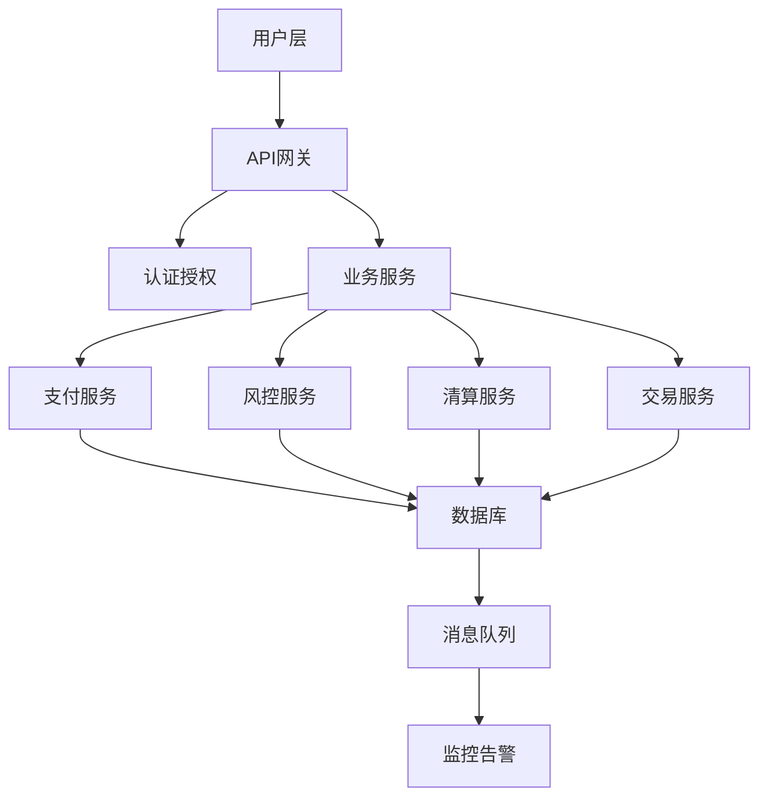
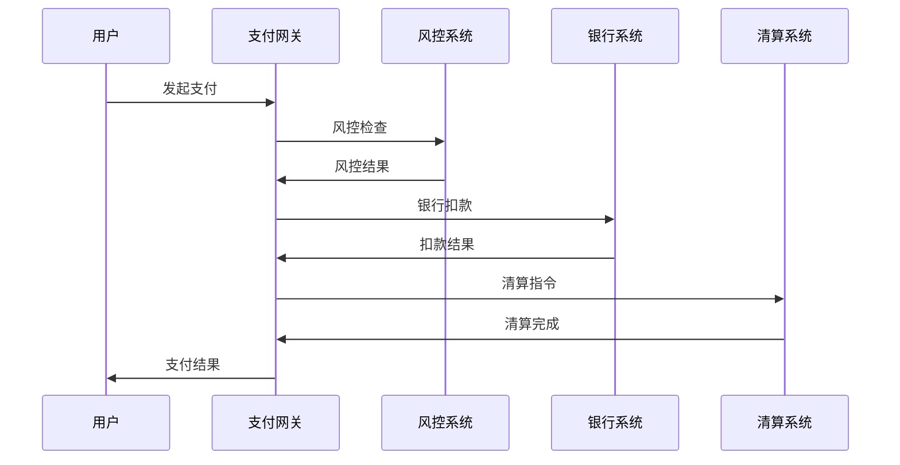

# 01-金融科技 (FinTech)

## 目录

- [01-金融科技 (FinTech)](#01-金融科技-fintech)
  - [目录](#目录)
  - [概述](#概述)
    - [核心特征](#核心特征)
    - [技术挑战](#技术挑战)
  - [1. 金融系统架构 (Financial System Architecture)](#1-金融系统架构-financial-system-architecture)
    - [1.1 整体架构](#11-整体架构)
    - [1.2 微服务架构](#12-微服务架构)
    - [1.3 事件驱动架构](#13-事件驱动架构)
  - [2. 支付系统 (Payment System)](#2-支付系统-payment-system)
    - [2.1 支付流程](#21-支付流程)
    - [2.2 支付网关实现](#22-支付网关实现)
    - [2.3 支付路由](#23-支付路由)
  - [3. 风控系统 (Risk Management System)](#3-风控系统-risk-management-system)
    - [3.1 风控模型](#31-风控模型)
    - [3.2 实时风控](#32-实时风控)
  - [4. 清算系统 (Settlement System)](#4-清算系统-settlement-system)
    - [4.1 清算流程](#41-清算流程)
  - [5. 交易系统 (Trading System)](#5-交易系统-trading-system)
    - [5.1 订单管理](#51-订单管理)
    - [5.2 订单簿实现](#52-订单簿实现)
  - [6. 合规系统 (Compliance System)](#6-合规系统-compliance-system)
    - [6.1 反洗钱(AML)检查](#61-反洗钱aml检查)
  - [7. Go语言技术栈](#7-go语言技术栈)
    - [7.1 核心框架](#71-核心框架)
    - [7.2 配置管理](#72-配置管理)
    - [7.3 依赖注入](#73-依赖注入)
  - [8. 性能优化](#8-性能优化)
    - [8.1 缓存策略](#81-缓存策略)
    - [8.2 连接池](#82-连接池)
  - [9. 安全考虑](#9-安全考虑)
    - [9.1 加密](#91-加密)
    - [9.2 认证授权](#92-认证授权)
  - [10. 参考文献](#10-参考文献)

## 概述

金融科技(FinTech)是金融与技术的结合，涵盖支付、风控、清算、交易等核心金融业务。本章节基于Go语言技术栈，为金融系统提供完整的架构设计和实现方案。

### 核心特征

- **高可用性**: 99.99%以上的系统可用性
- **低延迟**: 微秒级的交易延迟
- **高并发**: 支持百万级并发交易
- **强一致性**: 金融数据的一致性保证
- **安全性**: 多层次安全防护

### 技术挑战

1. **性能要求**: 高频交易需要微秒级响应
2. **一致性要求**: 金融数据必须强一致
3. **安全要求**: 防止欺诈和攻击
4. **合规要求**: 满足监管要求

## 1. 金融系统架构 (Financial System Architecture)

### 1.1 整体架构



### 1.2 微服务架构

**定义 1.1** (金融微服务): 金融微服务是独立部署的金融服务单元，具有明确的业务边界。

**架构原则**:

- **服务自治**: 每个服务独立部署和扩展
- **数据隔离**: 服务间数据隔离
- **接口稳定**: 服务接口版本管理
- **故障隔离**: 服务故障不影响其他服务

### 1.3 事件驱动架构

```go
// 事件定义
type FinancialEvent struct {
    ID        string                 `json:"id"`
    Type      string                 `json:"type"`
    Timestamp time.Time              `json:"timestamp"`
    Data      map[string]interface{} `json:"data"`
    Version   int                    `json:"version"`
}

// 事件总线
type EventBus struct {
    publishers map[string][]EventPublisher
    subscribers map[string][]EventSubscriber
    mu         sync.RWMutex
}

type EventPublisher interface {
    Publish(event FinancialEvent) error
}

type EventSubscriber interface {
    Subscribe(eventType string, handler func(FinancialEvent)) error
}

// 实现
func (eb *EventBus) Publish(event FinancialEvent) error {
    eb.mu.RLock()
    defer eb.mu.RUnlock()
    
    publishers := eb.publishers[event.Type]
    for _, publisher := range publishers {
        if err := publisher.Publish(event); err != nil {
            return err
        }
    }
    return nil
}

func (eb *EventBus) Subscribe(eventType string, handler func(FinancialEvent)) error {
    eb.mu.Lock()
    defer eb.mu.Unlock()
    
    subscriber := &EventSubscriberImpl{handler: handler}
    eb.subscribers[eventType] = append(eb.subscribers[eventType], subscriber)
    return nil
}
```

## 2. 支付系统 (Payment System)

### 2.1 支付流程

**定义 2.1** (支付流程): 支付流程是从支付发起到完成的完整过程。



### 2.2 支付网关实现

```go
// 支付网关
type PaymentGateway struct {
    riskManager    RiskManager
    bankConnector  BankConnector
    settlement     SettlementService
    eventBus       *EventBus
    mu             sync.RWMutex
}

// 支付请求
type PaymentRequest struct {
    ID          string  `json:"id"`
    Amount      float64 `json:"amount"`
    Currency    string  `json:"currency"`
    FromAccount string  `json:"from_account"`
    ToAccount   string  `json:"to_account"`
    Description string  `json:"description"`
    Timestamp   time.Time `json:"timestamp"`
}

// 支付响应
type PaymentResponse struct {
    ID        string    `json:"id"`
    Status    string    `json:"status"`
    Message   string    `json:"message"`
    Timestamp time.Time `json:"timestamp"`
}

// 处理支付
func (pg *PaymentGateway) ProcessPayment(req PaymentRequest) (*PaymentResponse, error) {
    // 1. 风控检查
    riskResult, err := pg.riskManager.CheckRisk(req)
    if err != nil {
        return nil, err
    }
    
    if !riskResult.Approved {
        return &PaymentResponse{
            ID:        req.ID,
            Status:    "REJECTED",
            Message:   riskResult.Reason,
            Timestamp: time.Now(),
        }, nil
    }
    
    // 2. 银行扣款
    bankResult, err := pg.bankConnector.Debit(req.FromAccount, req.Amount, req.Currency)
    if err != nil {
        return nil, err
    }
    
    if !bankResult.Success {
        return &PaymentResponse{
            ID:        req.ID,
            Status:    "FAILED",
            Message:   bankResult.Error,
            Timestamp: time.Now(),
        }, nil
    }
    
    // 3. 发起清算
    settlementReq := SettlementRequest{
        PaymentID: req.ID,
        Amount:    req.Amount,
        Currency:  req.Currency,
        FromAccount: req.FromAccount,
        ToAccount:   req.ToAccount,
    }
    
    go pg.settlement.ProcessSettlement(settlementReq)
    
    // 4. 发布事件
    event := FinancialEvent{
        ID:        uuid.New().String(),
        Type:      "payment.processed",
        Timestamp: time.Now(),
        Data: map[string]interface{}{
            "payment_id": req.ID,
            "amount":     req.Amount,
            "currency":   req.Currency,
        },
        Version: 1,
    }
    
    pg.eventBus.Publish(event)
    
    return &PaymentResponse{
        ID:        req.ID,
        Status:    "SUCCESS",
        Message:   "Payment processed successfully",
        Timestamp: time.Now(),
    }, nil
}
```

### 2.3 支付路由

```go
// 支付路由
type PaymentRouter struct {
    routes map[string]PaymentProcessor
    mu     sync.RWMutex
}

type PaymentProcessor interface {
    Process(req PaymentRequest) (*PaymentResponse, error)
    Supports(currency string) bool
}

// 路由支付
func (pr *PaymentRouter) RoutePayment(req PaymentRequest) (*PaymentResponse, error) {
    pr.mu.RLock()
    defer pr.mu.RUnlock()
    
    for _, processor := range pr.routes {
        if processor.Supports(req.Currency) {
            return processor.Process(req)
        }
    }
    
    return nil, fmt.Errorf("no processor found for currency: %s", req.Currency)
}
```

## 3. 风控系统 (Risk Management System)

### 3.1 风控模型

**定义 3.1** (风控模型): 风控模型是评估交易风险的数学模型。

```go
// 风控规则
type RiskRule struct {
    ID          string                 `json:"id"`
    Name        string                 `json:"name"`
    Condition   string                 `json:"condition"`
    Action      string                 `json:"action"`
    Priority    int                    `json:"priority"`
    Parameters  map[string]interface{} `json:"parameters"`
    Enabled     bool                   `json:"enabled"`
}

// 风控引擎
type RiskEngine struct {
    rules       []RiskRule
    cache       *RiskCache
    mu          sync.RWMutex
}

// 风控检查
func (re *RiskEngine) CheckRisk(req PaymentRequest) (*RiskResult, error) {
    re.mu.RLock()
    defer re.mu.RUnlock()
    
    result := &RiskResult{
        Approved: true,
        Score:    0,
        Rules:    []string{},
    }
    
    // 检查缓存
    cacheKey := re.generateCacheKey(req)
    if cached, exists := re.cache.Get(cacheKey); exists {
        return cached, nil
    }
    
    // 执行规则检查
    for _, rule := range re.rules {
        if !rule.Enabled {
            continue
        }
        
        if re.evaluateRule(rule, req) {
            result.Score += rule.Priority
            
            if rule.Action == "REJECT" {
                result.Approved = false
                result.Reason = rule.Name
                break
            }
        }
        
        result.Rules = append(result.Rules, rule.Name)
    }
    
    // 缓存结果
    re.cache.Set(cacheKey, result, 5*time.Minute)
    
    return result, nil
}

// 规则评估
func (re *RiskEngine) evaluateRule(rule RiskRule, req PaymentRequest) bool {
    switch rule.Condition {
    case "amount_limit":
        maxAmount := rule.Parameters["max_amount"].(float64)
        return req.Amount > maxAmount
        
    case "frequency_limit":
        maxCount := rule.Parameters["max_count"].(int)
        timeWindow := rule.Parameters["time_window"].(time.Duration)
        return re.checkFrequency(req.FromAccount, timeWindow, maxCount)
        
    case "location_check":
        allowedCountries := rule.Parameters["allowed_countries"].([]string)
        return !re.isInAllowedCountries(req.FromAccount, allowedCountries)
        
    default:
        return false
    }
}
```

### 3.2 实时风控

```go
// 实时风控
type RealTimeRiskManager struct {
    engine      *RiskEngine
    stream      *RiskStream
    alerting    *AlertingService
}

// 风控流处理
func (rtrm *RealTimeRiskManager) ProcessStream() {
    for event := range rtrm.stream.Events() {
        // 实时风控检查
        riskResult, err := rtrm.engine.CheckRisk(event.PaymentRequest)
        if err != nil {
            rtrm.alerting.SendAlert("risk_check_error", err.Error())
            continue
        }
        
        // 高风险交易告警
        if riskResult.Score > 100 {
            rtrm.alerting.SendAlert("high_risk_transaction", 
                fmt.Sprintf("High risk transaction: %s, score: %d", 
                    event.PaymentRequest.ID, riskResult.Score))
        }
        
        // 更新风控统计
        rtrm.updateStatistics(event, riskResult)
    }
}
```

## 4. 清算系统 (Settlement System)

### 4.1 清算流程

**定义 4.1** (清算流程): 清算流程是完成资金转移和账务处理的过程。

```go
// 清算服务
type SettlementService struct {
    accountManager AccountManager
    ledgerService  LedgerService
    eventBus       *EventBus
    mu             sync.Mutex
}

// 清算请求
type SettlementRequest struct {
    PaymentID   string  `json:"payment_id"`
    Amount      float64 `json:"amount"`
    Currency    string  `json:"currency"`
    FromAccount string  `json:"from_account"`
    ToAccount   string  `json:"to_account"`
    Timestamp   time.Time `json:"timestamp"`
}

// 处理清算
func (ss *SettlementService) ProcessSettlement(req SettlementRequest) error {
    ss.mu.Lock()
    defer ss.mu.Unlock()
    
    // 1. 验证账户
    if err := ss.accountManager.ValidateAccounts(req.FromAccount, req.ToAccount); err != nil {
        return err
    }
    
    // 2. 创建清算记录
    settlement := Settlement{
        ID:          uuid.New().String(),
        PaymentID:   req.PaymentID,
        Amount:      req.Amount,
        Currency:    req.Currency,
        FromAccount: req.FromAccount,
        ToAccount:   req.ToAccount,
        Status:      "PENDING",
        Timestamp:   time.Now(),
    }
    
    // 3. 执行清算
    if err := ss.executeSettlement(settlement); err != nil {
        settlement.Status = "FAILED"
        settlement.Error = err.Error()
        ss.saveSettlement(settlement)
        return err
    }
    
    // 4. 更新账本
    if err := ss.ledgerService.UpdateLedger(settlement); err != nil {
        return err
    }
    
    // 5. 标记完成
    settlement.Status = "COMPLETED"
    settlement.CompletedAt = time.Now()
    ss.saveSettlement(settlement)
    
    // 6. 发布事件
    event := FinancialEvent{
        ID:        uuid.New().String(),
        Type:      "settlement.completed",
        Timestamp: time.Now(),
        Data: map[string]interface{}{
            "settlement_id": settlement.ID,
            "payment_id":    req.PaymentID,
            "amount":        req.Amount,
        },
        Version: 1,
    }
    
    ss.eventBus.Publish(event)
    
    return nil
}

// 执行清算
func (ss *SettlementService) executeSettlement(settlement Settlement) error {
    // 这里实现具体的清算逻辑
    // 可能涉及多个银行系统的协调
    
    // 模拟清算延迟
    time.Sleep(100 * time.Millisecond)
    
    return nil
}
```

## 5. 交易系统 (Trading System)

### 5.1 订单管理

```go
// 订单类型
type OrderType string

const (
    OrderTypeMarket OrderType = "MARKET"
    OrderTypeLimit  OrderType = "LIMIT"
    OrderTypeStop   OrderType = "STOP"
)

// 订单状态
type OrderStatus string

const (
    OrderStatusPending   OrderStatus = "PENDING"
    OrderStatusAccepted  OrderStatus = "ACCEPTED"
    OrderStatusRejected  OrderStatus = "REJECTED"
    OrderStatusFilled    OrderStatus = "FILLED"
    OrderStatusCancelled OrderStatus = "CANCELLED"
)

// 订单
type Order struct {
    ID          string      `json:"id"`
    Symbol      string      `json:"symbol"`
    Side        string      `json:"side"` // BUY/SELL
    Type        OrderType   `json:"type"`
    Quantity    float64     `json:"quantity"`
    Price       float64     `json:"price"`
    Status      OrderStatus `json:"status"`
    UserID      string      `json:"user_id"`
    Timestamp   time.Time   `json:"timestamp"`
    FilledAt    *time.Time  `json:"filled_at,omitempty"`
}

// 订单管理器
type OrderManager struct {
    orders      map[string]*Order
    orderBook   *OrderBook
    riskManager RiskManager
    mu          sync.RWMutex
}

// 提交订单
func (om *OrderManager) SubmitOrder(order Order) (*Order, error) {
    om.mu.Lock()
    defer om.mu.Unlock()
    
    // 1. 风控检查
    riskResult, err := om.riskManager.CheckOrderRisk(order)
    if err != nil {
        return nil, err
    }
    
    if !riskResult.Approved {
        order.Status = OrderStatusRejected
        return &order, nil
    }
    
    // 2. 生成订单ID
    order.ID = uuid.New().String()
    order.Status = OrderStatusPending
    order.Timestamp = time.Now()
    
    // 3. 保存订单
    om.orders[order.ID] = &order
    
    // 4. 添加到订单簿
    om.orderBook.AddOrder(&order)
    
    return &order, nil
}

// 取消订单
func (om *OrderManager) CancelOrder(orderID string) error {
    om.mu.Lock()
    defer om.mu.Unlock()
    
    order, exists := om.orders[orderID]
    if !exists {
        return fmt.Errorf("order not found: %s", orderID)
    }
    
    if order.Status != OrderStatusPending && order.Status != OrderStatusAccepted {
        return fmt.Errorf("cannot cancel order in status: %s", order.Status)
    }
    
    order.Status = OrderStatusCancelled
    om.orderBook.RemoveOrder(orderID)
    
    return nil
}
```

### 5.2 订单簿实现

```go
// 订单簿
type OrderBook struct {
    bids map[float64][]*Order // 买单，按价格降序
    asks map[float64][]*Order // 卖单，按价格升序
    mu   sync.RWMutex
}

// 添加订单
func (ob *OrderBook) AddOrder(order *Order) {
    ob.mu.Lock()
    defer ob.mu.Unlock()
    
    if order.Side == "BUY" {
        if ob.bids[order.Price] == nil {
            ob.bids[order.Price] = []*Order{}
        }
        ob.bids[order.Price] = append(ob.bids[order.Price], order)
    } else {
        if ob.asks[order.Price] == nil {
            ob.asks[order.Price] = []*Order{}
        }
        ob.asks[order.Price] = append(ob.asks[order.Price], order)
    }
    
    // 尝试撮合
    ob.matchOrders()
}

// 撮合订单
func (ob *OrderBook) matchOrders() {
    // 获取最佳买价和卖价
    bestBid := ob.getBestBid()
    bestAsk := ob.getBestAsk()
    
    if bestBid == nil || bestAsk == nil {
        return
    }
    
    // 检查是否可以撮合
    if bestBid.Price >= bestAsk.Price {
        ob.executeTrade(bestBid, bestAsk)
    }
}

// 执行交易
func (ob *OrderBook) executeTrade(buyOrder, sellOrder *Order) {
    // 确定成交价格和数量
    tradePrice := buyOrder.Price
    tradeQuantity := math.Min(buyOrder.Quantity, sellOrder.Quantity)
    
    // 更新订单状态
    buyOrder.Quantity -= tradeQuantity
    sellOrder.Quantity -= tradeQuantity
    
    if buyOrder.Quantity == 0 {
        buyOrder.Status = OrderStatusFilled
        now := time.Now()
        buyOrder.FilledAt = &now
    }
    
    if sellOrder.Quantity == 0 {
        sellOrder.Status = OrderStatusFilled
        now := time.Now()
        sellOrder.FilledAt = &now
    }
    
    // 创建成交记录
    trade := Trade{
        ID:        uuid.New().String(),
        BuyOrderID:  buyOrder.ID,
        SellOrderID: sellOrder.ID,
        Price:       tradePrice,
        Quantity:    tradeQuantity,
        Timestamp:   time.Now(),
    }
    
    // 发布成交事件
    // ... 实现事件发布逻辑
}
```

## 6. 合规系统 (Compliance System)

### 6.1 反洗钱(AML)检查

```go
// AML检查器
type AMLChecker struct {
    rules       []AMLRule
    blacklist   *BlacklistService
    whitelist   *WhitelistService
}

// AML规则
type AMLRule struct {
    ID          string                 `json:"id"`
    Name        string                 `json:"name"`
    Type        string                 `json:"type"`
    Parameters  map[string]interface{} `json:"parameters"`
    Enabled     bool                   `json:"enabled"`
}

// AML检查
func (aml *AMLChecker) CheckAML(transaction Transaction) (*AMLResult, error) {
    result := &AMLResult{
        Approved: true,
        Score:    0,
        Flags:    []string{},
    }
    
    for _, rule := range aml.rules {
        if !rule.Enabled {
            continue
        }
        
        if aml.evaluateAMLRule(rule, transaction) {
            result.Score += 10
            result.Flags = append(result.Flags, rule.Name)
            
            if result.Score > 50 {
                result.Approved = false
                break
            }
        }
    }
    
    return result, nil
}

// 评估AML规则
func (aml *AMLChecker) evaluateAMLRule(rule AMLRule, transaction Transaction) bool {
    switch rule.Type {
    case "amount_threshold":
        threshold := rule.Parameters["threshold"].(float64)
        return transaction.Amount > threshold
        
    case "frequency_check":
        maxCount := rule.Parameters["max_count"].(int)
        timeWindow := rule.Parameters["time_window"].(time.Duration)
        return aml.checkTransactionFrequency(transaction.FromAccount, timeWindow, maxCount)
        
    case "blacklist_check":
        return aml.blacklist.IsBlacklisted(transaction.FromAccount) ||
               aml.blacklist.IsBlacklisted(transaction.ToAccount)
        
    default:
        return false
    }
}
```

## 7. Go语言技术栈

### 7.1 核心框架

```go
// 主要依赖
import (
    "github.com/gin-gonic/gin"           // Web框架
    "github.com/go-redis/redis/v8"       // 缓存
    "gorm.io/gorm"                       // ORM
    "github.com/segmentio/kafka-go"      // 消息队列
    "github.com/prometheus/client_golang/prometheus" // 监控
    "go.uber.org/zap"                    // 日志
    "github.com/spf13/viper"             // 配置管理
)
```

### 7.2 配置管理

```go
// 配置结构
type Config struct {
    Server   ServerConfig   `mapstructure:"server"`
    Database DatabaseConfig `mapstructure:"database"`
    Redis    RedisConfig    `mapstructure:"redis"`
    Kafka    KafkaConfig    `mapstructure:"kafka"`
    Security SecurityConfig `mapstructure:"security"`
}

type ServerConfig struct {
    Port    int    `mapstructure:"port"`
    Host    string `mapstructure:"host"`
    Timeout int    `mapstructure:"timeout"`
}

// 配置加载
func LoadConfig() (*Config, error) {
    viper.SetConfigName("config")
    viper.SetConfigType("yaml")
    viper.AddConfigPath(".")
    
    if err := viper.ReadInConfig(); err != nil {
        return nil, err
    }
    
    var config Config
    if err := viper.Unmarshal(&config); err != nil {
        return nil, err
    }
    
    return &config, nil
}
```

### 7.3 依赖注入

```go
// 依赖注入容器
type Container struct {
    services map[string]interface{}
    mu       sync.RWMutex
}

func NewContainer() *Container {
    return &Container{
        services: make(map[string]interface{}),
    }
}

func (c *Container) Register(name string, service interface{}) {
    c.mu.Lock()
    defer c.mu.Unlock()
    c.services[name] = service
}

func (c *Container) Get(name string) (interface{}, bool) {
    c.mu.RLock()
    defer c.mu.RUnlock()
    service, exists := c.services[name]
    return service, exists
}

// 服务注册
func RegisterServices(container *Container, config *Config) error {
    // 注册数据库
    db, err := NewDatabase(config.Database)
    if err != nil {
        return err
    }
    container.Register("database", db)
    
    // 注册Redis
    redis, err := NewRedis(config.Redis)
    if err != nil {
        return err
    }
    container.Register("redis", redis)
    
    // 注册Kafka
    kafka, err := NewKafka(config.Kafka)
    if err != nil {
        return err
    }
    container.Register("kafka", kafka)
    
    return nil
}
```

## 8. 性能优化

### 8.1 缓存策略

```go
// 多级缓存
type MultiLevelCache struct {
    l1 *sync.Map // 内存缓存
    l2 *redis.Client // Redis缓存
    l3 *gorm.DB // 数据库
}

func (mlc *MultiLevelCache) Get(key string) (interface{}, error) {
    // L1缓存查找
    if value, ok := mlc.l1.Load(key); ok {
        return value, nil
    }
    
    // L2缓存查找
    value, err := mlc.l2.Get(context.Background(), key).Result()
    if err == nil {
        mlc.l1.Store(key, value)
        return value, nil
    }
    
    // L3数据库查找
    // ... 实现数据库查询逻辑
    
    return nil, fmt.Errorf("key not found: %s", key)
}
```

### 8.2 连接池

```go
// 数据库连接池
type ConnectionPool struct {
    pool *sql.DB
    maxConnections int
    maxIdleConnections int
}

func NewConnectionPool(config DatabaseConfig) (*ConnectionPool, error) {
    db, err := sql.Open("postgres", config.DSN)
    if err != nil {
        return nil, err
    }
    
    db.SetMaxOpenConns(config.MaxConnections)
    db.SetMaxIdleConns(config.MaxIdleConnections)
    db.SetConnMaxLifetime(config.ConnMaxLifetime)
    
    return &ConnectionPool{
        pool: db,
        maxConnections: config.MaxConnections,
        maxIdleConnections: config.MaxIdleConnections,
    }, nil
}
```

## 9. 安全考虑

### 9.1 加密

```go
// 加密服务
type EncryptionService struct {
    key []byte
}

func (es *EncryptionService) Encrypt(data []byte) ([]byte, error) {
    block, err := aes.NewCipher(es.key)
    if err != nil {
        return nil, err
    }
    
    gcm, err := cipher.NewGCM(block)
    if err != nil {
        return nil, err
    }
    
    nonce := make([]byte, gcm.NonceSize())
    if _, err := io.ReadFull(rand.Reader, nonce); err != nil {
        return nil, err
    }
    
    return gcm.Seal(nonce, nonce, data, nil), nil
}

func (es *EncryptionService) Decrypt(data []byte) ([]byte, error) {
    block, err := aes.NewCipher(es.key)
    if err != nil {
        return nil, err
    }
    
    gcm, err := cipher.NewGCM(block)
    if err != nil {
        return nil, err
    }
    
    nonceSize := gcm.NonceSize()
    if len(data) < nonceSize {
        return nil, fmt.Errorf("ciphertext too short")
    }
    
    nonce, ciphertext := data[:nonceSize], data[nonceSize:]
    return gcm.Open(nil, nonce, ciphertext, nil)
}
```

### 9.2 认证授权

```go
// JWT认证
type JWTAuth struct {
    secret []byte
}

func (ja *JWTAuth) GenerateToken(userID string, claims map[string]interface{}) (string, error) {
    token := jwt.New(jwt.SigningMethodHS256)
    
    token.Claims = jwt.MapClaims{
        "user_id": userID,
        "exp":     time.Now().Add(time.Hour * 24).Unix(),
    }
    
    for key, value := range claims {
        token.Claims.(jwt.MapClaims)[key] = value
    }
    
    return token.SignedString(ja.secret)
}

func (ja *JWTAuth) ValidateToken(tokenString string) (*jwt.Token, error) {
    return jwt.Parse(tokenString, func(token *jwt.Token) (interface{}, error) {
        if _, ok := token.Method.(*jwt.SigningMethodHMAC); !ok {
            return nil, fmt.Errorf("unexpected signing method: %v", token.Header["alg"])
        }
        return ja.secret, nil
    })
}
```

## 10. 参考文献

1. Hull, J. C. (2018). *Risk Management and Financial Institutions*. Wiley.
2. Choudhry, M. (2010). *An Introduction to Value at Risk*. Wiley.
3. Duffie, D., & Singleton, K. J. (2003). *Credit Risk: Pricing, Measurement, and Management*. Princeton University Press.
4. Cont, R. (2011). *Empirical Properties of Asset Returns: Stylized Facts and Statistical Issues*. Quantitative Finance.
5. O'Hara, M. (1995). *Market Microstructure Theory*. Blackwell.

---

**激情澎湃的持续构建** <(￣︶￣)↗[GO!] **金融科技完成！** 🚀
