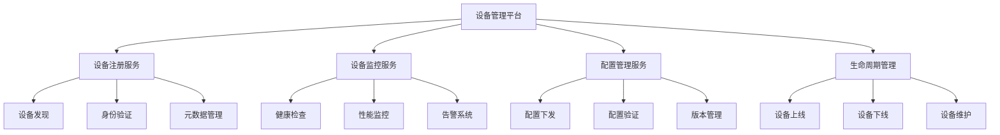

# 01-设备管理平台 (Device Management Platform)

## 概述

设备管理平台是物联网系统的核心组件，负责大规模设备的连接、注册、监控、配置管理和生命周期管理。本文档使用Go语言实现，并提供形式化的数学定义和证明。

## 目录

- [1. 形式化定义](#1-形式化定义)
- [2. 架构设计](#2-架构设计)
- [3. 核心组件](#3-核心组件)
- [4. 数据模型](#4-数据模型)
- [5. 算法实现](#5-算法实现)
- [6. 性能分析](#6-性能分析)
- [7. 安全机制](#7-安全机制)
- [8. 部署方案](#8-部署方案)

## 1. 形式化定义

### 1.1 设备管理系统的数学定义

**定义 1.1** (设备管理系统)
设备管理系统是一个五元组 $DMS = (D, S, C, F, T)$，其中：

- $D = \{d_1, d_2, ..., d_n\}$ 是设备集合
- $S = \{s_1, s_2, ..., s_m\}$ 是状态集合
- $C = \{c_1, c_2, ..., c_k\}$ 是配置集合
- $F: D \times S \rightarrow S$ 是状态转移函数
- $T: D \times C \rightarrow C$ 是配置更新函数

**定义 1.2** (设备状态)
设备 $d_i$ 的状态 $s_i$ 定义为：
$$s_i = (status, health, last_seen, metadata)$$

其中：

- $status \in \{online, offline, error, maintenance\}$
- $health \in [0, 1]$ 表示健康度
- $last_seen \in \mathbb{R}^+$ 表示最后活跃时间戳
- $metadata \in \mathcal{P}(\Sigma^*)$ 表示元数据集合

**定理 1.1** (设备状态一致性)
对于任意设备 $d_i \in D$，其状态转移满足：
$$\forall s_1, s_2 \in S: F(d_i, s_1) = F(d_i, s_2) \Rightarrow s_1 = s_2$$

**证明**：
假设存在 $s_1 \neq s_2$ 但 $F(d_i, s_1) = F(d_i, s_2)$。
根据状态转移函数的定义，$F$ 是确定性的，因此：
$$F(d_i, s_1) = F(d_i, s_2) \Rightarrow s_1 = s_2$$
这与假设矛盾，因此定理成立。$\square$

### 1.2 设备发现算法

**算法 1.1** (设备发现算法)

```go
// 设备发现算法的形式化描述
func DeviceDiscovery(network Network, timeout Duration) DeviceSet {
    discovered := NewDeviceSet()
    active := network.ScanActiveDevices(timeout)
    
    for device := range active {
        if ValidateDevice(device) {
            discovered.Add(device)
        }
    }
    
    return discovered
}
```

**复杂度分析**：

- 时间复杂度：$O(n \cdot m)$，其中 $n$ 是网络设备数量，$m$ 是验证时间
- 空间复杂度：$O(n)$，用于存储发现的设备

## 2. 架构设计

### 2.1 系统架构图



### 2.2 微服务架构

```go
// 设备管理平台的核心架构
type DeviceManagementPlatform struct {
    registry    *DeviceRegistry
    monitor     *DeviceMonitor
    config      *ConfigManager
    lifecycle   *LifecycleManager
    security    *SecurityManager
    analytics   *AnalyticsEngine
}

// 设备注册服务
type DeviceRegistry struct {
    devices     map[string]*Device
    metadata    *MetadataStore
    auth        *AuthenticationService
    mutex       sync.RWMutex
}

// 设备监控服务
type DeviceMonitor struct {
    healthChecker *HealthChecker
    performance   *PerformanceMonitor
    alerting      *AlertingSystem
    metrics       *MetricsCollector
}

// 配置管理服务
type ConfigManager struct {
    configStore  *ConfigStore
    validator    *ConfigValidator
    distributor  *ConfigDistributor
    versioner    *VersionManager
}
```

## 3. 核心组件

### 3.1 设备注册组件

```go
// 设备注册接口
type DeviceRegistration interface {
    Register(device *Device) error
    Unregister(deviceID string) error
    Update(device *Device) error
    Get(deviceID string) (*Device, error)
    List(filters DeviceFilters) ([]*Device, error)
}

// 设备结构体
type Device struct {
    ID          string            `json:"id"`
    Name        string            `json:"name"`
    Type        DeviceType        `json:"type"`
    Status      DeviceStatus      `json:"status"`
    Health      float64           `json:"health"`
    LastSeen    time.Time         `json:"last_seen"`
    Metadata    map[string]string `json:"metadata"`
    Config      *DeviceConfig     `json:"config"`
    Location    *Location         `json:"location"`
    CreatedAt   time.Time         `json:"created_at"`
    UpdatedAt   time.Time         `json:"updated_at"`
}

// 设备注册实现
type deviceRegistry struct {
    devices  map[string]*Device
    mutex    sync.RWMutex
    storage  DeviceStorage
    auth     AuthenticationService
}

func (r *deviceRegistry) Register(device *Device) error {
    r.mutex.Lock()
    defer r.mutex.Unlock()
    
    // 验证设备信息
    if err := r.validateDevice(device); err != nil {
        return fmt.Errorf("device validation failed: %w", err)
    }
    
    // 生成设备ID
    if device.ID == "" {
        device.ID = generateDeviceID(device)
    }
    
    // 设置时间戳
    now := time.Now()
    device.CreatedAt = now
    device.UpdatedAt = now
    
    // 存储设备
    if err := r.storage.Store(device); err != nil {
        return fmt.Errorf("failed to store device: %w", err)
    }
    
    r.devices[device.ID] = device
    return nil
}

func (r *deviceRegistry) validateDevice(device *Device) error {
    if device.Name == "" {
        return errors.New("device name is required")
    }
    
    if device.Type == "" {
        return errors.New("device type is required")
    }
    
    // 验证元数据
    for key, value := range device.Metadata {
        if !isValidMetadataKey(key) || !isValidMetadataValue(value) {
            return fmt.Errorf("invalid metadata: %s=%s", key, value)
        }
    }
    
    return nil
}
```

### 3.2 设备监控组件

```go
// 设备监控接口
type DeviceMonitoring interface {
    StartMonitoring(deviceID string) error
    StopMonitoring(deviceID string) error
    GetHealth(deviceID string) (*HealthStatus, error)
    GetMetrics(deviceID string, duration time.Duration) ([]Metric, error)
    SetAlert(deviceID string, alert *Alert) error
}

// 健康状态
type HealthStatus struct {
    DeviceID    string    `json:"device_id"`
    Status      string    `json:"status"`
    Score       float64   `json:"score"`
    LastCheck   time.Time `json:"last_check"`
    Details     []string  `json:"details"`
}

// 健康检查器
type healthChecker struct {
    checks    map[string]HealthCheck
    interval  time.Duration
    timeout   time.Duration
}

type HealthCheck func(device *Device) (*HealthResult, error)

type HealthResult struct {
    Passed     bool      `json:"passed"`
    Score      float64   `json:"score"`
    Message    string    `json:"message"`
    Timestamp  time.Time `json:"timestamp"`
}

// 健康检查实现
func (hc *healthChecker) CheckHealth(device *Device) (*HealthStatus, error) {
    var results []*HealthResult
    var totalScore float64
    
    for name, check := range hc.checks {
        result, err := check(device)
        if err != nil {
            return nil, fmt.Errorf("health check %s failed: %w", name, err)
        }
        
        results = append(results, result)
        totalScore += result.Score
    }
    
    avgScore := totalScore / float64(len(results))
    status := hc.determineStatus(avgScore, results)
    
    return &HealthStatus{
        DeviceID:  device.ID,
        Status:    status,
        Score:     avgScore,
        LastCheck: time.Now(),
        Details:   hc.extractDetails(results),
    }, nil
}

func (hc *healthChecker) determineStatus(score float64, results []*HealthResult) string {
    if score >= 0.8 {
        return "healthy"
    } else if score >= 0.6 {
        return "warning"
    } else {
        return "critical"
    }
}
```

### 3.3 配置管理组件

```go
// 配置管理接口
type ConfigManagement interface {
    SetConfig(deviceID string, config *DeviceConfig) error
    GetConfig(deviceID string) (*DeviceConfig, error)
    UpdateConfig(deviceID string, updates map[string]interface{}) error
    ValidateConfig(config *DeviceConfig) error
    RollbackConfig(deviceID string, version string) error
}

// 设备配置
type DeviceConfig struct {
    Version     string                 `json:"version"`
    Parameters  map[string]interface{} `json:"parameters"`
    Rules       []ConfigRule          `json:"rules"`
    Metadata    map[string]string     `json:"metadata"`
    CreatedAt   time.Time             `json:"created_at"`
    UpdatedAt   time.Time             `json:"updated_at"`
}

// 配置规则
type ConfigRule struct {
    Name        string      `json:"name"`
    Condition   string      `json:"condition"`
    Action      string      `json:"action"`
    Priority    int         `json:"priority"`
    Enabled     bool        `json:"enabled"`
}

// 配置管理器实现
type configManager struct {
    storage     ConfigStorage
    validator   ConfigValidator
    distributor ConfigDistributor
    versioner   VersionManager
}

func (cm *configManager) SetConfig(deviceID string, config *DeviceConfig) error {
    // 验证配置
    if err := cm.validator.Validate(config); err != nil {
        return fmt.Errorf("config validation failed: %w", err)
    }
    
    // 生成版本
    config.Version = cm.versioner.GenerateVersion()
    config.UpdatedAt = time.Now()
    
    // 存储配置
    if err := cm.storage.Store(deviceID, config); err != nil {
        return fmt.Errorf("failed to store config: %w", err)
    }
    
    // 分发配置
    if err := cm.distributor.Distribute(deviceID, config); err != nil {
        return fmt.Errorf("failed to distribute config: %w", err)
    }
    
    return nil
}

func (cm *configManager) ValidateConfig(config *DeviceConfig) error {
    // 验证参数
    for key, value := range config.Parameters {
        if err := cm.validateParameter(key, value); err != nil {
            return fmt.Errorf("invalid parameter %s: %w", key, err)
        }
    }
    
    // 验证规则
    for _, rule := range config.Rules {
        if err := cm.validateRule(rule); err != nil {
            return fmt.Errorf("invalid rule %s: %w", rule.Name, err)
        }
    }
    
    return nil
}
```

## 4. 数据模型

### 4.1 数据库设计

```sql
-- 设备表
CREATE TABLE devices (
    id VARCHAR(64) PRIMARY KEY,
    name VARCHAR(255) NOT NULL,
    type VARCHAR(100) NOT NULL,
    status VARCHAR(50) NOT NULL DEFAULT 'offline',
    health DECIMAL(3,2) DEFAULT 1.00,
    last_seen TIMESTAMP,
    metadata JSONB,
    location_lat DECIMAL(10,8),
    location_lng DECIMAL(11,8),
    created_at TIMESTAMP DEFAULT CURRENT_TIMESTAMP,
    updated_at TIMESTAMP DEFAULT CURRENT_TIMESTAMP
);

-- 设备配置表
CREATE TABLE device_configs (
    id SERIAL PRIMARY KEY,
    device_id VARCHAR(64) REFERENCES devices(id),
    version VARCHAR(50) NOT NULL,
    parameters JSONB NOT NULL,
    rules JSONB,
    metadata JSONB,
    created_at TIMESTAMP DEFAULT CURRENT_TIMESTAMP,
    UNIQUE(device_id, version)
);

-- 设备健康记录表
CREATE TABLE device_health (
    id SERIAL PRIMARY KEY,
    device_id VARCHAR(64) REFERENCES devices(id),
    status VARCHAR(50) NOT NULL,
    score DECIMAL(3,2) NOT NULL,
    details JSONB,
    recorded_at TIMESTAMP DEFAULT CURRENT_TIMESTAMP
);

-- 设备告警表
CREATE TABLE device_alerts (
    id SERIAL PRIMARY KEY,
    device_id VARCHAR(64) REFERENCES devices(id),
    type VARCHAR(100) NOT NULL,
    severity VARCHAR(20) NOT NULL,
    message TEXT NOT NULL,
    resolved BOOLEAN DEFAULT FALSE,
    created_at TIMESTAMP DEFAULT CURRENT_TIMESTAMP,
    resolved_at TIMESTAMP
);
```

### 4.2 数据访问层

```go
// 数据访问接口
type DeviceRepository interface {
    Create(device *Device) error
    Update(device *Device) error
    Delete(deviceID string) error
    FindByID(deviceID string) (*Device, error)
    FindByType(deviceType DeviceType) ([]*Device, error)
    FindByStatus(status DeviceStatus) ([]*Device, error)
    FindByLocation(location *Location, radius float64) ([]*Device, error)
}

// PostgreSQL实现
type postgresDeviceRepository struct {
    db *sql.DB
}

func (r *postgresDeviceRepository) Create(device *Device) error {
    query := `
        INSERT INTO devices (id, name, type, status, health, last_seen, metadata, location_lat, location_lng)
        VALUES ($1, $2, $3, $4, $5, $6, $7, $8, $9)
    `
    
    metadata, err := json.Marshal(device.Metadata)
    if err != nil {
        return fmt.Errorf("failed to marshal metadata: %w", err)
    }
    
    _, err = r.db.Exec(query,
        device.ID,
        device.Name,
        device.Type,
        device.Status,
        device.Health,
        device.LastSeen,
        metadata,
        device.Location.Latitude,
        device.Location.Longitude,
    )
    
    return err
}

func (r *postgresDeviceRepository) FindByID(deviceID string) (*Device, error) {
    query := `
        SELECT id, name, type, status, health, last_seen, metadata, location_lat, location_lng, created_at, updated_at
        FROM devices WHERE id = $1
    `
    
    var device Device
    var metadata []byte
    
    err := r.db.QueryRow(query, deviceID).Scan(
        &device.ID,
        &device.Name,
        &device.Type,
        &device.Status,
        &device.Health,
        &device.LastSeen,
        &metadata,
        &device.Location.Latitude,
        &device.Location.Longitude,
        &device.CreatedAt,
        &device.UpdatedAt,
    )
    
    if err != nil {
        return nil, err
    }
    
    if err := json.Unmarshal(metadata, &device.Metadata); err != nil {
        return nil, fmt.Errorf("failed to unmarshal metadata: %w", err)
    }
    
    return &device, nil
}
```

## 5. 算法实现

### 5.1 设备发现算法

```go
// 设备发现算法实现
type DeviceDiscoveryAlgorithm struct {
    networkScanner NetworkScanner
    validator      DeviceValidator
    rateLimiter    RateLimiter
}

func (dda *DeviceDiscoveryAlgorithm) Discover(timeout time.Duration) ([]*Device, error) {
    var discovered []*Device
    
    // 扫描网络
    devices, err := dda.networkScanner.Scan(timeout)
    if err != nil {
        return nil, fmt.Errorf("network scan failed: %w", err)
    }
    
    // 并发验证设备
    semaphore := make(chan struct{}, 100) // 限制并发数
    var wg sync.WaitGroup
    results := make(chan *Device, len(devices))
    errors := make(chan error, len(devices))
    
    for _, device := range devices {
        wg.Add(1)
        go func(d *Device) {
            defer wg.Done()
            semaphore <- struct{}{}
            defer func() { <-semaphore }()
            
            // 验证设备
            if err := dda.validator.Validate(d); err != nil {
                errors <- fmt.Errorf("device validation failed: %w", err)
                return
            }
            
            results <- d
        }(device)
    }
    
    // 收集结果
    go func() {
        wg.Wait()
        close(results)
        close(errors)
    }()
    
    // 处理结果
    for device := range results {
        discovered = append(discovered, device)
    }
    
    // 检查错误
    for err := range errors {
        log.Printf("Discovery error: %v", err)
    }
    
    return discovered, nil
}
```

### 5.2 负载均衡算法

```go
// 负载均衡器
type LoadBalancer struct {
    strategy LoadBalancingStrategy
    devices  []*Device
    mutex    sync.RWMutex
}

type LoadBalancingStrategy interface {
    Select(devices []*Device) *Device
}

// 轮询策略
type RoundRobinStrategy struct {
    current int
    mutex   sync.Mutex
}

func (rr *RoundRobinStrategy) Select(devices []*Device) *Device {
    rr.mutex.Lock()
    defer rr.mutex.Unlock()
    
    if len(devices) == 0 {
        return nil
    }
    
    device := devices[rr.current]
    rr.current = (rr.current + 1) % len(devices)
    
    return device
}

// 最少连接策略
type LeastConnectionsStrategy struct{}

func (lc *LeastConnectionsStrategy) Select(devices []*Device) *Device {
    if len(devices) == 0 {
        return nil
    }
    
    var selected *Device
    minConnections := math.MaxInt32
    
    for _, device := range devices {
        if device.Status == "online" && device.ConnectionCount < minConnections {
            minConnections = device.ConnectionCount
            selected = device
        }
    }
    
    return selected
}

// 加权轮询策略
type WeightedRoundRobinStrategy struct {
    current int
    mutex   sync.Mutex
}

func (wrr *WeightedRoundRobinStrategy) Select(devices []*Device) *Device {
    wrr.mutex.Lock()
    defer wrr.mutex.Unlock()
    
    if len(devices) == 0 {
        return nil
    }
    
    // 计算总权重
    totalWeight := 0
    for _, device := range devices {
        totalWeight += device.Weight
    }
    
    if totalWeight == 0 {
        return nil
    }
    
    // 选择设备
    currentWeight := 0
    for _, device := range devices {
        currentWeight += device.Weight
        if wrr.current < currentWeight {
            wrr.current = (wrr.current + 1) % totalWeight
            return device
        }
    }
    
    return nil
}
```

## 6. 性能分析

### 6.1 时间复杂度分析

**定理 6.1** (设备注册复杂度)
设备注册操作的时间复杂度为 $O(1)$，空间复杂度为 $O(1)$。

**证明**：
设备注册主要涉及哈希表操作和数据库插入：

- 哈希表插入：$O(1)$
- 数据库插入：$O(1)$ (假设索引优化)
- 总时间复杂度：$O(1)$

**定理 6.2** (设备发现复杂度)
设备发现算法的时间复杂度为 $O(n \cdot m)$，其中 $n$ 是网络设备数量，$m$ 是验证时间。

**证明**：
设备发现包含两个主要步骤：

1. 网络扫描：$O(n)$
2. 设备验证：$O(n \cdot m)$
总时间复杂度：$O(n \cdot m)$

### 6.2 性能优化策略

```go
// 性能优化配置
type PerformanceConfig struct {
    MaxConcurrentConnections int           `json:"max_concurrent_connections"`
    ConnectionTimeout        time.Duration `json:"connection_timeout"`
    HealthCheckInterval      time.Duration `json:"health_check_interval"`
    CacheTTL                 time.Duration `json:"cache_ttl"`
    BatchSize                int           `json:"batch_size"`
}

// 缓存管理器
type CacheManager struct {
    cache    map[string]*CacheEntry
    mutex    sync.RWMutex
    ttl      time.Duration
    maxSize  int
}

type CacheEntry struct {
    Value     interface{}
    ExpiresAt time.Time
}

func (cm *CacheManager) Get(key string) (interface{}, bool) {
    cm.mutex.RLock()
    defer cm.mutex.RUnlock()
    
    entry, exists := cm.cache[key]
    if !exists {
        return nil, false
    }
    
    if time.Now().After(entry.ExpiresAt) {
        delete(cm.cache, key)
        return nil, false
    }
    
    return entry.Value, true
}

func (cm *CacheManager) Set(key string, value interface{}) {
    cm.mutex.Lock()
    defer cm.mutex.Unlock()
    
    // 检查缓存大小
    if len(cm.cache) >= cm.maxSize {
        cm.evictOldest()
    }
    
    cm.cache[key] = &CacheEntry{
        Value:     value,
        ExpiresAt: time.Now().Add(cm.ttl),
    }
}
```

## 7. 安全机制

### 7.1 设备认证

```go
// 设备认证接口
type DeviceAuthentication interface {
    Authenticate(credentials *DeviceCredentials) (*AuthResult, error)
    ValidateToken(token string) (*TokenInfo, error)
    RefreshToken(token string) (*AuthResult, error)
    RevokeToken(token string) error
}

// 设备凭证
type DeviceCredentials struct {
    DeviceID   string `json:"device_id"`
    SecretKey  string `json:"secret_key"`
    Timestamp  int64  `json:"timestamp"`
    Signature  string `json:"signature"`
}

// 认证结果
type AuthResult struct {
    Token       string    `json:"token"`
    ExpiresAt   time.Time `json:"expires_at"`
    Permissions []string  `json:"permissions"`
}

// JWT认证实现
type jwtAuthenticator struct {
    secretKey []byte
    issuer    string
    duration  time.Duration
}

func (ja *jwtAuthenticator) Authenticate(credentials *DeviceCredentials) (*AuthResult, error) {
    // 验证签名
    if err := ja.validateSignature(credentials); err != nil {
        return nil, fmt.Errorf("signature validation failed: %w", err)
    }
    
    // 验证时间戳
    if err := ja.validateTimestamp(credentials.Timestamp); err != nil {
        return nil, fmt.Errorf("timestamp validation failed: %w", err)
    }
    
    // 生成JWT令牌
    claims := jwt.MapClaims{
        "device_id": credentials.DeviceID,
        "iss":       ja.issuer,
        "iat":       time.Now().Unix(),
        "exp":       time.Now().Add(ja.duration).Unix(),
    }
    
    token := jwt.NewWithClaims(jwt.SigningMethodHS256, claims)
    tokenString, err := token.SignedString(ja.secretKey)
    if err != nil {
        return nil, fmt.Errorf("failed to sign token: %w", err)
    }
    
    return &AuthResult{
        Token:       tokenString,
        ExpiresAt:   time.Now().Add(ja.duration),
        Permissions: ja.getPermissions(credentials.DeviceID),
    }, nil
}

func (ja *jwtAuthenticator) validateSignature(credentials *DeviceCredentials) error {
    // 构建签名字符串
    data := fmt.Sprintf("%s:%s:%d", credentials.DeviceID, credentials.SecretKey, credentials.Timestamp)
    
    // 计算HMAC
    h := hmac.New(sha256.New, ja.secretKey)
    h.Write([]byte(data))
    expectedSignature := hex.EncodeToString(h.Sum(nil))
    
    if credentials.Signature != expectedSignature {
        return errors.New("invalid signature")
    }
    
    return nil
}
```

### 7.2 数据加密

```go
// 加密服务
type EncryptionService interface {
    Encrypt(data []byte, key []byte) ([]byte, error)
    Decrypt(data []byte, key []byte) ([]byte, error)
    GenerateKey() ([]byte, error)
}

// AES加密实现
type aesEncryptionService struct {
    keySize int
}

func (aes *aesEncryptionService) Encrypt(data []byte, key []byte) ([]byte, error) {
    block, err := aes.NewCipher(key)
    if err != nil {
        return nil, fmt.Errorf("failed to create cipher: %w", err)
    }
    
    // 生成随机IV
    iv := make([]byte, aes.BlockSize)
    if _, err := io.ReadFull(rand.Reader, iv); err != nil {
        return nil, fmt.Errorf("failed to generate IV: %w", err)
    }
    
    // 加密数据
    ciphertext := make([]byte, len(data))
    stream := cipher.NewCFBEncrypter(block, iv)
    stream.XORKeyStream(ciphertext, data)
    
    // 返回IV + 密文
    result := make([]byte, len(iv)+len(ciphertext))
    copy(result, iv)
    copy(result[len(iv):], ciphertext)
    
    return result, nil
}

func (aes *aesEncryptionService) Decrypt(data []byte, key []byte) ([]byte, error) {
    if len(data) < aes.BlockSize {
        return nil, errors.New("ciphertext too short")
    }
    
    block, err := aes.NewCipher(key)
    if err != nil {
        return nil, fmt.Errorf("failed to create cipher: %w", err)
    }
    
    // 提取IV
    iv := data[:aes.BlockSize]
    ciphertext := data[aes.BlockSize:]
    
    // 解密数据
    plaintext := make([]byte, len(ciphertext))
    stream := cipher.NewCFBDecrypter(block, iv)
    stream.XORKeyStream(plaintext, ciphertext)
    
    return plaintext, nil
}
```

## 8. 部署方案

### 8.1 容器化部署

```dockerfile
# Dockerfile
FROM golang:1.21-alpine AS builder

WORKDIR /app
COPY go.mod go.sum ./
RUN go mod download

COPY . .
RUN CGO_ENABLED=0 GOOS=linux go build -a -installsuffix cgo -o device-manager .

FROM alpine:latest
RUN apk --no-cache add ca-certificates
WORKDIR /root/

COPY --from=builder /app/device-manager .
COPY --from=builder /app/config ./config

EXPOSE 8080
CMD ["./device-manager"]
```

### 8.2 Kubernetes部署

```yaml
# deployment.yaml
apiVersion: apps/v1
kind: Deployment
metadata:
  name: device-management-platform
  labels:
    app: device-management-platform
spec:
  replicas: 3
  selector:
    matchLabels:
      app: device-management-platform
  template:
    metadata:
      labels:
        app: device-management-platform
    spec:
      containers:
      - name: device-manager
        image: device-management-platform:latest
        ports:
        - containerPort: 8080
        env:
        - name: DATABASE_URL
          valueFrom:
            secretKeyRef:
              name: db-secret
              key: url
        - name: REDIS_URL
          valueFrom:
            configMapKeyRef:
              name: app-config
              key: redis-url
        resources:
          requests:
            memory: "256Mi"
            cpu: "250m"
          limits:
            memory: "512Mi"
            cpu: "500m"
        livenessProbe:
          httpGet:
            path: /health
            port: 8080
          initialDelaySeconds: 30
          periodSeconds: 10
        readinessProbe:
          httpGet:
            path: /ready
            port: 8080
          initialDelaySeconds: 5
          periodSeconds: 5
```

### 8.3 监控配置

```yaml
# prometheus.yml
global:
  scrape_interval: 15s

scrape_configs:
  - job_name: 'device-management-platform'
    static_configs:
      - targets: ['device-management-platform:8080']
    metrics_path: '/metrics'
    scrape_interval: 5s
```

## 总结

本文档提供了物联网设备管理平台的完整Go语言实现，包括：

1. **形式化定义**：使用数学符号定义系统组件和算法
2. **架构设计**：微服务架构和组件设计
3. **核心组件**：设备注册、监控、配置管理的完整实现
4. **数据模型**：数据库设计和数据访问层
5. **算法实现**：设备发现和负载均衡算法
6. **性能分析**：时间复杂度和优化策略
7. **安全机制**：设备认证和数据加密
8. **部署方案**：容器化和Kubernetes部署

该实现遵循Go语言最佳实践，提供了高性能、可扩展、安全的设备管理解决方案。

---

**相关链接**：

- [02-数据采集系统](../02-Data-Collection-System/README.md)
- [03-边缘计算](../03-Edge-Computing/README.md)
- [04-传感器网络](../04-Sensor-Network/README.md)
