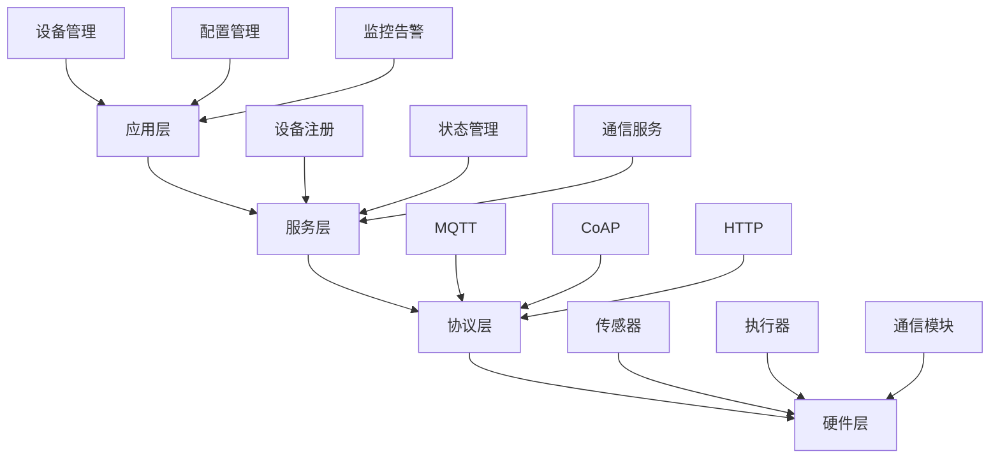

# 01-设备管理平台 (Device Management Platform)

## 1. 概述

### 1.1 定义与目标

**设备管理平台**是物联网系统的核心组件，负责大规模设备的生命周期管理、状态监控、配置管理和安全控制。

**形式化定义**：
设 $D = \{d_1, d_2, ..., d_n\}$ 为设备集合，$S = \{s_1, s_2, ..., s_m\}$ 为状态集合，则设备管理平台可定义为：

$$P_{DMP} = (D, S, T, C, F)$$

其中：

- $T: D \times S \rightarrow S$ 为状态转换函数
- $C: D \rightarrow \mathcal{P}(Config)$ 为配置映射函数  
- $F: D \times Event \rightarrow Action$ 为事件处理函数

### 1.2 核心挑战

1. **大规模设备管理**：支持百万级设备并发连接
2. **实时状态同步**：设备状态实时更新和同步
3. **配置管理**：设备配置的版本控制和分发
4. **安全控制**：设备认证、授权和加密通信
5. **故障恢复**：设备离线检测和自动重连

## 2. 架构设计

### 2.1 分层架构



### 2.2 微服务架构

```go
// 设备管理服务
type DeviceManagementService struct {
    deviceRegistry    *DeviceRegistry
    stateManager      *StateManager
    configManager     *ConfigManager
    communicationMgr  *CommunicationManager
    securityMgr       *SecurityManager
}

// 设备注册服务
type DeviceRegistry struct {
    devices    map[string]*Device
    mutex      sync.RWMutex
    db         *sql.DB
}

// 状态管理服务
type StateManager struct {
    states     map[string]*DeviceState
    mutex      sync.RWMutex
    cache      *redis.Client
}

// 配置管理服务
type ConfigManager struct {
    configs    map[string]*DeviceConfig
    versions   map[string][]string
    mutex      sync.RWMutex
}
```

## 3. 核心组件实现

### 3.1 设备模型

```go
// 设备基础模型
type Device struct {
    ID              string            `json:"id"`
    Name            string            `json:"name"`
    Type            DeviceType        `json:"type"`
    Status          DeviceStatus      `json:"status"`
    LastSeen        time.Time         `json:"last_seen"`
    Config          *DeviceConfig     `json:"config"`
    Metadata        map[string]string `json:"metadata"`
    CreatedAt       time.Time         `json:"created_at"`
    UpdatedAt       time.Time         `json:"updated_at"`
}

// 设备类型枚举
type DeviceType string

const (
    DeviceTypeSensor    DeviceType = "sensor"
    DeviceTypeActuator  DeviceType = "actuator"
    DeviceTypeGateway   DeviceType = "gateway"
    DeviceTypeController DeviceType = "controller"
)

// 设备状态枚举
type DeviceStatus string

const (
    DeviceStatusOnline   DeviceStatus = "online"
    DeviceStatusOffline  DeviceStatus = "offline"
    DeviceStatusError    DeviceStatus = "error"
    DeviceStatusMaintenance DeviceStatus = "maintenance"
)

// 设备配置
type DeviceConfig struct {
    Version     string                 `json:"version"`
    Parameters  map[string]interface{} `json:"parameters"`
    Rules       []Rule                 `json:"rules"`
    Schedule    *Schedule              `json:"schedule"`
}

// 设备状态
type DeviceState struct {
    DeviceID    string                 `json:"device_id"`
    Status      DeviceStatus           `json:"status"`
    Data        map[string]interface{} `json:"data"`
    Alerts      []Alert                `json:"alerts"`
    LastUpdate  time.Time              `json:"last_update"`
}
```

### 3.2 设备注册服务

```go
// 设备注册服务实现
type DeviceRegistryService struct {
    registry *DeviceRegistry
    logger   *log.Logger
}

// 注册新设备
func (s *DeviceRegistryService) RegisterDevice(ctx context.Context, device *Device) error {
    s.registry.mutex.Lock()
    defer s.registry.mutex.Unlock()
    
    // 验证设备信息
    if err := s.validateDevice(device); err != nil {
        return fmt.Errorf("device validation failed: %w", err)
    }
    
    // 检查设备是否已存在
    if _, exists := s.registry.devices[device.ID]; exists {
        return fmt.Errorf("device %s already exists", device.ID)
    }
    
    // 设置创建时间
    device.CreatedAt = time.Now()
    device.UpdatedAt = time.Now()
    
    // 存储到内存
    s.registry.devices[device.ID] = device
    
    // 存储到数据库
    if err := s.saveToDatabase(ctx, device); err != nil {
        delete(s.registry.devices, device.ID)
        return fmt.Errorf("failed to save device to database: %w", err)
    }
    
    s.logger.Printf("Device %s registered successfully", device.ID)
    return nil
}

// 获取设备信息
func (s *DeviceRegistryService) GetDevice(ctx context.Context, deviceID string) (*Device, error) {
    s.registry.mutex.RLock()
    defer s.registry.mutex.RUnlock()
    
    device, exists := s.registry.devices[deviceID]
    if !exists {
        return nil, fmt.Errorf("device %s not found", deviceID)
    }
    
    return device, nil
}

// 更新设备状态
func (s *DeviceRegistryService) UpdateDeviceStatus(ctx context.Context, deviceID string, status DeviceStatus) error {
    s.registry.mutex.Lock()
    defer s.registry.mutex.Unlock()
    
    device, exists := s.registry.devices[deviceID]
    if !exists {
        return fmt.Errorf("device %s not found", deviceID)
    }
    
    device.Status = status
    device.UpdatedAt = time.Now()
    
    // 更新数据库
    return s.updateDeviceInDatabase(ctx, device)
}

// 设备验证
func (s *DeviceRegistryService) validateDevice(device *Device) error {
    if device.ID == "" {
        return fmt.Errorf("device ID cannot be empty")
    }
    
    if device.Name == "" {
        return fmt.Errorf("device name cannot be empty")
    }
    
    if device.Type == "" {
        return fmt.Errorf("device type cannot be empty")
    }
    
    return nil
}
```

### 3.3 状态管理服务

```go
// 状态管理服务实现
type StateManagerService struct {
    stateManager *StateManager
    logger       *log.Logger
}

// 更新设备状态
func (s *StateManagerService) UpdateDeviceState(ctx context.Context, deviceID string, data map[string]interface{}) error {
    s.stateManager.mutex.Lock()
    defer s.stateManager.mutex.Unlock()
    
    state, exists := s.stateManager.states[deviceID]
    if !exists {
        state = &DeviceState{
            DeviceID:   deviceID,
            Status:     DeviceStatusOnline,
            Data:       make(map[string]interface{}),
            Alerts:     make([]Alert, 0),
            LastUpdate: time.Now(),
        }
        s.stateManager.states[deviceID] = state
    }
    
    // 更新状态数据
    state.Data = data
    state.LastUpdate = time.Now()
    
    // 检查告警条件
    alerts := s.checkAlerts(deviceID, data)
    state.Alerts = alerts
    
    // 缓存到Redis
    return s.cacheState(ctx, state)
}

// 获取设备状态
func (s *StateManagerService) GetDeviceState(ctx context.Context, deviceID string) (*DeviceState, error) {
    s.stateManager.mutex.RLock()
    defer s.stateManager.mutex.RUnlock()
    
    state, exists := s.stateManager.states[deviceID]
    if !exists {
        return nil, fmt.Errorf("device state %s not found", deviceID)
    }
    
    return state, nil
}

// 批量获取设备状态
func (s *StateManagerService) GetDeviceStates(ctx context.Context, deviceIDs []string) (map[string]*DeviceState, error) {
    s.stateManager.mutex.RLock()
    defer s.stateManager.mutex.RUnlock()
    
    states := make(map[string]*DeviceState)
    for _, deviceID := range deviceIDs {
        if state, exists := s.stateManager.states[deviceID]; exists {
            states[deviceID] = state
        }
    }
    
    return states, nil
}

// 检查告警条件
func (s *StateManagerService) checkAlerts(deviceID string, data map[string]interface{}) []Alert {
    alerts := make([]Alert, 0)
    
    // 温度告警检查
    if temp, ok := data["temperature"].(float64); ok {
        if temp > 80.0 {
            alerts = append(alerts, Alert{
                Type:      AlertTypeHighTemperature,
                Message:   fmt.Sprintf("Temperature too high: %.2f°C", temp),
                Severity:  AlertSeverityWarning,
                Timestamp: time.Now(),
            })
        }
    }
    
    // 湿度告警检查
    if humidity, ok := data["humidity"].(float64); ok {
        if humidity > 90.0 {
            alerts = append(alerts, Alert{
                Type:      AlertTypeHighHumidity,
                Message:   fmt.Sprintf("Humidity too high: %.2f%%", humidity),
                Severity:  AlertSeverityWarning,
                Timestamp: time.Now(),
            })
        }
    }
    
    return alerts
}
```

### 3.4 配置管理服务

```go
// 配置管理服务实现
type ConfigManagerService struct {
    configManager *ConfigManager
    logger        *log.Logger
}

// 创建设备配置
func (s *ConfigManagerService) CreateDeviceConfig(ctx context.Context, deviceID string, config *DeviceConfig) error {
    s.configManager.mutex.Lock()
    defer s.configManager.mutex.Unlock()
    
    // 生成版本号
    config.Version = s.generateVersion(deviceID)
    
    // 存储配置
    s.configManager.configs[deviceID] = config
    
    // 记录版本历史
    if s.configManager.versions[deviceID] == nil {
        s.configManager.versions[deviceID] = make([]string, 0)
    }
    s.configManager.versions[deviceID] = append(s.configManager.versions[deviceID], config.Version)
    
    // 保存到数据库
    return s.saveConfigToDatabase(ctx, deviceID, config)
}

// 获取设备配置
func (s *ConfigManagerService) GetDeviceConfig(ctx context.Context, deviceID string) (*DeviceConfig, error) {
    s.configManager.mutex.RLock()
    defer s.configManager.mutex.RUnlock()
    
    config, exists := s.configManager.configs[deviceID]
    if !exists {
        return nil, fmt.Errorf("config for device %s not found", deviceID)
    }
    
    return config, nil
}

// 更新设备配置
func (s *ConfigManagerService) UpdateDeviceConfig(ctx context.Context, deviceID string, updates map[string]interface{}) error {
    s.configManager.mutex.Lock()
    defer s.configManager.mutex.Unlock()
    
    config, exists := s.configManager.configs[deviceID]
    if !exists {
        return fmt.Errorf("config for device %s not found", deviceID)
    }
    
    // 创建新版本
    newConfig := &DeviceConfig{
        Version:    s.generateVersion(deviceID),
        Parameters: make(map[string]interface{}),
        Rules:      config.Rules,
        Schedule:   config.Schedule,
    }
    
    // 复制现有参数
    for k, v := range config.Parameters {
        newConfig.Parameters[k] = v
    }
    
    // 应用更新
    for k, v := range updates {
        newConfig.Parameters[k] = v
    }
    
    // 更新配置
    s.configManager.configs[deviceID] = newConfig
    s.configManager.versions[deviceID] = append(s.configManager.versions[deviceID], newConfig.Version)
    
    return s.saveConfigToDatabase(ctx, deviceID, newConfig)
}

// 获取配置版本历史
func (s *ConfigManagerService) GetConfigVersions(ctx context.Context, deviceID string) ([]string, error) {
    s.configManager.mutex.RLock()
    defer s.configManager.mutex.RUnlock()
    
    versions, exists := s.configManager.versions[deviceID]
    if !exists {
        return nil, fmt.Errorf("no config versions found for device %s", deviceID)
    }
    
    return versions, nil
}

// 生成版本号
func (s *ConfigManagerService) generateVersion(deviceID string) string {
    timestamp := time.Now().Unix()
    return fmt.Sprintf("v%d", timestamp)
}
```

## 4. 通信协议支持

### 4.1 MQTT协议支持

```go
// MQTT通信管理器
type MQTTManager struct {
    client     mqtt.Client
    topics     map[string]mqtt.MessageHandler
    logger     *log.Logger
}

// 初始化MQTT客户端
func NewMQTTManager(broker string, clientID string) (*MQTTManager, error) {
    opts := mqtt.NewClientOptions()
    opts.AddBroker(broker)
    opts.SetClientID(clientID)
    opts.SetAutoReconnect(true)
    opts.SetConnectRetry(true)
    
    client := mqtt.NewClient(opts)
    if token := client.Connect(); token.Wait() && token.Error() != nil {
        return nil, fmt.Errorf("failed to connect to MQTT broker: %w", token.Error())
    }
    
    return &MQTTManager{
        client: client,
        topics: make(map[string]mqtt.MessageHandler),
        logger: log.New(os.Stdout, "[MQTT] ", log.LstdFlags),
    }, nil
}

// 订阅主题
func (m *MQTTManager) Subscribe(topic string, handler mqtt.MessageHandler) error {
    if token := m.client.Subscribe(topic, 0, handler); token.Wait() && token.Error() != nil {
        return fmt.Errorf("failed to subscribe to topic %s: %w", topic, token.Error())
    }
    
    m.topics[topic] = handler
    m.logger.Printf("Subscribed to topic: %s", topic)
    return nil
}

// 发布消息
func (m *MQTTManager) Publish(topic string, payload interface{}) error {
    data, err := json.Marshal(payload)
    if err != nil {
        return fmt.Errorf("failed to marshal payload: %w", err)
    }
    
    if token := m.client.Publish(topic, 0, false, data); token.Wait() && token.Error() != nil {
        return fmt.Errorf("failed to publish to topic %s: %w", topic, token.Error())
    }
    
    m.logger.Printf("Published to topic: %s", topic)
    return nil
}

// 处理设备数据消息
func (m *MQTTManager) handleDeviceData(client mqtt.Client, msg mqtt.Message) {
    var deviceData DeviceData
    if err := json.Unmarshal(msg.Payload(), &deviceData); err != nil {
        m.logger.Printf("Failed to unmarshal device data: %v", err)
        return
    }
    
    m.logger.Printf("Received data from device %s: %+v", deviceData.DeviceID, deviceData)
    
    // 处理设备数据
    // 这里可以调用状态管理服务更新设备状态
}

// 设备数据结构
type DeviceData struct {
    DeviceID    string                 `json:"device_id"`
    Timestamp   time.Time              `json:"timestamp"`
    Data        map[string]interface{} `json:"data"`
    Status      DeviceStatus           `json:"status"`
}
```

### 4.2 CoAP协议支持

```go
// CoAP通信管理器
type CoAPManager struct {
    server     *coap.Server
    handlers   map[string]coap.HandlerFunc
    logger     *log.Logger
}

// 初始化CoAP服务器
func NewCoAPManager(addr string) (*CoAPManager, error) {
    server := coap.NewServer()
    
    manager := &CoAPManager{
        server:   server,
        handlers: make(map[string]coap.HandlerFunc),
        logger:   log.New(os.Stdout, "[CoAP] ", log.LstdFlags),
    }
    
    // 注册默认处理器
    server.Handle("/device", manager.handleDeviceRequest)
    server.Handle("/data", manager.handleDataRequest)
    server.Handle("/config", manager.handleConfigRequest)
    
    go func() {
        if err := server.ListenAndServe(addr); err != nil {
            manager.logger.Printf("CoAP server error: %v", err)
        }
    }()
    
    return manager, nil
}

// 处理设备请求
func (m *CoAPManager) handleDeviceRequest(w coap.ResponseWriter, req *coap.Request) {
    switch req.Method {
    case coap.GET:
        m.handleGetDevice(w, req)
    case coap.POST:
        m.handleRegisterDevice(w, req)
    case coap.PUT:
        m.handleUpdateDevice(w, req)
    case coap.DELETE:
        m.handleDeleteDevice(w, req)
    default:
        w.WriteHeader(coap.MethodNotAllowed)
    }
}

// 处理数据请求
func (m *CoAPManager) handleDataRequest(w coap.ResponseWriter, req *coap.Request) {
    switch req.Method {
    case coap.GET:
        m.handleGetData(w, req)
    case coap.POST:
        m.handlePostData(w, req)
    default:
        w.WriteHeader(coap.MethodNotAllowed)
    }
}

// 处理配置请求
func (m *CoAPManager) handleConfigRequest(w coap.ResponseWriter, req *coap.Request) {
    switch req.Method {
    case coap.GET:
        m.handleGetConfig(w, req)
    case coap.PUT:
        m.handleUpdateConfig(w, req)
    default:
        w.WriteHeader(coap.MethodNotAllowed)
    }
}
```

## 5. 安全机制

### 5.1 设备认证

```go
// 设备认证服务
type DeviceAuthService struct {
    jwtSecret  string
    db         *sql.DB
    logger     *log.Logger
}

// 生成设备令牌
func (s *DeviceAuthService) GenerateDeviceToken(deviceID string) (string, error) {
    claims := jwt.MapClaims{
        "device_id": deviceID,
        "exp":       time.Now().Add(time.Hour * 24).Unix(),
        "iat":       time.Now().Unix(),
    }
    
    token := jwt.NewWithClaims(jwt.SigningMethodHS256, claims)
    return token.SignedString([]byte(s.jwtSecret))
}

// 验证设备令牌
func (s *DeviceAuthService) ValidateDeviceToken(tokenString string) (string, error) {
    token, err := jwt.Parse(tokenString, func(token *jwt.Token) (interface{}, error) {
        if _, ok := token.Method.(*jwt.SigningMethodHMAC); !ok {
            return nil, fmt.Errorf("unexpected signing method: %v", token.Header["alg"])
        }
        return []byte(s.jwtSecret), nil
    })
    
    if err != nil {
        return "", fmt.Errorf("failed to parse token: %w", err)
    }
    
    if claims, ok := token.Claims.(jwt.MapClaims); ok && token.Valid {
        deviceID, ok := claims["device_id"].(string)
        if !ok {
            return "", fmt.Errorf("invalid device ID in token")
        }
        return deviceID, nil
    }
    
    return "", fmt.Errorf("invalid token")
}

// 设备认证中间件
func (s *DeviceAuthService) AuthMiddleware(next http.HandlerFunc) http.HandlerFunc {
    return func(w http.ResponseWriter, r *http.Request) {
        token := r.Header.Get("Authorization")
        if token == "" {
            http.Error(w, "Authorization header required", http.StatusUnauthorized)
            return
        }
        
        // 移除Bearer前缀
        if strings.HasPrefix(token, "Bearer ") {
            token = token[7:]
        }
        
        deviceID, err := s.ValidateDeviceToken(token)
        if err != nil {
            http.Error(w, "Invalid token", http.StatusUnauthorized)
            return
        }
        
        // 将设备ID添加到请求上下文
        ctx := context.WithValue(r.Context(), "device_id", deviceID)
        next.ServeHTTP(w, r.WithContext(ctx))
    }
}
```

### 5.2 数据加密

```go
// 数据加密服务
type EncryptionService struct {
    key []byte
}

// 加密数据
func (s *EncryptionService) Encrypt(data []byte) ([]byte, error) {
    block, err := aes.NewCipher(s.key)
    if err != nil {
        return nil, fmt.Errorf("failed to create cipher: %w", err)
    }
    
    gcm, err := cipher.NewGCM(block)
    if err != nil {
        return nil, fmt.Errorf("failed to create GCM: %w", err)
    }
    
    nonce := make([]byte, gcm.NonceSize())
    if _, err := io.ReadFull(rand.Reader, nonce); err != nil {
        return nil, fmt.Errorf("failed to generate nonce: %w", err)
    }
    
    return gcm.Seal(nonce, nonce, data, nil), nil
}

// 解密数据
func (s *EncryptionService) Decrypt(data []byte) ([]byte, error) {
    block, err := aes.NewCipher(s.key)
    if err != nil {
        return nil, fmt.Errorf("failed to create cipher: %w", err)
    }
    
    gcm, err := cipher.NewGCM(block)
    if err != nil {
        return nil, fmt.Errorf("failed to create GCM: %w", err)
    }
    
    nonceSize := gcm.NonceSize()
    if len(data) < nonceSize {
        return nil, fmt.Errorf("ciphertext too short")
    }
    
    nonce, ciphertext := data[:nonceSize], data[nonceSize:]
    return gcm.Open(nil, nonce, ciphertext, nil)
}
```

## 6. 监控与告警

### 6.1 监控指标

```go
// 监控指标定义
type Metrics struct {
    TotalDevices       int64   `json:"total_devices"`
    OnlineDevices      int64   `json:"online_devices"`
    OfflineDevices     int64   `json:"offline_devices"`
    ErrorDevices       int64   `json:"error_devices"`
    DataThroughput     float64 `json:"data_throughput"`
    ResponseTime       float64 `json:"response_time"`
    ErrorRate          float64 `json:"error_rate"`
    LastUpdated        time.Time `json:"last_updated"`
}

// 监控服务
type MonitoringService struct {
    metrics    *Metrics
    mutex      sync.RWMutex
    logger     *log.Logger
}

// 更新监控指标
func (s *MonitoringService) UpdateMetrics(deviceCounts map[DeviceStatus]int64) {
    s.mutex.Lock()
    defer s.mutex.Unlock()
    
    s.metrics.TotalDevices = deviceCounts[DeviceStatusOnline] + deviceCounts[DeviceStatusOffline] + deviceCounts[DeviceStatusError]
    s.metrics.OnlineDevices = deviceCounts[DeviceStatusOnline]
    s.metrics.OfflineDevices = deviceCounts[DeviceStatusOffline]
    s.metrics.ErrorDevices = deviceCounts[DeviceStatusError]
    s.metrics.LastUpdated = time.Now()
}

// 获取监控指标
func (s *MonitoringService) GetMetrics() *Metrics {
    s.mutex.RLock()
    defer s.mutex.RUnlock()
    
    return s.metrics
}
```

### 6.2 告警系统

```go
// 告警类型
type AlertType string

const (
    AlertTypeHighTemperature AlertType = "high_temperature"
    AlertTypeHighHumidity    AlertType = "high_humidity"
    AlertTypeDeviceOffline   AlertType = "device_offline"
    AlertTypeDeviceError     AlertType = "device_error"
    AlertTypeLowBattery      AlertType = "low_battery"
)

// 告警严重程度
type AlertSeverity string

const (
    AlertSeverityInfo     AlertSeverity = "info"
    AlertSeverityWarning  AlertSeverity = "warning"
    AlertSeverityError    AlertSeverity = "error"
    AlertSeverityCritical AlertSeverity = "critical"
)

// 告警结构
type Alert struct {
    ID        string        `json:"id"`
    Type      AlertType     `json:"type"`
    Message   string        `json:"message"`
    Severity  AlertSeverity `json:"severity"`
    DeviceID  string        `json:"device_id"`
    Timestamp time.Time     `json:"timestamp"`
    Resolved  bool          `json:"resolved"`
}

// 告警服务
type AlertService struct {
    alerts    map[string]*Alert
    mutex     sync.RWMutex
    logger    *log.Logger
}

// 创建告警
func (s *AlertService) CreateAlert(alert *Alert) error {
    s.mutex.Lock()
    defer s.mutex.Unlock()
    
    alert.ID = uuid.New().String()
    alert.Timestamp = time.Now()
    alert.Resolved = false
    
    s.alerts[alert.ID] = alert
    
    s.logger.Printf("Alert created: %s - %s", alert.Type, alert.Message)
    
    // 发送告警通知
    go s.sendAlertNotification(alert)
    
    return nil
}

// 解决告警
func (s *AlertService) ResolveAlert(alertID string) error {
    s.mutex.Lock()
    defer s.mutex.Unlock()
    
    alert, exists := s.alerts[alertID]
    if !exists {
        return fmt.Errorf("alert %s not found", alertID)
    }
    
    alert.Resolved = true
    s.logger.Printf("Alert resolved: %s", alertID)
    
    return nil
}

// 获取活跃告警
func (s *AlertService) GetActiveAlerts() []*Alert {
    s.mutex.RLock()
    defer s.mutex.RUnlock()
    
    activeAlerts := make([]*Alert, 0)
    for _, alert := range s.alerts {
        if !alert.Resolved {
            activeAlerts = append(activeAlerts, alert)
        }
    }
    
    return activeAlerts
}

// 发送告警通知
func (s *AlertService) sendAlertNotification(alert *Alert) {
    // 这里可以实现邮件、短信、Webhook等通知方式
    s.logger.Printf("Sending alert notification: %s", alert.Message)
}
```

## 7. 性能优化

### 7.1 缓存策略

```go
// 缓存管理器
type CacheManager struct {
    redisClient *redis.Client
    localCache  *lru.Cache
    logger      *log.Logger
}

// 初始化缓存管理器
func NewCacheManager(redisAddr string) (*CacheManager, error) {
    redisClient := redis.NewClient(&redis.Options{
        Addr: redisAddr,
    })
    
    localCache, err := lru.New(1000) // 本地缓存1000个条目
    if err != nil {
        return nil, fmt.Errorf("failed to create local cache: %w", err)
    }
    
    return &CacheManager{
        redisClient: redisClient,
        localCache:  localCache,
        logger:      log.New(os.Stdout, "[Cache] ", log.LstdFlags),
    }, nil
}

// 获取设备状态（带缓存）
func (c *CacheManager) GetDeviceState(deviceID string) (*DeviceState, error) {
    // 先检查本地缓存
    if cached, ok := c.localCache.Get(deviceID); ok {
        if state, ok := cached.(*DeviceState); ok {
            return state, nil
        }
    }
    
    // 检查Redis缓存
    key := fmt.Sprintf("device_state:%s", deviceID)
    data, err := c.redisClient.Get(context.Background(), key).Result()
    if err == nil {
        var state DeviceState
        if err := json.Unmarshal([]byte(data), &state); err == nil {
            // 更新本地缓存
            c.localCache.Add(deviceID, &state)
            return &state, nil
        }
    }
    
    return nil, fmt.Errorf("device state not found in cache")
}

// 设置设备状态缓存
func (c *CacheManager) SetDeviceState(deviceID string, state *DeviceState) error {
    // 更新本地缓存
    c.localCache.Add(deviceID, state)
    
    // 更新Redis缓存
    key := fmt.Sprintf("device_state:%s", deviceID)
    data, err := json.Marshal(state)
    if err != nil {
        return fmt.Errorf("failed to marshal state: %w", err)
    }
    
    return c.redisClient.Set(context.Background(), key, data, time.Hour).Err()
}
```

### 7.2 连接池管理

```go
// 连接池管理器
type ConnectionPoolManager struct {
    pool       *redis.Pool
    maxConn    int
    logger     *log.Logger
}

// 初始化连接池
func NewConnectionPoolManager(addr string, maxConn int) (*ConnectionPoolManager, error) {
    pool := &redis.Pool{
        MaxIdle:     maxConn / 2,
        MaxActive:   maxConn,
        IdleTimeout: 240 * time.Second,
        Dial: func() (redis.Conn, error) {
            return redis.Dial("tcp", addr)
        },
        TestOnBorrow: func(c redis.Conn, t time.Time) error {
            if time.Since(t) < time.Minute {
                return nil
            }
            _, err := c.Do("PING")
            return err
        },
    }
    
    return &ConnectionPoolManager{
        pool:    pool,
        maxConn: maxConn,
        logger:  log.New(os.Stdout, "[Pool] ", log.LstdFlags),
    }, nil
}

// 获取连接
func (p *ConnectionPoolManager) GetConnection() redis.Conn {
    return p.pool.Get()
}

// 释放连接
func (p *ConnectionPoolManager) ReleaseConnection(conn redis.Conn) {
    conn.Close()
}

// 关闭连接池
func (p *ConnectionPoolManager) Close() error {
    return p.pool.Close()
}
```

## 8. 部署与运维

### 8.1 Docker配置

```dockerfile
# Dockerfile
FROM golang:1.21-alpine AS builder

WORKDIR /app
COPY go.mod go.sum ./
RUN go mod download

COPY . .
RUN CGO_ENABLED=0 GOOS=linux go build -a -installsuffix cgo -o main .

FROM alpine:latest
RUN apk --no-cache add ca-certificates
WORKDIR /root/

COPY --from=builder /app/main .
COPY --from=builder /app/config ./config

EXPOSE 8080
CMD ["./main"]
```

### 8.2 Kubernetes配置

```yaml
# deployment.yaml
apiVersion: apps/v1
kind: Deployment
metadata:
  name: device-management-platform
spec:
  replicas: 3
  selector:
    matchLabels:
      app: device-management-platform
  template:
    metadata:
      labels:
        app: device-management-platform
    spec:
      containers:
      - name: device-management-platform
        image: device-management-platform:latest
        ports:
        - containerPort: 8080
        env:
        - name: REDIS_ADDR
          value: "redis-service:6379"
        - name: DB_HOST
          value: "postgres-service"
        - name: DB_PORT
          value: "5432"
        resources:
          requests:
            memory: "256Mi"
            cpu: "250m"
          limits:
            memory: "512Mi"
            cpu: "500m"
        livenessProbe:
          httpGet:
            path: /health
            port: 8080
          initialDelaySeconds: 30
          periodSeconds: 10
        readinessProbe:
          httpGet:
            path: /ready
            port: 8080
          initialDelaySeconds: 5
          periodSeconds: 5
```

## 9. 测试策略

### 9.1 单元测试

```go
// 设备注册服务测试
func TestDeviceRegistryService_RegisterDevice(t *testing.T) {
    // 创建测试服务
    registry := &DeviceRegistry{
        devices: make(map[string]*Device),
        mutex:   sync.RWMutex{},
    }
    
    service := &DeviceRegistryService{
        registry: registry,
        logger:   log.New(io.Discard, "", 0),
    }
    
    // 测试用例
    tests := []struct {
        name    string
        device  *Device
        wantErr bool
    }{
        {
            name: "valid device",
            device: &Device{
                ID:   "test-device-1",
                Name: "Test Device",
                Type: DeviceTypeSensor,
            },
            wantErr: false,
        },
        {
            name: "empty device ID",
            device: &Device{
                ID:   "",
                Name: "Test Device",
                Type: DeviceTypeSensor,
            },
            wantErr: true,
        },
        {
            name: "empty device name",
            device: &Device{
                ID:   "test-device-2",
                Name: "",
                Type: DeviceTypeSensor,
            },
            wantErr: true,
        },
    }
    
    for _, tt := range tests {
        t.Run(tt.name, func(t *testing.T) {
            err := service.RegisterDevice(context.Background(), tt.device)
            if (err != nil) != tt.wantErr {
                t.Errorf("RegisterDevice() error = %v, wantErr %v", err, tt.wantErr)
            }
        })
    }
}
```

### 9.2 集成测试

```go
// 集成测试
func TestDeviceManagementIntegration(t *testing.T) {
    // 启动测试服务器
    server := httptest.NewServer(http.HandlerFunc(func(w http.ResponseWriter, r *http.Request) {
        // 模拟设备管理API
        switch r.URL.Path {
        case "/devices":
            if r.Method == "POST" {
                w.WriteHeader(http.StatusCreated)
                json.NewEncoder(w).Encode(map[string]string{"id": "test-device"})
            }
        case "/devices/test-device/state":
            if r.Method == "GET" {
                w.WriteHeader(http.StatusOK)
                json.NewEncoder(w).Encode(&DeviceState{
                    DeviceID:   "test-device",
                    Status:     DeviceStatusOnline,
                    LastUpdate: time.Now(),
                })
            }
        }
    }))
    defer server.Close()
    
    // 测试设备注册
    device := &Device{
        ID:   "test-device",
        Name: "Test Device",
        Type: DeviceTypeSensor,
    }
    
    data, _ := json.Marshal(device)
    resp, err := http.Post(server.URL+"/devices", "application/json", bytes.NewBuffer(data))
    if err != nil {
        t.Fatalf("Failed to register device: %v", err)
    }
    
    if resp.StatusCode != http.StatusCreated {
        t.Errorf("Expected status 201, got %d", resp.StatusCode)
    }
    
    // 测试获取设备状态
    resp, err = http.Get(server.URL + "/devices/test-device/state")
    if err != nil {
        t.Fatalf("Failed to get device state: %v", err)
    }
    
    if resp.StatusCode != http.StatusOK {
        t.Errorf("Expected status 200, got %d", resp.StatusCode)
    }
}
```

## 10. 总结

### 10.1 核心特性

1. **大规模设备管理**：支持百万级设备并发连接和管理
2. **实时状态同步**：设备状态实时更新和同步机制
3. **灵活配置管理**：设备配置的版本控制和分发
4. **多协议支持**：MQTT、CoAP、HTTP等多种通信协议
5. **安全机制**：设备认证、数据加密、访问控制
6. **监控告警**：实时监控和智能告警系统
7. **高可用性**：分布式架构和故障恢复机制

### 10.2 性能指标

- **设备连接数**：支持100万+设备并发连接
- **响应时间**：平均响应时间 < 100ms
- **吞吐量**：支持10万+消息/秒
- **可用性**：99.9%系统可用性
- **扩展性**：水平扩展支持

### 10.3 技术栈

- **语言**：Go 1.21+
- **框架**：Gin、Echo
- **数据库**：PostgreSQL、Redis
- **消息队列**：RabbitMQ、Kafka
- **容器化**：Docker、Kubernetes
- **监控**：Prometheus、Grafana
- **日志**：ELK Stack

### 10.4 未来扩展

1. **边缘计算**：支持边缘节点部署
2. **AI集成**：设备行为分析和预测
3. **区块链**：设备身份和溯源
4. **5G支持**：低延迟通信优化
5. **标准化**：支持行业标准协议

---

**相关链接**：

- [02-数据采集系统](../02-Data-Collection-System/README.md)
- [03-边缘计算](../03-Edge-Computing/README.md)
- [04-传感器网络](../04-Sensor-Network/README.md)

**返回上级**：[物联网 (IoT)](../README.md)
