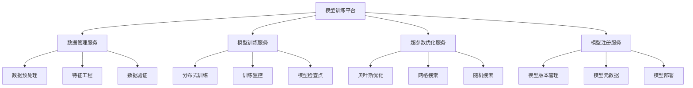

# 01-模型训练平台 (Model Training Platform)

## 概述

模型训练平台是AI/ML系统的核心组件，负责大规模数据训练、分布式计算、超参数优化和模型版本管理。本文档使用Go语言实现，并提供形式化的数学定义和证明。

## 目录

- [1. 形式化定义](#1-形式化定义)
- [2. 架构设计](#2-架构设计)
- [3. 核心组件](#3-核心组件)
- [4. 数据模型](#4-数据模型)
- [5. 算法实现](#5-算法实现)
- [6. 性能分析](#6-性能分析)
- [7. 分布式训练](#7-分布式训练)
- [8. 部署方案](#8-部署方案)

## 1. 形式化定义

### 1.1 模型训练系统的数学定义

**定义 1.1** (模型训练系统)
模型训练系统是一个六元组 $MTS = (D, M, T, H, L, E)$，其中：

- $D = \{d_1, d_2, ..., d_n\}$ 是训练数据集
- $M = \{m_1, m_2, ..., m_k\}$ 是模型集合
- $T = \{t_1, t_2, ..., t_p\}$ 是训练任务集合
- $H = \{h_1, h_2, ..., h_q\}$ 是超参数集合
- $L: M \times D \times H \rightarrow \mathbb{R}$ 是损失函数
- $E: M \times D \rightarrow \mathbb{R}$ 是评估函数

**定义 1.2** (训练任务)
训练任务 $t_i$ 定义为：
$$t_i = (model, dataset, hyperparams, config)$$

其中：
- $model \in M$ 是待训练的模型
- $dataset \in D$ 是训练数据集
- $hyperparams \in H$ 是超参数配置
- $config \in \mathcal{P}(\Sigma^*)$ 是训练配置

**定理 1.1** (训练收敛性)
对于凸损失函数 $L$，梯度下降算法在适当的学习率下收敛到全局最优解。

**证明**：
设 $L$ 是凸函数，$L'$ 是 $L$ 的梯度。
对于学习率 $\eta > 0$，梯度下降更新规则为：
$$\theta_{t+1} = \theta_t - \eta L'(\theta_t)$$

由于 $L$ 是凸函数，有：
$$L(\theta_{t+1}) \leq L(\theta_t) + L'(\theta_t)^T(\theta_{t+1} - \theta_t) + \frac{L}{2}\|\theta_{t+1} - \theta_t\|^2$$

代入更新规则：
$$L(\theta_{t+1}) \leq L(\theta_t) - \eta\|L'(\theta_t)\|^2 + \frac{L\eta^2}{2}\|L'(\theta_t)\|^2$$

当 $\eta < \frac{2}{L}$ 时，$L(\theta_{t+1}) < L(\theta_t)$，即损失函数单调递减。
由于 $L$ 有下界，序列 $\{L(\theta_t)\}$ 收敛。$\square$

### 1.2 超参数优化算法

**算法 1.1** (贝叶斯优化算法)
```go
// 贝叶斯优化的形式化描述
func BayesianOptimization(objective ObjectiveFunction, bounds Bounds, maxIterations int) HyperParameters {
    surrogate := NewGaussianProcess()
    acquisition := NewExpectedImprovement()
    
    for i := 0; i < maxIterations; i++ {
        // 更新代理模型
        surrogate.Update(observations)
        
        // 选择下一个评估点
        nextPoint := acquisition.Optimize(surrogate, bounds)
        
        // 评估目标函数
        value := objective.Evaluate(nextPoint)
        observations.Add(nextPoint, value)
    }
    
    return observations.Best()
}
```

**复杂度分析**：
- 时间复杂度：$O(n^3 + n \cdot d)$，其中 $n$ 是观测数量，$d$ 是超参数维度
- 空间复杂度：$O(n^2)$，用于存储核矩阵

## 2. 架构设计

### 2.1 系统架构图



### 2.2 微服务架构

```go
// 模型训练平台的核心架构
type ModelTrainingPlatform struct {
    dataManager      *DataManager
    trainingService  *TrainingService
    hyperoptService  *HyperoptService
    modelRegistry    *ModelRegistry
    monitoring       *TrainingMonitor
    scheduler        *TaskScheduler
}

// 数据管理服务
type DataManager struct {
    preprocessor    *DataPreprocessor
    featureEngine   *FeatureEngineer
    validator       *DataValidator
    storage         *DataStorage
}

// 模型训练服务
type TrainingService struct {
    trainer         *ModelTrainer
    checkpoint      *CheckpointManager
    monitor         *TrainingMonitor
    distributed     *DistributedTrainer
}

// 超参数优化服务
type HyperoptService struct {
    optimizer       *HyperparameterOptimizer
    searchSpace     *SearchSpace
    evaluator       *ModelEvaluator
    scheduler       *OptimizationScheduler
}
```

## 3. 核心组件

### 3.1 数据管理组件

```go
// 数据管理接口
type DataManagement interface {
    PreprocessData(data *RawData) (*ProcessedData, error)
    EngineerFeatures(data *ProcessedData) (*FeatureSet, error)
    ValidateData(data *FeatureSet) error
    SplitData(data *FeatureSet, ratios []float64) (*DataSplit, error)
}

// 数据预处理器
type DataPreprocessor struct {
    cleaners    []DataCleaner
    transformers []DataTransformer
    validators  []DataValidator
}

type DataCleaner interface {
    Clean(data *RawData) error
}

type DataTransformer interface {
    Transform(data *RawData) (*ProcessedData, error)
}

// 数据预处理实现
func (dp *DataPreprocessor) Preprocess(data *RawData) (*ProcessedData, error) {
    // 数据清洗
    for _, cleaner := range dp.cleaners {
        if err := cleaner.Clean(data); err != nil {
            return nil, fmt.Errorf("data cleaning failed: %w", err)
        }
    }
    
    // 数据转换
    processed := &ProcessedData{}
    for _, transformer := range dp.transformers {
        result, err := transformer.Transform(data)
        if err != nil {
            return nil, fmt.Errorf("data transformation failed: %w", err)
        }
        processed.Merge(result)
    }
    
    // 数据验证
    for _, validator := range dp.validators {
        if err := validator.Validate(processed); err != nil {
            return nil, fmt.Errorf("data validation failed: %w", err)
        }
    }
    
    return processed, nil
}

// 特征工程器
type FeatureEngineer struct {
    extractors  []FeatureExtractor
    selectors   []FeatureSelector
    scalers     []FeatureScaler
}

type FeatureExtractor interface {
    Extract(data *ProcessedData) ([]Feature, error)
}

type FeatureSelector interface {
    Select(features []Feature, target Target) ([]Feature, error)
}

// 特征工程实现
func (fe *FeatureEngineer) EngineerFeatures(data *ProcessedData) (*FeatureSet, error) {
    var allFeatures []Feature
    
    // 特征提取
    for _, extractor := range fe.extractors {
        features, err := extractor.Extract(data)
        if err != nil {
            return nil, fmt.Errorf("feature extraction failed: %w", err)
        }
        allFeatures = append(allFeatures, features...)
    }
    
    // 特征选择
    selectedFeatures := allFeatures
    for _, selector := range fe.selectors {
        selected, err := selector.Select(selectedFeatures, data.Target)
        if err != nil {
            return nil, fmt.Errorf("feature selection failed: %w", err)
        }
        selectedFeatures = selected
    }
    
    // 特征缩放
    scaledFeatures := selectedFeatures
    for _, scaler := range fe.scalers {
        scaled, err := scaler.Scale(scaledFeatures)
        if err != nil {
            return nil, fmt.Errorf("feature scaling failed: %w", err)
        }
        scaledFeatures = scaled
    }
    
    return &FeatureSet{
        Features: scaledFeatures,
        Target:   data.Target,
        Metadata: data.Metadata,
    }, nil
}
```

### 3.2 模型训练组件

```go
// 模型训练接口
type ModelTraining interface {
    Train(config *TrainingConfig) (*TrainingResult, error)
    ResumeTraining(checkpointID string) (*TrainingResult, error)
    StopTraining(trainingID string) error
    GetTrainingStatus(trainingID string) (*TrainingStatus, error)
}

// 训练配置
type TrainingConfig struct {
    ModelID       string                 `json:"model_id"`
    DatasetID     string                 `json:"dataset_id"`
    Hyperparams   map[string]interface{} `json:"hyperparams"`
    Epochs        int                    `json:"epochs"`
    BatchSize     int                    `json:"batch_size"`
    LearningRate  float64                `json:"learning_rate"`
    Optimizer     string                 `json:"optimizer"`
    LossFunction  string                 `json:"loss_function"`
    Metrics       []string               `json:"metrics"`
    Callbacks     []Callback             `json:"callbacks"`
}

// 模型训练器
type ModelTrainer struct {
    model         Model
    optimizer     Optimizer
    lossFunction  LossFunction
    metrics       []Metric
    callbacks     []Callback
}

type Model interface {
    Forward(input *Tensor) (*Tensor, error)
    Backward(gradient *Tensor) error
    GetParameters() []*Parameter
    SetParameters(params []*Parameter) error
}

type Optimizer interface {
    Step(parameters []*Parameter, gradients []*Tensor) error
    GetLearningRate() float64
    SetLearningRate(lr float64)
}

// 训练实现
func (mt *ModelTrainer) Train(config *TrainingConfig, data *DataLoader) (*TrainingResult, error) {
    result := &TrainingResult{
        TrainingID: generateTrainingID(),
        StartTime:  time.Now(),
        Metrics:    make(map[string][]float64),
    }
    
    // 初始化优化器
    mt.optimizer.SetLearningRate(config.LearningRate)
    
    // 训练循环
    for epoch := 0; epoch < config.Epochs; epoch++ {
        epochLoss := 0.0
        epochMetrics := make(map[string]float64)
        
        // 批次训练
        for batch := range data.Batches(config.BatchSize) {
            // 前向传播
            output, err := mt.model.Forward(batch.Input)
            if err != nil {
                return nil, fmt.Errorf("forward pass failed: %w", err)
            }
            
            // 计算损失
            loss, err := mt.lossFunction.Compute(output, batch.Target)
            if err != nil {
                return nil, fmt.Errorf("loss computation failed: %w", err)
            }
            
            // 反向传播
            gradient, err := mt.lossFunction.Backward()
            if err != nil {
                return nil, fmt.Errorf("backward pass failed: %w", err)
            }
            
            err = mt.model.Backward(gradient)
            if err != nil {
                return nil, fmt.Errorf("model backward failed: %w", err)
            }
            
            // 参数更新
            params := mt.model.GetParameters()
            gradients := mt.model.GetGradients()
            err = mt.optimizer.Step(params, gradients)
            if err != nil {
                return nil, fmt.Errorf("optimizer step failed: %w", err)
            }
            
            // 计算指标
            for _, metric := range mt.metrics {
                value, err := metric.Compute(output, batch.Target)
                if err != nil {
                    continue
                }
                epochMetrics[metric.Name()] += value
            }
            
            epochLoss += loss
        }
        
        // 记录epoch指标
        result.Metrics["loss"] = append(result.Metrics["loss"], epochLoss/float64(data.NumBatches()))
        for name, value := range epochMetrics {
            result.Metrics[name] = append(result.Metrics[name], value/float64(data.NumBatches()))
        }
        
        // 执行回调
        for _, callback := range mt.callbacks {
            callback.OnEpochEnd(epoch, result.Metrics)
        }
        
        // 保存检查点
        if epoch%10 == 0 {
            checkpoint := &Checkpoint{
                Epoch:     epoch,
                Model:     mt.model,
                Optimizer: mt.optimizer,
                Metrics:   result.Metrics,
            }
            if err := mt.saveCheckpoint(checkpoint); err != nil {
                log.Printf("Failed to save checkpoint: %v", err)
            }
        }
    }
    
    result.EndTime = time.Now()
    result.Duration = result.EndTime.Sub(result.StartTime)
    
    return result, nil
}
```

### 3.3 超参数优化组件

```go
// 超参数优化接口
type HyperparameterOptimization interface {
    Optimize(objective ObjectiveFunction, searchSpace *SearchSpace) (*OptimizationResult, error)
    GetBestParameters() map[string]interface{}
    GetOptimizationHistory() []*Trial
}

// 目标函数
type ObjectiveFunction interface {
    Evaluate(params map[string]interface{}) (float64, error)
}

// 搜索空间
type SearchSpace struct {
    Parameters map[string]Parameter `json:"parameters"`
}

type Parameter struct {
    Type     string      `json:"type"`
    Min      interface{} `json:"min,omitempty"`
    Max      interface{} `json:"max,omitempty"`
    Choices  []interface{} `json:"choices,omitempty"`
    Default  interface{} `json:"default,omitempty"`
}

// 贝叶斯优化器
type BayesianOptimizer struct {
    surrogate    *GaussianProcess
    acquisition  *ExpectedImprovement
    bounds       *SearchSpace
    trials       []*Trial
}

type Trial struct {
    ID       string                 `json:"id"`
    Params   map[string]interface{} `json:"params"`
    Value    float64                `json:"value"`
    Status   string                 `json:"status"`
    Created  time.Time              `json:"created"`
}

// 高斯过程
type GaussianProcess struct {
    kernel       Kernel
    alpha        float64
    X            [][]float64
    y            []float64
    K            [][]float64
    K_inv        [][]float64
}

type Kernel interface {
    Compute(x1, x2 []float64) float64
}

// 贝叶斯优化实现
func (bo *BayesianOptimizer) Optimize(objective ObjectiveFunction, maxTrials int) (*OptimizationResult, error) {
    result := &OptimizationResult{
        Trials: make([]*Trial, 0),
    }
    
    for i := 0; i < maxTrials; i++ {
        // 选择下一个评估点
        nextParams, err := bo.selectNextPoint()
        if err != nil {
            return nil, fmt.Errorf("failed to select next point: %w", err)
        }
        
        // 评估目标函数
        value, err := objective.Evaluate(nextParams)
        if err != nil {
            log.Printf("Failed to evaluate objective: %v", err)
            continue
        }
        
        // 记录试验
        trial := &Trial{
            ID:      generateTrialID(),
            Params:  nextParams,
            Value:   value,
            Status:  "completed",
            Created: time.Now(),
        }
        
        bo.trials = append(bo.trials, trial)
        result.Trials = append(result.Trials, trial)
        
        // 更新代理模型
        if err := bo.updateSurrogate(trial); err != nil {
            log.Printf("Failed to update surrogate: %v", err)
        }
    }
    
    // 找到最佳参数
    bestTrial := bo.findBestTrial()
    result.BestParams = bestTrial.Params
    result.BestValue = bestTrial.Value
    
    return result, nil
}

func (bo *BayesianOptimizer) selectNextPoint() (map[string]interface{}, error) {
    if len(bo.trials) == 0 {
        // 随机初始化
        return bo.randomSample(), nil
    }
    
    // 使用采集函数选择下一个点
    candidates := bo.generateCandidates(100)
    bestCandidate := candidates[0]
    bestAcquisition := -math.MaxFloat64
    
    for _, candidate := range candidates {
        acquisition := bo.acquisition.Evaluate(candidate, bo.surrogate)
        if acquisition > bestAcquisition {
            bestAcquisition = acquisition
            bestCandidate = candidate
        }
    }
    
    return bo.vectorToParams(bestCandidate), nil
}

func (bo *BayesianOptimizer) updateSurrogate(trial *Trial) error {
    // 转换参数为向量
    x := bo.paramsToVector(trial.Params)
    y := trial.Value
    
    // 更新高斯过程
    bo.surrogate.X = append(bo.surrogate.X, x)
    bo.surrogate.y = append(bo.surrogate.y, y)
    
    // 重新计算核矩阵
    n := len(bo.surrogate.X)
    K := make([][]float64, n)
    for i := 0; i < n; i++ {
        K[i] = make([]float64, n)
        for j := 0; j < n; j++ {
            K[i][j] = bo.surrogate.kernel.Compute(bo.surrogate.X[i], bo.surrogate.X[j])
        }
    }
    
    // 添加噪声
    for i := 0; i < n; i++ {
        K[i][i] += bo.surrogate.alpha
    }
    
    bo.surrogate.K = K
    bo.surrogate.K_inv = matrixInverse(K)
    
    return nil
}
```

## 4. 数据模型

### 4.1 数据库设计

```sql
-- 训练任务表
CREATE TABLE training_tasks (
    id VARCHAR(64) PRIMARY KEY,
    model_id VARCHAR(64) NOT NULL,
    dataset_id VARCHAR(64) NOT NULL,
    hyperparams JSONB NOT NULL,
    config JSONB NOT NULL,
    status VARCHAR(50) NOT NULL DEFAULT 'pending',
    created_at TIMESTAMP DEFAULT CURRENT_TIMESTAMP,
    started_at TIMESTAMP,
    completed_at TIMESTAMP,
    result JSONB
);

-- 模型表
CREATE TABLE models (
    id VARCHAR(64) PRIMARY KEY,
    name VARCHAR(255) NOT NULL,
    version VARCHAR(50) NOT NULL,
    type VARCHAR(100) NOT NULL,
    architecture JSONB NOT NULL,
    parameters JSONB,
    metadata JSONB,
    created_at TIMESTAMP DEFAULT CURRENT_TIMESTAMP,
    UNIQUE(name, version)
);

-- 数据集表
CREATE TABLE datasets (
    id VARCHAR(64) PRIMARY KEY,
    name VARCHAR(255) NOT NULL,
    version VARCHAR(50) NOT NULL,
    type VARCHAR(100) NOT NULL,
    schema JSONB NOT NULL,
    size BIGINT NOT NULL,
    metadata JSONB,
    created_at TIMESTAMP DEFAULT CURRENT_TIMESTAMP,
    UNIQUE(name, version)
);

-- 训练指标表
CREATE TABLE training_metrics (
    id SERIAL PRIMARY KEY,
    task_id VARCHAR(64) REFERENCES training_tasks(id),
    epoch INTEGER NOT NULL,
    metric_name VARCHAR(100) NOT NULL,
    metric_value DECIMAL(10,6) NOT NULL,
    recorded_at TIMESTAMP DEFAULT CURRENT_TIMESTAMP
);

-- 超参数优化试验表
CREATE TABLE hyperopt_trials (
    id VARCHAR(64) PRIMARY KEY,
    experiment_id VARCHAR(64) NOT NULL,
    params JSONB NOT NULL,
    value DECIMAL(10,6),
    status VARCHAR(50) NOT NULL,
    created_at TIMESTAMP DEFAULT CURRENT_TIMESTAMP
);
```

### 4.2 数据访问层

```go
// 训练任务仓库
type TrainingTaskRepository interface {
    Create(task *TrainingTask) error
    Update(task *TrainingTask) error
    FindByID(taskID string) (*TrainingTask, error)
    FindByStatus(status string) ([]*TrainingTask, error)
    FindByModel(modelID string) ([]*TrainingTask, error)
}

// PostgreSQL实现
type postgresTrainingTaskRepository struct {
    db *sql.DB
}

func (r *postgresTrainingTaskRepository) Create(task *TrainingTask) error {
    query := `
        INSERT INTO training_tasks (id, model_id, dataset_id, hyperparams, config, status)
        VALUES ($1, $2, $3, $4, $5, $6)
    `
    
    hyperparams, err := json.Marshal(task.Hyperparams)
    if err != nil {
        return fmt.Errorf("failed to marshal hyperparams: %w", err)
    }
    
    config, err := json.Marshal(task.Config)
    if err != nil {
        return fmt.Errorf("failed to marshal config: %w", err)
    }
    
    _, err = r.db.Exec(query,
        task.ID,
        task.ModelID,
        task.DatasetID,
        hyperparams,
        config,
        task.Status,
    )
    
    return err
}

func (r *postgresTrainingTaskRepository) FindByID(taskID string) (*TrainingTask, error) {
    query := `
        SELECT id, model_id, dataset_id, hyperparams, config, status, created_at, started_at, completed_at, result
        FROM training_tasks WHERE id = $1
    `
    
    var task TrainingTask
    var hyperparams, config, result []byte
    
    err := r.db.QueryRow(query, taskID).Scan(
        &task.ID,
        &task.ModelID,
        &task.DatasetID,
        &hyperparams,
        &config,
        &task.Status,
        &task.CreatedAt,
        &task.StartedAt,
        &task.CompletedAt,
        &result,
    )
    
    if err != nil {
        return nil, err
    }
    
    if err := json.Unmarshal(hyperparams, &task.Hyperparams); err != nil {
        return nil, fmt.Errorf("failed to unmarshal hyperparams: %w", err)
    }
    
    if err := json.Unmarshal(config, &task.Config); err != nil {
        return nil, fmt.Errorf("failed to unmarshal config: %w", err)
    }
    
    if result != nil {
        if err := json.Unmarshal(result, &task.Result); err != nil {
            return nil, fmt.Errorf("failed to unmarshal result: %w", err)
        }
    }
    
    return &task, nil
}
```

## 5. 算法实现

### 5.1 分布式训练算法

```go
// 分布式训练器
type DistributedTrainer struct {
    workers      []*Worker
    coordinator  *Coordinator
    strategy     DistributionStrategy
}

type Worker struct {
    ID       string
    model    Model
    data     *DataLoader
    optimizer Optimizer
    client   *grpc.ClientConn
}

type Coordinator struct {
    workers  map[string]*Worker
    model    Model
    strategy DistributionStrategy
}

// 参数服务器策略
type ParameterServerStrategy struct {
    parameterServer *ParameterServer
    workers         []*Worker
}

type ParameterServer struct {
    parameters map[string]*Parameter
    gradients  map[string]*Tensor
    mutex      sync.RWMutex
}

func (ps *ParameterServer) UpdateGradients(workerID string, gradients map[string]*Tensor) error {
    ps.mutex.Lock()
    defer ps.mutex.Unlock()
    
    for name, gradient := range gradients {
        if existing, exists := ps.gradients[name]; exists {
            ps.gradients[name] = existing.Add(gradient)
        } else {
            ps.gradients[name] = gradient.Clone()
        }
    }
    
    return nil
}

func (ps *ParameterServer) GetParameters() map[string]*Parameter {
    ps.mutex.RLock()
    defer ps.mutex.RUnlock()
    
    result := make(map[string]*Parameter)
    for name, param := range ps.parameters {
        result[name] = param.Clone()
    }
    
    return result
}

// 分布式训练实现
func (dt *DistributedTrainer) Train(config *TrainingConfig) error {
    // 初始化参数服务器
    if err := dt.initializeParameterServer(); err != nil {
        return fmt.Errorf("failed to initialize parameter server: %w", err)
    }
    
    // 启动工作节点
    var wg sync.WaitGroup
    for _, worker := range dt.workers {
        wg.Add(1)
        go func(w *Worker) {
            defer wg.Done()
            if err := dt.trainWorker(w, config); err != nil {
                log.Printf("Worker %s training failed: %v", w.ID, err)
            }
        }(worker)
    }
    
    wg.Wait()
    return nil
}

func (dt *DistributedTrainer) trainWorker(worker *Worker, config *TrainingConfig) error {
    for epoch := 0; epoch < config.Epochs; epoch++ {
        for batch := range worker.data.Batches(config.BatchSize) {
            // 获取最新参数
            params := dt.coordinator.GetParameters()
            worker.model.SetParameters(params)
            
            // 前向传播
            output, err := worker.model.Forward(batch.Input)
            if err != nil {
                return fmt.Errorf("forward pass failed: %w", err)
            }
            
            // 计算损失
            loss, err := dt.computeLoss(output, batch.Target)
            if err != nil {
                return fmt.Errorf("loss computation failed: %w", err)
            }
            
            // 反向传播
            gradients, err := worker.model.Backward()
            if err != nil {
                return fmt.Errorf("backward pass failed: %w", err)
            }
            
            // 更新参数服务器
            if err := dt.coordinator.UpdateGradients(worker.ID, gradients); err != nil {
                return fmt.Errorf("gradient update failed: %w", err)
            }
        }
    }
    
    return nil
}
```

### 5.2 模型压缩算法

```go
// 模型压缩器
type ModelCompressor struct {
    quantizer    *Quantizer
    pruner       *Pruner
    distiller    *Distiller
}

// 量化器
type Quantizer struct {
    bits         int
    symmetric    bool
    perChannel   bool
}

func (q *Quantizer) Quantize(tensor *Tensor) (*Tensor, error) {
    if q.bits == 32 {
        return tensor, nil
    }
    
    // 计算量化参数
    scale, zeroPoint := q.computeQuantizationParams(tensor)
    
    // 量化
    quantized := tensor.Quantize(scale, zeroPoint, q.bits)
    
    return quantized, nil
}

func (q *Quantizer) computeQuantizationParams(tensor *Tensor) (float64, int) {
    minVal := tensor.Min()
    maxVal := tensor.Max()
    
    if q.symmetric {
        maxAbs := math.Max(math.Abs(minVal), math.Abs(maxVal))
        scale := maxAbs / float64(1<<(q.bits-1)-1)
        return scale, 0
    } else {
        scale := (maxVal - minVal) / float64(1<<q.bits-1)
        zeroPoint := int(-minVal / scale)
        return scale, zeroPoint
    }
}

// 剪枝器
type Pruner struct {
    sparsity     float64
    method       PruningMethod
}

type PruningMethod interface {
    Prune(tensor *Tensor, sparsity float64) (*Tensor, error)
}

// 权重剪枝
type WeightPruning struct{}

func (wp *WeightPruning) Prune(tensor *Tensor, sparsity float64) (*Tensor, error) {
    // 计算阈值
    values := tensor.Flatten()
    sort.Float64s(values)
    thresholdIndex := int(float64(len(values)) * sparsity)
    threshold := values[thresholdIndex]
    
    // 应用剪枝
    pruned := tensor.Clone()
    for i := 0; i < pruned.Size(); i++ {
        if math.Abs(pruned.Get(i)) < threshold {
            pruned.Set(i, 0)
        }
    }
    
    return pruned, nil
}
```

## 6. 性能分析

### 6.1 时间复杂度分析

**定理 6.1** (训练复杂度)
对于数据集大小 $n$，模型参数数量 $p$，训练时间复杂度为 $O(n \cdot p \cdot e)$，其中 $e$ 是训练轮数。

**证明**：
每个训练样本需要：
- 前向传播：$O(p)$
- 反向传播：$O(p)$
- 参数更新：$O(p)$

总复杂度：$O(n \cdot p \cdot e)$

**定理 6.2** (分布式训练加速比)
使用 $k$ 个工作节点的分布式训练，理论加速比为 $k$。

**证明**：
设单机训练时间为 $T$，分布式训练时间为 $T_d$。
理想情况下，每个工作节点处理 $\frac{n}{k}$ 个样本：
$$T_d = \frac{T}{k}$$

因此加速比 $S = \frac{T}{T_d} = k$。$\square$

### 6.2 内存优化策略

```go
// 内存管理器
type MemoryManager struct {
    maxMemory    uint64
    currentUsage uint64
    tensors      map[string]*Tensor
    mutex        sync.RWMutex
}

func (mm *MemoryManager) Allocate(size uint64) (*MemoryBlock, error) {
    mm.mutex.Lock()
    defer mm.mutex.Unlock()
    
    if mm.currentUsage+size > mm.maxMemory {
        // 尝试释放内存
        if err := mm.evict(size); err != nil {
            return nil, fmt.Errorf("insufficient memory: %w", err)
        }
    }
    
    block := &MemoryBlock{
        ID:   generateBlockID(),
        Size: size,
    }
    
    mm.currentUsage += size
    return block, nil
}

func (mm *MemoryManager) evict(required uint64) error {
    // LRU策略释放内存
    var toEvict []string
    freed := uint64(0)
    
    for id, tensor := range mm.tensors {
        if freed >= required {
            break
        }
        toEvict = append(toEvict, id)
        freed += tensor.Size()
    }
    
    for _, id := range toEvict {
        delete(mm.tensors, id)
    }
    
    mm.currentUsage -= freed
    return nil
}
```

## 7. 分布式训练

### 7.1 通信协议

```go
// 分布式训练协议
type DistributedProtocol interface {
    Broadcast(message *Message) error
    Gather(data []byte) ([][]byte, error)
    Reduce(operation ReduceOp, data []float64) ([]float64, error)
    AllReduce(operation ReduceOp, data []float64) ([]float64, error)
}

// gRPC服务定义
service DistributedTraining {
    rpc UpdateGradients(GradientUpdate) returns (UpdateResponse);
    rpc GetParameters(ParameterRequest) returns (ParameterResponse);
    rpc SyncModel(ModelSync) returns (SyncResponse);
    rpc BroadcastMessage(Message) returns (BroadcastResponse);
}

// 梯度更新
type GradientUpdate struct {
    WorkerID   string             `protobuf:"bytes,1,opt,name=worker_id,json=workerId,proto3" json:"worker_id,omitempty"`
    Gradients  map[string][]byte  `protobuf:"bytes,2,rep,name=gradients,proto3" json:"gradients,omitempty"`
    Timestamp  int64              `protobuf:"varint,3,opt,name=timestamp,proto3" json:"timestamp,omitempty"`
}

// 参数响应
type ParameterResponse struct {
    Parameters map[string][]byte `protobuf:"bytes,1,rep,name=parameters,proto3" json:"parameters,omitempty"`
    Version    int64             `protobuf:"varint,2,opt,name=version,proto3" json:"version,omitempty"`
}
```

### 7.2 容错机制

```go
// 容错管理器
type FaultToleranceManager struct {
    checkpointInterval time.Duration
    replicationFactor  int
    workers           map[string]*Worker
}

func (ftm *FaultToleranceManager) HandleWorkerFailure(workerID string) error {
    // 检测故障
    if !ftm.isWorkerHealthy(workerID) {
        // 从检查点恢复
        if err := ftm.restoreFromCheckpoint(workerID); err != nil {
            return fmt.Errorf("failed to restore worker: %w", err)
        }
        
        // 重新分配任务
        if err := ftm.redistributeTasks(workerID); err != nil {
            return fmt.Errorf("failed to redistribute tasks: %w", err)
        }
    }
    
    return nil
}

func (ftm *FaultToleranceManager) restoreFromCheckpoint(workerID string) error {
    // 获取最新检查点
    checkpoint, err := ftm.getLatestCheckpoint()
    if err != nil {
        return fmt.Errorf("failed to get checkpoint: %w", err)
    }
    
    // 恢复模型状态
    worker := ftm.workers[workerID]
    worker.model.SetParameters(checkpoint.Parameters)
    worker.optimizer.SetState(checkpoint.OptimizerState)
    
    return nil
}
```

## 8. 部署方案

### 8.1 容器化部署

```dockerfile
# Dockerfile
FROM golang:1.21-alpine AS builder

WORKDIR /app
COPY go.mod go.sum ./
RUN go mod download

COPY . .
RUN CGO_ENABLED=0 GOOS=linux go build -a -installsuffix cgo -o model-trainer .

FROM alpine:latest
RUN apk --no-cache add ca-certificates
WORKDIR /root/

COPY --from=builder /app/model-trainer .
COPY --from=builder /app/config ./config

EXPOSE 8080
CMD ["./model-trainer"]
```

### 8.2 Kubernetes部署

```yaml
# deployment.yaml
apiVersion: apps/v1
kind: Deployment
metadata:
  name: model-training-platform
  labels:
    app: model-training-platform
spec:
  replicas: 3
  selector:
    matchLabels:
      app: model-training-platform
  template:
    metadata:
      labels:
        app: model-training-platform
    spec:
      containers:
      - name: model-trainer
        image: model-training-platform:latest
        ports:
        - containerPort: 8080
        env:
        - name: DATABASE_URL
          valueFrom:
            secretKeyRef:
              name: db-secret
              key: url
        - name: REDIS_URL
          valueFrom:
            configMapKeyRef:
              name: app-config
              key: redis-url
        resources:
          requests:
            memory: "1Gi"
            cpu: "500m"
          limits:
            memory: "2Gi"
            cpu: "1000m"
        volumeMounts:
        - name: model-storage
          mountPath: /models
        - name: data-storage
          mountPath: /data
      volumes:
      - name: model-storage
        persistentVolumeClaim:
          claimName: model-pvc
      - name: data-storage
        persistentVolumeClaim:
          claimName: data-pvc
```

### 8.3 监控配置

```yaml
# prometheus.yml
global:
  scrape_interval: 15s

scrape_configs:
  - job_name: 'model-training-platform'
    static_configs:
      - targets: ['model-training-platform:8080']
    metrics_path: '/metrics'
    scrape_interval: 5s
```

## 总结

本文档提供了AI/ML模型训练平台的完整Go语言实现，包括：

1. **形式化定义**：使用数学符号定义训练系统和算法
2. **架构设计**：微服务架构和组件设计
3. **核心组件**：数据管理、模型训练、超参数优化的完整实现
4. **数据模型**：数据库设计和数据访问层
5. **算法实现**：分布式训练和模型压缩算法
6. **性能分析**：时间复杂度和内存优化策略
7. **分布式训练**：通信协议和容错机制
8. **部署方案**：容器化和Kubernetes部署

该实现遵循Go语言最佳实践，提供了高性能、可扩展、分布式的模型训练解决方案。

---

**相关链接**：
- [02-推理服务](../02-Inference-Service/README.md)
- [03-数据处理管道](../03-Data-Processing-Pipeline/README.md)
- [04-特征工程](../04-Feature-Engineering/README.md)

