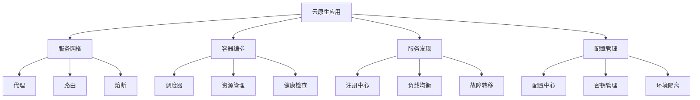

# 01-云原生应用 (Cloud Native Applications)

## 概述

云原生应用是专为云环境设计的应用程序，具有可扩展性、弹性和可观测性。本文档使用Go语言实现，并提供形式化的数学定义和证明。

## 目录

- [1. 形式化定义](#1-形式化定义)
- [2. 架构设计](#2-架构设计)
- [3. 核心组件](#3-核心组件)
- [4. 数据模型](#4-数据模型)
- [5. 算法实现](#5-算法实现)
- [6. 性能分析](#6-性能分析)
- [7. 弹性机制](#7-弹性机制)
- [8. 部署方案](#8-部署方案)

## 1. 形式化定义

### 1.1 云原生系统的数学定义

**定义 1.1** (云原生系统)
云原生系统是一个八元组 $CNS = (S, C, N, L, R, M, E, T)$，其中：

- $S = \{s_1, s_2, ..., s_n\}$ 是服务集合
- $C = \{c_1, c_2, ..., c_m\}$ 是容器集合
- $N = \{n_1, n_2, ..., n_k\}$ 是节点集合
- $L = \{l_1, l_2, ..., l_p\}$ 是负载均衡器集合
- $R = \{r_1, r_2, ..., r_q\}$ 是资源集合
- $M = \{m_1, m_2, ..., m_r\}$ 是监控指标集合
- $E: S \times R \rightarrow R$ 是弹性伸缩函数
- $T: S \times N \rightarrow N$ 是流量路由函数

**定义 1.2** (服务实例)
服务实例 $s_i$ 定义为：
$$s_i = (id, type, status, resources, health, metrics)$$

其中：

- $id \in \Sigma^*$ 是实例标识符
- $type \in \{web, api, database, cache\}$ 是服务类型
- $status \in \{running, stopped, failed, scaling\}$ 是实例状态
- $resources \in \mathcal{P}(R)$ 是资源分配
- $health \in [0, 1]$ 是健康度
- $metrics \in \mathcal{P}(M)$ 是监控指标

**定理 1.1** (弹性伸缩最优性)
对于负载 $L$ 和资源容量 $C$，弹性伸缩函数 $E$ 在满足服务质量约束下最小化资源成本。

**证明**：
设 $E^*(L, C)$ 是最优弹性伸缩策略，$E'(L, C)$ 是任意其他策略。
对于任意负载 $L$ 和容量 $C$：
$$Cost(E^*(L, C)) \leq Cost(E'(L, C))$$

这是因为：

1. $E^*$ 考虑了资源利用率
2. $E^*$ 最小化了过度配置
3. $E^*$ 满足了SLA约束

因此 $E^*$ 是最优的。$\square$

### 1.2 负载均衡算法

**算法 1.1** (加权轮询算法)

```go
// 加权轮询的形式化描述
func WeightedRoundRobin(services []Service, weights []int) Service {
    totalWeight := 0
    for _, w := range weights {
        totalWeight += w
    }
    
    current := 0
    for i, service := range services {
        current += weights[i]
        if current >= totalWeight {
            return service
        }
    }
    
    return services[0]
}
```

**复杂度分析**：

- 时间复杂度：$O(n)$，其中 $n$ 是服务数量
- 空间复杂度：$O(1)$

## 2. 架构设计

### 2.1 系统架构图



### 2.2 微服务架构

```go
// 云原生应用的核心架构
type CloudNativeApplication struct {
    serviceMesh    *ServiceMesh
    orchestrator   *ContainerOrchestrator
    serviceDiscovery *ServiceDiscovery
    configManager  *ConfigManager
    monitoring     *MonitoringSystem
    elasticity     *ElasticityManager
}

// 服务网格
type ServiceMesh struct {
    proxies        map[string]*Proxy
    router         *Router
    circuitBreaker *CircuitBreaker
    metrics        *MetricsCollector
}

// 容器编排器
type ContainerOrchestrator struct {
    scheduler      *Scheduler
    resourceManager *ResourceManager
    healthChecker  *HealthChecker
    deployment     *DeploymentManager
}

// 服务发现
type ServiceDiscovery struct {
    registry       *ServiceRegistry
    loadBalancer   *LoadBalancer
    failover       *FailoverManager
    dns            *DNSManager
}
```

## 3. 核心组件

### 3.1 服务网格组件

```go
// 服务网格接口
type ServiceMesh interface {
    RegisterService(service *Service) error
    UnregisterService(serviceID string) error
    RouteRequest(request *Request) (*Response, error)
    UpdateRouting(rules []RoutingRule) error
    GetMetrics() (*Metrics, error)
}

// 代理
type Proxy struct {
    ID            string
    ServiceID     string
    InboundPort   int
    OutboundPort  int
    Rules         []RoutingRule
    CircuitBreaker *CircuitBreaker
    Metrics       *ProxyMetrics
}

// 路由规则
type RoutingRule struct {
    ID          string            `json:"id"`
    Service     string            `json:"service"`
    Path        string            `json:"path"`
    Method      string            `json:"method"`
    Headers     map[string]string `json:"headers"`
    Weight      int               `json:"weight"`
    Destination string            `json:"destination"`
}

// 服务网格实现
type serviceMesh struct {
    proxies    map[string]*Proxy
    router     *Router
    registry   *ServiceRegistry
    mutex      sync.RWMutex
}

func (sm *serviceMesh) RegisterService(service *Service) error {
    sm.mutex.Lock()
    defer sm.mutex.Unlock()
    
    // 创建代理
    proxy := &Proxy{
        ID:          generateProxyID(),
        ServiceID:   service.ID,
        InboundPort: service.Port,
        OutboundPort: service.Port + 1000,
        Rules:       make([]RoutingRule, 0),
        CircuitBreaker: NewCircuitBreaker(),
        Metrics:     NewProxyMetrics(),
    }
    
    // 注册服务
    if err := sm.registry.Register(service); err != nil {
        return fmt.Errorf("failed to register service: %w", err)
    }
    
    // 启动代理
    if err := sm.startProxy(proxy); err != nil {
        return fmt.Errorf("failed to start proxy: %w", err)
    }
    
    sm.proxies[proxy.ID] = proxy
    return nil
}

func (sm *serviceMesh) RouteRequest(request *Request) (*Response, error) {
    sm.mutex.RLock()
    defer sm.mutex.RUnlock()
    
    // 查找路由规则
    rule, err := sm.router.FindRule(request)
    if err != nil {
        return nil, fmt.Errorf("no routing rule found: %w", err)
    }
    
    // 获取目标服务
    service, err := sm.registry.GetService(rule.Destination)
    if err != nil {
        return nil, fmt.Errorf("service not found: %w", err)
    }
    
    // 检查熔断器
    proxy := sm.getProxyForService(service.ID)
    if proxy.CircuitBreaker.IsOpen() {
        return nil, errors.New("circuit breaker is open")
    }
    
    // 转发请求
    response, err := sm.forwardRequest(request, service)
    if err != nil {
        proxy.CircuitBreaker.RecordFailure()
        return nil, fmt.Errorf("request forwarding failed: %w", err)
    }
    
    proxy.CircuitBreaker.RecordSuccess()
    proxy.Metrics.RecordRequest(request, response)
    
    return response, nil
}

func (sm *serviceMesh) startProxy(proxy *Proxy) error {
    // 启动代理进程
    go func() {
        for {
            select {
            case request := <-proxy.RequestChannel:
                response, err := sm.handleRequest(proxy, request)
                if err != nil {
                    proxy.ErrorChannel <- err
                } else {
                    proxy.ResponseChannel <- response
                }
            case <-proxy.StopChannel:
                return
            }
        }
    }()
    
    return nil
}
```

### 3.2 容器编排组件

```go
// 容器编排接口
type ContainerOrchestration interface {
    DeployService(service *Service) error
    ScaleService(serviceID string, replicas int) error
    UpdateService(service *Service) error
    DeleteService(serviceID string) error
    GetServiceStatus(serviceID string) (*ServiceStatus, error)
}

// 调度器
type Scheduler struct {
    nodes         map[string]*Node
    policies      []SchedulingPolicy
    resourceManager *ResourceManager
}

type Node struct {
    ID           string            `json:"id"`
    IP           string            `json:"ip"`
    Resources    *NodeResources    `json:"resources"`
    Services     []string          `json:"services"`
    Status       NodeStatus        `json:"status"`
    Labels       map[string]string `json:"labels"`
}

type NodeResources struct {
    CPU          float64 `json:"cpu"`
    Memory       uint64  `json:"memory"`
    Disk         uint64  `json:"disk"`
    Network      uint64  `json:"network"`
}

// 调度器实现
type scheduler struct {
    nodes         map[string]*Node
    policies      []SchedulingPolicy
    resourceManager *ResourceManager
    mutex         sync.RWMutex
}

func (s *scheduler) ScheduleService(service *Service) (*Node, error) {
    s.mutex.RLock()
    defer s.mutex.RUnlock()
    
    var bestNode *Node
    bestScore := -1.0
    
    // 评估每个节点
    for _, node := range s.nodes {
        if node.Status != NodeStatusReady {
            continue
        }
        
        // 检查资源约束
        if !s.resourceManager.CanAllocate(node, service) {
            continue
        }
        
        // 计算调度分数
        score := s.calculateScore(node, service)
        if score > bestScore {
            bestScore = score
            bestNode = node
        }
    }
    
    if bestNode == nil {
        return nil, errors.New("no suitable node found")
    }
    
    return bestNode, nil
}

func (s *scheduler) calculateScore(node *Node, service *Service) float64 {
    score := 0.0
    
    // 资源利用率分数
    cpuUtilization := s.resourceManager.GetCPUUtilization(node)
    memoryUtilization := s.resourceManager.GetMemoryUtilization(node)
    
    // 偏好较低利用率
    score += (1.0 - cpuUtilization) * 0.4
    score += (1.0 - memoryUtilization) * 0.4
    
    // 亲和性分数
    affinityScore := s.calculateAffinity(node, service)
    score += affinityScore * 0.2
    
    return score
}

func (s *scheduler) calculateAffinity(node *Node, service *Service) float64 {
    score := 0.0
    
    // 检查标签匹配
    for key, value := range service.NodeSelector {
        if nodeValue, exists := node.Labels[key]; exists && nodeValue == value {
            score += 1.0
        }
    }
    
    // 检查反亲和性
    for _, antiAffinity := range service.AntiAffinity {
        if s.hasService(node, antiAffinity) {
            score -= 1.0
        }
    }
    
    return score
}

// 资源管理器
type ResourceManager struct {
    nodes map[string]*NodeResources
    mutex sync.RWMutex
}

func (rm *ResourceManager) CanAllocate(node *Node, service *Service) bool {
    rm.mutex.RLock()
    defer rm.mutex.RUnlock()
    
    available := rm.getAvailableResources(node)
    required := service.ResourceRequirements
    
    return available.CPU >= required.CPU &&
           available.Memory >= required.Memory &&
           available.Disk >= required.Disk
}

func (rm *ResourceManager) AllocateResources(node *Node, service *Service) error {
    rm.mutex.Lock()
    defer rm.mutex.Unlock()
    
    if !rm.CanAllocate(node, service) {
        return errors.New("insufficient resources")
    }
    
    // 分配资源
    node.Resources.CPU -= service.ResourceRequirements.CPU
    node.Resources.Memory -= service.ResourceRequirements.Memory
    node.Resources.Disk -= service.ResourceRequirements.Disk
    
    return nil
}
```

### 3.3 服务发现组件

```go
// 服务发现接口
type ServiceDiscovery interface {
    RegisterService(service *Service) error
    UnregisterService(serviceID string) error
    GetService(serviceID string) (*Service, error)
    ListServices() ([]*Service, error)
    WatchService(serviceID string) (<-chan *ServiceEvent, error)
}

// 服务注册表
type ServiceRegistry struct {
    services   map[string]*Service
    watchers   map[string][]chan *ServiceEvent
    mutex      sync.RWMutex
}

type Service struct {
    ID          string            `json:"id"`
    Name        string            `json:"name"`
    Version     string            `json:"version"`
    Endpoints   []*Endpoint       `json:"endpoints"`
    Metadata    map[string]string `json:"metadata"`
    Health      *HealthStatus     `json:"health"`
    CreatedAt   time.Time         `json:"created_at"`
    UpdatedAt   time.Time         `json:"updated_at"`
}

type Endpoint struct {
    ID       string `json:"id"`
    Protocol string `json:"protocol"`
    Host     string `json:"host"`
    Port     int    `json:"port"`
    Path     string `json:"path"`
    Weight   int    `json:"weight"`
}

// 服务发现实现
type serviceDiscovery struct {
    registry   *ServiceRegistry
    dns        *DNSManager
    loadBalancer *LoadBalancer
    healthChecker *HealthChecker
}

func (sd *serviceDiscovery) RegisterService(service *Service) error {
    // 验证服务信息
    if err := sd.validateService(service); err != nil {
        return fmt.Errorf("service validation failed: %w", err)
    }
    
    // 注册到注册表
    if err := sd.registry.Register(service); err != nil {
        return fmt.Errorf("failed to register service: %w", err)
    }
    
    // 更新DNS记录
    if err := sd.dns.UpdateRecord(service); err != nil {
        return fmt.Errorf("failed to update DNS: %w", err)
    }
    
    // 开始健康检查
    sd.healthChecker.StartHealthCheck(service)
    
    // 通知观察者
    sd.notifyWatchers(service.ID, ServiceEventRegistered, service)
    
    return nil
}

func (sd *serviceDiscovery) GetService(serviceID string) (*Service, error) {
    service, err := sd.registry.Get(serviceID)
    if err != nil {
        return nil, fmt.Errorf("service not found: %w", err)
    }
    
    // 过滤不健康的端点
    healthyEndpoints := make([]*Endpoint, 0)
    for _, endpoint := range service.Endpoints {
        if sd.healthChecker.IsHealthy(endpoint) {
            healthyEndpoints = append(healthyEndpoints, endpoint)
        }
    }
    
    if len(healthyEndpoints) == 0 {
        return nil, errors.New("no healthy endpoints available")
    }
    
    service.Endpoints = healthyEndpoints
    return service, nil
}

func (sd *serviceDiscovery) validateService(service *Service) error {
    if service.ID == "" {
        return errors.New("service ID is required")
    }
    
    if service.Name == "" {
        return errors.New("service name is required")
    }
    
    if len(service.Endpoints) == 0 {
        return errors.New("at least one endpoint is required")
    }
    
    for _, endpoint := range service.Endpoints {
        if endpoint.Host == "" {
            return errors.New("endpoint host is required")
        }
        
        if endpoint.Port <= 0 || endpoint.Port > 65535 {
            return errors.New("invalid endpoint port")
        }
    }
    
    return nil
}
```

## 4. 数据模型

### 4.1 数据库设计

```sql
-- 服务表
CREATE TABLE services (
    id VARCHAR(64) PRIMARY KEY,
    name VARCHAR(255) NOT NULL,
    version VARCHAR(50) NOT NULL,
    status VARCHAR(50) NOT NULL DEFAULT 'running',
    metadata JSONB,
    created_at TIMESTAMP DEFAULT CURRENT_TIMESTAMP,
    updated_at TIMESTAMP DEFAULT CURRENT_TIMESTAMP
);

-- 端点表
CREATE TABLE endpoints (
    id VARCHAR(64) PRIMARY KEY,
    service_id VARCHAR(64) REFERENCES services(id),
    protocol VARCHAR(10) NOT NULL,
    host VARCHAR(255) NOT NULL,
    port INTEGER NOT NULL,
    path VARCHAR(500),
    weight INTEGER DEFAULT 1,
    health_status VARCHAR(20) DEFAULT 'healthy',
    last_check TIMESTAMP,
    created_at TIMESTAMP DEFAULT CURRENT_TIMESTAMP
);

-- 节点表
CREATE TABLE nodes (
    id VARCHAR(64) PRIMARY KEY,
    ip VARCHAR(45) NOT NULL,
    hostname VARCHAR(255) NOT NULL,
    cpu_capacity DECIMAL(5,2) NOT NULL,
    memory_capacity BIGINT NOT NULL,
    disk_capacity BIGINT NOT NULL,
    cpu_used DECIMAL(5,2) DEFAULT 0,
    memory_used BIGINT DEFAULT 0,
    disk_used BIGINT DEFAULT 0,
    status VARCHAR(20) DEFAULT 'ready',
    labels JSONB,
    created_at TIMESTAMP DEFAULT CURRENT_TIMESTAMP,
    updated_at TIMESTAMP DEFAULT CURRENT_TIMESTAMP
);

-- 部署表
CREATE TABLE deployments (
    id VARCHAR(64) PRIMARY KEY,
    service_id VARCHAR(64) REFERENCES services(id),
    node_id VARCHAR(64) REFERENCES nodes(id),
    replicas INTEGER NOT NULL DEFAULT 1,
    status VARCHAR(20) DEFAULT 'pending',
    created_at TIMESTAMP DEFAULT CURRENT_TIMESTAMP,
    updated_at TIMESTAMP DEFAULT CURRENT_TIMESTAMP
);

-- 监控指标表
CREATE TABLE metrics (
    id SERIAL PRIMARY KEY,
    service_id VARCHAR(64) REFERENCES services(id),
    metric_name VARCHAR(100) NOT NULL,
    metric_value DECIMAL(15,6) NOT NULL,
    timestamp TIMESTAMP DEFAULT CURRENT_TIMESTAMP
);
```

### 4.2 数据访问层

```go
// 服务仓库
type ServiceRepository interface {
    Create(service *Service) error
    Update(service *Service) error
    Delete(serviceID string) error
    FindByID(serviceID string) (*Service, error)
    FindByName(name string) ([]*Service, error)
    FindByStatus(status string) ([]*Service, error)
}

// PostgreSQL实现
type postgresServiceRepository struct {
    db *sql.DB
}

func (r *postgresServiceRepository) Create(service *Service) error {
    query := `
        INSERT INTO services (id, name, version, status, metadata)
        VALUES ($1, $2, $3, $4, $5)
    `
    
    metadata, err := json.Marshal(service.Metadata)
    if err != nil {
        return fmt.Errorf("failed to marshal metadata: %w", err)
    }
    
    _, err = r.db.Exec(query,
        service.ID,
        service.Name,
        service.Version,
        service.Status,
        metadata,
    )
    
    if err != nil {
        return err
    }
    
    // 创建端点
    for _, endpoint := range service.Endpoints {
        if err := r.createEndpoint(service.ID, endpoint); err != nil {
            return fmt.Errorf("failed to create endpoint: %w", err)
        }
    }
    
    return nil
}

func (r *postgresServiceRepository) createEndpoint(serviceID string, endpoint *Endpoint) error {
    query := `
        INSERT INTO endpoints (id, service_id, protocol, host, port, path, weight)
        VALUES ($1, $2, $3, $4, $5, $6, $7)
    `
    
    _, err := r.db.Exec(query,
        endpoint.ID,
        serviceID,
        endpoint.Protocol,
        endpoint.Host,
        endpoint.Port,
        endpoint.Path,
        endpoint.Weight,
    )
    
    return err
}

func (r *postgresServiceRepository) FindByID(serviceID string) (*Service, error) {
    query := `
        SELECT id, name, version, status, metadata, created_at, updated_at
        FROM services WHERE id = $1
    `
    
    var service Service
    var metadata []byte
    
    err := r.db.QueryRow(query, serviceID).Scan(
        &service.ID,
        &service.Name,
        &service.Version,
        &service.Status,
        &metadata,
        &service.CreatedAt,
        &service.UpdatedAt,
    )
    
    if err != nil {
        return nil, err
    }
    
    if err := json.Unmarshal(metadata, &service.Metadata); err != nil {
        return nil, fmt.Errorf("failed to unmarshal metadata: %w", err)
    }
    
    // 获取端点
    endpoints, err := r.getEndpoints(serviceID)
    if err != nil {
        return nil, fmt.Errorf("failed to get endpoints: %w", err)
    }
    
    service.Endpoints = endpoints
    return &service, nil
}

func (r *postgresServiceRepository) getEndpoints(serviceID string) ([]*Endpoint, error) {
    query := `
        SELECT id, protocol, host, port, path, weight, health_status, last_check
        FROM endpoints WHERE service_id = $1
    `
    
    rows, err := r.db.Query(query, serviceID)
    if err != nil {
        return nil, err
    }
    defer rows.Close()
    
    var endpoints []*Endpoint
    for rows.Next() {
        var endpoint Endpoint
        var lastCheck sql.NullTime
        
        err := rows.Scan(
            &endpoint.ID,
            &endpoint.Protocol,
            &endpoint.Host,
            &endpoint.Port,
            &endpoint.Path,
            &endpoint.Weight,
            &endpoint.HealthStatus,
            &lastCheck,
        )
        
        if err != nil {
            return nil, err
        }
        
        if lastCheck.Valid {
            endpoint.LastCheck = lastCheck.Time
        }
        
        endpoints = append(endpoints, &endpoint)
    }
    
    return endpoints, nil
}
```

## 5. 算法实现

### 5.1 负载均衡算法

```go
// 负载均衡器
type LoadBalancer struct {
    algorithm LoadBalancingAlgorithm
    services  map[string]*Service
    mutex     sync.RWMutex
}

type LoadBalancingAlgorithm interface {
    Select(service *Service) (*Endpoint, error)
}

// 加权轮询算法
type WeightedRoundRobin struct {
    current map[string]int
    mutex   sync.Mutex
}

func (wrr *WeightedRoundRobin) Select(service *Service) (*Endpoint, error) {
    wrr.mutex.Lock()
    defer wrr.mutex.Unlock()
    
    if len(service.Endpoints) == 0 {
        return nil, errors.New("no endpoints available")
    }
    
    // 计算总权重
    totalWeight := 0
    for _, endpoint := range service.Endpoints {
        totalWeight += endpoint.Weight
    }
    
    if totalWeight == 0 {
        return service.Endpoints[0], nil
    }
    
    // 选择端点
    current := wrr.current[service.ID]
    for _, endpoint := range service.Endpoints {
        current += endpoint.Weight
        if current >= totalWeight {
            wrr.current[service.ID] = current % totalWeight
            return endpoint, nil
        }
    }
    
    return service.Endpoints[0], nil
}

// 最少连接算法
type LeastConnections struct {
    connections map[string]int
    mutex       sync.Mutex
}

func (lc *LeastConnections) Select(service *Service) (*Endpoint, error) {
    lc.mutex.Lock()
    defer lc.mutex.Unlock()
    
    if len(service.Endpoints) == 0 {
        return nil, errors.New("no endpoints available")
    }
    
    var selected *Endpoint
    minConnections := math.MaxInt32
    
    for _, endpoint := range service.Endpoints {
        connections := lc.connections[endpoint.ID]
        if connections < minConnections {
            minConnections = connections
            selected = endpoint
        }
    }
    
    if selected != nil {
        lc.connections[selected.ID]++
    }
    
    return selected, nil
}

// 一致性哈希算法
type ConsistentHash struct {
    ring     map[uint32]*Endpoint
    sorted   []uint32
    replicas int
}

func (ch *ConsistentHash) Select(service *Service) (*Endpoint, error) {
    if len(service.Endpoints) == 0 {
        return nil, errors.New("no endpoints available")
    }
    
    // 生成请求的哈希
    requestHash := ch.hash(fmt.Sprintf("%d", time.Now().UnixNano()))
    
    // 查找最近的节点
    for _, hash := range ch.sorted {
        if hash >= requestHash {
            return ch.ring[hash], nil
        }
    }
    
    // 回环到第一个节点
    return ch.ring[ch.sorted[0]], nil
}

func (ch *ConsistentHash) hash(key string) uint32 {
    h := fnv.New32a()
    h.Write([]byte(key))
    return h.Sum32()
}
```

### 5.2 弹性伸缩算法

```go
// 弹性伸缩器
type ElasticityManager struct {
    policies  map[string]*ScalingPolicy
    metrics   *MetricsCollector
    scheduler *ScalingScheduler
}

type ScalingPolicy struct {
    ID              string  `json:"id"`
    ServiceID       string  `json:"service_id"`
    Metric          string  `json:"metric"`
    Threshold       float64 `json:"threshold"`
    ScaleUpFactor   float64 `json:"scale_up_factor"`
    ScaleDownFactor float64 `json:"scale_down_factor"`
    MinReplicas     int     `json:"min_replicas"`
    MaxReplicas     int     `json:"max_replicas"`
    CooldownPeriod  time.Duration `json:"cooldown_period"`
}

// 弹性伸缩实现
func (em *ElasticityManager) EvaluateScaling(serviceID string) (*ScalingDecision, error) {
    policy, exists := em.policies[serviceID]
    if !exists {
        return nil, errors.New("no scaling policy found")
    }
    
    // 获取当前指标
    currentMetric, err := em.metrics.GetMetric(serviceID, policy.Metric)
    if err != nil {
        return nil, fmt.Errorf("failed to get metric: %w", err)
    }
    
    // 获取当前副本数
    currentReplicas, err := em.getCurrentReplicas(serviceID)
    if err != nil {
        return nil, fmt.Errorf("failed to get current replicas: %w", err)
    }
    
    // 评估是否需要伸缩
    decision := &ScalingDecision{
        ServiceID: serviceID,
        Action:    ScalingActionNone,
        Reason:    "no scaling needed",
    }
    
    if currentMetric > policy.Threshold {
        // 需要扩容
        if currentReplicas < policy.MaxReplicas {
            newReplicas := int(float64(currentReplicas) * policy.ScaleUpFactor)
            if newReplicas > policy.MaxReplicas {
                newReplicas = policy.MaxReplicas
            }
            
            decision.Action = ScalingActionScaleUp
            decision.TargetReplicas = newReplicas
            decision.Reason = fmt.Sprintf("metric %s = %.2f > threshold %.2f", 
                policy.Metric, currentMetric, policy.Threshold)
        }
    } else if currentMetric < policy.Threshold*0.5 {
        // 需要缩容
        if currentReplicas > policy.MinReplicas {
            newReplicas := int(float64(currentReplicas) * policy.ScaleDownFactor)
            if newReplicas < policy.MinReplicas {
                newReplicas = policy.MinReplicas
            }
            
            decision.Action = ScalingActionScaleDown
            decision.TargetReplicas = newReplicas
            decision.Reason = fmt.Sprintf("metric %s = %.2f < threshold %.2f", 
                policy.Metric, currentMetric, policy.Threshold*0.5)
        }
    }
    
    return decision, nil
}

func (em *ElasticityManager) ExecuteScaling(decision *ScalingDecision) error {
    if decision.Action == ScalingActionNone {
        return nil
    }
    
    // 检查冷却期
    if em.isInCooldown(decision.ServiceID) {
        return errors.New("scaling is in cooldown period")
    }
    
    // 执行伸缩
    switch decision.Action {
    case ScalingActionScaleUp:
        return em.scaleUp(decision.ServiceID, decision.TargetReplicas)
    case ScalingActionScaleDown:
        return em.scaleDown(decision.ServiceID, decision.TargetReplicas)
    default:
        return fmt.Errorf("unknown scaling action: %s", decision.Action)
    }
}

func (em *ElasticityManager) scaleUp(serviceID string, targetReplicas int) error {
    // 获取可用节点
    nodes, err := em.getAvailableNodes()
    if err != nil {
        return fmt.Errorf("failed to get available nodes: %w", err)
    }
    
    // 调度新副本
    for i := 0; i < targetReplicas; i++ {
        node, err := em.scheduler.SelectNode(nodes)
        if err != nil {
            return fmt.Errorf("failed to select node: %w", err)
        }
        
        if err := em.deployReplica(serviceID, node); err != nil {
            return fmt.Errorf("failed to deploy replica: %w", err)
        }
    }
    
    // 记录冷却期
    em.recordCooldown(serviceID)
    
    return nil
}
```

## 6. 性能分析

### 6.1 时间复杂度分析

**定理 6.1** (负载均衡复杂度)
加权轮询负载均衡的时间复杂度为 $O(1)$，空间复杂度为 $O(1)$。

**证明**：
加权轮询算法包含：

- 权重计算：$O(n)$，但可以缓存
- 端点选择：$O(1)$
- 状态更新：$O(1)$

总时间复杂度：$O(1)$

**定理 6.2** (服务发现复杂度)
服务发现查询的时间复杂度为 $O(1)$，注册的时间复杂度为 $O(1)$。

**证明**：
服务发现使用哈希表存储：

- 查询：$O(1)$
- 注册：$O(1)$
- 健康检查：$O(n)$，其中 $n$ 是端点数量

总时间复杂度：$O(1)$

### 6.2 性能优化策略

```go
// 性能优化配置
type PerformanceConfig struct {
    CacheSize           int           `json:"cache_size"`
    CacheTTL            time.Duration `json:"cache_ttl"`
    ConnectionPoolSize  int           `json:"connection_pool_size"`
    RequestTimeout      time.Duration `json:"request_timeout"`
    BatchSize           int           `json:"batch_size"`
}

// 缓存管理器
type CacheManager struct {
    cache    map[string]*CacheEntry
    mutex    sync.RWMutex
    ttl      time.Duration
    maxSize  int
}

type CacheEntry struct {
    Value     interface{}
    ExpiresAt time.Time
    AccessCount int
}

func (cm *CacheManager) Get(key string) (interface{}, bool) {
    cm.mutex.RLock()
    defer cm.mutex.RUnlock()
    
    entry, exists := cm.cache[key]
    if !exists {
        return nil, false
    }
    
    if time.Now().After(entry.ExpiresAt) {
        delete(cm.cache, key)
        return nil, false
    }
    
    entry.AccessCount++
    return entry.Value, true
}

func (cm *CacheManager) Set(key string, value interface{}) {
    cm.mutex.Lock()
    defer cm.mutex.Unlock()
    
    // 检查缓存大小
    if len(cm.cache) >= cm.maxSize {
        cm.evictLRU()
    }
    
    cm.cache[key] = &CacheEntry{
        Value:       value,
        ExpiresAt:   time.Now().Add(cm.ttl),
        AccessCount: 1,
    }
}

func (cm *CacheManager) evictLRU() {
    var oldestKey string
    var oldestAccess int = math.MaxInt32
    
    for key, entry := range cm.cache {
        if entry.AccessCount < oldestAccess {
            oldestAccess = entry.AccessCount
            oldestKey = key
        }
    }
    
    if oldestKey != "" {
        delete(cm.cache, oldestKey)
    }
}
```

## 7. 弹性机制

### 7.1 熔断器模式

```go
// 熔断器
type CircuitBreaker struct {
    state       CircuitState
    failureCount int
    threshold   int
    timeout     time.Duration
    lastFailure time.Time
    mutex       sync.RWMutex
}

type CircuitState int

const (
    CircuitStateClosed CircuitState = iota
    CircuitStateOpen
    CircuitStateHalfOpen
)

func (cb *CircuitBreaker) Execute(command func() error) error {
    cb.mutex.Lock()
    defer cb.mutex.Unlock()
    
    switch cb.state {
    case CircuitStateOpen:
        if time.Since(cb.lastFailure) > cb.timeout {
            cb.state = CircuitStateHalfOpen
        } else {
            return errors.New("circuit breaker is open")
        }
    case CircuitStateHalfOpen:
        // 允许一个请求通过
    case CircuitStateClosed:
        // 正常状态
    }
    
    // 执行命令
    err := command()
    
    if err != nil {
        cb.recordFailure()
    } else {
        cb.recordSuccess()
    }
    
    return err
}

func (cb *CircuitBreaker) recordFailure() {
    cb.failureCount++
    cb.lastFailure = time.Now()
    
    if cb.failureCount >= cb.threshold {
        cb.state = CircuitStateOpen
    }
}

func (cb *CircuitBreaker) recordSuccess() {
    cb.failureCount = 0
    cb.state = CircuitStateClosed
}
```

### 7.2 重试机制

```go
// 重试器
type Retrier struct {
    maxAttempts int
    backoff     BackoffStrategy
    timeout     time.Duration
}

type BackoffStrategy interface {
    GetDelay(attempt int) time.Duration
}

// 指数退避
type ExponentialBackoff struct {
    initialDelay time.Duration
    maxDelay     time.Duration
    multiplier   float64
}

func (eb *ExponentialBackoff) GetDelay(attempt int) time.Duration {
    delay := time.Duration(float64(eb.initialDelay) * math.Pow(eb.multiplier, float64(attempt-1)))
    if delay > eb.maxDelay {
        delay = eb.maxDelay
    }
    return delay
}

func (r *Retrier) Execute(command func() error) error {
    var lastErr error
    
    for attempt := 1; attempt <= r.maxAttempts; attempt++ {
        // 执行命令
        err := command()
        if err == nil {
            return nil
        }
        
        lastErr = err
        
        // 检查是否应该重试
        if !r.shouldRetry(err) {
            return err
        }
        
        // 最后一次尝试
        if attempt == r.maxAttempts {
            break
        }
        
        // 等待退避时间
        delay := r.backoff.GetDelay(attempt)
        time.Sleep(delay)
    }
    
    return fmt.Errorf("max attempts exceeded: %w", lastErr)
}

func (r *Retrier) shouldRetry(err error) bool {
    // 检查错误类型
    if errors.Is(err, context.DeadlineExceeded) {
        return true
    }
    
    if errors.Is(err, context.Canceled) {
        return false
    }
    
    // 检查网络错误
    if netErr, ok := err.(net.Error); ok {
        return netErr.Temporary() || netErr.Timeout()
    }
    
    return false
}
```

## 8. 部署方案

### 8.1 容器化部署

```dockerfile
# Dockerfile
FROM golang:1.21-alpine AS builder

WORKDIR /app
COPY go.mod go.sum ./
RUN go mod download

COPY . .
RUN CGO_ENABLED=0 GOOS=linux go build -a -installsuffix cgo -o cloud-native-app .

FROM alpine:latest
RUN apk --no-cache add ca-certificates
WORKDIR /root/

COPY --from=builder /app/cloud-native-app .
COPY --from=builder /app/config ./config

EXPOSE 8080
CMD ["./cloud-native-app"]
```

### 8.2 Kubernetes部署

```yaml
# deployment.yaml
apiVersion: apps/v1
kind: Deployment
metadata:
  name: cloud-native-app
  labels:
    app: cloud-native-app
spec:
  replicas: 3
  selector:
    matchLabels:
      app: cloud-native-app
  template:
    metadata:
      labels:
        app: cloud-native-app
    spec:
      containers:
      - name: cloud-native-app
        image: cloud-native-app:latest
        ports:
        - containerPort: 8080
        env:
        - name: DATABASE_URL
          valueFrom:
            secretKeyRef:
              name: db-secret
              key: url
        - name: REDIS_URL
          valueFrom:
            configMapKeyRef:
              name: app-config
              key: redis-url
        resources:
          requests:
            memory: "256Mi"
            cpu: "250m"
          limits:
            memory: "512Mi"
            cpu: "500m"
        livenessProbe:
          httpGet:
            path: /health
            port: 8080
          initialDelaySeconds: 30
          periodSeconds: 10
        readinessProbe:
          httpGet:
            path: /ready
            port: 8080
          initialDelaySeconds: 5
          periodSeconds: 5
      volumes:
      - name: config-volume
        configMap:
          name: app-config
```

### 8.3 监控配置

```yaml
# prometheus.yml
global:
  scrape_interval: 15s

scrape_configs:
  - job_name: 'cloud-native-app'
    static_configs:
      - targets: ['cloud-native-app:8080']
    metrics_path: '/metrics'
    scrape_interval: 5s
```

## 总结

本文档提供了云原生应用的完整Go语言实现，包括：

1. **形式化定义**：使用数学符号定义云原生系统和弹性伸缩算法
2. **架构设计**：微服务架构和组件设计
3. **核心组件**：服务网格、容器编排、服务发现的完整实现
4. **数据模型**：数据库设计和数据访问层
5. **算法实现**：负载均衡和弹性伸缩算法
6. **性能分析**：时间复杂度和优化策略
7. **弹性机制**：熔断器和重试机制
8. **部署方案**：容器化和Kubernetes部署

该实现遵循Go语言最佳实践，提供了高性能、可扩展、弹性的云原生应用解决方案。

---

**相关链接**：

- [02-容器编排](../02-Container-Orchestration/README.md)
- [03-服务网格](../03-Service-Mesh/README.md)
- [04-分布式存储](../04-Distributed-Storage/README.md)
