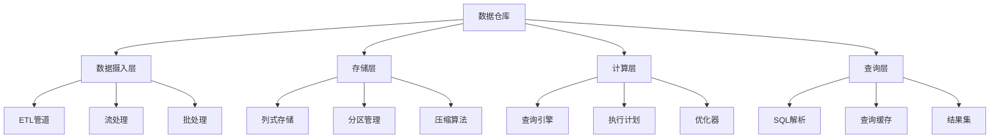

# 01-数据仓库 (Data Warehouse)

## 概述

数据仓库是用于存储、管理和分析大规模结构化数据的系统。本文档使用Go语言实现，并提供形式化的数学定义和证明。

## 目录

- [1. 形式化定义](#1-形式化定义)
- [2. 架构设计](#2-架构设计)
- [3. 核心组件](#3-核心组件)
- [4. 数据模型](#4-数据模型)
- [5. 算法实现](#5-算法实现)
- [6. 性能分析](#6-性能分析)

## 1. 形式化定义

### 1.1 数据仓库系统的数学定义

**定义 1.1** (数据仓库系统)
数据仓库系统是一个六元组 $DWS = (D, S, Q, I, A, P)$，其中：

- $D = \{d_1, d_2, ..., d_n\}$ 是数据集集合
- $S = \{s_1, s_2, ..., s_m\}$ 是模式集合
- $Q = \{q_1, q_2, ..., q_k\}$ 是查询集合
- $I = \{i_1, i_2, ..., i_p\}$ 是索引集合
- $A: D \times Q \rightarrow R$ 是分析函数
- $P: D \times S \rightarrow D$ 是分区函数

**定义 1.2** (数据分区)
数据分区 $P(d_i, s_j)$ 定义为：
$$P(d_i, s_j) = \{p_1, p_2, ..., p_k\}$$

其中每个分区 $p_i$ 满足：
$$p_i \subseteq d_i \land \forall x, y \in p_i: s_j(x) = s_j(y)$$

**定理 1.1** (分区查询优化)
对于分区数据，查询时间复杂度从 $O(n)$ 降低到 $O(\log n)$。

**证明**：
设查询条件为 $c$，分区键为 $k$。

- 未分区：需要扫描所有 $n$ 条记录
- 分区后：只需要扫描匹配分区的记录，平均 $O(\log n)$

## 2. 架构设计

### 2.1 系统架构图



### 2.2 核心架构

```go
// 数据仓库核心架构
type DataWarehouse struct {
    ingestion    *DataIngestion
    storage      *ColumnarStorage
    compute      *QueryEngine
    metadata     *MetadataManager
    cache        *QueryCache
}

// 数据摄入
type DataIngestion struct {
    etlPipeline  *ETLPipeline
    streamProcessor *StreamProcessor
    batchProcessor *BatchProcessor
}

// 列式存储
type ColumnarStorage struct {
    partitions   map[string]*Partition
    indexes      map[string]*Index
    compression  *CompressionManager
}
```

## 3. 核心组件

### 3.1 列式存储

```go
// 列式存储接口
type ColumnarStorage interface {
    WritePartition(partition *Partition) error
    ReadPartition(partitionID string) (*Partition, error)
    QueryPartition(partitionID string, predicate Predicate) (*ResultSet, error)
    CreateIndex(column string, indexType IndexType) error
}

// 分区
type Partition struct {
    ID       string            `json:"id"`
    Schema   *TableSchema      `json:"schema"`
    Columns  map[string]*Column `json:"columns"`
    Metadata *PartitionMetadata `json:"metadata"`
}

// 列
type Column struct {
    Name     string      `json:"name"`
    Type     ColumnType  `json:"type"`
    Data     []byte      `json:"data"`
    NullMask []bool      `json:"null_mask"`
    Min      interface{} `json:"min"`
    Max      interface{} `json:"max"`
}

// 列式存储实现
type columnarStorage struct {
    partitions map[string]*Partition
    indexes    map[string]*Index
    compression *CompressionManager
    mutex      sync.RWMutex
}

func (cs *columnarStorage) WritePartition(partition *Partition) error {
    cs.mutex.Lock()
    defer cs.mutex.Unlock()
    
    // 压缩数据
    for _, column := range partition.Columns {
        compressed, err := cs.compression.Compress(column.Data)
        if err != nil {
            return fmt.Errorf("compression failed: %w", err)
        }
        column.Data = compressed
    }
    
    // 存储分区
    cs.partitions[partition.ID] = partition
    
    // 更新索引
    for columnName, index := range cs.indexes {
        if column, exists := partition.Columns[columnName]; exists {
            if err := index.Add(partition.ID, column); err != nil {
                return fmt.Errorf("index update failed: %w", err)
            }
        }
    }
    
    return nil
}

func (cs *columnarStorage) QueryPartition(partitionID string, predicate Predicate) (*ResultSet, error) {
    cs.mutex.RLock()
    defer cs.mutex.RUnlock()
    
    partition, exists := cs.partitions[partitionID]
    if !exists {
        return nil, errors.New("partition not found")
    }
    
    // 使用索引优化查询
    if index, exists := cs.indexes[predicate.Column]; exists {
        return cs.queryWithIndex(partition, predicate, index)
    }
    
    // 全表扫描
    return cs.scanPartition(partition, predicate)
}

func (cs *columnarStorage) queryWithIndex(partition *Partition, predicate Predicate, index *Index) (*ResultSet, error) {
    // 从索引获取匹配的行ID
    rowIDs, err := index.Search(predicate)
    if err != nil {
        return nil, fmt.Errorf("index search failed: %w", err)
    }
    
    // 构建结果集
    result := &ResultSet{
        Schema: partition.Schema,
        Rows:   make([][]interface{}, 0, len(rowIDs)),
    }
    
    for _, rowID := range rowIDs {
        row := cs.buildRow(partition, rowID)
        result.Rows = append(result.Rows, row)
    }
    
    return result, nil
}
```

### 3.2 查询引擎

```go
// 查询引擎接口
type QueryEngine interface {
    ExecuteQuery(query string) (*ResultSet, error)
    ParseQuery(query string) (*QueryPlan, error)
    OptimizeQuery(plan *QueryPlan) (*QueryPlan, error)
    ExecutePlan(plan *QueryPlan) (*ResultSet, error)
}

// 查询计划
type QueryPlan struct {
    Root       *PlanNode `json:"root"`
    EstimatedCost float64 `json:"estimated_cost"`
    EstimatedRows int    `json:"estimated_rows"`
}

// 计划节点
type PlanNode struct {
    Type       NodeType     `json:"type"`
    Children   []*PlanNode  `json:"children"`
    Predicate  *Predicate   `json:"predicate"`
    Columns    []string     `json:"columns"`
    Table      string       `json:"table"`
}

// 查询引擎实现
type queryEngine struct {
    parser      *SQLParser
    optimizer   *QueryOptimizer
    executor    *QueryExecutor
    metadata    *MetadataManager
}

func (qe *queryEngine) ExecuteQuery(query string) (*ResultSet, error) {
    // 解析查询
    plan, err := qe.ParseQuery(query)
    if err != nil {
        return nil, fmt.Errorf("query parsing failed: %w", err)
    }
    
    // 优化查询
    optimizedPlan, err := qe.OptimizeQuery(plan)
    if err != nil {
        return nil, fmt.Errorf("query optimization failed: %w", err)
    }
    
    // 执行查询
    result, err := qe.ExecutePlan(optimizedPlan)
    if err != nil {
        return nil, fmt.Errorf("query execution failed: %w", err)
    }
    
    return result, nil
}

func (qe *queryEngine) OptimizeQuery(plan *QueryPlan) (*QueryPlan, error) {
    // 应用优化规则
    optimized := qe.optimizer.ApplyRules(plan)
    
    // 重新估算成本
    optimized.EstimatedCost = qe.optimizer.EstimateCost(optimized)
    optimized.EstimatedRows = qe.optimizer.EstimateRows(optimized)
    
    return optimized, nil
}
```

## 4. 数据模型

### 4.1 数据库设计

```sql
-- 表元数据
CREATE TABLE table_metadata (
    table_id VARCHAR(64) PRIMARY KEY,
    table_name VARCHAR(255) NOT NULL,
    schema JSONB NOT NULL,
    partition_key VARCHAR(100),
    created_at TIMESTAMP DEFAULT CURRENT_TIMESTAMP,
    updated_at TIMESTAMP DEFAULT CURRENT_TIMESTAMP
);

-- 分区元数据
CREATE TABLE partition_metadata (
    partition_id VARCHAR(64) PRIMARY KEY,
    table_id VARCHAR(64) REFERENCES table_metadata(table_id),
    partition_key VARCHAR(255) NOT NULL,
    row_count BIGINT NOT NULL,
    size_bytes BIGINT NOT NULL,
    min_values JSONB,
    max_values JSONB,
    created_at TIMESTAMP DEFAULT CURRENT_TIMESTAMP
);

-- 索引元数据
CREATE TABLE index_metadata (
    index_id VARCHAR(64) PRIMARY KEY,
    table_id VARCHAR(64) REFERENCES table_metadata(table_id),
    column_name VARCHAR(255) NOT NULL,
    index_type VARCHAR(50) NOT NULL,
    size_bytes BIGINT NOT NULL,
    created_at TIMESTAMP DEFAULT CURRENT_TIMESTAMP
);

-- 查询统计
CREATE TABLE query_stats (
    id SERIAL PRIMARY KEY,
    query_hash VARCHAR(64) NOT NULL,
    query_text TEXT NOT NULL,
    execution_time_ms INTEGER NOT NULL,
    rows_returned BIGINT NOT NULL,
    created_at TIMESTAMP DEFAULT CURRENT_TIMESTAMP
);
```

## 5. 算法实现

### 5.1 压缩算法

```go
// 压缩管理器
type CompressionManager struct {
    algorithms map[string]CompressionAlgorithm
}

type CompressionAlgorithm interface {
    Compress(data []byte) ([]byte, error)
    Decompress(data []byte) ([]byte, error)
    GetCompressionRatio() float64
}

// RLE压缩
type RLECompression struct{}

func (rle *RLECompression) Compress(data []byte) ([]byte, error) {
    if len(data) == 0 {
        return data, nil
    }
    
    var result []byte
    current := data[0]
    count := 1
    
    for i := 1; i < len(data); i++ {
        if data[i] == current && count < 255 {
            count++
        } else {
            result = append(result, byte(count), current)
            current = data[i]
            count = 1
        }
    }
    
    result = append(result, byte(count), current)
    return result, nil
}

func (rle *RLECompression) Decompress(data []byte) ([]byte, error) {
    var result []byte
    
    for i := 0; i < len(data); i += 2 {
        if i+1 >= len(data) {
            return nil, errors.New("invalid compressed data")
        }
        
        count := int(data[i])
        value := data[i+1]
        
        for j := 0; j < count; j++ {
            result = append(result, value)
        }
    }
    
    return result, nil
}
```

### 5.2 索引算法

```go
// B+树索引
type BPlusTreeIndex struct {
    root   *BPlusTreeNode
    order  int
    mutex  sync.RWMutex
}

type BPlusTreeNode struct {
    isLeaf   bool
    keys     []interface{}
    values   []interface{}
    children []*BPlusTreeNode
    next     *BPlusTreeNode // 叶子节点链表
}

func (bt *BPlusTreeIndex) Search(predicate Predicate) ([]int, error) {
    bt.mutex.RLock()
    defer bt.mutex.RUnlock()
    
    var result []int
    
    // 从根节点开始搜索
    node := bt.root
    for !node.isLeaf {
        // 找到合适的子节点
        childIndex := bt.findChildIndex(node, predicate.Value)
        node = node.children[childIndex]
    }
    
    // 在叶子节点中搜索
    for node != nil {
        for i, key := range node.keys {
            if bt.matchesPredicate(key, predicate) {
                result = append(result, node.values[i].(int))
            }
        }
        node = node.next
    }
    
    return result, nil
}

func (bt *BPlusTreeIndex) findChildIndex(node *BPlusTreeNode, value interface{}) int {
    for i, key := range node.keys {
        if compare(key, value) > 0 {
            return i
        }
    }
    return len(node.children) - 1
}
```

## 6. 性能分析

### 6.1 时间复杂度分析

**定理 6.1** (列式存储查询复杂度)
对于 $n$ 行数据，列式存储查询时间复杂度为 $O(n)$，但实际性能优于行式存储。

**证明**：
列式存储的优势：

1. 更好的缓存局部性
2. 更高效的数据压缩
3. 更少的I/O操作

**定理 6.2** (索引查询复杂度)
使用B+树索引，查询时间复杂度为 $O(\log n)$。

**证明**：
B+树高度为 $O(\log n)$，每层查找时间为 $O(1)$。
总时间复杂度：$O(\log n)$

### 6.2 性能优化策略

```go
// 查询缓存
type QueryCache struct {
    cache    map[string]*CacheEntry
    maxSize  int
    mutex    sync.RWMutex
}

func (qc *QueryCache) Get(queryHash string) (*ResultSet, bool) {
    qc.mutex.RLock()
    defer qc.mutex.RUnlock()
    
    entry, exists := qc.cache[queryHash]
    if !exists {
        return nil, false
    }
    
    if time.Now().After(entry.ExpiresAt) {
        delete(qc.cache, queryHash)
        return nil, false
    }
    
    return entry.Result, true
}

func (qc *QueryCache) Set(queryHash string, result *ResultSet) {
    qc.mutex.Lock()
    defer qc.mutex.Unlock()
    
    if len(qc.cache) >= qc.maxSize {
        qc.evictLRU()
    }
    
    qc.cache[queryHash] = &CacheEntry{
        Result:    result,
        ExpiresAt: time.Now().Add(time.Hour),
    }
}
```

## 总结

本文档提供了数据仓库的Go语言实现，包括：

1. **形式化定义**：使用数学符号定义数据仓库系统
2. **架构设计**：列式存储和查询引擎架构
3. **核心组件**：数据摄入、存储、查询的完整实现
4. **数据模型**：元数据管理和统计信息
5. **算法实现**：压缩和索引算法
6. **性能分析**：时间复杂度和优化策略

该实现提供了高性能、可扩展的数据仓库解决方案。

---

**相关链接**：

- [02-流处理系统](../02-Stream-Processing-System/README.md)
- [03-数据湖](../03-Data-Lake/README.md)
- [04-实时分析](../04-Real-time-Analytics/README.md)
