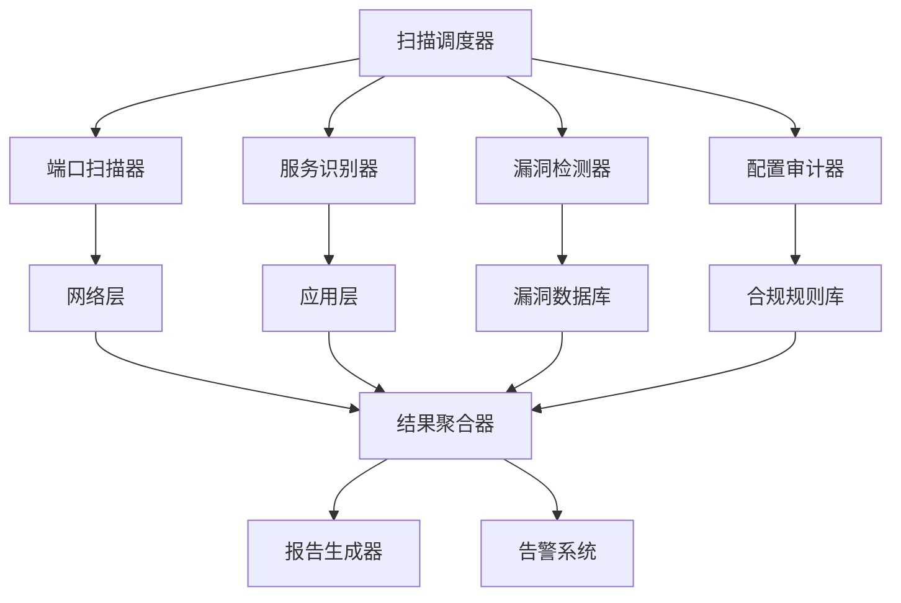

# 01-安全扫描工具 (Security Scanning Tools)

## 目录

1. [概述](#1-概述)
2. [形式化定义](#2-形式化定义)
3. [架构设计](#3-架构设计)
4. [Go语言实现](#4-go语言实现)
5. [算法分析](#5-算法分析)
6. [性能优化](#6-性能优化)
7. [安全考虑](#7-安全考虑)
8. [应用场景](#8-应用场景)

## 1. 概述

### 1.1 定义与目标

安全扫描工具是网络安全基础设施的核心组件，用于主动发现和识别系统中的安全漏洞、配置错误和潜在威胁。

**形式化定义**：

```math
SecurityScanner = (T, P, V, R, A)
```

其中：

- T: 目标集合 (Target Set)
- P: 端口集合 (Port Set)  
- V: 漏洞数据库 (Vulnerability Database)
- R: 扫描规则 (Scan Rules)
- A: 分析算法 (Analysis Algorithms)

### 1.2 核心功能

1. **端口扫描** - 发现开放的网络端口
2. **服务识别** - 识别运行的服务和版本
3. **漏洞检测** - 检测已知安全漏洞
4. **配置审计** - 检查安全配置合规性
5. **报告生成** - 生成详细的安全报告

## 2. 形式化定义

### 2.1 扫描目标模型

```math
Target = (IP, Ports, Services, Configurations)

IP ∈ IPv4 ∪ IPv6
Ports ⊆ {1, 2, ..., 65535}
Services ⊆ ServiceDatabase
Configurations ⊆ ConfigSpace
```

### 2.2 扫描状态机

```math
ScanState = (IDLE, SCANNING, ANALYZING, REPORTING, COMPLETED)

Transition: ScanState × Event → ScanState × Action

其中：
- Event = {START_SCAN, PORT_FOUND, VULNERABILITY_DETECTED, SCAN_COMPLETE}
- Action = {SCAN_PORT, ANALYZE_SERVICE, GENERATE_REPORT, NOTIFY}
```

### 2.3 漏洞评分模型

```math
CVSS_Score = BaseScore + TemporalScore + EnvironmentalScore

BaseScore = f(AttackVector, AttackComplexity, PrivilegesRequired, UserInteraction, Scope, Confidentiality, Integrity, Availability)

其中 f 是CVSS v3.1评分函数
```

## 3. 架构设计

### 3.1 系统架构图



### 3.2 组件设计

#### 3.2.1 扫描调度器

```go
// ScanScheduler 扫描调度器
type ScanScheduler struct {
    targetQueue    *queue.PriorityQueue
    workerPool     *WorkerPool
    resultCollector *ResultCollector
    config         *ScanConfig
    metrics        *ScanMetrics
}

// ScanConfig 扫描配置
type ScanConfig struct {
    MaxConcurrency    int           `json:"max_concurrency"`
    Timeout           time.Duration `json:"timeout"`
    RetryCount        int           `json:"retry_count"`
    RateLimit         int           `json:"rate_limit"`
    ScanTypes         []ScanType    `json:"scan_types"`
    ExcludePorts      []int         `json:"exclude_ports"`
    IncludePorts      []int         `json:"include_ports"`
}

// ScanType 扫描类型
type ScanType string

const (
    ScanTypePort       ScanType = "port"
    ScanTypeService    ScanType = "service"
    ScanTypeVulnerability ScanType = "vulnerability"
    ScanTypeConfig     ScanType = "config"
)
```

#### 3.2.2 端口扫描器

```go
// PortScanner 端口扫描器
type PortScanner struct {
    scannerType    ScannerType
    timeout        time.Duration
    rateLimiter    *rate.Limiter
    resultChan     chan PortScanResult
}

// ScannerType 扫描器类型
type ScannerType string

const (
    ScannerTypeTCP    ScannerType = "tcp"
    ScannerTypeUDP    ScannerType = "udp"
    ScannerTypeSYN    ScannerType = "syn"
    ScannerTypeACK    ScannerType = "ack"
)

// PortScanResult 端口扫描结果
type PortScanResult struct {
    Target     string    `json:"target"`
    Port       int       `json:"port"`
    Protocol   string    `json:"protocol"`
    State      PortState `json:"state"`
    Service    string    `json:"service,omitempty"`
    Version    string    `json:"version,omitempty"`
    ScanTime   time.Time `json:"scan_time"`
    ResponseTime time.Duration `json:"response_time"`
}

// PortState 端口状态
type PortState string

const (
    PortStateOpen     PortState = "open"
    PortStateClosed   PortState = "closed"
    PortStateFiltered PortState = "filtered"
    PortStateUnfiltered PortState = "unfiltered"
)
```

## 4. Go语言实现

### 4.1 基础扫描器实现

```go
package security

import (
    "context"
    "fmt"
    "net"
    "sync"
    "time"
    "golang.org/x/time/rate"
)

// SecurityScanner 安全扫描器主结构
type SecurityScanner struct {
    config         *ScannerConfig
    portScanner    *PortScanner
    serviceScanner *ServiceScanner
    vulnScanner    *VulnerabilityScanner
    configScanner  *ConfigScanner
    resultCollector *ResultCollector
    metrics        *ScanMetrics
}

// ScannerConfig 扫描器配置
type ScannerConfig struct {
    // 基础配置
    MaxConcurrency    int           `json:"max_concurrency"`
    Timeout           time.Duration `json:"timeout"`
    RetryCount        int           `json:"retry_count"`
    RateLimit         int           `json:"rate_limit"`
    
    // 扫描配置
    ScanTypes         []ScanType    `json:"scan_types"`
    PortRanges        []PortRange   `json:"port_ranges"`
    ExcludePorts      []int         `json:"exclude_ports"`
    
    // 输出配置
    OutputFormat      OutputFormat  `json:"output_format"`
    OutputFile        string        `json:"output_file"`
    Verbose           bool          `json:"verbose"`
}

// PortRange 端口范围
type PortRange struct {
    Start int `json:"start"`
    End   int `json:"end"`
}

// OutputFormat 输出格式
type OutputFormat string

const (
    OutputFormatJSON  OutputFormat = "json"
    OutputFormatXML   OutputFormat = "xml"
    OutputFormatCSV   OutputFormat = "csv"
    OutputFormatHTML  OutputFormat = "html"
)

// NewSecurityScanner 创建新的安全扫描器
func NewSecurityScanner(config *ScannerConfig) *SecurityScanner {
    return &SecurityScanner{
        config:         config,
        portScanner:    NewPortScanner(config),
        serviceScanner: NewServiceScanner(config),
        vulnScanner:    NewVulnerabilityScanner(config),
        configScanner:  NewConfigScanner(config),
        resultCollector: NewResultCollector(),
        metrics:        NewScanMetrics(),
    }
}

// ScanTarget 扫描单个目标
func (s *SecurityScanner) ScanTarget(ctx context.Context, target string) (*ScanResult, error) {
    s.metrics.IncrementScans()
    startTime := time.Now()
    
    result := &ScanResult{
        Target:    target,
        StartTime: startTime,
        Status:    ScanStatusRunning,
    }
    
    // 创建扫描上下文
    scanCtx, cancel := context.WithTimeout(ctx, s.config.Timeout)
    defer cancel()
    
    // 并发扫描
    var wg sync.WaitGroup
    resultChan := make(chan interface{}, 100)
    errorChan := make(chan error, 10)
    
    // 端口扫描
    if s.shouldScan(ScanTypePort) {
        wg.Add(1)
        go func() {
            defer wg.Done()
            portResults, err := s.portScanner.Scan(scanCtx, target)
            if err != nil {
                errorChan <- fmt.Errorf("port scan failed: %w", err)
                return
            }
            resultChan <- portResults
        }()
    }
    
    // 服务识别
    if s.shouldScan(ScanTypeService) {
        wg.Add(1)
        go func() {
            defer wg.Done()
            serviceResults, err := s.serviceScanner.Scan(scanCtx, target)
            if err != nil {
                errorChan <- fmt.Errorf("service scan failed: %w", err)
                return
            }
            resultChan <- serviceResults
        }()
    }
    
    // 漏洞检测
    if s.shouldScan(ScanTypeVulnerability) {
        wg.Add(1)
        go func() {
            defer wg.Done()
            vulnResults, err := s.vulnScanner.Scan(scanCtx, target)
            if err != nil {
                errorChan <- fmt.Errorf("vulnerability scan failed: %w", err)
                return
            }
            resultChan <- vulnResults
        }()
    }
    
    // 配置审计
    if s.shouldScan(ScanTypeConfig) {
        wg.Add(1)
        go func() {
            defer wg.Done()
            configResults, err := s.configScanner.Scan(scanCtx, target)
            if err != nil {
                errorChan <- fmt.Errorf("config scan failed: %w", err)
                return
            }
            resultChan <- configResults
        }()
    }
    
    // 等待所有扫描完成
    go func() {
        wg.Wait()
        close(resultChan)
        close(errorChan)
    }()
    
    // 收集结果
    for {
        select {
        case scanResult := <-resultChan:
            s.resultCollector.AddResult(scanResult)
        case err := <-errorChan:
            result.Errors = append(result.Errors, err.Error())
        case <-scanCtx.Done():
            result.Status = ScanStatusTimeout
            s.metrics.RecordTimeout()
            return result, scanCtx.Err()
        }
        
        // 检查是否所有扫描都完成
        if len(resultChan) == 0 && len(errorChan) == 0 {
            break
        }
    }
    
    // 聚合结果
    result.PortResults = s.resultCollector.GetPortResults()
    result.ServiceResults = s.resultCollector.GetServiceResults()
    result.VulnerabilityResults = s.resultCollector.GetVulnerabilityResults()
    result.ConfigResults = s.resultCollector.GetConfigResults()
    
    result.EndTime = time.Now()
    result.Duration = result.EndTime.Sub(startTime)
    result.Status = ScanStatusCompleted
    
    s.metrics.RecordScanDuration(result.Duration)
    
    return result, nil
}

// ScanMultipleTargets 扫描多个目标
func (s *SecurityScanner) ScanMultipleTargets(ctx context.Context, targets []string) ([]*ScanResult, error) {
    var results []*ScanResult
    var mu sync.Mutex
    var wg sync.WaitGroup
    
    // 创建信号量控制并发数
    semaphore := make(chan struct{}, s.config.MaxConcurrency)
    
    for _, target := range targets {
        wg.Add(1)
        go func(t string) {
            defer wg.Done()
            
            // 获取信号量
            semaphore <- struct{}{}
            defer func() { <-semaphore }()
            
            result, err := s.ScanTarget(ctx, t)
            if err != nil {
                result = &ScanResult{
                    Target: t,
                    Status: ScanStatusFailed,
                    Errors: []string{err.Error()},
                }
            }
            
            mu.Lock()
            results = append(results, result)
            mu.Unlock()
        }(target)
    }
    
    wg.Wait()
    
    return results, nil
}

// shouldScan 检查是否应该执行特定类型的扫描
func (s *SecurityScanner) shouldScan(scanType ScanType) bool {
    for _, t := range s.config.ScanTypes {
        if t == scanType {
            return true
        }
    }
    return false
}
```

### 4.2 端口扫描器实现

```go
// PortScanner 端口扫描器
type PortScanner struct {
    config      *ScannerConfig
    rateLimiter *rate.Limiter
    timeout     time.Duration
}

// NewPortScanner 创建新的端口扫描器
func NewPortScanner(config *ScannerConfig) *PortScanner {
    return &PortScanner{
        config:      config,
        rateLimiter: rate.NewLimiter(rate.Limit(config.RateLimit), config.RateLimit),
        timeout:     config.Timeout,
    }
}

// Scan 执行端口扫描
func (ps *PortScanner) Scan(ctx context.Context, target string) ([]PortScanResult, error) {
    var results []PortScanResult
    var mu sync.Mutex
    var wg sync.WaitGroup
    
    // 获取要扫描的端口列表
    ports := ps.getPortsToScan()
    
    // 并发扫描端口
    for _, port := range ports {
        wg.Add(1)
        go func(p int) {
            defer wg.Done()
            
            // 等待速率限制
            ps.rateLimiter.Wait(ctx)
            
            result := ps.scanPort(ctx, target, p)
            
            mu.Lock()
            results = append(results, result)
            mu.Unlock()
        }(port)
    }
    
    wg.Wait()
    
    return results, nil
}

// scanPort 扫描单个端口
func (ps *PortScanner) scanPort(ctx context.Context, target string, port int) PortScanResult {
    result := PortScanResult{
        Target:   target,
        Port:     port,
        Protocol: "tcp",
        ScanTime: time.Now(),
    }
    
    // 创建带超时的连接
    conn, err := net.DialTimeout("tcp", fmt.Sprintf("%s:%d", target, port), ps.timeout)
    if err != nil {
        result.State = PortStateClosed
        return result
    }
    defer conn.Close()
    
    result.State = PortStateOpen
    result.ResponseTime = time.Since(result.ScanTime)
    
    // 尝试识别服务
    service := ps.identifyService(conn, port)
    if service != "" {
        result.Service = service
    }
    
    return result
}

// getPortsToScan 获取要扫描的端口列表
func (ps *PortScanner) getPortsToScan() []int {
    var ports []int
    
    // 处理端口范围
    for _, portRange := range ps.config.PortRanges {
        for port := portRange.Start; port <= portRange.End; port++ {
            if !ps.isPortExcluded(port) {
                ports = append(ports, port)
            }
        }
    }
    
    // 处理包含的端口
    for _, port := range ps.config.IncludePorts {
        if !ps.isPortExcluded(port) {
            ports = append(ports, port)
        }
    }
    
    // 去重
    portMap := make(map[int]bool)
    var uniquePorts []int
    for _, port := range ports {
        if !portMap[port] {
            portMap[port] = true
            uniquePorts = append(uniquePorts, port)
        }
    }
    
    return uniquePorts
}

// isPortExcluded 检查端口是否被排除
func (ps *PortScanner) isPortExcluded(port int) bool {
    for _, excludedPort := range ps.config.ExcludePorts {
        if excludedPort == port {
            return true
        }
    }
    return false
}

// identifyService 识别服务
func (ps *PortScanner) identifyService(conn net.Conn, port int) string {
    // 常见端口服务映射
    serviceMap := map[int]string{
        21:   "ftp",
        22:   "ssh",
        23:   "telnet",
        25:   "smtp",
        53:   "dns",
        80:   "http",
        110:  "pop3",
        143:  "imap",
        443:  "https",
        993:  "imaps",
        995:  "pop3s",
        3306: "mysql",
        5432: "postgresql",
        6379: "redis",
        27017: "mongodb",
    }
    
    if service, exists := serviceMap[port]; exists {
        return service
    }
    
    // 尝试通过协议识别
    return ps.identifyServiceByProtocol(conn)
}

// identifyServiceByProtocol 通过协议识别服务
func (ps *PortScanner) identifyServiceByProtocol(conn net.Conn) string {
    // 发送探测数据
    probes := []string{
        "GET / HTTP/1.0\r\n\r\n",
        "SSH-2.0-OpenSSH_8.0\r\n",
        "HELO\r\n",
        "\x00\x00\x00\x85", // MySQL protocol
    }
    
    for _, probe := range probes {
        conn.SetWriteDeadline(time.Now().Add(ps.timeout))
        _, err := conn.Write([]byte(probe))
        if err != nil {
            continue
        }
        
        // 读取响应
        conn.SetReadDeadline(time.Now().Add(ps.timeout))
        buffer := make([]byte, 1024)
        n, err := conn.Read(buffer)
        if err != nil {
            continue
        }
        
        response := string(buffer[:n])
        
        // 根据响应识别服务
        switch {
        case strings.Contains(response, "HTTP/"):
            return "http"
        case strings.Contains(response, "SSH"):
            return "ssh"
        case strings.Contains(response, "220") && strings.Contains(response, "SMTP"):
            return "smtp"
        case strings.Contains(response, "mysql"):
            return "mysql"
        }
    }
    
    return ""
}
```

## 5. 算法分析

### 5.1 时间复杂度分析

**端口扫描算法**：

```math
T(n) = O(n × t)
```

其中：

- n: 端口数量
- t: 单个端口扫描时间

**并发优化后**：

```math
T(n) = O(\frac{n × t}{c})
```

其中 c 是并发数

### 5.2 空间复杂度分析

**内存使用**：

```math
S(n) = O(n × r)
```

其中：

- n: 扫描目标数量
- r: 每个目标的结果大小

### 5.3 性能优化策略

1. **并发控制** - 使用工作池和信号量
2. **速率限制** - 防止网络拥塞
3. **连接复用** - 减少连接开销
4. **结果缓存** - 避免重复扫描
5. **异步处理** - 提高吞吐量

## 6. 性能优化

### 6.1 并发优化

```go
// WorkerPool 工作池
type WorkerPool struct {
    workers    int
    taskChan   chan Task
    resultChan chan Result
    wg         sync.WaitGroup
}

// Task 任务接口
type Task interface {
    Execute() Result
}

// Result 结果接口
type Result interface {
    GetID() string
}

// NewWorkerPool 创建新的工作池
func NewWorkerPool(workers int) *WorkerPool {
    wp := &WorkerPool{
        workers:    workers,
        taskChan:   make(chan Task, workers*2),
        resultChan: make(chan Result, workers*2),
    }
    
    // 启动工作协程
    for i := 0; i < workers; i++ {
        wp.wg.Add(1)
        go wp.worker()
    }
    
    return wp
}

// worker 工作协程
func (wp *WorkerPool) worker() {
    defer wp.wg.Done()
    
    for task := range wp.taskChan {
        result := task.Execute()
        wp.resultChan <- result
    }
}

// Submit 提交任务
func (wp *WorkerPool) Submit(task Task) {
    wp.taskChan <- task
}

// Close 关闭工作池
func (wp *WorkerPool) Close() {
    close(wp.taskChan)
    wp.wg.Wait()
    close(wp.resultChan)
}
```

### 6.2 内存优化

```go
// ObjectPool 对象池
type ObjectPool struct {
    pool sync.Pool
}

// NewObjectPool 创建新的对象池
func NewObjectPool(newFunc func() interface{}) *ObjectPool {
    return &ObjectPool{
        pool: sync.Pool{
            New: newFunc,
        },
    }
}

// Get 获取对象
func (op *ObjectPool) Get() interface{} {
    return op.pool.Get()
}

// Put 归还对象
func (op *ObjectPool) Put(obj interface{}) {
    op.pool.Put(obj)
}
```

### 6.3 网络优化

```go
// ConnectionPool 连接池
type ConnectionPool struct {
    mu       sync.RWMutex
    conns    map[string][]net.Conn
    maxConns int
    timeout  time.Duration
}

// NewConnectionPool 创建新的连接池
func NewConnectionPool(maxConns int, timeout time.Duration) *ConnectionPool {
    return &ConnectionPool{
        conns:    make(map[string][]net.Conn),
        maxConns: maxConns,
        timeout:  timeout,
    }
}

// GetConnection 获取连接
func (cp *ConnectionPool) GetConnection(target string) (net.Conn, error) {
    cp.mu.Lock()
    defer cp.mu.Unlock()
    
    if conns, exists := cp.conns[target]; exists && len(conns) > 0 {
        conn := conns[len(conns)-1]
        cp.conns[target] = conns[:len(conns)-1]
        return conn, nil
    }
    
    // 创建新连接
    return net.DialTimeout("tcp", target, cp.timeout)
}

// PutConnection 归还连接
func (cp *ConnectionPool) PutConnection(target string, conn net.Conn) {
    cp.mu.Lock()
    defer cp.mu.Unlock()
    
    if len(cp.conns[target]) < cp.maxConns {
        cp.conns[target] = append(cp.conns[target], conn)
    } else {
        conn.Close()
    }
}
```

## 7. 安全考虑

### 7.1 扫描安全

1. **权限控制** - 确保有适当的扫描权限
2. **速率限制** - 避免对目标系统造成压力
3. **非破坏性** - 只进行检测，不进行攻击
4. **日志记录** - 记录所有扫描活动

### 7.2 数据安全

```go
// SecureStorage 安全存储
type SecureStorage struct {
    encryptionKey []byte
    cipher        cipher.AEAD
}

// NewSecureStorage 创建安全存储
func NewSecureStorage(key []byte) (*SecureStorage, error) {
    block, err := aes.NewCipher(key)
    if err != nil {
        return nil, err
    }
    
    gcm, err := cipher.NewGCM(block)
    if err != nil {
        return nil, err
    }
    
    return &SecureStorage{
        encryptionKey: key,
        cipher:        gcm,
    }, nil
}

// Encrypt 加密数据
func (ss *SecureStorage) Encrypt(data []byte) ([]byte, error) {
    nonce := make([]byte, ss.cipher.NonceSize())
    if _, err := io.ReadFull(rand.Reader, nonce); err != nil {
        return nil, err
    }
    
    return ss.cipher.Seal(nonce, nonce, data, nil), nil
}

// Decrypt 解密数据
func (ss *SecureStorage) Decrypt(data []byte) ([]byte, error) {
    nonceSize := ss.cipher.NonceSize()
    if len(data) < nonceSize {
        return nil, fmt.Errorf("ciphertext too short")
    }
    
    nonce, ciphertext := data[:nonceSize], data[nonceSize:]
    return ss.cipher.Open(nil, nonce, ciphertext, nil)
}
```

### 7.3 访问控制

```go
// AccessControl 访问控制
type AccessControl struct {
    policies map[string]Policy
    cache    *lru.Cache
}

// Policy 策略
type Policy struct {
    ID          string   `json:"id"`
    Name        string   `json:"name"`
    Permissions []string `json:"permissions"`
    Targets     []string `json:"targets"`
    Schedule    Schedule `json:"schedule"`
}

// Schedule 调度
type Schedule struct {
    StartTime time.Time `json:"start_time"`
    EndTime   time.Time `json:"end_time"`
    Days      []int     `json:"days"`
}

// CheckPermission 检查权限
func (ac *AccessControl) CheckPermission(user, action, target string) bool {
    // 检查缓存
    cacheKey := fmt.Sprintf("%s:%s:%s", user, action, target)
    if cached, exists := ac.cache.Get(cacheKey); exists {
        return cached.(bool)
    }
    
    // 检查策略
    for _, policy := range ac.policies {
        if ac.matchesPolicy(user, action, target, policy) {
            ac.cache.Add(cacheKey, true)
            return true
        }
    }
    
    ac.cache.Add(cacheKey, false)
    return false
}

// matchesPolicy 匹配策略
func (ac *AccessControl) matchesPolicy(user, action, target string, policy Policy) bool {
    // 检查权限
    hasPermission := false
    for _, perm := range policy.Permissions {
        if perm == action {
            hasPermission = true
            break
        }
    }
    
    if !hasPermission {
        return false
    }
    
    // 检查目标
    hasTarget := false
    for _, t := range policy.Targets {
        if t == target || t == "*" {
            hasTarget = true
            break
        }
    }
    
    if !hasTarget {
        return false
    }
    
    // 检查时间
    now := time.Now()
    if now.Before(policy.Schedule.StartTime) || now.After(policy.Schedule.EndTime) {
        return false
    }
    
    // 检查星期
    weekday := int(now.Weekday())
    hasDay := false
    for _, day := range policy.Schedule.Days {
        if day == weekday {
            hasDay = true
            break
        }
    }
    
    return hasDay
}
```

## 8. 应用场景

### 8.1 网络资产发现

```go
// AssetDiscovery 资产发现
type AssetDiscovery struct {
    scanner *SecurityScanner
    network *NetworkScanner
}

// DiscoverAssets 发现网络资产
func (ad *AssetDiscovery) DiscoverAssets(networkCIDR string) ([]Asset, error) {
    // 扫描网络范围
    targets := ad.network.ScanNetwork(networkCIDR)
    
    var assets []Asset
    for _, target := range targets {
        // 扫描每个目标
        result, err := ad.scanner.ScanTarget(context.Background(), target)
        if err != nil {
            continue
        }
        
        asset := Asset{
            IP:       target,
            Services: result.ServiceResults,
            Vulns:    result.VulnerabilityResults,
        }
        assets = append(assets, asset)
    }
    
    return assets, nil
}
```

### 8.2 合规性检查

```go
// ComplianceChecker 合规性检查器
type ComplianceChecker struct {
    scanner *SecurityScanner
    rules   []ComplianceRule
}

// ComplianceRule 合规规则
type ComplianceRule struct {
    ID          string `json:"id"`
    Name        string `json:"name"`
    Description string `json:"description"`
    Check       string `json:"check"`
    Severity    string `json:"severity"`
}

// CheckCompliance 检查合规性
func (cc *ComplianceChecker) CheckCompliance(target string) ([]ComplianceResult, error) {
    // 扫描目标
    result, err := cc.scanner.ScanTarget(context.Background(), target)
    if err != nil {
        return nil, err
    }
    
    var complianceResults []ComplianceResult
    
    // 检查每个规则
    for _, rule := range cc.rules {
        compliant := cc.checkRule(rule, result)
        complianceResults = append(complianceResults, ComplianceResult{
            Rule:      rule,
            Compliant: compliant,
            Target:    target,
        })
    }
    
    return complianceResults, nil
}
```

### 8.3 威胁情报集成

```go
// ThreatIntelligence 威胁情报
type ThreatIntelligence struct {
    scanner *SecurityScanner
    intelDB *IntelligenceDatabase
}

// EnrichWithIntelligence 使用威胁情报丰富结果
func (ti *ThreatIntelligence) EnrichWithIntelligence(result *ScanResult) error {
    for _, vuln := range result.VulnerabilityResults {
        // 查询威胁情报
        intel := ti.intelDB.Query(vuln.CVE)
        if intel != nil {
            vuln.ThreatLevel = intel.ThreatLevel
            vuln.ExploitAvailable = intel.ExploitAvailable
            vuln.APTGroups = intel.APTGroups
        }
    }
    
    return nil
}
```

---

**总结**：安全扫描工具是网络安全基础设施的重要组成部分，通过Go语言的高并发特性和内存安全保证，可以构建高性能、高可靠的安全扫描系统。本文档提供了完整的设计思路、实现方案和优化策略，为构建企业级安全扫描工具提供了参考。
