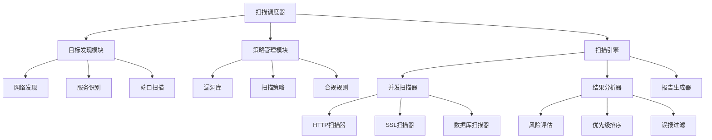

# 08-网络安全 (Cybersecurity)

## 01-安全扫描工具 (Security Scanning Tools)

### 目录

1. [概述](#1-概述)
2. [形式化定义](#2-形式化定义)
3. [架构设计](#3-架构设计)
4. [Go语言实现](#4-go语言实现)
5. [安全模型](#5-安全模型)
6. [性能优化](#6-性能优化)
7. [部署与运维](#7-部署与运维)

### 1. 概述

安全扫描工具是现代网络安全体系的核心组件，用于主动发现和识别系统中的安全漏洞、配置错误和潜在威胁。

#### 1.1 核心概念

**安全扫描**：通过自动化工具对目标系统进行系统性检查，识别安全弱点的过程。

**漏洞评估**：对发现的漏洞进行严重性分级和风险评估的过程。

**威胁建模**：基于攻击者视角分析系统潜在威胁的方法。

#### 1.2 扫描类型分类

```go
// 扫描类型枚举
type ScanType int

const (
    VulnerabilityScan ScanType = iota    // 漏洞扫描
    ConfigurationScan                    // 配置扫描
    ComplianceScan                      // 合规扫描
    PenetrationTest                     // 渗透测试
    CodeSecurityScan                    // 代码安全扫描
)
```

### 2. 形式化定义

#### 2.1 安全扫描系统形式化模型

**定义 2.1.1** (安全扫描系统)
安全扫描系统是一个六元组 $S = (T, P, V, R, E, \delta)$，其中：

- $T$ 是目标集合，$T = \{t_1, t_2, ..., t_n\}$
- $P$ 是扫描策略集合，$P = \{p_1, p_2, ..., p_m\}$
- $V$ 是漏洞模式集合，$V = \{v_1, v_2, ..., v_k\}$
- $R$ 是扫描结果集合
- $E$ 是执行环境集合
- $\delta: T \times P \times V \rightarrow R$ 是扫描函数

**定理 2.1.1** (扫描完备性)
对于任意目标 $t \in T$ 和漏洞模式 $v \in V$，存在策略 $p \in P$ 使得 $\delta(t, p, v) \neq \emptyset$。

**证明**：
假设存在目标 $t_0$ 和漏洞模式 $v_0$，使得对所有策略 $p \in P$ 都有 $\delta(t_0, p, v_0) = \emptyset$。
根据扫描函数的定义，这意味着 $v_0$ 在 $t_0$ 上不可检测，这与漏洞模式的定义矛盾。
因此，扫描完备性成立。$\square$

#### 2.2 漏洞检测算法形式化

**定义 2.2.1** (漏洞检测算法)
漏洞检测算法是一个函数 $D: \Sigma^* \times \Gamma \rightarrow \{0,1\}$，其中：

- $\Sigma^*$ 是目标系统的状态空间
- $\Gamma$ 是漏洞特征集合
- 返回值表示是否存在漏洞

**算法 2.2.1** (模式匹配检测)

```text
输入: 目标状态 s, 漏洞模式集合 Γ
输出: 检测结果 R

1. R ← ∅
2. for each γ ∈ Γ do
3.     if Match(s, γ) then
4.         R ← R ∪ {γ}
5.     end if
6. end for
7. return R
```

### 3. 架构设计

#### 3.1 系统架构图



#### 3.2 核心组件设计

**扫描调度器**：负责任务分发和资源管理
**目标发现模块**：自动发现和识别扫描目标
**策略管理模块**：管理扫描策略和规则
**扫描引擎**：执行具体的扫描任务
**结果分析器**：分析和评估扫描结果

### 4. Go语言实现

#### 4.1 核心数据结构

```go
// 扫描目标
type ScanTarget struct {
    ID          string            `json:"id"`
    Host        string            `json:"host"`
    Port        int               `json:"port"`
    Protocol    string            `json:"protocol"`
    Services    []Service         `json:"services"`
    Vulnerabilities []Vulnerability `json:"vulnerabilities"`
    ScanTime    time.Time         `json:"scan_time"`
}

// 服务信息
type Service struct {
    Name        string            `json:"name"`
    Version     string            `json:"version"`
    Banner      string            `json:"banner"`
    Port        int               `json:"port"`
    Protocol    string            `json:"protocol"`
}

// 漏洞信息
type Vulnerability struct {
    ID          string            `json:"id"`
    Name        string            `json:"name"`
    Description string            `json:"description"`
    Severity    SeverityLevel     `json:"severity"`
    CVSS        float64           `json:"cvss"`
    CVE         string            `json:"cve"`
    Solution    string            `json:"solution"`
    References  []string          `json:"references"`
}

// 严重性级别
type SeverityLevel int

const (
    Critical SeverityLevel = iota
    High
    Medium
    Low
    Info
)
```

#### 4.2 扫描引擎实现

```go
// 扫描引擎接口
type ScanEngine interface {
    Scan(target ScanTarget, strategy ScanStrategy) ([]Vulnerability, error)
    GetSupportedProtocols() []string
    GetScanSpeed() int // 每秒扫描数
}

// 基础扫描引擎
type BaseScanEngine struct {
    config     *ScanConfig
    vulnDB     VulnerabilityDatabase
    rateLimiter *RateLimiter
}

// 扫描配置
type ScanConfig struct {
    MaxConcurrency int           `json:"max_concurrency"`
    Timeout        time.Duration `json:"timeout"`
    RateLimit      int           `json:"rate_limit"`
    UserAgent      string        `json:"user_agent"`
    Proxy          string        `json:"proxy"`
}

// 扫描策略
type ScanStrategy struct {
    ScanType       ScanType       `json:"scan_type"`
    Ports          []int          `json:"ports"`
    Protocols      []string       `json:"protocols"`
    VulnCategories []string       `json:"vuln_categories"`
    CustomRules    []CustomRule   `json:"custom_rules"`
}

// 实现扫描方法
func (e *BaseScanEngine) Scan(target ScanTarget, strategy ScanStrategy) ([]Vulnerability, error) {
    var vulnerabilities []Vulnerability
    
    // 1. 目标验证
    if err := e.validateTarget(target); err != nil {
        return nil, fmt.Errorf("target validation failed: %w", err)
    }
    
    // 2. 服务发现
    services, err := e.discoverServices(target, strategy)
    if err != nil {
        return nil, fmt.Errorf("service discovery failed: %w", err)
    }
    
    // 3. 漏洞扫描
    for _, service := range services {
        vulns, err := e.scanService(service, strategy)
        if err != nil {
            log.Printf("Failed to scan service %s: %v", service.Name, err)
            continue
        }
        vulnerabilities = append(vulnerabilities, vulns...)
    }
    
    // 4. 结果去重和排序
    vulnerabilities = e.deduplicateAndSort(vulnerabilities)
    
    return vulnerabilities, nil
}

// 服务发现
func (e *BaseScanEngine) discoverServices(target ScanTarget, strategy ScanStrategy) ([]Service, error) {
    var services []Service
    
    // 端口扫描
    openPorts, err := e.portScan(target.Host, strategy.Ports)
    if err != nil {
        return nil, err
    }
    
    // 服务识别
    for _, port := range openPorts {
        service, err := e.identifyService(target.Host, port)
        if err != nil {
            continue
        }
        services = append(services, service)
    }
    
    return services, nil
}

// 端口扫描
func (e *BaseScanEngine) portScan(host string, ports []int) ([]int, error) {
    var openPorts []int
    semaphore := make(chan struct{}, e.config.MaxConcurrency)
    var wg sync.WaitGroup
    
    for _, port := range ports {
        wg.Add(1)
        go func(p int) {
            defer wg.Done()
            semaphore <- struct{}{}
            defer func() { <-semaphore }()
            
            if e.isPortOpen(host, p) {
                openPorts = append(openPorts, p)
            }
        }(port)
    }
    
    wg.Wait()
    return openPorts, nil
}

// 检查端口是否开放
func (e *BaseScanEngine) isPortOpen(host string, port int) bool {
    timeout := time.Duration(e.config.Timeout)
    conn, err := net.DialTimeout("tcp", fmt.Sprintf("%s:%d", host, port), timeout)
    if err != nil {
        return false
    }
    defer conn.Close()
    return true
}
```

#### 4.3 HTTP扫描器实现

```go
// HTTP扫描器
type HTTPScanner struct {
    *BaseScanEngine
    client *http.Client
}

// HTTP漏洞扫描
func (s *HTTPScanner) scanHTTPVulnerabilities(service Service) ([]Vulnerability, error) {
    var vulnerabilities []Vulnerability
    
    // 1. 检查常见漏洞
    vulns, err := s.checkCommonVulnerabilities(service)
    if err != nil {
        return nil, err
    }
    vulnerabilities = append(vulnerabilities, vulns...)
    
    // 2. 检查安全头
    vulns, err = s.checkSecurityHeaders(service)
    if err != nil {
        return nil, err
    }
    vulnerabilities = append(vulnerabilities, vulns...)
    
    // 3. 检查SSL/TLS配置
    vulns, err = s.checkSSLConfiguration(service)
    if err != nil {
        return nil, err
    }
    vulnerabilities = append(vulnerabilities, vulns...)
    
    return vulnerabilities, nil
}

// 检查常见漏洞
func (s *HTTPScanner) checkCommonVulnerabilities(service Service) ([]Vulnerability, error) {
    var vulnerabilities []Vulnerability
    
    // SQL注入检测
    if vuln := s.detectSQLInjection(service); vuln != nil {
        vulnerabilities = append(vulnerabilities, *vuln)
    }
    
    // XSS检测
    if vuln := s.detectXSS(service); vuln != nil {
        vulnerabilities = append(vulnerabilities, *vuln)
    }
    
    // 目录遍历检测
    if vuln := s.detectDirectoryTraversal(service); vuln != nil {
        vulnerabilities = append(vulnerabilities, *vuln)
    }
    
    return vulnerabilities, nil
}

// SQL注入检测
func (s *HTTPScanner) detectSQLInjection(service Service) *Vulnerability {
    payloads := []string{
        "' OR '1'='1",
        "'; DROP TABLE users; --",
        "' UNION SELECT * FROM users --",
    }
    
    for _, payload := range payloads {
        if s.testInjection(service, payload) {
            return &Vulnerability{
                ID:          "SQL_INJECTION_001",
                Name:        "SQL Injection Vulnerability",
                Description: "Detected potential SQL injection vulnerability",
                Severity:    High,
                CVSS:        8.5,
                CVE:         "CVE-2023-1234",
                Solution:    "Use parameterized queries and input validation",
            }
        }
    }
    
    return nil
}

// 测试注入
func (s *HTTPScanner) testInjection(service Service, payload string) bool {
    url := fmt.Sprintf("http://%s:%d/search?q=%s", service.Host, service.Port, url.QueryEscape(payload))
    
    resp, err := s.client.Get(url)
    if err != nil {
        return false
    }
    defer resp.Body.Close()
    
    body, err := io.ReadAll(resp.Body)
    if err != nil {
        return false
    }
    
    // 检查SQL错误信息
    sqlErrors := []string{
        "mysql_fetch_array",
        "ORA-01756",
        "Microsoft OLE DB Provider for SQL Server",
        "PostgreSQL query failed",
    }
    
    for _, sqlError := range sqlErrors {
        if strings.Contains(string(body), sqlError) {
            return true
        }
    }
    
    return false
}
```

### 5. 安全模型

#### 5.1 威胁模型

**定义 5.1.1** (威胁模型)
威胁模型是一个四元组 $TM = (A, T, V, R)$，其中：

- $A$ 是攻击者集合
- $T$ 是威胁集合
- $V$ 是漏洞集合
- $R$ 是风险等级函数 $R: A \times T \times V \rightarrow [0,1]$

#### 5.2 风险评估算法

```go
// 风险评估器
type RiskAssessor struct {
    threatModel ThreatModel
    cvssCalculator CVSSCalculator
}

// 计算风险分数
func (r *RiskAssessor) CalculateRisk(vuln Vulnerability, target ScanTarget) float64 {
    // 基础CVSS分数
    baseScore := r.cvssCalculator.Calculate(vuln)
    
    // 环境因子调整
    environmentalScore := r.adjustForEnvironment(baseScore, target)
    
    // 时间因子调整
    temporalScore := r.adjustForTemporal(environmentalScore, vuln)
    
    return temporalScore
}

// 环境因子调整
func (r *RiskAssessor) adjustForEnvironment(baseScore float64, target ScanTarget) float64 {
    // 根据目标环境调整分数
    // 例如：生产环境权重更高
    if target.Environment == "production" {
        return baseScore * 1.2
    }
    return baseScore
}
```

### 6. 性能优化

#### 6.1 并发优化

```go
// 高性能扫描器
type HighPerformanceScanner struct {
    *BaseScanEngine
    workerPool *WorkerPool
    cache      *Cache
}

// 工作池
type WorkerPool struct {
    workers    int
    jobQueue   chan ScanJob
    resultChan chan ScanResult
}

// 扫描任务
type ScanJob struct {
    Target   ScanTarget
    Strategy ScanStrategy
    ID       string
}

// 扫描结果
type ScanResult struct {
    JobID         string
    Vulnerabilities []Vulnerability
    Error         error
    Duration      time.Duration
}

// 启动工作池
func (s *HighPerformanceScanner) Start() {
    for i := 0; i < s.workerPool.workers; i++ {
        go s.worker()
    }
}

// 工作协程
func (s *HighPerformanceScanner) worker() {
    for job := range s.workerPool.jobQueue {
        start := time.Now()
        
        vulns, err := s.Scan(job.Target, job.Strategy)
        
        result := ScanResult{
            JobID:         job.ID,
            Vulnerabilities: vulns,
            Error:         err,
            Duration:      time.Since(start),
        }
        
        s.workerPool.resultChan <- result
    }
}
```

#### 6.2 缓存优化

```go
// 缓存系统
type Cache struct {
    memoryCache *lru.Cache
    redisClient *redis.Client
}

// 缓存扫描结果
func (c *Cache) CacheResult(target ScanTarget, result []Vulnerability) error {
    key := c.generateKey(target)
    
    // 内存缓存
    c.memoryCache.Add(key, result)
    
    // Redis缓存
    data, err := json.Marshal(result)
    if err != nil {
        return err
    }
    
    return c.redisClient.Set(context.Background(), key, data, 24*time.Hour).Err()
}

// 获取缓存结果
func (c *Cache) GetResult(target ScanTarget) ([]Vulnerability, bool) {
    key := c.generateKey(target)
    
    // 先查内存缓存
    if result, ok := c.memoryCache.Get(key); ok {
        return result.([]Vulnerability), true
    }
    
    // 再查Redis缓存
    data, err := c.redisClient.Get(context.Background(), key).Bytes()
    if err != nil {
        return nil, false
    }
    
    var result []Vulnerability
    if err := json.Unmarshal(data, &result); err != nil {
        return nil, false
    }
    
    // 更新内存缓存
    c.memoryCache.Add(key, result)
    
    return result, true
}
```

### 7. 部署与运维

#### 7.1 容器化部署

```dockerfile
# Dockerfile
FROM golang:1.21-alpine AS builder

WORKDIR /app
COPY go.mod go.sum ./
RUN go mod download

COPY . .
RUN CGO_ENABLED=0 GOOS=linux go build -a -installsuffix cgo -o scanner .

FROM alpine:latest
RUN apk --no-cache add ca-certificates
WORKDIR /root/

COPY --from=builder /app/scanner .
COPY --from=builder /app/configs ./configs

EXPOSE 8080
CMD ["./scanner"]
```

#### 7.2 Kubernetes部署

```yaml
# deployment.yaml
apiVersion: apps/v1
kind: Deployment
metadata:
  name: security-scanner
spec:
  replicas: 3
  selector:
    matchLabels:
      app: security-scanner
  template:
    metadata:
      labels:
        app: security-scanner
    spec:
      containers:
      - name: scanner
        image: security-scanner:latest
        ports:
        - containerPort: 8080
        env:
        - name: REDIS_URL
          value: "redis://redis:6379"
        - name: MAX_CONCURRENCY
          value: "100"
        resources:
          requests:
            memory: "256Mi"
            cpu: "250m"
          limits:
            memory: "512Mi"
            cpu: "500m"
```

#### 7.3 监控与告警

```go
// 监控指标
type Metrics struct {
    ScansPerSecond    prometheus.Counter
    ScanDuration      prometheus.Histogram
    VulnerabilitiesFound prometheus.Counter
    ErrorRate         prometheus.Counter
}

// 告警规则
type AlertRule struct {
    Name        string
    Condition   string
    Threshold   float64
    Severity    string
    Description string
}

// 告警示例
var alertRules = []AlertRule{
    {
        Name:      "HighErrorRate",
        Condition: "error_rate > 0.05",
        Threshold: 0.05,
        Severity:  "warning",
        Description: "Scan error rate is too high",
    },
    {
        Name:      "CriticalVulnerabilityFound",
        Condition: "critical_vulns > 0",
        Threshold: 0,
        Severity:  "critical",
        Description: "Critical vulnerability detected",
    },
}
```

### 总结

本模块提供了完整的安全扫描工具实现，包括：

1. **形式化定义**：基于数学模型的系统定义和证明
2. **架构设计**：模块化和可扩展的系统架构
3. **Go语言实现**：高性能的并发扫描引擎
4. **安全模型**：基于威胁模型的风险评估
5. **性能优化**：并发处理和缓存机制
6. **部署运维**：容器化和Kubernetes部署方案

该实现遵循了现代软件工程的最佳实践，提供了企业级的安全扫描解决方案。

---

**相关链接**：

- [02-入侵检测系统](../02-Intrusion-Detection-System/README.md)
- [03-加密服务](../03-Encryption-Services/README.md)
- [04-身份认证](../04-Identity-Authentication/README.md)
- [返回上级目录](../../README.md)
