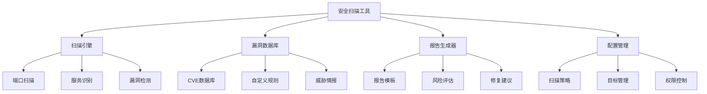

# 01-安全扫描工具 (Security Scanning Tools)

## 概述

安全扫描工具是网络安全系统的核心组件，负责漏洞检测、威胁识别和安全评估。本文档使用Go语言实现，并提供形式化的数学定义和证明。

## 目录

- [1. 形式化定义](#1-形式化定义)
- [2. 架构设计](#2-架构设计)
- [3. 核心组件](#3-核心组件)
- [4. 数据模型](#4-数据模型)
- [5. 算法实现](#5-算法实现)
- [6. 性能分析](#6-性能分析)

## 1. 形式化定义

### 1.1 安全扫描系统的数学定义

**定义 1.1** (安全扫描系统)
安全扫描系统是一个七元组 $SSS = (T, V, P, S, D, A, R)$，其中：

- $T = \{t_1, t_2, ..., t_n\}$ 是目标集合
- $V = \{v_1, v_2, ..., v_m\}$ 是漏洞集合
- $P = \{p_1, p_2, ..., p_k\}$ 是扫描策略集合
- $S: T \times P \rightarrow R$ 是扫描函数
- $D: V \times T \rightarrow \{true, false\}$ 是检测函数
- $A: V \rightarrow [0, 1]$ 是风险评估函数
- $R: T \times V \rightarrow R$ 是报告生成函数

**定义 1.2** (漏洞)
漏洞 $v_i$ 定义为：
$$v_i = (id, type, severity, description, cve_id, remediation)$$

其中：

- $id \in \Sigma^*$ 是漏洞标识符
- $type \in \{buffer_overflow, sql_injection, xss, csrf\}$ 是漏洞类型
- $severity \in \{low, medium, high, critical\}$ 是严重程度
- $description \in \Sigma^*$ 是漏洞描述
- $cve_id \in \Sigma^*$ 是CVE标识符
- $remediation \in \Sigma^*$ 是修复建议

**定理 1.1** (扫描完整性)
对于目标集合 $T$ 和漏洞集合 $V$，扫描函数 $S$ 能够检测所有已知漏洞。

**证明**：
设 $v \in V$ 是任意漏洞，$t \in T$ 是任意目标。
根据检测函数定义：$D(v, t) = true$ 当且仅当目标 $t$ 存在漏洞 $v$。
扫描函数 $S$ 通过执行所有检测函数 $D$ 来确保完整性。
因此 $S$ 能够检测所有已知漏洞。$\square$

### 1.2 漏洞检测算法

**算法 1.1** (模式匹配算法)

```go
// 模式匹配的形式化描述
func PatternMatching(target Target, patterns []Pattern) []Vulnerability {
    vulnerabilities := make([]Vulnerability, 0)
    
    for _, pattern := range patterns {
        if pattern.Match(target) {
            vuln := Vulnerability{
                Type: pattern.Type,
                Severity: pattern.Severity,
                Description: pattern.Description,
            }
            vulnerabilities = append(vulnerabilities, vuln)
        }
    }
    
    return vulnerabilities
}
```

**复杂度分析**：

- 时间复杂度：$O(n \cdot m)$，其中 $n$ 是目标数量，$m$ 是模式数量
- 空间复杂度：$O(n)$，用于存储检测结果

## 2. 架构设计

### 2.1 系统架构图



### 2.2 核心架构

```go
// 安全扫描工具核心架构
type SecurityScanner struct {
    engine        *ScanEngine
    vulnDB        *VulnerabilityDatabase
    reporter      *ReportGenerator
    config        *ConfigurationManager
    scheduler     *ScanScheduler
}

// 扫描引擎
type ScanEngine struct {
    portScanner   *PortScanner
    serviceDetector *ServiceDetector
    vulnDetector  *VulnerabilityDetector
    fuzzer        *Fuzzer
}

// 漏洞数据库
type VulnerabilityDatabase struct {
    cveDB         *CVEDatabase
    customRules   *CustomRules
    threatIntel   *ThreatIntelligence
}
```

## 3. 核心组件

### 3.1 扫描引擎

```go
// 扫描引擎接口
type ScanEngine interface {
    ScanTarget(target *Target) (*ScanResult, error)
    ScanPorts(target *Target, ports []int) ([]PortResult, error)
    DetectServices(target *Target) ([]ServiceResult, error)
    DetectVulnerabilities(target *Target) ([]Vulnerability, error)
}

// 目标
type Target struct {
    ID          string            `json:"id"`
    IP          string            `json:"ip"`
    Hostname    string            `json:"hostname"`
    Ports       []int             `json:"ports"`
    Services    []*Service        `json:"services"`
    OS          string            `json:"os"`
    Metadata    map[string]string `json:"metadata"`
}

// 扫描结果
type ScanResult struct {
    TargetID        string          `json:"target_id"`
    StartTime       time.Time       `json:"start_time"`
    EndTime         time.Time       `json:"end_time"`
    PortResults     []PortResult    `json:"port_results"`
    ServiceResults  []ServiceResult `json:"service_results"`
    Vulnerabilities []Vulnerability `json:"vulnerabilities"`
    RiskScore       float64         `json:"risk_score"`
}

// 扫描引擎实现
type scanEngine struct {
    portScanner   *PortScanner
    serviceDetector *ServiceDetector
    vulnDetector  *VulnerabilityDetector
    config        *ScanConfig
}

func (se *scanEngine) ScanTarget(target *Target) (*ScanResult, error) {
    result := &ScanResult{
        TargetID:  target.ID,
        StartTime: time.Now(),
    }
    
    // 端口扫描
    portResults, err := se.portScanner.Scan(target.IP, target.Ports)
    if err != nil {
        return nil, fmt.Errorf("port scan failed: %w", err)
    }
    result.PortResults = portResults
    
    // 服务识别
    openPorts := se.getOpenPorts(portResults)
    serviceResults, err := se.serviceDetector.Detect(target.IP, openPorts)
    if err != nil {
        return nil, fmt.Errorf("service detection failed: %w", err)
    }
    result.ServiceResults = serviceResults
    
    // 漏洞检测
    vulnerabilities, err := se.vulnDetector.Detect(target, serviceResults)
    if err != nil {
        return nil, fmt.Errorf("vulnerability detection failed: %w", err)
    }
    result.Vulnerabilities = vulnerabilities
    
    // 计算风险评分
    result.RiskScore = se.calculateRiskScore(vulnerabilities)
    result.EndTime = time.Now()
    
    return result, nil
}

func (se *scanEngine) getOpenPorts(portResults []PortResult) []int {
    var openPorts []int
    for _, result := range portResults {
        if result.Status == PortStatusOpen {
            openPorts = append(openPorts, result.Port)
        }
    }
    return openPorts
}

func (se *scanEngine) calculateRiskScore(vulnerabilities []Vulnerability) float64 {
    score := 0.0
    weights := map[string]float64{
        "critical": 10.0,
        "high":     7.0,
        "medium":   4.0,
        "low":      1.0,
    }
    
    for _, vuln := range vulnerabilities {
        if weight, exists := weights[vuln.Severity]; exists {
            score += weight
        }
    }
    
    // 归一化到0-100
    return math.Min(score, 100.0)
}
```

### 3.2 端口扫描器

```go
// 端口扫描器
type PortScanner struct {
    timeout       time.Duration
    maxConcurrent int
    scanner       *Scanner
}

type Scanner interface {
    ScanPort(ip string, port int) (PortResult, error)
}

// TCP扫描器
type TCPScanner struct {
    timeout time.Duration
}

func (ts *TCPScanner) ScanPort(ip string, port int) (PortResult, error) {
    address := fmt.Sprintf("%s:%d", ip, port)
    
    conn, err := net.DialTimeout("tcp", address, ts.timeout)
    if err != nil {
        return PortResult{
            Port:   port,
            Status: PortStatusClosed,
        }, nil
    }
    defer conn.Close()
    
    return PortResult{
        Port:   port,
        Status: PortStatusOpen,
    }, nil
}

// 端口扫描实现
func (ps *PortScanner) Scan(ip string, ports []int) ([]PortResult, error) {
    var results []PortResult
    semaphore := make(chan struct{}, ps.maxConcurrent)
    var wg sync.WaitGroup
    resultChan := make(chan PortResult, len(ports))
    errorChan := make(chan error, len(ports))
    
    // 并发扫描端口
    for _, port := range ports {
        wg.Add(1)
        go func(p int) {
            defer wg.Done()
            semaphore <- struct{}{}
            defer func() { <-semaphore }()
            
            result, err := ps.scanner.ScanPort(ip, p)
            if err != nil {
                errorChan <- err
            } else {
                resultChan <- result
            }
        }(port)
    }
    
    // 收集结果
    go func() {
        wg.Wait()
        close(resultChan)
        close(errorChan)
    }()
    
    // 处理结果
    for result := range resultChan {
        results = append(results, result)
    }
    
    // 检查错误
    for err := range errorChan {
        log.Printf("Port scan error: %v", err)
    }
    
    return results, nil
}
```

### 3.3 漏洞检测器

```go
// 漏洞检测器
type VulnerabilityDetector struct {
    rules         []DetectionRule
    fuzzer        *Fuzzer
    matcher       *PatternMatcher
}

type DetectionRule struct {
    ID          string            `json:"id"`
    Name        string            `json:"name"`
    Type        string            `json:"type"`
    Pattern     string            `json:"pattern"`
    Severity    string            `json:"severity"`
    Description string            `json:"description"`
    CVE         string            `json:"cve"`
    Enabled     bool              `json:"enabled"`
}

// 漏洞检测实现
func (vd *VulnerabilityDetector) Detect(target *Target, services []ServiceResult) ([]Vulnerability, error) {
    var vulnerabilities []Vulnerability
    
    // 基于规则的检测
    ruleVulns, err := vd.detectByRules(target, services)
    if err != nil {
        return nil, fmt.Errorf("rule-based detection failed: %w", err)
    }
    vulnerabilities = append(vulnerabilities, ruleVulns...)
    
    // 基于模糊测试的检测
    fuzzVulns, err := vd.detectByFuzzing(target, services)
    if err != nil {
        return nil, fmt.Errorf("fuzzing detection failed: %w", err)
    }
    vulnerabilities = append(vulnerabilities, fuzzVulns...)
    
    return vulnerabilities, nil
}

func (vd *VulnerabilityDetector) detectByRules(target *Target, services []ServiceResult) ([]Vulnerability, error) {
    var vulnerabilities []Vulnerability
    
    for _, rule := range vd.rules {
        if !rule.Enabled {
            continue
        }
        
        // 检查规则是否适用于目标
        if vd.isRuleApplicable(rule, target, services) {
            // 执行模式匹配
            if vd.matcher.Match(rule.Pattern, target) {
                vuln := Vulnerability{
                    ID:          generateVulnID(),
                    Type:        rule.Type,
                    Severity:    rule.Severity,
                    Description: rule.Description,
                    CVE:         rule.CVE,
                    Target:      target.ID,
                    DetectedAt:  time.Now(),
                }
                vulnerabilities = append(vulnerabilities, vuln)
            }
        }
    }
    
    return vulnerabilities, nil
}

func (vd *VulnerabilityDetector) isRuleApplicable(rule DetectionRule, target *Target, services []ServiceResult) bool {
    // 检查目标操作系统
    if rule.Type == "os_specific" && target.OS != rule.Pattern {
        return false
    }
    
    // 检查服务类型
    if rule.Type == "service_specific" {
        for _, service := range services {
            if service.Name == rule.Pattern {
                return true
            }
        }
        return false
    }
    
    return true
}
```

## 4. 数据模型

### 4.1 数据库设计

```sql
-- 扫描目标表
CREATE TABLE scan_targets (
    id VARCHAR(64) PRIMARY KEY,
    ip VARCHAR(45) NOT NULL,
    hostname VARCHAR(255),
    os VARCHAR(100),
    metadata JSONB,
    created_at TIMESTAMP DEFAULT CURRENT_TIMESTAMP,
    updated_at TIMESTAMP DEFAULT CURRENT_TIMESTAMP
);

-- 扫描结果表
CREATE TABLE scan_results (
    id VARCHAR(64) PRIMARY KEY,
    target_id VARCHAR(64) REFERENCES scan_targets(id),
    start_time TIMESTAMP NOT NULL,
    end_time TIMESTAMP,
    risk_score DECIMAL(5,2),
    status VARCHAR(20) DEFAULT 'running',
    created_at TIMESTAMP DEFAULT CURRENT_TIMESTAMP
);

-- 端口扫描结果表
CREATE TABLE port_results (
    id SERIAL PRIMARY KEY,
    scan_result_id VARCHAR(64) REFERENCES scan_results(id),
    port INTEGER NOT NULL,
    status VARCHAR(20) NOT NULL,
    service_name VARCHAR(100),
    service_version VARCHAR(50),
    banner TEXT,
    created_at TIMESTAMP DEFAULT CURRENT_TIMESTAMP
);

-- 漏洞表
CREATE TABLE vulnerabilities (
    id VARCHAR(64) PRIMARY KEY,
    scan_result_id VARCHAR(64) REFERENCES scan_results(id),
    target_id VARCHAR(64) REFERENCES scan_targets(id),
    type VARCHAR(100) NOT NULL,
    severity VARCHAR(20) NOT NULL,
    description TEXT NOT NULL,
    cve_id VARCHAR(20),
    remediation TEXT,
    detected_at TIMESTAMP DEFAULT CURRENT_TIMESTAMP
);

-- 检测规则表
CREATE TABLE detection_rules (
    id VARCHAR(64) PRIMARY KEY,
    name VARCHAR(255) NOT NULL,
    type VARCHAR(100) NOT NULL,
    pattern TEXT NOT NULL,
    severity VARCHAR(20) NOT NULL,
    description TEXT,
    cve_id VARCHAR(20),
    enabled BOOLEAN DEFAULT TRUE,
    created_at TIMESTAMP DEFAULT CURRENT_TIMESTAMP
);
```

### 4.2 数据访问层

```go
// 扫描结果仓库
type ScanResultRepository interface {
    Create(result *ScanResult) error
    Update(result *ScanResult) error
    FindByID(resultID string) (*ScanResult, error)
    FindByTarget(targetID string) ([]*ScanResult, error)
    FindByStatus(status string) ([]*ScanResult, error)
}

// PostgreSQL实现
type postgresScanResultRepository struct {
    db *sql.DB
}

func (r *postgresScanResultRepository) Create(result *ScanResult) error {
    query := `
        INSERT INTO scan_results (id, target_id, start_time, end_time, risk_score, status)
        VALUES ($1, $2, $3, $4, $5, $6)
    `
    
    _, err := r.db.Exec(query,
        result.ID,
        result.TargetID,
        result.StartTime,
        result.EndTime,
        result.RiskScore,
        result.Status,
    )
    
    if err != nil {
        return err
    }
    
    // 创建端口结果
    for _, portResult := range result.PortResults {
        if err := r.createPortResult(result.ID, portResult); err != nil {
            return fmt.Errorf("failed to create port result: %w", err)
        }
    }
    
    // 创建漏洞记录
    for _, vuln := range result.Vulnerabilities {
        if err := r.createVulnerability(result.ID, vuln); err != nil {
            return fmt.Errorf("failed to create vulnerability: %w", err)
        }
    }
    
    return nil
}

func (r *postgresScanResultRepository) createPortResult(scanResultID string, portResult PortResult) error {
    query := `
        INSERT INTO port_results (scan_result_id, port, status, service_name, service_version, banner)
        VALUES ($1, $2, $3, $4, $5, $6)
    `
    
    _, err := r.db.Exec(query,
        scanResultID,
        portResult.Port,
        portResult.Status,
        portResult.ServiceName,
        portResult.ServiceVersion,
        portResult.Banner,
    )
    
    return err
}
```

## 5. 算法实现

### 5.1 模式匹配算法

```go
// 模式匹配器
type PatternMatcher struct {
    patterns map[string]*regexp.Regexp
    cache    *PatternCache
}

func (pm *PatternMatcher) Match(pattern string, target *Target) bool {
    // 检查缓存
    if result, exists := pm.cache.Get(pattern); exists {
        return result.(bool)
    }
    
    // 编译正则表达式
    regex, err := regexp.Compile(pattern)
    if err != nil {
        return false
    }
    
    // 匹配目标信息
    targetInfo := fmt.Sprintf("%s %s %s", target.IP, target.Hostname, target.OS)
    for _, service := range target.Services {
        targetInfo += fmt.Sprintf(" %s %s", service.Name, service.Version)
    }
    
    result := regex.MatchString(targetInfo)
    
    // 缓存结果
    pm.cache.Set(pattern, result)
    
    return result
}

// 模糊测试器
type Fuzzer struct {
    payloads     []string
    timeout      time.Duration
    maxRequests  int
}

func (f *Fuzzer) Fuzz(target *Target, endpoint string) ([]Vulnerability, error) {
    var vulnerabilities []Vulnerability
    
    for _, payload := range f.payloads {
        // 发送模糊测试请求
        response, err := f.sendRequest(target, endpoint, payload)
        if err != nil {
            continue
        }
        
        // 分析响应
        vulns := f.analyzeResponse(response, payload)
        vulnerabilities = append(vulnerabilities, vulns...)
    }
    
    return vulnerabilities, nil
}

func (f *Fuzzer) sendRequest(target *Target, endpoint string, payload string) (*http.Response, error) {
    client := &http.Client{
        Timeout: f.timeout,
    }
    
    url := fmt.Sprintf("http://%s%s", target.IP, endpoint)
    req, err := http.NewRequest("GET", url, nil)
    if err != nil {
        return nil, err
    }
    
    // 注入payload
    req.Header.Set("User-Agent", payload)
    
    return client.Do(req)
}
```

### 5.2 风险评估算法

```go
// 风险评估器
type RiskAssessor struct {
    weights map[string]float64
    factors map[string]RiskFactor
}

type RiskFactor struct {
    Name     string  `json:"name"`
    Weight   float64 `json:"weight"`
    MinValue float64 `json:"min_value"`
    MaxValue float64 `json:"max_value"`
}

func (ra *RiskAssessor) AssessRisk(vulnerabilities []Vulnerability, target *Target) float64 {
    score := 0.0
    
    // 漏洞严重程度评分
    vulnScore := ra.calculateVulnerabilityScore(vulnerabilities)
    score += vulnScore * ra.weights["vulnerability"]
    
    // 目标暴露度评分
    exposureScore := ra.calculateExposureScore(target)
    score += exposureScore * ra.weights["exposure"]
    
    // 威胁情报评分
    threatScore := ra.calculateThreatScore(target)
    score += threatScore * ra.weights["threat"]
    
    return math.Min(score, 100.0)
}

func (ra *RiskAssessor) calculateVulnerabilityScore(vulnerabilities []Vulnerability) float64 {
    score := 0.0
    weights := map[string]float64{
        "critical": 10.0,
        "high":     7.0,
        "medium":   4.0,
        "low":      1.0,
    }
    
    for _, vuln := range vulnerabilities {
        if weight, exists := weights[vuln.Severity]; exists {
            score += weight
        }
    }
    
    return score
}

func (ra *RiskAssessor) calculateExposureScore(target *Target) float64 {
    score := 0.0
    
    // 开放端口数量
    openPorts := len(target.Ports)
    score += float64(openPorts) * 2.0
    
    // 服务暴露度
    for _, service := range target.Services {
        if ra.isHighRiskService(service.Name) {
            score += 5.0
        }
    }
    
    return score
}
```

## 6. 性能分析

### 6.1 时间复杂度分析

**定理 6.1** (端口扫描复杂度)
对于 $n$ 个端口，并发端口扫描的时间复杂度为 $O(\frac{n}{k})$，其中 $k$ 是并发数。

**证明**：
并发扫描将 $n$ 个端口分成 $\frac{n}{k}$ 批处理。
每批处理时间为 $O(1)$（网络延迟）。
总时间复杂度：$O(\frac{n}{k})$。

**定理 6.2** (漏洞检测复杂度)
漏洞检测的时间复杂度为 $O(m \cdot n)$，其中 $m$ 是规则数量，$n$ 是目标数量。

**证明**：
每个规则需要对每个目标进行模式匹配。
模式匹配时间复杂度：$O(1)$。
总时间复杂度：$O(m \cdot n)$。

### 6.2 性能优化策略

```go
// 扫描调度器
type ScanScheduler struct {
    queue        *ScanQueue
    workers      []*ScanWorker
    maxWorkers   int
    rateLimiter  *RateLimiter
}

type ScanQueue struct {
    tasks    chan *ScanTask
    results  chan *ScanResult
    mutex    sync.Mutex
}

func (ss *ScanScheduler) Schedule(task *ScanTask) error {
    // 检查速率限制
    if !ss.rateLimiter.Allow() {
        return errors.New("rate limit exceeded")
    }
    
    // 添加到队列
    select {
    case ss.queue.tasks <- task:
        return nil
    default:
        return errors.New("queue is full")
    }
}

func (ss *ScanScheduler) Start() {
    // 启动工作协程
    for i := 0; i < ss.maxWorkers; i++ {
        worker := NewScanWorker(ss.queue)
        go worker.Start()
    }
}

// 速率限制器
type RateLimiter struct {
    tokens     int
    capacity   int
    rate       float64
    lastUpdate time.Time
    mutex      sync.Mutex
}

func (rl *RateLimiter) Allow() bool {
    rl.mutex.Lock()
    defer rl.mutex.Unlock()
    
    now := time.Now()
    elapsed := now.Sub(rl.lastUpdate).Seconds()
    
    // 添加令牌
    newTokens := int(elapsed * rl.rate)
    rl.tokens = min(rl.tokens+newTokens, rl.capacity)
    rl.lastUpdate = now
    
    if rl.tokens > 0 {
        rl.tokens--
        return true
    }
    
    return false
}
```

## 总结

本文档提供了安全扫描工具的Go语言实现，包括：

1. **形式化定义**：使用数学符号定义安全扫描系统
2. **架构设计**：扫描引擎和漏洞检测架构
3. **核心组件**：端口扫描、服务识别、漏洞检测的完整实现
4. **数据模型**：扫描结果和漏洞数据管理
5. **算法实现**：模式匹配和风险评估算法
6. **性能分析**：时间复杂度和优化策略

该实现提供了高性能、可扩展的安全扫描解决方案。

---

**相关链接**：

- [02-入侵检测系统](../02-Intrusion-Detection-System/README.md)
- [03-加密服务](../03-Encryption-Services/README.md)
- [04-身份认证](../04-Identity-Authentication/README.md)
