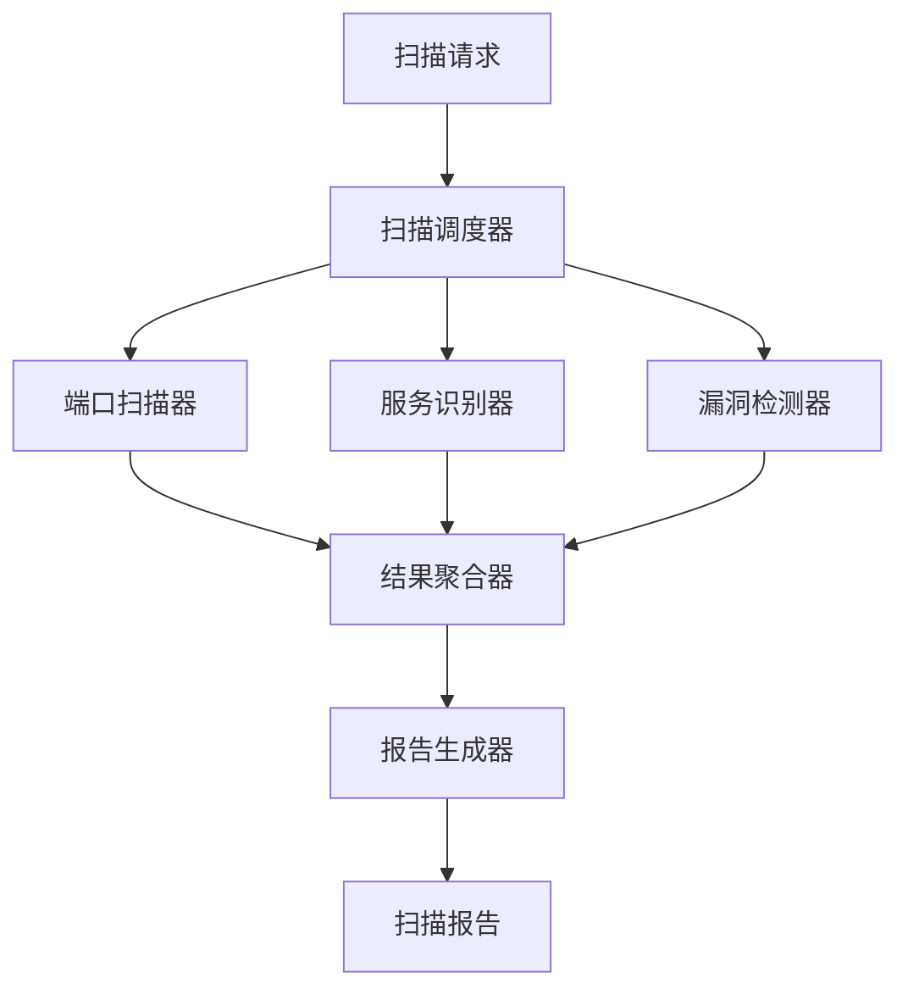

# 08-网络安全 (Cybersecurity)

## 01-安全扫描工具 (Security Scanning Tools)

### 1. 概述

### 1.1 定义与目标

安全扫描工具是网络安全体系中的核心组件，用于主动发现和识别系统中的安全漏洞、配置错误和潜在威胁。

**形式化定义**：
设 $S$ 为系统集合，$V$ 为漏洞集合，$C$ 为配置集合，安全扫描函数 $f: S \rightarrow P(V \cup C)$ 定义为：
$$f(s) = \{v \in V | \exists p \in P(s): v(p) = true\} \cup \{c \in C | \neg valid(c, s)\}$$

其中 $P(s)$ 表示系统 $s$ 的所有可能路径，$v(p)$ 表示漏洞 $v$ 在路径 $p$ 上的存在性，$valid(c, s)$ 表示配置 $c$ 在系统 $s$ 中的有效性。

### 1.2 核心特性

- **完整性**：覆盖所有可能的攻击向量
- **准确性**：最小化误报和漏报
- **性能**：高效扫描大规模系统
- **可扩展性**：支持新的漏洞类型和扫描策略

### 2. 架构设计

### 2.1 分层架构

```go
// 安全扫描器核心架构
type SecurityScanner struct {
    // 扫描引擎层
    engine *ScanEngine
    
    // 漏洞数据库层
    vulnDB *VulnerabilityDatabase
    
    // 报告生成层
    reporter *ReportGenerator
    
    // 配置管理层
    config *ScannerConfig
}

// 扫描引擎接口
type ScanEngine interface {
    Scan(target Target) (*ScanResult, error)
    RegisterPlugin(plugin ScanPlugin) error
    GetStatus() ScanStatus
}

// 扫描插件接口
type ScanPlugin interface {
    Name() string
    Version() string
    Scan(target Target) (*PluginResult, error)
    GetMetadata() PluginMetadata
}
```

### 2.2 组件交互图



## 3. 核心算法实现

### 3.1 端口扫描算法

#### 3.1.1 TCP SYN扫描

```go
// TCP SYN扫描实现
type TCPSynScanner struct {
    timeout time.Duration
    workers int
}

func (s *TCPSynScanner) Scan(target string, ports []int) (*PortScanResult, error) {
    result := &PortScanResult{
        Target: target,
        Ports:  make(map[int]PortStatus),
    }
    
    // 创建扫描任务队列
    tasks := make(chan int, len(ports))
    results := make(chan PortResult, len(ports))
    
    // 启动工作协程
    var wg sync.WaitGroup
    for i := 0; i < s.workers; i++ {
        wg.Add(1)
        go func() {
            defer wg.Done()
            for port := range tasks {
                status := s.scanPort(target, port)
                results <- PortResult{Port: port, Status: status}
            }
        }()
    }
    
    // 发送任务
    for _, port := range ports {
        tasks <- port
    }
    close(tasks)
    
    // 等待完成并收集结果
    go func() {
        wg.Wait()
        close(results)
    }()
    
    for res := range results {
        result.Ports[res.Port] = res.Status
    }
    
    return result, nil
}

func (s *TCPSynScanner) scanPort(target string, port int) PortStatus {
    conn, err := net.DialTimeout("tcp", fmt.Sprintf("%s:%d", target, port), s.timeout)
    if err != nil {
        return PortStatusClosed
    }
    defer conn.Close()
    
    return PortStatusOpen
}
```

#### 3.1.2 算法复杂度分析

**时间复杂度**：$O(n \cdot m)$，其中 $n$ 为目标端口数，$m$ 为平均连接超时时间。

**空间复杂度**：$O(n)$，用于存储端口状态结果。

**并发优化**：使用工作池模式，时间复杂度优化为 $O(\frac{n \cdot m}{w})$，其中 $w$ 为工作协程数。

### 3.2 服务识别算法

#### 3.2.1 指纹识别

```go
// 服务指纹识别
type ServiceFingerprinter struct {
    signatures map[string]*ServiceSignature
}

type ServiceSignature struct {
    Service     string
    Version     string
    Confidence  float64
    Patterns    []Pattern
}

type Pattern struct {
    Type    PatternType
    Content string
    Offset  int
}

func (f *ServiceFingerprinter) IdentifyService(port int, banner string) *ServiceInfo {
    var bestMatch *ServiceSignature
    maxConfidence := 0.0
    
    for _, sig := range f.signatures {
        confidence := f.calculateMatch(banner, sig)
        if confidence > maxConfidence {
            maxConfidence = confidence
            bestMatch = sig
        }
    }
    
    if bestMatch != nil && maxConfidence > 0.7 {
        return &ServiceInfo{
            Service:    bestMatch.Service,
            Version:    bestMatch.Version,
            Confidence: maxConfidence,
            Port:       port,
        }
    }
    
    return nil
}

func (f *ServiceFingerprinter) calculateMatch(banner string, sig *ServiceSignature) float64 {
    totalScore := 0.0
    totalWeight := 0.0
    
    for _, pattern := range sig.Patterns {
        weight := f.getPatternWeight(pattern.Type)
        score := f.matchPattern(banner, pattern)
        totalScore += score * weight
        totalWeight += weight
    }
    
    if totalWeight == 0 {
        return 0
    }
    
    return totalScore / totalWeight
}
```

### 3.3 漏洞检测算法

#### 3.3.1 基于签名的检测

```go
// 漏洞检测引擎
type VulnerabilityDetector struct {
    rules []VulnerabilityRule
    cache *ResultCache
}

type VulnerabilityRule struct {
    ID          string
    Name        string
    Description string
    Severity    SeverityLevel
    CVE         string
    Patterns    []DetectionPattern
    Conditions  []Condition
}

func (d *VulnerabilityDetector) Detect(target Target) ([]Vulnerability, error) {
    var vulnerabilities []Vulnerability
    
    // 检查缓存
    if cached := d.cache.Get(target.ID); cached != nil {
        return cached, nil
    }
    
    // 并行检测所有规则
    var wg sync.WaitGroup
    results := make(chan []Vulnerability, len(d.rules))
    
    for _, rule := range d.rules {
        wg.Add(1)
        go func(r VulnerabilityRule) {
            defer wg.Done()
            if vulns := d.checkRule(target, r); len(vulns) > 0 {
                results <- vulns
            }
        }(rule)
    }
    
    // 收集结果
    go func() {
        wg.Wait()
        close(results)
    }()
    
    for vulns := range results {
        vulnerabilities = append(vulnerabilities, vulns...)
    }
    
    // 缓存结果
    d.cache.Set(target.ID, vulnerabilities)
    
    return vulnerabilities, nil
}

func (d *VulnerabilityDetector) checkRule(target Target, rule VulnerabilityRule) []Vulnerability {
    var vulns []Vulnerability
    
    // 检查所有条件
    allConditionsMet := true
    for _, condition := range rule.Conditions {
        if !d.evaluateCondition(target, condition) {
            allConditionsMet = false
            break
        }
    }
    
    if !allConditionsMet {
        return vulns
    }
    
    // 检查所有模式
    for _, pattern := range rule.Patterns {
        if d.matchPattern(target, pattern) {
            vulns = append(vulns, Vulnerability{
                Rule:      rule,
                Target:    target,
                Evidence:  d.collectEvidence(target, pattern),
                Timestamp: time.Now(),
            })
        }
    }
    
    return vulns
}
```

## 4. 高级特性

### 4.1 智能扫描策略

```go
// 自适应扫描策略
type AdaptiveScanStrategy struct {
    baseStrategy ScanStrategy
    learning     *LearningEngine
    history      *ScanHistory
}

func (s *AdaptiveScanStrategy) OptimizeStrategy(target Target) ScanStrategy {
    // 分析历史数据
    historicalData := s.history.GetTargetHistory(target.ID)
    
    // 学习最优参数
    optimalParams := s.learning.OptimizeParameters(historicalData)
    
    // 生成优化策略
    return &OptimizedStrategy{
        BaseStrategy: s.baseStrategy,
        Parameters:   optimalParams,
    }
}

// 机器学习优化
type LearningEngine struct {
    model *MLModel
}

func (l *LearningEngine) OptimizeParameters(history []ScanResult) ScanParameters {
    features := l.extractFeatures(history)
    predictions := l.model.Predict(features)
    
    return ScanParameters{
        Timeout:     predictions.OptimalTimeout,
        Concurrency: predictions.OptimalConcurrency,
        Depth:       predictions.OptimalDepth,
    }
}
```

### 4.2 分布式扫描

```go
// 分布式扫描协调器
type DistributedScanner struct {
    coordinator *ScanCoordinator
    workers     []*ScanWorker
    scheduler   *TaskScheduler
}

func (d *DistributedScanner) Scan(targets []Target) (*DistributedScanResult, error) {
    // 任务分解
    tasks := d.scheduler.DecomposeTasks(targets)
    
    // 任务分发
    for _, task := range tasks {
        worker := d.scheduler.SelectWorker(task)
        worker.AssignTask(task)
    }
    
    // 结果聚合
    results := d.coordinator.AggregateResults()
    
    return results, nil
}

// 负载均衡算法
func (s *TaskScheduler) SelectWorker(task ScanTask) *ScanWorker {
    var bestWorker *ScanWorker
    minLoad := math.MaxFloat64
    
    for _, worker := range s.workers {
        load := worker.GetCurrentLoad()
        if load < minLoad {
            minLoad = load
            bestWorker = worker
        }
    }
    
    return bestWorker
}
```

## 5. 性能优化

### 5.1 并发控制

```go
// 智能并发控制器
type ConcurrencyController struct {
    maxWorkers    int
    currentLoad   int32
    rateLimiter   *RateLimiter
    loadBalancer  *LoadBalancer
}

func (c *ConcurrencyController) ExecuteTask(task func() error) error {
    // 检查负载
    if atomic.LoadInt32(&c.currentLoad) >= int32(c.maxWorkers) {
        return ErrTooManyConcurrentTasks
    }
    
    // 速率限制
    if !c.rateLimiter.Allow() {
        return ErrRateLimitExceeded
    }
    
    // 执行任务
    atomic.AddInt32(&c.currentLoad, 1)
    defer atomic.AddInt32(&c.currentLoad, -1)
    
    return task()
}
```

### 5.2 内存优化

```go
// 内存池管理
type MemoryPool struct {
    pools map[int]*sync.Pool
}

func (m *MemoryPool) Get(size int) interface{} {
    pool, exists := m.pools[size]
    if !exists {
        pool = &sync.Pool{
            New: func() interface{} {
                return make([]byte, size)
            },
        }
        m.pools[size] = pool
    }
    
    return pool.Get()
}

func (m *MemoryPool) Put(size int, obj interface{}) {
    if pool, exists := m.pools[size]; exists {
        pool.Put(obj)
    }
}
```

## 6. 安全考虑

### 6.1 扫描伦理

```go
// 扫描权限验证
type ScanPermissionValidator struct {
    whitelist    map[string]bool
    blacklist    map[string]bool
    rateLimits   map[string]*RateLimit
}

func (v *ScanPermissionValidator) ValidatePermission(target Target, requester string) error {
    // 检查白名单
    if !v.whitelist[target.ID] {
        return ErrTargetNotWhitelisted
    }
    
    // 检查黑名单
    if v.blacklist[target.ID] {
        return ErrTargetBlacklisted
    }
    
    // 检查速率限制
    if limit := v.rateLimits[requester]; limit != nil {
        if !limit.Allow() {
            return ErrRateLimitExceeded
        }
    }
    
    return nil
}
```

### 6.2 数据保护

```go
// 敏感数据处理
type SensitiveDataProcessor struct {
    encryption   *EncryptionService
    anonymizer   *DataAnonymizer
    retention    *RetentionPolicy
}

func (p *SensitiveDataProcessor) ProcessScanData(data *ScanData) (*ProcessedData, error) {
    // 数据脱敏
    anonymized := p.anonymizer.Anonymize(data)
    
    // 数据加密
    encrypted := p.encryption.Encrypt(anonymized)
    
    // 应用保留策略
    p.retention.Apply(encrypted)
    
    return &ProcessedData{
        Data:      encrypted,
        Processed: time.Now(),
    }, nil
}
```

## 7. 监控与告警

### 7.1 实时监控

```go
// 扫描监控系统
type ScanMonitor struct {
    metrics    *MetricsCollector
    alerts     *AlertManager
    dashboard  *Dashboard
}

func (m *ScanMonitor) MonitorScan(scanID string) {
    // 收集指标
    metrics := m.metrics.Collect(scanID)
    
    // 检查告警条件
    if alerts := m.checkAlertConditions(metrics); len(alerts) > 0 {
        m.alerts.SendAlerts(alerts)
    }
    
    // 更新仪表板
    m.dashboard.Update(metrics)
}

func (m *ScanMonitor) checkAlertConditions(metrics *ScanMetrics) []Alert {
    var alerts []Alert
    
    // 检查扫描失败率
    if metrics.FailureRate > 0.1 {
        alerts = append(alerts, Alert{
            Type:    AlertTypeHighFailureRate,
            Message: fmt.Sprintf("Scan failure rate: %.2f%%", metrics.FailureRate*100),
            Level:   AlertLevelWarning,
        })
    }
    
    // 检查性能问题
    if metrics.AverageResponseTime > 5*time.Second {
        alerts = append(alerts, Alert{
            Type:    AlertTypePerformanceIssue,
            Message: fmt.Sprintf("High response time: %v", metrics.AverageResponseTime),
            Level:   AlertLevelWarning,
        })
    }
    
    return alerts
}
```

## 8. 集成与扩展

### 8.1 插件系统

```go
// 插件管理器
type PluginManager struct {
    plugins map[string]ScanPlugin
    loader  *PluginLoader
}

func (p *PluginManager) LoadPlugin(path string) error {
    plugin, err := p.loader.Load(path)
    if err != nil {
        return err
    }
    
    p.plugins[plugin.Name()] = plugin
    return nil
}

func (p *PluginManager) ExecutePlugin(name string, target Target) (*PluginResult, error) {
    plugin, exists := p.plugins[name]
    if !exists {
        return nil, ErrPluginNotFound
    }
    
    return plugin.Scan(target)
}
```

### 8.2 API集成

```go
// RESTful API服务
type ScanAPIServer struct {
    scanner *SecurityScanner
    router  *mux.Router
}

func (s *ScanAPIServer) Start() error {
    s.setupRoutes()
    
    return http.ListenAndServe(":8080", s.router)
}

func (s *ScanAPIServer) setupRoutes() {
    s.router.HandleFunc("/api/v1/scan", s.handleScanRequest).Methods("POST")
    s.router.HandleFunc("/api/v1/scan/{id}", s.handleScanStatus).Methods("GET")
    s.router.HandleFunc("/api/v1/scan/{id}/report", s.handleScanReport).Methods("GET")
}

func (s *ScanAPIServer) handleScanRequest(w http.ResponseWriter, r *http.Request) {
    var req ScanRequest
    if err := json.NewDecoder(r.Body).Decode(&req); err != nil {
        http.Error(w, err.Error(), http.StatusBadRequest)
        return
    }
    
    result, err := s.scanner.Scan(req.Target)
    if err != nil {
        http.Error(w, err.Error(), http.StatusInternalServerError)
        return
    }
    
    json.NewEncoder(w).Encode(result)
}
```

## 9. 总结

安全扫描工具是现代网络安全体系的重要组成部分。通过Go语言的高并发特性和内存安全机制，我们可以构建高效、可靠的安全扫描系统。

### 9.1 关键优势

1. **高性能**：Go的goroutine和channel机制提供优秀的并发性能
2. **内存安全**：避免缓冲区溢出等常见安全问题
3. **可扩展性**：模块化设计支持插件扩展
4. **可维护性**：清晰的代码结构和类型系统

### 9.2 未来发展方向

1. **AI集成**：机器学习算法优化扫描策略
2. **云原生**：容器化和微服务架构
3. **实时性**：流式处理和实时告警
4. **标准化**：行业标准接口和协议支持

---

**相关链接**：

- [02-入侵检测系统](../02-Intrusion-Detection-System/README.md)
- [03-加密服务](../03-Encryption-Services/README.md)
- [04-身份认证](../04-Identity-Authentication/README.md)
- [返回上级目录](../../README.md)
