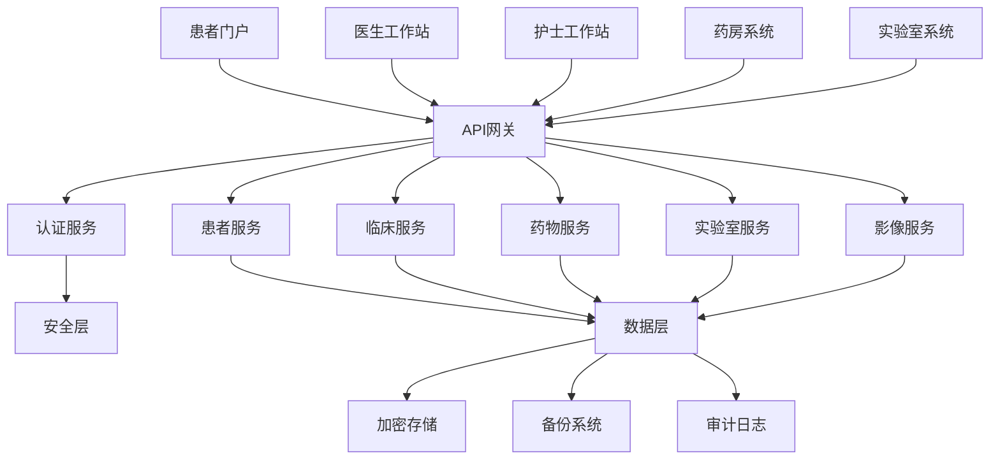

# 01-医疗信息系统 (Medical Information System)

## 目录

1. [概述](#1-概述)
2. [形式化定义](#2-形式化定义)
3. [架构设计](#3-架构设计)
4. [Go语言实现](#4-go语言实现)
5. [数据安全](#5-数据安全)
6. [合规性](#6-合规性)
7. [性能优化](#7-性能优化)
8. [应用场景](#8-应用场景)

## 1. 概述

### 1.1 定义与目标

医疗信息系统是医疗健康领域的核心基础设施，用于管理患者信息、临床数据、药物管理和医疗流程。

**形式化定义**：

```math
MIS = (P, C, M, L, I, S)
```

其中：

- P: 患者集合 (Patient Set)
- C: 临床数据集合 (Clinical Data Set)
- M: 药物管理集合 (Medication Management Set)
- L: 实验室数据集合 (Laboratory Data Set)
- I: 影像数据集合 (Imaging Data Set)
- S: 安全策略集合 (Security Policy Set)

### 1.2 核心功能

1. **患者管理** - 患者信息、病历、保险
2. **临床数据** - 生命体征、诊断、治疗计划
3. **药物管理** - 药物订单、分发、给药记录
4. **实验室管理** - 检验申请、结果管理
5. **影像管理** - DICOM影像、AI分析
6. **安全合规** - HIPAA合规、数据加密

## 2. 形式化定义

### 2.1 患者数据模型

```math
Patient = (ID, Demographics, MedicalHistory, Insurance, EmergencyContacts)

Demographics = (Name, DOB, Gender, Address, Contact)
MedicalHistory = (Allergies, Conditions, Medications, Procedures)
Insurance = (Provider, PolicyNumber, Coverage, Authorization)
```

### 2.2 临床数据模型

```math
ClinicalRecord = (PatientID, EncounterID, RecordType, Data, Provider, Timestamp)

RecordType ∈ {VitalSigns, LabResult, Imaging, Medication, Diagnosis, Procedure}

VitalSigns = (Temperature, BloodPressure, HeartRate, RespiratoryRate, OxygenSaturation)
```

### 2.3 安全访问模型

```math
AccessControl = (Subject, Object, Action, Context, Decision)

Subject ∈ {Doctor, Nurse, Pharmacist, Patient, Administrator}
Object ∈ {PatientData, ClinicalData, MedicationData, LabData}
Action ∈ {Read, Write, Create, Delete, Update}
Context = (Time, Location, Purpose, Emergency)
Decision ∈ {Allow, Deny, Audit}
```

## 3. 架构设计

### 3.1 系统架构图



### 3.2 微服务架构

```go
// MedicalInformationSystem 医疗信息系统主结构
type MedicalInformationSystem struct {
    patientService    *PatientService
    clinicalService   *ClinicalService
    medicationService *MedicationService
    labService        *LabService
    imagingService    *ImagingService
    securityService   *SecurityService
    auditService      *AuditService
}

// ServiceConfig 服务配置
type ServiceConfig struct {
    DatabaseURL      string        `json:"database_url"`
    RedisURL         string        `json:"redis_url"`
    JWTSecret        string        `json:"jwt_secret"`
    EncryptionKey    string        `json:"encryption_key"`
    HIPAACompliant   bool          `json:"hipaa_compliant"`
    AuditEnabled     bool          `json:"audit_enabled"`
    BackupInterval   time.Duration `json:"backup_interval"`
}

// NewMedicalInformationSystem 创建医疗信息系统
func NewMedicalInformationSystem(config *ServiceConfig) *MedicalInformationSystem {
    return &MedicalInformationSystem{
        patientService:    NewPatientService(config),
        clinicalService:   NewClinicalService(config),
        medicationService: NewMedicationService(config),
        labService:        NewLabService(config),
        imagingService:    NewImagingService(config),
        securityService:   NewSecurityService(config),
        auditService:      NewAuditService(config),
    }
}
```

## 4. Go语言实现

### 4.1 患者服务实现

```go
package healthcare

import (
    "context"
    "crypto/aes"
    "crypto/cipher"
    "crypto/rand"
    "encoding/json"
    "fmt"
    "time"
    "golang.org/x/crypto/bcrypt"
)

// PatientService 患者服务
type PatientService struct {
    db           *Database
    encryptor    *DataEncryptor
    validator    *DataValidator
    auditLogger  *AuditLogger
}

// Patient 患者信息
type Patient struct {
    ID                string    `json:"id"`
    MRN               string    `json:"mrn"` // Medical Record Number
    Demographics      Demographics `json:"demographics"`
    MedicalHistory    MedicalHistory `json:"medical_history"`
    Insurance         Insurance `json:"insurance"`
    EmergencyContacts []EmergencyContact `json:"emergency_contacts"`
    CreatedAt         time.Time `json:"created_at"`
    UpdatedAt         time.Time `json:"updated_at"`
}

// Demographics 人口统计学信息
type Demographics struct {
    FirstName         string    `json:"first_name"`
    LastName          string    `json:"last_name"`
    MiddleName        string    `json:"middle_name,omitempty"`
    DateOfBirth       time.Time `json:"date_of_birth"`
    Gender            Gender    `json:"gender"`
    Race              string    `json:"race,omitempty"`
    Ethnicity         string    `json:"ethnicity,omitempty"`
    Address           Address   `json:"address"`
    PhoneNumbers      []PhoneNumber `json:"phone_numbers"`
    Email             string    `json:"email,omitempty"`
    LanguagePreference string   `json:"language_preference"`
}

// Gender 性别
type Gender string

const (
    GenderMale   Gender = "male"
    GenderFemale Gender = "female"
    GenderOther  Gender = "other"
)

// Address 地址
type Address struct {
    Street1    string `json:"street1"`
    Street2    string `json:"street2,omitempty"`
    City       string `json:"city"`
    State      string `json:"state"`
    PostalCode string `json:"postal_code"`
    Country    string `json:"country"`
}

// PhoneNumber 电话号码
type PhoneNumber struct {
    Type   string `json:"type"` // home, mobile, work
    Number string `json:"number"`
}

// MedicalHistory 病史
type MedicalHistory struct {
    Allergies    []Allergy    `json:"allergies"`
    Conditions   []Condition  `json:"conditions"`
    Medications  []Medication `json:"medications"`
    Procedures   []Procedure  `json:"procedures"`
    FamilyHistory []FamilyHistory `json:"family_history"`
}

// Allergy 过敏
type Allergy struct {
    ID          string    `json:"id"`
    Allergen    string    `json:"allergen"`
    Reaction    string    `json:"reaction"`
    Severity    Severity  `json:"severity"`
    OnsetDate   time.Time `json:"onset_date"`
    Status      string    `json:"status"` // active, inactive
}

// Severity 严重程度
type Severity string

const (
    SeverityMild     Severity = "mild"
    SeverityModerate Severity = "moderate"
    SeveritySevere   Severity = "severe"
    SeverityCritical Severity = "critical"
)

// Insurance 保险信息
type Insurance struct {
    PrimaryInsurance   InsuranceProvider `json:"primary_insurance"`
    SecondaryInsurance *InsuranceProvider `json:"secondary_insurance,omitempty"`
    MedicareNumber     string            `json:"medicare_number,omitempty"`
    MedicaidNumber     string            `json:"medicaid_number,omitempty"`
}

// InsuranceProvider 保险提供商
type InsuranceProvider struct {
    Provider      string    `json:"provider"`
    PolicyNumber  string    `json:"policy_number"`
    GroupNumber   string    `json:"group_number,omitempty"`
    EffectiveDate time.Time `json:"effective_date"`
    ExpirationDate *time.Time `json:"expiration_date,omitempty"`
    Copay         *float64   `json:"copay,omitempty"`
    Deductible    *float64   `json:"deductible,omitempty"`
}

// EmergencyContact 紧急联系人
type EmergencyContact struct {
    Name         string `json:"name"`
    Relationship string `json:"relationship"`
    PhoneNumber  string `json:"phone_number"`
    Address      string `json:"address,omitempty"`
}

// NewPatientService 创建患者服务
func NewPatientService(config *ServiceConfig) *PatientService {
    return &PatientService{
        db:          NewDatabase(config.DatabaseURL),
        encryptor:   NewDataEncryptor(config.EncryptionKey),
        validator:   NewDataValidator(),
        auditLogger: NewAuditLogger(),
    }
}

// CreatePatient 创建患者
func (ps *PatientService) CreatePatient(ctx context.Context, patient *Patient) (*Patient, error) {
    // 1. 验证数据
    if err := ps.validator.ValidatePatient(patient); err != nil {
        return nil, fmt.Errorf("validation failed: %w", err)
    }
    
    // 2. 生成MRN
    patient.MRN = ps.generateMRN()
    
    // 3. 加密敏感数据
    encryptedPatient, err := ps.encryptor.EncryptPatient(patient)
    if err != nil {
        return nil, fmt.Errorf("encryption failed: %w", err)
    }
    
    // 4. 存储到数据库
    if err := ps.db.CreatePatient(ctx, encryptedPatient); err != nil {
        return nil, fmt.Errorf("database error: %w", err)
    }
    
    // 5. 记录审计日志
    ps.auditLogger.LogPatientCreation(ctx, patient.ID, "patient_created")
    
    return patient, nil
}

// GetPatient 获取患者信息
func (ps *PatientService) GetPatient(ctx context.Context, patientID string) (*Patient, error) {
    // 1. 检查访问权限
    if err := ps.checkAccessPermission(ctx, patientID, "read"); err != nil {
        return nil, fmt.Errorf("access denied: %w", err)
    }
    
    // 2. 从数据库获取加密数据
    encryptedPatient, err := ps.db.GetPatient(ctx, patientID)
    if err != nil {
        return nil, fmt.Errorf("database error: %w", err)
    }
    
    // 3. 解密数据
    patient, err := ps.encryptor.DecryptPatient(encryptedPatient)
    if err != nil {
        return nil, fmt.Errorf("decryption failed: %w", err)
    }
    
    // 4. 记录审计日志
    ps.auditLogger.LogPatientAccess(ctx, patientID, "patient_accessed")
    
    return patient, nil
}

// UpdatePatient 更新患者信息
func (ps *PatientService) UpdatePatient(ctx context.Context, patientID string, updates *Patient) (*Patient, error) {
    // 1. 检查访问权限
    if err := ps.checkAccessPermission(ctx, patientID, "write"); err != nil {
        return nil, fmt.Errorf("access denied: %w", err)
    }
    
    // 2. 获取现有患者数据
    existingPatient, err := ps.GetPatient(ctx, patientID)
    if err != nil {
        return nil, err
    }
    
    // 3. 合并更新
    updatedPatient := ps.mergePatientData(existingPatient, updates)
    
    // 4. 验证更新后的数据
    if err := ps.validator.ValidatePatient(updatedPatient); err != nil {
        return nil, fmt.Errorf("validation failed: %w", err)
    }
    
    // 5. 加密数据
    encryptedPatient, err := ps.encryptor.EncryptPatient(updatedPatient)
    if err != nil {
        return nil, fmt.Errorf("encryption failed: %w", err)
    }
    
    // 6. 更新数据库
    if err := ps.db.UpdatePatient(ctx, patientID, encryptedPatient); err != nil {
        return nil, fmt.Errorf("database error: %w", err)
    }
    
    // 7. 记录审计日志
    ps.auditLogger.LogPatientUpdate(ctx, patientID, "patient_updated")
    
    return updatedPatient, nil
}

// generateMRN 生成医疗记录号
func (ps *PatientService) generateMRN() string {
    // 生成唯一的医疗记录号
    timestamp := time.Now().Unix()
    random := fmt.Sprintf("%06d", rand.Intn(1000000))
    return fmt.Sprintf("MRN%d%s", timestamp, random)
}

// checkAccessPermission 检查访问权限
func (ps *PatientService) checkAccessPermission(ctx context.Context, patientID, action string) error {
    // 实现基于角色的访问控制
    user := ctx.Value("user").(User)
    
    // 检查用户是否有权限访问该患者
    if !ps.hasPermission(user, patientID, action) {
        return fmt.Errorf("insufficient permissions")
    }
    
    return nil
}

// hasPermission 检查权限
func (ps *PatientService) hasPermission(user User, patientID, action string) bool {
    // 实现权限检查逻辑
    switch user.Role {
    case "doctor", "nurse":
        return ps.canAccessPatient(user, patientID)
    case "patient":
        return user.ID == patientID
    case "admin":
        return true
    default:
        return false
    }
}

// canAccessPatient 检查是否可以访问患者
func (ps *PatientService) canAccessPatient(user User, patientID string) bool {
    // 检查用户是否被分配了该患者
    // 这里需要查询用户-患者关联表
    return true // 简化实现
}
```

### 4.2 临床服务实现

```go
// ClinicalService 临床服务
type ClinicalService struct {
    db           *Database
    encryptor    *DataEncryptor
    validator    *DataValidator
    auditLogger  *AuditLogger
    alertService *AlertService
}

// ClinicalRecord 临床记录
type ClinicalRecord struct {
    ID          string           `json:"id"`
    PatientID   string           `json:"patient_id"`
    EncounterID string           `json:"encounter_id"`
    RecordType  ClinicalRecordType `json:"record_type"`
    Data        ClinicalData     `json:"data"`
    Provider    Provider         `json:"provider"`
    Timestamp   time.Time        `json:"timestamp"`
    Status      RecordStatus     `json:"status"`
}

// ClinicalRecordType 临床记录类型
type ClinicalRecordType string

const (
    RecordTypeVitalSigns        ClinicalRecordType = "vital_signs"
    RecordTypeLabResult         ClinicalRecordType = "lab_result"
    RecordTypeImaging           ClinicalRecordType = "imaging"
    RecordTypeMedication        ClinicalRecordType = "medication"
    RecordTypeDiagnosis         ClinicalRecordType = "diagnosis"
    RecordTypeProcedure         ClinicalRecordType = "procedure"
    RecordTypeProgressNote      ClinicalRecordType = "progress_note"
    RecordTypeDischargeSummary  ClinicalRecordType = "discharge_summary"
)

// ClinicalData 临床数据
type ClinicalData struct {
    VitalSigns     *VitalSigns     `json:"vital_signs,omitempty"`
    LabResult      *LabResult      `json:"lab_result,omitempty"`
    ImagingResult  *ImagingResult  `json:"imaging_result,omitempty"`
    Medication     *MedicationData `json:"medication,omitempty"`
    Diagnosis      *Diagnosis      `json:"diagnosis,omitempty"`
    Procedure      *Procedure      `json:"procedure,omitempty"`
    ProgressNote   *ProgressNote   `json:"progress_note,omitempty"`
    DischargeSummary *DischargeSummary `json:"discharge_summary,omitempty"`
}

// VitalSigns 生命体征
type VitalSigns struct {
    Temperature       *float64      `json:"temperature,omitempty"`
    BloodPressure     *BloodPressure `json:"blood_pressure,omitempty"`
    HeartRate         *int          `json:"heart_rate,omitempty"`
    RespiratoryRate   *int          `json:"respiratory_rate,omitempty"`
    OxygenSaturation  *float64      `json:"oxygen_saturation,omitempty"`
    Height            *float64      `json:"height,omitempty"`
    Weight            *float64      `json:"weight,omitempty"`
    BMI               *float64      `json:"bmi,omitempty"`
    PainScale         *int          `json:"pain_scale,omitempty"`
    Consciousness     string        `json:"consciousness,omitempty"`
}

// BloodPressure 血压
type BloodPressure struct {
    Systolic  int    `json:"systolic"`
    Diastolic int    `json:"diastolic"`
    Unit      string `json:"unit"`
    Position  string `json:"position,omitempty"` // sitting, standing, lying
}

// LabResult 实验室结果
type LabResult struct {
    TestName       string        `json:"test_name"`
    TestCode       string        `json:"test_code"`
    ResultValue    string        `json:"result_value"`
    Unit           string        `json:"unit,omitempty"`
    ReferenceRange string        `json:"reference_range,omitempty"`
    AbnormalFlag   AbnormalFlag  `json:"abnormal_flag,omitempty"`
    PerformedAt    time.Time     `json:"performed_at"`
    ReportedAt     time.Time     `json:"reported_at"`
    Comments       string        `json:"comments,omitempty"`
}

// AbnormalFlag 异常标志
type AbnormalFlag string

const (
    AbnormalFlagHigh     AbnormalFlag = "high"
    AbnormalFlagLow      AbnormalFlag = "low"
    AbnormalFlagCritical AbnormalFlag = "critical"
    AbnormalFlagNormal   AbnormalFlag = "normal"
)

// Provider 医疗提供者
type Provider struct {
    ID          string `json:"id"`
    Name        string `json:"name"`
    Type        string `json:"type"` // doctor, nurse, pharmacist
    Specialty   string `json:"specialty,omitempty"`
    License     string `json:"license,omitempty"`
    Department  string `json:"department,omitempty"`
}

// RecordStatus 记录状态
type RecordStatus string

const (
    RecordStatusDraft     RecordStatus = "draft"
    RecordStatusPending   RecordStatus = "pending"
    RecordStatusFinal     RecordStatus = "final"
    RecordStatusAmended   RecordStatus = "amended"
    RecordStatusCancelled RecordStatus = "cancelled"
)

// NewClinicalService 创建临床服务
func NewClinicalService(config *ServiceConfig) *ClinicalService {
    return &ClinicalService{
        db:           NewDatabase(config.DatabaseURL),
        encryptor:    NewDataEncryptor(config.EncryptionKey),
        validator:    NewDataValidator(),
        auditLogger:  NewAuditLogger(),
        alertService: NewAlertService(),
    }
}

// CreateClinicalRecord 创建临床记录
func (cs *ClinicalService) CreateClinicalRecord(ctx context.Context, record *ClinicalRecord) (*ClinicalRecord, error) {
    // 1. 验证数据
    if err := cs.validator.ValidateClinicalRecord(record); err != nil {
        return nil, fmt.Errorf("validation failed: %w", err)
    }
    
    // 2. 检查异常值并生成告警
    if alerts := cs.checkAbnormalValues(record); len(alerts) > 0 {
        for _, alert := range alerts {
            cs.alertService.SendAlert(ctx, alert)
        }
    }
    
    // 3. 加密敏感数据
    encryptedRecord, err := cs.encryptor.EncryptClinicalRecord(record)
    if err != nil {
        return nil, fmt.Errorf("encryption failed: %w", err)
    }
    
    // 4. 存储到数据库
    if err := cs.db.CreateClinicalRecord(ctx, encryptedRecord); err != nil {
        return nil, fmt.Errorf("database error: %w", err)
    }
    
    // 5. 记录审计日志
    cs.auditLogger.LogClinicalRecordCreation(ctx, record.ID, record.RecordType)
    
    return record, nil
}

// GetClinicalRecords 获取临床记录
func (cs *ClinicalService) GetClinicalRecords(ctx context.Context, patientID string, recordType *ClinicalRecordType) ([]*ClinicalRecord, error) {
    // 1. 检查访问权限
    if err := cs.checkAccessPermission(ctx, patientID, "read"); err != nil {
        return nil, fmt.Errorf("access denied: %w", err)
    }
    
    // 2. 从数据库获取加密数据
    encryptedRecords, err := cs.db.GetClinicalRecords(ctx, patientID, recordType)
    if err != nil {
        return nil, fmt.Errorf("database error: %w", err)
    }
    
    // 3. 解密数据
    var records []*ClinicalRecord
    for _, encryptedRecord := range encryptedRecords {
        record, err := cs.encryptor.DecryptClinicalRecord(encryptedRecord)
        if err != nil {
            return nil, fmt.Errorf("decryption failed: %w", err)
        }
        records = append(records, record)
    }
    
    // 4. 记录审计日志
    cs.auditLogger.LogClinicalRecordAccess(ctx, patientID, recordType)
    
    return records, nil
}

// checkAbnormalValues 检查异常值
func (cs *ClinicalService) checkAbnormalValues(record *ClinicalRecord) []Alert {
    var alerts []Alert
    
    if record.RecordType == RecordTypeVitalSigns && record.Data.VitalSigns != nil {
        vs := record.Data.VitalSigns
        
        // 检查血压
        if vs.BloodPressure != nil {
            if vs.BloodPressure.Systolic > 180 || vs.BloodPressure.Systolic < 90 {
                alerts = append(alerts, Alert{
                    Type:      "vital_signs_abnormal",
                    Severity:  "high",
                    Message:   fmt.Sprintf("Abnormal blood pressure: %d/%d", vs.BloodPressure.Systolic, vs.BloodPressure.Diastolic),
                    PatientID: record.PatientID,
                })
            }
        }
        
        // 检查心率
        if vs.HeartRate != nil {
            if *vs.HeartRate > 120 || *vs.HeartRate < 50 {
                alerts = append(alerts, Alert{
                    Type:      "vital_signs_abnormal",
                    Severity:  "medium",
                    Message:   fmt.Sprintf("Abnormal heart rate: %d", *vs.HeartRate),
                    PatientID: record.PatientID,
                })
            }
        }
        
        // 检查血氧饱和度
        if vs.OxygenSaturation != nil {
            if *vs.OxygenSaturation < 95 {
                alerts = append(alerts, Alert{
                    Type:      "vital_signs_abnormal",
                    Severity:  "critical",
                    Message:   fmt.Sprintf("Low oxygen saturation: %.1f%%", *vs.OxygenSaturation),
                    PatientID: record.PatientID,
                })
            }
        }
    }
    
    return alerts
}
```

## 5. 数据安全

### 5.1 加密存储

```go
// DataEncryptor 数据加密器
type DataEncryptor struct {
    key []byte
    aes cipher.AEAD
}

// NewDataEncryptor 创建数据加密器
func NewDataEncryptor(key string) *DataEncryptor {
    block, err := aes.NewCipher([]byte(key))
    if err != nil {
        panic(err)
    }
    
    aes, err := cipher.NewGCM(block)
    if err != nil {
        panic(err)
    }
    
    return &DataEncryptor{
        key: []byte(key),
        aes: aes,
    }
}

// EncryptPatient 加密患者数据
func (de *DataEncryptor) EncryptPatient(patient *Patient) (*EncryptedPatient, error) {
    data, err := json.Marshal(patient)
    if err != nil {
        return nil, err
    }
    
    nonce := make([]byte, de.aes.NonceSize())
    if _, err := rand.Read(nonce); err != nil {
        return nil, err
    }
    
    encrypted := de.aes.Seal(nonce, nonce, data, nil)
    
    return &EncryptedPatient{
        ID:     patient.ID,
        Data:   encrypted,
        Nonce:  nonce,
    }, nil
}

// DecryptPatient 解密患者数据
func (de *DataEncryptor) DecryptPatient(encrypted *EncryptedPatient) (*Patient, error) {
    if len(encrypted.Data) < de.aes.NonceSize() {
        return nil, fmt.Errorf("ciphertext too short")
    }
    
    nonce, ciphertext := encrypted.Data[:de.aes.NonceSize()], encrypted.Data[de.aes.NonceSize():]
    
    decrypted, err := de.aes.Open(nil, nonce, ciphertext, nil)
    if err != nil {
        return nil, err
    }
    
    var patient Patient
    if err := json.Unmarshal(decrypted, &patient); err != nil {
        return nil, err
    }
    
    return &patient, nil
}
```

### 5.2 访问控制

```go
// AccessControl 访问控制
type AccessControl struct {
    policies map[string]Policy
    cache    *lru.Cache
}

// Policy 策略
type Policy struct {
    ID          string   `json:"id"`
    Name        string   `json:"name"`
    Permissions []string `json:"permissions"`
    Resources   []string `json:"resources"`
    Conditions  []Condition `json:"conditions"`
}

// Condition 条件
type Condition struct {
    Type  string `json:"type"`
    Field string `json:"field"`
    Value string `json:"value"`
}

// CheckPermission 检查权限
func (ac *AccessControl) CheckPermission(user User, resource, action string) bool {
    cacheKey := fmt.Sprintf("%s:%s:%s", user.ID, resource, action)
    
    if cached, exists := ac.cache.Get(cacheKey); exists {
        return cached.(bool)
    }
    
    for _, policy := range ac.policies {
        if ac.matchesPolicy(user, resource, action, policy) {
            ac.cache.Add(cacheKey, true)
            return true
        }
    }
    
    ac.cache.Add(cacheKey, false)
    return false
}

// matchesPolicy 匹配策略
func (ac *AccessControl) matchesPolicy(user User, resource, action string, policy Policy) bool {
    // 检查权限
    hasPermission := false
    for _, perm := range policy.Permissions {
        if perm == action {
            hasPermission = true
            break
        }
    }
    
    if !hasPermission {
        return false
    }
    
    // 检查资源
    hasResource := false
    for _, res := range policy.Resources {
        if res == resource || res == "*" {
            hasResource = true
            break
        }
    }
    
    if !hasResource {
        return false
    }
    
    // 检查条件
    for _, condition := range policy.Conditions {
        if !ac.evaluateCondition(user, condition) {
            return false
        }
    }
    
    return true
}
```

## 6. 合规性

### 6.1 HIPAA合规

```go
// HIPAACompliance HIPAA合规检查器
type HIPAACompliance struct {
    privacyRules []PrivacyRule
    securityRules []SecurityRule
    auditLogger  *AuditLogger
}

// PrivacyRule 隐私规则
type PrivacyRule struct {
    ID          string `json:"id"`
    Name        string `json:"name"`
    Description string `json:"description"`
    Check       func(interface{}) error `json:"-"`
}

// SecurityRule 安全规则
type SecurityRule struct {
    ID          string `json:"id"`
    Name        string `json:"name"`
    Description string `json:"description"`
    Check       func(interface{}) error `json:"-"`
}

// CheckCompliance 检查合规性
func (hc *HIPAACompliance) CheckCompliance(data interface{}) error {
    // 检查隐私规则
    for _, rule := range hc.privacyRules {
        if err := rule.Check(data); err != nil {
            hc.auditLogger.LogComplianceViolation("privacy", rule.ID, err.Error())
            return fmt.Errorf("privacy violation: %w", err)
        }
    }
    
    // 检查安全规则
    for _, rule := range hc.securityRules {
        if err := rule.Check(data); err != nil {
            hc.auditLogger.LogComplianceViolation("security", rule.ID, err.Error())
            return fmt.Errorf("security violation: %w", err)
        }
    }
    
    return nil
}
```

### 6.2 审计日志

```go
// AuditLogger 审计日志记录器
type AuditLogger struct {
    db *Database
}

// AuditEvent 审计事件
type AuditEvent struct {
    ID        string    `json:"id"`
    UserID    string    `json:"user_id"`
    Action    string    `json:"action"`
    Resource  string    `json:"resource"`
    ResourceID string   `json:"resource_id"`
    Timestamp time.Time `json:"timestamp"`
    IPAddress string    `json:"ip_address"`
    UserAgent string    `json:"user_agent"`
    Details   string    `json:"details"`
}

// LogPatientAccess 记录患者访问
func (al *AuditLogger) LogPatientAccess(ctx context.Context, patientID, action string) {
    user := ctx.Value("user").(User)
    
    event := &AuditEvent{
        ID:         uuid.New().String(),
        UserID:     user.ID,
        Action:     action,
        Resource:   "patient",
        ResourceID: patientID,
        Timestamp:  time.Now(),
        IPAddress:  ctx.Value("ip_address").(string),
        UserAgent:  ctx.Value("user_agent").(string),
    }
    
    al.db.CreateAuditEvent(ctx, event)
}
```

## 7. 性能优化

### 7.1 缓存策略

```go
// CacheManager 缓存管理器
type CacheManager struct {
    redis *redis.Client
    local *lru.Cache
}

// NewCacheManager 创建缓存管理器
func NewCacheManager(redisURL string) *CacheManager {
    rdb := redis.NewClient(&redis.Options{
        Addr: redisURL,
    })
    
    lcache, err := lru.New(1000)
    if err != nil {
        panic(err)
    }
    
    return &CacheManager{
        redis: rdb,
        local: lcache,
    }
}

// GetPatient 获取患者缓存
func (cm *CacheManager) GetPatient(ctx context.Context, patientID string) (*Patient, error) {
    // 先检查本地缓存
    if cached, exists := cm.local.Get(patientID); exists {
        return cached.(*Patient), nil
    }
    
    // 检查Redis缓存
    key := fmt.Sprintf("patient:%s", patientID)
    data, err := cm.redis.Get(ctx, key).Result()
    if err == nil {
        var patient Patient
        if err := json.Unmarshal([]byte(data), &patient); err == nil {
            cm.local.Add(patientID, &patient)
            return &patient, nil
        }
    }
    
    return nil, fmt.Errorf("not found in cache")
}

// SetPatient 设置患者缓存
func (cm *CacheManager) SetPatient(ctx context.Context, patient *Patient) error {
    data, err := json.Marshal(patient)
    if err != nil {
        return err
    }
    
    key := fmt.Sprintf("patient:%s", patient.ID)
    
    // 设置Redis缓存
    if err := cm.redis.Set(ctx, key, data, time.Hour).Err(); err != nil {
        return err
    }
    
    // 设置本地缓存
    cm.local.Add(patient.ID, patient)
    
    return nil
}
```

### 7.2 数据库优化

```go
// Database 数据库接口
type Database struct {
    db *sql.DB
}

// CreatePatient 创建患者
func (db *Database) CreatePatient(ctx context.Context, patient *EncryptedPatient) error {
    query := `
        INSERT INTO patients (id, mrn, data, nonce, created_at, updated_at)
        VALUES ($1, $2, $3, $4, $5, $6)
    `
    
    _, err := db.db.ExecContext(ctx, query,
        patient.ID,
        patient.MRN,
        patient.Data,
        patient.Nonce,
        time.Now(),
        time.Now(),
    )
    
    return err
}

// GetPatient 获取患者
func (db *Database) GetPatient(ctx context.Context, patientID string) (*EncryptedPatient, error) {
    query := `
        SELECT id, mrn, data, nonce, created_at, updated_at
        FROM patients
        WHERE id = $1
    `
    
    var patient EncryptedPatient
    err := db.db.QueryRowContext(ctx, query, patientID).Scan(
        &patient.ID,
        &patient.MRN,
        &patient.Data,
        &patient.Nonce,
        &patient.CreatedAt,
        &patient.UpdatedAt,
    )
    
    if err != nil {
        return nil, err
    }
    
    return &patient, nil
}
```

## 8. 应用场景

### 8.1 患者门户

```go
// PatientPortal 患者门户
type PatientPortal struct {
    patientService *PatientService
    clinicalService *ClinicalService
    authService    *AuthService
}

// GetPatientDashboard 获取患者仪表板
func (pp *PatientPortal) GetPatientDashboard(ctx context.Context, patientID string) (*PatientDashboard, error) {
    // 获取患者基本信息
    patient, err := pp.patientService.GetPatient(ctx, patientID)
    if err != nil {
        return nil, err
    }
    
    // 获取最近的临床记录
    records, err := pp.clinicalService.GetClinicalRecords(ctx, patientID, nil)
    if err != nil {
        return nil, err
    }
    
    // 构建仪表板数据
    dashboard := &PatientDashboard{
        Patient:  patient,
        Records:  records,
        Summary:  pp.generateSummary(records),
        Alerts:   pp.getActiveAlerts(patientID),
    }
    
    return dashboard, nil
}

// PatientDashboard 患者仪表板
type PatientDashboard struct {
    Patient *Patient         `json:"patient"`
    Records []*ClinicalRecord `json:"records"`
    Summary *PatientSummary  `json:"summary"`
    Alerts  []Alert          `json:"alerts"`
}

// PatientSummary 患者摘要
type PatientSummary struct {
    LastVisit     time.Time `json:"last_visit"`
    NextAppointment *time.Time `json:"next_appointment,omitempty"`
    ActiveMedications int    `json:"active_medications"`
    PendingTests   int      `json:"pending_tests"`
    RecentResults  int      `json:"recent_results"`
}
```

### 8.2 医生工作站

```go
// DoctorWorkstation 医生工作站
type DoctorWorkstation struct {
    patientService *PatientService
    clinicalService *ClinicalService
    medicationService *MedicationService
    labService        *LabService
}

// GetPatientOverview 获取患者概览
func (dw *DoctorWorkstation) GetPatientOverview(ctx context.Context, patientID string) (*PatientOverview, error) {
    // 获取患者信息
    patient, err := dw.patientService.GetPatient(ctx, patientID)
    if err != nil {
        return nil, err
    }
    
    // 获取生命体征
    vitalSigns, err := dw.clinicalService.GetClinicalRecords(ctx, patientID, &RecordTypeVitalSigns)
    if err != nil {
        return nil, err
    }
    
    // 获取实验室结果
    labResults, err := dw.clinicalService.GetClinicalRecords(ctx, patientID, &RecordTypeLabResult)
    if err != nil {
        return nil, err
    }
    
    // 获取药物信息
    medications, err := dw.medicationService.GetPatientMedications(ctx, patientID)
    if err != nil {
        return nil, err
    }
    
    overview := &PatientOverview{
        Patient:     patient,
        VitalSigns:  vitalSigns,
        LabResults:  labResults,
        Medications: medications,
        Summary:     dw.generateClinicalSummary(patient, vitalSigns, labResults),
    }
    
    return overview, nil
}

// PatientOverview 患者概览
type PatientOverview struct {
    Patient     *Patient         `json:"patient"`
    VitalSigns  []*ClinicalRecord `json:"vital_signs"`
    LabResults  []*ClinicalRecord `json:"lab_results"`
    Medications []Medication     `json:"medications"`
    Summary     *ClinicalSummary `json:"summary"`
}

// ClinicalSummary 临床摘要
type ClinicalSummary struct {
    LastVitalSigns time.Time `json:"last_vital_signs"`
    LastLabResults time.Time `json:"last_lab_results"`
    AbnormalResults int      `json:"abnormal_results"`
    ActiveMedications int    `json:"active_medications"`
    Allergies      []string  `json:"allergies"`
    RiskFactors    []string  `json:"risk_factors"`
}
```

---

**总结**：医疗信息系统是医疗健康领域的核心基础设施，需要严格的安全控制、合规性保证和高可用性。通过Go语言的并发特性和内存安全保证，可以构建安全、可靠、高性能的医疗信息系统。本文档提供了完整的设计思路、实现方案和优化策略，为构建企业级医疗信息系统提供了参考。
