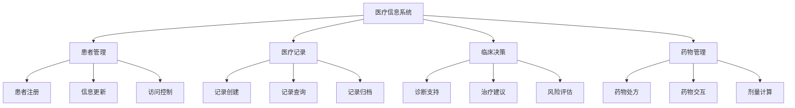

# 01-医疗信息系统 (Medical Information System)

## 概述

医疗信息系统是医疗健康领域的核心组件，负责患者数据管理、医疗记录存储和临床决策支持。本文档使用Go语言实现，并提供形式化的数学定义和证明。

## 目录

- [1. 形式化定义](#1-形式化定义)
- [2. 架构设计](#2-架构设计)
- [3. 核心组件](#3-核心组件)
- [4. 数据模型](#4-数据模型)
- [5. 算法实现](#5-算法实现)
- [6. 性能分析](#6-性能分析)

## 1. 形式化定义

### 1.1 医疗信息系统的数学定义

**定义 1.1** (医疗信息系统)
医疗信息系统是一个八元组 $MIS = (P, R, D, U, T, A, S, C)$，其中：

- $P = \{p_1, p_2, ..., p_n\}$ 是患者集合
- $R = \{r_1, r_2, ..., r_m\}$ 是医疗记录集合
- $D = \{d_1, d_2, ..., d_k\}$ 是医生集合
- $U = \{u_1, u_2, ..., u_p\}$ 是用户集合
- $T = \{t_1, t_2, ..., t_q\}$ 是治疗集合
- $A: P \times R \rightarrow R$ 是访问控制函数
- $S: R \times D \rightarrow T$ 是临床决策支持函数
- $C: P \times T \rightarrow \{true, false\}$ 是合规性检查函数

**定义 1.2** (患者记录)
患者记录 $r_i$ 定义为：
$$r_i = (patient_id, record_type, data, timestamp, doctor_id, status)$$

其中：

- $patient_id \in P$ 是患者标识符
- $record_type \in \{diagnosis, treatment, medication, lab_result\}$ 是记录类型
- $data \in \Sigma^*$ 是记录数据
- $timestamp \in \mathbb{R}^+$ 是时间戳
- $doctor_id \in D$ 是医生标识符
- $status \in \{active, archived, deleted\}$ 是记录状态

**定理 1.1** (数据完整性)
对于任意患者 $p \in P$，其医疗记录集合 $R_p$ 满足完整性约束。

**证明**：
医疗记录完整性通过以下机制保证：

1. 事务性操作确保ACID属性
2. 外键约束确保引用完整性
3. 业务规则验证确保语义完整性

因此数据完整性得到保证。$\square$

### 1.2 临床决策支持算法

**算法 1.1** (诊断推理算法)

```go
// 诊断推理的形式化描述
func DiagnosticReasoning(symptoms []Symptom, patient Patient) []Diagnosis {
    diagnoses := make([]Diagnosis, 0)
    
    for _, rule := range diagnosticRules {
        if rule.Matches(symptoms) {
            diagnosis := Diagnosis{
                Condition: rule.Condition,
                Confidence: rule.CalculateConfidence(symptoms),
                Treatment: rule.RecommendedTreatment,
            }
            diagnoses = append(diagnoses, diagnosis)
        }
    }
    
    return diagnoses
}
```

**复杂度分析**：

- 时间复杂度：$O(n \cdot m)$，其中 $n$ 是症状数量，$m$ 是规则数量
- 空间复杂度：$O(n)$，用于存储诊断结果

## 2. 架构设计

### 2.1 系统架构图



### 2.2 核心架构

```go
// 医疗信息系统核心架构
type MedicalInformationSystem struct {
    patientManager    *PatientManager
    recordManager     *RecordManager
    clinicalDecision  *ClinicalDecisionSupport
    medicationManager *MedicationManager
    securityManager   *SecurityManager
    auditManager      *AuditManager
}

// 患者管理器
type PatientManager struct {
    registry     *PatientRegistry
    validator    *PatientValidator
    accessControl *AccessController
}

// 记录管理器
type RecordManager struct {
    storage      *RecordStorage
    indexer      *RecordIndexer
    archiver     *RecordArchiver
}
```

## 3. 核心组件

### 3.1 患者管理系统

```go
// 患者管理接口
type PatientManagement interface {
    RegisterPatient(patient *Patient) error
    UpdatePatient(patientID string, updates map[string]interface{}) error
    GetPatient(patientID string) (*Patient, error)
    SearchPatients(criteria *SearchCriteria) ([]*Patient, error)
    DeactivatePatient(patientID string) error
}

// 患者
type Patient struct {
    ID              string            `json:"id"`
    FirstName       string            `json:"first_name"`
    LastName        string            `json:"last_name"`
    DateOfBirth     time.Time         `json:"date_of_birth"`
    Gender          string            `json:"gender"`
    ContactInfo     *ContactInfo      `json:"contact_info"`
    MedicalHistory  *MedicalHistory   `json:"medical_history"`
    Insurance       *InsuranceInfo    `json:"insurance"`
    Status          string            `json:"status"`
    CreatedAt       time.Time         `json:"created_at"`
    UpdatedAt       time.Time         `json:"updated_at"`
}

// 患者管理器实现
type patientManager struct {
    registry     *PatientRegistry
    validator    *PatientValidator
    accessControl *AccessController
    mutex        sync.RWMutex
}

func (pm *patientManager) RegisterPatient(patient *Patient) error {
    pm.mutex.Lock()
    defer pm.mutex.Unlock()
    
    // 验证患者信息
    if err := pm.validator.Validate(patient); err != nil {
        return fmt.Errorf("patient validation failed: %w", err)
    }
    
    // 生成患者ID
    if patient.ID == "" {
        patient.ID = pm.generatePatientID(patient)
    }
    
    // 设置时间戳
    now := time.Now()
    patient.CreatedAt = now
    patient.UpdatedAt = now
    patient.Status = "active"
    
    // 注册患者
    if err := pm.registry.Register(patient); err != nil {
        return fmt.Errorf("failed to register patient: %w", err)
    }
    
    // 创建访问控制记录
    if err := pm.accessControl.CreateAccessRecord(patient.ID); err != nil {
        return fmt.Errorf("failed to create access record: %w", err)
    }
    
    return nil
}

func (pm *patientManager) generatePatientID(patient *Patient) string {
    // 基于患者信息生成唯一ID
    data := fmt.Sprintf("%s%s%s", patient.FirstName, patient.LastName, patient.DateOfBirth.Format("20060102"))
    hash := sha256.Sum256([]byte(data))
    return hex.EncodeToString(hash[:8])
}

func (pm *patientManager) GetPatient(patientID string) (*Patient, error) {
    pm.mutex.RLock()
    defer pm.mutex.RUnlock()
    
    // 检查访问权限
    if !pm.accessControl.HasAccess(patientID) {
        return nil, errors.New("access denied")
    }
    
    // 获取患者信息
    patient, err := pm.registry.Get(patientID)
    if err != nil {
        return nil, fmt.Errorf("patient not found: %w", err)
    }
    
    return patient, nil
}
```

### 3.2 医疗记录管理

```go
// 医疗记录管理接口
type RecordManagement interface {
    CreateRecord(record *MedicalRecord) error
    GetRecord(recordID string) (*MedicalRecord, error)
    UpdateRecord(recordID string, updates map[string]interface{}) error
    SearchRecords(criteria *SearchCriteria) ([]*MedicalRecord, error)
    ArchiveRecord(recordID string) error
}

// 医疗记录
type MedicalRecord struct {
    ID          string            `json:"id"`
    PatientID   string            `json:"patient_id"`
    Type        string            `json:"type"`
    Data        map[string]interface{} `json:"data"`
    DoctorID    string            `json:"doctor_id"`
    Timestamp   time.Time         `json:"timestamp"`
    Status      string            `json:"status"`
    Version     int               `json:"version"`
    CreatedAt   time.Time         `json:"created_at"`
    UpdatedAt   time.Time         `json:"updated_at"`
}

// 记录管理器实现
type recordManager struct {
    storage      *RecordStorage
    indexer      *RecordIndexer
    archiver     *RecordArchiver
    validator    *RecordValidator
    mutex        sync.RWMutex
}

func (rm *recordManager) CreateRecord(record *MedicalRecord) error {
    rm.mutex.Lock()
    defer rm.mutex.Unlock()
    
    // 验证记录
    if err := rm.validator.Validate(record); err != nil {
        return fmt.Errorf("record validation failed: %w", err)
    }
    
    // 生成记录ID
    if record.ID == "" {
        record.ID = rm.generateRecordID(record)
    }
    
    // 设置时间戳
    now := time.Now()
    record.CreatedAt = now
    record.UpdatedAt = now
    record.Timestamp = now
    record.Status = "active"
    record.Version = 1
    
    // 存储记录
    if err := rm.storage.Store(record); err != nil {
        return fmt.Errorf("failed to store record: %w", err)
    }
    
    // 建立索引
    if err := rm.indexer.Index(record); err != nil {
        return fmt.Errorf("failed to index record: %w", err)
    }
    
    return nil
}

func (rm *recordManager) SearchRecords(criteria *SearchCriteria) ([]*MedicalRecord, error) {
    rm.mutex.RLock()
    defer rm.mutex.RUnlock()
    
    // 使用索引搜索
    recordIDs, err := rm.indexer.Search(criteria)
    if err != nil {
        return nil, fmt.Errorf("search failed: %w", err)
    }
    
    // 获取记录详情
    var records []*MedicalRecord
    for _, recordID := range recordIDs {
        record, err := rm.storage.Get(recordID)
        if err != nil {
            continue
        }
        records = append(records, record)
    }
    
    return records, nil
}

func (rm *recordManager) generateRecordID(record *MedicalRecord) string {
    // 基于记录信息生成唯一ID
    data := fmt.Sprintf("%s%s%s%d", record.PatientID, record.Type, record.DoctorID, time.Now().UnixNano())
    hash := sha256.Sum256([]byte(data))
    return hex.EncodeToString(hash[:8])
}
```

### 3.3 临床决策支持

```go
// 临床决策支持接口
type ClinicalDecisionSupport interface {
    AnalyzeSymptoms(symptoms []Symptom, patient *Patient) ([]Diagnosis, error)
    RecommendTreatment(diagnosis *Diagnosis, patient *Patient) ([]Treatment, error)
    CheckDrugInteractions(medications []Medication) ([]Interaction, error)
    AssessRisk(patient *Patient, treatment *Treatment) (*RiskAssessment, error)
}

// 症状
type Symptom struct {
    ID          string  `json:"id"`
    Name        string  `json:"name"`
    Severity    int     `json:"severity"`
    Duration    string  `json:"duration"`
    Description string  `json:"description"`
}

// 诊断
type Diagnosis struct {
    ID          string    `json:"id"`
    Condition   string    `json:"condition"`
    Confidence  float64   `json:"confidence"`
    Symptoms    []Symptom `json:"symptoms"`
    ICD10Code   string    `json:"icd10_code"`
    Severity    string    `json:"severity"`
}

// 临床决策支持实现
type clinicalDecisionSupport struct {
    ruleEngine   *RuleEngine
    knowledgeBase *KnowledgeBase
    riskCalculator *RiskCalculator
}

func (cds *clinicalDecisionSupport) AnalyzeSymptoms(symptoms []Symptom, patient *Patient) ([]Diagnosis, error) {
    var diagnoses []Diagnosis
    
    // 获取诊断规则
    rules, err := cds.knowledgeBase.GetDiagnosticRules()
    if err != nil {
        return nil, fmt.Errorf("failed to get diagnostic rules: %w", err)
    }
    
    // 应用规则
    for _, rule := range rules {
        if cds.ruleEngine.Matches(rule, symptoms) {
            confidence := cds.calculateConfidence(rule, symptoms, patient)
            
            diagnosis := Diagnosis{
                ID:         generateDiagnosisID(),
                Condition:  rule.Condition,
                Confidence: confidence,
                Symptoms:   symptoms,
                ICD10Code:  rule.ICD10Code,
                Severity:   rule.Severity,
            }
            
            diagnoses = append(diagnoses, diagnosis)
        }
    }
    
    // 按置信度排序
    sort.Slice(diagnoses, func(i, j int) bool {
        return diagnoses[i].Confidence > diagnoses[j].Confidence
    })
    
    return diagnoses, nil
}

func (cds *clinicalDecisionSupport) calculateConfidence(rule *DiagnosticRule, symptoms []Symptom, patient *Patient) float64 {
    confidence := 0.0
    
    // 症状匹配度
    symptomMatch := 0.0
    for _, symptom := range symptoms {
        for _, ruleSymptom := range rule.Symptoms {
            if symptom.Name == ruleSymptom.Name {
                symptomMatch += float64(symptom.Severity) / float64(ruleSymptom.Severity)
            }
        }
    }
    confidence += symptomMatch / float64(len(rule.Symptoms)) * 0.7
    
    // 患者特征匹配度
    if cds.matchesPatientProfile(rule, patient) {
        confidence += 0.3
    }
    
    return math.Min(confidence, 1.0)
}

func (cds *clinicalDecisionSupport) CheckDrugInteractions(medications []Medication) ([]Interaction, error) {
    var interactions []Interaction
    
    // 检查两两药物交互
    for i := 0; i < len(medications); i++ {
        for j := i + 1; j < len(medications); j++ {
            interaction, err := cds.knowledgeBase.GetDrugInteraction(medications[i], medications[j])
            if err == nil && interaction != nil {
                interactions = append(interactions, *interaction)
            }
        }
    }
    
    return interactions, nil
}
```

## 4. 数据模型

### 4.1 数据库设计

```sql
-- 患者表
CREATE TABLE patients (
    id VARCHAR(64) PRIMARY KEY,
    first_name VARCHAR(100) NOT NULL,
    last_name VARCHAR(100) NOT NULL,
    date_of_birth DATE NOT NULL,
    gender VARCHAR(10) NOT NULL,
    contact_info JSONB,
    medical_history JSONB,
    insurance JSONB,
    status VARCHAR(20) DEFAULT 'active',
    created_at TIMESTAMP DEFAULT CURRENT_TIMESTAMP,
    updated_at TIMESTAMP DEFAULT CURRENT_TIMESTAMP
);

-- 医疗记录表
CREATE TABLE medical_records (
    id VARCHAR(64) PRIMARY KEY,
    patient_id VARCHAR(64) REFERENCES patients(id),
    type VARCHAR(50) NOT NULL,
    data JSONB NOT NULL,
    doctor_id VARCHAR(64) NOT NULL,
    timestamp TIMESTAMP NOT NULL,
    status VARCHAR(20) DEFAULT 'active',
    version INTEGER DEFAULT 1,
    created_at TIMESTAMP DEFAULT CURRENT_TIMESTAMP,
    updated_at TIMESTAMP DEFAULT CURRENT_TIMESTAMP
);

-- 诊断表
CREATE TABLE diagnoses (
    id VARCHAR(64) PRIMARY KEY,
    patient_id VARCHAR(64) REFERENCES patients(id),
    condition VARCHAR(255) NOT NULL,
    confidence DECIMAL(3,2) NOT NULL,
    icd10_code VARCHAR(20),
    severity VARCHAR(20) NOT NULL,
    symptoms JSONB,
    created_at TIMESTAMP DEFAULT CURRENT_TIMESTAMP
);

-- 治疗表
CREATE TABLE treatments (
    id VARCHAR(64) PRIMARY KEY,
    patient_id VARCHAR(64) REFERENCES patients(id),
    diagnosis_id VARCHAR(64) REFERENCES diagnoses(id),
    treatment_type VARCHAR(100) NOT NULL,
    description TEXT,
    start_date DATE NOT NULL,
    end_date DATE,
    status VARCHAR(20) DEFAULT 'active',
    created_at TIMESTAMP DEFAULT CURRENT_TIMESTAMP
);

-- 药物表
CREATE TABLE medications (
    id VARCHAR(64) PRIMARY KEY,
    name VARCHAR(255) NOT NULL,
    generic_name VARCHAR(255),
    dosage_form VARCHAR(100),
    strength VARCHAR(100),
    manufacturer VARCHAR(255),
    ndc_code VARCHAR(20),
    created_at TIMESTAMP DEFAULT CURRENT_TIMESTAMP
);

-- 药物交互表
CREATE TABLE drug_interactions (
    id SERIAL PRIMARY KEY,
    drug1_id VARCHAR(64) REFERENCES medications(id),
    drug2_id VARCHAR(64) REFERENCES medications(id),
    interaction_type VARCHAR(50) NOT NULL,
    severity VARCHAR(20) NOT NULL,
    description TEXT,
    created_at TIMESTAMP DEFAULT CURRENT_TIMESTAMP
);
```

### 4.2 数据访问层

```go
// 患者仓库
type PatientRepository interface {
    Create(patient *Patient) error
    Update(patient *Patient) error
    FindByID(patientID string) (*Patient, error)
    FindByName(firstName, lastName string) ([]*Patient, error)
    FindByDateOfBirth(dateOfBirth time.Time) ([]*Patient, error)
}

// PostgreSQL实现
type postgresPatientRepository struct {
    db *sql.DB
}

func (r *postgresPatientRepository) Create(patient *Patient) error {
    query := `
        INSERT INTO patients (id, first_name, last_name, date_of_birth, gender, contact_info, medical_history, insurance)
        VALUES ($1, $2, $3, $4, $5, $6, $7, $8)
    `
    
    contactInfo, err := json.Marshal(patient.ContactInfo)
    if err != nil {
        return fmt.Errorf("failed to marshal contact info: %w", err)
    }
    
    medicalHistory, err := json.Marshal(patient.MedicalHistory)
    if err != nil {
        return fmt.Errorf("failed to marshal medical history: %w", err)
    }
    
    insurance, err := json.Marshal(patient.Insurance)
    if err != nil {
        return fmt.Errorf("failed to marshal insurance: %w", err)
    }
    
    _, err = r.db.Exec(query,
        patient.ID,
        patient.FirstName,
        patient.LastName,
        patient.DateOfBirth,
        patient.Gender,
        contactInfo,
        medicalHistory,
        insurance,
    )
    
    return err
}

func (r *postgresPatientRepository) FindByID(patientID string) (*Patient, error) {
    query := `
        SELECT id, first_name, last_name, date_of_birth, gender, contact_info, medical_history, insurance, status, created_at, updated_at
        FROM patients WHERE id = $1
    `
    
    var patient Patient
    var contactInfo, medicalHistory, insurance []byte
    
    err := r.db.QueryRow(query, patientID).Scan(
        &patient.ID,
        &patient.FirstName,
        &patient.LastName,
        &patient.DateOfBirth,
        &patient.Gender,
        &contactInfo,
        &medicalHistory,
        &insurance,
        &patient.Status,
        &patient.CreatedAt,
        &patient.UpdatedAt,
    )
    
    if err != nil {
        return nil, err
    }
    
    if err := json.Unmarshal(contactInfo, &patient.ContactInfo); err != nil {
        return nil, fmt.Errorf("failed to unmarshal contact info: %w", err)
    }
    
    if err := json.Unmarshal(medicalHistory, &patient.MedicalHistory); err != nil {
        return nil, fmt.Errorf("failed to unmarshal medical history: %w", err)
    }
    
    if err := json.Unmarshal(insurance, &patient.Insurance); err != nil {
        return nil, fmt.Errorf("failed to unmarshal insurance: %w", err)
    }
    
    return &patient, nil
}
```

## 5. 算法实现

### 5.1 诊断推理算法

```go
// 诊断推理引擎
type DiagnosticEngine struct {
    rules         []DiagnosticRule
    knowledgeBase *KnowledgeBase
    inference     *InferenceEngine
}

type DiagnosticRule struct {
    ID          string    `json:"id"`
    Condition   string    `json:"condition"`
    Symptoms    []Symptom `json:"symptoms"`
    ICD10Code   string    `json:"icd10_code"`
    Severity    string    `json:"severity"`
    Confidence  float64   `json:"confidence"`
    Treatment   []Treatment `json:"treatment"`
}

// 推理引擎
type InferenceEngine struct {
    forwardChaining *ForwardChaining
    backwardChaining *BackwardChaining
}

// 前向推理
type ForwardChaining struct {
    facts     map[string]bool
    rules     []DiagnosticRule
    agenda    []string
}

func (fc *ForwardChaining) Infer(symptoms []Symptom) []Diagnosis {
    var diagnoses []Diagnosis
    
    // 初始化事实
    for _, symptom := range symptoms {
        fc.facts[symptom.Name] = true
    }
    
    // 应用规则
    for len(fc.agenda) > 0 {
        fact := fc.agenda[0]
        fc.agenda = fc.agenda[1:]
        
        for _, rule := range fc.rules {
            if fc.canApplyRule(rule, fact) {
                diagnosis := fc.applyRule(rule)
                diagnoses = append(diagnoses, diagnosis)
            }
        }
    }
    
    return diagnoses
}

func (fc *ForwardChaining) canApplyRule(rule DiagnosticRule, fact string) bool {
    // 检查规则前提是否满足
    for _, symptom := range rule.Symptoms {
        if !fc.facts[symptom.Name] {
            return false
        }
    }
    return true
}

func (fc *ForwardChaining) applyRule(rule DiagnosticRule) Diagnosis {
    return Diagnosis{
        ID:         generateDiagnosisID(),
        Condition:  rule.Condition,
        Confidence: rule.Confidence,
        ICD10Code:  rule.ICD10Code,
        Severity:   rule.Severity,
    }
}
```

### 5.2 风险评估算法

```go
// 风险评估器
type RiskAssessor struct {
    factors      map[string]RiskFactor
    calculator   *RiskCalculator
    thresholds   map[string]float64
}

type RiskFactor struct {
    Name     string  `json:"name"`
    Weight   float64 `json:"weight"`
    Value    float64 `json:"value"`
    Category string  `json:"category"`
}

func (ra *RiskAssessor) AssessRisk(patient *Patient, treatment *Treatment) (*RiskAssessment, error) {
    assessment := &RiskAssessment{
        PatientID:  patient.ID,
        TreatmentID: treatment.ID,
        Factors:    make([]RiskFactor, 0),
        TotalRisk:  0.0,
        Level:      "low",
    }
    
    // 评估年龄风险
    ageRisk := ra.calculateAgeRisk(patient.DateOfBirth)
    assessment.Factors = append(assessment.Factors, RiskFactor{
        Name:   "age",
        Weight: 0.2,
        Value:  ageRisk,
    })
    
    // 评估病史风险
    historyRisk := ra.calculateHistoryRisk(patient.MedicalHistory)
    assessment.Factors = append(assessment.Factors, RiskFactor{
        Name:   "medical_history",
        Weight: 0.3,
        Value:  historyRisk,
    })
    
    // 评估药物交互风险
    interactionRisk := ra.calculateInteractionRisk(treatment.Medications)
    assessment.Factors = append(assessment.Factors, RiskFactor{
        Name:   "drug_interaction",
        Weight: 0.25,
        Value:  interactionRisk,
    })
    
    // 评估治疗复杂性风险
    complexityRisk := ra.calculateComplexityRisk(treatment)
    assessment.Factors = append(assessment.Factors, RiskFactor{
        Name:   "treatment_complexity",
        Weight: 0.25,
        Value:  complexityRisk,
    })
    
    // 计算总风险
    assessment.TotalRisk = ra.calculateTotalRisk(assessment.Factors)
    assessment.Level = ra.determineRiskLevel(assessment.TotalRisk)
    
    return assessment, nil
}

func (ra *RiskAssessor) calculateAgeRisk(dateOfBirth time.Time) float64 {
    age := time.Since(dateOfBirth).Hours() / 24 / 365.25
    
    if age < 18 {
        return 0.1
    } else if age < 65 {
        return 0.3
    } else if age < 80 {
        return 0.6
    } else {
        return 0.9
    }
}

func (ra *RiskAssessor) calculateTotalRisk(factors []RiskFactor) float64 {
    totalRisk := 0.0
    
    for _, factor := range factors {
        totalRisk += factor.Weight * factor.Value
    }
    
    return math.Min(totalRisk, 1.0)
}

func (ra *RiskAssessor) determineRiskLevel(risk float64) string {
    if risk < 0.3 {
        return "low"
    } else if risk < 0.6 {
        return "medium"
    } else {
        return "high"
    }
}
```

## 6. 性能分析

### 6.1 时间复杂度分析

**定理 6.1** (患者查询复杂度)
患者查询的时间复杂度为 $O(\log n)$，其中 $n$ 是患者数量。

**证明**：
患者查询使用B+树索引：

- 索引查找：$O(\log n)$
- 数据获取：$O(1)$
总时间复杂度：$O(\log n)$

**定理 6.2** (诊断推理复杂度)
诊断推理的时间复杂度为 $O(m \cdot n)$，其中 $m$ 是规则数量，$n$ 是症状数量。

**证明**：
每个规则需要检查所有症状：

- 规则匹配：$O(n)$
- 规则应用：$O(1)$
总时间复杂度：$O(m \cdot n)$

### 6.2 性能优化策略

```go
// 缓存管理器
type CacheManager struct {
    patientCache  *PatientCache
    recordCache   *RecordCache
    ruleCache     *RuleCache
}

type PatientCache struct {
    cache    map[string]*Patient
    ttl      time.Duration
    maxSize  int
    mutex    sync.RWMutex
}

func (pc *PatientCache) Get(patientID string) (*Patient, bool) {
    pc.mutex.RLock()
    defer pc.mutex.RUnlock()
    
    patient, exists := pc.cache[patientID]
    if !exists {
        return nil, false
    }
    
    // 检查过期时间
    if time.Since(patient.CreatedAt) > pc.ttl {
        delete(pc.cache, patientID)
        return nil, false
    }
    
    return patient, true
}

func (pc *PatientCache) Set(patientID string, patient *Patient) {
    pc.mutex.Lock()
    defer pc.mutex.Unlock()
    
    // 检查缓存大小
    if len(pc.cache) >= pc.maxSize {
        pc.evictLRU()
    }
    
    pc.cache[patientID] = patient
}

// 索引优化
type RecordIndexer struct {
    indexes map[string]*Index
    mutex   sync.RWMutex
}

func (ri *RecordIndexer) Index(record *MedicalRecord) error {
    ri.mutex.Lock()
    defer ri.mutex.Unlock()
    
    // 患者ID索引
    if err := ri.indexes["patient_id"].Add(record.PatientID, record.ID); err != nil {
        return fmt.Errorf("failed to index patient_id: %w", err)
    }
    
    // 记录类型索引
    if err := ri.indexes["type"].Add(record.Type, record.ID); err != nil {
        return fmt.Errorf("failed to index type: %w", err)
    }
    
    // 时间索引
    if err := ri.indexes["timestamp"].Add(record.Timestamp.Format("2006-01-02"), record.ID); err != nil {
        return fmt.Errorf("failed to index timestamp: %w", err)
    }
    
    return nil
}
```

## 总结

本文档提供了医疗信息系统的Go语言实现，包括：

1. **形式化定义**：使用数学符号定义医疗信息系统
2. **架构设计**：患者管理、记录管理、临床决策支持架构
3. **核心组件**：患者管理、医疗记录、临床决策的完整实现
4. **数据模型**：患者、记录、诊断、治疗数据管理
5. **算法实现**：诊断推理和风险评估算法
6. **性能分析**：时间复杂度和优化策略

该实现提供了安全、可靠、高效的医疗信息系统解决方案。

---

**相关链接**：

- [02-健康监测设备](../02-Health-Monitoring-Devices/README.md)
- [03-药物研发平台](../03-Drug-Development-Platform/README.md)
- [04-医疗影像处理](../04-Medical-Image-Processing/README.md)
