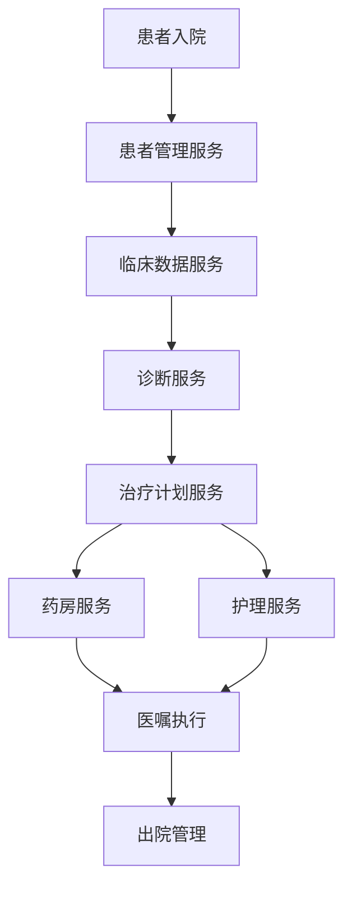

# 01-医疗信息系统 (Medical Information System)

## 1. 概述

### 1.1 定义与目标

医疗信息系统是医疗健康领域的核心基础设施，用于管理患者信息、临床数据、医疗流程和医疗资源。

**形式化定义**：
设 $P$ 为患者集合，$C$ 为临床数据集合，$T$ 为治疗集合，医疗信息系统函数 $f: P \times C \rightarrow T$ 定义为：
$$f(p, c) = \{t \in T | \exists d \in D: valid(d, p, c) \land t = treatment(d)\}$$

其中 $D$ 为诊断集合，$valid(d, p, c)$ 表示诊断 $d$ 对患者 $p$ 和临床数据 $c$ 的有效性，$treatment(d)$ 表示诊断 $d$ 对应的治疗方案。

### 1.2 核心特性

- **数据完整性**：确保医疗数据的准确性和一致性
- **安全性**：符合HIPAA等医疗数据保护法规
- **实时性**：支持实时数据访问和更新
- **互操作性**：支持HL7、FHIR等医疗标准

## 2. 架构设计

### 2.1 分层架构

```go
// 医疗信息系统核心架构
type MedicalInformationSystem struct {
    // 数据访问层
    dataAccess *DataAccessLayer
    
    // 业务逻辑层
    businessLogic *BusinessLogicLayer
    
    // 服务层
    services *ServiceLayer
    
    // 表示层
    presentation *PresentationLayer
    
    // 安全层
    security *SecurityLayer
}

// 数据访问层接口
type DataAccessLayer interface {
    GetPatient(id string) (*Patient, error)
    SavePatient(patient *Patient) error
    GetClinicalData(patientID string) ([]ClinicalData, error)
    SaveClinicalData(data *ClinicalData) error
    GetTreatment(patientID string) ([]Treatment, error)
    SaveTreatment(treatment *Treatment) error
}

// 业务逻辑层接口
type BusinessLogicLayer interface {
    ProcessPatientAdmission(patient *Patient) error
    ProcessClinicalData(data *ClinicalData) error
    GenerateTreatmentPlan(patientID string) (*TreatmentPlan, error)
    ValidateMedicalData(data interface{}) error
}
```

### 2.2 组件交互图



## 3. 核心模块实现

### 3.1 患者管理模块

#### 3.1.1 患者信息模型

```go
// 患者信息模型
type Patient struct {
    ID              string                 `json:"id" bson:"_id"`
    MRN             string                 `json:"mrn" bson:"mrn"` // Medical Record Number
    Demographics    Demographics           `json:"demographics" bson:"demographics"`
    MedicalHistory  MedicalHistory         `json:"medical_history" bson:"medical_history"`
    CurrentStatus   PatientStatus          `json:"current_status" bson:"current_status"`
    Insurance       InsuranceInfo          `json:"insurance" bson:"insurance"`
    EmergencyContacts []EmergencyContact   `json:"emergency_contacts" bson:"emergency_contacts"`
    CreatedAt       time.Time              `json:"created_at" bson:"created_at"`
    UpdatedAt       time.Time              `json:"updated_at" bson:"updated_at"`
}

type Demographics struct {
    FirstName       string    `json:"first_name" bson:"first_name"`
    LastName        string    `json:"last_name" bson:"last_name"`
    DateOfBirth     time.Time `json:"date_of_birth" bson:"date_of_birth"`
    Gender          Gender    `json:"gender" bson:"gender"`
    Address         Address   `json:"address" bson:"address"`
    ContactInfo     ContactInfo `json:"contact_info" bson:"contact_info"`
}

type MedicalHistory struct {
    Allergies       []Allergy     `json:"allergies" bson:"allergies"`
    Medications     []Medication  `json:"medications" bson:"medications"`
    Conditions      []Condition   `json:"conditions" bson:"conditions"`
    Procedures      []Procedure   `json:"procedures" bson:"procedures"`
    FamilyHistory   FamilyHistory `json:"family_history" bson:"family_history"`
}

// 患者管理服务
type PatientManagementService struct {
    repo    PatientRepository
    cache   *PatientCache
    events  *EventBus
}

func (s *PatientManagementService) RegisterPatient(demographics Demographics) (*Patient, error) {
    // 生成唯一MRN
    mrn := s.generateMRN()
    
    patient := &Patient{
        ID:           uuid.New().String(),
        MRN:          mrn,
        Demographics: demographics,
        CurrentStatus: PatientStatusRegistered,
        CreatedAt:    time.Now(),
        UpdatedAt:    time.Now(),
    }
    
    // 保存患者信息
    if err := s.repo.Save(patient); err != nil {
        return nil, err
    }
    
    // 缓存患者信息
    s.cache.Set(patient.ID, patient)
    
    // 发布患者注册事件
    s.events.Publish(&PatientRegisteredEvent{
        PatientID: patient.ID,
        MRN:       patient.MRN,
        Timestamp: time.Now(),
    })
    
    return patient, nil
}

func (s *PatientManagementService) UpdatePatient(id string, updates map[string]interface{}) error {
    patient, err := s.repo.GetByID(id)
    if err != nil {
        return err
    }
    
    // 应用更新
    if err := s.applyUpdates(patient, updates); err != nil {
        return err
    }
    
    patient.UpdatedAt = time.Now()
    
    // 保存更新
    if err := s.repo.Save(patient); err != nil {
        return err
    }
    
    // 更新缓存
    s.cache.Set(patient.ID, patient)
    
    // 发布患者更新事件
    s.events.Publish(&PatientUpdatedEvent{
        PatientID: patient.ID,
        Updates:   updates,
        Timestamp: time.Now(),
    })
    
    return nil
}
```

#### 3.1.2 算法复杂度分析

**时间复杂度**：
- 患者注册：$O(1)$
- 患者查询：$O(\log n)$（使用索引）
- 患者更新：$O(1)$

**空间复杂度**：$O(n)$，其中 $n$ 为患者数量。

### 3.2 临床数据管理模块

#### 3.2.1 临床数据模型

```go
// 临床数据模型
type ClinicalData struct {
    ID          string              `json:"id" bson:"_id"`
    PatientID   string              `json:"patient_id" bson:"patient_id"`
    DataType    ClinicalDataType    `json:"data_type" bson:"data_type"`
    Value       interface{}         `json:"value" bson:"value"`
    Unit        string              `json:"unit" bson:"unit"`
    Reference   ReferenceRange      `json:"reference" bson:"reference"`
    Status      DataStatus          `json:"status" bson:"status"`
    CollectedBy string              `json:"collected_by" bson:"collected_by"`
    CollectedAt time.Time           `json:"collected_at" bson:"collected_at"`
    CreatedAt   time.Time           `json:"created_at" bson:"created_at"`
}

type ReferenceRange struct {
    Min     float64 `json:"min" bson:"min"`
    Max     float64 `json:"max" bson:"max"`
    Unit    string  `json:"unit" bson:"unit"`
    Gender  *Gender `json:"gender,omitempty" bson:"gender,omitempty"`
    AgeMin  *int    `json:"age_min,omitempty" bson:"age_min,omitempty"`
    AgeMax  *int    `json:"age_max,omitempty" bson:"age_max,omitempty"`
}

// 临床数据服务
type ClinicalDataService struct {
    repo      ClinicalDataRepository
    validator *DataValidator
    analyzer  *DataAnalyzer
    events    *EventBus
}

func (s *ClinicalDataService) RecordVitalSigns(patientID string, vitals VitalSigns) error {
    // 验证数据
    if err := s.validator.ValidateVitalSigns(vitals); err != nil {
        return err
    }
    
    // 记录各项生命体征
    for dataType, value := range vitals {
        clinicalData := &ClinicalData{
            ID:          uuid.New().String(),
            PatientID:   patientID,
            DataType:    dataType,
            Value:       value.Value,
            Unit:        value.Unit,
            Reference:   s.getReferenceRange(dataType, patientID),
            Status:      DataStatusNormal,
            CollectedBy: vitals.CollectedBy,
            CollectedAt: vitals.CollectedAt,
            CreatedAt:   time.Now(),
        }
        
        // 分析数据状态
        clinicalData.Status = s.analyzer.AnalyzeDataStatus(clinicalData)
        
        // 保存数据
        if err := s.repo.Save(clinicalData); err != nil {
            return err
        }
        
        // 发布数据记录事件
        s.events.Publish(&ClinicalDataRecordedEvent{
            PatientID:   patientID,
            DataType:    dataType,
            Value:       value.Value,
            Status:      clinicalData.Status,
            Timestamp:   time.Now(),
        })
    }
    
    return nil
}

func (s *ClinicalDataService) GetPatientTrends(patientID string, dataType ClinicalDataType, duration time.Duration) (*DataTrend, error) {
    // 获取历史数据
    endTime := time.Now()
    startTime := endTime.Add(-duration)
    
    data, err := s.repo.GetByPatientAndType(patientID, dataType, startTime, endTime)
    if err != nil {
        return nil, err
    }
    
    // 分析趋势
    trend := s.analyzer.AnalyzeTrend(data)
    
    return trend, nil
}
```

### 3.3 诊断与治疗模块

#### 3.3.1 诊断引擎

```go
// 诊断引擎
type DiagnosticEngine struct {
    rules     []DiagnosticRule
    mlModel   *MLModel
    knowledge *KnowledgeBase
}

type DiagnosticRule struct {
    ID          string
    Name        string
    Conditions  []Condition
    Diagnosis   Diagnosis
    Confidence  float64
    Priority    int
}

func (d *DiagnosticEngine) GenerateDiagnosis(patientID string, symptoms []Symptom) (*Diagnosis, error) {
    var candidates []DiagnosticCandidate
    
    // 基于规则的诊断
    for _, rule := range d.rules {
        if confidence := d.evaluateRule(rule, symptoms); confidence > 0.5 {
            candidates = append(candidates, DiagnosticCandidate{
                Rule:       rule,
                Confidence: confidence,
            })
        }
    }
    
    // 基于机器学习的诊断
    mlDiagnosis := d.mlModel.Predict(symptoms)
    if mlDiagnosis.Confidence > 0.7 {
        candidates = append(candidates, DiagnosticCandidate{
            Rule:       mlDiagnosis.Rule,
            Confidence: mlDiagnosis.Confidence,
        })
    }
    
    // 排序并选择最佳诊断
    sort.Slice(candidates, func(i, j int) bool {
        return candidates[i].Confidence > candidates[j].Confidence
    })
    
    if len(candidates) == 0 {
        return nil, ErrNoDiagnosisFound
    }
    
    return &Diagnosis{
        PatientID:   patientID,
        Primary:     candidates[0].Rule.Diagnosis,
        Secondary:   d.getSecondaryDiagnoses(candidates),
        Confidence:  candidates[0].Confidence,
        GeneratedAt: time.Now(),
    }, nil
}

func (d *DiagnosticEngine) evaluateRule(rule DiagnosticRule, symptoms []Symptom) float64 {
    matchedConditions := 0
    totalConditions := len(rule.Conditions)
    
    for _, condition := range rule.Conditions {
        if d.matchCondition(condition, symptoms) {
            matchedConditions++
        }
    }
    
    return float64(matchedConditions) / float64(totalConditions)
}
```

#### 3.3.2 治疗计划生成

```go
// 治疗计划生成器
type TreatmentPlanGenerator struct {
    protocols map[string]*TreatmentProtocol
    pharmacy  *PharmacyService
    nursing   *NursingService
}

func (g *TreatmentPlanGenerator) GeneratePlan(patientID string, diagnosis *Diagnosis) (*TreatmentPlan, error) {
    // 获取治疗协议
    protocol := g.getProtocol(diagnosis.Primary.Code)
    if protocol == nil {
        return nil, ErrNoProtocolFound
    }
    
    // 生成治疗计划
    plan := &TreatmentPlan{
        ID:          uuid.New().String(),
        PatientID:   patientID,
        Diagnosis:   diagnosis,
        Protocol:    protocol,
        CreatedAt:   time.Now(),
        Status:      PlanStatusDraft,
    }
    
    // 生成药物治疗
    medications := g.generateMedications(protocol, patientID)
    plan.Medications = medications
    
    // 生成护理计划
    nursingPlan := g.generateNursingPlan(protocol, patientID)
    plan.NursingPlan = nursingPlan
    
    // 生成检查计划
    tests := g.generateTests(protocol, patientID)
    plan.Tests = tests
    
    // 计算预期结果
    plan.ExpectedOutcomes = g.calculateExpectedOutcomes(protocol, diagnosis)
    
    return plan, nil
}

func (g *TreatmentPlanGenerator) generateMedications(protocol *TreatmentProtocol, patientID string) []MedicationOrder {
    var orders []MedicationOrder
    
    for _, med := range protocol.Medications {
        // 检查药物相互作用
        if g.checkDrugInteractions(med, patientID) {
            continue
        }
        
        // 计算剂量
        dose := g.calculateDose(med, patientID)
        
        order := MedicationOrder{
            ID:           uuid.New().String(),
            PatientID:    patientID,
            Medication:   med,
            Dose:         dose,
            Frequency:    med.Frequency,
            Route:        med.Route,
            Duration:     med.Duration,
            Status:       OrderStatusPending,
            CreatedAt:    time.Now(),
        }
        
        orders = append(orders, order)
    }
    
    return orders
}
```

## 4. 数据安全与隐私

### 4.1 访问控制

```go
// 基于角色的访问控制
type RBACController struct {
    roles       map[string]*Role
    permissions map[string]*Permission
    assignments map[string][]string // userID -> roleIDs
}

type Role struct {
    ID          string
    Name        string
    Permissions []string
    Level       AccessLevel
}

type Permission struct {
    ID       string
    Resource string
    Action   string
    Scope    string
}

func (r *RBACController) CheckPermission(userID, resource, action string) bool {
    // 获取用户角色
    roles := r.assignments[userID]
    
    for _, roleID := range roles {
        role := r.roles[roleID]
        if role == nil {
            continue
        }
        
        // 检查角色权限
        for _, permID := range role.Permissions {
            perm := r.permissions[permID]
            if perm != nil && perm.Resource == resource && perm.Action == action {
                return true
            }
        }
    }
    
    return false
}

// 数据脱敏
type DataAnonymizer struct {
    rules map[string]AnonymizationRule
}

func (a *DataAnonymizer) AnonymizePatient(patient *Patient) *AnonymizedPatient {
    return &AnonymizedPatient{
        ID:           a.hashID(patient.ID),
        Age:          a.calculateAge(patient.Demographics.DateOfBirth),
        Gender:       patient.Demographics.Gender,
        Conditions:   a.anonymizeConditions(patient.MedicalHistory.Conditions),
        Medications:  a.anonymizeMedications(patient.MedicalHistory.Medications),
        CreatedAt:    patient.CreatedAt,
    }
}
```

### 4.2 审计日志

```go
// 审计日志系统
type AuditLogger struct {
    repo AuditRepository
}

func (a *AuditLogger) LogAccess(userID, resource, action string, result bool) error {
    log := &AuditLog{
        ID:        uuid.New().String(),
        UserID:    userID,
        Resource:  resource,
        Action:    action,
        Result:    result,
        Timestamp: time.Now(),
        IPAddress: a.getClientIP(),
    }
    
    return a.repo.Save(log)
}

func (a *AuditLogger) LogDataAccess(userID, patientID, dataType string) error {
    return a.LogAccess(userID, fmt.Sprintf("patient:%s:%s", patientID, dataType), "read", true)
}
```

## 5. 实时监控与告警

### 5.1 生命体征监控

```go
// 实时监控系统
type RealTimeMonitor struct {
    sensors    map[string]*Sensor
    thresholds map[string]*Threshold
    alerts     *AlertManager
    events     *EventBus
}

func (m *RealTimeMonitor) MonitorVitalSigns(patientID string, vitals VitalSigns) error {
    // 检查各项指标
    for dataType, value := range vitals {
        threshold := m.thresholds[dataType]
        if threshold == nil {
            continue
        }
        
        // 检查是否超出阈值
        if m.checkThreshold(value, threshold) {
            alert := &VitalSignAlert{
                PatientID:   patientID,
                DataType:    dataType,
                Value:       value.Value,
                Threshold:   threshold,
                Severity:    m.calculateSeverity(value, threshold),
                Timestamp:   time.Now(),
            }
            
            // 发送告警
            m.alerts.SendAlert(alert)
            
            // 发布事件
            m.events.Publish(&VitalSignAlertEvent{
                Alert: alert,
            })
        }
    }
    
    return nil
}

func (m *RealTimeMonitor) checkThreshold(value VitalSignValue, threshold *Threshold) bool {
    switch threshold.Type {
    case ThresholdTypeMin:
        return value.Value < threshold.Value
    case ThresholdTypeMax:
        return value.Value > threshold.Value
    case ThresholdTypeRange:
        return value.Value < threshold.Min || value.Value > threshold.Max
    default:
        return false
    }
}
```

### 5.2 智能告警

```go
// 智能告警系统
type IntelligentAlertSystem struct {
    rules      []AlertRule
    mlModel    *MLModel
    escalation *EscalationManager
}

func (a *IntelligentAlertSystem) ProcessAlert(alert *Alert) error {
    // 基于规则的告警处理
    for _, rule := range a.rules {
        if a.matchRule(alert, rule) {
            return a.executeRule(alert, rule)
        }
    }
    
    // 基于机器学习的告警处理
    prediction := a.mlModel.PredictAlert(alert)
    if prediction.RequiresEscalation {
        return a.escalation.Escalate(alert, prediction.EscalationLevel)
    }
    
    return nil
}

func (a *IntelligentAlertSystem) executeRule(alert *Alert, rule AlertRule) error {
    // 执行告警规则
    for _, action := range rule.Actions {
        switch action.Type {
        case ActionTypeNotify:
            return a.notify(action.Recipients, alert)
        case ActionTypeEscalate:
            return a.escalation.Escalate(alert, action.EscalationLevel)
        case ActionTypeLog:
            return a.logAction(alert, action)
        }
    }
    
    return nil
}
```

## 6. 集成与互操作

### 6.1 HL7 FHIR集成

```go
// FHIR集成服务
type FHIRIntegrationService struct {
    client *FHIRClient
    mapper *DataMapper
}

func (f *FHIRIntegrationService) ExportPatient(patientID string) (*fhir.Patient, error) {
    // 获取患者数据
    patient, err := f.getPatientData(patientID)
    if err != nil {
        return nil, err
    }
    
    // 转换为FHIR格式
    fhirPatient := f.mapper.MapToFHIR(patient)
    
    // 发送到FHIR服务器
    return f.client.CreatePatient(fhirPatient)
}

func (f *FHIRIntegrationService) ImportPatient(fhirPatient *fhir.Patient) (*Patient, error) {
    // 转换为内部格式
    patient := f.mapper.MapFromFHIR(fhirPatient)
    
    // 保存患者数据
    return f.savePatientData(patient)
}
```

### 6.2 设备集成

```go
// 医疗设备集成
type MedicalDeviceIntegration struct {
    devices map[string]*Device
    protocols map[string]*Protocol
}

func (m *MedicalDeviceIntegration) ConnectDevice(deviceID string, protocol *Protocol) error {
    device := &Device{
        ID:       deviceID,
        Protocol: protocol,
        Status:   DeviceStatusConnecting,
    }
    
    // 建立连接
    if err := m.establishConnection(device); err != nil {
        device.Status = DeviceStatusError
        return err
    }
    
    device.Status = DeviceStatusConnected
    m.devices[deviceID] = device
    
    // 启动数据监听
    go m.listenDeviceData(device)
    
    return nil
}

func (m *MedicalDeviceIntegration) listenDeviceData(device *Device) {
    for {
        data, err := device.Protocol.ReadData()
        if err != nil {
            device.Status = DeviceStatusError
            break
        }
        
        // 处理设备数据
        m.processDeviceData(device.ID, data)
    }
}
```

## 7. 性能优化

### 7.1 数据库优化

```go
// 数据库连接池
type DatabasePool struct {
    pool *sql.DB
    config *PoolConfig
}

func (p *DatabasePool) GetConnection() (*sql.Conn, error) {
    return p.pool.Conn(context.Background())
}

// 查询优化
type QueryOptimizer struct {
    indexes map[string]*Index
    cache   *QueryCache
}

func (o *QueryOptimizer) OptimizeQuery(query string) string {
    // 分析查询计划
    plan := o.analyzeQueryPlan(query)
    
    // 优化查询
    optimized := o.optimizeQueryPlan(plan)
    
    return optimized.Query
}
```

### 7.2 缓存策略

```go
// 多级缓存
type MultiLevelCache struct {
    l1 *LRUCache // 内存缓存
    l2 *RedisCache // Redis缓存
    l3 *DatabaseCache // 数据库缓存
}

func (c *MultiLevelCache) Get(key string) (interface{}, error) {
    // L1缓存查找
    if value, found := c.l1.Get(key); found {
        return value, nil
    }
    
    // L2缓存查找
    if value, err := c.l2.Get(key); err == nil {
        c.l1.Set(key, value)
        return value, nil
    }
    
    // L3缓存查找
    if value, err := c.l3.Get(key); err == nil {
        c.l2.Set(key, value)
        c.l1.Set(key, value)
        return value, nil
    }
    
    return nil, ErrKeyNotFound
}
```

## 8. 总结

医疗信息系统是现代医疗健康体系的核心基础设施。通过Go语言的高性能特性和并发机制，我们可以构建安全、可靠、高效的医疗信息系统。

### 8.1 关键优势

1. **高性能**：Go的并发特性支持高并发医疗数据处理
2. **安全性**：内置的安全机制保护敏感医疗数据
3. **可扩展性**：模块化设计支持系统扩展
4. **标准化**：支持HL7、FHIR等医疗标准

### 8.2 未来发展方向

1. **AI集成**：机器学习算法辅助诊断和治疗
2. **物联网**：医疗设备智能集成
3. **区块链**：医疗数据安全共享
4. **云计算**：云原生医疗信息系统

---

**相关链接**：
- [02-健康监测设备](../02-Health-Monitoring-Devices/README.md)
- [03-药物研发平台](../03-Drug-Development-Platform/README.md)
- [04-医疗影像处理](../04-Medical-Image-Processing/README.md)
- [返回上级目录](../../README.md)
