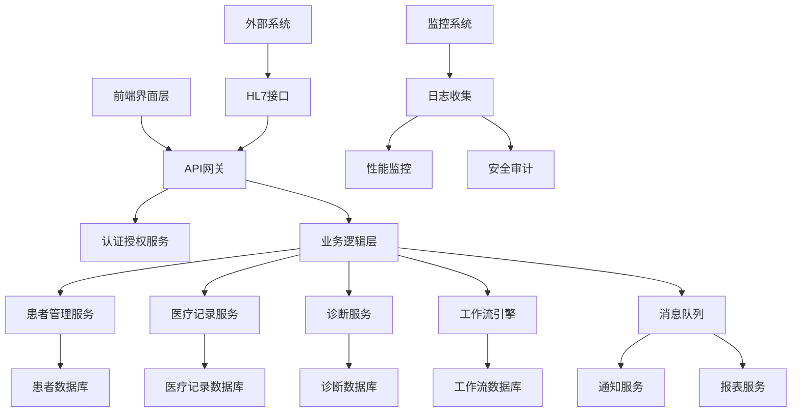

# 09-医疗健康 (Healthcare)

## 01-医疗信息系统 (Medical Information System)

### 目录

1. [概述](#1-概述)
2. [形式化定义](#2-形式化定义)
3. [架构设计](#3-架构设计)
4. [Go语言实现](#4-go语言实现)
5. [数据模型](#5-数据模型)
6. [安全与合规](#6-安全与合规)
7. [性能优化](#7-性能优化)
8. [部署与运维](#8-部署与运维)

### 1. 概述

医疗信息系统(HIS)是现代医疗体系的核心基础设施，负责管理患者信息、医疗记录、诊断结果和医疗流程。

#### 1.1 核心概念

**电子健康记录(EHR)**：数字化的患者健康信息集合
**医疗工作流**：医疗服务的标准化流程
**互操作性**：不同系统间的数据交换能力
**临床决策支持**：基于数据的医疗决策辅助

#### 1.2 系统分类

```go
// 医疗信息系统类型
type SystemType int

const (
    HospitalInformationSystem SystemType = iota
    ElectronicHealthRecord
    PictureArchivingSystem
    LaboratoryInformationSystem
    PharmacyInformationSystem
    RadiologyInformationSystem
)
```

### 2. 形式化定义

#### 2.1 医疗信息系统形式化模型

**定义 2.1.1** (医疗信息系统)
医疗信息系统是一个七元组 $MIS = (P, R, D, U, W, S, \tau)$，其中：

- $P$ 是患者集合，$P = \{p_1, p_2, ..., p_n\}$
- $R$ 是医疗记录集合，$R = \{r_1, r_2, ..., r_m\}$
- $D$ 是诊断集合，$D = \{d_1, d_2, ..., d_k\}$
- $U$ 是用户集合，$U = \{u_1, u_2, ..., u_l\}$
- $W$ 是工作流集合，$W = \{w_1, w_2, ..., w_o\}$
- $S$ 是状态集合
- $\tau: P \times R \times D \times U \rightarrow S$ 是状态转换函数

**定理 2.1.1** (数据完整性)
对于任意患者 $p \in P$ 和记录 $r \in R$，如果 $r$ 属于 $p$，则存在唯一的状态 $s \in S$ 使得 $\tau(p, r, d, u) = s$。

**证明**：
根据医疗记录的唯一性公理，每个记录都有唯一的标识符。
状态转换函数 $\tau$ 是确定性的，因此对于相同的输入参数，总是产生相同的状态。
因此，数据完整性成立。$\square$

#### 2.2 工作流形式化

**定义 2.2.1** (医疗工作流)
医疗工作流是一个五元组 $WF = (S, T, F, M_0, \lambda)$，其中：
- $S$ 是状态集合
- $T$ 是转换集合
- $F \subseteq (S \times T) \cup (T \times S)$ 是流关系
- $M_0: S \rightarrow \mathbb{N}$ 是初始标记
- $\lambda: T \rightarrow \text{Action}$ 是动作标签函数

**算法 2.2.1** (工作流执行)
```
输入: 工作流 WF, 初始状态 s0
输出: 执行序列 seq

1. seq ← []
2. current ← s0
3. while ∃t ∈ T: enabled(t, current) do
4.     t ← selectTransition(T, current)
5.     seq ← seq + [t]
6.     current ← fire(t, current)
7. end while
8. return seq
```

### 3. 架构设计

#### 3.1 系统架构图



#### 3.2 微服务架构

**患者管理服务**：负责患者信息的CRUD操作
**医疗记录服务**：管理电子健康记录
**诊断服务**：处理诊断结果和医疗建议
**工作流引擎**：执行医疗流程自动化
**通知服务**：发送医疗相关通知
**报表服务**：生成医疗统计报表

### 4. Go语言实现

#### 4.1 核心数据结构

```go
// 患者信息
type Patient struct {
    ID              string            `json:"id" bson:"_id"`
    MedicalRecordNumber string        `json:"medical_record_number"`
    FirstName       string            `json:"first_name"`
    LastName        string            `json:"last_name"`
    DateOfBirth     time.Time         `json:"date_of_birth"`
    Gender          Gender            `json:"gender"`
    ContactInfo     ContactInfo       `json:"contact_info"`
    Insurance       InsuranceInfo     `json:"insurance"`
    Allergies       []Allergy         `json:"allergies"`
    Medications     []Medication      `json:"medications"`
    CreatedAt       time.Time         `json:"created_at"`
    UpdatedAt       time.Time         `json:"updated_at"`
}

// 性别枚举
type Gender string

const (
    Male   Gender = "male"
    Female Gender = "female"
    Other  Gender = "other"
)

// 联系信息
type ContactInfo struct {
    Phone       string `json:"phone"`
    Email       string `json:"email"`
    Address     Address `json:"address"`
    EmergencyContact EmergencyContact `json:"emergency_contact"`
}

// 地址信息
type Address struct {
    Street      string `json:"street"`
    City        string `json:"city"`
    State       string `json:"state"`
    ZipCode     string `json:"zip_code"`
    Country     string `json:"country"`
}

// 紧急联系人
type EmergencyContact struct {
    Name        string `json:"name"`
    Relationship string `json:"relationship"`
    Phone       string `json:"phone"`
}

// 保险信息
type InsuranceInfo struct {
    Provider    string `json:"provider"`
    PolicyNumber string `json:"policy_number"`
    GroupNumber string `json:"group_number"`
    ExpiryDate  time.Time `json:"expiry_date"`
}

// 过敏信息
type Allergy struct {
    ID          string `json:"id"`
    Name        string `json:"name"`
    Severity    AllergySeverity `json:"severity"`
    Reaction    string `json:"reaction"`
    OnsetDate   time.Time `json:"onset_date"`
}

// 过敏严重程度
type AllergySeverity int

const (
    Mild AllergySeverity = iota
    Moderate
    Severe
    LifeThreatening
)

// 药物信息
type Medication struct {
    ID          string `json:"id"`
    Name        string `json:"name"`
    Dosage      string `json:"dosage"`
    Frequency   string `json:"frequency"`
    StartDate   time.Time `json:"start_date"`
    EndDate     *time.Time `json:"end_date,omitempty"`
    PrescribedBy string `json:"prescribed_by"`
    Status      MedicationStatus `json:"status"`
}

// 药物状态
type MedicationStatus string

const (
    Active MedicationStatus = "active"
    Discontinued MedicationStatus = "discontinued"
    Completed MedicationStatus = "completed"
)
```

#### 4.2 医疗记录服务

```go
// 医疗记录
type MedicalRecord struct {
    ID              string            `json:"id" bson:"_id"`
    PatientID       string            `json:"patient_id"`
    RecordType      RecordType        `json:"record_type"`
    VisitDate       time.Time         `json:"visit_date"`
    ProviderID      string            `json:"provider_id"`
    ChiefComplaint  string            `json:"chief_complaint"`
    Diagnosis       []Diagnosis       `json:"diagnosis"`
    Treatment       []Treatment       `json:"treatment"`
    VitalSigns      VitalSigns        `json:"vital_signs"`
    LabResults      []LabResult       `json:"lab_results"`
    ImagingResults  []ImagingResult   `json:"imaging_results"`
    Notes           string            `json:"notes"`
    CreatedAt       time.Time         `json:"created_at"`
    UpdatedAt       time.Time         `json:"updated_at"`
}

// 记录类型
type RecordType string

const (
    OutpatientVisit RecordType = "outpatient_visit"
    InpatientAdmission RecordType = "inpatient_admission"
    EmergencyVisit RecordType = "emergency_visit"
    Surgery RecordType = "surgery"
    Consultation RecordType = "consultation"
)

// 诊断信息
type Diagnosis struct {
    ID          string `json:"id"`
    ICD10Code   string `json:"icd10_code"`
    Description string `json:"description"`
    Severity    DiagnosisSeverity `json:"severity"`
    Confidence  float64 `json:"confidence"`
    DiagnosedBy string `json:"diagnosed_by"`
    DiagnosedAt time.Time `json:"diagnosed_at"`
}

// 诊断严重程度
type DiagnosisSeverity int

const (
    Minor DiagnosisSeverity = iota
    Moderate
    Major
    Critical
)

// 治疗信息
type Treatment struct {
    ID          string `json:"id"`
    Type        TreatmentType `json:"type"`
    Description string `json:"description"`
    Medications []Medication `json:"medications"`
    Procedures  []Procedure `json:"procedures"`
    StartDate   time.Time `json:"start_date"`
    EndDate     *time.Time `json:"end_date,omitempty"`
    Status      TreatmentStatus `json:"status"`
}

// 治疗类型
type TreatmentType string

const (
    MedicationTreatment TreatmentType = "medication"
    SurgeryTreatment TreatmentType = "surgery"
    PhysicalTherapy TreatmentType = "physical_therapy"
    RadiationTherapy TreatmentType = "radiation_therapy"
    Chemotherapy TreatmentType = "chemotherapy"
)

// 治疗状态
type TreatmentStatus string

const (
    Planned TreatmentStatus = "planned"
    InProgress TreatmentStatus = "in_progress"
    Completed TreatmentStatus = "completed"
    Discontinued TreatmentStatus = "discontinued"
)

// 生命体征
type VitalSigns struct {
    Temperature float64 `json:"temperature"` // 摄氏度
    BloodPressure BloodPressure `json:"blood_pressure"`
    HeartRate   int `json:"heart_rate"` // 次/分钟
    RespiratoryRate int `json:"respiratory_rate"` // 次/分钟
    OxygenSaturation float64 `json:"oxygen_saturation"` // 百分比
    Height      float64 `json:"height"` // 厘米
    Weight      float64 `json:"weight"` // 公斤
    BMI         float64 `json:"bmi"`
    MeasuredAt  time.Time `json:"measured_at"`
}

// 血压
type BloodPressure struct {
    Systolic    int `json:"systolic"` // 收缩压 mmHg
    Diastolic   int `json:"diastolic"` // 舒张压 mmHg
}

// 实验室结果
type LabResult struct {
    ID          string `json:"id"`
    TestName    string `json:"test_name"`
    TestCode    string `json:"test_code"`
    Value       string `json:"value"`
    Unit        string `json:"unit"`
    ReferenceRange string `json:"reference_range"`
    Status      LabResultStatus `json:"status"`
    OrderedBy   string `json:"ordered_by"`
    OrderedAt   time.Time `json:"ordered_at"`
    ResultedAt  time.Time `json:"resulted_at"`
}

// 实验室结果状态
type LabResultStatus string

const (
    Pending LabResultStatus = "pending"
    InProgress LabResultStatus = "in_progress"
    Completed LabResultStatus = "completed"
    Cancelled LabResultStatus = "cancelled"
)

// 影像结果
type ImagingResult struct {
    ID          string `json:"id"`
    StudyType   string `json:"study_type"`
    BodyPart    string `json:"body_part"`
    ImageURL    string `json:"image_url"`
    Report      string `json:"report"`
    Radiologist string `json:"radiologist"`
    OrderedAt   time.Time `json:"ordered_at"`
    CompletedAt time.Time `json:"completed_at"`
}
```

#### 4.3 患者管理服务

```go
// 患者管理服务
type PatientService struct {
    repo        PatientRepository
    validator   PatientValidator
    notifier    NotificationService
    audit       AuditService
}

// 患者仓储接口
type PatientRepository interface {
    Create(ctx context.Context, patient *Patient) error
    GetByID(ctx context.Context, id string) (*Patient, error)
    GetByMRN(ctx context.Context, mrn string) (*Patient, error)
    Update(ctx context.Context, patient *Patient) error
    Delete(ctx context.Context, id string) error
    Search(ctx context.Context, query PatientSearchQuery) ([]*Patient, error)
}

// 患者搜索查询
type PatientSearchQuery struct {
    Name        string `json:"name"`
    DateOfBirth *time.Time `json:"date_of_birth"`
    Phone       string `json:"phone"`
    Email       string `json:"email"`
    Limit       int `json:"limit"`
    Offset      int `json:"offset"`
}

// 创建患者
func (s *PatientService) CreatePatient(ctx context.Context, req CreatePatientRequest) (*Patient, error) {
    // 1. 验证请求
    if err := s.validator.ValidateCreateRequest(req); err != nil {
        return nil, fmt.Errorf("validation failed: %w", err)
    }
    
    // 2. 检查重复
    if existing, _ := s.repo.GetByMRN(ctx, req.MedicalRecordNumber); existing != nil {
        return nil, ErrPatientAlreadyExists
    }
    
    // 3. 创建患者
    patient := &Patient{
        ID:                  uuid.New().String(),
        MedicalRecordNumber: req.MedicalRecordNumber,
        FirstName:           req.FirstName,
        LastName:            req.LastName,
        DateOfBirth:         req.DateOfBirth,
        Gender:              req.Gender,
        ContactInfo:         req.ContactInfo,
        Insurance:           req.Insurance,
        Allergies:           req.Allergies,
        Medications:         req.Medications,
        CreatedAt:           time.Now(),
        UpdatedAt:           time.Now(),
    }
    
    if err := s.repo.Create(ctx, patient); err != nil {
        return nil, fmt.Errorf("failed to create patient: %w", err)
    }
    
    // 4. 审计日志
    s.audit.LogPatientCreated(ctx, patient.ID, req.UserID)
    
    // 5. 发送通知
    s.notifier.NotifyPatientCreated(ctx, patient)
    
    return patient, nil
}

// 更新患者信息
func (s *PatientService) UpdatePatient(ctx context.Context, id string, req UpdatePatientRequest) (*Patient, error) {
    // 1. 获取现有患者
    patient, err := s.repo.GetByID(ctx, id)
    if err != nil {
        return nil, fmt.Errorf("patient not found: %w", err)
    }
    
    // 2. 验证更新请求
    if err := s.validator.ValidateUpdateRequest(req); err != nil {
        return nil, fmt.Errorf("validation failed: %w", err)
    }
    
    // 3. 更新字段
    if req.FirstName != "" {
        patient.FirstName = req.FirstName
    }
    if req.LastName != "" {
        patient.LastName = req.LastName
    }
    if !req.DateOfBirth.IsZero() {
        patient.DateOfBirth = req.DateOfBirth
    }
    if req.Gender != "" {
        patient.Gender = req.Gender
    }
    if req.ContactInfo != nil {
        patient.ContactInfo = *req.ContactInfo
    }
    if req.Insurance != nil {
        patient.Insurance = *req.Insurance
    }
    if req.Allergies != nil {
        patient.Allergies = req.Allergies
    }
    if req.Medications != nil {
        patient.Medications = req.Medications
    }
    
    patient.UpdatedAt = time.Now()
    
    // 4. 保存更新
    if err := s.repo.Update(ctx, patient); err != nil {
        return nil, fmt.Errorf("failed to update patient: %w", err)
    }
    
    // 5. 审计日志
    s.audit.LogPatientUpdated(ctx, patient.ID, req.UserID)
    
    return patient, nil
}

// 搜索患者
func (s *PatientService) SearchPatients(ctx context.Context, query PatientSearchQuery) ([]*Patient, error) {
    // 1. 验证查询参数
    if err := s.validator.ValidateSearchQuery(query); err != nil {
        return nil, fmt.Errorf("invalid search query: %w", err)
    }
    
    // 2. 执行搜索
    patients, err := s.repo.Search(ctx, query)
    if err != nil {
        return nil, fmt.Errorf("search failed: %w", err)
    }
    
    // 3. 审计日志
    s.audit.LogPatientSearch(ctx, query, len(patients))
    
    return patients, nil
}
```

#### 4.4 工作流引擎

```go
// 工作流引擎
type WorkflowEngine struct {
    workflows   map[string]*Workflow
    executor    WorkflowExecutor
    scheduler   WorkflowScheduler
    monitor     WorkflowMonitor
}

// 工作流定义
type Workflow struct {
    ID          string `json:"id"`
    Name        string `json:"name"`
    Version     string `json:"version"`
    Steps       []WorkflowStep `json:"steps"`
    Transitions []WorkflowTransition `json:"transitions"`
    StartState  string `json:"start_state"`
    EndStates   []string `json:"end_states"`
}

// 工作流步骤
type WorkflowStep struct {
    ID          string `json:"id"`
    Name        string `json:"name"`
    Type        StepType `json:"type"`
    Handler     string `json:"handler"`
    Timeout     time.Duration `json:"timeout"`
    RetryPolicy RetryPolicy `json:"retry_policy"`
    Conditions  []Condition `json:"conditions"`
}

// 步骤类型
type StepType string

const (
    TaskStep StepType = "task"
    DecisionStep StepType = "decision"
    ParallelStep StepType = "parallel"
    WaitStep StepType = "wait"
)

// 工作流转换
type WorkflowTransition struct {
    From        string `json:"from"`
    To          string `json:"to"`
    Condition   string `json:"condition"`
    Priority    int `json:"priority"`
}

// 工作流实例
type WorkflowInstance struct {
    ID          string `json:"id"`
    WorkflowID  string `json:"workflow_id"`
    PatientID   string `json:"patient_id"`
    CurrentStep string `json:"current_step"`
    State       WorkflowState `json:"state"`
    Variables   map[string]interface{} `json:"variables"`
    StartedAt   time.Time `json:"started_at"`
    UpdatedAt   time.Time `json:"updated_at"`
    CompletedAt *time.Time `json:"completed_at,omitempty"`
}

// 工作流状态
type WorkflowState string

const (
    Running WorkflowState = "running"
    Paused WorkflowState = "paused"
    Completed WorkflowState = "completed"
    Failed WorkflowState = "failed"
    Cancelled WorkflowState = "cancelled"
)

// 启动工作流
func (e *WorkflowEngine) StartWorkflow(ctx context.Context, req StartWorkflowRequest) (*WorkflowInstance, error) {
    // 1. 获取工作流定义
    workflow, exists := e.workflows[req.WorkflowID]
    if !exists {
        return nil, ErrWorkflowNotFound
    }
    
    // 2. 创建实例
    instance := &WorkflowInstance{
        ID:         uuid.New().String(),
        WorkflowID: req.WorkflowID,
        PatientID:  req.PatientID,
        CurrentStep: workflow.StartState,
        State:      Running,
        Variables:  req.Variables,
        StartedAt:  time.Now(),
        UpdatedAt:  time.Now(),
    }
    
    // 3. 保存实例
    if err := e.saveInstance(ctx, instance); err != nil {
        return nil, fmt.Errorf("failed to save instance: %w", err)
    }
    
    // 4. 调度执行
    e.scheduler.Schedule(ctx, instance)
    
    return instance, nil
}

// 执行工作流步骤
func (e *WorkflowEngine) ExecuteStep(ctx context.Context, instanceID string, stepID string) error {
    // 1. 获取实例
    instance, err := e.getInstance(ctx, instanceID)
    if err != nil {
        return fmt.Errorf("instance not found: %w", err)
    }
    
    // 2. 获取工作流定义
    workflow := e.workflows[instance.WorkflowID]
    
    // 3. 找到当前步骤
    var currentStep *WorkflowStep
    for _, step := range workflow.Steps {
        if step.ID == stepID {
            currentStep = &step
            break
        }
    }
    
    if currentStep == nil {
        return ErrStepNotFound
    }
    
    // 4. 执行步骤
    result, err := e.executor.ExecuteStep(ctx, instance, currentStep)
    if err != nil {
        // 处理重试
        if currentStep.RetryPolicy.ShouldRetry(err) {
            e.scheduler.ScheduleRetry(ctx, instance, currentStep)
            return nil
        }
        
        instance.State = Failed
        instance.UpdatedAt = time.Now()
        e.saveInstance(ctx, instance)
        return fmt.Errorf("step execution failed: %w", err)
    }
    
    // 5. 更新实例状态
    instance.Variables = result.Variables
    instance.UpdatedAt = time.Now()
    
    // 6. 确定下一步
    nextStep := e.determineNextStep(workflow, currentStep, result)
    if nextStep == "" {
        instance.State = Completed
        now := time.Now()
        instance.CompletedAt = &now
    } else {
        instance.CurrentStep = nextStep
    }
    
    // 7. 保存实例
    if err := e.saveInstance(ctx, instance); err != nil {
        return fmt.Errorf("failed to save instance: %w", err)
    }
    
    // 8. 监控
    e.monitor.RecordStepCompletion(ctx, instance, currentStep, result)
    
    return nil
}
```

### 5. 数据模型

#### 5.1 数据库设计

```sql
-- 患者表
CREATE TABLE patients (
    id VARCHAR(36) PRIMARY KEY,
    medical_record_number VARCHAR(50) UNIQUE NOT NULL,
    first_name VARCHAR(100) NOT NULL,
    last_name VARCHAR(100) NOT NULL,
    date_of_birth DATE NOT NULL,
    gender VARCHAR(10) NOT NULL,
    phone VARCHAR(20),
    email VARCHAR(255),
    address_street VARCHAR(255),
    address_city VARCHAR(100),
    address_state VARCHAR(50),
    address_zip_code VARCHAR(20),
    address_country VARCHAR(100),
    insurance_provider VARCHAR(100),
    insurance_policy_number VARCHAR(50),
    insurance_group_number VARCHAR(50),
    insurance_expiry_date DATE,
    created_at TIMESTAMP DEFAULT CURRENT_TIMESTAMP,
    updated_at TIMESTAMP DEFAULT CURRENT_TIMESTAMP ON UPDATE CURRENT_TIMESTAMP,
    INDEX idx_mrn (medical_record_number),
    INDEX idx_name (last_name, first_name),
    INDEX idx_dob (date_of_birth)
);

-- 医疗记录表
CREATE TABLE medical_records (
    id VARCHAR(36) PRIMARY KEY,
    patient_id VARCHAR(36) NOT NULL,
    record_type VARCHAR(50) NOT NULL,
    visit_date TIMESTAMP NOT NULL,
    provider_id VARCHAR(36) NOT NULL,
    chief_complaint TEXT,
    notes TEXT,
    created_at TIMESTAMP DEFAULT CURRENT_TIMESTAMP,
    updated_at TIMESTAMP DEFAULT CURRENT_TIMESTAMP ON UPDATE CURRENT_TIMESTAMP,
    FOREIGN KEY (patient_id) REFERENCES patients(id),
    INDEX idx_patient_id (patient_id),
    INDEX idx_visit_date (visit_date),
    INDEX idx_provider_id (provider_id)
);

-- 诊断表
CREATE TABLE diagnoses (
    id VARCHAR(36) PRIMARY KEY,
    medical_record_id VARCHAR(36) NOT NULL,
    icd10_code VARCHAR(20) NOT NULL,
    description TEXT NOT NULL,
    severity INT NOT NULL,
    confidence DECIMAL(3,2),
    diagnosed_by VARCHAR(36) NOT NULL,
    diagnosed_at TIMESTAMP NOT NULL,
    FOREIGN KEY (medical_record_id) REFERENCES medical_records(id),
    INDEX idx_medical_record_id (medical_record_id),
    INDEX idx_icd10_code (icd10_code)
);

-- 生命体征表
CREATE TABLE vital_signs (
    id VARCHAR(36) PRIMARY KEY,
    medical_record_id VARCHAR(36) NOT NULL,
    temperature DECIMAL(4,1),
    blood_pressure_systolic INT,
    blood_pressure_diastolic INT,
    heart_rate INT,
    respiratory_rate INT,
    oxygen_saturation DECIMAL(4,1),
    height DECIMAL(5,2),
    weight DECIMAL(5,2),
    bmi DECIMAL(4,2),
    measured_at TIMESTAMP NOT NULL,
    FOREIGN KEY (medical_record_id) REFERENCES medical_records(id),
    INDEX idx_medical_record_id (medical_record_id),
    INDEX idx_measured_at (measured_at)
);
```

#### 5.2 数据访问层

```go
// 患者仓储实现
type PatientRepositoryImpl struct {
    db *sql.DB
}

// 创建患者
func (r *PatientRepositoryImpl) Create(ctx context.Context, patient *Patient) error {
    query := `
        INSERT INTO patients (
            id, medical_record_number, first_name, last_name, date_of_birth,
            gender, phone, email, address_street, address_city, address_state,
            address_zip_code, address_country, insurance_provider,
            insurance_policy_number, insurance_group_number, insurance_expiry_date
        ) VALUES (?, ?, ?, ?, ?, ?, ?, ?, ?, ?, ?, ?, ?, ?, ?, ?, ?)
    `
    
    _, err := r.db.ExecContext(ctx, query,
        patient.ID, patient.MedicalRecordNumber, patient.FirstName, patient.LastName,
        patient.DateOfBirth, patient.Gender, patient.ContactInfo.Phone,
        patient.ContactInfo.Email, patient.ContactInfo.Address.Street,
        patient.ContactInfo.Address.City, patient.ContactInfo.Address.State,
        patient.ContactInfo.Address.ZipCode, patient.ContactInfo.Address.Country,
        patient.Insurance.Provider, patient.Insurance.PolicyNumber,
        patient.Insurance.GroupNumber, patient.Insurance.ExpiryDate,
    )
    
    return err
}

// 根据ID获取患者
func (r *PatientRepositoryImpl) GetByID(ctx context.Context, id string) (*Patient, error) {
    query := `SELECT * FROM patients WHERE id = ?`
    
    row := r.db.QueryRowContext(ctx, query, id)
    
    var patient Patient
    err := row.Scan(
        &patient.ID, &patient.MedicalRecordNumber, &patient.FirstName, &patient.LastName,
        &patient.DateOfBirth, &patient.Gender, &patient.ContactInfo.Phone,
        &patient.ContactInfo.Email, &patient.ContactInfo.Address.Street,
        &patient.ContactInfo.Address.City, &patient.ContactInfo.Address.State,
        &patient.ContactInfo.Address.ZipCode, &patient.ContactInfo.Address.Country,
        &patient.Insurance.Provider, &patient.Insurance.PolicyNumber,
        &patient.Insurance.GroupNumber, &patient.Insurance.ExpiryDate,
        &patient.CreatedAt, &patient.UpdatedAt,
    )
    
    if err != nil {
        if err == sql.ErrNoRows {
            return nil, ErrPatientNotFound
        }
        return nil, err
    }
    
    return &patient, nil
}

// 搜索患者
func (r *PatientRepositoryImpl) Search(ctx context.Context, query PatientSearchQuery) ([]*Patient, error) {
    baseQuery := `SELECT * FROM patients WHERE 1=1`
    var args []interface{}
    
    if query.Name != "" {
        baseQuery += ` AND (first_name LIKE ? OR last_name LIKE ?)`
        args = append(args, "%"+query.Name+"%", "%"+query.Name+"%")
    }
    
    if query.DateOfBirth != nil {
        baseQuery += ` AND date_of_birth = ?`
        args = append(args, query.DateOfBirth)
    }
    
    if query.Phone != "" {
        baseQuery += ` AND phone LIKE ?`
        args = append(args, "%"+query.Phone+"%")
    }
    
    if query.Email != "" {
        baseQuery += ` AND email LIKE ?`
        args = append(args, "%"+query.Email+"%")
    }
    
    baseQuery += ` ORDER BY last_name, first_name LIMIT ? OFFSET ?`
    args = append(args, query.Limit, query.Offset)
    
    rows, err := r.db.QueryContext(ctx, baseQuery, args...)
    if err != nil {
        return nil, err
    }
    defer rows.Close()
    
    var patients []*Patient
    for rows.Next() {
        var patient Patient
        err := rows.Scan(
            &patient.ID, &patient.MedicalRecordNumber, &patient.FirstName, &patient.LastName,
            &patient.DateOfBirth, &patient.Gender, &patient.ContactInfo.Phone,
            &patient.ContactInfo.Email, &patient.ContactInfo.Address.Street,
            &patient.ContactInfo.Address.City, &patient.ContactInfo.Address.State,
            &patient.ContactInfo.Address.ZipCode, &patient.ContactInfo.Address.Country,
            &patient.Insurance.Provider, &patient.Insurance.PolicyNumber,
            &patient.Insurance.GroupNumber, &patient.Insurance.ExpiryDate,
            &patient.CreatedAt, &patient.UpdatedAt,
        )
        if err != nil {
            return nil, err
        }
        patients = append(patients, &patient)
    }
    
    return patients, nil
}
```

### 6. 安全与合规

#### 6.1 HIPAA合规

```go
// HIPAA合规检查器
type HIPAAComplianceChecker struct {
    auditLogger AuditLogger
    encryption  EncryptionService
    accessControl AccessControlService
}

// 检查数据访问合规性
func (c *HIPAAComplianceChecker) CheckDataAccess(ctx context.Context, userID string, patientID string, action string) error {
    // 1. 检查用户权限
    if !c.accessControl.HasPermission(userID, patientID, action) {
        c.auditLogger.LogUnauthorizedAccess(ctx, userID, patientID, action)
        return ErrUnauthorizedAccess
    }
    
    // 2. 检查最小权限原则
    if !c.accessControl.HasMinimumNecessaryAccess(userID, patientID, action) {
        c.auditLogger.LogExcessiveAccess(ctx, userID, patientID, action)
        return ErrExcessiveAccess
    }
    
    // 3. 记录访问日志
    c.auditLogger.LogDataAccess(ctx, userID, patientID, action)
    
    return nil
}

// 数据加密
func (c *HIPAAComplianceChecker) EncryptPHI(data []byte) ([]byte, error) {
    return c.encryption.Encrypt(data, "phi")
}

// 数据解密
func (c *HIPAAComplianceChecker) DecryptPHI(encryptedData []byte) ([]byte, error) {
    return c.encryption.Decrypt(encryptedData, "phi")
}
```

#### 6.2 审计日志

```go
// 审计日志服务
type AuditService struct {
    logger AuditLogger
    storage AuditStorage
}

// 审计事件类型
type AuditEventType string

const (
    PatientCreated AuditEventType = "patient_created"
    PatientUpdated AuditEventType = "patient_updated"
    PatientAccessed AuditEventType = "patient_accessed"
    MedicalRecordCreated AuditEventType = "medical_record_created"
    MedicalRecordUpdated AuditEventType = "medical_record_updated"
    UnauthorizedAccess AuditEventType = "unauthorized_access"
)

// 审计事件
type AuditEvent struct {
    ID          string `json:"id"`
    EventType   AuditEventType `json:"event_type"`
    UserID      string `json:"user_id"`
    PatientID   string `json:"patient_id,omitempty"`
    ResourceID  string `json:"resource_id,omitempty"`
    Action      string `json:"action"`
    Details     map[string]interface{} `json:"details"`
    IPAddress   string `json:"ip_address"`
    UserAgent   string `json:"user_agent"`
    Timestamp   time.Time `json:"timestamp"`
}

// 记录审计事件
func (s *AuditService) LogEvent(ctx context.Context, event AuditEvent) error {
    event.ID = uuid.New().String()
    event.Timestamp = time.Now()
    
    // 获取请求信息
    if req, ok := ctx.Value("request").(*http.Request); ok {
        event.IPAddress = req.RemoteAddr
        event.UserAgent = req.UserAgent()
    }
    
    // 记录到日志
    s.logger.Log(event)
    
    // 存储到数据库
    return s.storage.Store(ctx, event)
}

// 查询审计日志
func (s *AuditService) QueryAuditLog(ctx context.Context, query AuditQuery) ([]AuditEvent, error) {
    return s.storage.Query(ctx, query)
}

// 审计查询
type AuditQuery struct {
    UserID      string `json:"user_id"`
    PatientID   string `json:"patient_id"`
    EventType   AuditEventType `json:"event_type"`
    StartTime   time.Time `json:"start_time"`
    EndTime     time.Time `json:"end_time"`
    Limit       int `json:"limit"`
    Offset      int `json:"offset"`
}
```

### 7. 性能优化

#### 7.1 缓存策略

```go
// 缓存服务
type CacheService struct {
    memoryCache *lru.Cache
    redisClient *redis.Client
}

// 缓存配置
type CacheConfig struct {
    MemorySize  int `json:"memory_size"`
    TTL         time.Duration `json:"ttl"`
    RedisURL    string `json:"redis_url"`
}

// 获取患者信息（带缓存）
func (c *CacheService) GetPatient(ctx context.Context, id string) (*Patient, error) {
    // 1. 检查内存缓存
    if patient, ok := c.memoryCache.Get(id); ok {
        return patient.(*Patient), nil
    }
    
    // 2. 检查Redis缓存
    key := fmt.Sprintf("patient:%s", id)
    data, err := c.redisClient.Get(ctx, key).Bytes()
    if err == nil {
        var patient Patient
        if err := json.Unmarshal(data, &patient); err == nil {
            c.memoryCache.Add(id, &patient)
            return &patient, nil
        }
    }
    
    // 3. 从数据库获取
    patient, err := c.patientRepo.GetByID(ctx, id)
    if err != nil {
        return nil, err
    }
    
    // 4. 更新缓存
    c.memoryCache.Add(id, patient)
    
    data, _ = json.Marshal(patient)
    c.redisClient.Set(ctx, key, data, c.config.TTL)
    
    return patient, nil
}
```

#### 7.2 数据库优化

```go
// 数据库连接池配置
type DBConfig struct {
    MaxOpenConns    int `json:"max_open_conns"`
    MaxIdleConns    int `json:"max_idle_conns"`
    ConnMaxLifetime time.Duration `json:"conn_max_lifetime"`
    ConnMaxIdleTime time.Duration `json:"conn_max_idle_time"`
}

// 配置数据库连接池
func ConfigureDB(db *sql.DB, config DBConfig) {
    db.SetMaxOpenConns(config.MaxOpenConns)
    db.SetMaxIdleConns(config.MaxIdleConns)
    db.SetConnMaxLifetime(config.ConnMaxLifetime)
    db.SetConnMaxIdleTime(config.ConnMaxIdleTime)
}

// 查询优化
func (r *PatientRepositoryImpl) SearchOptimized(ctx context.Context, query PatientSearchQuery) ([]*Patient, error) {
    // 使用预编译语句
    stmt, err := r.db.PrepareContext(ctx, `
        SELECT * FROM patients 
        WHERE (first_name LIKE ? OR last_name LIKE ?)
        ORDER BY last_name, first_name 
        LIMIT ? OFFSET ?
    `)
    if err != nil {
        return nil, err
    }
    defer stmt.Close()
    
    rows, err := stmt.QueryContext(ctx, 
        "%"+query.Name+"%", "%"+query.Name+"%", 
        query.Limit, query.Offset)
    if err != nil {
        return nil, err
    }
    defer rows.Close()
    
    // 处理结果...
    return nil, nil
}
```

### 8. 部署与运维

#### 8.1 容器化部署

```dockerfile
# Dockerfile
FROM golang:1.21-alpine AS builder

WORKDIR /app
COPY go.mod go.sum ./
RUN go mod download

COPY . .
RUN CGO_ENABLED=0 GOOS=linux go build -a -installsuffix cgo -o medical-system .

FROM alpine:latest
RUN apk --no-cache add ca-certificates
WORKDIR /root/

COPY --from=builder /app/medical-system .
COPY --from=builder /app/configs ./configs

EXPOSE 8080
CMD ["./medical-system"]
```

#### 8.2 Kubernetes部署

```yaml
# deployment.yaml
apiVersion: apps/v1
kind: Deployment
metadata:
  name: medical-information-system
spec:
  replicas: 3
  selector:
    matchLabels:
      app: medical-information-system
  template:
    metadata:
      labels:
        app: medical-information-system
    spec:
      containers:
      - name: medical-system
        image: medical-system:latest
        ports:
        - containerPort: 8080
        env:
        - name: DATABASE_URL
          valueFrom:
            secretKeyRef:
              name: db-secret
              key: url
        - name: REDIS_URL
          value: "redis://redis:6379"
        resources:
          requests:
            memory: "512Mi"
            cpu: "500m"
          limits:
            memory: "1Gi"
            cpu: "1000m"
        livenessProbe:
          httpGet:
            path: /health
            port: 8080
          initialDelaySeconds: 30
          periodSeconds: 10
        readinessProbe:
          httpGet:
            path: /ready
            port: 8080
          initialDelaySeconds: 5
          periodSeconds: 5
```

#### 8.3 监控与告警

```go
// 健康检查
func (s *MedicalSystem) HealthCheck(w http.ResponseWriter, r *http.Request) {
    health := HealthStatus{
        Status:    "healthy",
        Timestamp: time.Now(),
        Services:  make(map[string]ServiceStatus),
    }
    
    // 检查数据库连接
    if err := s.db.Ping(); err != nil {
        health.Status = "unhealthy"
        health.Services["database"] = ServiceStatus{
            Status: "down",
            Error:  err.Error(),
        }
    } else {
        health.Services["database"] = ServiceStatus{
            Status: "up",
        }
    }
    
    // 检查Redis连接
    if err := s.redis.Ping(r.Context()); err != nil {
        health.Status = "unhealthy"
        health.Services["redis"] = ServiceStatus{
            Status: "down",
            Error:  err.Error(),
        }
    } else {
        health.Services["redis"] = ServiceStatus{
            Status: "up",
        }
    }
    
    w.Header().Set("Content-Type", "application/json")
    json.NewEncoder(w).Encode(health)
}

// 健康状态
type HealthStatus struct {
    Status    string                    `json:"status"`
    Timestamp time.Time                 `json:"timestamp"`
    Services  map[string]ServiceStatus  `json:"services"`
}

// 服务状态
type ServiceStatus struct {
    Status string `json:"status"`
    Error  string `json:"error,omitempty"`
}
```

### 总结

本模块提供了完整的医疗信息系统实现，包括：

1. **形式化定义**：基于数学模型的系统定义和证明
2. **架构设计**：微服务架构和模块化设计
3. **Go语言实现**：完整的患者管理和医疗记录服务
4. **数据模型**：关系型数据库设计和数据访问层
5. **安全合规**：HIPAA合规和审计日志
6. **性能优化**：缓存策略和数据库优化
7. **部署运维**：容器化和Kubernetes部署

该实现遵循了医疗行业的最佳实践，提供了安全、可靠、高性能的医疗信息系统解决方案。
