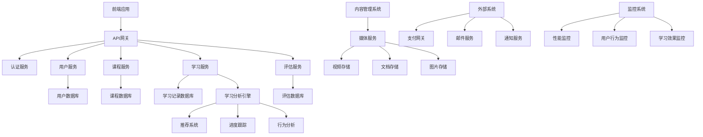

# 10-教育科技 (Education Technology)

## 01-在线学习平台 (Online Learning Platform)

### 目录

1. [概述](#1-概述)
2. [形式化定义](#2-形式化定义)
3. [架构设计](#3-架构设计)
4. [Go语言实现](#4-go语言实现)
5. [学习模型](#5-学习模型)
6. [内容管理](#6-内容管理)
7. [性能优化](#7-性能优化)
8. [部署与运维](#8-部署与运维)

### 1. 概述

在线学习平台是现代教育技术的核心应用，提供课程管理、学习跟踪、互动教学和个性化学习体验。

#### 1.1 核心概念

**学习对象(LO)**：可重用的数字化学习资源
**学习路径**：个性化的学习序列
**学习分析**：基于数据的学习行为分析
**自适应学习**：根据学习者表现调整内容

#### 1.2 平台类型

```go
// 学习平台类型
type PlatformType int

const (
    LMS PlatformType = iota // Learning Management System
    MOOC                     // Massive Open Online Course
    Microlearning           // 微学习平台
    AdaptiveLearning        // 自适应学习平台
    SocialLearning          // 社交学习平台
)
```

### 2. 形式化定义

#### 2.1 在线学习平台形式化模型

**定义 2.1.1** (在线学习平台)
在线学习平台是一个八元组 $OLP = (U, C, L, R, P, A, S, \mu)$，其中：

- $U$ 是用户集合，$U = \{u_1, u_2, ..., u_n\}$
- $C$ 是课程集合，$C = \{c_1, c_2, ..., c_m\}$
- $L$ 是学习对象集合，$L = \{l_1, l_2, ..., l_k\}$
- $R$ 是学习记录集合，$R = \{r_1, r_2, ..., r_o\}$
- $P$ 是学习路径集合，$P = \{p_1, p_2, ..., p_p\}$
- $A$ 是评估集合，$A = \{a_1, a_2, ..., a_q\}$
- $S$ 是状态集合
- $\mu: U \times C \times L \times R \rightarrow S$ 是学习状态函数

**定理 2.1.1** (学习进度一致性)
对于任意用户 $u \in U$ 和课程 $c \in C$，学习进度函数 $\pi: U \times C \rightarrow [0,1]$ 满足：
$\pi(u, c) = \frac{|\{l \in L_c : \text{completed}(u, l)\}|}{|L_c|}$

**证明**：
根据学习进度的定义，进度是已完成学习对象数量与总学习对象数量的比值。
由于 $L_c$ 是课程 $c$ 的学习对象集合，且每个学习对象只能被完成一次，
因此学习进度函数满足上述等式。$\square$

#### 2.2 学习路径形式化

**定义 2.2.1** (学习路径)
学习路径是一个四元组 $LP = (N, E, \omega, \tau)$，其中：

- $N$ 是节点集合（学习对象）
- $E \subseteq N \times N$ 是边集合（依赖关系）
- $\omega: E \rightarrow \mathbb{R}^+$ 是权重函数
- $\tau: N \rightarrow \text{Type}$ 是节点类型函数

**算法 2.2.1** (个性化路径生成)

```text
输入: 用户 u, 课程 c, 学习历史 H
输出: 个性化路径 P

1. P ← []
2. available ← getAvailableNodes(c, H)
3. while available ≠ ∅ do
4.     next ← selectNextNode(available, u, H)
5.     P ← P + [next]
6.     available ← updateAvailable(available, next)
7. end while
8. return P
```

### 3. 架构设计

#### 3.1 系统架构图



#### 3.2 微服务架构

**用户服务**：管理用户注册、认证和权限
**课程服务**：管理课程内容和结构
**学习服务**：跟踪学习进度和行为
**评估服务**：管理测验和作业
**推荐服务**：提供个性化推荐
**分析服务**：学习数据分析和报告

### 4. Go语言实现

#### 4.1 核心数据结构

```go
// 用户信息
type User struct {
    ID              string            `json:"id" bson:"_id"`
    Email           string            `json:"email"`
    Username        string            `json:"username"`
    FirstName       string            `json:"first_name"`
    LastName        string            `json:"last_name"`
    Role            UserRole          `json:"role"`
    Profile         UserProfile       `json:"profile"`
    Preferences     LearningPreferences `json:"preferences"`
    CreatedAt       time.Time         `json:"created_at"`
    UpdatedAt       time.Time         `json:"updated_at"`
}

// 用户角色
type UserRole string

const (
    Student UserRole = "student"
    Teacher UserRole = "teacher"
    Admin   UserRole = "admin"
)

// 用户档案
type UserProfile struct {
    Avatar          string `json:"avatar"`
    Bio             string `json:"bio"`
    Location        string `json:"location"`
    Timezone        string `json:"timezone"`
    Language        string `json:"language"`
    Education       string `json:"education"`
    Experience      string `json:"experience"`
    Interests       []string `json:"interests"`
}

// 学习偏好
type LearningPreferences struct {
    LearningStyle   LearningStyle `json:"learning_style"`
    PreferredPace   string `json:"preferred_pace"`
    NotificationSettings NotificationSettings `json:"notification_settings"`
    Accessibility   AccessibilitySettings `json:"accessibility"`
}

// 学习风格
type LearningStyle string

const (
    Visual LearningStyle = "visual"
    Auditory LearningStyle = "auditory"
    Kinesthetic LearningStyle = "kinesthetic"
    Reading LearningStyle = "reading"
)

// 课程信息
type Course struct {
    ID              string            `json:"id" bson:"_id"`
    Title           string            `json:"title"`
    Description     string            `json:"description"`
    InstructorID    string            `json:"instructor_id"`
    Category        string            `json:"category"`
    Level           CourseLevel       `json:"level"`
    Duration        time.Duration     `json:"duration"`
    Price           float64           `json:"price"`
    Currency        string            `json:"currency"`
    Language        string            `json:"language"`
    Prerequisites   []string          `json:"prerequisites"`
    LearningObjectives []string       `json:"learning_objectives"`
    Modules         []Module          `json:"modules"`
    Status          CourseStatus      `json:"status"`
    CreatedAt       time.Time         `json:"created_at"`
    UpdatedAt       time.Time         `json:"updated_at"`
}

// 课程级别
type CourseLevel string

const (
    Beginner CourseLevel = "beginner"
    Intermediate CourseLevel = "intermediate"
    Advanced CourseLevel = "advanced"
)

// 课程状态
type CourseStatus string

const (
    Draft CourseStatus = "draft"
    Published CourseStatus = "published"
    Archived CourseStatus = "archived"
)

// 课程模块
type Module struct {
    ID              string `json:"id"`
    Title           string `json:"title"`
    Description     string `json:"description"`
    Order           int `json:"order"`
    Duration        time.Duration `json:"duration"`
    Lessons         []Lesson `json:"lessons"`
    Assessments     []Assessment `json:"assessments"`
}

// 课程章节
type Lesson struct {
    ID              string `json:"id"`
    Title           string `json:"title"`
    Description     string `json:"description"`
    Order           int `json:"order"`
    Duration        time.Duration `json:"duration"`
    Content         LessonContent `json:"content"`
    Resources       []Resource `json:"resources"`
    Prerequisites   []string `json:"prerequisites"`
}

// 课程内容
type LessonContent struct {
    Type            ContentType `json:"type"`
    VideoURL        string `json:"video_url,omitempty"`
    DocumentURL     string `json:"document_url,omitempty"`
    TextContent     string `json:"text_content,omitempty"`
    InteractiveContent InteractiveContent `json:"interactive_content,omitempty"`
}

// 内容类型
type ContentType string

const (
    Video ContentType = "video"
    Document ContentType = "document"
    Text ContentType = "text"
    Interactive ContentType = "interactive"
    Quiz ContentType = "quiz"
)

// 学习记录
type LearningRecord struct {
    ID              string `json:"id" bson:"_id"`
    UserID          string `json:"user_id"`
    CourseID        string `json:"course_id"`
    ModuleID        string `json:"module_id"`
    LessonID        string `json:"lesson_id"`
    Action          LearningAction `json:"action"`
    Duration        time.Duration `json:"duration"`
    Progress        float64 `json:"progress"`
    Score           *float64 `json:"score,omitempty"`
    Timestamp       time.Time `json:"timestamp"`
    Metadata        map[string]interface{} `json:"metadata"`
}

// 学习行为
type LearningAction string

const (
    StartLesson LearningAction = "start_lesson"
    CompleteLesson LearningAction = "complete_lesson"
    PauseLesson LearningAction = "pause_lesson"
    ResumeLesson LearningAction = "resume_lesson"
    TakeQuiz LearningAction = "take_quiz"
    SubmitAssignment LearningAction = "submit_assignment"
    WatchVideo LearningAction = "watch_video"
    ReadDocument LearningAction = "read_document"
)
```

#### 4.2 课程服务实现

```go
// 课程服务
type CourseService struct {
    repo        CourseRepository
    validator   CourseValidator
    notifier    NotificationService
    analytics   AnalyticsService
}

// 课程仓储接口
type CourseRepository interface {
    Create(ctx context.Context, course *Course) error
    GetByID(ctx context.Context, id string) (*Course, error)
    Update(ctx context.Context, course *Course) error
    Delete(ctx context.Context, id string) error
    Search(ctx context.Context, query CourseSearchQuery) ([]*Course, error)
    GetByInstructor(ctx context.Context, instructorID string) ([]*Course, error)
    GetEnrolledCourses(ctx context.Context, userID string) ([]*Course, error)
}

// 课程搜索查询
type CourseSearchQuery struct {
    Title       string `json:"title"`
    Category    string `json:"category"`
    Level       CourseLevel `json:"level"`
    Language    string `json:"language"`
    PriceRange  PriceRange `json:"price_range"`
    InstructorID string `json:"instructor_id"`
    Limit       int `json:"limit"`
    Offset      int `json:"offset"`
}

// 价格范围
type PriceRange struct {
    Min float64 `json:"min"`
    Max float64 `json:"max"`
}

// 创建课程
func (s *CourseService) CreateCourse(ctx context.Context, req CreateCourseRequest) (*Course, error) {
    // 1. 验证请求
    if err := s.validator.ValidateCreateRequest(req); err != nil {
        return nil, fmt.Errorf("validation failed: %w", err)
    }
    
    // 2. 检查权限
    if !s.hasPermission(ctx, req.InstructorID, "create_course") {
        return nil, ErrInsufficientPermissions
    }
    
    // 3. 创建课程
    course := &Course{
        ID:               uuid.New().String(),
        Title:            req.Title,
        Description:      req.Description,
        InstructorID:     req.InstructorID,
        Category:         req.Category,
        Level:            req.Level,
        Duration:         req.Duration,
        Price:            req.Price,
        Currency:         req.Currency,
        Language:         req.Language,
        Prerequisites:    req.Prerequisites,
        LearningObjectives: req.LearningObjectives,
        Modules:          req.Modules,
        Status:           Draft,
        CreatedAt:        time.Now(),
        UpdatedAt:        time.Now(),
    }
    
    if err := s.repo.Create(ctx, course); err != nil {
        return nil, fmt.Errorf("failed to create course: %w", err)
    }
    
    // 4. 发送通知
    s.notifier.NotifyCourseCreated(ctx, course)
    
    // 5. 记录分析
    s.analytics.RecordCourseCreated(ctx, course)
    
    return course, nil
}

// 发布课程
func (s *CourseService) PublishCourse(ctx context.Context, courseID string, userID string) error {
    // 1. 获取课程
    course, err := s.repo.GetByID(ctx, courseID)
    if err != nil {
        return fmt.Errorf("course not found: %w", err)
    }
    
    // 2. 检查权限
    if course.InstructorID != userID && !s.hasPermission(ctx, userID, "publish_course") {
        return ErrInsufficientPermissions
    }
    
    // 3. 验证课程完整性
    if err := s.validator.ValidateCourseForPublishing(course); err != nil {
        return fmt.Errorf("course validation failed: %w", err)
    }
    
    // 4. 更新状态
    course.Status = Published
    course.UpdatedAt = time.Now()
    
    if err := s.repo.Update(ctx, course); err != nil {
        return fmt.Errorf("failed to update course: %w", err)
    }
    
    // 5. 发送通知
    s.notifier.NotifyCoursePublished(ctx, course)
    
    return nil
}

// 搜索课程
func (s *CourseService) SearchCourses(ctx context.Context, query CourseSearchQuery) ([]*Course, error) {
    // 1. 验证查询参数
    if err := s.validator.ValidateSearchQuery(query); err != nil {
        return nil, fmt.Errorf("invalid search query: %w", err)
    }
    
    // 2. 执行搜索
    courses, err := s.repo.Search(ctx, query)
    if err != nil {
        return nil, fmt.Errorf("search failed: %w", err)
    }
    
    // 3. 记录搜索分析
    s.analytics.RecordCourseSearch(ctx, query, len(courses))
    
    return courses, nil
}
```

#### 4.3 学习服务实现

```go
// 学习服务
type LearningService struct {
    courseRepo  CourseRepository
    recordRepo  LearningRecordRepository
    progressRepo ProgressRepository
    analytics   AnalyticsService
    recommender RecommenderService
}

// 学习记录仓储
type LearningRecordRepository interface {
    Create(ctx context.Context, record *LearningRecord) error
    GetByUser(ctx context.Context, userID string) ([]*LearningRecord, error)
    GetByUserAndCourse(ctx context.Context, userID, courseID string) ([]*LearningRecord, error)
    GetRecentActivity(ctx context.Context, userID string, limit int) ([]*LearningRecord, error)
}

// 进度仓储
type ProgressRepository interface {
    GetProgress(ctx context.Context, userID, courseID string) (*CourseProgress, error)
    UpdateProgress(ctx context.Context, progress *CourseProgress) error
    GetOverallProgress(ctx context.Context, userID string) (*OverallProgress, error)
}

// 课程进度
type CourseProgress struct {
    UserID          string `json:"user_id"`
    CourseID        string `json:"course_id"`
    OverallProgress float64 `json:"overall_progress"`
    ModuleProgress  map[string]float64 `json:"module_progress"`
    LessonProgress  map[string]float64 `json:"lesson_progress"`
    TimeSpent       time.Duration `json:"time_spent"`
    LastActivity    time.Time `json:"last_activity"`
    CompletedAt     *time.Time `json:"completed_at,omitempty"`
}

// 开始学习
func (s *LearningService) StartLearning(ctx context.Context, req StartLearningRequest) error {
    // 1. 验证请求
    if err := s.validateStartLearningRequest(req); err != nil {
        return fmt.Errorf("validation failed: %w", err)
    }
    
    // 2. 检查课程访问权限
    if !s.hasCourseAccess(ctx, req.UserID, req.CourseID) {
        return ErrCourseAccessDenied
    }
    
    // 3. 创建学习记录
    record := &LearningRecord{
        ID:        uuid.New().String(),
        UserID:    req.UserID,
        CourseID:  req.CourseID,
        ModuleID:  req.ModuleID,
        LessonID:  req.LessonID,
        Action:    StartLesson,
        Timestamp: time.Now(),
        Metadata:  req.Metadata,
    }
    
    if err := s.recordRepo.Create(ctx, record); err != nil {
        return fmt.Errorf("failed to create learning record: %w", err)
    }
    
    // 4. 更新进度
    if err := s.updateProgress(ctx, req.UserID, req.CourseID, req.ModuleID, req.LessonID); err != nil {
        return fmt.Errorf("failed to update progress: %w", err)
    }
    
    // 5. 记录分析
    s.analytics.RecordLearningStarted(ctx, record)
    
    return nil
}

// 完成学习
func (s *LearningService) CompleteLearning(ctx context.Context, req CompleteLearningRequest) error {
    // 1. 创建完成记录
    record := &LearningRecord{
        ID:        uuid.New().String(),
        UserID:    req.UserID,
        CourseID:  req.CourseID,
        ModuleID:  req.ModuleID,
        LessonID:  req.LessonID,
        Action:    CompleteLesson,
        Duration:  req.Duration,
        Progress:  req.Progress,
        Score:     req.Score,
        Timestamp: time.Now(),
        Metadata:  req.Metadata,
    }
    
    if err := s.recordRepo.Create(ctx, record); err != nil {
        return fmt.Errorf("failed to create completion record: %w", err)
    }
    
    // 2. 更新进度
    if err := s.updateProgress(ctx, req.UserID, req.CourseID, req.ModuleID, req.LessonID); err != nil {
        return fmt.Errorf("failed to update progress: %w", err)
    }
    
    // 3. 检查课程完成
    if s.isCourseCompleted(ctx, req.UserID, req.CourseID) {
        s.handleCourseCompletion(ctx, req.UserID, req.CourseID)
    }
    
    // 4. 更新推荐
    s.recommender.UpdateUserProfile(ctx, req.UserID, record)
    
    // 5. 记录分析
    s.analytics.RecordLearningCompleted(ctx, record)
    
    return nil
}

// 获取学习进度
func (s *LearningService) GetProgress(ctx context.Context, userID, courseID string) (*CourseProgress, error) {
    progress, err := s.progressRepo.GetProgress(ctx, userID, courseID)
    if err != nil {
        return nil, fmt.Errorf("failed to get progress: %w", err)
    }
    
    return progress, nil
}

// 获取学习推荐
func (s *LearningService) GetRecommendations(ctx context.Context, userID string, limit int) ([]*Course, error) {
    recommendations, err := s.recommender.GetRecommendations(ctx, userID, limit)
    if err != nil {
        return nil, fmt.Errorf("failed to get recommendations: %w", err)
    }
    
    return recommendations, nil
}

// 更新进度
func (s *LearningService) updateProgress(ctx context.Context, userID, courseID, moduleID, lessonID string) error {
    // 获取当前进度
    progress, err := s.progressRepo.GetProgress(ctx, userID, courseID)
    if err != nil {
        // 创建新进度
        progress = &CourseProgress{
            UserID:         userID,
            CourseID:       courseID,
            ModuleProgress: make(map[string]float64),
            LessonProgress: make(map[string]float64),
            LastActivity:   time.Now(),
        }
    }
    
    // 更新课程进度
    course, err := s.courseRepo.GetByID(ctx, courseID)
    if err != nil {
        return err
    }
    
    // 计算总体进度
    totalLessons := 0
    completedLessons := 0
    
    for _, module := range course.Modules {
        moduleLessons := len(module.Lessons)
        totalLessons += moduleLessons
        
        moduleCompleted := 0
        for _, lesson := range module.Lessons {
            if progress.LessonProgress[lesson.ID] >= 1.0 {
                moduleCompleted++
                completedLessons++
            }
        }
        
        if moduleLessons > 0 {
            progress.ModuleProgress[module.ID] = float64(moduleCompleted) / float64(moduleLessons)
        }
    }
    
    if totalLessons > 0 {
        progress.OverallProgress = float64(completedLessons) / float64(totalLessons)
    }
    
    progress.LastActivity = time.Now()
    
    // 检查是否完成课程
    if progress.OverallProgress >= 1.0 && progress.CompletedAt == nil {
        now := time.Now()
        progress.CompletedAt = &now
    }
    
    return s.progressRepo.UpdateProgress(ctx, progress)
}
```

### 5. 学习模型

#### 5.1 学习分析模型

```go
// 学习分析服务
type AnalyticsService struct {
    recordRepo  LearningRecordRepository
    progressRepo ProgressRepository
    userRepo    UserRepository
    courseRepo  CourseRepository
}

// 学习行为分析
type LearningBehavior struct {
    UserID          string `json:"user_id"`
    SessionDuration time.Duration `json:"session_duration"`
    DailyActivity   map[string]int `json:"daily_activity"`
    PreferredTime   string `json:"preferred_time"`
    CompletionRate  float64 `json:"completion_rate"`
    EngagementScore float64 `json:"engagement_score"`
}

// 分析学习行为
func (s *AnalyticsService) AnalyzeLearningBehavior(ctx context.Context, userID string, timeRange time.Duration) (*LearningBehavior, error) {
    // 获取学习记录
    records, err := s.recordRepo.GetByUser(ctx, userID)
    if err != nil {
        return nil, err
    }
    
    // 过滤时间范围
    cutoff := time.Now().Add(-timeRange)
    var filteredRecords []*LearningRecord
    for _, record := range records {
        if record.Timestamp.After(cutoff) {
            filteredRecords = append(filteredRecords, record)
        }
    }
    
    behavior := &LearningBehavior{
        UserID:        userID,
        DailyActivity: make(map[string]int),
    }
    
    // 分析会话时长
    behavior.SessionDuration = s.calculateAverageSessionDuration(filteredRecords)
    
    // 分析每日活动
    for _, record := range filteredRecords {
        date := record.Timestamp.Format("2006-01-02")
        behavior.DailyActivity[date]++
    }
    
    // 分析偏好时间
    behavior.PreferredTime = s.calculatePreferredTime(filteredRecords)
    
    // 计算完成率
    behavior.CompletionRate = s.calculateCompletionRate(filteredRecords)
    
    // 计算参与度分数
    behavior.EngagementScore = s.calculateEngagementScore(filteredRecords)
    
    return behavior, nil
}

// 计算平均会话时长
func (s *AnalyticsService) calculateAverageSessionDuration(records []*LearningRecord) time.Duration {
    if len(records) == 0 {
        return 0
    }
    
    var totalDuration time.Duration
    sessionCount := 0
    
    for _, record := range records {
        if record.Duration > 0 {
            totalDuration += record.Duration
            sessionCount++
        }
    }
    
    if sessionCount == 0 {
        return 0
    }
    
    return totalDuration / time.Duration(sessionCount)
}

// 计算偏好时间
func (s *AnalyticsService) calculatePreferredTime(records []*LearningRecord) string {
    hourCount := make(map[int]int)
    
    for _, record := range records {
        hour := record.Timestamp.Hour()
        hourCount[hour]++
    }
    
    maxHour := 0
    maxCount := 0
    
    for hour, count := range hourCount {
        if count > maxCount {
            maxCount = count
            maxHour = hour
        }
    }
    
    return fmt.Sprintf("%02d:00", maxHour)
}

// 计算完成率
func (s *AnalyticsService) calculateCompletionRate(records []*LearningRecord) float64 {
    if len(records) == 0 {
        return 0
    }
    
    completed := 0
    for _, record := range records {
        if record.Action == CompleteLesson {
            completed++
        }
    }
    
    return float64(completed) / float64(len(records))
}

// 计算参与度分数
func (s *AnalyticsService) calculateEngagementScore(records []*LearningRecord) float64 {
    if len(records) == 0 {
        return 0
    }
    
    score := 0.0
    
    // 基于活动频率
    score += float64(len(records)) * 0.3
    
    // 基于完成率
    completionRate := s.calculateCompletionRate(records)
    score += completionRate * 0.4
    
    // 基于会话时长
    avgDuration := s.calculateAverageSessionDuration(records)
    if avgDuration > 30*time.Minute {
        score += 0.3
    } else if avgDuration > 15*time.Minute {
        score += 0.2
    } else if avgDuration > 5*time.Minute {
        score += 0.1
    }
    
    return math.Min(score, 1.0)
}
```

#### 5.2 推荐系统

```go
// 推荐服务
type RecommenderService struct {
    userRepo    UserRepository
    courseRepo  CourseRepository
    recordRepo  LearningRecordRepository
    progressRepo ProgressRepository
}

// 推荐算法类型
type RecommendationAlgorithm string

const (
    CollaborativeFiltering RecommendationAlgorithm = "collaborative_filtering"
    ContentBased RecommendationAlgorithm = "content_based"
    Hybrid RecommendationAlgorithm = "hybrid"
)

// 获取推荐
func (r *RecommenderService) GetRecommendations(ctx context.Context, userID string, limit int) ([]*Course, error) {
    // 1. 获取用户学习历史
    records, err := r.recordRepo.GetByUser(ctx, userID)
    if err != nil {
        return nil, err
    }
    
    // 2. 分析用户偏好
    preferences := r.analyzeUserPreferences(records)
    
    // 3. 生成推荐
    recommendations, err := r.generateRecommendations(ctx, userID, preferences, limit)
    if err != nil {
        return nil, err
    }
    
    return recommendations, nil
}

// 分析用户偏好
func (r *RecommenderService) analyzeUserPreferences(records []*LearningRecord) map[string]float64 {
    preferences := make(map[string]float64)
    
    for _, record := range records {
        if record.Action == CompleteLesson {
            // 根据课程类别增加权重
            course, err := r.courseRepo.GetByID(context.Background(), record.CourseID)
            if err == nil {
                preferences[course.Category] += 1.0
                preferences[course.Level] += 0.5
            }
        }
    }
    
    return preferences
}

// 生成推荐
func (r *RecommenderService) generateRecommendations(ctx context.Context, userID string, preferences map[string]float64, limit int) ([]*Course, error) {
    // 1. 获取所有课程
    courses, err := r.courseRepo.Search(ctx, CourseSearchQuery{Limit: 1000})
    if err != nil {
        return nil, err
    }
    
    // 2. 计算推荐分数
    type courseScore struct {
        course *Course
        score  float64
    }
    
    var scoredCourses []courseScore
    
    for _, course := range courses {
        score := r.calculateRecommendationScore(course, preferences)
        scoredCourses = append(scoredCourses, courseScore{course: course, score: score})
    }
    
    // 3. 排序并返回前N个
    sort.Slice(scoredCourses, func(i, j int) bool {
        return scoredCourses[i].score > scoredCourses[j].score
    })
    
    var recommendations []*Course
    for i := 0; i < limit && i < len(scoredCourses); i++ {
        recommendations = append(recommendations, scoredCourses[i].course)
    }
    
    return recommendations, nil
}

// 计算推荐分数
func (r *RecommenderService) calculateRecommendationScore(course *Course, preferences map[string]float64) float64 {
    score := 0.0
    
    // 基于类别偏好
    if categoryScore, exists := preferences[course.Category]; exists {
        score += categoryScore * 0.4
    }
    
    // 基于级别偏好
    if levelScore, exists := preferences[string(course.Level)]; exists {
        score += levelScore * 0.3
    }
    
    // 基于课程评分
    // 这里可以添加课程评分逻辑
    
    // 基于课程热度
    // 这里可以添加课程热度逻辑
    
    return score
}
```

### 6. 内容管理

#### 6.1 内容管理系统

```go
// 内容管理服务
type ContentManagementService struct {
    storage     ContentStorage
    processor   ContentProcessor
    validator   ContentValidator
    cache       ContentCache
}

// 内容存储接口
type ContentStorage interface {
    Upload(ctx context.Context, file *ContentFile) (string, error)
    Download(ctx context.Context, fileID string) (*ContentFile, error)
    Delete(ctx context.Context, fileID string) error
    GetURL(ctx context.Context, fileID string) (string, error)
}

// 内容文件
type ContentFile struct {
    ID          string `json:"id"`
    Name        string `json:"name"`
    Type        string `json:"type"`
    Size        int64 `json:"size"`
    URL         string `json:"url"`
    Metadata    map[string]interface{} `json:"metadata"`
    UploadedAt  time.Time `json:"uploaded_at"`
}

// 上传内容
func (s *ContentManagementService) UploadContent(ctx context.Context, req UploadContentRequest) (*ContentFile, error) {
    // 1. 验证文件
    if err := s.validator.ValidateFile(req.File); err != nil {
        return nil, fmt.Errorf("file validation failed: %w", err)
    }
    
    // 2. 处理内容
    processedFile, err := s.processor.Process(ctx, req.File)
    if err != nil {
        return nil, fmt.Errorf("content processing failed: %w", err)
    }
    
    // 3. 上传到存储
    fileID, err := s.storage.Upload(ctx, processedFile)
    if err != nil {
        return nil, fmt.Errorf("upload failed: %w", err)
    }
    
    // 4. 获取访问URL
    url, err := s.storage.GetURL(ctx, fileID)
    if err != nil {
        return nil, fmt.Errorf("failed to get URL: %w", err)
    }
    
    file := &ContentFile{
        ID:         fileID,
        Name:       req.File.Name,
        Type:       req.File.Type,
        Size:       req.File.Size,
        URL:        url,
        Metadata:   req.Metadata,
        UploadedAt: time.Now(),
    }
    
    // 5. 缓存文件信息
    s.cache.Set(ctx, fileID, file)
    
    return file, nil
}

// 视频处理
func (s *ContentManagementService) ProcessVideo(ctx context.Context, videoFile *ContentFile) error {
    // 1. 转码处理
    if err := s.processor.TranscodeVideo(ctx, videoFile); err != nil {
        return fmt.Errorf("video transcoding failed: %w", err)
    }
    
    // 2. 生成缩略图
    if err := s.processor.GenerateThumbnail(ctx, videoFile); err != nil {
        return fmt.Errorf("thumbnail generation failed: %w", err)
    }
    
    // 3. 提取元数据
    metadata, err := s.processor.ExtractVideoMetadata(ctx, videoFile)
    if err != nil {
        return fmt.Errorf("metadata extraction failed: %w", err)
    }
    
    // 4. 更新文件元数据
    videoFile.Metadata = metadata
    s.cache.Set(ctx, videoFile.ID, videoFile)
    
    return nil
}
```

### 7. 性能优化

#### 7.1 缓存策略

```go
// 内容缓存
type ContentCache struct {
    memoryCache *lru.Cache
    redisClient *redis.Client
}

// 获取内容（带缓存）
func (c *ContentCache) GetContent(ctx context.Context, contentID string) (*Content, error) {
    // 1. 检查内存缓存
    if content, ok := c.memoryCache.Get(contentID); ok {
        return content.(*Content), nil
    }
    
    // 2. 检查Redis缓存
    key := fmt.Sprintf("content:%s", contentID)
    data, err := c.redisClient.Get(ctx, key).Bytes()
    if err == nil {
        var content Content
        if err := json.Unmarshal(data, &content); err == nil {
            c.memoryCache.Add(contentID, &content)
            return &content, nil
        }
    }
    
    // 3. 从数据库获取
    content, err := c.contentRepo.GetByID(ctx, contentID)
    if err != nil {
        return nil, err
    }
    
    // 4. 更新缓存
    c.memoryCache.Add(contentID, content)
    
    data, _ = json.Marshal(content)
    c.redisClient.Set(ctx, key, data, 24*time.Hour)
    
    return content, nil
}
```

#### 7.2 CDN集成

```go
// CDN服务
type CDNService struct {
    cdnClient   CDNClient
    config      CDNConfig
}

// CDN配置
type CDNConfig struct {
    BaseURL     string `json:"base_url"`
    APIKey      string `json:"api_key"`
    ZoneID      string `json:"zone_id"`
    CacheTTL    time.Duration `json:"cache_ttl"`
}

// 上传到CDN
func (s *CDNService) UploadToCDN(ctx context.Context, file *ContentFile) (string, error) {
    // 1. 上传文件到CDN
    cdnURL, err := s.cdnClient.Upload(ctx, file.URL, file.Name)
    if err != nil {
        return "", fmt.Errorf("CDN upload failed: %w", err)
    }
    
    // 2. 设置缓存策略
    if err := s.cdnClient.SetCachePolicy(ctx, cdnURL, s.config.CacheTTL); err != nil {
        return "", fmt.Errorf("cache policy setting failed: %w", err)
    }
    
    return cdnURL, nil
}

// 预热CDN缓存
func (s *CDNService) WarmCache(ctx context.Context, urls []string) error {
    for _, url := range urls {
        if err := s.cdnClient.PurgeCache(ctx, url); err != nil {
            log.Printf("Failed to warm cache for %s: %v", url, err)
        }
    }
    return nil
}
```

### 8. 部署与运维

#### 8.1 容器化部署

```dockerfile
# Dockerfile
FROM golang:1.21-alpine AS builder

WORKDIR /app
COPY go.mod go.sum ./
RUN go mod download

COPY . .
RUN CGO_ENABLED=0 GOOS=linux go build -a -installsuffix cgo -o learning-platform .

FROM alpine:latest
RUN apk --no-cache add ca-certificates
WORKDIR /root/

COPY --from=builder /app/learning-platform .
COPY --from=builder /app/configs ./configs

EXPOSE 8080
CMD ["./learning-platform"]
```

#### 8.2 Kubernetes部署

```yaml
# deployment.yaml
apiVersion: apps/v1
kind: Deployment
metadata:
  name: learning-platform
spec:
  replicas: 3
  selector:
    matchLabels:
      app: learning-platform
  template:
    metadata:
      labels:
        app: learning-platform
    spec:
      containers:
      - name: learning-platform
        image: learning-platform:latest
        ports:
        - containerPort: 8080
        env:
        - name: DATABASE_URL
          valueFrom:
            secretKeyRef:
              name: db-secret
              key: url
        - name: REDIS_URL
          value: "redis://redis:6379"
        - name: CDN_BASE_URL
          value: "https://cdn.example.com"
        resources:
          requests:
            memory: "512Mi"
            cpu: "500m"
          limits:
            memory: "1Gi"
            cpu: "1000m"
        livenessProbe:
          httpGet:
            path: /health
            port: 8080
          initialDelaySeconds: 30
          periodSeconds: 10
        readinessProbe:
          httpGet:
            path: /ready
            port: 8080
          initialDelaySeconds: 5
          periodSeconds: 5
```

#### 8.3 监控与告警

```go
// 学习平台监控
type LearningPlatformMonitor struct {
    metrics     MetricsCollector
    alerting    AlertingService
    dashboard   DashboardService
}

// 监控指标
type LearningMetrics struct {
    ActiveUsers      int64 `json:"active_users"`
    CourseEnrollments int64 `json:"course_enrollments"`
    CompletionRate   float64 `json:"completion_rate"`
    AverageSessionDuration time.Duration `json:"average_session_duration"`
    ErrorRate        float64 `json:"error_rate"`
    ResponseTime     time.Duration `json:"response_time"`
}

// 收集指标
func (m *LearningPlatformMonitor) CollectMetrics(ctx context.Context) (*LearningMetrics, error) {
    metrics := &LearningMetrics{}
    
    // 收集活跃用户数
    activeUsers, err := m.metrics.GetActiveUsers(ctx)
    if err != nil {
        return nil, err
    }
    metrics.ActiveUsers = activeUsers
    
    // 收集课程注册数
    enrollments, err := m.metrics.GetCourseEnrollments(ctx)
    if err != nil {
        return nil, err
    }
    metrics.CourseEnrollments = enrollments
    
    // 收集完成率
    completionRate, err := m.metrics.GetCompletionRate(ctx)
    if err != nil {
        return nil, err
    }
    metrics.CompletionRate = completionRate
    
    // 收集平均会话时长
    avgDuration, err := m.metrics.GetAverageSessionDuration(ctx)
    if err != nil {
        return nil, err
    }
    metrics.AverageSessionDuration = avgDuration
    
    // 收集错误率
    errorRate, err := m.metrics.GetErrorRate(ctx)
    if err != nil {
        return nil, err
    }
    metrics.ErrorRate = errorRate
    
    // 收集响应时间
    responseTime, err := m.metrics.GetAverageResponseTime(ctx)
    if err != nil {
        return nil, err
    }
    metrics.ResponseTime = responseTime
    
    return metrics, nil
}

// 检查告警条件
func (m *LearningPlatformMonitor) CheckAlerts(ctx context.Context, metrics *LearningMetrics) error {
    // 检查错误率
    if metrics.ErrorRate > 0.05 {
        m.alerting.SendAlert(ctx, "HighErrorRate", map[string]interface{}{
            "error_rate": metrics.ErrorRate,
            "threshold":  0.05,
        })
    }
    
    // 检查响应时间
    if metrics.ResponseTime > 2*time.Second {
        m.alerting.SendAlert(ctx, "HighResponseTime", map[string]interface{}{
            "response_time": metrics.ResponseTime,
            "threshold":     2 * time.Second,
        })
    }
    
    // 检查完成率
    if metrics.CompletionRate < 0.3 {
        m.alerting.SendAlert(ctx, "LowCompletionRate", map[string]interface{}{
            "completion_rate": metrics.CompletionRate,
            "threshold":       0.3,
        })
    }
    
    return nil
}
```

### 总结

本模块提供了完整的在线学习平台实现，包括：

1. **形式化定义**：基于数学模型的系统定义和证明
2. **架构设计**：微服务架构和模块化设计
3. **Go语言实现**：完整的课程管理和学习服务
4. **学习模型**：学习分析和推荐系统
5. **内容管理**：多媒体内容处理和存储
6. **性能优化**：缓存策略和CDN集成
7. **部署运维**：容器化和Kubernetes部署

该实现遵循了现代教育技术的最佳实践，提供了个性化、可扩展的在线学习平台解决方案。

---

**相关链接**：

- [02-教育管理系统](../02-Education-Management-System/README.md)
- [03-智能评估系统](../03-Intelligent-Assessment-System/README.md)
- [04-内容管理系统](../04-Content-Management-System/README.md)
