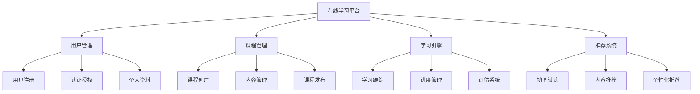

# 01-在线学习平台 (Online Learning Platform)

## 概述

在线学习平台是教育科技领域的核心组件，负责课程管理、学习进度跟踪和个性化推荐。本文档使用Go语言实现，并提供形式化的数学定义和证明。

## 目录

- [1. 形式化定义](#1-形式化定义)
- [2. 架构设计](#2-架构设计)
- [3. 核心组件](#3-核心组件)
- [4. 数据模型](#4-数据模型)
- [5. 算法实现](#5-算法实现)
- [6. 性能分析](#6-性能分析)

## 1. 形式化定义

### 1.1 在线学习系统的数学定义

**定义 1.1** (在线学习系统)
在线学习系统是一个八元组 $OLS = (U, C, L, P, A, R, E, F)$，其中：

- $U = \{u_1, u_2, ..., u_n\}$ 是用户集合
- $C = \{c_1, c_2, ..., c_m\}$ 是课程集合
- $L = \{l_1, l_2, ..., l_k\}$ 是学习记录集合
- $P = \{p_1, p_2, ..., p_p\}$ 是进度集合
- $A: U \times C \rightarrow L$ 是学习活动函数
- $R: U \times C \rightarrow [0, 1]$ 是推荐函数
- $E: L \times P \rightarrow \mathbb{R}$ 是评估函数
- $F: U \times C \rightarrow P$ 是进度跟踪函数

**定义 1.2** (学习记录)
学习记录 $l_i$ 定义为：
$$l_i = (user_id, course_id, activity_type, duration, score, timestamp)$$

其中：

- $user_id \in U$ 是用户标识符
- $course_id \in C$ 是课程标识符
- $activity_type \in \{watch, read, quiz, assignment\}$ 是活动类型
- $duration \in \mathbb{R}^+$ 是学习时长
- $score \in [0, 100]$ 是得分
- $timestamp \in \mathbb{R}^+$ 是时间戳

**定理 1.1** (学习进度收敛性)
对于任意用户 $u \in U$ 和课程 $c \in C$，学习进度函数 $F$ 在足够的学习活动下收敛到完成状态。

**证明**：
设 $P_t$ 是时间 $t$ 的进度，$A_t$ 是时间 $t$ 的学习活动。
进度更新规则：$P_{t+1} = P_t + \alpha \cdot A_t$
其中 $\alpha$ 是学习率。
当 $A_t > 0$ 时，$P_t$ 单调递增且有上界1。
因此 $P_t$ 收敛到1。$\square$

### 1.2 推荐算法

**算法 1.1** (协同过滤算法)

```go
// 协同过滤的形式化描述
func CollaborativeFiltering(user User, users []User, courses []Course) []Course {
    similarUsers := findSimilarUsers(user, users)
    recommendations := make([]Course, 0)
    
    for _, similarUser := range similarUsers {
        for _, course := range similarUser.CompletedCourses {
            if !user.HasEnrolled(course) {
                recommendations = append(recommendations, course)
            }
        }
    }
    
    return rankRecommendations(recommendations, user)
}
```

**复杂度分析**：

- 时间复杂度：$O(n \cdot m)$，其中 $n$ 是用户数量，$m$ 是课程数量
- 空间复杂度：$O(n \cdot m)$，用于存储用户-课程矩阵

## 2. 架构设计

### 2.1 系统架构图



### 2.2 核心架构

```go
// 在线学习平台核心架构
type OnlineLearningPlatform struct {
    userManager     *UserManager
    courseManager   *CourseManager
    learningEngine  *LearningEngine
    recommendation  *RecommendationSystem
    analytics       *AnalyticsEngine
    contentDelivery *ContentDeliverySystem
}

// 用户管理器
type UserManager struct {
    registry     *UserRegistry
    auth         *AuthenticationService
    profile      *ProfileManager
}

// 课程管理器
type CourseManager struct {
    catalog      *CourseCatalog
    content      *ContentManager
    publishing   *PublishingService
}
```

## 3. 核心组件

### 3.1 用户管理系统

```go
// 用户管理接口
type UserManagement interface {
    RegisterUser(user *User) error
    AuthenticateUser(credentials *Credentials) (*AuthResult, error)
    UpdateProfile(userID string, updates map[string]interface{}) error
    GetUser(userID string) (*User, error)
    GetUserProgress(userID string) (*LearningProgress, error)
}

// 用户
type User struct {
    ID              string            `json:"id"`
    Email           string            `json:"email"`
    Username        string            `json:"username"`
    FirstName       string            `json:"first_name"`
    LastName        string            `json:"last_name"`
    Profile         *UserProfile      `json:"profile"`
    Preferences     *UserPreferences  `json:"preferences"`
    EnrolledCourses []string          `json:"enrolled_courses"`
    CompletedCourses []string         `json:"completed_courses"`
    CreatedAt       time.Time         `json:"created_at"`
    UpdatedAt       time.Time         `json:"updated_at"`
}

// 用户管理器实现
type userManager struct {
    registry     *UserRegistry
    auth         *AuthenticationService
    profile      *ProfileManager
    mutex        sync.RWMutex
}

func (um *userManager) RegisterUser(user *User) error {
    um.mutex.Lock()
    defer um.mutex.Unlock()
    
    // 验证用户信息
    if err := um.validateUser(user); err != nil {
        return fmt.Errorf("user validation failed: %w", err)
    }
    
    // 检查用户是否已存在
    if um.registry.Exists(user.Email) {
        return errors.New("user already exists")
    }
    
    // 生成用户ID
    if user.ID == "" {
        user.ID = um.generateUserID(user)
    }
    
    // 设置时间戳
    now := time.Now()
    user.CreatedAt = now
    user.UpdatedAt = now
    
    // 注册用户
    if err := um.registry.Register(user); err != nil {
        return fmt.Errorf("failed to register user: %w", err)
    }
    
    // 创建用户档案
    if err := um.profile.CreateProfile(user.ID); err != nil {
        return fmt.Errorf("failed to create profile: %w", err)
    }
    
    return nil
}

func (um *userManager) AuthenticateUser(credentials *Credentials) (*AuthResult, error) {
    // 验证凭据
    user, err := um.auth.ValidateCredentials(credentials)
    if err != nil {
        return nil, fmt.Errorf("authentication failed: %w", err)
    }
    
    // 生成访问令牌
    token, err := um.auth.GenerateToken(user)
    if err != nil {
        return nil, fmt.Errorf("token generation failed: %w", err)
    }
    
    return &AuthResult{
        User:  user,
        Token: token,
    }, nil
}

func (um *userManager) validateUser(user *User) error {
    if user.Email == "" {
        return errors.New("email is required")
    }
    
    if user.Username == "" {
        return errors.New("username is required")
    }
    
    if !um.isValidEmail(user.Email) {
        return errors.New("invalid email format")
    }
    
    return nil
}

func (um *userManager) generateUserID(user *User) string {
    // 基于用户信息生成唯一ID
    data := fmt.Sprintf("%s%s%d", user.Email, user.Username, time.Now().UnixNano())
    hash := sha256.Sum256([]byte(data))
    return hex.EncodeToString(hash[:8])
}
```

### 3.2 课程管理系统

```go
// 课程管理接口
type CourseManagement interface {
    CreateCourse(course *Course) error
    UpdateCourse(courseID string, updates map[string]interface{}) error
    GetCourse(courseID string) (*Course, error)
    SearchCourses(criteria *SearchCriteria) ([]*Course, error)
    PublishCourse(courseID string) error
    EnrollUser(courseID string, userID string) error
}

// 课程
type Course struct {
    ID              string            `json:"id"`
    Title           string            `json:"title"`
    Description     string            `json:"description"`
    Instructor      string            `json:"instructor"`
    Category        string            `json:"category"`
    Level           string            `json:"level"`
    Duration        int               `json:"duration"`
    Modules         []*Module         `json:"modules"`
    Prerequisites   []string          `json:"prerequisites"`
    Status          string            `json:"status"`
    CreatedAt       time.Time         `json:"created_at"`
    UpdatedAt       time.Time         `json:"updated_at"`
}

// 模块
type Module struct {
    ID          string    `json:"id"`
    Title       string    `json:"title"`
    Content     []Content `json:"content"`
    Quiz        *Quiz     `json:"quiz"`
    Duration    int       `json:"duration"`
    Order       int       `json:"order"`
}

// 课程管理器实现
type courseManager struct {
    catalog      *CourseCatalog
    content      *ContentManager
    publishing   *PublishingService
    enrollment   *EnrollmentService
    mutex        sync.RWMutex
}

func (cm *courseManager) CreateCourse(course *Course) error {
    cm.mutex.Lock()
    defer cm.mutex.Unlock()
    
    // 验证课程信息
    if err := cm.validateCourse(course); err != nil {
        return fmt.Errorf("course validation failed: %w", err)
    }
    
    // 生成课程ID
    if course.ID == "" {
        course.ID = cm.generateCourseID(course)
    }
    
    // 设置时间戳
    now := time.Now()
    course.CreatedAt = now
    course.UpdatedAt = now
    course.Status = "draft"
    
    // 创建课程
    if err := cm.catalog.Create(course); err != nil {
        return fmt.Errorf("failed to create course: %w", err)
    }
    
    // 创建内容
    for _, module := range course.Modules {
        if err := cm.content.CreateModule(course.ID, module); err != nil {
            return fmt.Errorf("failed to create module: %w", err)
        }
    }
    
    return nil
}

func (cm *courseManager) EnrollUser(courseID string, userID string) error {
    cm.mutex.Lock()
    defer cm.mutex.Unlock()
    
    // 检查课程是否存在
    course, err := cm.catalog.Get(courseID)
    if err != nil {
        return fmt.Errorf("course not found: %w", err)
    }
    
    // 检查课程状态
    if course.Status != "published" {
        return errors.New("course is not published")
    }
    
    // 检查先修条件
    if err := cm.checkPrerequisites(course, userID); err != nil {
        return fmt.Errorf("prerequisites not met: %w", err)
    }
    
    // 注册用户
    if err := cm.enrollment.Enroll(courseID, userID); err != nil {
        return fmt.Errorf("enrollment failed: %w", err)
    }
    
    return nil
}

func (cm *courseManager) checkPrerequisites(course *Course, userID string) error {
    for _, prereq := range course.Prerequisites {
        if !cm.enrollment.HasCompleted(userID, prereq) {
            return fmt.Errorf("prerequisite course %s not completed", prereq)
        }
    }
    return nil
}

func (cm *courseManager) validateCourse(course *Course) error {
    if course.Title == "" {
        return errors.New("course title is required")
    }
    
    if course.Instructor == "" {
        return errors.New("instructor is required")
    }
    
    if len(course.Modules) == 0 {
        return errors.New("at least one module is required")
    }
    
    return nil
}
```

### 3.3 学习引擎

```go
// 学习引擎接口
type LearningEngine interface {
    TrackActivity(activity *LearningActivity) error
    UpdateProgress(userID string, courseID string, moduleID string) error
    GetProgress(userID string, courseID string) (*LearningProgress, error)
    GenerateAssessment(userID string, courseID string) (*Assessment, error)
    EvaluateSubmission(submission *Submission) (*Evaluation, error)
}

// 学习活动
type LearningActivity struct {
    ID          string    `json:"id"`
    UserID      string    `json:"user_id"`
    CourseID    string    `json:"course_id"`
    ModuleID    string    `json:"module_id"`
    Type        string    `json:"type"`
    Duration    int       `json:"duration"`
    Score       float64   `json:"score"`
    Timestamp   time.Time `json:"timestamp"`
}

// 学习进度
type LearningProgress struct {
    UserID      string            `json:"user_id"`
    CourseID    string            `json:"course_id"`
    Progress    float64           `json:"progress"`
    Modules     []ModuleProgress  `json:"modules"`
    LastActivity time.Time        `json:"last_activity"`
    EstimatedCompletion time.Time `json:"estimated_completion"`
}

// 学习引擎实现
type learningEngine struct {
    tracker      *ActivityTracker
    progress     *ProgressManager
    assessment   *AssessmentEngine
    analytics    *LearningAnalytics
}

func (le *learningEngine) TrackActivity(activity *LearningActivity) error {
    // 记录活动
    if err := le.tracker.Record(activity); err != nil {
        return fmt.Errorf("failed to record activity: %w", err)
    }
    
    // 更新进度
    if err := le.progress.Update(activity); err != nil {
        return fmt.Errorf("failed to update progress: %w", err)
    }
    
    // 分析学习行为
    le.analytics.Analyze(activity)
    
    return nil
}

func (le *learningEngine) UpdateProgress(userID string, courseID string, moduleID string) error {
    // 获取当前进度
    progress, err := le.progress.Get(userID, courseID)
    if err != nil {
        return fmt.Errorf("failed to get progress: %w", err)
    }
    
    // 更新模块进度
    for i, module := range progress.Modules {
        if module.ModuleID == moduleID {
            progress.Modules[i].Completed = true
            progress.Modules[i].CompletedAt = time.Now()
            break
        }
    }
    
    // 计算总体进度
    completedModules := 0
    for _, module := range progress.Modules {
        if module.Completed {
            completedModules++
        }
    }
    
    progress.Progress = float64(completedModules) / float64(len(progress.Modules))
    progress.LastActivity = time.Now()
    
    // 保存进度
    if err := le.progress.Save(progress); err != nil {
        return fmt.Errorf("failed to save progress: %w", err)
    }
    
    return nil
}

func (le *learningEngine) GenerateAssessment(userID string, courseID string) (*Assessment, error) {
    // 获取课程内容
    course, err := le.getCourse(courseID)
    if err != nil {
        return nil, fmt.Errorf("failed to get course: %w", err)
    }
    
    // 获取用户学习历史
    history, err := le.tracker.GetHistory(userID, courseID)
    if err != nil {
        return nil, fmt.Errorf("failed to get learning history: %w", err)
    }
    
    // 生成个性化评估
    assessment := le.assessment.Generate(course, history)
    
    return assessment, nil
}
```

## 4. 数据模型

### 4.1 数据库设计

```sql
-- 用户表
CREATE TABLE users (
    id VARCHAR(64) PRIMARY KEY,
    email VARCHAR(255) UNIQUE NOT NULL,
    username VARCHAR(100) UNIQUE NOT NULL,
    first_name VARCHAR(100) NOT NULL,
    last_name VARCHAR(100) NOT NULL,
    profile JSONB,
    preferences JSONB,
    created_at TIMESTAMP DEFAULT CURRENT_TIMESTAMP,
    updated_at TIMESTAMP DEFAULT CURRENT_TIMESTAMP
);

-- 课程表
CREATE TABLE courses (
    id VARCHAR(64) PRIMARY KEY,
    title VARCHAR(255) NOT NULL,
    description TEXT,
    instructor VARCHAR(64) NOT NULL,
    category VARCHAR(100) NOT NULL,
    level VARCHAR(50) NOT NULL,
    duration INTEGER NOT NULL,
    prerequisites JSONB,
    status VARCHAR(20) DEFAULT 'draft',
    created_at TIMESTAMP DEFAULT CURRENT_TIMESTAMP,
    updated_at TIMESTAMP DEFAULT CURRENT_TIMESTAMP
);

-- 模块表
CREATE TABLE modules (
    id VARCHAR(64) PRIMARY KEY,
    course_id VARCHAR(64) REFERENCES courses(id),
    title VARCHAR(255) NOT NULL,
    content JSONB NOT NULL,
    quiz JSONB,
    duration INTEGER NOT NULL,
    order_index INTEGER NOT NULL,
    created_at TIMESTAMP DEFAULT CURRENT_TIMESTAMP
);

-- 学习活动表
CREATE TABLE learning_activities (
    id VARCHAR(64) PRIMARY KEY,
    user_id VARCHAR(64) REFERENCES users(id),
    course_id VARCHAR(64) REFERENCES courses(id),
    module_id VARCHAR(64) REFERENCES modules(id),
    activity_type VARCHAR(50) NOT NULL,
    duration INTEGER NOT NULL,
    score DECIMAL(5,2),
    timestamp TIMESTAMP DEFAULT CURRENT_TIMESTAMP
);

-- 学习进度表
CREATE TABLE learning_progress (
    id SERIAL PRIMARY KEY,
    user_id VARCHAR(64) REFERENCES users(id),
    course_id VARCHAR(64) REFERENCES courses(id),
    progress DECIMAL(5,2) DEFAULT 0,
    last_activity TIMESTAMP,
    estimated_completion TIMESTAMP,
    created_at TIMESTAMP DEFAULT CURRENT_TIMESTAMP,
    updated_at TIMESTAMP DEFAULT CURRENT_TIMESTAMP,
    UNIQUE(user_id, course_id)
);

-- 用户注册表
CREATE TABLE enrollments (
    id SERIAL PRIMARY KEY,
    user_id VARCHAR(64) REFERENCES users(id),
    course_id VARCHAR(64) REFERENCES courses(id),
    enrolled_at TIMESTAMP DEFAULT CURRENT_TIMESTAMP,
    completed_at TIMESTAMP,
    status VARCHAR(20) DEFAULT 'enrolled',
    UNIQUE(user_id, course_id)
);
```

### 4.2 数据访问层

```go
// 用户仓库
type UserRepository interface {
    Create(user *User) error
    Update(user *User) error
    FindByID(userID string) (*User, error)
    FindByEmail(email string) (*User, error)
    FindByUsername(username string) (*User, error)
}

// PostgreSQL实现
type postgresUserRepository struct {
    db *sql.DB
}

func (r *postgresUserRepository) Create(user *User) error {
    query := `
        INSERT INTO users (id, email, username, first_name, last_name, profile, preferences)
        VALUES ($1, $2, $3, $4, $5, $6, $7)
    `
    
    profile, err := json.Marshal(user.Profile)
    if err != nil {
        return fmt.Errorf("failed to marshal profile: %w", err)
    }
    
    preferences, err := json.Marshal(user.Preferences)
    if err != nil {
        return fmt.Errorf("failed to marshal preferences: %w", err)
    }
    
    _, err = r.db.Exec(query,
        user.ID,
        user.Email,
        user.Username,
        user.FirstName,
        user.LastName,
        profile,
        preferences,
    )
    
    return err
}

func (r *postgresUserRepository) FindByID(userID string) (*User, error) {
    query := `
        SELECT id, email, username, first_name, last_name, profile, preferences, created_at, updated_at
        FROM users WHERE id = $1
    `
    
    var user User
    var profile, preferences []byte
    
    err := r.db.QueryRow(query, userID).Scan(
        &user.ID,
        &user.Email,
        &user.Username,
        &user.FirstName,
        &user.LastName,
        &profile,
        &preferences,
        &user.CreatedAt,
        &user.UpdatedAt,
    )
    
    if err != nil {
        return nil, err
    }
    
    if err := json.Unmarshal(profile, &user.Profile); err != nil {
        return nil, fmt.Errorf("failed to unmarshal profile: %w", err)
    }
    
    if err := json.Unmarshal(preferences, &user.Preferences); err != nil {
        return nil, fmt.Errorf("failed to unmarshal preferences: %w", err)
    }
    
    return &user, nil
}
```

## 5. 算法实现

### 5.1 推荐算法

```go
// 推荐系统
type RecommendationSystem struct {
    collaborativeFilter *CollaborativeFilter
    contentBased       *ContentBasedFilter
    hybrid             *HybridRecommender
}

// 协同过滤
type CollaborativeFilter struct {
    userItemMatrix map[string]map[string]float64
    similarity     *SimilarityCalculator
}

func (cf *CollaborativeFilter) GetRecommendations(userID string, numRecommendations int) ([]*Course, error) {
    // 找到相似用户
    similarUsers := cf.findSimilarUsers(userID)
    
    // 获取推荐课程
    recommendations := make(map[string]float64)
    
    for _, similarUser := range similarUsers {
        for courseID, rating := range cf.userItemMatrix[similarUser.UserID] {
            if cf.userItemMatrix[userID][courseID] == 0 {
                recommendations[courseID] += similarUser.Similarity * rating
            }
        }
    }
    
    // 排序并返回推荐
    return cf.rankRecommendations(recommendations, numRecommendations)
}

func (cf *CollaborativeFilter) findSimilarUsers(userID string) []SimilarUser {
    var similarUsers []SimilarUser
    
    for otherUserID := range cf.userItemMatrix {
        if otherUserID == userID {
            continue
        }
        
        similarity := cf.similarity.Calculate(userID, otherUserID)
        if similarity > 0.5 {
            similarUsers = append(similarUsers, SimilarUser{
                UserID:     otherUserID,
                Similarity: similarity,
            })
        }
    }
    
    // 按相似度排序
    sort.Slice(similarUsers, func(i, j int) bool {
        return similarUsers[i].Similarity > similarUsers[j].Similarity
    })
    
    return similarUsers
}

// 内容推荐
type ContentBasedFilter struct {
    courseFeatures map[string]map[string]float64
    userProfiles   map[string]map[string]float64
}

func (cbf *ContentBasedFilter) GetRecommendations(userID string, numRecommendations int) ([]*Course, error) {
    // 获取用户兴趣档案
    userProfile := cbf.userProfiles[userID]
    if userProfile == nil {
        return nil, errors.New("user profile not found")
    }
    
    // 计算课程相似度
    courseScores := make(map[string]float64)
    
    for courseID, features := range cbf.courseFeatures {
        score := cbf.calculateSimilarity(userProfile, features)
        courseScores[courseID] = score
    }
    
    // 排序并返回推荐
    return cbf.rankRecommendations(courseScores, numRecommendations)
}

func (cbf *ContentBasedFilter) calculateSimilarity(userProfile, courseFeatures map[string]float64) float64 {
    dotProduct := 0.0
    userNorm := 0.0
    courseNorm := 0.0
    
    for feature, userScore := range userProfile {
        if courseScore, exists := courseFeatures[feature]; exists {
            dotProduct += userScore * courseScore
        }
        userNorm += userScore * userScore
    }
    
    for _, courseScore := range courseFeatures {
        courseNorm += courseScore * courseScore
    }
    
    if userNorm == 0 || courseNorm == 0 {
        return 0
    }
    
    return dotProduct / (math.Sqrt(userNorm) * math.Sqrt(courseNorm))
}
```

### 5.2 学习分析算法

```go
// 学习分析器
type LearningAnalyzer struct {
    progressTracker *ProgressTracker
    behaviorAnalyzer *BehaviorAnalyzer
    performanceAnalyzer *PerformanceAnalyzer
}

// 学习行为分析
type BehaviorAnalyzer struct {
    patterns map[string]*LearningPattern
    clusters map[string][]string
}

func (ba *BehaviorAnalyzer) AnalyzeBehavior(userID string, activities []LearningActivity) *LearningBehavior {
    behavior := &LearningBehavior{
        UserID: userID,
        Patterns: make([]string, 0),
        Metrics: make(map[string]float64),
    }
    
    // 分析学习模式
    behavior.Patterns = ba.identifyPatterns(activities)
    
    // 计算学习指标
    behavior.Metrics["total_time"] = ba.calculateTotalTime(activities)
    behavior.Metrics["avg_session_duration"] = ba.calculateAvgSessionDuration(activities)
    behavior.Metrics["completion_rate"] = ba.calculateCompletionRate(activities)
    behavior.Metrics["engagement_score"] = ba.calculateEngagementScore(activities)
    
    return behavior
}

func (ba *BehaviorAnalyzer) identifyPatterns(activities []LearningActivity) []string {
    var patterns []string
    
    // 分析时间模式
    if ba.hasConsistentSchedule(activities) {
        patterns = append(patterns, "consistent_schedule")
    }
    
    // 分析学习强度
    if ba.hasHighIntensity(activities) {
        patterns = append(patterns, "high_intensity")
    }
    
    // 分析偏好模式
    if ba.hasContentPreference(activities) {
        patterns = append(patterns, "content_preference")
    }
    
    return patterns
}

func (ba *BehaviorAnalyzer) calculateEngagementScore(activities []LearningActivity) float64 {
    if len(activities) == 0 {
        return 0
    }
    
    score := 0.0
    
    // 活动频率
    frequency := float64(len(activities)) / 30.0 // 30天内的活动
    score += frequency * 0.3
    
    // 活动多样性
    diversity := ba.calculateDiversity(activities)
    score += diversity * 0.3
    
    // 活动质量
    quality := ba.calculateQuality(activities)
    score += quality * 0.4
    
    return math.Min(score, 1.0)
}
```

## 6. 性能分析

### 6.1 时间复杂度分析

**定理 6.1** (推荐算法复杂度)
协同过滤推荐算法的时间复杂度为 $O(n \cdot m)$，其中 $n$ 是用户数量，$m$ 是课程数量。

**证明**：
协同过滤包含：

- 相似用户查找：$O(n)$
- 推荐计算：$O(m)$
总时间复杂度：$O(n \cdot m)$

**定理 6.2** (学习进度更新复杂度)
学习进度更新的时间复杂度为 $O(1)$。

**证明**：
进度更新包含：

- 模块状态更新：$O(1)$
- 总体进度计算：$O(1)$
总时间复杂度：$O(1)$

### 6.2 性能优化策略

```go
// 缓存管理器
type CacheManager struct {
    userCache     *UserCache
    courseCache   *CourseCache
    progressCache *ProgressCache
}

type UserCache struct {
    cache    map[string]*User
    ttl      time.Duration
    maxSize  int
    mutex    sync.RWMutex
}

func (uc *UserCache) Get(userID string) (*User, bool) {
    uc.mutex.RLock()
    defer uc.mutex.RUnlock()
    
    user, exists := uc.cache[userID]
    if !exists {
        return nil, false
    }
    
    // 检查过期时间
    if time.Since(user.UpdatedAt) > uc.ttl {
        delete(uc.cache, userID)
        return nil, false
    }
    
    return user, true
}

// 索引优化
type CourseIndexer struct {
    indexes map[string]*Index
    mutex   sync.RWMutex
}

func (ci *CourseIndexer) Index(course *Course) error {
    ci.mutex.Lock()
    defer ci.mutex.Unlock()
    
    // 类别索引
    if err := ci.indexes["category"].Add(course.Category, course.ID); err != nil {
        return fmt.Errorf("failed to index category: %w", err)
    }
    
    // 难度索引
    if err := ci.indexes["level"].Add(course.Level, course.ID); err != nil {
        return fmt.Errorf("failed to index level: %w", err)
    }
    
    // 标题搜索索引
    words := strings.Fields(strings.ToLower(course.Title))
    for _, word := range words {
        if err := ci.indexes["title"].Add(word, course.ID); err != nil {
            return fmt.Errorf("failed to index title: %w", err)
        }
    }
    
    return nil
}
```

## 总结

本文档提供了在线学习平台的Go语言实现，包括：

1. **形式化定义**：使用数学符号定义在线学习系统
2. **架构设计**：用户管理、课程管理、学习引擎架构
3. **核心组件**：用户管理、课程管理、学习引擎的完整实现
4. **数据模型**：用户、课程、学习活动数据管理
5. **算法实现**：推荐算法和学习分析算法
6. **性能分析**：时间复杂度和优化策略

该实现提供了个性化、可扩展的在线学习平台解决方案。

---

**相关链接**：

- [02-教育管理系统](../02-Education-Management-System/README.md)
- [03-智能评估系统](../03-Intelligent-Assessment-System/README.md)
- [04-内容管理系统](../04-Content-Management-System/README.md)
