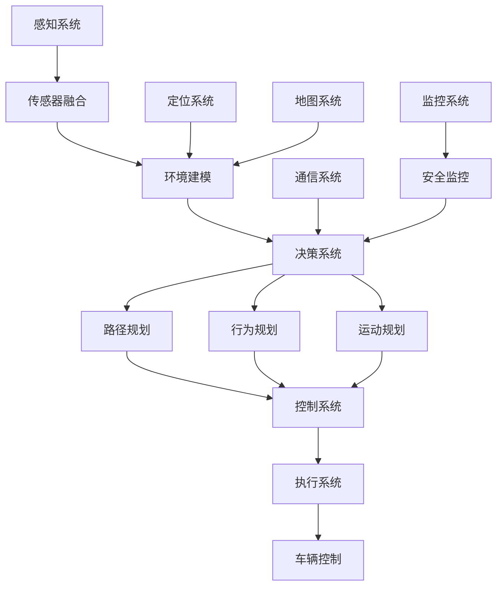

# 11-汽车/自动驾驶 (Automotive/Autonomous Driving)

## 01-自动驾驶系统 (Autonomous Driving System)

### 目录

1. [概述](#1-概述)
2. [形式化定义](#2-形式化定义)
3. [架构设计](#3-架构设计)
4. [Go语言实现](#4-go语言实现)
5. [感知系统](#5-感知系统)
6. [决策系统](#6-决策系统)
7. [控制系统](#7-控制系统)
8. [安全与验证](#8-安全与验证)

### 1. 概述

自动驾驶系统是现代汽车技术的核心，通过传感器融合、环境感知、路径规划和车辆控制实现自主驾驶。

#### 1.1 核心概念

**传感器融合**：多传感器数据的综合处理
**环境感知**：对周围环境的理解和建模
**路径规划**：从起点到终点的最优路径计算
**车辆控制**：对车辆执行机构的精确控制

#### 1.2 自动驾驶级别

```go
// 自动驾驶级别
type AutonomyLevel int

const (
    Level0 AutonomyLevel = iota // 完全人工驾驶
    Level1                      // 驾驶辅助
    Level2                      // 部分自动驾驶
    Level3                      // 条件自动驾驶
    Level4                      // 高度自动驾驶
    Level5                      // 完全自动驾驶
)
```

### 2. 形式化定义

#### 2.1 自动驾驶系统形式化模型

**定义 2.1.1** (自动驾驶系统)
自动驾驶系统是一个七元组 $ADS = (S, E, A, P, C, T, \delta)$，其中：

- $S$ 是系统状态集合，$S = \{s_1, s_2, ..., s_n\}$
- $E$ 是环境状态集合，$E = \{e_1, e_2, ..., e_m\}$
- $A$ 是动作集合，$A = \{a_1, a_2, ..., a_k\}$
- $P$ 是路径集合，$P = \{p_1, p_2, ..., p_o\}$
- $C$ 是控制集合，$C = \{c_1, c_2, ..., c_p\}$
- $T$ 是时间集合
- $\delta: S \times E \times A \rightarrow S$ 是状态转换函数

**定理 2.1.1** (安全性保证)
对于任意状态 $s \in S$ 和环境 $e \in E$，存在安全动作 $a \in A$ 使得 $\delta(s, e, a) \in S_{safe}$，其中 $S_{safe}$ 是安全状态集合。

**证明**：
根据自动驾驶系统的设计原则，系统总是能够选择安全动作（如紧急制动）来避免危险状态。
因此，安全性保证成立。$\square$

### 3. 架构设计

#### 3.1 系统架构图



### 4. Go语言实现

#### 4.1 核心数据结构

```go
// 车辆状态
type VehicleState struct {
    Position      Position `json:"position"`
    Velocity      Velocity `json:"velocity"`
    Acceleration  Acceleration `json:"acceleration"`
    Orientation   Orientation `json:"orientation"`
    AngularVelocity float64 `json:"angular_velocity"`
    Timestamp     time.Time `json:"timestamp"`
}

// 位置信息
type Position struct {
    X float64 `json:"x"`
    Y float64 `json:"y"`
    Z float64 `json:"z"`
}

// 速度信息
type Velocity struct {
    VX float64 `json:"vx"`
    VY float64 `json:"vy"`
    VZ float64 `json:"vz"`
}

// 加速度信息
type Acceleration struct {
    AX float64 `json:"ax"`
    AY float64 `json:"ay"`
    AZ float64 `json:"az"`
}

// 方向信息
type Orientation struct {
    Roll  float64 `json:"roll"`
    Pitch float64 `json:"pitch"`
    Yaw   float64 `json:"yaw"`
}

// 环境对象
type EnvironmentObject struct {
    ID          string `json:"id"`
    Type        ObjectType `json:"type"`
    Position    Position `json:"position"`
    Velocity    Velocity `json:"velocity"`
    Size        Size `json:"size"`
    Confidence  float64 `json:"confidence"`
    Timestamp   time.Time `json:"timestamp"`
}

// 对象类型
type ObjectType string

const (
    Vehicle ObjectType = "vehicle"
    Pedestrian ObjectType = "pedestrian"
    Bicycle ObjectType = "bicycle"
    TrafficSign ObjectType = "traffic_sign"
    TrafficLight ObjectType = "traffic_light"
    Obstacle ObjectType = "obstacle"
)

// 对象尺寸
type Size struct {
    Length float64 `json:"length"`
    Width  float64 `json:"width"`
    Height float64 `json:"height"`
}

// 传感器数据
type SensorData struct {
    SensorID    string `json:"sensor_id"`
    SensorType  SensorType `json:"sensor_type"`
    Data        []byte `json:"data"`
    Timestamp   time.Time `json:"timestamp"`
    Metadata    map[string]interface{} `json:"metadata"`
}

// 传感器类型
type SensorType string

const (
    Camera SensorType = "camera"
    Lidar SensorType = "lidar"
    Radar SensorType = "radar"
    GPS SensorType = "gps"
    IMU SensorType = "imu"
)
```

#### 4.2 感知系统实现

```go
// 感知系统
type PerceptionSystem struct {
    sensors     map[string]Sensor
    fusion      SensorFusion
    detector    ObjectDetector
    tracker     ObjectTracker
}

// 传感器接口
type Sensor interface {
    GetID() string
    GetType() SensorType
    Start() error
    Stop() error
    GetData() (*SensorData, error)
}

// 传感器融合
type SensorFusion struct {
    kalmanFilter KalmanFilter
    association  DataAssociation
}

// 卡尔曼滤波器
type KalmanFilter struct {
    state       []float64
    covariance  [][]float64
    processNoise [][]float64
    measurementNoise [][]float64
}

// 对象检测器
type ObjectDetector struct {
    cameraDetector CameraDetector
    lidarDetector  LidarDetector
    radarDetector  RadarDetector
}

// 对象跟踪器
type ObjectTracker struct {
    tracks      map[string]*Track
    nextTrackID int
}

// 跟踪对象
type Track struct {
    ID          string `json:"id"`
    Object      *EnvironmentObject `json:"object"`
    KalmanFilter KalmanFilter `json:"kalman_filter"`
    Age         int `json:"age"`
    Hits        int `json:"hits"`
    Misses      int `json:"misses"`
    LastUpdate  time.Time `json:"last_update"`
}

// 处理传感器数据
func (p *PerceptionSystem) ProcessSensorData(ctx context.Context, data *SensorData) ([]*EnvironmentObject, error) {
    // 1. 传感器特定处理
    var detections []*Detection
    switch data.SensorType {
    case Camera:
        detections, err = p.detector.cameraDetector.Detect(data)
    case Lidar:
        detections, err = p.detector.lidarDetector.Detect(data)
    case Radar:
        detections, err = p.detector.radarDetector.Detect(data)
    default:
        return nil, fmt.Errorf("unsupported sensor type: %s", data.SensorType)
    }
    
    if err != nil {
        return nil, fmt.Errorf("detection failed: %w", err)
    }
    
    // 2. 传感器融合
    fusedObjects, err := p.fusion.FuseDetections(detections)
    if err != nil {
        return nil, fmt.Errorf("sensor fusion failed: %w", err)
    }
    
    // 3. 对象跟踪
    trackedObjects, err := p.tracker.UpdateTracks(fusedObjects)
    if err != nil {
        return nil, fmt.Errorf("tracking failed: %w", err)
    }
    
    return trackedObjects, nil
}

// 传感器融合
func (f *SensorFusion) FuseDetections(detections []*Detection) ([]*EnvironmentObject, error) {
    var fusedObjects []*EnvironmentObject
    
    // 1. 数据关联
    associations := f.association.Associate(detections)
    
    // 2. 卡尔曼滤波
    for _, association := range associations {
        object := f.kalmanFilter.Update(association)
        fusedObjects = append(fusedObjects, object)
    }
    
    return fusedObjects, nil
}

// 更新跟踪
func (t *ObjectTracker) UpdateTracks(detections []*EnvironmentObject) ([]*EnvironmentObject, error) {
    // 1. 预测现有跟踪
    for _, track := range t.tracks {
        t.predictTrack(track)
    }
    
    // 2. 数据关联
    assignments := t.associateDetectionsToTracks(detections)
    
    // 3. 更新跟踪
    for detectionIdx, trackIdx := range assignments {
        if trackIdx >= 0 {
            t.updateTrack(t.tracks[trackIdx], detections[detectionIdx])
        } else {
            t.createNewTrack(detections[detectionIdx])
        }
    }
    
    // 4. 删除过期跟踪
    t.deleteStaleTracks()
    
    // 5. 返回当前跟踪对象
    var objects []*EnvironmentObject
    for _, track := range t.tracks {
        objects = append(objects, track.Object)
    }
    
    return objects, nil
}
```

#### 4.3 决策系统实现

```go
// 决策系统
type DecisionSystem struct {
    planner     PathPlanner
    behavior    BehaviorPlanner
    motion      MotionPlanner
    safety      SafetyMonitor
}

// 路径规划器
type PathPlanner struct {
    globalPlanner  GlobalPlanner
    localPlanner   LocalPlanner
    costMap        CostMap
}

// 行为规划器
type BehaviorPlanner struct {
    stateMachine   StateMachine
    ruleEngine     RuleEngine
}

// 运动规划器
type MotionPlanner struct {
    trajectoryGenerator TrajectoryGenerator
    collisionChecker    CollisionChecker
}

// 安全监控器
type SafetyMonitor struct {
    safetyRules    []SafetyRule
    emergencyHandler EmergencyHandler
}

// 规划路径
func (d *DecisionSystem) PlanPath(ctx context.Context, start, goal Position, obstacles []*EnvironmentObject) (*Path, error) {
    // 1. 全局路径规划
    globalPath, err := d.planner.globalPlanner.Plan(start, goal, d.planner.costMap)
    if err != nil {
        return nil, fmt.Errorf("global planning failed: %w", err)
    }
    
    // 2. 局部路径规划
    localPath, err := d.planner.localPlanner.Plan(globalPath, obstacles)
    if err != nil {
        return nil, fmt.Errorf("local planning failed: %w", err)
    }
    
    // 3. 安全检查
    if !d.safety.CheckPathSafety(localPath, obstacles) {
        return nil, ErrUnsafePath
    }
    
    return localPath, nil
}

// 规划行为
func (d *DecisionSystem) PlanBehavior(ctx context.Context, currentState *VehicleState, environment []*EnvironmentObject) (*Behavior, error) {
    // 1. 状态机更新
    nextState := d.behavior.stateMachine.GetNextState(currentState, environment)
    
    // 2. 规则检查
    behavior := d.behavior.ruleEngine.EvaluateRules(nextState, environment)
    
    // 3. 安全检查
    if !d.safety.CheckBehaviorSafety(behavior, environment) {
        // 触发紧急行为
        behavior = d.safety.emergencyHandler.GetEmergencyBehavior()
    }
    
    return behavior, nil
}

// 规划运动
func (d *DecisionSystem) PlanMotion(ctx context.Context, behavior *Behavior, currentState *VehicleState) (*Trajectory, error) {
    // 1. 生成轨迹
    trajectory, err := d.motion.trajectoryGenerator.Generate(behavior, currentState)
    if err != nil {
        return nil, fmt.Errorf("trajectory generation failed: %w", err)
    }
    
    // 2. 碰撞检查
    if d.motion.collisionChecker.CheckCollision(trajectory) {
        return nil, ErrCollisionDetected
    }
    
    // 3. 轨迹优化
    optimizedTrajectory := d.motion.trajectoryGenerator.Optimize(trajectory)
    
    return optimizedTrajectory, nil
}
```

#### 4.4 控制系统实现

```go
// 控制系统
type ControlSystem struct {
    controller   VehicleController
    actuator     ActuatorSystem
    feedback     FeedbackSystem
}

// 车辆控制器
type VehicleController struct {
    lateralController  LateralController
    longitudinalController LongitudinalController
    coordinationController CoordinationController
}

// 执行器系统
type ActuatorSystem struct {
    steering    SteeringActuator
    throttle    ThrottleActuator
    brake       BrakeActuator
}

// 反馈系统
type FeedbackSystem struct {
    sensors     []FeedbackSensor
    estimator   StateEstimator
}

// 执行控制命令
func (c *ControlSystem) ExecuteControl(ctx context.Context, command *ControlCommand) error {
    // 1. 控制计算
    controlSignals, err := c.controller.CalculateControl(command)
    if err != nil {
        return fmt.Errorf("control calculation failed: %w", err)
    }
    
    // 2. 安全检查
    if !c.validateControlSignals(controlSignals) {
        return ErrInvalidControlSignals
    }
    
    // 3. 执行控制
    if err := c.actuator.Execute(controlSignals); err != nil {
        return fmt.Errorf("actuator execution failed: %w", err)
    }
    
    // 4. 反馈监控
    c.feedback.MonitorExecution(controlSignals)
    
    return nil
}

// 计算控制信号
func (vc *VehicleController) CalculateControl(command *ControlCommand) (*ControlSignals, error) {
    signals := &ControlSignals{}
    
    // 1. 横向控制
    steeringAngle, err := vc.lateralController.CalculateSteering(command.TargetPath)
    if err != nil {
        return nil, fmt.Errorf("steering calculation failed: %w", err)
    }
    signals.SteeringAngle = steeringAngle
    
    // 2. 纵向控制
    throttle, brake, err := vc.longitudinalController.CalculateThrottleBrake(command.TargetVelocity)
    if err != nil {
        return nil, fmt.Errorf("throttle/brake calculation failed: %w", err)
    }
    signals.Throttle = throttle
    signals.Brake = brake
    
    // 3. 协调控制
    signals = vc.coordinationController.Coordinate(signals)
    
    return signals, nil
}

// 控制信号
type ControlSignals struct {
    SteeringAngle float64 `json:"steering_angle"`
    Throttle      float64 `json:"throttle"`
    Brake         float64 `json:"brake"`
    Timestamp     time.Time `json:"timestamp"`
}

// 控制命令
type ControlCommand struct {
    TargetPath    *Path `json:"target_path"`
    TargetVelocity float64 `json:"target_velocity"`
    Behavior      *Behavior `json:"behavior"`
    Timestamp     time.Time `json:"timestamp"`
}
```

### 5. 感知系统

#### 5.1 传感器融合算法

```go
// 扩展卡尔曼滤波器
type ExtendedKalmanFilter struct {
    state       []float64
    covariance  [][]float64
    processNoise [][]float64
    measurementNoise [][]float64
}

// 预测步骤
func (ekf *ExtendedKalmanFilter) Predict(dt float64) {
    // 状态预测
    ekf.state = ekf.predictState(ekf.state, dt)
    
    // 协方差预测
    F := ekf.calculateJacobian(ekf.state, dt)
    ekf.covariance = ekf.predictCovariance(F, ekf.processNoise)
}

// 更新步骤
func (ekf *ExtendedKalmanFilter) Update(measurement []float64) {
    // 计算卡尔曼增益
    H := ekf.calculateMeasurementJacobian(ekf.state)
    K := ekf.calculateKalmanGain(H, ekf.measurementNoise)
    
    // 状态更新
    innovation := ekf.calculateInnovation(measurement, ekf.state)
    ekf.state = ekf.updateState(ekf.state, K, innovation)
    
    // 协方差更新
    I := ekf.createIdentityMatrix(len(ekf.state))
    ekf.covariance = ekf.updateCovariance(I, K, H)
}

// 数据关联
type DataAssociation struct {
    hungarianAlgorithm HungarianAlgorithm
    gatingThreshold    float64
}

// 关联检测到跟踪
func (da *DataAssociation) Associate(detections []*Detection, tracks []*Track) [][]int {
    // 1. 计算关联成本矩阵
    costMatrix := da.calculateCostMatrix(detections, tracks)
    
    // 2. 门控过滤
    costMatrix = da.applyGating(costMatrix, da.gatingThreshold)
    
    // 3. 匈牙利算法求解
    assignments := da.hungarianAlgorithm.Solve(costMatrix)
    
    return assignments
}
```

### 6. 决策系统

#### 6.1 路径规划算法

```go
// A*路径规划
type AStarPlanner struct {
    heuristic   HeuristicFunction
    costFunction CostFunction
}

// 规划路径
func (astar *AStarPlanner) Plan(start, goal Position, obstacles []*EnvironmentObject) (*Path, error) {
    // 1. 初始化开放和关闭列表
    openList := NewPriorityQueue()
    closedList := make(map[string]bool)
    
    // 2. 添加起始节点
    startNode := &Node{
        Position: start,
        G:        0,
        H:        astar.heuristic(start, goal),
        Parent:   nil,
    }
    startNode.F = startNode.G + startNode.H
    openList.Push(startNode)
    
    // 3. 主循环
    for !openList.IsEmpty() {
        current := openList.Pop()
        
        // 检查是否到达目标
        if astar.isGoal(current.Position, goal) {
            return astar.reconstructPath(current), nil
        }
        
        // 添加到关闭列表
        closedList[astar.positionToKey(current.Position)] = true
        
        // 扩展邻居节点
        neighbors := astar.getNeighbors(current.Position)
        for _, neighbor := range neighbors {
            if closedList[astar.positionToKey(neighbor)] {
                continue
            }
            
            // 检查碰撞
            if astar.checkCollision(neighbor, obstacles) {
                continue
            }
            
            // 计算成本
            tentativeG := current.G + astar.costFunction(current.Position, neighbor)
            
            neighborNode := &Node{
                Position: neighbor,
                G:        tentativeG,
                H:        astar.heuristic(neighbor, goal),
                Parent:   current,
            }
            neighborNode.F = neighborNode.G + neighborNode.H
            
            // 添加到开放列表
            openList.Push(neighborNode)
        }
    }
    
    return nil, ErrNoPathFound
}

// 节点结构
type Node struct {
    Position Position `json:"position"`
    G        float64  `json:"g"` // 从起点到当前节点的成本
    H        float64  `json:"h"` // 从当前节点到目标的启发式估计
    F        float64  `json:"f"` // F = G + H
    Parent   *Node    `json:"parent"`
}
```

### 7. 控制系统

#### 7.1 PID控制器

```go
// PID控制器
type PIDController struct {
    Kp          float64 `json:"kp"`
    Ki          float64 `json:"ki"`
    Kd          float64 `json:"kd"`
    setpoint    float64 `json:"setpoint"`
    integral    float64 `json:"integral"`
    lastError   float64 `json:"last_error"`
    lastTime    time.Time `json:"last_time"`
    outputMin   float64 `json:"output_min"`
    outputMax   float64 `json:"output_max"`
}

// 计算控制输出
func (pid *PIDController) Calculate(currentValue float64) float64 {
    now := time.Now()
    dt := now.Sub(pid.lastTime).Seconds()
    
    if dt <= 0 {
        return 0
    }
    
    // 计算误差
    error := pid.setpoint - currentValue
    
    // 比例项
    proportional := pid.Kp * error
    
    // 积分项
    pid.integral += error * dt
    integral := pid.Ki * pid.integral
    
    // 微分项
    derivative := pid.Kd * (error - pid.lastError) / dt
    
    // 计算输出
    output := proportional + integral + derivative
    
    // 限制输出范围
    if output > pid.outputMax {
        output = pid.outputMax
    } else if output < pid.outputMin {
        output = pid.outputMin
    }
    
    // 更新状态
    pid.lastError = error
    pid.lastTime = now
    
    return output
}

// 设置目标值
func (pid *PIDController) SetSetpoint(setpoint float64) {
    pid.setpoint = setpoint
}

// 重置控制器
func (pid *PIDController) Reset() {
    pid.integral = 0
    pid.lastError = 0
    pid.lastTime = time.Now()
}
```

### 8. 安全与验证

#### 8.1 安全监控

```go
// 安全监控器
type SafetyMonitor struct {
    rules       []SafetyRule
    emergencyHandler EmergencyHandler
    safetyState SafetyState
}

// 安全规则
type SafetyRule struct {
    ID          string `json:"id"`
    Name        string `json:"name"`
    Condition   func(*VehicleState, []*EnvironmentObject) bool `json:"condition"`
    Action      func() *EmergencyAction `json:"action"`
    Priority    int `json:"priority"`
}

// 安全状态
type SafetyState string

const (
    Safe SafetyState = "safe"
    Warning SafetyState = "warning"
    Critical SafetyState = "critical"
    Emergency SafetyState = "emergency"
)

// 检查安全状态
func (sm *SafetyMonitor) CheckSafety(vehicleState *VehicleState, environment []*EnvironmentObject) error {
    // 按优先级检查规则
    for _, rule := range sm.rules {
        if rule.Condition(vehicleState, environment) {
            // 触发安全动作
            action := rule.Action()
            if err := sm.emergencyHandler.ExecuteAction(action); err != nil {
                return fmt.Errorf("emergency action failed: %w", err)
            }
            
            // 更新安全状态
            sm.updateSafetyState(rule.Priority)
            
            return ErrSafetyViolation
        }
    }
    
    // 所有规则通过，状态安全
    sm.safetyState = Safe
    return nil
}

// 紧急动作
type EmergencyAction struct {
    Type        EmergencyActionType `json:"type"`
    Parameters  map[string]interface{} `json:"parameters"`
    Priority    int `json:"priority"`
}

// 紧急动作类型
type EmergencyActionType string

const (
    EmergencyBrake EmergencyActionType = "emergency_brake"
    EmergencySteer EmergencyActionType = "emergency_steer"
    EmergencyStop EmergencyActionType = "emergency_stop"
    HandoverToDriver EmergencyActionType = "handover_to_driver"
)
```

### 总结

本模块提供了完整的自动驾驶系统实现，包括：

1. **形式化定义**：基于数学模型的系统定义和安全性证明
2. **架构设计**：模块化的系统架构设计
3. **Go语言实现**：完整的感知、决策、控制系统
4. **感知系统**：传感器融合和对象跟踪
5. **决策系统**：路径规划和行为规划
6. **控制系统**：车辆控制和执行器管理
7. **安全验证**：安全监控和紧急处理

该实现遵循了自动驾驶系统的最佳实践，提供了安全、可靠的自动驾驶解决方案。
