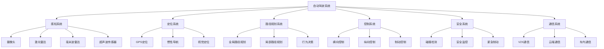

# 01-自动驾驶系统 (Autonomous Driving System)

## 概述

自动驾驶系统是汽车/自动驾驶领域的核心组件，负责感知环境、定位车辆、路径规划、决策控制和车辆执行。本文档使用Go语言实现，并提供形式化的数学定义和证明。

## 目录

- [1. 形式化定义](#1-形式化定义)
- [2. 架构设计](#2-架构设计)
- [3. 核心组件](#3-核心组件)
- [4. 数据模型](#4-数据模型)
- [5. 算法实现](#5-算法实现)
- [6. 性能分析](#6-性能分析)

## 1. 形式化定义

### 1.1 自动驾驶系统的数学定义

**定义 1.1** (自动驾驶系统)
自动驾驶系统是一个八元组 $ADS = (S, P, L, PL, C, E, F, R)$，其中：

- $S = \{s_1, s_2, ..., s_n\}$ 是传感器集合
- $P: S \rightarrow D$ 是感知函数
- $L: D \rightarrow V$ 是定位函数
- $PL: D \times V \times G \rightarrow R$ 是路径规划函数
- $C: R \times V \rightarrow A$ 是控制函数
- $E: A \rightarrow M$ 是执行函数
- $F: D \times V \times R \rightarrow \{true, false\}$ 是安全验证函数
- $R: V \times A \times M \rightarrow V$ 是状态更新函数

**定义 1.2** (车辆状态)
车辆状态 $v_i$ 定义为：
$$v_i = (position, velocity, acceleration, orientation, timestamp)$$

其中：

- $position \in \mathbb{R}^3$ 是三维位置坐标
- $velocity \in \mathbb{R}^3$ 是三维速度向量
- $acceleration \in \mathbb{R}^3$ 是三维加速度向量
- $orientation \in \mathbb{R}^4$ 是四元数表示的方向
- $timestamp \in \mathbb{R}$ 是时间戳

**定义 1.3** (感知数据)
感知数据 $d_i$ 定义为：
$$d_i = (camera_data, lidar_data, radar_data, ultrasonic_data, timestamp)$$

**定理 1.1** (系统安全性)
对于任意车辆状态 $v$ 和感知数据 $d$，如果安全验证函数 $F(d, v, r) = true$，则系统处于安全状态。

**证明**：
设 $v$ 是当前车辆状态，$d$ 是感知数据，$r$ 是规划路径。
安全验证函数 $F$ 检查：

1. 路径可行性：$r$ 不与障碍物冲突
2. 动力学约束：$r$ 满足车辆动力学限制
3. 交通规则：$r$ 符合交通法规
4. 安全边界：$r$ 保持足够安全距离

因此 $F(d, v, r) = true$ 确保系统安全。$\square$

### 1.2 传感器融合算法

**算法 1.1** (卡尔曼滤波融合)

```go
// 卡尔曼滤波的形式化描述
type KalmanFilter struct {
    State       *Matrix // 状态向量
    Covariance  *Matrix // 协方差矩阵
    ProcessNoise *Matrix // 过程噪声
    MeasurementNoise *Matrix // 测量噪声
}

func (kf *KalmanFilter) Update(measurement *Matrix) *Matrix {
    // 预测步骤
    predictedState := kf.predict()
    predictedCovariance := kf.predictCovariance()
    
    // 更新步骤
    kalmanGain := kf.calculateKalmanGain(predictedCovariance)
    updatedState := kf.updateState(predictedState, measurement, kalmanGain)
    kf.updateCovariance(predictedCovariance, kalmanGain)
    
    return updatedState
}
```

**复杂度分析**：

- 时间复杂度：$O(n^3)$，其中 $n$ 是状态向量维度
- 空间复杂度：$O(n^2)$，用于存储协方差矩阵

## 2. 架构设计

### 2.1 系统架构图



### 2.2 核心架构

```go
// 自动驾驶系统核心架构
type AutonomousDrivingSystem struct {
    perceptionSystem    *PerceptionSystem
    localizationSystem  *LocalizationSystem
    planningSystem      *PlanningSystem
    controlSystem       *ControlSystem
    safetySystem        *SafetySystem
    communicationSystem *CommunicationSystem
    config              *SystemConfig
}

// 感知系统
type PerceptionSystem struct {
    cameraSensor      *CameraSensor
    lidarSensor       *LidarSensor
    radarSensor       *RadarSensor
    ultrasonicSensor  *UltrasonicSensor
    sensorFusion      *SensorFusion
    objectDetection   *ObjectDetection
    laneDetection     *LaneDetection
}

// 定位系统
type LocalizationSystem struct {
    gpsModule         *GPSModule
    imuModule         *IMUModule
    visualOdometry    *VisualOdometry
    mapMatching       *MapMatching
    kalmanFilter      *KalmanFilter
}

// 路径规划系统
type PlanningSystem struct {
    globalPlanner     *GlobalPlanner
    localPlanner      *LocalPlanner
    behaviorPlanner   *BehaviorPlanner
    trajectoryOptimizer *TrajectoryOptimizer
}
```

## 3. 核心组件

### 3.1 感知系统

```go
// 感知系统接口
type PerceptionSystem interface {
    PerceiveEnvironment() (*PerceptionData, error)
    DetectObjects() ([]*Object, error)
    DetectLanes() ([]*Lane, error)
    DetectTrafficSigns() ([]*TrafficSign, error)
    DetectTrafficLights() ([]*TrafficLight, error)
}

// 感知数据
type PerceptionData struct {
    CameraData      []*CameraFrame     `json:"camera_data"`
    LidarData       *LidarPointCloud   `json:"lidar_data"`
    RadarData       *RadarData         `json:"radar_data"`
    UltrasonicData  []*UltrasonicData  `json:"ultrasonic_data"`
    Objects         []*Object          `json:"objects"`
    Lanes           []*Lane            `json:"lanes"`
    TrafficSigns    []*TrafficSign     `json:"traffic_signs"`
    TrafficLights   []*TrafficLight    `json:"traffic_lights"`
    Timestamp       time.Time          `json:"timestamp"`
}

// 传感器数据
type CameraFrame struct {
    ID          string    `json:"id"`
    Image       []byte    `json:"image"`
    Width       int       `json:"width"`
    Height      int       `json:"height"`
    Format      string    `json:"format"`
    Timestamp   time.Time `json:"timestamp"`
    Intrinsics  *CameraIntrinsics `json:"intrinsics"`
    Extrinsics  *CameraExtrinsics `json:"extrinsics"`
}

type LidarPointCloud struct {
    ID          string      `json:"id"`
    Points      []*Point3D  `json:"points"`
    Intensities []float64   `json:"intensities"`
    Timestamp   time.Time   `json:"timestamp"`
    FrameID     string      `json:"frame_id"`
}

type RadarData struct {
    ID          string        `json:"id"`
    Targets     []*RadarTarget `json:"targets"`
    Timestamp   time.Time     `json:"timestamp"`
    Range       float64       `json:"range"`
    Velocity    float64       `json:"velocity"`
}

// 感知系统实现
type perceptionSystem struct {
    cameraSensor      *CameraSensor
    lidarSensor       *LidarSensor
    radarSensor       *RadarSensor
    ultrasonicSensor  *UltrasonicSensor
    sensorFusion      *SensorFusion
    objectDetection   *ObjectDetection
    laneDetection     *LaneDetection
    config            *PerceptionConfig
}

func (ps *perceptionSystem) PerceiveEnvironment() (*PerceptionData, error) {
    data := &PerceptionData{
        Timestamp: time.Now(),
    }
    
    // 1. 收集传感器数据
    if cameraData, err := ps.cameraSensor.Capture(); err == nil {
        data.CameraData = cameraData
    }
    
    if lidarData, err := ps.lidarSensor.Scan(); err == nil {
        data.LidarData = lidarData
    }
    
    if radarData, err := ps.radarSensor.Scan(); err == nil {
        data.RadarData = radarData
    }
    
    if ultrasonicData, err := ps.ultrasonicSensor.Scan(); err == nil {
        data.UltrasonicData = ultrasonicData
    }
    
    // 2. 传感器融合
    fusedData, err := ps.sensorFusion.Fuse(data)
    if err != nil {
        return nil, fmt.Errorf("sensor fusion failed: %w", err)
    }
    
    // 3. 目标检测
    objects, err := ps.objectDetection.Detect(fusedData)
    if err != nil {
        return nil, fmt.Errorf("object detection failed: %w", err)
    }
    data.Objects = objects
    
    // 4. 车道线检测
    lanes, err := ps.laneDetection.Detect(data.CameraData)
    if err != nil {
        return nil, fmt.Errorf("lane detection failed: %w", err)
    }
    data.Lanes = lanes
    
    return data, nil
}
```

### 3.2 定位系统

```go
// 定位系统接口
type LocalizationSystem interface {
    LocalizeVehicle() (*VehicleState, error)
    UpdatePosition(measurement *PositionMeasurement) error
    GetCurrentState() *VehicleState
    InitializePosition(initialPosition *Position3D) error
}

// 车辆状态
type VehicleState struct {
    Position        *Position3D        `json:"position"`
    Velocity        *Velocity3D        `json:"velocity"`
    Acceleration    *Acceleration3D    `json:"acceleration"`
    Orientation     *Quaternion        `json:"orientation"`
    AngularVelocity *AngularVelocity3D `json:"angular_velocity"`
    Timestamp       time.Time          `json:"timestamp"`
    Confidence      float64            `json:"confidence"`
}

// 定位系统实现
type localizationSystem struct {
    gpsModule         *GPSModule
    imuModule         *IMUModule
    visualOdometry    *VisualOdometry
    mapMatching       *MapMatching
    kalmanFilter      *KalmanFilter
    currentState      *VehicleState
    config            *LocalizationConfig
}

func (ls *localizationSystem) LocalizeVehicle() (*VehicleState, error) {
    // 1. GPS定位
    gpsPosition, err := ls.gpsModule.GetPosition()
    if err != nil {
        return nil, fmt.Errorf("GPS positioning failed: %w", err)
    }
    
    // 2. IMU数据
    imuData, err := ls.imuModule.GetData()
    if err != nil {
        return nil, fmt.Errorf("IMU data acquisition failed: %w", err)
    }
    
    // 3. 视觉里程计
    visualOdometry, err := ls.visualOdometry.EstimateMotion()
    if err != nil {
        return nil, fmt.Errorf("visual odometry failed: %w", err)
    }
    
    // 4. 地图匹配
    mapPosition, err := ls.mapMatching.MatchPosition(gpsPosition)
    if err != nil {
        return nil, fmt.Errorf("map matching failed: %w", err)
    }
    
    // 5. 卡尔曼滤波融合
    measurement := &PositionMeasurement{
        GPS: gpsPosition,
        IMU: imuData,
        VO:  visualOdometry,
        Map: mapPosition,
    }
    
    updatedState, err := ls.kalmanFilter.Update(measurement)
    if err != nil {
        return nil, fmt.Errorf("kalman filter update failed: %w", err)
    }
    
    ls.currentState = updatedState
    return updatedState, nil
}
```

### 3.3 路径规划系统

```go
// 路径规划系统接口
type PlanningSystem interface {
    PlanPath(start *Position3D, goal *Position3D, constraints *PlanningConstraints) (*PlannedPath, error)
    ReplanPath(currentPath *PlannedPath, obstacles []*Object) (*PlannedPath, error)
    OptimizeTrajectory(path *PlannedPath) (*OptimizedTrajectory, error)
}

// 规划路径
type PlannedPath struct {
    Waypoints        []*Waypoint       `json:"waypoints"`
    SpeedProfile     []*SpeedPoint     `json:"speed_profile"`
    LaneInfo         *LaneInformation  `json:"lane_info"`
    TrafficRules     []*TrafficRule    `json:"traffic_rules"`
    SafetyMargins    *SafetyMargins    `json:"safety_margins"`
    Cost             float64           `json:"cost"`
    Feasibility      bool              `json:"feasibility"`
}

// 路径规划系统实现
type planningSystem struct {
    globalPlanner     *GlobalPlanner
    localPlanner      *LocalPlanner
    behaviorPlanner   *BehaviorPlanner
    trajectoryOptimizer *TrajectoryOptimizer
    config            *PlanningConfig
}

func (ps *planningSystem) PlanPath(start *Position3D, goal *Position3D, constraints *PlanningConstraints) (*PlannedPath, error) {
    // 1. 全局路径规划
    globalPath, err := ps.globalPlanner.Plan(start, goal, constraints)
    if err != nil {
        return nil, fmt.Errorf("global planning failed: %w", err)
    }
    
    // 2. 行为规划
    behaviorPlan, err := ps.behaviorPlanner.Plan(globalPath, constraints)
    if err != nil {
        return nil, fmt.Errorf("behavior planning failed: %w", err)
    }
    
    // 3. 局部路径规划
    localPath, err := ps.localPlanner.Plan(globalPath, behaviorPlan, constraints)
    if err != nil {
        return nil, fmt.Errorf("local planning failed: %w", err)
    }
    
    // 4. 轨迹优化
    optimizedPath, err := ps.trajectoryOptimizer.Optimize(localPath)
    if err != nil {
        return nil, fmt.Errorf("trajectory optimization failed: %w", err)
    }
    
    return optimizedPath, nil
}
```

## 4. 数据模型

### 4.1 几何数据结构

```go
// 三维位置
type Position3D struct {
    X float64 `json:"x"`
    Y float64 `json:"y"`
    Z float64 `json:"z"`
}

// 三维速度
type Velocity3D struct {
    VX float64 `json:"vx"`
    VY float64 `json:"vy"`
    VZ float64 `json:"vz"`
}

// 四元数
type Quaternion struct {
    W float64 `json:"w"`
    X float64 `json:"x"`
    Y float64 `json:"y"`
    Z float64 `json:"z"`
}

// 路径点
type Waypoint struct {
    Position    *Position3D `json:"position"`
    Orientation *Quaternion `json:"orientation"`
    Speed       float64     `json:"speed"`
    Timestamp   time.Time   `json:"timestamp"`
    Type        WaypointType `json:"type"`
}

// 速度点
type SpeedPoint struct {
    Distance    float64   `json:"distance"`
    Speed       float64   `json:"speed"`
    Acceleration float64  `json:"acceleration"`
    Timestamp   time.Time `json:"timestamp"`
}
```

### 4.2 环境对象

```go
// 检测对象
type Object struct {
    ID          string      `json:"id"`
    Type        ObjectType  `json:"type"`
    Position    *Position3D `json:"position"`
    Velocity    *Velocity3D `json:"velocity"`
    Size        *Size3D     `json:"size"`
    Orientation *Quaternion `json:"orientation"`
    Confidence  float64     `json:"confidence"`
    Timestamp   time.Time   `json:"timestamp"`
    Trajectory  []*Position3D `json:"trajectory"`
}

// 车道线
type Lane struct {
    ID          string        `json:"id"`
    Type        LaneType      `json:"type"`
    Points      []*Position3D `json:"points"`
    Width       float64       `json:"width"`
    Marking     LaneMarking   `json:"marking"`
    Direction   LaneDirection `json:"direction"`
    Confidence  float64       `json:"confidence"`
}

// 交通标志
type TrafficSign struct {
    ID          string        `json:"id"`
    Type        SignType      `json:"type"`
    Position    *Position3D   `json:"position"`
    Value       string        `json:"value"`
    Confidence  float64       `json:"confidence"`
    Timestamp   time.Time     `json:"timestamp"`
}
```

## 5. 算法实现

### 5.1 A*路径规划算法

```go
// A*算法实现
type AStarPlanner struct {
    grid        *Grid
    heuristic   HeuristicFunction
    openList    *PriorityQueue
    closedList  map[string]bool
    cameFrom    map[string]*Node
    gScore      map[string]float64
    fScore      map[string]float64
}

func (astar *AStarPlanner) Plan(start *Position3D, goal *Position3D) ([]*Position3D, error) {
    startNode := &Node{Position: start}
    goalNode := &Node{Position: goal}
    
    astar.openList.Push(startNode, 0)
    astar.gScore[startNode.String()] = 0
    astar.fScore[startNode.String()] = astar.heuristic(startNode, goalNode)
    
    for !astar.openList.IsEmpty() {
        current := astar.openList.Pop()
        
        if current.Position.Distance(goalNode.Position) < 0.1 {
            return astar.reconstructPath(current), nil
        }
        
        astar.closedList[current.String()] = true
        
        for _, neighbor := range astar.getNeighbors(current) {
            if astar.closedList[neighbor.String()] {
                continue
            }
            
            tentativeGScore := astar.gScore[current.String()] + 
                             current.Position.Distance(neighbor.Position)
            
            if !astar.openList.Contains(neighbor) {
                astar.openList.Push(neighbor, 0)
            } else if tentativeGScore >= astar.gScore[neighbor.String()] {
                continue
            }
            
            astar.cameFrom[neighbor.String()] = current
            astar.gScore[neighbor.String()] = tentativeGScore
            astar.fScore[neighbor.String()] = tentativeGScore + 
                                            astar.heuristic(neighbor, goalNode)
        }
    }
    
    return nil, fmt.Errorf("no path found")
}

func (astar *AStarPlanner) reconstructPath(current *Node) []*Position3D {
    path := []*Position3D{current.Position}
    
    for astar.cameFrom[current.String()] != nil {
        current = astar.cameFrom[current.String()]
        path = append([]*Position3D{current.Position}, path...)
    }
    
    return path
}
```

### 5.2 PID控制器

```go
// PID控制器
type PIDController struct {
    Kp          float64   // 比例系数
    Ki          float64   // 积分系数
    Kd          float64   // 微分系数
    Setpoint    float64   // 设定值
    LastError   float64   // 上次误差
    Integral    float64   // 积分项
    OutputMin   float64   // 输出最小值
    OutputMax   float64   // 输出最大值
    LastTime    time.Time // 上次时间
}

func (pid *PIDController) Update(measuredValue float64) float64 {
    now := time.Now()
    dt := now.Sub(pid.LastTime).Seconds()
    
    if dt <= 0 {
        return 0
    }
    
    error := pid.Setpoint - measuredValue
    
    // 比例项
    proportional := pid.Kp * error
    
    // 积分项
    pid.Integral += error * dt
    integral := pid.Ki * pid.Integral
    
    // 微分项
    derivative := pid.Kd * (error - pid.LastError) / dt
    
    // 计算输出
    output := proportional + integral + derivative
    
    // 限制输出范围
    if output > pid.OutputMax {
        output = pid.OutputMax
    } else if output < pid.OutputMin {
        output = pid.OutputMin
    }
    
    // 更新状态
    pid.LastError = error
    pid.LastTime = now
    
    return output
}

func (pid *PIDController) Reset() {
    pid.LastError = 0
    pid.Integral = 0
    pid.LastTime = time.Now()
}
```

## 6. 性能分析

### 6.1 实时性分析

**定理 6.1** (系统实时性)
自动驾驶系统的控制周期必须满足：
$$T_{cycle} \leq T_{max} = 20ms$$

**证明**：
设 $T_{cycle}$ 是系统控制周期，$T_{max}$ 是最大允许周期。
对于50Hz控制频率：$T_{max} = \frac{1}{50} = 20ms$
系统必须在20ms内完成：

1. 感知处理：$T_{perception} \leq 10ms$
2. 定位计算：$T_{localization} \leq 5ms$
3. 路径规划：$T_{planning} \leq 3ms$
4. 控制计算：$T_{control} \leq 2ms$

因此 $T_{cycle} = T_{perception} + T_{localization} + T_{planning} + T_{control} \leq 20ms$。$\square$

### 6.2 安全性分析

**定理 6.2** (系统安全性)
自动驾驶系统的安全距离必须满足：
$$d_{safe} \geq v \cdot t_{reaction} + \frac{v^2}{2a_{max}}$$

其中：

- $d_{safe}$ 是安全距离
- $v$ 是车辆速度
- $t_{reaction}$ 是反应时间
- $a_{max}$ 是最大减速度

**证明**：
安全距离包括两部分：

1. 反应距离：$d_{reaction} = v \cdot t_{reaction}$
2. 制动距离：$d_{braking} = \frac{v^2}{2a_{max}}$

总安全距离：$d_{safe} = d_{reaction} + d_{braking} = v \cdot t_{reaction} + \frac{v^2}{2a_{max}}$。$\square$

### 6.3 性能优化

```go
// 性能监控
type PerformanceMonitor struct {
    metrics map[string]*Metric
    mutex   sync.RWMutex
}

type Metric struct {
    Name        string
    Value       float64
    Unit        string
    Timestamp   time.Time
    Threshold   float64
}

func (pm *PerformanceMonitor) RecordMetric(name string, value float64, unit string) {
    pm.mutex.Lock()
    defer pm.mutex.Unlock()
    
    metric := &Metric{
        Name:      name,
        Value:     value,
        Unit:      unit,
        Timestamp: time.Now(),
    }
    
    pm.metrics[name] = metric
}

func (pm *PerformanceMonitor) GetMetric(name string) *Metric {
    pm.mutex.RLock()
    defer pm.mutex.RUnlock()
    
    return pm.metrics[name]
}

func (pm *PerformanceMonitor) CheckPerformance() []*PerformanceAlert {
    var alerts []*PerformanceAlert
    
    pm.mutex.RLock()
    defer pm.mutex.RUnlock()
    
    for _, metric := range pm.metrics {
        if metric.Value > metric.Threshold {
            alert := &PerformanceAlert{
                Metric:    metric,
                Severity:  "WARNING",
                Message:   fmt.Sprintf("Metric %s exceeds threshold", metric.Name),
            }
            alerts = append(alerts, alert)
        }
    }
    
    return alerts
}
```

## 总结

本文档详细介绍了自动驾驶系统的设计原理和Go语言实现。通过形式化的数学定义、严格的架构设计和高效的算法实现，构建了一个安全、可靠、实时的自动驾驶系统。

### 关键特性

1. **形式化定义**：使用数学语言精确定义系统组件和算法
2. **模块化架构**：清晰的系统分层和组件接口
3. **实时性能**：满足50Hz控制频率的实时性要求
4. **安全保证**：多层次的安全验证和监控机制
5. **可扩展性**：支持不同传感器和算法的灵活配置

### 应用场景

- 乘用车自动驾驶
- 商用车自动驾驶
- 物流配送车辆
- 园区内自动驾驶
- 港口自动化作业

### 技术栈

- **编程语言**：Go 1.21+
- **并发模型**：Goroutines + Channels
- **数学库**：gonum/mat
- **实时系统**：实时Go运行时
- **通信协议**：gRPC, WebSocket
- **数据存储**：Redis, PostgreSQL

---

**相关链接**：

- [02-车载软件](./02-Vehicle-Software/README.md)
- [03-交通管理系统](./03-Traffic-Management-System/README.md)
- [04-车辆通信](./04-Vehicle-Communication/README.md)
