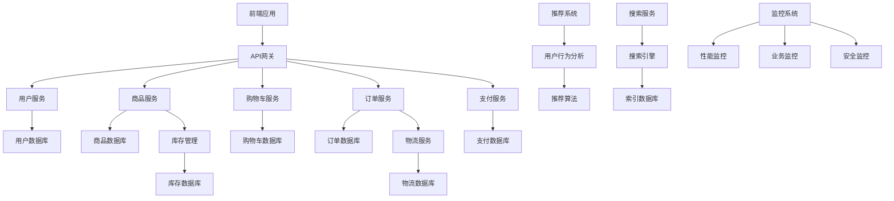

# 12-电子商务 (E-commerce)

## 01-在线商城平台 (Online Mall Platform)

### 目录

1. [概述](#1-概述)
2. [形式化定义](#2-形式化定义)
3. [架构设计](#3-架构设计)
4. [Go语言实现](#4-go语言实现)
5. [商品管理](#5-商品管理)
6. [订单系统](#6-订单系统)
7. [支付系统](#7-支付系统)
8. [推荐系统](#8-推荐系统)

### 1. 概述

在线商城平台是现代电子商务的核心，提供商品展示、购物车、订单管理、支付处理和用户服务等功能。

#### 1.1 核心概念

**商品目录**：商品信息的组织和管理
**购物车**：用户选购商品的临时存储
**订单流程**：从下单到交付的完整流程
**支付处理**：多种支付方式的集成

#### 1.2 平台类型

```go
// 商城平台类型
type PlatformType int

const (
    B2C PlatformType = iota // Business to Consumer
    B2B                     // Business to Business
    C2C                     // Consumer to Consumer
    O2O                     // Online to Offline
)
```

### 2. 形式化定义

#### 2.1 在线商城形式化模型

**定义 2.1.1** (在线商城系统)
在线商城系统是一个八元组 $OMS = (U, P, C, O, T, I, S, \mu)$，其中：

- $U$ 是用户集合，$U = \{u_1, u_2, ..., u_n\}$
- $P$ 是商品集合，$P = \{p_1, p_2, ..., p_m\}$
- $C$ 是购物车集合，$C = \{c_1, c_2, ..., c_k\}$
- $O$ 是订单集合，$O = \{o_1, o_2, ..., o_o\}$
- $T$ 是交易集合，$T = \{t_1, t_2, ..., t_p\}$
- $I$ 是库存集合，$I = \{i_1, i_2, ..., i_q\}$
- $S$ 是状态集合
- $\mu: U \times P \times C \times O \rightarrow S$ 是状态转换函数

**定理 2.1.1** (库存一致性)
对于任意商品 $p \in P$ 和订单 $o \in O$，如果 $o$ 包含 $p$，则库存函数 $\iota: P \rightarrow \mathbb{N}$ 满足：
$\iota(p) \geq \sum_{o \in O_p} \text{quantity}(o, p)$，其中 $O_p$ 是包含商品 $p$ 的订单集合。

**证明**：
根据库存管理的约束，系统不允许超卖。
因此，对于每个商品，其库存数量必须大于等于所有订单中该商品的数量总和。
因此，库存一致性成立。$\square$

### 3. 架构设计

#### 3.1 系统架构图



### 4. Go语言实现

#### 4.1 核心数据结构

```go
// 用户信息
type User struct {
    ID              string            `json:"id" bson:"_id"`
    Email           string            `json:"email"`
    Username        string            `json:"username"`
    FirstName       string            `json:"first_name"`
    LastName        string            `json:"last_name"`
    Phone           string            `json:"phone"`
    Address         Address           `json:"address"`
    Profile         UserProfile       `json:"profile"`
    Preferences     UserPreferences   `json:"preferences"`
    CreatedAt       time.Time         `json:"created_at"`
    UpdatedAt       time.Time         `json:"updated_at"`
}

// 地址信息
type Address struct {
    Street      string `json:"street"`
    City        string `json:"city"`
    State       string `json:"state"`
    ZipCode     string `json:"zip_code"`
    Country     string `json:"country"`
    IsDefault   bool   `json:"is_default"`
}

// 用户档案
type UserProfile struct {
    Avatar          string `json:"avatar"`
    DateOfBirth     *time.Time `json:"date_of_birth"`
    Gender          string `json:"gender"`
    Interests       []string `json:"interests"`
    LoyaltyPoints   int `json:"loyalty_points"`
}

// 用户偏好
type UserPreferences struct {
    Language        string `json:"language"`
    Currency        string `json:"currency"`
    Timezone        string `json:"timezone"`
    NotificationSettings NotificationSettings `json:"notification_settings"`
}

// 商品信息
type Product struct {
    ID              string            `json:"id" bson:"_id"`
    Name            string            `json:"name"`
    Description     string            `json:"description"`
    Category        string            `json:"category"`
    Brand           string            `json:"brand"`
    SKU             string            `json:"sku"`
    Price           Price             `json:"price"`
    Images          []string          `json:"images"`
    Attributes      map[string]interface{} `json:"attributes"`
    Inventory       Inventory         `json:"inventory"`
    Status          ProductStatus     `json:"status"`
    CreatedAt       time.Time         `json:"created_at"`
    UpdatedAt       time.Time         `json:"updated_at"`
}

// 价格信息
type Price struct {
    OriginalPrice   float64 `json:"original_price"`
    SalePrice       *float64 `json:"sale_price,omitempty"`
    Currency        string `json:"currency"`
    Discount        *Discount `json:"discount,omitempty"`
}

// 折扣信息
type Discount struct {
    Type            DiscountType `json:"type"`
    Value           float64 `json:"value"`
    StartDate       time.Time `json:"start_date"`
    EndDate         time.Time `json:"end_date"`
}

// 折扣类型
type DiscountType string

const (
    Percentage DiscountType = "percentage"
    FixedAmount DiscountType = "fixed_amount"
)

// 库存信息
type Inventory struct {
    Quantity        int `json:"quantity"`
    Reserved        int `json:"reserved"`
    Available       int `json:"available"`
    LowStockThreshold int `json:"low_stock_threshold"`
    ReorderPoint    int `json:"reorder_point"`
}

// 商品状态
type ProductStatus string

const (
    Active ProductStatus = "active"
    Inactive ProductStatus = "inactive"
    OutOfStock ProductStatus = "out_of_stock"
    Discontinued ProductStatus = "discontinued"
)

// 购物车
type Cart struct {
    ID              string `json:"id" bson:"_id"`
    UserID          string `json:"user_id"`
    Items           []CartItem `json:"items"`
    Subtotal        float64 `json:"subtotal"`
    Tax             float64 `json:"tax"`
    Shipping        float64 `json:"shipping"`
    Discount        float64 `json:"discount"`
    Total           float64 `json:"total"`
    Currency        string `json:"currency"`
    CreatedAt       time.Time `json:"created_at"`
    UpdatedAt       time.Time `json:"updated_at"`
}

// 购物车项目
type CartItem struct {
    ProductID       string `json:"product_id"`
    Quantity        int `json:"quantity"`
    Price           float64 `json:"price"`
    Subtotal        float64 `json:"subtotal"`
    AddedAt         time.Time `json:"added_at"`
}

// 订单信息
type Order struct {
    ID              string `json:"id" bson:"_id"`
    UserID          string `json:"user_id"`
    OrderNumber     string `json:"order_number"`
    Items           []OrderItem `json:"items"`
    Subtotal        float64 `json:"subtotal"`
    Tax             float64 `json:"tax"`
    Shipping        float64 `json:"shipping"`
    Discount        float64 `json:"discount"`
    Total           float64 `json:"total"`
    Currency        string `json:"currency"`
    Status          OrderStatus `json:"status"`
    Payment         PaymentInfo `json:"payment"`
    Shipping        ShippingInfo `json:"shipping"`
    CreatedAt       time.Time `json:"created_at"`
    UpdatedAt       time.Time `json:"updated_at"`
}

// 订单项目
type OrderItem struct {
    ProductID       string `json:"product_id"`
    ProductName     string `json:"product_name"`
    SKU             string `json:"sku"`
    Quantity        int `json:"quantity"`
    UnitPrice       float64 `json:"unit_price"`
    Subtotal        float64 `json:"subtotal"`
}

// 订单状态
type OrderStatus string

const (
    Pending OrderStatus = "pending"
    Confirmed OrderStatus = "confirmed"
    Processing OrderStatus = "processing"
    Shipped OrderStatus = "shipped"
    Delivered OrderStatus = "delivered"
    Cancelled OrderStatus = "cancelled"
    Refunded OrderStatus = "refunded"
)

// 支付信息
type PaymentInfo struct {
    Method          PaymentMethod `json:"method"`
    TransactionID   string `json:"transaction_id"`
    Amount          float64 `json:"amount"`
    Currency        string `json:"currency"`
    Status          PaymentStatus `json:"status"`
    ProcessedAt     *time.Time `json:"processed_at,omitempty"`
}

// 支付方式
type PaymentMethod string

const (
    CreditCard PaymentMethod = "credit_card"
    DebitCard PaymentMethod = "debit_card"
    PayPal PaymentMethod = "paypal"
    Alipay PaymentMethod = "alipay"
    WeChatPay PaymentMethod = "wechat_pay"
    BankTransfer PaymentMethod = "bank_transfer"
)

// 支付状态
type PaymentStatus string

const (
    Pending PaymentStatus = "pending"
    Processing PaymentStatus = "processing"
    Completed PaymentStatus = "completed"
    Failed PaymentStatus = "failed"
    Refunded PaymentStatus = "refunded"
)

// 配送信息
type ShippingInfo struct {
    Method          ShippingMethod `json:"method"`
    Address         Address `json:"address"`
    TrackingNumber  *string `json:"tracking_number,omitempty"`
    EstimatedDelivery *time.Time `json:"estimated_delivery,omitempty"`
    ActualDelivery   *time.Time `json:"actual_delivery,omitempty"`
    Cost             float64 `json:"cost"`
}
```

#### 4.2 商品服务实现

```go
// 商品服务
type ProductService struct {
    repo        ProductRepository
    inventory   InventoryService
    search      SearchService
    cache       CacheService
}

// 商品仓储接口
type ProductRepository interface {
    Create(ctx context.Context, product *Product) error
    GetByID(ctx context.Context, id string) (*Product, error)
    GetBySKU(ctx context.Context, sku string) (*Product, error)
    Update(ctx context.Context, product *Product) error
    Delete(ctx context.Context, id string) error
    Search(ctx context.Context, query ProductSearchQuery) ([]*Product, error)
    GetByCategory(ctx context.Context, category string, limit, offset int) ([]*Product, error)
}

// 商品搜索查询
type ProductSearchQuery struct {
    Keyword       string `json:"keyword"`
    Category      string `json:"category"`
    Brand         string `json:"brand"`
    MinPrice      *float64 `json:"min_price"`
    MaxPrice      *float64 `json:"max_price"`
    InStock       *bool `json:"in_stock"`
    SortBy        string `json:"sort_by"`
    SortOrder     string `json:"sort_order"`
    Limit         int `json:"limit"`
    Offset        int `json:"offset"`
}

// 创建商品
func (s *ProductService) CreateProduct(ctx context.Context, req CreateProductRequest) (*Product, error) {
    // 1. 验证请求
    if err := s.validateCreateRequest(req); err != nil {
        return nil, fmt.Errorf("validation failed: %w", err)
    }
    
    // 2. 检查SKU唯一性
    if existing, _ := s.repo.GetBySKU(ctx, req.SKU); existing != nil {
        return nil, ErrSKUAlreadyExists
    }
    
    // 3. 创建商品
    product := &Product{
        ID:          uuid.New().String(),
        Name:        req.Name,
        Description: req.Description,
        Category:    req.Category,
        Brand:       req.Brand,
        SKU:         req.SKU,
        Price:       req.Price,
        Images:      req.Images,
        Attributes:  req.Attributes,
        Inventory:   req.Inventory,
        Status:      Active,
        CreatedAt:   time.Now(),
        UpdatedAt:   time.Now(),
    }
    
    if err := s.repo.Create(ctx, product); err != nil {
        return nil, fmt.Errorf("failed to create product: %w", err)
    }
    
    // 4. 更新库存
    if err := s.inventory.CreateInventory(ctx, product.ID, product.Inventory); err != nil {
        return nil, fmt.Errorf("failed to create inventory: %w", err)
    }
    
    // 5. 更新搜索索引
    if err := s.search.IndexProduct(ctx, product); err != nil {
        return nil, fmt.Errorf("failed to index product: %w", err)
    }
    
    // 6. 清除缓存
    s.cache.InvalidateProduct(ctx, product.ID)
    
    return product, nil
}

// 搜索商品
func (s *ProductService) SearchProducts(ctx context.Context, query ProductSearchQuery) ([]*Product, error) {
    // 1. 检查缓存
    cacheKey := s.generateCacheKey(query)
    if products, found := s.cache.GetProducts(ctx, cacheKey); found {
        return products, nil
    }
    
    // 2. 执行搜索
    products, err := s.search.SearchProducts(ctx, query)
    if err != nil {
        return nil, fmt.Errorf("search failed: %w", err)
    }
    
    // 3. 更新缓存
    s.cache.SetProducts(ctx, cacheKey, products)
    
    return products, nil
}

// 更新库存
func (s *ProductService) UpdateInventory(ctx context.Context, productID string, quantity int) error {
    // 1. 更新库存服务
    if err := s.inventory.UpdateQuantity(ctx, productID, quantity); err != nil {
        return fmt.Errorf("inventory update failed: %w", err)
    }
    
    // 2. 更新商品状态
    product, err := s.repo.GetByID(ctx, productID)
    if err != nil {
        return fmt.Errorf("product not found: %w", err)
    }
    
    // 检查库存状态
    if quantity <= 0 {
        product.Status = OutOfStock
    } else if quantity <= product.Inventory.LowStockThreshold {
        product.Status = Active // 低库存但仍可购买
    } else {
        product.Status = Active
    }
    
    product.UpdatedAt = time.Now()
    
    if err := s.repo.Update(ctx, product); err != nil {
        return fmt.Errorf("product update failed: %w", err)
    }
    
    // 3. 清除缓存
    s.cache.InvalidateProduct(ctx, productID)
    
    return nil
}
```

#### 4.3 购物车服务实现

```go
// 购物车服务
type CartService struct {
    repo        CartRepository
    productRepo ProductRepository
    inventory   InventoryService
    cache       CacheService
}

// 购物车仓储接口
type CartRepository interface {
    GetByUserID(ctx context.Context, userID string) (*Cart, error)
    Create(ctx context.Context, cart *Cart) error
    Update(ctx context.Context, cart *Cart) error
    Delete(ctx context.Context, userID string) error
    AddItem(ctx context.Context, userID string, item CartItem) error
    RemoveItem(ctx context.Context, userID string, productID string) error
    UpdateItemQuantity(ctx context.Context, userID string, productID string, quantity int) error
}

// 添加商品到购物车
func (s *CartService) AddToCart(ctx context.Context, req AddToCartRequest) error {
    // 1. 验证商品
    product, err := s.productRepo.GetByID(ctx, req.ProductID)
    if err != nil {
        return fmt.Errorf("product not found: %w", err)
    }
    
    // 2. 检查库存
    if !s.inventory.CheckAvailability(ctx, req.ProductID, req.Quantity) {
        return ErrInsufficientStock
    }
    
    // 3. 获取或创建购物车
    cart, err := s.repo.GetByUserID(ctx, req.UserID)
    if err != nil {
        if err == ErrCartNotFound {
            cart = &Cart{
                ID:        uuid.New().String(),
                UserID:    req.UserID,
                Items:     []CartItem{},
                Currency:  product.Price.Currency,
                CreatedAt: time.Now(),
                UpdatedAt: time.Now(),
            }
            if err := s.repo.Create(ctx, cart); err != nil {
                return fmt.Errorf("failed to create cart: %w", err)
            }
        } else {
            return fmt.Errorf("failed to get cart: %w", err)
        }
    }
    
    // 4. 检查商品是否已在购物车中
    for i, item := range cart.Items {
        if item.ProductID == req.ProductID {
            // 更新数量
            newQuantity := item.Quantity + req.Quantity
            if !s.inventory.CheckAvailability(ctx, req.ProductID, newQuantity) {
                return ErrInsufficientStock
            }
            
            cart.Items[i].Quantity = newQuantity
            cart.Items[i].Subtotal = float64(newQuantity) * item.Price
            cart.UpdatedAt = time.Now()
            
            // 重新计算总计
            s.recalculateCart(cart)
            
            return s.repo.Update(ctx, cart)
        }
    }
    
    // 5. 添加新商品
    item := CartItem{
        ProductID: req.ProductID,
        Quantity:  req.Quantity,
        Price:     product.Price.SalePrice,
        Subtotal:  float64(req.Quantity) * *product.Price.SalePrice,
        AddedAt:   time.Now(),
    }
    
    cart.Items = append(cart.Items, item)
    cart.UpdatedAt = time.Now()
    
    // 6. 重新计算总计
    s.recalculateCart(cart)
    
    // 7. 更新购物车
    if err := s.repo.Update(ctx, cart); err != nil {
        return fmt.Errorf("failed to update cart: %w", err)
    }
    
    // 8. 清除缓存
    s.cache.InvalidateCart(ctx, req.UserID)
    
    return nil
}

// 重新计算购物车总计
func (s *CartService) recalculateCart(cart *Cart) {
    subtotal := 0.0
    
    for _, item := range cart.Items {
        subtotal += item.Subtotal
    }
    
    cart.Subtotal = subtotal
    cart.Tax = subtotal * 0.1 // 10% 税率
    cart.Shipping = s.calculateShipping(cart)
    cart.Discount = s.calculateDiscount(cart)
    cart.Total = cart.Subtotal + cart.Tax + cart.Shipping - cart.Discount
}

// 计算配送费用
func (s *CartService) calculateShipping(cart *Cart) float64 {
    // 简单的配送费用计算逻辑
    if cart.Subtotal >= 100 {
        return 0 // 免费配送
    }
    return 10 // 固定配送费
}

// 计算折扣
func (s *CartService) calculateDiscount(cart *Cart) float64 {
    // 简单的折扣计算逻辑
    if cart.Subtotal >= 200 {
        return cart.Subtotal * 0.1 // 10% 折扣
    }
    return 0
}
```

#### 4.4 订单服务实现

```go
// 订单服务
type OrderService struct {
    repo        OrderRepository
    cartRepo    CartRepository
    inventory   InventoryService
    payment     PaymentService
    shipping    ShippingService
    notification NotificationService
}

// 订单仓储接口
type OrderRepository interface {
    Create(ctx context.Context, order *Order) error
    GetByID(ctx context.Context, id string) (*Order, error)
    GetByUserID(ctx context.Context, userID string) ([]*Order, error)
    GetByOrderNumber(ctx context.Context, orderNumber string) (*Order, error)
    Update(ctx context.Context, order *Order) error
    UpdateStatus(ctx context.Context, orderID string, status OrderStatus) error
}

// 创建订单
func (s *OrderService) CreateOrder(ctx context.Context, req CreateOrderRequest) (*Order, error) {
    // 1. 获取购物车
    cart, err := s.cartRepo.GetByUserID(ctx, req.UserID)
    if err != nil {
        return nil, fmt.Errorf("cart not found: %w", err)
    }
    
    if len(cart.Items) == 0 {
        return nil, ErrEmptyCart
    }
    
    // 2. 验证库存
    for _, item := range cart.Items {
        if !s.inventory.CheckAvailability(ctx, item.ProductID, item.Quantity) {
            return nil, fmt.Errorf("insufficient stock for product %s", item.ProductID)
        }
    }
    
    // 3. 创建订单
    order := &Order{
        ID:          uuid.New().String(),
        UserID:      req.UserID,
        OrderNumber: s.generateOrderNumber(),
        Items:       s.convertCartItemsToOrderItems(cart.Items),
        Subtotal:    cart.Subtotal,
        Tax:         cart.Tax,
        Shipping:    cart.Shipping,
        Discount:    cart.Discount,
        Total:       cart.Total,
        Currency:    cart.Currency,
        Status:      Pending,
        Payment: PaymentInfo{
            Method:   req.PaymentMethod,
            Amount:   cart.Total,
            Currency: cart.Currency,
            Status:   Pending,
        },
        Shipping: ShippingInfo{
            Method: req.ShippingMethod,
            Address: req.ShippingAddress,
            Cost:   cart.Shipping,
        },
        CreatedAt: time.Now(),
        UpdatedAt: time.Now(),
    }
    
    if err := s.repo.Create(ctx, order); err != nil {
        return nil, fmt.Errorf("failed to create order: %w", err)
    }
    
    // 4. 预留库存
    for _, item := range cart.Items {
        if err := s.inventory.ReserveStock(ctx, item.ProductID, item.Quantity); err != nil {
            return nil, fmt.Errorf("failed to reserve stock: %w", err)
        }
    }
    
    // 5. 清空购物车
    if err := s.cartRepo.Delete(ctx, req.UserID); err != nil {
        return nil, fmt.Errorf("failed to clear cart: %w", err)
    }
    
    // 6. 发送通知
    s.notification.SendOrderConfirmation(ctx, order)
    
    return order, nil
}

// 处理支付
func (s *OrderService) ProcessPayment(ctx context.Context, orderID string, paymentDetails PaymentDetails) error {
    // 1. 获取订单
    order, err := s.repo.GetByID(ctx, orderID)
    if err != nil {
        return fmt.Errorf("order not found: %w", err)
    }
    
    // 2. 处理支付
    transaction, err := s.payment.ProcessPayment(ctx, order, paymentDetails)
    if err != nil {
        return fmt.Errorf("payment processing failed: %w", err)
    }
    
    // 3. 更新订单支付信息
    order.Payment.TransactionID = transaction.ID
    order.Payment.Status = Completed
    now := time.Now()
    order.Payment.ProcessedAt = &now
    order.Status = Confirmed
    order.UpdatedAt = time.Now()
    
    if err := s.repo.Update(ctx, order); err != nil {
        return fmt.Errorf("failed to update order: %w", err)
    }
    
    // 4. 扣减库存
    for _, item := range order.Items {
        if err := s.inventory.DeductStock(ctx, item.ProductID, item.Quantity); err != nil {
            return fmt.Errorf("failed to deduct stock: %w", err)
        }
    }
    
    // 5. 发送通知
    s.notification.SendPaymentConfirmation(ctx, order)
    
    return nil
}

// 更新订单状态
func (s *OrderService) UpdateOrderStatus(ctx context.Context, orderID string, status OrderStatus) error {
    // 1. 获取订单
    order, err := s.repo.GetByID(ctx, orderID)
    if err != nil {
        return fmt.Errorf("order not found: %w", err)
    }
    
    // 2. 验证状态转换
    if !s.isValidStatusTransition(order.Status, status) {
        return ErrInvalidStatusTransition
    }
    
    // 3. 更新状态
    order.Status = status
    order.UpdatedAt = time.Now()
    
    if err := s.repo.Update(ctx, order); err != nil {
        return fmt.Errorf("failed to update order: %w", err)
    }
    
    // 4. 处理状态特定逻辑
    switch status {
    case Shipped:
        s.handleOrderShipped(ctx, order)
    case Delivered:
        s.handleOrderDelivered(ctx, order)
    case Cancelled:
        s.handleOrderCancelled(ctx, order)
    }
    
    // 5. 发送通知
    s.notification.SendOrderStatusUpdate(ctx, order)
    
    return nil
}

// 验证状态转换
func (s *OrderService) isValidStatusTransition(current, new OrderStatus) bool {
    transitions := map[OrderStatus][]OrderStatus{
        Pending:    {Confirmed, Cancelled},
        Confirmed:  {Processing, Cancelled},
        Processing: {Shipped, Cancelled},
        Shipped:    {Delivered},
        Delivered:  {Refunded},
        Cancelled:  {},
        Refunded:   {},
    }
    
    validTransitions, exists := transitions[current]
    if !exists {
        return false
    }
    
    for _, valid := range validTransitions {
        if valid == new {
            return true
        }
    }
    
    return false
}
```

### 5. 商品管理

#### 5.1 库存管理系统

```go
// 库存服务
type InventoryService struct {
    repo        InventoryRepository
    cache       CacheService
    notifier    NotificationService
}

// 库存仓储接口
type InventoryRepository interface {
    GetByProductID(ctx context.Context, productID string) (*Inventory, error)
    Create(ctx context.Context, productID string, inventory *Inventory) error
    Update(ctx context.Context, productID string, inventory *Inventory) error
    UpdateQuantity(ctx context.Context, productID string, quantity int) error
    ReserveStock(ctx context.Context, productID string, quantity int) error
    ReleaseStock(ctx context.Context, productID string, quantity int) error
    DeductStock(ctx context.Context, productID string, quantity int) error
}

// 检查库存可用性
func (s *InventoryService) CheckAvailability(ctx context.Context, productID string, quantity int) bool {
    inventory, err := s.repo.GetByProductID(ctx, productID)
    if err != nil {
        return false
    }
    
    return inventory.Available >= quantity
}

// 预留库存
func (s *InventoryService) ReserveStock(ctx context.Context, productID string, quantity int) error {
    inventory, err := s.repo.GetByProductID(ctx, productID)
    if err != nil {
        return fmt.Errorf("inventory not found: %w", err)
    }
    
    if inventory.Available < quantity {
        return ErrInsufficientStock
    }
    
    inventory.Reserved += quantity
    inventory.Available -= quantity
    inventory.UpdatedAt = time.Now()
    
    if err := s.repo.Update(ctx, productID, inventory); err != nil {
        return fmt.Errorf("failed to update inventory: %w", err)
    }
    
    // 检查低库存警告
    if inventory.Available <= inventory.LowStockThreshold {
        s.notifier.SendLowStockAlert(ctx, productID, inventory.Available)
    }
    
    return nil
}

// 扣减库存
func (s *InventoryService) DeductStock(ctx context.Context, productID string, quantity int) error {
    inventory, err := s.repo.GetByProductID(ctx, productID)
    if err != nil {
        return fmt.Errorf("inventory not found: %w", err)
    }
    
    if inventory.Reserved < quantity {
        return ErrInsufficientReservedStock
    }
    
    inventory.Quantity -= quantity
    inventory.Reserved -= quantity
    inventory.UpdatedAt = time.Now()
    
    if err := s.repo.Update(ctx, productID, inventory); err != nil {
        return fmt.Errorf("failed to update inventory: %w", err)
    }
    
    return nil
}
```

### 6. 订单系统

#### 6.1 订单状态机

```go
// 订单状态机
type OrderStateMachine struct {
    currentState OrderStatus
    transitions  map[OrderStatus][]OrderStatus
    actions      map[OrderStatus]func(*Order) error
}

// 状态转换
func (sm *OrderStateMachine) Transition(order *Order, newState OrderStatus) error {
    // 验证转换
    if !sm.isValidTransition(order.Status, newState) {
        return ErrInvalidStatusTransition
    }
    
    // 执行退出动作
    if action, exists := sm.actions[order.Status]; exists {
        if err := action(order); err != nil {
            return fmt.Errorf("exit action failed: %w", err)
        }
    }
    
    // 更新状态
    oldState := order.Status
    order.Status = newState
    order.UpdatedAt = time.Now()
    
    // 执行进入动作
    if action, exists := sm.actions[newState]; exists {
        if err := action(order); err != nil {
            // 回滚状态
            order.Status = oldState
            return fmt.Errorf("enter action failed: %w", err)
        }
    }
    
    return nil
}

// 验证转换
func (sm *OrderStateMachine) isValidTransition(current, new OrderStatus) bool {
    validTransitions, exists := sm.transitions[current]
    if !exists {
        return false
    }
    
    for _, valid := range validTransitions {
        if valid == new {
            return true
        }
    }
    
    return false
}
```

### 7. 支付系统

#### 7.1 支付处理

```go
// 支付服务
type PaymentService struct {
    processors  map[PaymentMethod]PaymentProcessor
    validator   PaymentValidator
    notifier    NotificationService
}

// 支付处理器接口
type PaymentProcessor interface {
    Process(ctx context.Context, order *Order, details PaymentDetails) (*Transaction, error)
    Refund(ctx context.Context, transactionID string, amount float64) (*Refund, error)
    GetStatus(ctx context.Context, transactionID string) (PaymentStatus, error)
}

// 处理支付
func (s *PaymentService) ProcessPayment(ctx context.Context, order *Order, details PaymentDetails) (*Transaction, error) {
    // 1. 验证支付详情
    if err := s.validator.ValidatePaymentDetails(details); err != nil {
        return nil, fmt.Errorf("payment validation failed: %w", err)
    }
    
    // 2. 获取支付处理器
    processor, exists := s.processors[details.Method]
    if !exists {
        return nil, ErrUnsupportedPaymentMethod
    }
    
    // 3. 处理支付
    transaction, err := processor.Process(ctx, order, details)
    if err != nil {
        return nil, fmt.Errorf("payment processing failed: %w", err)
    }
    
    // 4. 发送通知
    s.notifier.SendPaymentNotification(ctx, transaction)
    
    return transaction, nil
}

// 交易信息
type Transaction struct {
    ID              string `json:"id"`
    OrderID         string `json:"order_id"`
    Amount          float64 `json:"amount"`
    Currency        string `json:"currency"`
    Method          PaymentMethod `json:"method"`
    Status          PaymentStatus `json:"status"`
    GatewayResponse map[string]interface{} `json:"gateway_response"`
    CreatedAt       time.Time `json:"created_at"`
    ProcessedAt     *time.Time `json:"processed_at,omitempty"`
}

// 退款信息
type Refund struct {
    ID              string `json:"id"`
    TransactionID   string `json:"transaction_id"`
    Amount          float64 `json:"amount"`
    Reason          string `json:"reason"`
    Status          RefundStatus `json:"status"`
    CreatedAt       time.Time `json:"created_at"`
    ProcessedAt     *time.Time `json:"processed_at,omitempty"`
}

// 退款状态
type RefundStatus string

const (
    RefundPending RefundStatus = "pending"
    RefundProcessing RefundStatus = "processing"
    RefundCompleted RefundStatus = "completed"
    RefundFailed RefundStatus = "failed"
)
```

### 8. 推荐系统

#### 8.1 商品推荐

```go
// 推荐服务
type RecommendationService struct {
    userRepo    UserRepository
    productRepo ProductRepository
    behaviorRepo UserBehaviorRepository
    algorithm   RecommendationAlgorithm
}

// 推荐算法接口
type RecommendationAlgorithm interface {
    GetRecommendations(ctx context.Context, userID string, limit int) ([]*Product, error)
    Train(ctx context.Context) error
    UpdateUserProfile(ctx context.Context, userID string, behavior UserBehavior) error
}

// 用户行为
type UserBehavior struct {
    UserID      string `json:"user_id"`
    ProductID   string `json:"product_id"`
    Action      UserAction `json:"action"`
    Timestamp   time.Time `json:"timestamp"`
    Metadata    map[string]interface{} `json:"metadata"`
}

// 用户行为类型
type UserAction string

const (
    View UserAction = "view"
    AddToCart UserAction = "add_to_cart"
    Purchase UserAction = "purchase"
    Review UserAction = "review"
    Wishlist UserAction = "wishlist"
)

// 获取推荐
func (s *RecommendationService) GetRecommendations(ctx context.Context, userID string, limit int) ([]*Product, error) {
    // 1. 检查用户是否存在
    if _, err := s.userRepo.GetByID(ctx, userID); err != nil {
        return nil, fmt.Errorf("user not found: %w", err)
    }
    
    // 2. 获取推荐
    recommendations, err := s.algorithm.GetRecommendations(ctx, userID, limit)
    if err != nil {
        return nil, fmt.Errorf("recommendation failed: %w", err)
    }
    
    return recommendations, nil
}

// 记录用户行为
func (s *RecommendationService) RecordBehavior(ctx context.Context, behavior UserBehavior) error {
    // 1. 保存行为记录
    if err := s.behaviorRepo.Save(ctx, behavior); err != nil {
        return fmt.Errorf("failed to save behavior: %w", err)
    }
    
    // 2. 更新用户画像
    if err := s.algorithm.UpdateUserProfile(ctx, behavior.UserID, behavior); err != nil {
        return fmt.Errorf("failed to update user profile: %w", err)
    }
    
    return nil
}
```

### 总结

本模块提供了完整的在线商城平台实现，包括：

1. **形式化定义**：基于数学模型的系统定义和库存一致性证明
2. **架构设计**：微服务架构和模块化设计
3. **Go语言实现**：完整的商品、购物车、订单管理
4. **商品管理**：库存管理和商品搜索
5. **订单系统**：订单状态机和流程管理
6. **支付系统**：多种支付方式集成
7. **推荐系统**：个性化商品推荐

该实现遵循了电子商务的最佳实践，提供了安全、可靠、高性能的在线商城解决方案。
