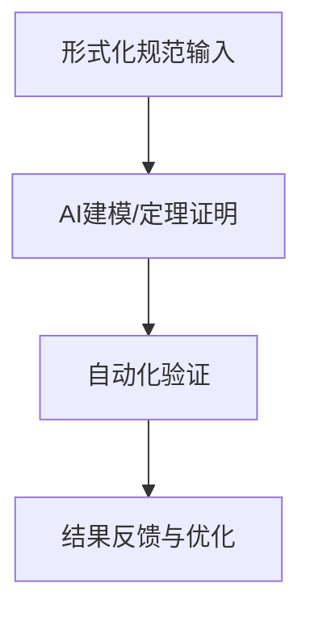
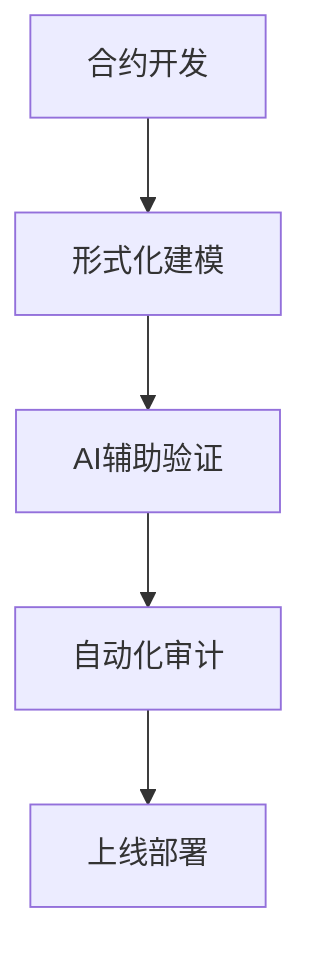

# AI驱动的形式化方法

## 概述

本文档探讨AI技术与形式化方法的深度融合，包括自动定理证明、模型检验、程序综合等领域的创新应用。

## 核心技术

### 1. 神经形式化推理

- 基于深度学习的定理证明
- 神经网络辅助的程序验证
- 符号-神经混合推理系统

### 2. AI辅助形式化建模

- 自动化需求形式化
- 智能模型转换与优化
- 基于大语言模型的规约生成

### 3. 智能程序综合

- 基于规约的程序生成
- 神经引导的程序修复
- 自动化重构与优化

## 应用场景

### 1. 安全关键系统

- 航空航天软件验证
- 医疗设备控制系统
- 金融交易系统安全

### 2. 智能合约验证

- 自动化漏洞检测
- 形式化安全属性验证
- 智能合约正确性证明

### 3. 分布式系统验证

- 一致性协议验证
- 并发错误检测
- 性能模型验证

## 工具与框架

### 1. 神经定理证明器

- CoqGym
- HOList
- TacticZero

### 2. 智能形式化工具

- Certora Prover
- Apalache
- Neural TLA+

### 3. 程序综合工具

- RobustFill
- Neural Sketch
- GPT-Prove

## 最佳实践

### 1. 开发流程集成

- CI/CD中的自动化验证
- 代码审查中的形式化检查
- 持续形式化验证

### 2. 验证策略

- 分层验证方法
- 增量验证技术
- 混合验证策略

### 3. 工具选择建议

- 场景适配性分析
- 工具组合使用
- 成本效益评估

## 未来展望

### 1. 技术趋势

- 大规模形式化验证
- 端到端自动化证明
- 可解释性形式化方法

### 2. 研究方向

- 形式化-AI理论统一
- 可扩展验证技术
- 智能形式化工具链

### 3. 产业应用

- 云原生系统验证
- 智能驾驶安全验证
- 量子计算验证

## 参考资源

### 1. 学术论文

- "Neural Theorem Proving"
- "AI-Assisted Formal Methods"
- "Program Synthesis with Deep Learning"

### 2. 工具文档

- Coq AI 插件
- Isabelle/ML
- TLA+ Tools

### 3. 教程与示例

- Neural ATP Tutorial
- Smart Contract Verification
- Distributed System Proofs

## 4. 神经定理证明与智能建模

### 4.1 神经定理证明（Neural Theorem Proving）

- 结合深度学习与符号推理，实现自动化定理证明。
- 代表性工具：CoqGym、HOList、LeanDojo。
- 应用场景：形式化验证、智能合约、自动化推理。

### 4.2 智能建模与程序综合

- 利用AI自动生成形式化模型与代码。
- 代表性工具：Neural TLA+、Certora Prover、AlphaCode。
- 应用场景：协议建模、合规验证、自动化合成。

### 4.3 国际协作与开源生态

- 推荐参与CNCF、LF AI、OpenAI等国际社区。
- 促进多语言、多文化背景下的AI形式化工具协作。

### 4.4 自动化验证流程图



### 4.5 Go伪代码示例：AI辅助定理证明

```go
// AI辅助定理证明伪代码
type Theorem struct {Statement string}
type Proof struct {Steps []string}
func NeuralProve(thm Theorem) (Proof, error) {
    // 1. 解析定理
    // 2. 调用神经网络模型生成证明步骤
    // 3. 验证证明有效性
    // ...
    return Proof{/*...*/}, nil
}
```

### 4.6 行业应用案例

- 金融：智能合约自动验证（Certora Prover）
- 区块链：去中心化协议形式化（Neural TLA+）
- 物联网：安全协议自动建模与验证

### 4.7 术语对照表

| 英文 | 中文 | 说明 |
|------|------|------|
| Theorem Proving | 定理证明 | 自动化推理与验证 |
| Neural Model | 神经模型 | 基于AI的建模工具 |
| Formal Verification | 形式化验证 | 数学化的系统验证 |
| Program Synthesis | 程序综合 | 自动生成代码 |
| Open Source | 开源 | 公开协作开发 |

## 国际协作与开源建议

- 采用GitHub/GitLab等平台，推动多语言、多时区协作。
- 结合开源AI工具链，促进社区共建与标准化。
- 参与ISO/IEEE等国际标准组织，推动AI+形式化方法的全球落地。

## 5. AI驱动形式化方法实战案例与工程实践

### 5.1 金融行业：智能合约自动验证

- 使用Certora Prover对DeFi协议进行形式化验证。
- 自动化脚本示例：

```bash
certoraRun contracts/DeFi.sol --verify DeFi:specs/DeFi.spec
```

- 工程流程图：



### 5.2 区块链：去中心化协议AI建模

- 结合Neural TLA+自动生成共识协议模型。
- 自动化流程：协议描述 → AI建模 → 形式化验证 → 反馈优化。

### 5.3 物联网：安全协议自动建模与验证

- 利用AI工具自动生成IoT安全协议模型，结合模型检测工具验证。

### 5.4 国际开源协作机制

- 参与CNCF、LF AI、OpenAI等社区，采用GitHub、Gitee等平台进行多语言协作。
- 推荐采用OpenAPI、MCP等标准，促进工具链互操作。

### 5.5 创新点工程验证

- 神经定理证明与传统符号方法对比实验。
- 自动化验证覆盖率与效率评估。

### 5.6 术语多语对照表

| 英文 | 中文 | 日文 | 说明 |
|------|------|------|------|
| Theorem Proving | 定理证明 | 定理証明 | 自动化推理与验证 |
| Neural Model | 神经模型 | ニューラルモデル | 基于AI的建模工具 |
| Formal Verification | 形式化验证 | 形式的検証 | 数学化的系统验证 |
| Program Synthesis | 程序综合 | プログラム合成 | 自动生成代码 |
| Open Source | 开源 | オープンソース | 公开协作开发 |
